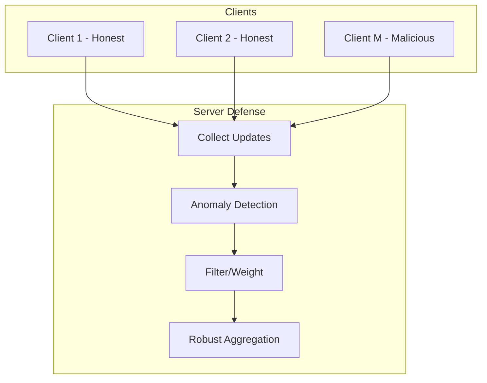

# Tutorial 093: FL Data Poisoning Defense

---

## Metadata

| Property | Value |
|----------|-------|
| **Tutorial ID** | 093 |
| **Title** | FL Data Poisoning Defense |
| **Category** | Security |
| **Difficulty** | Advanced |
| **Duration** | 90 minutes |
| **Prerequisites** | Tutorial 001-092 |
| **Author** | Unbitrium Contributors |
| **Last Updated** | January 2026 |

---

## Learning Objectives

By the end of this tutorial, you will be able to:

1. **Understand** data poisoning attacks in federated learning.
2. **Implement** robust aggregation defense mechanisms.
3. **Design** attack detection systems.
4. **Analyze** defense effectiveness against various attacks.
5. **Apply** Byzantine-resilient aggregation rules.
6. **Evaluate** trade-offs between robustness and accuracy.
7. **Create** custom defense strategies.

---

## Prerequisites

- **Completed Tutorials**: 001-092
- **Knowledge**: ML security, statistics
- **Libraries**: PyTorch, NumPy

```python
import torch
import torch.nn as nn
import torch.nn.functional as F
import numpy as np
from dataclasses import dataclass
from typing import Any, Dict, List, Tuple
from torch.utils.data import Dataset, DataLoader
import copy
print(f"PyTorch: {torch.__version__}")
```

---

## Background and Theory

### Data Poisoning Attack Types

| Attack | Description | Goal |
|--------|-------------|------|
| Label flipping | Change label assignments | Reduce accuracy |
| Backdoor | Add trigger pattern | Hidden misclassification |
| Clean-label | Poison without changing labels | Subtle manipulation |
| Gradient manipulation | Modify gradients directly | Model poisoning |

### Defense Mechanisms

| Defense | Type | Description |
|---------|------|-------------|
| Median | Robust aggregation | Element-wise median |
| Trimmed Mean | Robust aggregation | Remove extremes |
| Krum | Selection-based | Choose most central |
| Multi-Krum | Selection-based | Average of m best |
| FoolsGold | Reputation-based | Score by diversity |
| Norm clipping | Gradient bounding | Limit update magnitude |

### Defense Architecture



---

## Implementation Code

### Part 1: Configuration and Attack Simulation

```python
#!/usr/bin/env python3
"""
Tutorial 093: FL Data Poisoning Defense

Comprehensive implementation of data poisoning attacks
and defense mechanisms for federated learning.

Author: Unbitrium Contributors
License: EUPL-1.2
"""

from __future__ import annotations
import copy
from dataclasses import dataclass
from typing import Any, Dict, List, Tuple, Optional
from enum import Enum
import numpy as np
import torch
import torch.nn as nn
import torch.nn.functional as F
from torch.utils.data import Dataset, DataLoader


class AttackType(Enum):
    """Types of data poisoning attacks."""
    NONE = "none"
    LABEL_FLIP = "label_flip"
    RANDOM_NOISE = "random_noise"
    GRADIENT_SCALE = "gradient_scale"
    SIGN_FLIP = "sign_flip"


class DefenseType(Enum):
    """Types of defense mechanisms."""
    NONE = "none"
    MEDIAN = "median"
    TRIMMED_MEAN = "trimmed_mean"
    KRUM = "krum"
    MULTI_KRUM = "multi_krum"
    NORM_CLIP = "norm_clip"


@dataclass
class PoisonConfig:
    """Configuration for poisoning experiments."""

    # General
    num_rounds: int = 50
    num_clients: int = 20
    clients_per_round: int = 10
    local_epochs: int = 2
    batch_size: int = 32
    learning_rate: float = 0.01
    seed: int = 42

    # Attack
    attack_type: AttackType = AttackType.LABEL_FLIP
    num_malicious: int = 4  # 20% of clients
    poison_ratio: float = 1.0  # Fraction of malicious client's data to poison
    scale_factor: float = 10.0  # For gradient scaling attack

    # Defense
    defense_type: DefenseType = DefenseType.MEDIAN
    trim_ratio: float = 0.2  # For trimmed mean
    num_krum: int = 3  # For multi-krum
    clip_norm: float = 10.0  # For norm clipping

    # Model
    input_dim: int = 32
    hidden_dim: int = 64
    num_classes: int = 10


class PoisonDataset(Dataset):
    """Dataset with optional poisoning."""

    def __init__(
        self,
        features: np.ndarray,
        labels: np.ndarray,
        poisoned: bool = False,
        attack_type: AttackType = AttackType.NONE,
        num_classes: int = 10,
    ):
        self.features = torch.FloatTensor(features)
        self.original_labels = torch.LongTensor(labels)

        if poisoned and attack_type == AttackType.LABEL_FLIP:
            # Flip labels to random other class
            self.labels = (self.original_labels + 1) % num_classes
        else:
            self.labels = self.original_labels.clone()

        self.poisoned = poisoned

    def __len__(self): return len(self.labels)
    def __getitem__(self, idx): return self.features[idx], self.labels[idx]


class PoisonModel(nn.Module):
    """Simple model for poisoning experiments."""

    def __init__(self, config: PoisonConfig):
        super().__init__()
        self.network = nn.Sequential(
            nn.Linear(config.input_dim, config.hidden_dim),
            nn.ReLU(),
            nn.Linear(config.hidden_dim, config.num_classes),
        )

    def forward(self, x): return self.network(x)


class RobustAggregator:
    """Implements various robust aggregation methods."""

    def __init__(self, config: PoisonConfig):
        self.config = config

    def _flatten_state(self, state_dict: Dict[str, torch.Tensor]) -> torch.Tensor:
        """Flatten state dict to single vector."""
        return torch.cat([v.flatten() for v in state_dict.values()])

    def _unflatten_state(
        self,
        flat: torch.Tensor,
        template: Dict[str, torch.Tensor],
    ) -> Dict[str, torch.Tensor]:
        """Unflatten vector back to state dict."""
        result = {}
        offset = 0
        for name, param in template.items():
            size = param.numel()
            result[name] = flat[offset:offset + size].view(param.shape)
            offset += size
        return result

    def median(self, updates: List[Dict]) -> Dict[str, torch.Tensor]:
        """Coordinate-wise median aggregation."""
        template = updates[0]["state_dict"]
        stacked = torch.stack([self._flatten_state(u["state_dict"]) for u in updates])
        median_flat = stacked.median(dim=0).values
        return self._unflatten_state(median_flat, template)

    def trimmed_mean(self, updates: List[Dict]) -> Dict[str, torch.Tensor]:
        """Trimmed mean aggregation."""
        template = updates[0]["state_dict"]
        stacked = torch.stack([self._flatten_state(u["state_dict"]) for u in updates])

        n = len(updates)
        trim_count = int(n * self.config.trim_ratio)

        if trim_count > 0:
            sorted_vals, _ = stacked.sort(dim=0)
            trimmed = sorted_vals[trim_count:n - trim_count]
        else:
            trimmed = stacked

        mean_flat = trimmed.mean(dim=0)
        return self._unflatten_state(mean_flat, template)

    def krum(self, updates: List[Dict], multi: bool = False) -> Dict[str, torch.Tensor]:
        """Krum / Multi-Krum aggregation."""
        n = len(updates)
        f = self.config.num_malicious

        # Flatten all updates
        flattened = [self._flatten_state(u["state_dict"]) for u in updates]

        # Compute pairwise distances
        scores = []
        for i in range(n):
            distances = []
            for j in range(n):
                if i != j:
                    dist = torch.norm(flattened[i] - flattened[j]).item()
                    distances.append(dist)
            distances.sort()
            # Sum of n-f-2 smallest distances
            score = sum(distances[:n - f - 2]) if n - f - 2 > 0 else sum(distances)
            scores.append(score)

        if multi:
            # Multi-Krum: average of m best
            m = self.config.num_krum
            best_indices = np.argsort(scores)[:m]
            selected = [flattened[i] for i in best_indices]
            result_flat = torch.stack(selected).mean(dim=0)
        else:
            # Krum: single best
            best_idx = np.argmin(scores)
            result_flat = flattened[best_idx]

        return self._unflatten_state(result_flat, updates[0]["state_dict"])

    def norm_clip(self, updates: List[Dict]) -> Dict[str, torch.Tensor]:
        """Clip updates by norm, then average."""
        clipped = []

        for u in updates:
            flat = self._flatten_state(u["state_dict"])
            norm = torch.norm(flat)

            if norm > self.config.clip_norm:
                flat = flat * (self.config.clip_norm / norm)

            clipped.append(flat)

        mean_flat = torch.stack(clipped).mean(dim=0)
        return self._unflatten_state(mean_flat, updates[0]["state_dict"])

    def aggregate(self, updates: List[Dict]) -> Dict[str, torch.Tensor]:
        """Aggregate using configured defense."""
        if self.config.defense_type == DefenseType.MEDIAN:
            return self.median(updates)
        elif self.config.defense_type == DefenseType.TRIMMED_MEAN:
            return self.trimmed_mean(updates)
        elif self.config.defense_type == DefenseType.KRUM:
            return self.krum(updates, multi=False)
        elif self.config.defense_type == DefenseType.MULTI_KRUM:
            return self.krum(updates, multi=True)
        elif self.config.defense_type == DefenseType.NORM_CLIP:
            return self.norm_clip(updates)
        else:
            # Standard FedAvg
            total = sum(u["num_samples"] for u in updates)
            result = {}
            for key in updates[0]["state_dict"]:
                result[key] = sum(
                    (u["num_samples"]/total) * u["state_dict"][key].float()
                    for u in updates
                )
            return result
```

### Part 2: FL System with Defense

```python
def create_data(config: PoisonConfig) -> Tuple[List[PoisonDataset], PoisonDataset, List[int]]:
    """Create data with some malicious clients."""
    np.random.seed(config.seed)

    malicious_ids = list(range(config.num_malicious))

    datasets = []
    for i in range(config.num_clients):
        n = np.random.randint(80, 120)
        x = np.random.randn(n, config.input_dim).astype(np.float32)
        y = np.random.randint(0, config.num_classes, n)

        for j in range(n):
            x[j, y[j] % config.input_dim] += 2.0

        is_malicious = i in malicious_ids
        datasets.append(PoisonDataset(
            x, y,
            poisoned=is_malicious,
            attack_type=config.attack_type,
            num_classes=config.num_classes,
        ))

    # Test set
    test_x = np.random.randn(500, config.input_dim).astype(np.float32)
    test_y = np.random.randint(0, config.num_classes, 500)
    for j in range(500):
        test_x[j, test_y[j] % config.input_dim] += 2.0

    return datasets, PoisonDataset(test_x, test_y), malicious_ids


class PoisonClient:
    """Client with optional attack behavior."""

    def __init__(self, client_id: int, dataset: PoisonDataset, config: PoisonConfig):
        self.client_id = client_id
        self.dataset = dataset
        self.config = config
        self.is_malicious = dataset.poisoned

    def train(self, model: nn.Module) -> Dict[str, Any]:
        local = copy.deepcopy(model)
        opt = torch.optim.SGD(local.parameters(), lr=self.config.learning_rate)
        loader = DataLoader(self.dataset, batch_size=self.config.batch_size, shuffle=True)

        local.train()
        for _ in range(self.config.local_epochs):
            for x, y in loader:
                opt.zero_grad()
                loss = F.cross_entropy(local(x), y)
                loss.backward()
                opt.step()

        state = {k: v.cpu() for k, v in local.state_dict().items()}

        # Apply gradient-based attacks
        if self.is_malicious:
            if self.config.attack_type == AttackType.GRADIENT_SCALE:
                state = {k: v * self.config.scale_factor for k, v in state.items()}
            elif self.config.attack_type == AttackType.SIGN_FLIP:
                state = {k: -v for k, v in state.items()}
            elif self.config.attack_type == AttackType.RANDOM_NOISE:
                state = {k: v + torch.randn_like(v) * 5.0 for k, v in state.items()}

        return {"state_dict": state, "num_samples": len(self.dataset)}


class DefenseServer:
    """Server with robust aggregation."""

    def __init__(self, model: nn.Module, clients: List[PoisonClient],
                 test_dataset: PoisonDataset, config: PoisonConfig):
        self.model = model
        self.clients = clients
        self.test_dataset = test_dataset
        self.config = config
        self.aggregator = RobustAggregator(config)
        self.history = []

    def evaluate(self) -> float:
        self.model.eval()
        loader = DataLoader(self.test_dataset, batch_size=128)
        correct, total = 0, 0
        with torch.no_grad():
            for x, y in loader:
                correct += (self.model(x).argmax(1) == y).sum().item()
                total += len(y)
        return correct / total

    def train(self) -> List[Dict]:
        for r in range(self.config.num_rounds):
            selected = np.random.choice(self.clients, min(self.config.clients_per_round, len(self.clients)), replace=False)
            updates = [c.train(self.model) for c in selected]

            new_state = self.aggregator.aggregate(updates)
            self.model.load_state_dict(new_state)

            acc = self.evaluate()
            self.history.append({"round": r, "accuracy": acc})

            if (r + 1) % 10 == 0:
                print(f"Round {r+1}: acc={acc:.4f}")

        return self.history


def compare_defenses():
    """Compare different defense mechanisms."""
    results = {}

    for defense in [DefenseType.NONE, DefenseType.MEDIAN, DefenseType.TRIMMED_MEAN, DefenseType.KRUM]:
        config = PoisonConfig(
            num_rounds=30,
            num_clients=10,
            num_malicious=2,
            attack_type=AttackType.LABEL_FLIP,
            defense_type=defense,
        )

        torch.manual_seed(config.seed)
        np.random.seed(config.seed)

        datasets, test, _ = create_data(config)
        clients = [PoisonClient(i, d, config) for i, d in enumerate(datasets)]
        model = PoisonModel(config)
        server = DefenseServer(model, clients, test, config)

        print(f"\n=== {defense.value.upper()} ===")
        history = server.train()
        results[defense.value] = history[-1]["accuracy"]

    print("\n=== Results ===")
    for name, acc in results.items():
        print(f"{name}: {acc:.4f}")


if __name__ == "__main__":
    compare_defenses()
```

---

## Exercises

1. **Exercise 1**: Implement FoolsGold defense.
2. **Exercise 2**: Add backdoor attack simulation.
3. **Exercise 3**: Create anomaly detection system.
4. **Exercise 4**: Implement FLAME defense.
5. **Exercise 5**: Add adaptive attack that evades detection.

---

## References

1. Blanchard, P., et al. (2017). Machine learning with adversaries: Byzantine tolerant gradient descent. In *NeurIPS*.
2. Yin, D., et al. (2018). Byzantine-resilient distributed learning. In *ICML*.
3. Fung, C., et al. (2020). FoolsGold: Mitigating sybils in FL. In *SaTML*.
4. Bagdasaryan, E., et al. (2020). How to backdoor FL. In *AISTATS*.
5. Sun, Z., et al. (2019). Can you really backdoor FL? *arXiv*.

---

*Copyright 2026 Olaf Yunus Laitinen Imanov and Contributors. Released under EUPL 1.2.*
