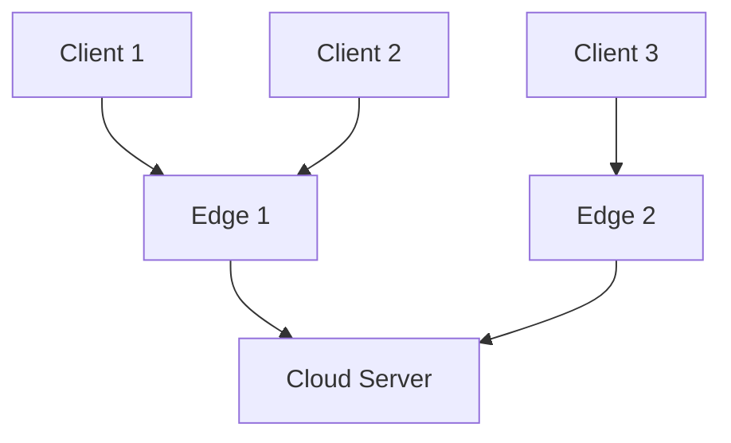

# Tutorial 101: Hierarchical Federated Learning

This tutorial covers hierarchical FL (multi-tier aggregation).

## Background

- **Two-tier hierarchy**: Edge servers aggregate regionally, cloud aggregates globally.
- **Benefits**: Reduced communication latency and bandwidth to centralized server.

## Configuration

```yaml
hierarchy:
  tiers: 2
  regions: 5
  clients_per_region: 20
  local_rounds_per_global: 5
```

## Data Flow



## Exercises

1. Communication cost comparison vs flat FL.
2. Convergence analysis under hierarchical aggregation.
