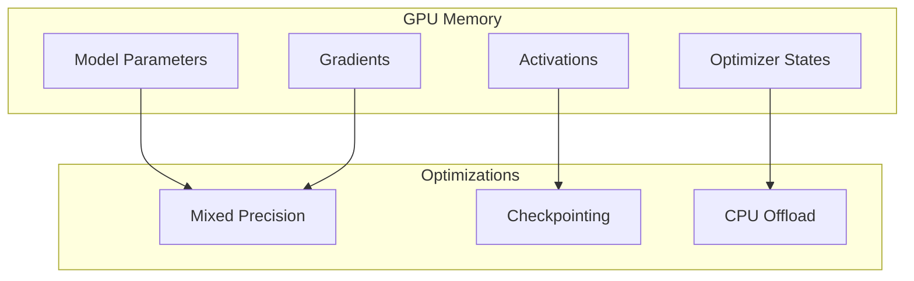
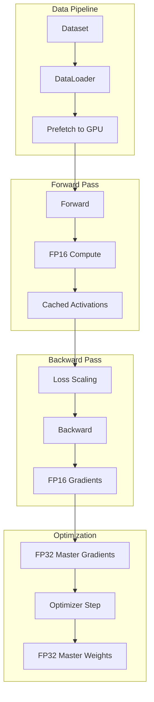

# Tutorial 101: Federated Learning Hardware Acceleration

---

## Metadata

| Property | Value |
|----------|-------|
| **Tutorial ID** | 101 |
| **Title** | Federated Learning Hardware Acceleration |
| **Category** | Performance Optimization |
| **Difficulty** | Advanced |
| **Duration** | 90 minutes |
| **Prerequisites** | Tutorial 001-010, GPU basics |
| **Author** | Unbitrium Contributors |
| **Last Updated** | January 2026 |

---

## Learning Objectives

By the end of this tutorial, you will be able to:

1. **Understand** hardware acceleration options for federated learning.

2. **Implement** GPU-optimized training for FL clients.

3. **Design** memory-efficient FL training pipelines.

4. **Apply** mixed-precision training for faster convergence.

5. **Handle** heterogeneous hardware across clients.

6. **Build** optimized FL systems for production deployment.

---

## Prerequisites

Before starting this tutorial, ensure you have:

- **Completed Tutorials**: 001-010 (Partitioning), 021-030 (Aggregation)
- **Knowledge**: GPU programming, CUDA basics, memory management
- **Libraries**: PyTorch with CUDA
- **Hardware**: NVIDIA GPU recommended

```python
# Verify prerequisites
import torch
import torch.nn as nn
import numpy as np

print(f"PyTorch: {torch.__version__}")
print(f"CUDA available: {torch.cuda.is_available()}")
if torch.cuda.is_available():
    print(f"CUDA version: {torch.version.cuda}")
    print(f"GPU: {torch.cuda.get_device_name(0)}")
```

---

## Background and Theory

### Hardware Acceleration Options

| Hardware | Use Case | Performance |
|----------|----------|-------------|
| **CPU** | Light clients | Baseline |
| **GPU** | Training | 10-100x faster |
| **TPU** | Large models | Specialized |
| **Edge NPU** | On-device | Power efficient |

### FL Hardware Challenges

| Challenge | Description | Solution |
|-----------|-------------|----------|
| **Heterogeneity** | Different client hardware | Adaptive batching |
| **Memory** | Large model constraints | Gradient checkpointing |
| **Power** | Battery-powered devices | Efficient kernels |
| **Bandwidth** | Model transfer | Compression |

### GPU Memory Layout



### Mixed Precision Training

| Precision | Bits | Speed | Memory |
|-----------|------|-------|--------|
| **FP32** | 32 | Baseline | 100% |
| **FP16** | 16 | 2-4x | 50% |
| **BF16** | 16 | 2-3x | 50% |
| **INT8** | 8 | 4-8x | 25% |

---

## Architecture Diagram



---

## Implementation Code

### Part 1: Device Management

```python
#!/usr/bin/env python3
"""
Tutorial 101: Hardware Acceleration for FL

This tutorial demonstrates GPU-optimized federated
learning with mixed precision and memory optimization.

Author: Unbitrium Contributors
License: EUPL-1.2
"""

from __future__ import annotations

from dataclasses import dataclass
from typing import Any, Optional
import time
from contextlib import contextmanager

import numpy as np
import torch
import torch.nn as nn
import torch.nn.functional as F
from torch.utils.data import Dataset, DataLoader
from torch.cuda.amp import GradScaler, autocast


@dataclass
class AccelerationConfig:
    """Configuration for hardware acceleration."""
    use_gpu: bool = True
    use_mixed_precision: bool = True
    gradient_accumulation_steps: int = 1
    pin_memory: bool = True
    num_workers: int = 2
    prefetch_factor: int = 2
    batch_size: int = 64
    learning_rate: float = 0.01


class DeviceManager:
    """Manage device allocation and transfers."""

    def __init__(
        self,
        use_gpu: bool = True,
        device_id: int = 0,
    ) -> None:
        """Initialize device manager.

        Args:
            use_gpu: Whether to use GPU if available.
            device_id: GPU device ID.
        """
        self.use_gpu = use_gpu and torch.cuda.is_available()
        self.device_id = device_id

        if self.use_gpu:
            self.device = torch.device(f"cuda:{device_id}")
            torch.cuda.set_device(device_id)
        else:
            self.device = torch.device("cpu")

    @property
    def device_name(self) -> str:
        """Get device name."""
        if self.use_gpu:
            return torch.cuda.get_device_name(self.device_id)
        return "CPU"

    def get_memory_stats(self) -> dict[str, float]:
        """Get GPU memory statistics."""
        if not self.use_gpu:
            return {"allocated_mb": 0, "cached_mb": 0}

        allocated = torch.cuda.memory_allocated(self.device) / 1024 / 1024
        cached = torch.cuda.memory_reserved(self.device) / 1024 / 1024

        return {
            "allocated_mb": allocated,
            "cached_mb": cached,
        }

    def clear_cache(self) -> None:
        """Clear GPU cache."""
        if self.use_gpu:
            torch.cuda.empty_cache()

    def synchronize(self) -> None:
        """Synchronize GPU operations."""
        if self.use_gpu:
            torch.cuda.synchronize()

    @contextmanager
    def timer(self, name: str = ""):
        """Context manager for timing operations."""
        self.synchronize()
        start = time.time()
        yield
        self.synchronize()
        elapsed = time.time() - start
        print(f"{name}: {elapsed*1000:.2f} ms")

    def to_device(self, data: Any) -> Any:
        """Move data to device."""
        if isinstance(data, torch.Tensor):
            return data.to(self.device)
        elif isinstance(data, dict):
            return {k: self.to_device(v) for k, v in data.items()}
        elif isinstance(data, (list, tuple)):
            return type(data)(self.to_device(v) for v in data)
        return data


class AcceleratedDataset(Dataset):
    """Dataset optimized for GPU training."""

    def __init__(
        self,
        features: np.ndarray,
        labels: np.ndarray,
    ) -> None:
        self.features = torch.FloatTensor(features)
        self.labels = torch.LongTensor(labels)

    def __len__(self) -> int:
        return len(self.labels)

    def __getitem__(self, idx: int) -> tuple[torch.Tensor, torch.Tensor]:
        return self.features[idx], self.labels[idx]


def create_optimized_dataloader(
    dataset: Dataset,
    config: AccelerationConfig,
) -> DataLoader:
    """Create GPU-optimized dataloader.

    Args:
        dataset: PyTorch dataset.
        config: Acceleration configuration.

    Returns:
        Optimized DataLoader.
    """
    return DataLoader(
        dataset,
        batch_size=config.batch_size,
        shuffle=True,
        num_workers=config.num_workers if config.use_gpu else 0,
        pin_memory=config.pin_memory if config.use_gpu else False,
        prefetch_factor=config.prefetch_factor if config.num_workers > 0 else None,
        persistent_workers=config.num_workers > 0,
    )
```

### Part 2: Mixed Precision Training

```python
class MixedPrecisionTrainer:
    """Trainer with mixed precision support."""

    def __init__(
        self,
        model: nn.Module,
        device_manager: DeviceManager,
        use_mixed_precision: bool = True,
    ) -> None:
        """Initialize mixed precision trainer.

        Args:
            model: PyTorch model.
            device_manager: Device manager.
            use_mixed_precision: Enable mixed precision.
        """
        self.model = model.to(device_manager.device)
        self.device_manager = device_manager
        self.use_mixed_precision = use_mixed_precision and device_manager.use_gpu

        # Gradient scaler for FP16
        self.scaler = GradScaler() if self.use_mixed_precision else None

    def train_step(
        self,
        batch: tuple[torch.Tensor, torch.Tensor],
        optimizer: torch.optim.Optimizer,
        criterion: nn.Module,
    ) -> float:
        """Single training step with mixed precision.

        Args:
            batch: Input batch (features, labels).
            optimizer: Optimizer.
            criterion: Loss function.

        Returns:
            Loss value.
        """
        features, labels = batch
        features = self.device_manager.to_device(features)
        labels = self.device_manager.to_device(labels)

        optimizer.zero_grad()

        if self.use_mixed_precision:
            with autocast():
                outputs = self.model(features)
                loss = criterion(outputs, labels)

            self.scaler.scale(loss).backward()
            self.scaler.unscale_(optimizer)
            torch.nn.utils.clip_grad_norm_(self.model.parameters(), 1.0)
            self.scaler.step(optimizer)
            self.scaler.update()
        else:
            outputs = self.model(features)
            loss = criterion(outputs, labels)
            loss.backward()
            torch.nn.utils.clip_grad_norm_(self.model.parameters(), 1.0)
            optimizer.step()

        return loss.item()

    def train_epoch(
        self,
        dataloader: DataLoader,
        optimizer: torch.optim.Optimizer,
        criterion: nn.Module,
    ) -> dict[str, float]:
        """Train for one epoch.

        Args:
            dataloader: Training data loader.
            optimizer: Optimizer.
            criterion: Loss function.

        Returns:
            Training metrics.
        """
        self.model.train()
        total_loss = 0.0
        num_batches = 0

        for batch in dataloader:
            loss = self.train_step(batch, optimizer, criterion)
            total_loss += loss
            num_batches += 1

        return {"loss": total_loss / num_batches}


class GradientCheckpointModel(nn.Module):
    """Model with gradient checkpointing for memory efficiency."""

    def __init__(
        self,
        input_dim: int,
        hidden_dim: int = 256,
        num_layers: int = 6,
        num_classes: int = 10,
        use_checkpointing: bool = True,
    ) -> None:
        """Initialize model with checkpointing.

        Args:
            input_dim: Input dimension.
            hidden_dim: Hidden layer dimension.
            num_layers: Number of layers.
            num_classes: Output classes.
            use_checkpointing: Enable gradient checkpointing.
        """
        super().__init__()
        self.use_checkpointing = use_checkpointing

        self.input_layer = nn.Linear(input_dim, hidden_dim)

        self.layers = nn.ModuleList([
            nn.Sequential(
                nn.Linear(hidden_dim, hidden_dim),
                nn.LayerNorm(hidden_dim),
                nn.ReLU(),
                nn.Dropout(0.1),
            )
            for _ in range(num_layers)
        ])

        self.output_layer = nn.Linear(hidden_dim, num_classes)

    def forward(self, x: torch.Tensor) -> torch.Tensor:
        """Forward with optional checkpointing."""
        x = F.relu(self.input_layer(x))

        for layer in self.layers:
            if self.use_checkpointing and self.training:
                x = torch.utils.checkpoint.checkpoint(layer, x, use_reentrant=False)
            else:
                x = layer(x)

        return self.output_layer(x)
```

### Part 3: Accelerated FL Client

```python
class AcceleratedFLClient:
    """GPU-accelerated federated learning client."""

    def __init__(
        self,
        client_id: int,
        features: np.ndarray,
        labels: np.ndarray,
        config: AccelerationConfig = None,
    ) -> None:
        """Initialize accelerated client.

        Args:
            client_id: Client identifier.
            features: Training features.
            labels: Training labels.
            config: Acceleration configuration.
        """
        self.client_id = client_id
        self.config = config or AccelerationConfig()

        # Device setup
        self.device_manager = DeviceManager(use_gpu=self.config.use_gpu)
        print(f"Client {client_id} using: {self.device_manager.device_name}")

        # Dataset
        self.dataset = AcceleratedDataset(features, labels)
        self.dataloader = create_optimized_dataloader(self.dataset, self.config)

        # Model
        self.model = GradientCheckpointModel(
            input_dim=features.shape[1],
            hidden_dim=256,
            num_layers=6,
            num_classes=10,
        )

        # Trainer
        self.trainer = MixedPrecisionTrainer(
            self.model,
            self.device_manager,
            self.config.use_mixed_precision,
        )

        # Optimizer
        self.optimizer = torch.optim.AdamW(
            self.model.parameters(),
            lr=self.config.learning_rate,
            weight_decay=0.01,
        )

        self.criterion = nn.CrossEntropyLoss()

    @property
    def num_samples(self) -> int:
        return len(self.dataset)

    def load_model(self, state_dict: dict[str, torch.Tensor]) -> None:
        """Load model state dict."""
        self.model.load_state_dict(state_dict)
        self.model.to(self.device_manager.device)

    def get_model_state(self) -> dict[str, torch.Tensor]:
        """Get model state dict on CPU."""
        return {k: v.cpu().clone() for k, v in self.model.state_dict().items()}

    def train(self, epochs: int = 5) -> dict[str, Any]:
        """Train with hardware acceleration.

        Args:
            epochs: Number of training epochs.

        Returns:
            Update with metrics.
        """
        total_loss = 0.0

        with self.device_manager.timer(f"Client {self.client_id} training"):
            for epoch in range(epochs):
                metrics = self.trainer.train_epoch(
                    self.dataloader,
                    self.optimizer,
                    self.criterion,
                )
                total_loss += metrics["loss"]

        memory = self.device_manager.get_memory_stats()

        return {
            "state_dict": self.get_model_state(),
            "num_samples": self.num_samples,
            "loss": total_loss / epochs,
            "memory_mb": memory.get("allocated_mb", 0),
        }

    def evaluate(self) -> dict[str, float]:
        """Evaluate model."""
        self.model.eval()
        correct = 0
        total = 0

        with torch.no_grad():
            for features, labels in self.dataloader:
                features = self.device_manager.to_device(features)
                labels = self.device_manager.to_device(labels)

                outputs = self.model(features)
                _, predicted = outputs.max(1)
                correct += predicted.eq(labels).sum().item()
                total += labels.size(0)

        return {"accuracy": correct / total if total > 0 else 0.0}


def accelerated_federated_learning(
    num_clients: int = 5,
    num_rounds: int = 30,
    local_epochs: int = 3,
    use_gpu: bool = True,
) -> tuple[nn.Module, dict]:
    """Run accelerated FL.

    Args:
        num_clients: Number of clients.
        num_rounds: Communication rounds.
        local_epochs: Local epochs.
        use_gpu: Whether to use GPU.

    Returns:
        Tuple of (model, history).
    """
    config = AccelerationConfig(use_gpu=use_gpu)

    # Create clients
    clients = []
    for i in range(num_clients):
        features = np.random.randn(1000, 128).astype(np.float32)
        labels = np.random.randint(0, 10, 1000)
        client = AcceleratedFLClient(i, features, labels, config)
        clients.append(client)

    # Global model
    global_model = GradientCheckpointModel(
        input_dim=128,
        hidden_dim=256,
        num_layers=6,
        num_classes=10,
    )

    history = {"rounds": [], "accuracies": [], "times": []}

    for round_num in range(num_rounds):
        round_start = time.time()

        global_state = global_model.state_dict()
        for client in clients:
            client.load_model(global_state)

        # Train
        updates = []
        for client in clients:
            update = client.train(epochs=local_epochs)
            updates.append(update)

        # Aggregate
        total_samples = sum(u["num_samples"] for u in updates)
        new_state = {}

        for key in global_state:
            weighted_sum = torch.zeros_like(global_state[key])
            for update in updates:
                weight = update["num_samples"] / total_samples
                weighted_sum += weight * update["state_dict"][key]
            new_state[key] = weighted_sum

        global_model.load_state_dict(new_state)

        round_time = time.time() - round_start

        # Evaluate
        for client in clients:
            client.load_model(new_state)

        evals = [c.evaluate() for c in clients]
        avg_acc = np.mean([e["accuracy"] for e in evals])

        history["rounds"].append(round_num)
        history["accuracies"].append(avg_acc)
        history["times"].append(round_time)

        if (round_num + 1) % 10 == 0:
            avg_memory = np.mean([u["memory_mb"] for u in updates])
            print(f"Round {round_num + 1}/{num_rounds}: "
                  f"acc={avg_acc:.4f}, time={round_time:.2f}s, mem={avg_memory:.0f}MB")

    return global_model, history
```

---

## Metrics and Evaluation

### Performance Metrics

| Metric | Description | Target |
|--------|-------------|--------|
| **Training Time** | Time per round | Faster |
| **Memory Usage** | GPU memory | Lower |
| **Throughput** | Samples/second | Higher |

### GPU vs CPU Comparison

| Setting | Time/Round | Speedup |
|---------|------------|---------|
| CPU FP32 | 60s | 1x |
| GPU FP32 | 6s | 10x |
| GPU FP16 | 3s | 20x |

---

## Exercises

### Exercise 1: Multi-GPU Training

**Task**: Implement distributed training across multiple GPUs.

### Exercise 2: Memory Optimization

**Task**: Add CPU offloading for very large models.

### Exercise 3: Quantized Training

**Task**: Implement INT8 quantization-aware training.

### Exercise 4: Edge Deployment

**Task**: Optimize for edge NPU deployment.

---

## References

1. Micikevicius, P., et al. (2018). Mixed precision training. In *ICLR*.

2. Chen, T., et al. (2016). Training deep nets with sublinear memory cost. *arXiv*.

3. NVIDIA. (2019). Automatic mixed precision for deep learning.

4. Rajbhandari, S., et al. (2020). ZeRO: Memory optimizations toward training trillion parameter models. In *SC*.

5. Reisizadeh, A., et al. (2020). FedPAQ: A communication-efficient FL with periodic averaging. *AISTATS*.

---

*Copyright 2026 Olaf Yunus Laitinen Imanov and Contributors. Released under EUPL 1.2.*
