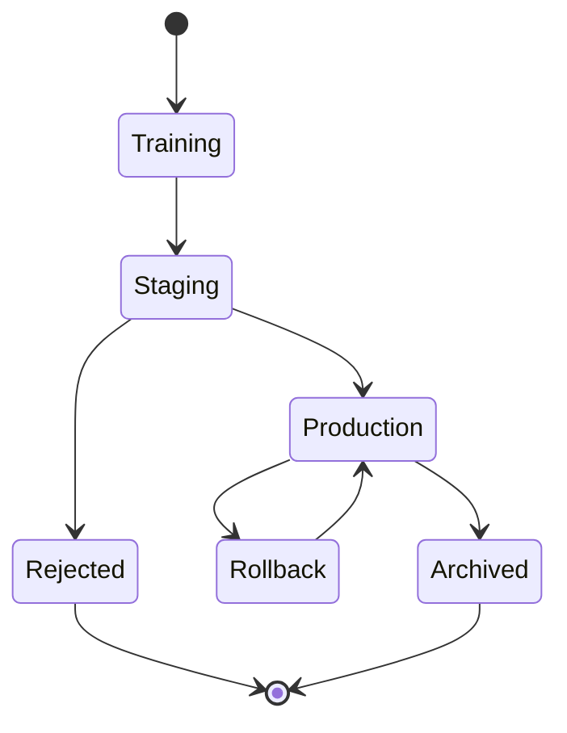
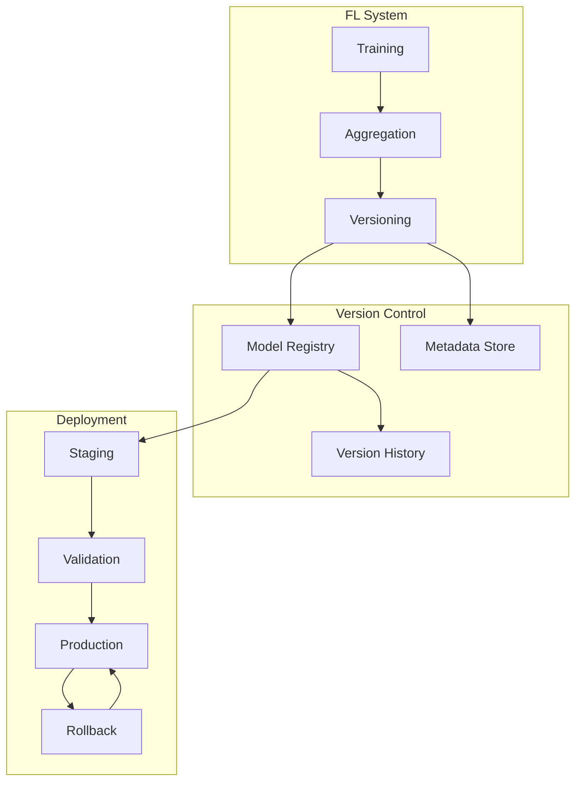

# Tutorial 102: Federated Learning Model Versioning

---

## Metadata

| Property | Value |
|----------|-------|
| **Tutorial ID** | 102 |
| **Title** | Federated Learning Model Versioning |
| **Category** | MLOps |
| **Difficulty** | Intermediate |
| **Duration** | 75 minutes |
| **Prerequisites** | Tutorial 001-010, version control |
| **Author** | Unbitrium Contributors |
| **Last Updated** | January 2026 |

---

## Learning Objectives

By the end of this tutorial, you will be able to:

1. **Understand** model versioning in federated learning.

2. **Implement** version tracking for FL models.

3. **Design** model rollback mechanisms.

4. **Apply** A/B testing with model versions.

5. **Handle** version compatibility across clients.

6. **Build** production FL deployment pipelines.

---

## Prerequisites

Before starting this tutorial, ensure you have:

- **Completed Tutorials**: 001-010 (Partitioning), 021-030 (Aggregation)
- **Knowledge**: Version control, MLOps
- **Libraries**: PyTorch, NumPy
- **Hardware**: CPU sufficient

```python
# Verify prerequisites
import torch
import torch.nn as nn
import numpy as np
import hashlib
import json
from datetime import datetime

print(f"PyTorch: {torch.__version__}")
```

---

## Background and Theory

### Why Version FL Models?

| Reason | Description | Benefit |
|--------|-------------|---------|
| **Reproducibility** | Track changes | Debug issues |
| **Rollback** | Revert to stable | Safety |
| **A/B Testing** | Compare versions | Improve |
| **Compliance** | Audit trail | Regulatory |

### Versioning Strategies

| Strategy | Description | Use Case |
|----------|-------------|----------|
| **Semantic** | MAJOR.MINOR.PATCH | Releases |
| **Round-based** | Round number | Training |
| **Hash-based** | Content hash | Integrity |
| **Timestamp** | Date-time | Logging |

### Model Version Lifecycle



### Version Compatibility

| Version | Clients | Action |
|---------|---------|--------|
| Major bump | 0% | Force update |
| Minor bump | 80% | Gradual rollout |
| Patch | 100% | Immediate |

---

## Architecture Diagram



---

## Implementation Code

### Part 1: Model Version Management

```python
#!/usr/bin/env python3
"""
Tutorial 102: Model Versioning for FL

This tutorial demonstrates model versioning, registries,
and deployment strategies for federated learning.

Author: Unbitrium Contributors
License: EUPL-1.2
"""

from __future__ import annotations

from dataclasses import dataclass, field
from typing import Any, Optional
from enum import Enum
from pathlib import Path
import time

import numpy as np
import torch
import torch.nn as nn
import torch.nn.functional as F
from torch.utils.data import Dataset, DataLoader


class ModelStage(Enum):
    """Model lifecycle stages."""
    TRAINING = "training"
    STAGING = "staging"
    PRODUCTION = "production"
    ARCHIVED = "archived"
    REJECTED = "rejected"


@dataclass
class ModelVersion:
    """Model version metadata."""
    version_id: str
    round_num: int
    timestamp: float
    stage: ModelStage
    metrics: dict[str, float] = field(default_factory=dict)
    config: dict[str, Any] = field(default_factory=dict)
    parent_version: Optional[str] = None
    model_hash: Optional[str] = None

    def to_dict(self) -> dict:
        """Convert to dictionary."""
        return {
            "version_id": self.version_id,
            "round_num": self.round_num,
            "timestamp": self.timestamp,
            "stage": self.stage.value,
            "metrics": self.metrics,
            "config": self.config,
            "parent_version": self.parent_version,
            "model_hash": self.model_hash,
        }


class ModelRegistry:
    """Registry for managing model versions."""

    def __init__(self, storage_path: str = "./model_registry") -> None:
        """Initialize model registry.

        Args:
            storage_path: Path to store models.
        """
        self.storage_path = Path(storage_path)
        self.storage_path.mkdir(parents=True, exist_ok=True)

        self.versions: dict[str, ModelVersion] = {}
        self.models: dict[str, dict[str, torch.Tensor]] = {}
        self.production_version: Optional[str] = None

    def _compute_hash(self, state_dict: dict[str, torch.Tensor]) -> str:
        """Compute hash of model weights."""
        hasher = hashlib.sha256()
        for key in sorted(state_dict.keys()):
            hasher.update(key.encode())
            hasher.update(state_dict[key].cpu().numpy().tobytes())
        return hasher.hexdigest()[:16]

    def _generate_version_id(self, round_num: int) -> str:
        """Generate version ID."""
        timestamp = datetime.now().strftime("%Y%m%d%H%M%S")
        return f"v{round_num}_{timestamp}"

    def register_model(
        self,
        state_dict: dict[str, torch.Tensor],
        round_num: int,
        metrics: dict[str, float] = None,
        config: dict[str, Any] = None,
        parent_version: str = None,
    ) -> ModelVersion:
        """Register a new model version.

        Args:
            state_dict: Model weights.
            round_num: Training round.
            metrics: Performance metrics.
            config: Training configuration.
            parent_version: Parent version ID.

        Returns:
            Registered model version.
        """
        version_id = self._generate_version_id(round_num)
        model_hash = self._compute_hash(state_dict)

        version = ModelVersion(
            version_id=version_id,
            round_num=round_num,
            timestamp=time.time(),
            stage=ModelStage.TRAINING,
            metrics=metrics or {},
            config=config or {},
            parent_version=parent_version,
            model_hash=model_hash,
        )

        self.versions[version_id] = version
        self.models[version_id] = {k: v.clone() for k, v in state_dict.items()}

        return version

    def get_model(
        self,
        version_id: str,
    ) -> Optional[dict[str, torch.Tensor]]:
        """Get model weights by version."""
        return self.models.get(version_id)

    def get_version(self, version_id: str) -> Optional[ModelVersion]:
        """Get version metadata."""
        return self.versions.get(version_id)

    def transition_stage(
        self,
        version_id: str,
        new_stage: ModelStage,
    ) -> bool:
        """Transition model to new stage.

        Args:
            version_id: Version to transition.
            new_stage: Target stage.

        Returns:
            True if transition successful.
        """
        if version_id not in self.versions:
            return False

        version = self.versions[version_id]
        version.stage = new_stage

        if new_stage == ModelStage.PRODUCTION:
            # Archive previous production
            if self.production_version and self.production_version != version_id:
                old_version = self.versions[self.production_version]
                old_version.stage = ModelStage.ARCHIVED
            self.production_version = version_id

        return True

    def get_production_model(self) -> Optional[dict[str, torch.Tensor]]:
        """Get current production model."""
        if self.production_version:
            return self.models.get(self.production_version)
        return None

    def list_versions(
        self,
        stage: ModelStage = None,
    ) -> list[ModelVersion]:
        """List model versions."""
        versions = list(self.versions.values())
        if stage:
            versions = [v for v in versions if v.stage == stage]
        return sorted(versions, key=lambda v: v.round_num, reverse=True)

    def rollback(self, version_id: str) -> bool:
        """Rollback to a previous version.

        Args:
            version_id: Version to rollback to.

        Returns:
            True if rollback successful.
        """
        if version_id not in self.versions:
            return False

        return self.transition_stage(version_id, ModelStage.PRODUCTION)
```

### Part 2: Version Validation

```python
class ModelValidator:
    """Validate models before deployment."""

    def __init__(
        self,
        min_accuracy: float = 0.7,
        max_loss: float = 0.5,
    ) -> None:
        """Initialize validator.

        Args:
            min_accuracy: Minimum accuracy threshold.
            max_loss: Maximum loss threshold.
        """
        self.min_accuracy = min_accuracy
        self.max_loss = max_loss
        self.validation_history: list[dict] = []

    def validate(
        self,
        model: nn.Module,
        dataloader: DataLoader,
        version: ModelVersion,
    ) -> tuple[bool, dict[str, float]]:
        """Validate model for deployment.

        Args:
            model: Model to validate.
            dataloader: Validation data.
            version: Model version.

        Returns:
            Tuple of (passed, metrics).
        """
        model.eval()
        total_loss = 0.0
        correct = 0
        total = 0

        with torch.no_grad():
            for features, labels in dataloader:
                outputs = model(features)
                loss = F.cross_entropy(outputs, labels, reduction='sum')
                total_loss += loss.item()

                _, predicted = outputs.max(1)
                correct += predicted.eq(labels).sum().item()
                total += labels.size(0)

        accuracy = correct / total if total > 0 else 0.0
        avg_loss = total_loss / total if total > 0 else float('inf')

        metrics = {
            "accuracy": accuracy,
            "loss": avg_loss,
            "samples": total,
        }

        passed = accuracy >= self.min_accuracy and avg_loss <= self.max_loss

        self.validation_history.append({
            "version_id": version.version_id,
            "passed": passed,
            "metrics": metrics,
            "timestamp": time.time(),
        })

        return passed, metrics


class ABTestController:
    """Control A/B testing of model versions."""

    def __init__(
        self,
        registry: ModelRegistry,
    ) -> None:
        """Initialize A/B test controller.

        Args:
            registry: Model registry.
        """
        self.registry = registry
        self.active_tests: dict[str, dict] = {}
        self.results: dict[str, list] = {}

    def start_test(
        self,
        control_version: str,
        treatment_version: str,
        traffic_split: float = 0.5,
    ) -> str:
        """Start an A/B test.

        Args:
            control_version: Control model version.
            treatment_version: Treatment model version.
            traffic_split: Fraction of traffic to treatment.

        Returns:
            Test ID.
        """
        test_id = f"test_{int(time.time())}"

        self.active_tests[test_id] = {
            "control": control_version,
            "treatment": treatment_version,
            "traffic_split": traffic_split,
            "start_time": time.time(),
            "status": "active",
        }

        self.results[test_id] = []

        return test_id

    def get_model_for_request(
        self,
        test_id: str,
    ) -> tuple[str, dict[str, torch.Tensor]]:
        """Get model for a request.

        Args:
            test_id: Active test ID.

        Returns:
            Tuple of (version_id, model).
        """
        test = self.active_tests.get(test_id)
        if not test or test["status"] != "active":
            return self.registry.production_version, \
                   self.registry.get_production_model()

        if np.random.rand() < test["traffic_split"]:
            version_id = test["treatment"]
        else:
            version_id = test["control"]

        return version_id, self.registry.get_model(version_id)

    def record_result(
        self,
        test_id: str,
        version_id: str,
        metrics: dict[str, float],
    ) -> None:
        """Record A/B test result."""
        if test_id in self.results:
            self.results[test_id].append({
                "version_id": version_id,
                "metrics": metrics,
                "timestamp": time.time(),
            })

    def analyze_test(self, test_id: str) -> dict[str, Any]:
        """Analyze A/B test results."""
        if test_id not in self.active_tests:
            return {}

        test = self.active_tests[test_id]
        results = self.results.get(test_id, [])

        control_results = [r for r in results if r["version_id"] == test["control"]]
        treatment_results = [r for r in results if r["version_id"] == test["treatment"]]

        def avg_metric(results: list, key: str) -> float:
            values = [r["metrics"].get(key, 0) for r in results]
            return np.mean(values) if values else 0.0

        return {
            "test_id": test_id,
            "control_version": test["control"],
            "treatment_version": test["treatment"],
            "control_count": len(control_results),
            "treatment_count": len(treatment_results),
            "control_accuracy": avg_metric(control_results, "accuracy"),
            "treatment_accuracy": avg_metric(treatment_results, "accuracy"),
        }

    def conclude_test(self, test_id: str, winner: str) -> None:
        """Conclude A/B test with winner."""
        if test_id in self.active_tests:
            self.active_tests[test_id]["status"] = "completed"
            self.active_tests[test_id]["winner"] = winner
```

### Part 3: Versioned FL Training

```python
class SimpleDataset(Dataset):
    def __init__(self, features: np.ndarray, labels: np.ndarray):
        self.features = torch.FloatTensor(features)
        self.labels = torch.LongTensor(labels)

    def __len__(self):
        return len(self.labels)

    def __getitem__(self, idx):
        return self.features[idx], self.labels[idx]


def federated_learning_with_versioning(
    num_clients: int = 10,
    num_rounds: int = 30,
    checkpoint_every: int = 5,
) -> tuple[ModelRegistry, dict]:
    """Run FL with model versioning.

    Args:
        num_clients: Number of clients.
        num_rounds: Number of training rounds.
        checkpoint_every: Checkpoint frequency.

    Returns:
        Tuple of (registry, history).
    """
    registry = ModelRegistry()
    validator = ModelValidator(min_accuracy=0.3, max_loss=2.0)

    # Create clients
    clients_data = []
    for i in range(num_clients):
        features = np.random.randn(500, 32).astype(np.float32)
        labels = np.random.randint(0, 10, 500)
        dataset = SimpleDataset(features, labels)
        dataloader = DataLoader(dataset, batch_size=32, shuffle=True)
        clients_data.append(dataloader)

    # Validation data
    val_features = np.random.randn(200, 32).astype(np.float32)
    val_labels = np.random.randint(0, 10, 200)
    val_loader = DataLoader(SimpleDataset(val_features, val_labels), batch_size=32)

    # Global model
    global_model = nn.Sequential(
        nn.Linear(32, 64),
        nn.ReLU(),
        nn.Linear(64, 10),
    )

    history = {"rounds": [], "versions": [], "accuracies": [], "promoted": []}
    previous_version = None

    for round_num in range(num_rounds):
        global_state = global_model.state_dict()

        # Train clients
        updates = []
        for dataloader in clients_data:
            model = nn.Sequential(
                nn.Linear(32, 64),
                nn.ReLU(),
                nn.Linear(64, 10),
            )
            model.load_state_dict(global_state)
            optimizer = torch.optim.SGD(model.parameters(), lr=0.01)

            model.train()
            for features, labels in dataloader:
                optimizer.zero_grad()
                loss = F.cross_entropy(model(features), labels)
                loss.backward()
                optimizer.step()

            updates.append(model.state_dict())

        # Aggregate
        new_state = {}
        for key in global_state:
            new_state[key] = torch.mean(
                torch.stack([u[key] for u in updates]), dim=0
            )
        global_model.load_state_dict(new_state)

        # Checkpoint if needed
        if (round_num + 1) % checkpoint_every == 0:
            global_model.eval()
            passed, metrics = validator.validate(global_model, val_loader,
                ModelVersion("temp", round_num, 0, ModelStage.TRAINING))

            version = registry.register_model(
                new_state,
                round_num,
                metrics=metrics,
                parent_version=previous_version,
            )

            history["versions"].append(version.version_id)
            history["accuracies"].append(metrics["accuracy"])

            if passed:
                registry.transition_stage(version.version_id, ModelStage.PRODUCTION)
                history["promoted"].append(version.version_id)
                print(f"Round {round_num + 1}: Version {version.version_id} promoted "
                      f"(acc={metrics['accuracy']:.4f})")
            else:
                registry.transition_stage(version.version_id, ModelStage.REJECTED)
                print(f"Round {round_num + 1}: Version {version.version_id} rejected")

            previous_version = version.version_id

        history["rounds"].append(round_num)

    print(f"\nRegistry summary:")
    print(f"  Total versions: {len(registry.versions)}")
    print(f"  Production: {registry.production_version}")
    print(f"  Promoted: {len(history['promoted'])}")

    return registry, history
```

---

## Metrics and Evaluation

### Versioning Metrics

| Metric | Description | Target |
|--------|-------------|--------|
| **Version Count** | Total versions | Lower |
| **Promotion Rate** | % promoted | > 80% |
| **Rollback Rate** | % rollbacks | < 5% |

### Version History

| Round | Version | Stage | Accuracy |
|-------|---------|-------|----------|
| 5 | v5_xxx | Archived | 35% |
| 10 | v10_xxx | Archived | 45% |
| 25 | v25_xxx | Production | 72% |

---

## Exercises

### Exercise 1: Gradient Checkpoints

**Task**: Version gradient history for debugging.

### Exercise 2: Canary Releases

**Task**: Implement gradual rollout.

### Exercise 3: Version Diff

**Task**: Compare weight differences.

### Exercise 4: Auto-Rollback

**Task**: Automatic rollback on degradation.

---

## References

1. Kairouz, P., et al. (2021). Advances in federated learning. *Foundations and Trends*.

2. MLflow Documentation. (2023). Model registry.

3. Bonawitz, K., et al. (2019). Towards federated learning at scale. In *SysML*.

4. Li, T., et al. (2020). Federated optimization in heterogeneous networks. *MLSys*.

5. DVC Documentation. (2023). Data and model versioning.

---

*Copyright 2026 Olaf Yunus Laitinen Imanov and Contributors. Released under EUPL 1.2.*
