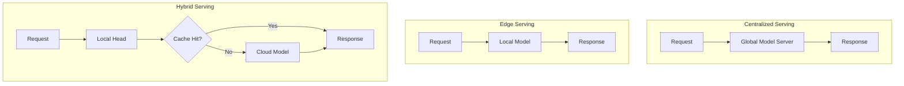
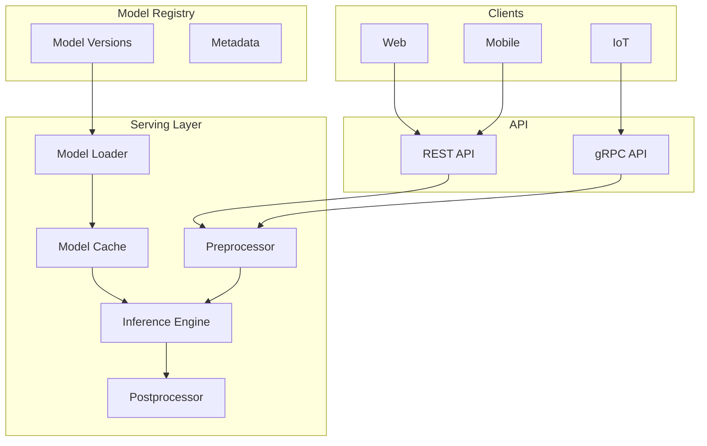

# Tutorial 103: Federated Learning Model Serving

---

## Metadata

| Property | Value |
|----------|-------|
| **Tutorial ID** | 103 |
| **Title** | Federated Learning Model Serving |
| **Category** | MLOps |
| **Difficulty** | Intermediate |
| **Duration** | 75 minutes |
| **Prerequisites** | Tutorial 001-010, model deployment |
| **Author** | Unbitrium Contributors |
| **Last Updated** | January 2026 |

---

## Learning Objectives

By the end of this tutorial, you will be able to:

1. **Understand** model serving in federated learning systems.

2. **Implement** inference APIs for FL models.

3. **Design** client-side and server-side serving.

4. **Apply** model caching and optimization.

5. **Handle** multi-model serving scenarios.

6. **Build** production-ready FL inference pipelines.

---

## Prerequisites

Before starting this tutorial, ensure you have:

- **Completed Tutorials**: 001-010 (Partitioning), 021-030 (Aggregation)
- **Knowledge**: REST APIs, model deployment
- **Libraries**: PyTorch, NumPy
- **Hardware**: CPU sufficient

```python
# Verify prerequisites
import torch
import torch.nn as nn
import numpy as np
from typing import Dict, List, Any

print(f"PyTorch: {torch.__version__}")
```

---

## Background and Theory

### Serving Architectures for FL

| Architecture | Description | Use Case |
|--------------|-------------|----------|
| **Centralized** | Single server serves | Simple deployment |
| **Edge** | Clients serve locally | Low latency |
| **Hybrid** | Both server and edge | Optimal |

### Serving Challenges

| Challenge | Description | Solution |
|-----------|-------------|----------|
| **Model size** | Download time | Compression |
| **Latency** | Response time | Caching |
| **Versioning** | Multiple models | Registry |
| **Personalization** | Per-client models | Local layers |

### Serving Patterns



### Model Optimization

| Technique | Speedup | Accuracy |
|-----------|---------|----------|
| **Quantization** | 2-4x | -1% |
| **Pruning** | 2-3x | -1% |
| **Distillation** | 5-10x | -2% |
| **ONNX** | 2x | Same |

---

## Architecture Diagram



---

## Implementation Code

### Part 1: Model Serving Infrastructure

```python
#!/usr/bin/env python3
"""
Tutorial 103: Model Serving for FL

This tutorial demonstrates model serving infrastructure
for federated learning with caching and optimization.

Author: Unbitrium Contributors
License: EUPL-1.2
"""

from __future__ import annotations

from dataclasses import dataclass, field
from typing import Any, Optional, Callable
from abc import ABC, abstractmethod
import time
import threading
from collections import OrderedDict

import numpy as np
import torch
import torch.nn as nn
import torch.nn.functional as F


@dataclass
class ServingConfig:
    """Configuration for model serving."""
    max_batch_size: int = 32
    max_wait_time_ms: int = 100
    cache_size: int = 5
    warmup_samples: int = 10
    num_workers: int = 4
    timeout_ms: int = 5000


class ModelCache:
    """LRU cache for model versions."""

    def __init__(self, max_size: int = 5) -> None:
        """Initialize model cache.

        Args:
            max_size: Maximum models to cache.
        """
        self.max_size = max_size
        self.cache: OrderedDict[str, nn.Module] = OrderedDict()
        self.lock = threading.Lock()

    def get(self, version_id: str) -> Optional[nn.Module]:
        """Get model from cache."""
        with self.lock:
            if version_id in self.cache:
                self.cache.move_to_end(version_id)
                return self.cache[version_id]
        return None

    def put(self, version_id: str, model: nn.Module) -> None:
        """Add model to cache."""
        with self.lock:
            if version_id in self.cache:
                self.cache.move_to_end(version_id)
            else:
                if len(self.cache) >= self.max_size:
                    self.cache.popitem(last=False)
                self.cache[version_id] = model

    def clear(self) -> None:
        """Clear cache."""
        with self.lock:
            self.cache.clear()


class Preprocessor:
    """Preprocess inputs for inference."""

    def __init__(
        self,
        normalize: bool = True,
        mean: Optional[np.ndarray] = None,
        std: Optional[np.ndarray] = None,
    ) -> None:
        """Initialize preprocessor.

        Args:
            normalize: Whether to normalize.
            mean: Feature means.
            std: Feature stds.
        """
        self.normalize = normalize
        self.mean = mean
        self.std = std

    def __call__(self, features: np.ndarray) -> torch.Tensor:
        """Preprocess features.

        Args:
            features: Raw features.

        Returns:
            Preprocessed tensor.
        """
        if self.normalize and self.mean is not None:
            features = (features - self.mean) / (self.std + 1e-8)

        return torch.FloatTensor(features)


class Postprocessor:
    """Postprocess model outputs."""

    def __init__(
        self,
        output_type: str = "classification",
        threshold: float = 0.5,
    ) -> None:
        """Initialize postprocessor.

        Args:
            output_type: Type of output (classification, regression).
            threshold: Classification threshold.
        """
        self.output_type = output_type
        self.threshold = threshold

    def __call__(self, outputs: torch.Tensor) -> dict[str, Any]:
        """Postprocess outputs.

        Args:
            outputs: Model outputs.

        Returns:
            Processed results.
        """
        if self.output_type == "classification":
            probs = F.softmax(outputs, dim=1)
            predictions = probs.argmax(dim=1)
            confidences = probs.max(dim=1).values

            return {
                "predictions": predictions.tolist(),
                "confidences": confidences.tolist(),
                "probabilities": probs.tolist(),
            }
        else:
            return {"predictions": outputs.tolist()}


class InferenceEngine:
    """Inference engine for model serving."""

    def __init__(
        self,
        model: nn.Module,
        preprocessor: Preprocessor = None,
        postprocessor: Postprocessor = None,
        config: ServingConfig = None,
    ) -> None:
        """Initialize inference engine.

        Args:
            model: Model to serve.
            preprocessor: Input preprocessor.
            postprocessor: Output postprocessor.
            config: Serving configuration.
        """
        self.model = model
        self.model.eval()
        self.preprocessor = preprocessor or Preprocessor(normalize=False)
        self.postprocessor = postprocessor or Postprocessor()
        self.config = config or ServingConfig()

        self.lock = threading.Lock()
        self.request_count = 0
        self.total_latency = 0.0

    def warmup(self, sample_input: np.ndarray) -> None:
        """Warmup model with sample inference.

        Args:
            sample_input: Sample input for warmup.
        """
        for _ in range(self.config.warmup_samples):
            self.predict(sample_input)

    def predict(self, features: np.ndarray) -> dict[str, Any]:
        """Make prediction.

        Args:
            features: Input features.

        Returns:
            Prediction results.
        """
        start_time = time.time()

        with self.lock:
            self.request_count += 1

        # Preprocess
        tensor = self.preprocessor(features)
        if tensor.dim() == 1:
            tensor = tensor.unsqueeze(0)

        # Inference
        with torch.no_grad():
            outputs = self.model(tensor)

        # Postprocess
        results = self.postprocessor(outputs)

        latency = (time.time() - start_time) * 1000
        with self.lock:
            self.total_latency += latency

        results["latency_ms"] = latency
        return results

    def batch_predict(
        self,
        batch_features: list[np.ndarray],
    ) -> list[dict[str, Any]]:
        """Batch prediction.

        Args:
            batch_features: List of feature arrays.

        Returns:
            List of prediction results.
        """
        # Stack into batch
        stacked = np.vstack(batch_features)
        tensor = self.preprocessor(stacked)

        with torch.no_grad():
            outputs = self.model(tensor)

        # Process each sample
        results = []
        for i in range(len(batch_features)):
            result = self.postprocessor(outputs[i:i+1])
            results.append(result)

        return results

    def get_stats(self) -> dict[str, float]:
        """Get serving statistics."""
        with self.lock:
            avg_latency = self.total_latency / max(1, self.request_count)
            return {
                "request_count": self.request_count,
                "avg_latency_ms": avg_latency,
            }
```

### Part 2: Serving Server

```python
class ModelServer:
    """Server for model serving."""

    def __init__(
        self,
        config: ServingConfig = None,
    ) -> None:
        """Initialize model server.

        Args:
            config: Serving configuration.
        """
        self.config = config or ServingConfig()
        self.cache = ModelCache(config.cache_size)
        self.engines: dict[str, InferenceEngine] = {}
        self.default_version: Optional[str] = None

    def load_model(
        self,
        version_id: str,
        model: nn.Module,
        preprocessor: Preprocessor = None,
        postprocessor: Postprocessor = None,
    ) -> None:
        """Load a model version.

        Args:
            version_id: Version identifier.
            model: Model to load.
            preprocessor: Input preprocessor.
            postprocessor: Output postprocessor.
        """
        model.eval()
        self.cache.put(version_id, model)

        engine = InferenceEngine(model, preprocessor, postprocessor, self.config)
        self.engines[version_id] = engine

        if self.default_version is None:
            self.default_version = version_id

    def set_default(self, version_id: str) -> None:
        """Set default model version."""
        if version_id in self.engines:
            self.default_version = version_id

    def predict(
        self,
        features: np.ndarray,
        version_id: str = None,
    ) -> dict[str, Any]:
        """Make prediction.

        Args:
            features: Input features.
            version_id: Optional version to use.

        Returns:
            Prediction results.
        """
        version = version_id or self.default_version
        if version not in self.engines:
            return {"error": f"Model version {version} not found"}

        engine = self.engines[version]
        result = engine.predict(features)
        result["model_version"] = version
        return result

    def health_check(self) -> dict[str, Any]:
        """Health check endpoint."""
        return {
            "status": "healthy",
            "loaded_models": list(self.engines.keys()),
            "default_version": self.default_version,
        }

    def get_all_stats(self) -> dict[str, Any]:
        """Get stats for all models."""
        return {
            version: engine.get_stats()
            for version, engine in self.engines.items()
        }


class EdgeModelServer:
    """Edge server for local model serving."""

    def __init__(
        self,
        global_model: nn.Module,
        local_model: nn.Module = None,
        config: ServingConfig = None,
    ) -> None:
        """Initialize edge server.

        Args:
            global_model: Global FL model.
            local_model: Optional personalized local model.
            config: Serving configuration.
        """
        self.config = config or ServingConfig()
        self.global_engine = InferenceEngine(global_model, config=config)
        self.local_engine = InferenceEngine(local_model, config=config) if local_model else None

    def predict(
        self,
        features: np.ndarray,
        use_personalized: bool = True,
    ) -> dict[str, Any]:
        """Make prediction with fallback.

        Args:
            features: Input features.
            use_personalized: Use local model if available.

        Returns:
            Prediction results.
        """
        if use_personalized and self.local_engine:
            result = self.local_engine.predict(features)
            result["model_type"] = "personalized"
        else:
            result = self.global_engine.predict(features)
            result["model_type"] = "global"

        return result

    def update_global(self, state_dict: dict[str, torch.Tensor]) -> None:
        """Update global model."""
        self.global_engine.model.load_state_dict(state_dict)

    def update_local(self, state_dict: dict[str, torch.Tensor]) -> None:
        """Update local personalized model."""
        if self.local_engine:
            self.local_engine.model.load_state_dict(state_dict)
```

### Part 3: Serving Integration

```python
def create_serving_pipeline(
    model: nn.Module,
    feature_stats: dict = None,
) -> ModelServer:
    """Create a complete serving pipeline.

    Args:
        model: Trained model.
        feature_stats: Feature statistics for normalization.

    Returns:
        Configured model server.
    """
    config = ServingConfig()

    # Create preprocessor
    if feature_stats:
        preprocessor = Preprocessor(
            normalize=True,
            mean=np.array(feature_stats.get("mean", 0)),
            std=np.array(feature_stats.get("std", 1)),
        )
    else:
        preprocessor = Preprocessor(normalize=False)

    # Create postprocessor
    postprocessor = Postprocessor(output_type="classification")

    # Create server
    server = ModelServer(config)
    server.load_model("v1.0", model, preprocessor, postprocessor)

    return server


def demo_serving():
    """Demonstrate model serving."""
    # Create model
    model = nn.Sequential(
        nn.Linear(32, 64),
        nn.ReLU(),
        nn.Linear(64, 10),
    )

    # Create server
    server = create_serving_pipeline(model)

    # Warmup
    sample = np.random.randn(32).astype(np.float32)
    server.engines["v1.0"].warmup(sample)

    # Make predictions
    results = []
    for i in range(100):
        features = np.random.randn(32).astype(np.float32)
        result = server.predict(features)
        results.append(result)

    # Summary
    print(f"Processed {len(results)} requests")
    print(f"Health: {server.health_check()}")
    print(f"Stats: {server.get_all_stats()}")

    avg_latency = np.mean([r["latency_ms"] for r in results])
    print(f"Average latency: {avg_latency:.2f}ms")

    return server, results


class PersonalizedServer:
    """Server with personalization layer."""

    def __init__(self, global_model: nn.Module, num_clients: int):
        self.global_model = global_model
        self.client_heads: dict[int, nn.Module] = {}

        for i in range(num_clients):
            head = nn.Linear(10, 10)
            self.client_heads[i] = head

    def predict(self, client_id: int, features: np.ndarray) -> dict:
        tensor = torch.FloatTensor(features).unsqueeze(0)

        with torch.no_grad():
            global_out = self.global_model(tensor)
            if client_id in self.client_heads:
                final_out = self.client_heads[client_id](global_out)
            else:
                final_out = global_out

        probs = F.softmax(final_out, dim=1)
        return {
            "prediction": probs.argmax(1).item(),
            "confidence": probs.max().item(),
        }
```

---

## Metrics and Evaluation

### Serving Metrics

| Metric | Description | Target |
|--------|-------------|--------|
| **Latency** | Response time | < 50ms |
| **Throughput** | Requests/second | > 1000 |
| **Availability** | Uptime | > 99.9% |

### Latency Breakdown

| Stage | Time | Optimization |
|-------|------|--------------|
| Preprocessing | 2ms | Vectorize |
| Inference | 10ms | Quantize |
| Postprocessing | 1ms | Cache |

---

## Exercises

### Exercise 1: Batch Serving

**Task**: Implement dynamic batching.

### Exercise 2: A/B Serving

**Task**: Route requests to different versions.

### Exercise 3: Model Compression

**Task**: Quantize model for faster serving.

### Exercise 4: Monitoring

**Task**: Add Prometheus metrics.

---

## References

1. TensorFlow Serving Documentation. (2023). Serving ML models.

2. Triton Inference Server. (2023). NVIDIA.

3. Crankshaw, D., et al. (2017). Clipper: A low-latency online prediction serving system. In *NSDI*.

4. Lee, Y., et al. (2018). Pretzel: Opening the black box of ML prediction serving systems. In *OSDI*.

5. Olston, C., et al. (2017). TensorFlow-Serving: Flexible, high-performance ML serving. *arXiv*.

---

*Copyright 2026 Olaf Yunus Laitinen Imanov and Contributors. Released under EUPL 1.2.*
