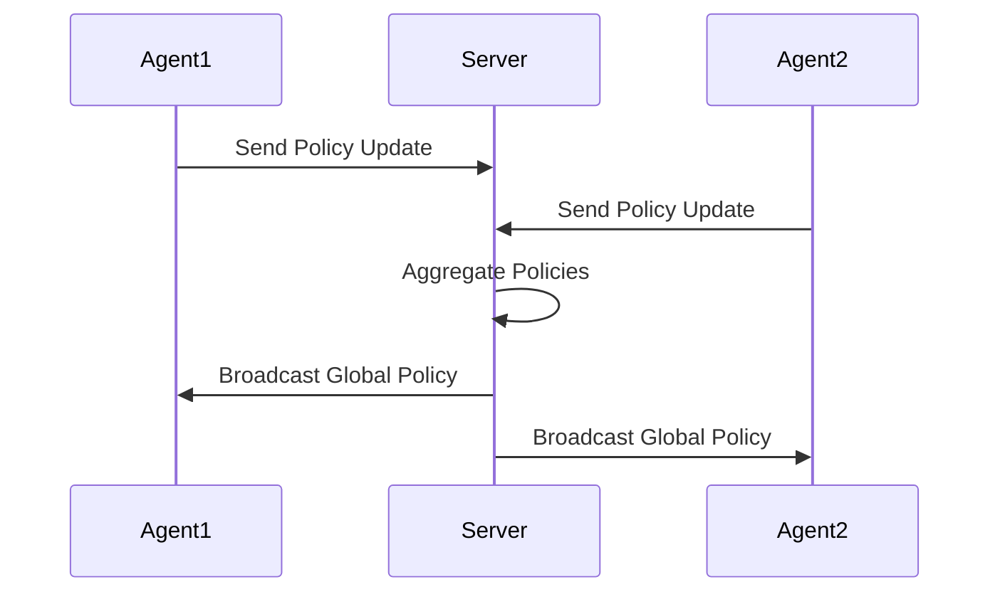

# Tutorial 110: Federated Reinforcement Learning

This tutorial covers FL for RL: multiple agents learning a shared policy.

## Setting

- Agents interact with different environments.
- Goal: Learn a generalizable policy.

## Configuration

```yaml
algorithm: "federated_ppo"
environment: "CartPole-v1"

training:
  rollout_length: 128
  gamma: 0.99
```

## Policy Flow



## Exercises

1. Variance in updates due to environment stochasticity.
2. Asynchronous vs synchronous federated RL.
