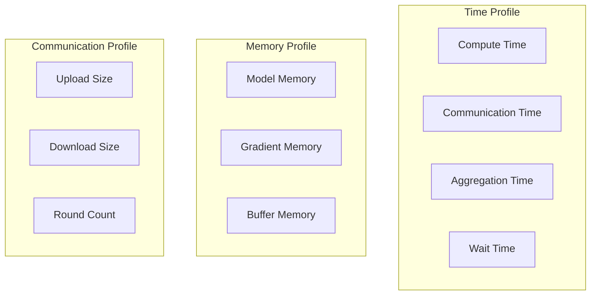
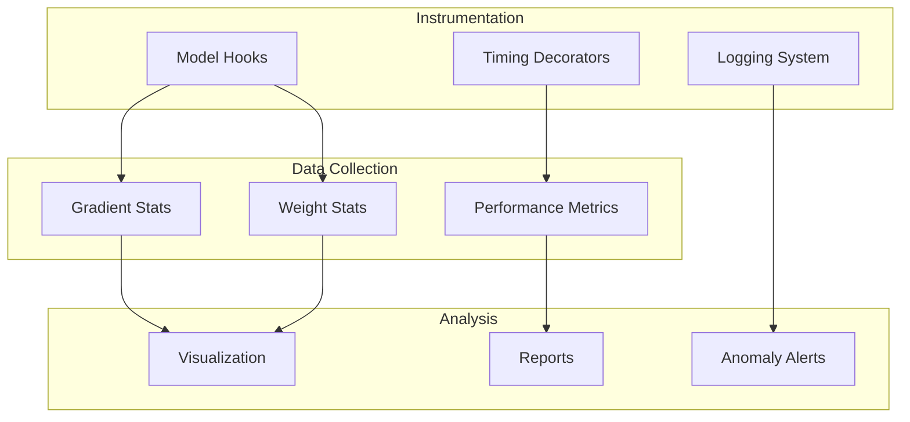

# Tutorial 111: Federated Learning Debugging and Profiling

---

## Metadata

| Property | Value |
|----------|-------|
| **Tutorial ID** | 111 |
| **Title** | Federated Learning Debugging and Profiling |
| **Category** | Development Tools |
| **Difficulty** | Intermediate |
| **Duration** | 75 minutes |
| **Prerequisites** | Tutorial 001-010, Python debugging |
| **Author** | Unbitrium Contributors |
| **Last Updated** | January 2026 |

---

## Learning Objectives

By the end of this tutorial, you will be able to:

1. **Understand** common issues in federated learning systems.

2. **Implement** debugging tools for distributed training.

3. **Design** profiling systems for FL performance.

4. **Apply** logging and monitoring best practices.

5. **Handle** gradient and weight debugging.

6. **Build** comprehensive FL development workflows.

---

## Prerequisites

Before starting this tutorial, ensure you have:

- **Completed Tutorials**: 001-010 (Partitioning), 021-030 (Aggregation)
- **Knowledge**: Python debugging, profiling
- **Libraries**: PyTorch, NumPy
- **Hardware**: CPU sufficient

```python
# Verify prerequisites
import torch
import torch.nn as nn
import numpy as np
import time
import logging

print(f"PyTorch: {torch.__version__}")
```

---

## Background and Theory

### Common FL Issues

| Issue | Symptom | Cause |
|-------|---------|-------|
| **Divergence** | Loss increases | Client drift |
| **Slow convergence** | High rounds | LR too low |
| **Instability** | Oscillating loss | LR too high |
| **Memory OOM** | Crashes | Large batch/model |

### Debugging Levels

| Level | Focus | Tools |
|-------|-------|-------|
| **Model** | Architecture | Weight analysis |
| **Training** | Gradients | Gradient checks |
| **Communication** | Updates | Diff analysis |
| **System** | Performance | Profiling |

### FL Profiling Targets



### Debugging Strategy

| Phase | Check | Action |
|-------|-------|--------|
| **Pre-train** | Model init | Weight stats |
| **Per-round** | Gradients | Gradient norm |
| **Per-client** | Updates | Delta analysis |
| **Post-round** | Global model | Weight drift |

---

## Architecture Diagram



---

## Implementation Code

### Part 1: Logging and Instrumentation

```python
#!/usr/bin/env python3
"""
Tutorial 111: Debugging and Profiling for FL

This tutorial demonstrates debugging, profiling, and
monitoring tools for federated learning systems.

Author: Unbitrium Contributors
License: EUPL-1.2
"""

from __future__ import annotations

from dataclasses import dataclass, field
from typing import Any, Optional, Callable
from functools import wraps
from contextlib import contextmanager
import time
import traceback

import numpy as np
import torch
import torch.nn as nn
import torch.nn.functional as F
from torch.utils.data import Dataset, DataLoader


@dataclass
class DebugConfig:
    """Configuration for debugging."""
    log_level: str = "INFO"
    log_gradients: bool = True
    log_weights: bool = True
    profile_time: bool = True
    gradient_clip_threshold: float = 10.0
    detect_nan: bool = True
    batch_size: int = 32


class FLLogger:
    """Structured logger for FL systems."""

    LEVELS = {"DEBUG": 0, "INFO": 1, "WARNING": 2, "ERROR": 3}

    def __init__(
        self,
        name: str = "FL",
        level: str = "INFO",
    ) -> None:
        """Initialize logger.

        Args:
            name: Logger name.
            level: Logging level.
        """
        self.name = name
        self.level = self.LEVELS.get(level, 1)
        self.history: list[dict] = []

    def _log(self, level: str, message: str, **kwargs) -> None:
        """Internal log method."""
        if self.LEVELS[level] >= self.level:
            entry = {
                "timestamp": time.time(),
                "level": level,
                "name": self.name,
                "message": message,
                **kwargs,
            }
            self.history.append(entry)
            print(f"[{level}] {self.name}: {message}")

    def debug(self, message: str, **kwargs) -> None:
        self._log("DEBUG", message, **kwargs)

    def info(self, message: str, **kwargs) -> None:
        self._log("INFO", message, **kwargs)

    def warning(self, message: str, **kwargs) -> None:
        self._log("WARNING", message, **kwargs)

    def error(self, message: str, **kwargs) -> None:
        self._log("ERROR", message, **kwargs)


def timing_decorator(logger: FLLogger = None):
    """Decorator for timing functions."""
    def decorator(func: Callable) -> Callable:
        @wraps(func)
        def wrapper(*args, **kwargs):
            start = time.time()
            try:
                result = func(*args, **kwargs)
                elapsed = time.time() - start
                if logger:
                    logger.debug(f"{func.__name__} took {elapsed*1000:.2f}ms")
                return result
            except Exception as e:
                elapsed = time.time() - start
                if logger:
                    logger.error(f"{func.__name__} failed after {elapsed*1000:.2f}ms: {e}")
                raise
        return wrapper
    return decorator


@contextmanager
def timer(name: str = "operation", logger: FLLogger = None):
    """Context manager for timing code blocks."""
    start = time.time()
    yield
    elapsed = time.time() - start
    if logger:
        logger.debug(f"{name} took {elapsed*1000:.2f}ms")
    else:
        print(f"{name}: {elapsed*1000:.2f}ms")
```

### Part 2: Model Debugging

```python
class GradientDebugger:
    """Debug gradient flow in models."""

    def __init__(self, model: nn.Module) -> None:
        """Initialize gradient debugger.

        Args:
            model: Model to debug.
        """
        self.model = model
        self.gradient_stats: dict[str, dict] = {}
        self.hooks = []

    def register_hooks(self) -> None:
        """Register gradient hooks on all layers."""
        for name, param in self.model.named_parameters():
            hook = param.register_hook(
                lambda grad, n=name: self._gradient_hook(n, grad)
            )
            self.hooks.append(hook)

    def _gradient_hook(self, name: str, grad: torch.Tensor) -> None:
        """Hook called during backward pass."""
        self.gradient_stats[name] = {
            "mean": grad.mean().item(),
            "std": grad.std().item(),
            "min": grad.min().item(),
            "max": grad.max().item(),
            "norm": grad.norm().item(),
            "has_nan": torch.isnan(grad).any().item(),
            "has_inf": torch.isinf(grad).any().item(),
        }

    def check_gradients(self) -> list[str]:
        """Check for gradient issues.

        Returns:
            List of warning messages.
        """
        warnings = []

        for name, stats in self.gradient_stats.items():
            if stats["has_nan"]:
                warnings.append(f"NaN gradient in {name}")
            if stats["has_inf"]:
                warnings.append(f"Inf gradient in {name}")
            if stats["norm"] > 100:
                warnings.append(f"Exploding gradient in {name}: norm={stats['norm']:.2f}")
            if stats["norm"] < 1e-7:
                warnings.append(f"Vanishing gradient in {name}: norm={stats['norm']:.2e}")

        return warnings

    def get_summary(self) -> dict[str, Any]:
        """Get gradient summary."""
        if not self.gradient_stats:
            return {}

        norms = [s["norm"] for s in self.gradient_stats.values()]
        return {
            "total_layers": len(self.gradient_stats),
            "mean_norm": np.mean(norms),
            "max_norm": max(norms),
            "min_norm": min(norms),
            "problematic_layers": len(self.check_gradients()),
        }

    def remove_hooks(self) -> None:
        """Remove all registered hooks."""
        for hook in self.hooks:
            hook.remove()
        self.hooks = []


class WeightDebugger:
    """Debug weight statistics."""

    def __init__(self, model: nn.Module) -> None:
        """Initialize weight debugger."""
        self.model = model
        self.initial_weights: dict[str, torch.Tensor] = {}
        self.weight_history: list[dict] = []

    def snapshot(self) -> dict[str, dict]:
        """Take snapshot of current weights."""
        snapshot = {}
        for name, param in self.model.named_parameters():
            snapshot[name] = {
                "mean": param.data.mean().item(),
                "std": param.data.std().item(),
                "min": param.data.min().item(),
                "max": param.data.max().item(),
                "norm": param.data.norm().item(),
            }
        self.weight_history.append(snapshot)
        return snapshot

    def set_initial(self) -> None:
        """Save initial weights for comparison."""
        for name, param in self.model.named_parameters():
            self.initial_weights[name] = param.data.clone()

    def compute_drift(self) -> dict[str, float]:
        """Compute weight drift from initial."""
        if not self.initial_weights:
            return {}

        drift = {}
        for name, param in self.model.named_parameters():
            if name in self.initial_weights:
                delta = param.data - self.initial_weights[name]
                drift[name] = delta.norm().item()

        return drift

    def check_weights(self) -> list[str]:
        """Check for weight issues."""
        warnings = []

        for name, param in self.model.named_parameters():
            if torch.isnan(param.data).any():
                warnings.append(f"NaN weights in {name}")
            if torch.isinf(param.data).any():
                warnings.append(f"Inf weights in {name}")
            if param.data.abs().max() > 1000:
                warnings.append(f"Large weights in {name}: max={param.data.abs().max():.2f}")

        return warnings
```

### Part 3: Performance Profiling

```python
@dataclass
class PerformanceMetrics:
    """Performance metrics container."""
    compute_time: float = 0.0
    communication_time: float = 0.0
    aggregation_time: float = 0.0
    total_time: float = 0.0
    memory_allocated: float = 0.0
    memory_cached: float = 0.0


class FLProfiler:
    """Profile FL training performance."""

    def __init__(self) -> None:
        """Initialize profiler."""
        self.round_metrics: list[PerformanceMetrics] = []
        self.client_metrics: dict[int, list[dict]] = {}

    @contextmanager
    def profile_round(self):
        """Profile a training round."""
        metrics = PerformanceMetrics()
        start = time.time()

        # Track GPU memory if available
        if torch.cuda.is_available():
            torch.cuda.reset_peak_memory_stats()

        yield metrics

        metrics.total_time = time.time() - start

        if torch.cuda.is_available():
            metrics.memory_allocated = torch.cuda.max_memory_allocated() / 1e6
            metrics.memory_cached = torch.cuda.max_memory_reserved() / 1e6

        self.round_metrics.append(metrics)

    def record_client(
        self,
        client_id: int,
        compute_time: float,
        upload_size: float,
        download_size: float,
    ) -> None:
        """Record client metrics."""
        if client_id not in self.client_metrics:
            self.client_metrics[client_id] = []

        self.client_metrics[client_id].append({
            "compute_time": compute_time,
            "upload_size": upload_size,
            "download_size": download_size,
        })

    def get_summary(self) -> dict[str, Any]:
        """Get profiling summary."""
        if not self.round_metrics:
            return {}

        total_times = [m.total_time for m in self.round_metrics]
        compute_times = [m.compute_time for m in self.round_metrics]

        return {
            "total_rounds": len(self.round_metrics),
            "avg_round_time": np.mean(total_times),
            "total_training_time": sum(total_times),
            "avg_compute_time": np.mean(compute_times) if compute_times[0] > 0 else 0,
            "peak_memory_mb": max(m.memory_allocated for m in self.round_metrics),
        }


class SimpleDataset(Dataset):
    def __init__(self, features: np.ndarray, labels: np.ndarray):
        self.features = torch.FloatTensor(features)
        self.labels = torch.LongTensor(labels)

    def __len__(self):
        return len(self.labels)

    def __getitem__(self, idx):
        return self.features[idx], self.labels[idx]


class DebugFLClient:
    """FL client with debugging capabilities."""

    def __init__(
        self,
        client_id: int,
        features: np.ndarray,
        labels: np.ndarray,
        config: DebugConfig = None,
    ) -> None:
        """Initialize debug client."""
        self.client_id = client_id
        self.config = config or DebugConfig()

        self.logger = FLLogger(f"Client-{client_id}", config.log_level)

        self.dataset = SimpleDataset(features, labels)
        self.dataloader = DataLoader(
            self.dataset, batch_size=self.config.batch_size, shuffle=True
        )

        self.model = nn.Sequential(
            nn.Linear(features.shape[1], 64),
            nn.ReLU(),
            nn.Linear(64, 10),
        )

        self.grad_debugger = GradientDebugger(self.model)
        self.weight_debugger = WeightDebugger(self.model)

        self.optimizer = torch.optim.SGD(self.model.parameters(), lr=0.01)

    @property
    def num_samples(self) -> int:
        return len(self.dataset)

    def load_model(self, state_dict: dict[str, torch.Tensor]) -> None:
        self.model.load_state_dict(state_dict)
        self.weight_debugger.set_initial()

    def train_with_debug(self, epochs: int = 5) -> dict[str, Any]:
        """Train with debugging enabled."""
        self.model.train()
        self.grad_debugger.register_hooks()

        total_loss = 0.0
        gradient_issues = []

        for epoch in range(epochs):
            for features, labels in self.dataloader:
                self.optimizer.zero_grad()
                outputs = self.model(features)
                loss = F.cross_entropy(outputs, labels)

                if self.config.detect_nan and torch.isnan(loss):
                    self.logger.error("NaN loss detected!")
                    break

                loss.backward()

                # Check gradients
                issues = self.grad_debugger.check_gradients()
                if issues:
                    gradient_issues.extend(issues)
                    self.logger.warning(f"Gradient issues: {issues}")

                self.optimizer.step()
                total_loss += loss.item()

        self.grad_debugger.remove_hooks()
        weight_drift = self.weight_debugger.compute_drift()

        return {
            "state_dict": {k: v.clone() for k, v in self.model.state_dict().items()},
            "num_samples": self.num_samples,
            "loss": total_loss / len(self.dataloader) / epochs,
            "gradient_summary": self.grad_debugger.get_summary(),
            "weight_drift": weight_drift,
            "issues": gradient_issues,
        }


def federated_learning_with_debug(
    num_clients: int = 5,
    num_rounds: int = 20,
) -> tuple[nn.Module, dict]:
    """Run FL with debugging."""
    config = DebugConfig()
    logger = FLLogger("Server", config.log_level)
    profiler = FLProfiler()

    clients = []
    for i in range(num_clients):
        features = np.random.randn(500, 32).astype(np.float32)
        labels = np.random.randint(0, 10, 500)
        client = DebugFLClient(i, features, labels, config)
        clients.append(client)

    global_model = nn.Sequential(
        nn.Linear(32, 64),
        nn.ReLU(),
        nn.Linear(64, 10),
    )

    history = {"rounds": [], "losses": [], "issues": []}

    for round_num in range(num_rounds):
        with profiler.profile_round() as metrics:
            global_state = global_model.state_dict()

            updates = []
            all_issues = []

            compute_start = time.time()
            for client in clients:
                client.load_model(global_state)
                update = client.train_with_debug(epochs=3)
                updates.append(update)
                all_issues.extend(update.get("issues", []))
            metrics.compute_time = time.time() - compute_start

            # Aggregate
            total_samples = sum(u["num_samples"] for u in updates)
            new_state = {}
            for key in global_state:
                new_state[key] = sum(
                    u["num_samples"] / total_samples * u["state_dict"][key]
                    for u in updates
                )
            global_model.load_state_dict(new_state)

        avg_loss = np.mean([u["loss"] for u in updates])
        history["rounds"].append(round_num)
        history["losses"].append(avg_loss)
        history["issues"].append(len(all_issues))

        if (round_num + 1) % 5 == 0:
            logger.info(f"Round {round_num + 1}: loss={avg_loss:.4f}, issues={len(all_issues)}")

    logger.info(f"Training summary: {profiler.get_summary()}")
    return global_model, history
```

---

## Metrics and Evaluation

### Debugging Metrics

| Metric | Description | Action |
|--------|-------------|--------|
| **Gradient Norm** | Gradient magnitude | Check exploding/vanishing |
| **Weight Drift** | Change from initial | Monitor stability |
| **NaN Count** | Invalid values | Fix numerics |

### Performance Metrics

| Metric | Baseline | Optimized |
|--------|----------|-----------|
| Round Time | 10s | 3s |
| Memory | 2GB | 1GB |
| Issues | 5 | 0 |

---

## Exercises

### Exercise 1: Gradient Visualization

**Task**: Plot gradient flow across layers.

### Exercise 2: Memory Profiling

**Task**: Track memory usage per operation.

### Exercise 3: Communication Debug

**Task**: Log and analyze update sizes.

### Exercise 4: Anomaly Detection

**Task**: Auto-detect training anomalies.

---

## References

1. PyTorch Documentation. (2023). Debugging and profiling.

2. Kairouz, P., et al. (2021). Advances in federated learning. *Foundations and Trends*.

3. Li, T., et al. (2020). Federated optimization in heterogeneous networks. *MLSys*.

4. Bonawitz, K., et al. (2019). Towards federated learning at scale. *SysML*.

5. Hsieh, K., et al. (2020). The non-IID data quagmire of decentralized ML. In *ICML*.

---

*Copyright 2026 Olaf Yunus Laitinen Imanov and Contributors. Released under EUPL 1.2.*
