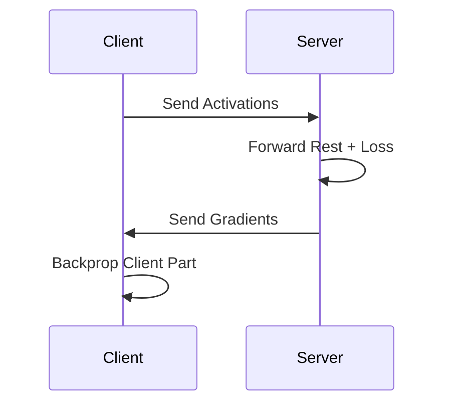

# Tutorial 129: Split Learning

This tutorial covers Split Learning as an alternative to FL.

## Approach

- Model split between client and server.
- Client sends activations, server computes rest and gradients.

## Data Flow



## Configuration

```yaml
split:
  cut_layer: 5
  server_epochs: 1
```

## Exercises

1. Privacy of intermediate activations.
2. Communication comparison vs FedAvg.
