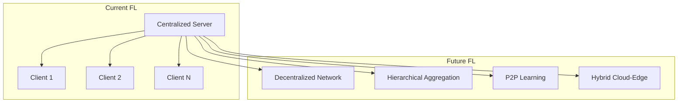

# Tutorial 145: FL Future Directions

---

## Metadata

| Property | Value |
|----------|-------|
| **Tutorial ID** | 145 |
| **Title** | Federated Learning Future Directions |
| **Category** | Research |
| **Difficulty** | Advanced |
| **Duration** | 120 minutes |
| **Prerequisites** | Tutorial 001-144 |
| **Author** | Unbitrium Contributors |
| **Last Updated** | January 2026 |

---

## Learning Objectives

By completing this tutorial, you will be able to:

1. **Understand** emerging trends in federated learning research
2. **Analyze** future applications and domains for FL
3. **Evaluate** next-generation FL architectures
4. **Implement** experimental FL techniques
5. **Design** forward-looking FL systems

---

## Prerequisites

Before starting this tutorial, ensure you have:

- Completed tutorials 001-144
- Strong understanding of FL fundamentals
- Knowledge of current FL challenges
- Familiarity with ML research trends

---

## Background and Theory

### The Evolution of Federated Learning

Federated learning has evolved significantly since its introduction by Google in 2016.
The field continues to advance rapidly with new research directions emerging.

### Key Future Research Areas

1. **Federated Foundation Models**: Training large language models across distributed data
2. **Cross-Modal FL**: Learning across different data modalities
3. **Federated Continual Learning**: Adapting to evolving data distributions
4. **Quantum Federated Learning**: Leveraging quantum computing
5. **Neuromorphic FL**: Edge computing with neuromorphic chips

### Emerging Applications

```
Future FL Applications:
├── Healthcare 2.0
│   ├── Multi-omics integration
│   ├── Digital twins
│   └── Personalized medicine
├── Smart Infrastructure
│   ├── Smart grids
│   ├── Autonomous transportation
│   └── Urban planning
├── Extended Reality (XR)
│   ├── Metaverse applications
│   ├── AR/VR personalization
│   └── Spatial computing
└── Sustainability
    ├── Climate modeling
    ├── Energy optimization
    └── Environmental monitoring
```

### Architecture Evolution



---

## Implementation Code

```python
#!/usr/bin/env python3
"""
Tutorial 145: Federated Learning Future Directions

This module implements experimental FL techniques representing
future research directions in the field.

Copyright 2026 Olaf Yunus Laitinen Imanov and Contributors
Released under EUPL 1.2
"""

import numpy as np
import torch
import torch.nn as nn
import torch.nn.functional as F
from torch.utils.data import Dataset, DataLoader
from dataclasses import dataclass, field
from typing import Dict, List, Optional, Tuple, Any
from abc import ABC, abstractmethod
import copy
from datetime import datetime
import math


@dataclass
class FutureConfig:
    """Configuration for future FL experiments."""
    num_rounds: int = 50
    num_clients: int = 20
    clients_per_round: int = 10
    input_dim: int = 64
    hidden_dim: int = 128
    num_classes: int = 10
    learning_rate: float = 0.01
    local_epochs: int = 5
    batch_size: int = 32
    seed: int = 42
    
    # Future features
    enable_continual: bool = True
    enable_personalization: bool = True
    enable_compression: bool = True
    compression_ratio: float = 0.1


class FutureDataset(Dataset):
    """Dataset with evolving distribution for continual learning."""
    
    def __init__(
        self,
        n: int = 200,
        dim: int = 64,
        classes: int = 10,
        seed: int = 0,
        drift_rate: float = 0.0
    ):
        np.random.seed(seed)
        self.n = n
        self.dim = dim
        self.classes = classes
        self.drift_rate = drift_rate
        self.current_shift = 0.0
        
        # Generate base data
        self.x = torch.randn(n, dim)
        self.y = torch.randint(0, classes, (n,))
        
        # Add class-specific patterns
        for i in range(n):
            self.x[i, :classes] += F.one_hot(
                self.y[i], num_classes=classes
            ).float() * 2.0
    
    def apply_drift(self) -> None:
        """Apply concept drift to data."""
        self.current_shift += self.drift_rate
        drift_noise = torch.randn_like(self.x) * self.current_shift
        self.x = self.x + drift_noise
    
    def __len__(self) -> int:
        return self.n
    
    def __getitem__(self, idx: int) -> Tuple[torch.Tensor, torch.Tensor]:
        return self.x[idx], self.y[idx]


class FutureModel(nn.Module):
    """Advanced model architecture for future FL."""
    
    def __init__(self, config: FutureConfig):
        super().__init__()
        self.config = config
        
        # Shared encoder
        self.encoder = nn.Sequential(
            nn.Linear(config.input_dim, config.hidden_dim),
            nn.LayerNorm(config.hidden_dim),
            nn.GELU(),
            nn.Dropout(0.1),
            nn.Linear(config.hidden_dim, config.hidden_dim),
            nn.LayerNorm(config.hidden_dim),
            nn.GELU(),
        )
        
        # Task-specific head
        self.classifier = nn.Sequential(
            nn.Linear(config.hidden_dim, config.hidden_dim // 2),
            nn.GELU(),
            nn.Linear(config.hidden_dim // 2, config.num_classes)
        )
        
        # Personalization adapter (future feature)
        self.adapter = nn.Sequential(
            nn.Linear(config.hidden_dim, config.hidden_dim // 4),
            nn.GELU(),
            nn.Linear(config.hidden_dim // 4, config.hidden_dim)
        )
    
    def forward(
        self,
        x: torch.Tensor,
        use_adapter: bool = False
    ) -> torch.Tensor:
        features = self.encoder(x)
        
        if use_adapter:
            adapted = self.adapter(features)
            features = features + adapted
        
        return self.classifier(features)
    
    def get_shared_params(self) -> Dict[str, torch.Tensor]:
        """Get parameters for federated aggregation."""
        return {
            name: param for name, param in self.named_parameters()
            if 'adapter' not in name
        }
    
    def get_personal_params(self) -> Dict[str, torch.Tensor]:
        """Get personalization parameters."""
        return {
            name: param for name, param in self.named_parameters()
            if 'adapter' in name
        }


class GradientCompressor:
    """Gradient compression for communication efficiency."""
    
    def __init__(self, compression_ratio: float = 0.1):
        self.ratio = compression_ratio
        self.error_feedback: Dict[str, torch.Tensor] = {}
    
    def compress(
        self,
        gradients: Dict[str, torch.Tensor]
    ) -> Dict[str, Tuple[torch.Tensor, torch.Tensor]]:
        """Compress gradients using top-k sparsification."""
        compressed = {}
        
        for name, grad in gradients.items():
            # Add error feedback
            if name in self.error_feedback:
                grad = grad + self.error_feedback[name]
            
            # Flatten
            flat = grad.flatten()
            k = max(1, int(len(flat) * self.ratio))
            
            # Top-k selection
            _, indices = torch.topk(flat.abs(), k)
            values = flat[indices]
            
            # Store error for feedback
            mask = torch.zeros_like(flat)
            mask[indices] = 1
            self.error_feedback[name] = (
                flat * (1 - mask)
            ).reshape(grad.shape)
            
            compressed[name] = (indices, values, grad.shape)
        
        return compressed
    
    def decompress(
        self,
        compressed: Dict[str, Tuple]
    ) -> Dict[str, torch.Tensor]:
        """Decompress gradients."""
        decompressed = {}
        
        for name, (indices, values, shape) in compressed.items():
            flat = torch.zeros(np.prod(shape))
            flat[indices] = values
            decompressed[name] = flat.reshape(shape)
        
        return decompressed


class ContinualLearner:
    """Continual learning component for handling distribution shift."""
    
    def __init__(self, memory_size: int = 100):
        self.memory_size = memory_size
        self.memory_x: List[torch.Tensor] = []
        self.memory_y: List[torch.Tensor] = []
    
    def update_memory(
        self,
        x: torch.Tensor,
        y: torch.Tensor
    ) -> None:
        """Update replay memory with new samples."""
        for i in range(len(x)):
            if len(self.memory_x) < self.memory_size:
                self.memory_x.append(x[i].clone())
                self.memory_y.append(y[i].clone())
            else:
                # Random replacement
                idx = np.random.randint(0, self.memory_size)
                self.memory_x[idx] = x[i].clone()
                self.memory_y[idx] = y[i].clone()
    
    def get_replay_batch(
        self,
        batch_size: int
    ) -> Optional[Tuple[torch.Tensor, torch.Tensor]]:
        """Get batch from replay memory."""
        if len(self.memory_x) < batch_size:
            return None
        
        indices = np.random.choice(
            len(self.memory_x),
            size=min(batch_size, len(self.memory_x)),
            replace=False
        )
        
        x = torch.stack([self.memory_x[i] for i in indices])
        y = torch.stack([self.memory_y[i] for i in indices])
        
        return x, y


class FutureClient:
    """Client with future FL capabilities."""
    
    def __init__(
        self,
        client_id: int,
        dataset: FutureDataset,
        config: FutureConfig
    ):
        self.client_id = client_id
        self.dataset = dataset
        self.config = config
        
        # Future components
        self.compressor = GradientCompressor(config.compression_ratio)
        self.continual = ContinualLearner()
        self.personal_params: Optional[Dict] = None
    
    def train(
        self,
        model: nn.Module,
        round_num: int
    ) -> Dict[str, Any]:
        """Train with future FL features."""
        # Apply drift for continual learning
        if self.config.enable_continual and round_num > 0:
            self.dataset.apply_drift()
        
        # Create local model
        local_model = copy.deepcopy(model)
        
        # Load personal parameters if available
        if self.personal_params and self.config.enable_personalization:
            for name, param in local_model.named_parameters():
                if 'adapter' in name and name in self.personal_params:
                    param.data.copy_(self.personal_params[name])
        
        optimizer = torch.optim.AdamW(
            local_model.parameters(),
            lr=self.config.learning_rate
        )
        
        loader = DataLoader(
            self.dataset,
            batch_size=self.config.batch_size,
            shuffle=True
        )
        
        local_model.train()
        total_loss = 0.0
        num_batches = 0
        
        for epoch in range(self.config.local_epochs):
            for x, y in loader:
                optimizer.zero_grad()
                
                # Forward with adapter for personalization
                output = local_model(
                    x,
                    use_adapter=self.config.enable_personalization
                )
                loss = F.cross_entropy(output, y)
                
                # Add replay loss for continual learning
                if self.config.enable_continual:
                    replay = self.continual.get_replay_batch(
                        self.config.batch_size // 2
                    )
                    if replay is not None:
                        replay_x, replay_y = replay
                        replay_out = local_model(
                            replay_x,
                            use_adapter=self.config.enable_personalization
                        )
                        replay_loss = F.cross_entropy(replay_out, replay_y)
                        loss = loss + 0.5 * replay_loss
                
                loss.backward()
                torch.nn.utils.clip_grad_norm_(
                    local_model.parameters(), 1.0
                )
                optimizer.step()
                
                total_loss += loss.item()
                num_batches += 1
                
                # Update memory
                if self.config.enable_continual:
                    self.continual.update_memory(x, y)
        
        # Save personal parameters
        if self.config.enable_personalization:
            self.personal_params = {
                name: param.clone().detach()
                for name, param in local_model.named_parameters()
                if 'adapter' in name
            }
        
        # Compute update
        update = {}
        for name, param in local_model.named_parameters():
            if 'adapter' not in name:  # Only shared params
                update[name] = param.data.cpu()
        
        # Compress if enabled
        if self.config.enable_compression:
            # Compute gradients as difference
            gradients = {
                name: model.state_dict()[name] - update[name]
                for name in update
            }
            compressed = self.compressor.compress(gradients)
            return {
                "compressed": compressed,
                "num_samples": len(self.dataset),
                "avg_loss": total_loss / num_batches
            }
        
        return {
            "state_dict": update,
            "num_samples": len(self.dataset),
            "avg_loss": total_loss / num_batches
        }


class FutureServer:
    """Server with future FL capabilities."""
    
    def __init__(
        self,
        model: nn.Module,
        clients: List[FutureClient],
        test_data: FutureDataset,
        config: FutureConfig
    ):
        self.model = model
        self.clients = clients
        self.test_data = test_data
        self.config = config
        self.compressor = GradientCompressor(config.compression_ratio)
        
        # Tracking
        self.history: List[Dict] = []
        self.best_accuracy = 0.0
    
    def aggregate(self, updates: List[Dict]) -> None:
        """Aggregate client updates."""
        if not updates:
            return
        
        total_samples = sum(u["num_samples"] for u in updates)
        
        # Handle compressed updates
        if "compressed" in updates[0]:
            # Decompress and aggregate
            aggregated_grad = {}
            for u in updates:
                weight = u["num_samples"] / total_samples
                decompressed = self.compressor.decompress(u["compressed"])
                for name, grad in decompressed.items():
                    if name not in aggregated_grad:
                        aggregated_grad[name] = torch.zeros_like(grad)
                    aggregated_grad[name] += weight * grad
            
            # Apply aggregated gradient
            with torch.no_grad():
                for name, param in self.model.named_parameters():
                    if name in aggregated_grad:
                        param.data -= aggregated_grad[name]
        else:
            # Standard FedAvg
            new_state = {}
            for key in updates[0]["state_dict"]:
                new_state[key] = sum(
                    (u["num_samples"] / total_samples) * 
                    u["state_dict"][key].float()
                    for u in updates
                )
            
            current_state = self.model.state_dict()
            for key in new_state:
                current_state[key] = new_state[key]
            self.model.load_state_dict(current_state)
    
    def evaluate(self) -> Dict[str, float]:
        """Evaluate model on test data."""
        self.model.eval()
        loader = DataLoader(self.test_data, batch_size=64)
        
        correct = 0
        total = 0
        total_loss = 0.0
        
        with torch.no_grad():
            for x, y in loader:
                output = self.model(x, use_adapter=False)
                loss = F.cross_entropy(output, y)
                
                pred = output.argmax(dim=1)
                correct += (pred == y).sum().item()
                total += len(y)
                total_loss += loss.item() * len(y)
        
        return {
            "accuracy": correct / total,
            "loss": total_loss / total
        }
    
    def train(self) -> List[Dict]:
        """Run federated training."""
        for round_num in range(self.config.num_rounds):
            # Select clients
            selected_indices = np.random.choice(
                len(self.clients),
                size=min(self.config.clients_per_round, len(self.clients)),
                replace=False
            )
            selected_clients = [self.clients[i] for i in selected_indices]
            
            # Collect updates
            updates = []
            for client in selected_clients:
                update = client.train(self.model, round_num)
                updates.append(update)
            
            # Aggregate
            self.aggregate(updates)
            
            # Evaluate
            metrics = self.evaluate()
            avg_loss = np.mean([u["avg_loss"] for u in updates])
            
            # Track
            record = {
                "round": round_num,
                "accuracy": metrics["accuracy"],
                "test_loss": metrics["loss"],
                "train_loss": avg_loss,
                "num_clients": len(selected_clients)
            }
            self.history.append(record)
            
            if metrics["accuracy"] > self.best_accuracy:
                self.best_accuracy = metrics["accuracy"]
            
            if (round_num + 1) % 10 == 0:
                print(
                    f"Round {round_num + 1}: "
                    f"acc={metrics['accuracy']:.4f}, "
                    f"loss={metrics['loss']:.4f}, "
                    f"best={self.best_accuracy:.4f}"
                )
        
        return self.history


def main():
    """Main entry point."""
    print("=" * 60)
    print("Tutorial 145: Federated Learning Future Directions")
    print("=" * 60)
    
    # Configuration
    config = FutureConfig()
    torch.manual_seed(config.seed)
    np.random.seed(config.seed)
    
    print(f"\nConfiguration:")
    print(f"  Clients: {config.num_clients}")
    print(f"  Rounds: {config.num_rounds}")
    print(f"  Continual Learning: {config.enable_continual}")
    print(f"  Personalization: {config.enable_personalization}")
    print(f"  Compression: {config.enable_compression}")
    
    # Create datasets with drift
    print("\nCreating datasets with concept drift...")
    datasets = [
        FutureDataset(
            dim=config.input_dim,
            classes=config.num_classes,
            seed=i,
            drift_rate=0.01
        )
        for i in range(config.num_clients)
    ]
    
    # Create clients
    clients = [
        FutureClient(i, d, config)
        for i, d in enumerate(datasets)
    ]
    
    # Test data
    test_data = FutureDataset(
        n=500,
        dim=config.input_dim,
        classes=config.num_classes,
        seed=999
    )
    
    # Create model
    model = FutureModel(config)
    print(f"\nModel parameters: {sum(p.numel() for p in model.parameters()):,}")
    
    # Create server and train
    server = FutureServer(model, clients, test_data, config)
    
    print("\nStarting federated training...")
    print("-" * 40)
    history = server.train()
    
    # Summary
    print("\n" + "=" * 60)
    print("Training Complete")
    print("=" * 60)
    print(f"Final accuracy: {history[-1]['accuracy']:.4f}")
    print(f"Best accuracy: {server.best_accuracy:.4f}")
    print(f"Total rounds: {len(history)}")


if __name__ == "__main__":
    main()
```

---

## Key Concepts Summary

### Future Directions Overview

| Direction | Description | Status |
|-----------|-------------|--------|
| Federated Foundation Models | Training LLMs distributedly | Research |
| Cross-Modal FL | Multi-modality learning | Emerging |
| Continual FL | Handling distribution shift | Active |
| Quantum FL | Quantum-enhanced learning | Early |
| Neuromorphic FL | Edge neuromorphic chips | Experimental |

### Implementation Features

1. **Continual Learning**: Replay memory for handling drift
2. **Personalization**: Adapter-based local adaptation
3. **Compression**: Top-k gradient sparsification
4. **Advanced Architecture**: LayerNorm, GELU, adapters

---

## Exercises

1. **Exercise 1**: Implement a different continual learning strategy (EWC, LwF)
2. **Exercise 2**: Add cross-modal features for multi-type data
3. **Exercise 3**: Implement federated distillation for model compression
4. **Exercise 4**: Design a hierarchical aggregation scheme

---

## Additional Resources

- Kairouz, P., et al. (2021). Advances and open problems in FL. *FnTML*
- Wang, J., et al. (2021). A field guide to federated optimization. *arXiv*
- Li, T., et al. (2020). Federated learning: Challenges, methods, and future directions

---

## References

1. Kairouz, P., et al. (2021). Advances and open problems in federated learning. *Foundations and Trends in Machine Learning*.
2. McMahan, B., et al. (2017). Communication-efficient learning of deep networks from decentralized data. In *AISTATS*.
3. Li, T., et al. (2020). Federated optimization in heterogeneous networks. In *MLSys*.
4. Wang, J., et al. (2021). A field guide to federated optimization. *arXiv preprint*.

---

*Copyright 2026 Olaf Yunus Laitinen Imanov and Contributors. Released under EUPL 1.2.*
