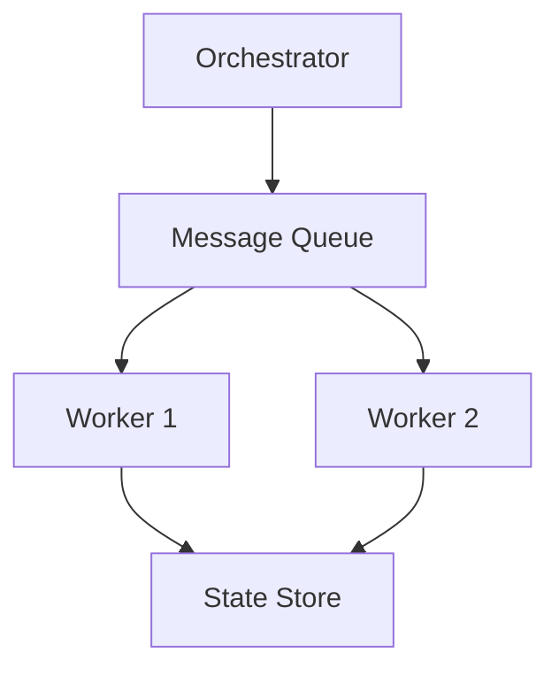

# Tutorial 148: FL System Design Patterns

This tutorial covers common design patterns for FL systems.

## Patterns

1. **Actor Model**: Clients as actors.
2. **Event Sourcing**: Log all updates.
3. **CQRS**: Separate read/write paths.
4. **Circuit Breaker**: Handle client failures.

## Architecture

## Exercises

1. Choosing patterns for cross-device vs cross-silo.
2. Fault tolerance considerations.
