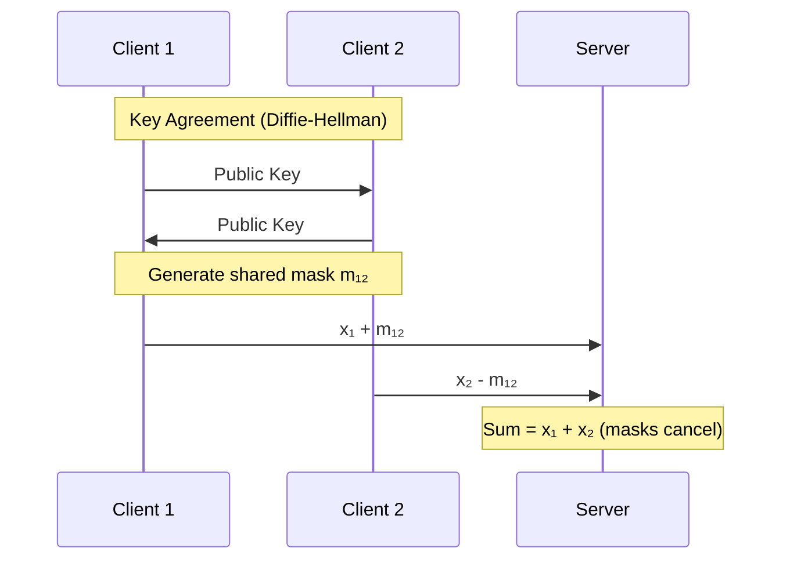
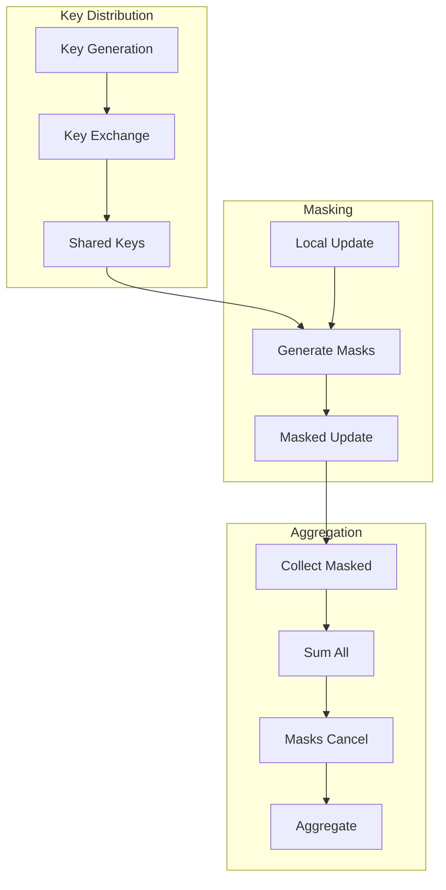

# Tutorial 156: Federated Learning Secure Aggregation

---

## Metadata

| Property | Value |
|----------|-------|
| **Tutorial ID** | 156 |
| **Title** | Federated Learning Secure Aggregation |
| **Category** | Privacy and Security |
| **Difficulty** | Advanced |
| **Duration** | 90 minutes |
| **Prerequisites** | Tutorial 001-010, cryptography basics |
| **Author** | Unbitrium Contributors |
| **Last Updated** | January 2026 |

---

## Learning Objectives

By the end of this tutorial, you will be able to:

1. **Understand** secure aggregation protocols for federated learning.

2. **Implement** secret sharing schemes for private aggregation.

3. **Design** pairwise masking protocols for privacy.

4. **Handle** client dropout in secure aggregation.

5. **Apply** homomorphic encryption for aggregation.

6. **Build** production-ready secure FL pipelines.

---

## Prerequisites

Before starting this tutorial, ensure you have:

- **Completed Tutorials**: 001-010 (Partitioning), 021-030 (Aggregation)
- **Knowledge**: Basic cryptography, modular arithmetic
- **Libraries**: PyTorch, NumPy
- **Hardware**: CPU sufficient

```python
# Verify prerequisites
import torch
import numpy as np
from typing import Dict, List, Tuple

print(f"PyTorch: {torch.__version__}")
```

---

## Background and Theory

### Why Secure Aggregation?

Standard FL exposes individual model updates to the server:

| Threat | Description | Risk |
|--------|-------------|------|
| **Gradient Leakage** | Reconstruct training data | High |
| **Membership Inference** | Detect data presence | Medium |
| **Model Inversion** | Recover sensitive inputs | High |

Secure aggregation ensures:
- Server only learns **aggregate** update
- Individual updates remain **private**
- Privacy holds even with honest-but-curious server

### Secure Aggregation Approaches

| Approach | Security | Overhead | Dropout Tolerance |
|----------|----------|----------|-------------------|
| **Secret Sharing** | Information-theoretic | Medium | Limited |
| **Pairwise Masking** | Computational | Low | High |
| **Homomorphic Encryption** | Semantic | High | Full |
| **Trusted Execution** | Hardware-based | Low | Full |

### Pairwise Masking Protocol



### Secret Sharing (Shamir)

For threshold t from n parties:
- Split secret s into n shares
- Any t shares can reconstruct s
- Less than t shares reveal nothing

---

## Architecture Diagram



---

## Implementation Code

### Part 1: Cryptographic Primitives

```python
#!/usr/bin/env python3
"""
Tutorial 156: Secure Aggregation

This tutorial demonstrates secure aggregation protocols
for privacy-preserving federated learning.

Author: Unbitrium Contributors
License: EUPL-1.2
"""

from __future__ import annotations

from dataclasses import dataclass
from typing import Any, Optional
from abc import ABC, abstractmethod
import hashlib
import secrets

import numpy as np
import torch
import torch.nn as nn
import torch.nn.functional as F
from torch.utils.data import Dataset, DataLoader


@dataclass
class SecureAggConfig:
    """Configuration for secure aggregation."""
    prime_bits: int = 64
    threshold: int = 3
    num_shares: int = 5
    modulus: int = 2 ** 32
    dropout_tolerance: float = 0.3
    batch_size: int = 32
    learning_rate: float = 0.01


def generate_prime(bits: int = 64) -> int:
    """Generate a large prime for modular arithmetic."""
    # For demonstration, use a fixed large prime
    # In production, use proper prime generation
    return 2 ** 61 - 1  # Mersenne prime


class PRG:
    """Pseudorandom Generator for mask generation."""

    def __init__(self, seed: bytes) -> None:
        """Initialize PRG with seed.

        Args:
            seed: Random seed bytes.
        """
        self.seed = seed
        self.counter = 0

    def generate(self, size: int) -> np.ndarray:
        """Generate pseudorandom integers.

        Args:
            size: Number of integers to generate.

        Returns:
            Array of pseudorandom integers.
        """
        values = []
        for i in range(size):
            # Hash counter with seed
            h = hashlib.sha256(self.seed + self.counter.to_bytes(8, 'big'))
            val = int.from_bytes(h.digest()[:8], 'big')
            values.append(val)
            self.counter += 1

        return np.array(values, dtype=np.int64)


class DiffieHellman:
    """Simplified Diffie-Hellman key exchange."""

    # Fixed parameters for demo (use proper parameters in production)
    P = 2 ** 61 - 1
    G = 2

    def __init__(self) -> None:
        """Initialize with random private key."""
        self.private_key = secrets.randbelow(self.P - 2) + 1
        self.public_key = pow(self.G, self.private_key, self.P)

    def compute_shared_key(self, other_public: int) -> bytes:
        """Compute shared key from other's public key.

        Args:
            other_public: Other party's public key.

        Returns:
            Shared key as bytes.
        """
        shared_secret = pow(other_public, self.private_key, self.P)
        return hashlib.sha256(shared_secret.to_bytes(8, 'big')).digest()


class ShamirSecretSharing:
    """Shamir's Secret Sharing scheme."""

    def __init__(
        self,
        threshold: int,
        num_shares: int,
        prime: int = None,
    ) -> None:
        """Initialize Shamir SS.

        Args:
            threshold: Minimum shares to reconstruct.
            num_shares: Total number of shares.
            prime: Prime for finite field.
        """
        self.threshold = threshold
        self.num_shares = num_shares
        self.prime = prime or generate_prime()

    def split(self, secret: int) -> list[tuple[int, int]]:
        """Split secret into shares.

        Args:
            secret: Secret value to split.

        Returns:
            List of (index, share) tuples.
        """
        secret = secret % self.prime

        # Generate random polynomial coefficients
        coefficients = [secret]
        for _ in range(self.threshold - 1):
            coefficients.append(secrets.randbelow(self.prime))

        # Evaluate polynomial at each point
        shares = []
        for x in range(1, self.num_shares + 1):
            y = 0
            for i, coef in enumerate(coefficients):
                y = (y + coef * pow(x, i, self.prime)) % self.prime
            shares.append((x, y))

        return shares

    def reconstruct(self, shares: list[tuple[int, int]]) -> int:
        """Reconstruct secret from shares.

        Args:
            shares: List of (index, share) tuples.

        Returns:
            Reconstructed secret.
        """
        if len(shares) < self.threshold:
            raise ValueError(f"Need at least {self.threshold} shares")

        # Lagrange interpolation at x=0
        secret = 0
        for i, (xi, yi) in enumerate(shares):
            # Compute Lagrange basis polynomial at x=0
            numerator = 1
            denominator = 1
            for j, (xj, _) in enumerate(shares):
                if i != j:
                    numerator = (numerator * (-xj)) % self.prime
                    denominator = (denominator * (xi - xj)) % self.prime

            # Modular inverse
            lagrange = (numerator * pow(denominator, self.prime - 2, self.prime)) % self.prime
            secret = (secret + yi * lagrange) % self.prime

        return secret
```

### Part 2: Mask Generation and Cancellation

```python
class PairwiseMasking:
    """Pairwise masking protocol for secure aggregation."""

    def __init__(
        self,
        client_ids: list[str],
        modulus: int = 2 ** 32,
    ) -> None:
        """Initialize pairwise masking.

        Args:
            client_ids: List of client identifiers.
            modulus: Modulus for arithmetic.
        """
        self.client_ids = sorted(client_ids)
        self.modulus = modulus

        # Key exchange
        self.dh_keys: dict[str, DiffieHellman] = {}
        self.shared_keys: dict[tuple[str, str], bytes] = {}

        for cid in client_ids:
            self.dh_keys[cid] = DiffieHellman()

        # Compute all shared keys
        for i, cid1 in enumerate(client_ids):
            for j, cid2 in enumerate(client_ids):
                if i < j:
                    shared = self.dh_keys[cid1].compute_shared_key(
                        self.dh_keys[cid2].public_key
                    )
                    self.shared_keys[(cid1, cid2)] = shared

    def generate_masks(
        self,
        client_id: str,
        shape: tuple[int, ...],
    ) -> np.ndarray:
        """Generate masks for a client.

        Args:
            client_id: Client identifier.
            shape: Shape of the update tensor.

        Returns:
            Mask array (sum of pairwise masks).
        """
        total_mask = np.zeros(shape, dtype=np.int64)

        for other_id in self.client_ids:
            if other_id == client_id:
                continue

            # Get shared key
            if client_id < other_id:
                key = self.shared_keys.get((client_id, other_id))
                sign = 1
            else:
                key = self.shared_keys.get((other_id, client_id))
                sign = -1

            if key:
                prg = PRG(key)
                mask = prg.generate(np.prod(shape)).reshape(shape)
                total_mask += sign * mask

        return total_mask % self.modulus

    def verify_cancellation(
        self,
        masked_updates: dict[str, np.ndarray],
    ) -> np.ndarray:
        """Verify that masks cancel when summed.

        Args:
            masked_updates: Masked updates from all clients.

        Returns:
            Sum of updates (masks should cancel to 0).
        """
        total = None
        for client_id, masked in masked_updates.items():
            if total is None:
                total = masked.copy()
            else:
                total = (total + masked) % self.modulus

        return total


class SecureAggregationProtocol:
    """Full secure aggregation protocol."""

    def __init__(
        self,
        client_ids: list[str],
        config: SecureAggConfig = None,
    ) -> None:
        """Initialize secure aggregation.

        Args:
            client_ids: List of client identifiers.
            config: Configuration.
        """
        self.client_ids = list(client_ids)
        self.config = config or SecureAggConfig()

        self.masking = PairwiseMasking(client_ids, self.config.modulus)
        self.shamir = ShamirSecretSharing(
            threshold=self.config.threshold,
            num_shares=self.config.num_shares,
        )

        # State
        self.phase = "idle"
        self.masked_updates: dict[str, dict] = {}
        self.active_clients: set[str] = set()

    def _tensor_to_int_array(
        self,
        tensor: torch.Tensor,
        scale: float = 1e6,
    ) -> np.ndarray:
        """Convert float tensor to scaled integers."""
        scaled = (tensor * scale).round()
        return scaled.numpy().astype(np.int64) % self.config.modulus

    def _int_array_to_tensor(
        self,
        arr: np.ndarray,
        scale: float = 1e6,
    ) -> torch.Tensor:
        """Convert scaled integers back to float tensor."""
        # Handle modular wraparound
        half = self.config.modulus // 2
        signed = np.where(arr > half, arr - self.config.modulus, arr)
        return torch.tensor(signed / scale, dtype=torch.float32)

    def client_submit(
        self,
        client_id: str,
        update: dict[str, torch.Tensor],
    ) -> dict[str, np.ndarray]:
        """Client submits masked update.

        Args:
            client_id: Client identifier.
            update: Model update (state dict).

        Returns:
            Masked update.
        """
        masked = {}

        for key, tensor in update.items():
            # Convert to integers
            int_update = self._tensor_to_int_array(tensor)

            # Generate and add mask
            mask = self.masking.generate_masks(client_id, tensor.shape)
            masked_update = (int_update + mask) % self.config.modulus

            masked[key] = masked_update

        self.masked_updates[client_id] = masked
        self.active_clients.add(client_id)

        return masked

    def server_aggregate(
        self,
        surviving_clients: list[str] = None,
    ) -> dict[str, torch.Tensor]:
        """Server aggregates masked updates.

        Args:
            surviving_clients: Clients that completed protocol.

        Returns:
            Aggregated update (unmasked).
        """
        surviving = surviving_clients or list(self.active_clients)

        if len(surviving) < len(self.client_ids) * (1 - self.config.dropout_tolerance):
            raise ValueError("Too many clients dropped out")

        # Sum all masked updates
        result = {}
        first = True

        for client_id in surviving:
            if client_id not in self.masked_updates:
                continue

            for key, masked in self.masked_updates[client_id].items():
                if first:
                    result[key] = masked.copy()
                else:
                    result[key] = (result[key] + masked) % self.config.modulus

            first = False

        # Convert back to tensors
        aggregated = {}
        for key, arr in result.items():
            aggregated[key] = self._int_array_to_tensor(arr)

        # Clear state
        self.masked_updates = {}
        self.active_clients = set()

        return aggregated
```

### Part 3: Secure FL Integration

```python
class SimpleDataset(Dataset):
    def __init__(self, features: np.ndarray, labels: np.ndarray):
        self.features = torch.FloatTensor(features)
        self.labels = torch.LongTensor(labels)

    def __len__(self):
        return len(self.labels)

    def __getitem__(self, idx):
        return self.features[idx], self.labels[idx]


class SecureFLClient:
    """FL client with secure aggregation."""

    def __init__(
        self,
        client_id: str,
        features: np.ndarray,
        labels: np.ndarray,
        secure_protocol: SecureAggregationProtocol,
        config: SecureAggConfig = None,
    ) -> None:
        """Initialize secure FL client."""
        self.client_id = client_id
        self.secure = secure_protocol
        self.config = config or SecureAggConfig()

        self.dataset = SimpleDataset(features, labels)
        self.dataloader = DataLoader(
            self.dataset, batch_size=self.config.batch_size, shuffle=True
        )

        self.model = nn.Sequential(
            nn.Linear(features.shape[1], 64),
            nn.ReLU(),
            nn.Linear(64, 32),
            nn.ReLU(),
            nn.Linear(32, 10),
        )

        self.optimizer = torch.optim.SGD(
            self.model.parameters(), lr=self.config.learning_rate
        )

    @property
    def num_samples(self) -> int:
        return len(self.dataset)

    def load_model(self, state_dict: dict[str, torch.Tensor]) -> None:
        self.model.load_state_dict(state_dict)

    def train_and_submit(
        self,
        initial_state: dict[str, torch.Tensor],
        epochs: int = 1,
    ) -> dict[str, np.ndarray]:
        """Train locally and submit masked update.

        Args:
            initial_state: Initial model state.
            epochs: Training epochs.

        Returns:
            Masked update for secure aggregation.
        """
        # Load initial model
        self.model.load_state_dict(initial_state)

        # Train
        self.model.train()
        for epoch in range(epochs):
            for x, y in self.dataloader:
                self.optimizer.zero_grad()
                out = self.model(x)
                loss = F.cross_entropy(out, y)
                loss.backward()
                self.optimizer.step()

        # Compute update (delta)
        update = {}
        for key in initial_state:
            update[key] = self.model.state_dict()[key] - initial_state[key]

        # Submit masked
        masked = self.secure.client_submit(self.client_id, update)
        return masked

    def evaluate(self) -> dict[str, float]:
        """Evaluate model accuracy."""
        self.model.eval()
        correct = 0
        total = 0

        with torch.no_grad():
            for x, y in self.dataloader:
                out = self.model(x)
                _, pred = out.max(1)
                correct += pred.eq(y).sum().item()
                total += y.size(0)

        return {
            "accuracy": correct / total if total > 0 else 0.0,
        }


def secure_federated_learning(
    num_clients: int = 10,
    num_rounds: int = 30,
    dropout_rate: float = 0.1,
) -> tuple[nn.Module, dict]:
    """Run secure federated learning.

    Args:
        num_clients: Number of clients.
        num_rounds: Training rounds.
        dropout_rate: Simulated dropout rate.

    Returns:
        Tuple of (model, history).
    """
    config = SecureAggConfig(dropout_tolerance=dropout_rate * 2)
    client_ids = [f"client_{i}" for i in range(num_clients)]

    # Create secure protocol
    secure = SecureAggregationProtocol(client_ids, config)

    # Create clients
    clients = []
    for i, cid in enumerate(client_ids):
        features = np.random.randn(200, 32).astype(np.float32)
        labels = np.random.randint(0, 10, 200)
        client = SecureFLClient(cid, features, labels, secure, config)
        clients.append(client)

    # Global model
    global_model = nn.Sequential(
        nn.Linear(32, 64),
        nn.ReLU(),
        nn.Linear(64, 32),
        nn.ReLU(),
        nn.Linear(32, 10),
    )

    history = {"rounds": [], "accuracies": []}

    for round_num in range(num_rounds):
        global_state = global_model.state_dict()

        # Simulate dropout
        surviving = []
        for client in clients:
            if np.random.rand() > dropout_rate:
                client.train_and_submit(global_state, epochs=1)
                surviving.append(client.client_id)

        # Aggregate
        try:
            aggregated_update = secure.server_aggregate(surviving)

            # Apply update to global model
            new_state = {}
            for key in global_state:
                new_state[key] = global_state[key] + aggregated_update[key] / len(surviving)

            global_model.load_state_dict(new_state)

            # Distribute and evaluate
            for client in clients:
                client.load_model(new_state)

            evals = [c.evaluate() for c in clients]
            avg_acc = np.mean([e["accuracy"] for e in evals])

            history["rounds"].append(round_num)
            history["accuracies"].append(avg_acc)

            if (round_num + 1) % 10 == 0:
                print(f"Round {round_num + 1}/{num_rounds}: "
                      f"surviving={len(surviving)}, acc={avg_acc:.4f}")

        except ValueError as e:
            print(f"Round {round_num + 1} failed: {e}")

    return global_model, history
```

---

## Metrics and Evaluation

### Security Metrics

| Metric | Description | Target |
|--------|-------------|--------|
| **Privacy** | Individual update hidden | Yes |
| **Correctness** | Aggregate accurate | Yes |
| **Dropout Tolerance** | Handle failures | 30% |

### Performance Overhead

| Protocol | Communication | Computation |
|----------|---------------|-------------|
| No Security | 1x | 1x |
| Pairwise Mask | 1.1x | 1.5x |
| Secret Sharing | 3x | 2x |
| Homomorphic | 10x | 100x |

---

## Exercises

### Exercise 1: Dropout Recovery

**Task**: Implement share reconstruction for dropped clients.

### Exercise 2: Threshold Aggregation

**Task**: Add threshold-based secret sharing for aggregation.

### Exercise 3: Homomorphic Aggregation

**Task**: Implement basic additive HE for aggregation.

### Exercise 4: Byzantine Detection

**Task**: Add detection for malicious masked updates.

---

## References

1. Bonawitz, K., et al. (2017). Practical secure aggregation for privacy-preserving machine learning. In *CCS*.

2. Shamir, A. (1979). How to share a secret. *Communications of the ACM*.

3. Bell, J. H., et al. (2020). Secure single-server aggregation with (poly)logarithmic overhead. In *CCS*.

4. Choi, B., et al. (2020). Communication-computation efficient secure aggregation. *IEEE Access*.

5. So, J., et al. (2021). Turbo-aggregate: Breaking the quadratic aggregation barrier in secure FL. *JSAIT*.

---

*Copyright 2026 Olaf Yunus Laitinen Imanov and Contributors. Released under EUPL 1.2.*
