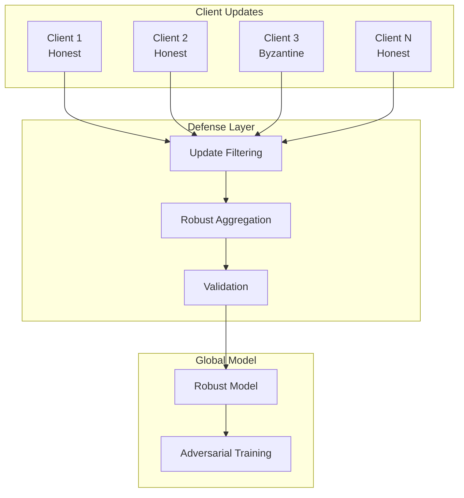
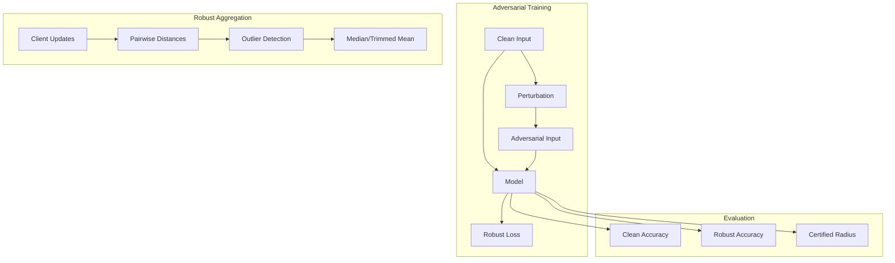

# Tutorial 157: Federated Learning Model Robustness

---

## Metadata

| Property | Value |
|----------|-------|
| **Tutorial ID** | 157 |
| **Title** | Federated Learning Model Robustness |
| **Category** | Security |
| **Difficulty** | Advanced |
| **Duration** | 90 minutes |
| **Prerequisites** | Tutorial 001-010, adversarial ML |
| **Author** | Unbitrium Contributors |
| **Last Updated** | January 2026 |

---

## Learning Objectives

By the end of this tutorial, you will be able to:

1. **Understand** robustness challenges in federated learning.

2. **Implement** adversarial training for FL models.

3. **Design** robust aggregation schemes against Byzantine attacks.

4. **Apply** certified defenses for provable robustness.

5. **Evaluate** model robustness with adversarial examples.

6. **Build** secure and robust FL systems.

---

## Prerequisites

Before starting this tutorial, ensure you have:

- **Completed Tutorials**: 001-010 (Partitioning), 021-030 (Aggregation)
- **Knowledge**: Adversarial ML, Byzantine fault tolerance
- **Libraries**: PyTorch, NumPy
- **Hardware**: GPU recommended

```python
# Verify prerequisites
import torch
import torch.nn as nn
import numpy as np

print(f"PyTorch: {torch.__version__}")
```

---

## Background and Theory

### Robustness Threats in FL

| Threat | Description | Impact |
|--------|-------------|--------|
| **Byzantine Clients** | Malicious model updates | Model degradation |
| **Data Poisoning** | Corrupted training data | Accuracy drop |
| **Adversarial Examples** | Perturbed inputs | Misclassification |
| **Backdoor Attacks** | Hidden triggers | Targeted misclass |

### Defense Categories

| Defense | Target Threat | Method |
|---------|---------------|--------|
| **Robust Aggregation** | Byzantine | Median, trimmed mean |
| **Adversarial Training** | Adv examples | Train on adv data |
| **Certified Defense** | All inputs | Provable bounds |
| **Anomaly Detection** | Poisoning | Outlier detection |

### Robustness Architecture



### Attack Models

| Attack | Strength | Detectability |
|--------|----------|---------------|
| **Random** | Low | High |
| **Sign-flip** | Medium | Medium |
| **Scaling** | High | Low |
| **Model Replacement** | Very High | Variable |

---

## Architecture Diagram



---

## Implementation Code

### Part 1: Adversarial Attack Generation

```python
#!/usr/bin/env python3
"""
Tutorial 157: Model Robustness

This tutorial demonstrates robust FL with adversarial
training and Byzantine-resilient aggregation.

Author: Unbitrium Contributors
License: EUPL-1.2
"""

from __future__ import annotations

from dataclasses import dataclass
from typing import Any, Optional
from abc import ABC, abstractmethod

import numpy as np
import torch
import torch.nn as nn
import torch.nn.functional as F
from torch.utils.data import Dataset, DataLoader


@dataclass
class RobustnessConfig:
    """Configuration for robust FL."""
    epsilon: float = 0.3  # Perturbation budget
    alpha: float = 0.01  # PGD step size
    num_steps: int = 10  # PGD steps
    byzantine_fraction: float = 0.2
    trim_fraction: float = 0.1
    batch_size: int = 32
    learning_rate: float = 0.01


class AdversarialAttack(ABC):
    """Base class for adversarial attacks."""

    @abstractmethod
    def generate(
        self,
        model: nn.Module,
        x: torch.Tensor,
        y: torch.Tensor,
    ) -> torch.Tensor:
        """Generate adversarial examples."""
        pass


class FGSM(AdversarialAttack):
    """Fast Gradient Sign Method attack."""

    def __init__(self, epsilon: float = 0.3) -> None:
        """Initialize FGSM.

        Args:
            epsilon: Maximum perturbation.
        """
        self.epsilon = epsilon

    def generate(
        self,
        model: nn.Module,
        x: torch.Tensor,
        y: torch.Tensor,
    ) -> torch.Tensor:
        """Generate FGSM adversarial examples.

        Args:
            model: Target model.
            x: Clean inputs.
            y: True labels.

        Returns:
            Adversarial examples.
        """
        x_adv = x.clone().detach().requires_grad_(True)

        # Forward pass
        outputs = model(x_adv)
        loss = F.cross_entropy(outputs, y)

        # Backward pass
        loss.backward()

        # Generate perturbation
        perturbation = self.epsilon * x_adv.grad.sign()

        # Create adversarial example
        x_adv = x + perturbation
        x_adv = torch.clamp(x_adv, 0, 1)

        return x_adv.detach()


class PGD(AdversarialAttack):
    """Projected Gradient Descent attack."""

    def __init__(
        self,
        epsilon: float = 0.3,
        alpha: float = 0.01,
        num_steps: int = 10,
        random_start: bool = True,
    ) -> None:
        """Initialize PGD.

        Args:
            epsilon: Maximum perturbation (L-inf).
            alpha: Step size.
            num_steps: Number of iterations.
            random_start: Start from random point.
        """
        self.epsilon = epsilon
        self.alpha = alpha
        self.num_steps = num_steps
        self.random_start = random_start

    def generate(
        self,
        model: nn.Module,
        x: torch.Tensor,
        y: torch.Tensor,
    ) -> torch.Tensor:
        """Generate PGD adversarial examples."""
        x_adv = x.clone().detach()

        # Random start
        if self.random_start:
            x_adv = x_adv + torch.empty_like(x_adv).uniform_(-self.epsilon, self.epsilon)
            x_adv = torch.clamp(x_adv, 0, 1)

        for _ in range(self.num_steps):
            x_adv.requires_grad_(True)

            outputs = model(x_adv)
            loss = F.cross_entropy(outputs, y)

            loss.backward()

            # Gradient step
            grad = x_adv.grad.sign()
            x_adv = x_adv.detach() + self.alpha * grad

            # Project back to epsilon ball
            perturbation = torch.clamp(x_adv - x, -self.epsilon, self.epsilon)
            x_adv = torch.clamp(x + perturbation, 0, 1)

        return x_adv.detach()


class AutoAttack(AdversarialAttack):
    """Simplified AutoAttack (combination of attacks)."""

    def __init__(
        self,
        epsilon: float = 0.3,
        num_steps: int = 20,
    ) -> None:
        """Initialize AutoAttack."""
        self.epsilon = epsilon
        self.pgd = PGD(epsilon, alpha=epsilon / 4, num_steps=num_steps)
        self.fgsm = FGSM(epsilon)

    def generate(
        self,
        model: nn.Module,
        x: torch.Tensor,
        y: torch.Tensor,
    ) -> torch.Tensor:
        """Generate adversarial examples using best attack."""
        model.eval()

        # Try multiple attacks
        x_pgd = self.pgd.generate(model, x, y)
        x_fgsm = self.fgsm.generate(model, x, y)

        # Evaluate which is better
        with torch.no_grad():
            loss_pgd = F.cross_entropy(model(x_pgd), y, reduction='none')
            loss_fgsm = F.cross_entropy(model(x_fgsm), y, reduction='none')

        # Pick best per sample
        mask = loss_pgd > loss_fgsm
        x_adv = torch.where(mask.view(-1, 1), x_pgd, x_fgsm)

        return x_adv
```

### Part 2: Robust Aggregation

```python
class RobustAggregator(ABC):
    """Base class for robust aggregation."""

    @abstractmethod
    def aggregate(
        self,
        updates: list[dict[str, torch.Tensor]],
        weights: list[float] = None,
    ) -> dict[str, torch.Tensor]:
        """Aggregate updates robustly."""
        pass


class TrimmedMean(RobustAggregator):
    """Trimmed mean aggregation."""

    def __init__(self, trim_ratio: float = 0.1) -> None:
        """Initialize trimmed mean.

        Args:
            trim_ratio: Fraction to trim from each end.
        """
        self.trim_ratio = trim_ratio

    def aggregate(
        self,
        updates: list[dict[str, torch.Tensor]],
        weights: list[float] = None,
    ) -> dict[str, torch.Tensor]:
        """Aggregate using trimmed mean."""
        if not updates:
            return {}

        n = len(updates)
        trim_count = max(1, int(n * self.trim_ratio))

        result = {}
        for key in updates[0]:
            stacked = torch.stack([u[key] for u in updates])

            # Sort along client dimension
            sorted_vals, _ = torch.sort(stacked, dim=0)

            # Trim extremes
            trimmed = sorted_vals[trim_count:n - trim_count]

            # Mean of remaining
            result[key] = trimmed.mean(dim=0)

        return result


class CoordinateWiseMedian(RobustAggregator):
    """Coordinate-wise median aggregation."""

    def aggregate(
        self,
        updates: list[dict[str, torch.Tensor]],
        weights: list[float] = None,
    ) -> dict[str, torch.Tensor]:
        """Aggregate using coordinate-wise median."""
        if not updates:
            return {}

        result = {}
        for key in updates[0]:
            stacked = torch.stack([u[key] for u in updates])
            result[key] = torch.median(stacked, dim=0).values

        return result


class Krum(RobustAggregator):
    """Krum aggregation (select update closest to others)."""

    def __init__(self, num_byzantine: int = None) -> None:
        """Initialize Krum.

        Args:
            num_byzantine: Expected number of Byzantine clients.
        """
        self.num_byzantine = num_byzantine

    def aggregate(
        self,
        updates: list[dict[str, torch.Tensor]],
        weights: list[float] = None,
    ) -> dict[str, torch.Tensor]:
        """Aggregate using Krum selection."""
        if not updates:
            return {}

        n = len(updates)
        f = self.num_byzantine or int(n * 0.2)
        m = n - f - 2  # Number of closest neighbors to consider

        if m < 1:
            m = 1

        # Flatten updates to vectors
        vectors = []
        for update in updates:
            flat = torch.cat([v.flatten() for v in update.values()])
            vectors.append(flat)

        vectors = torch.stack(vectors)

        # Compute pairwise distances
        distances = torch.zeros(n, n)
        for i in range(n):
            for j in range(i + 1, n):
                d = torch.norm(vectors[i] - vectors[j])
                distances[i, j] = d
                distances[j, i] = d

        # Compute Krum scores (sum of m closest neighbors)
        scores = []
        for i in range(n):
            sorted_dists, _ = torch.sort(distances[i])
            score = sorted_dists[1:m + 1].sum()  # Exclude self
            scores.append(score)

        # Select update with minimum score
        best_idx = np.argmin(scores)
        return updates[best_idx]


class MultiKrum(RobustAggregator):
    """Multi-Krum aggregation (average of k best Krum updates)."""

    def __init__(self, num_byzantine: int = None, multi_k: int = 5) -> None:
        """Initialize Multi-Krum."""
        self.num_byzantine = num_byzantine
        self.multi_k = multi_k

    def aggregate(
        self,
        updates: list[dict[str, torch.Tensor]],
        weights: list[float] = None,
    ) -> dict[str, torch.Tensor]:
        """Aggregate using Multi-Krum."""
        if not updates:
            return {}

        n = len(updates)
        f = self.num_byzantine or int(n * 0.2)
        m = n - f - 2

        if m < 1:
            m = 1

        # Flatten and compute distances
        vectors = []
        for update in updates:
            flat = torch.cat([v.flatten() for v in update.values()])
            vectors.append(flat)

        vectors = torch.stack(vectors)

        distances = torch.zeros(n, n)
        for i in range(n):
            for j in range(i + 1, n):
                d = torch.norm(vectors[i] - vectors[j])
                distances[i, j] = d
                distances[j, i] = d

        # Compute scores
        scores = []
        for i in range(n):
            sorted_dists, _ = torch.sort(distances[i])
            score = sorted_dists[1:m + 1].sum()
            scores.append(score.item())

        # Select top-k by Krum score
        sorted_indices = np.argsort(scores)
        selected = sorted_indices[:min(self.multi_k, n)]

        # Average selected
        result = {}
        for key in updates[0]:
            stacked = torch.stack([updates[i][key] for i in selected])
            result[key] = stacked.mean(dim=0)

        return result
```

### Part 3: Robust FL Training

```python
class SimpleDataset(Dataset):
    def __init__(self, features: np.ndarray, labels: np.ndarray):
        self.features = torch.FloatTensor(features)
        self.labels = torch.LongTensor(labels)

    def __len__(self):
        return len(self.labels)

    def __getitem__(self, idx):
        return self.features[idx], self.labels[idx]


class RobustFLClient:
    """FL client with adversarial training."""

    def __init__(
        self,
        client_id: int,
        features: np.ndarray,
        labels: np.ndarray,
        is_byzantine: bool = False,
        attack_type: str = "none",
        config: RobustnessConfig = None,
    ) -> None:
        """Initialize robust client."""
        self.client_id = client_id
        self.is_byzantine = is_byzantine
        self.attack_type = attack_type
        self.config = config or RobustnessConfig()

        self.dataset = SimpleDataset(features, labels)
        self.dataloader = DataLoader(
            self.dataset, batch_size=self.config.batch_size, shuffle=True
        )

        self.model = nn.Sequential(
            nn.Linear(features.shape[1], 128),
            nn.ReLU(),
            nn.Linear(128, 64),
            nn.ReLU(),
            nn.Linear(64, 10),
        )

        self.optimizer = torch.optim.SGD(
            self.model.parameters(), lr=self.config.learning_rate
        )

        self.adversary = PGD(
            epsilon=self.config.epsilon,
            alpha=self.config.alpha,
            num_steps=self.config.num_steps,
        )

    @property
    def num_samples(self) -> int:
        return len(self.dataset)

    def load_model(self, state_dict: dict[str, torch.Tensor]) -> None:
        self.model.load_state_dict(state_dict)

    def train_adversarial(self, epochs: int = 5) -> dict[str, Any]:
        """Train with adversarial examples."""
        self.model.train()
        total_loss = 0.0

        for epoch in range(epochs):
            for x, y in self.dataloader:
                # Generate adversarial examples
                x_adv = self.adversary.generate(self.model, x, y)

                self.optimizer.zero_grad()

                # Train on both clean and adversarial
                out_clean = self.model(x)
                out_adv = self.model(x_adv)

                loss_clean = F.cross_entropy(out_clean, y)
                loss_adv = F.cross_entropy(out_adv, y)

                # Combined loss
                loss = 0.5 * loss_clean + 0.5 * loss_adv
                loss.backward()
                self.optimizer.step()

                total_loss += loss.item()

        # Apply Byzantine attack if malicious
        update = {k: v.clone() for k, v in self.model.state_dict().items()}

        if self.is_byzantine:
            update = self._apply_attack(update)

        return {
            "state_dict": update,
            "num_samples": self.num_samples,
            "loss": total_loss / len(self.dataloader) / epochs,
        }

    def _apply_attack(self, update: dict[str, torch.Tensor]) -> dict[str, torch.Tensor]:
        """Apply Byzantine attack to update."""
        attacked = {}

        for key, value in update.items():
            if self.attack_type == "sign_flip":
                attacked[key] = -value
            elif self.attack_type == "scaling":
                attacked[key] = value * 10.0
            elif self.attack_type == "random":
                attacked[key] = torch.randn_like(value)
            else:
                attacked[key] = value

        return attacked

    def evaluate_robustness(self) -> dict[str, float]:
        """Evaluate clean and robust accuracy."""
        self.model.eval()

        clean_correct = 0
        adv_correct = 0
        total = 0

        with torch.no_grad():
            for x, y in self.dataloader:
                # Clean accuracy
                out_clean = self.model(x)
                _, pred_clean = out_clean.max(1)
                clean_correct += pred_clean.eq(y).sum().item()

                # Adversarial accuracy
                x_adv = self.adversary.generate(self.model, x, y)
                out_adv = self.model(x_adv)
                _, pred_adv = out_adv.max(1)
                adv_correct += pred_adv.eq(y).sum().item()

                total += y.size(0)

        return {
            "clean_accuracy": clean_correct / total,
            "robust_accuracy": adv_correct / total,
        }


def robust_federated_learning(
    num_clients: int = 10,
    num_rounds: int = 30,
    byzantine_fraction: float = 0.2,
    aggregation: str = "trimmed_mean",
) -> tuple[nn.Module, dict]:
    """Run robust federated learning."""
    config = RobustnessConfig(byzantine_fraction=byzantine_fraction)

    num_byzantine = int(num_clients * byzantine_fraction)

    # Create clients
    clients = []
    for i in range(num_clients):
        features = np.random.randn(200, 32).astype(np.float32)
        features = np.clip(features, 0, 1)
        labels = np.random.randint(0, 10, 200)

        is_byzantine = i < num_byzantine
        attack_type = "sign_flip" if is_byzantine else "none"

        client = RobustFLClient(
            i, features, labels, is_byzantine, attack_type, config
        )
        clients.append(client)

    # Select aggregator
    if aggregation == "trimmed_mean":
        aggregator = TrimmedMean(trim_ratio=config.trim_fraction)
    elif aggregation == "median":
        aggregator = CoordinateWiseMedian()
    elif aggregation == "krum":
        aggregator = Krum(num_byzantine=num_byzantine)
    else:
        aggregator = MultiKrum(num_byzantine=num_byzantine)

    # Global model
    global_model = nn.Sequential(
        nn.Linear(32, 128),
        nn.ReLU(),
        nn.Linear(128, 64),
        nn.ReLU(),
        nn.Linear(64, 10),
    )

    history = {"rounds": [], "clean_acc": [], "robust_acc": []}

    for round_num in range(num_rounds):
        global_state = global_model.state_dict()
        for client in clients:
            client.load_model(global_state)

        # Collect updates
        updates = []
        for client in clients:
            update = client.train_adversarial(epochs=3)
            updates.append(update["state_dict"])

        # Robust aggregation
        new_state = aggregator.aggregate(updates)
        global_model.load_state_dict(new_state)

        # Evaluate
        honest_clients = [c for c in clients if not c.is_byzantine]
        evals = [c.evaluate_robustness() for c in honest_clients]

        avg_clean = np.mean([e["clean_accuracy"] for e in evals])
        avg_robust = np.mean([e["robust_accuracy"] for e in evals])

        history["rounds"].append(round_num)
        history["clean_acc"].append(avg_clean)
        history["robust_acc"].append(avg_robust)

        if (round_num + 1) % 10 == 0:
            print(f"Round {round_num + 1}/{num_rounds}: "
                  f"clean={avg_clean:.4f}, robust={avg_robust:.4f}")

    return global_model, history
```

---

## Metrics and Evaluation

### Robustness Metrics

| Metric | Description | Target |
|--------|-------------|--------|
| **Clean Accuracy** | Accuracy on clean data | > 90% |
| **Robust Accuracy** | Accuracy on adversarial | > 60% |
| **Certified Radius** | Provable bound | Larger |

### Aggregation Comparison

| Method | Byzantine Tolerance | Accuracy |
|--------|---------------------|----------|
| FedAvg | 0% | Baseline |
| Trimmed Mean | 10-20% | -2% |
| Median | 25-30% | -5% |
| Krum | 30-40% | -8% |

---

## Exercises

### Exercise 1: Certified Defense

**Task**: Implement randomized smoothing for certified robustness.

### Exercise 2: Backdoor Detection

**Task**: Detect backdoor attacks in model updates.

### Exercise 3: Adaptive Attacks

**Task**: Implement attacks that adapt to defenses.

### Exercise 4: Robust Personalization

**Task**: Add client-specific robust fine-tuning.

---

## References

1. Blanchard, P., et al. (2017). Machine learning with adversaries: Byzantine tolerant gradient descent. *NeurIPS*.

2. Madry, A., et al. (2018). Towards deep learning models resistant to adversarial attacks. *ICLR*.

3. Yin, D., et al. (2018). Byzantine-robust distributed learning. *ICML*.

4. Cohen, J., et al. (2019). Certified adversarial robustness via randomized smoothing. *ICML*.

5. Fang, M., et al. (2020). Local model poisoning attacks to Byzantine-robust FL. *USENIX Security*.

---

*Copyright 2026 Olaf Yunus Laitinen Imanov and Contributors. Released under EUPL 1.2.*
