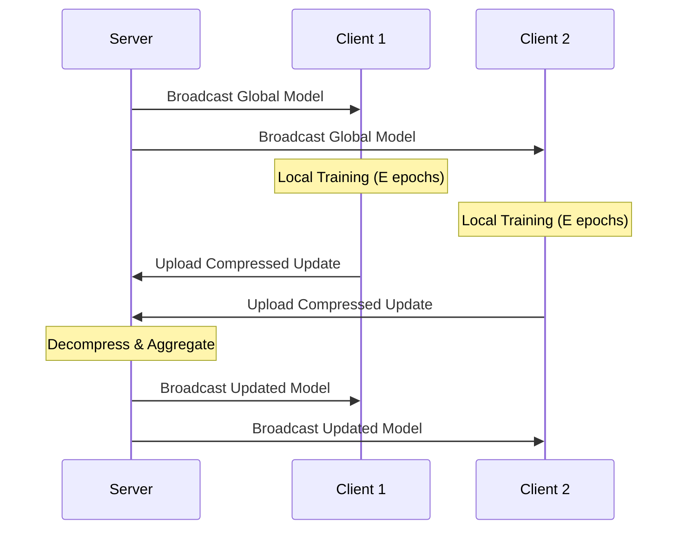
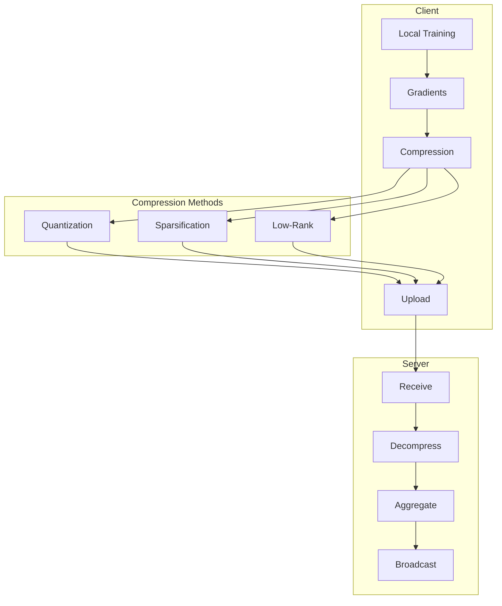

# Tutorial 158: Federated Learning Communication Optimization

---

## Metadata

| Property | Value |
|----------|-------|
| **Tutorial ID** | 158 |
| **Title** | Federated Learning Communication Optimization |
| **Category** | System Optimization |
| **Difficulty** | Intermediate |
| **Duration** | 75 minutes |
| **Prerequisites** | Tutorial 001-010 |
| **Author** | Unbitrium Contributors |
| **Last Updated** | January 2026 |

---

## Learning Objectives

By the end of this tutorial, you will be able to:

1. **Understand** communication bottlenecks in federated learning systems.

2. **Implement** gradient compression techniques for bandwidth reduction.

3. **Design** communication-efficient aggregation protocols.

4. **Apply** local SGD with reduced synchronization frequency.

5. **Evaluate** trade-offs between compression and model quality.

6. **Build** bandwidth-optimized FL systems for edge deployments.

---

## Prerequisites

Before starting this tutorial, ensure you have:

- **Completed Tutorials**: 001-010 (Partitioning), 021-030 (Aggregation)
- **Knowledge**: Gradient descent, distributed systems, compression
- **Libraries**: PyTorch, NumPy
- **Hardware**: CPU sufficient

```python
# Verify prerequisites
import torch
import torch.nn as nn
import numpy as np

print(f"PyTorch: {torch.__version__}")
```

---

## Background and Theory

### Communication Bottlenecks

| Component | Typical Size | Issue |
|-----------|--------------|-------|
| **Model Weights** | 10MB - 1GB | Upload bandwidth |
| **Gradients** | 10MB - 1GB | Same as weights |
| **Clients** | 100s - 1000s | Parallel uploads |
| **Rounds** | 100s | Repeated transfers |

### Communication Reduction Strategies

| Strategy | Compression | Accuracy Impact |
|----------|-------------|-----------------|
| **Quantization** | 4-32x | Minimal |
| **Sparsification** | 10-100x | Moderate |
| **Low-rank** | 2-10x | Minimal |
| **Local SGD** | Kx (K=sync interval) | Variable |

### Communication Timeline



### Compression-Accuracy Trade-off

| Compression Rate | Accuracy | Rounds to Converge |
|------------------|----------|-------------------|
| 1x (no compression) | 100% | Baseline |
| 10x | 98% | +10% |
| 100x | 95% | +30% |
| 1000x | 85% | +100% |

---

## Architecture Diagram



---

## Implementation Code

### Part 1: Compression Methods

```python
#!/usr/bin/env python3
"""
Tutorial 158: Communication Optimization

This tutorial demonstrates communication-efficient
federated learning with various compression techniques.

Author: Unbitrium Contributors
License: EUPL-1.2
"""

from __future__ import annotations

from dataclasses import dataclass
from typing import Any, Optional
from abc import ABC, abstractmethod

import numpy as np
import torch
import torch.nn as nn
import torch.nn.functional as F
from torch.utils.data import Dataset, DataLoader


@dataclass
class CompressionConfig:
    """Configuration for communication optimization."""
    quantization_bits: int = 8
    sparsification_ratio: float = 0.1  # Keep top 10%
    low_rank_ratio: float = 0.5
    local_steps: int = 10
    batch_size: int = 32
    learning_rate: float = 0.01


class Compressor(ABC):
    """Base class for gradient/model compressors."""

    @abstractmethod
    def compress(
        self,
        tensor: torch.Tensor,
    ) -> tuple[Any, dict]:
        """Compress a tensor.

        Args:
            tensor: Input tensor to compress.

        Returns:
            Tuple of (compressed_data, metadata).
        """
        pass

    @abstractmethod
    def decompress(
        self,
        compressed: Any,
        metadata: dict,
    ) -> torch.Tensor:
        """Decompress back to tensor.

        Args:
            compressed: Compressed data.
            metadata: Compression metadata.

        Returns:
            Decompressed tensor.
        """
        pass

    def compression_ratio(
        self,
        original: torch.Tensor,
        compressed: Any,
        metadata: dict,
    ) -> float:
        """Calculate compression ratio."""
        original_bits = original.numel() * 32  # Assuming float32
        # Override in subclasses
        return 1.0


class Quantizer(Compressor):
    """Uniform quantization compressor."""

    def __init__(self, bits: int = 8) -> None:
        """Initialize quantizer.

        Args:
            bits: Number of quantization bits.
        """
        self.bits = bits
        self.levels = 2 ** bits

    def compress(
        self,
        tensor: torch.Tensor,
    ) -> tuple[torch.Tensor, dict]:
        """Quantize tensor to fixed-point."""
        # Get range
        min_val = tensor.min().item()
        max_val = tensor.max().item()

        if max_val == min_val:
            # Handle constant tensor
            return torch.zeros_like(tensor, dtype=torch.uint8), {
                "min": min_val,
                "max": max_val,
                "shape": tensor.shape,
                "bits": self.bits,
            }

        # Quantize to [0, levels-1]
        scale = (max_val - min_val) / (self.levels - 1)
        quantized = ((tensor - min_val) / scale).round().clamp(0, self.levels - 1)

        # Convert to appropriate int type
        if self.bits <= 8:
            quantized = quantized.to(torch.uint8)
        else:
            quantized = quantized.to(torch.int16)

        metadata = {
            "min": min_val,
            "max": max_val,
            "shape": tensor.shape,
            "bits": self.bits,
        }

        return quantized, metadata

    def decompress(
        self,
        compressed: torch.Tensor,
        metadata: dict,
    ) -> torch.Tensor:
        """Dequantize back to float."""
        min_val = metadata["min"]
        max_val = metadata["max"]
        levels = 2 ** metadata["bits"]

        if max_val == min_val:
            return torch.full(metadata["shape"], min_val)

        scale = (max_val - min_val) / (levels - 1)
        return compressed.float() * scale + min_val

    def compression_ratio(
        self,
        original: torch.Tensor,
        compressed: Any,
        metadata: dict,
    ) -> float:
        original_bits = original.numel() * 32
        compressed_bits = compressed.numel() * self.bits + 128  # +metadata
        return original_bits / compressed_bits


class TopKSparsifier(Compressor):
    """Top-K sparsification compressor."""

    def __init__(self, ratio: float = 0.1) -> None:
        """Initialize sparsifier.

        Args:
            ratio: Fraction of values to keep.
        """
        self.ratio = ratio
        self.residuals = {}

    def compress(
        self,
        tensor: torch.Tensor,
        key: str = None,
    ) -> tuple[tuple[torch.Tensor, torch.Tensor], dict]:
        """Keep only top-K values by magnitude."""
        flat = tensor.flatten()

        # Add residual from previous round
        if key and key in self.residuals:
            flat = flat + self.residuals[key]

        k = max(1, int(len(flat) * self.ratio))

        # Get top-k indices
        _, indices = flat.abs().topk(k)
        values = flat[indices]

        # Store residual
        if key:
            residual = flat.clone()
            residual[indices] = 0
            self.residuals[key] = residual

        metadata = {
            "shape": tensor.shape,
            "numel": tensor.numel(),
        }

        return (values, indices), metadata

    def decompress(
        self,
        compressed: tuple[torch.Tensor, torch.Tensor],
        metadata: dict,
    ) -> torch.Tensor:
        """Reconstruct from sparse representation."""
        values, indices = compressed
        result = torch.zeros(metadata["numel"])
        result[indices] = values
        return result.view(metadata["shape"])

    def compression_ratio(
        self,
        original: torch.Tensor,
        compressed: Any,
        metadata: dict,
    ) -> float:
        values, indices = compressed
        original_bits = original.numel() * 32
        # Values are float32, indices are int64
        compressed_bits = values.numel() * 32 + indices.numel() * 64
        return original_bits / compressed_bits


class RandomSparsifier(Compressor):
    """Random sparsification with unbiased estimation."""

    def __init__(self, ratio: float = 0.1) -> None:
        """Initialize random sparsifier."""
        self.ratio = ratio

    def compress(
        self,
        tensor: torch.Tensor,
    ) -> tuple[tuple[torch.Tensor, torch.Tensor], dict]:
        """Randomly sample values."""
        flat = tensor.flatten()
        k = max(1, int(len(flat) * self.ratio))

        # Random indices
        indices = torch.randperm(len(flat))[:k]
        values = flat[indices] / self.ratio  # Scale for unbiased estimate

        metadata = {
            "shape": tensor.shape,
            "numel": tensor.numel(),
        }

        return (values, indices), metadata

    def decompress(
        self,
        compressed: tuple[torch.Tensor, torch.Tensor],
        metadata: dict,
    ) -> torch.Tensor:
        """Reconstruct from sparse representation."""
        values, indices = compressed
        result = torch.zeros(metadata["numel"])
        result[indices] = values
        return result.view(metadata["shape"])


class PowerSGDCompressor(Compressor):
    """Low-rank compression using power iteration."""

    def __init__(self, rank: int = 4) -> None:
        """Initialize PowerSGD.

        Args:
            rank: Target rank for approximation.
        """
        self.rank = rank
        self.P = None  # Stored for warm start

    def compress(
        self,
        tensor: torch.Tensor,
    ) -> tuple[tuple[torch.Tensor, torch.Tensor], dict]:
        """Compress to low-rank factors."""
        if tensor.dim() < 2:
            # Return as-is for 1D tensors
            return (tensor, None), {"shape": tensor.shape, "is_1d": True}

        # Reshape to 2D
        original_shape = tensor.shape
        matrix = tensor.view(tensor.size(0), -1)
        m, n = matrix.shape
        rank = min(self.rank, min(m, n))

        # Initialize or reuse P
        if self.P is None or self.P.shape != (n, rank):
            self.P = torch.randn(n, rank)

        # Power iteration
        Q = matrix @ self.P
        Q, _ = torch.linalg.qr(Q)
        P = matrix.t() @ Q

        metadata = {
            "shape": original_shape,
            "is_1d": False,
        }

        return (Q, P), metadata

    def decompress(
        self,
        compressed: tuple[torch.Tensor, torch.Tensor],
        metadata: dict,
    ) -> torch.Tensor:
        """Reconstruct from low-rank factors."""
        Q, P = compressed

        if metadata["is_1d"]:
            return Q

        matrix = Q @ P.t()
        return matrix.view(metadata["shape"])
```

### Part 2: Communication-Efficient Client

```python
class EfficientDataset(Dataset):
    """Simple dataset for demonstration."""

    def __init__(self, features: np.ndarray, labels: np.ndarray):
        self.features = torch.FloatTensor(features)
        self.labels = torch.LongTensor(labels)

    def __len__(self):
        return len(self.labels)

    def __getitem__(self, idx):
        return self.features[idx], self.labels[idx]


class CommunicationEfficientClient:
    """FL client with communication optimization."""

    def __init__(
        self,
        client_id: int,
        features: np.ndarray,
        labels: np.ndarray,
        config: Optional[CompressionConfig] = None,
        compression_type: str = "quantization",
    ) -> None:
        """Initialize efficient client.

        Args:
            client_id: Unique client identifier.
            features: Training features.
            labels: Training labels.
            config: Compression configuration.
            compression_type: Type of compression to use.
        """
        self.client_id = client_id
        self.config = config or CompressionConfig()

        self.dataset = EfficientDataset(features, labels)
        self.dataloader = DataLoader(
            self.dataset,
            batch_size=self.config.batch_size,
            shuffle=True,
        )

        self.model = nn.Sequential(
            nn.Linear(features.shape[1], 128),
            nn.ReLU(),
            nn.Dropout(0.2),
            nn.Linear(128, 64),
            nn.ReLU(),
            nn.Dropout(0.2),
            nn.Linear(64, 10),
        )

        self.optimizer = torch.optim.SGD(
            self.model.parameters(),
            lr=self.config.learning_rate,
            momentum=0.9,
        )

        # Select compressor
        if compression_type == "quantization":
            self.compressor = Quantizer(bits=self.config.quantization_bits)
        elif compression_type == "topk":
            self.compressor = TopKSparsifier(ratio=self.config.sparsification_ratio)
        elif compression_type == "random":
            self.compressor = RandomSparsifier(ratio=self.config.sparsification_ratio)
        elif compression_type == "powersgd":
            self.compressor = PowerSGDCompressor(rank=4)
        else:
            self.compressor = None

        self.initial_state = None

    @property
    def num_samples(self) -> int:
        return len(self.dataset)

    def load_global_model(self, state_dict: dict[str, torch.Tensor]) -> None:
        """Load global model and store initial state."""
        self.model.load_state_dict(state_dict)
        self.initial_state = {k: v.clone() for k, v in state_dict.items()}

    def train_local(self, epochs: int = 5) -> dict[str, Any]:
        """Train locally and return compressed update.

        Args:
            epochs: Number of local epochs.

        Returns:
            Dictionary with compressed update and metrics.
        """
        self.model.train()
        total_loss = 0.0
        correct = 0
        total = 0

        for epoch in range(epochs):
            for features, labels in self.dataloader:
                self.optimizer.zero_grad()
                outputs = self.model(features)
                loss = F.cross_entropy(outputs, labels)
                loss.backward()
                self.optimizer.step()

                total_loss += loss.item()
                _, predicted = outputs.max(1)
                total += labels.size(0)
                correct += predicted.eq(labels).sum().item()

        # Compute delta (update)
        current_state = self.model.state_dict()
        delta = {}
        for key in current_state:
            delta[key] = current_state[key] - self.initial_state[key]

        # Compress delta
        compressed_delta = {}
        metadata = {}
        total_compression_ratio = 0.0

        for key, tensor in delta.items():
            if self.compressor is not None:
                comp, meta = self.compressor.compress(tensor)
                ratio = self.compressor.compression_ratio(tensor, comp, meta)
                compressed_delta[key] = comp
                metadata[key] = meta
                total_compression_ratio += ratio
            else:
                compressed_delta[key] = tensor
                metadata[key] = {"shape": tensor.shape}
                total_compression_ratio += 1.0

        avg_compression = total_compression_ratio / len(delta) if delta else 1.0

        return {
            "compressed_delta": compressed_delta,
            "metadata": metadata,
            "num_samples": self.num_samples,
            "loss": total_loss / len(self.dataloader) / epochs,
            "accuracy": correct / total if total > 0 else 0.0,
            "compression_ratio": avg_compression,
        }


class EfficientServer:
    """Server with decompression and aggregation."""

    def __init__(
        self,
        model_template: nn.Module,
        compressor: Optional[Compressor] = None,
    ) -> None:
        """Initialize efficient server.

        Args:
            model_template: Model architecture template.
            compressor: Compressor for decompression.
        """
        self.global_model = model_template
        self.compressor = compressor

    def aggregate(
        self,
        client_updates: list[dict[str, Any]],
    ) -> dict[str, torch.Tensor]:
        """Aggregate compressed updates.

        Args:
            client_updates: List of client updates.

        Returns:
            Aggregated model state.
        """
        # Decompress all updates
        decompressed = []
        for update in client_updates:
            delta = {}
            for key in update["compressed_delta"]:
                if self.compressor is not None:
                    tensor = self.compressor.decompress(
                        update["compressed_delta"][key],
                        update["metadata"][key],
                    )
                else:
                    tensor = update["compressed_delta"][key]
                delta[key] = tensor
            decompressed.append({
                "delta": delta,
                "num_samples": update["num_samples"],
            })

        # Weighted average
        total_samples = sum(d["num_samples"] for d in decompressed)
        aggregated_delta = {}

        first_delta = decompressed[0]["delta"]
        for key in first_delta:
            weighted_sum = torch.zeros_like(first_delta[key])
            for d in decompressed:
                weight = d["num_samples"] / total_samples
                weighted_sum += weight * d["delta"][key]
            aggregated_delta[key] = weighted_sum

        # Apply delta to global model
        current_state = self.global_model.state_dict()
        new_state = {}
        for key in current_state:
            new_state[key] = current_state[key] + aggregated_delta[key]

        self.global_model.load_state_dict(new_state)
        return new_state


def communication_efficient_fl(
    num_clients: int = 10,
    num_rounds: int = 50,
    compression_type: str = "quantization",
) -> tuple[nn.Module, dict]:
    """Run communication-efficient FL.

    Args:
        num_clients: Number of clients.
        num_rounds: Communication rounds.
        compression_type: Compression method.

    Returns:
        Tuple of (model, history).
    """
    config = CompressionConfig()

    # Create clients
    clients = []
    for i in range(num_clients):
        features = np.random.randn(200, 32).astype(np.float32)
        labels = np.random.randint(0, 10, 200)
        client = CommunicationEfficientClient(
            i, features, labels, config, compression_type
        )
        clients.append(client)

    # Global model
    global_model = nn.Sequential(
        nn.Linear(32, 128),
        nn.ReLU(),
        nn.Dropout(0.2),
        nn.Linear(128, 64),
        nn.ReLU(),
        nn.Dropout(0.2),
        nn.Linear(64, 10),
    )

    # Compressor for server
    if compression_type == "quantization":
        server_compressor = Quantizer(bits=config.quantization_bits)
    elif compression_type in ["topk", "random"]:
        server_compressor = TopKSparsifier(ratio=config.sparsification_ratio)
    else:
        server_compressor = None

    server = EfficientServer(global_model, server_compressor)

    history = {"rounds": [], "losses": [], "accuracies": [], "compression_ratios": []}

    for round_num in range(num_rounds):
        # Distribute global model
        global_state = global_model.state_dict()
        for client in clients:
            client.load_global_model(global_state)

        # Local training
        updates = []
        for client in clients:
            update = client.train_local(epochs=3)
            updates.append(update)

        # Aggregate
        server.aggregate(updates)

        # Log metrics
        avg_loss = np.mean([u["loss"] for u in updates])
        avg_acc = np.mean([u["accuracy"] for u in updates])
        avg_comp = np.mean([u["compression_ratio"] for u in updates])

        history["rounds"].append(round_num)
        history["losses"].append(avg_loss)
        history["accuracies"].append(avg_acc)
        history["compression_ratios"].append(avg_comp)

        if (round_num + 1) % 10 == 0:
            print(f"Round {round_num + 1}/{num_rounds}: "
                  f"loss={avg_loss:.4f}, acc={avg_acc:.4f}, "
                  f"compression={avg_comp:.1f}x")

    return global_model, history
```

---

## Metrics and Evaluation

### Communication Metrics

| Metric | Description | Target |
|--------|-------------|--------|
| **Compression Ratio** | Original/Compressed size | Higher |
| **Accuracy** | Model performance | Maintain |
| **Convergence Speed** | Rounds to target | Similar |

### Method Comparison

| Method | Compression | Accuracy Impact |
|--------|-------------|-----------------|
| Quantization (8-bit) | 4x | < 1% |
| Top-K (10%) | 10x | 2-3% |
| PowerSGD | 5x | 1-2% |

---

## Exercises

### Exercise 1: Adaptive Compression

**Task**: Adjust compression based on network conditions.

### Exercise 2: Error Feedback

**Task**: Implement error feedback for TopK sparsification.

### Exercise 3: Gradient Accumulation

**Task**: Reduce communication with gradient accumulation.

### Exercise 4: Async Communication

**Task**: Implement asynchronous model updates.

---

## References

1. Alistarh, D., et al. (2017). QSGD: Communication-efficient SGD via gradient quantization. *NeurIPS*.

2. Lin, Y., et al. (2018). Deep gradient compression. In *ICLR*.

3. Vogels, T., et al. (2019). PowerSGD: Practical low-rank gradient compression. In *NeurIPS*.

4. Stich, S. U. (2019). Local SGD converges fast and communicates little. In *ICLR*.

5. Karimireddy, S. P., et al. (2019). Error feedback fixes SignSGD. In *ICML*.

---

*Copyright 2026 Olaf Yunus Laitinen Imanov and Contributors. Released under EUPL 1.2.*
