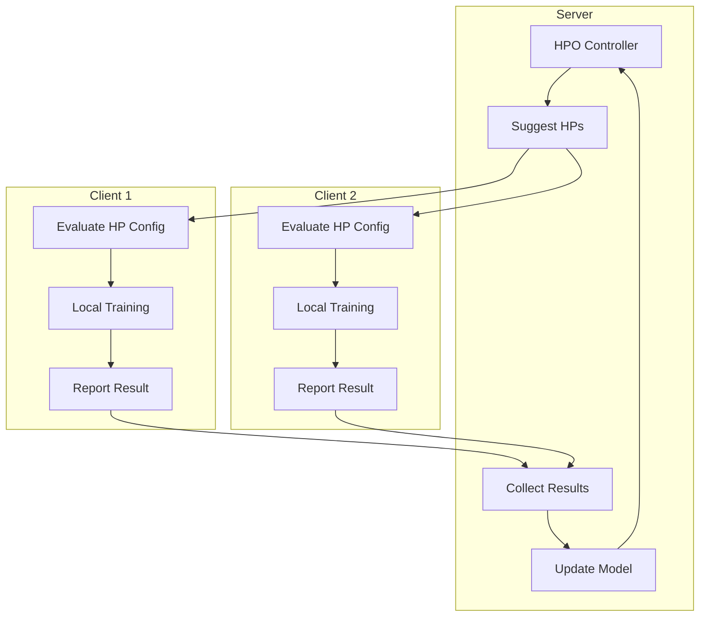
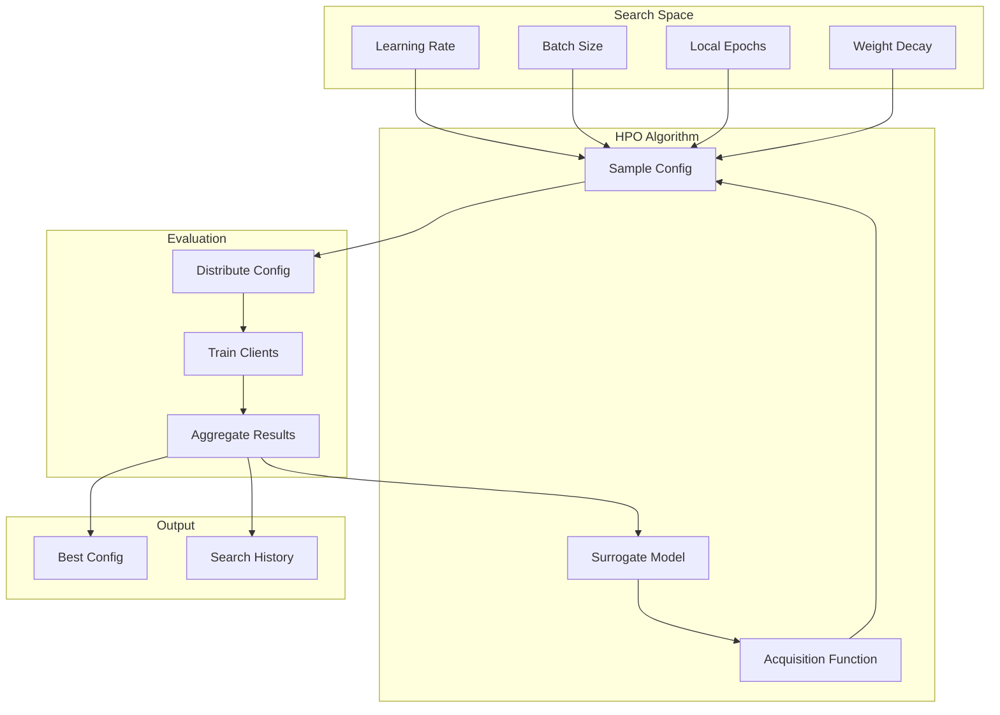

# Tutorial 159: Federated Learning with Hyperparameter Optimization

---

## Metadata

| Property | Value |
|----------|-------|
| **Tutorial ID** | 159 |
| **Title** | Federated Learning with Hyperparameter Optimization |
| **Category** | Optimization |
| **Difficulty** | Advanced |
| **Duration** | 90 minutes |
| **Prerequisites** | Tutorial 001-010, optimization basics |
| **Author** | Unbitrium Contributors |
| **Last Updated** | January 2026 |

---

## Learning Objectives

By the end of this tutorial, you will be able to:

1. **Understand** hyperparameter optimization challenges in federated settings.

2. **Implement** federated hyperparameter search across distributed clients.

3. **Design** personalized hyperparameter tuning strategies.

4. **Apply** Bayesian optimization for efficient HPO.

5. **Handle** resource-constrained hyperparameter search.

6. **Build** automated ML pipelines for federated learning.

---

## Prerequisites

Before starting this tutorial, ensure you have:

- **Completed Tutorials**: 001-010 (Partitioning), 021-030 (Aggregation)
- **Knowledge**: Hyperparameter tuning, Bayesian optimization
- **Libraries**: PyTorch, NumPy
- **Hardware**: CPU sufficient

```python
# Verify prerequisites
import torch
import numpy as np
from typing import Any, Dict, List

print(f"PyTorch: {torch.__version__}")
```

---

## Background and Theory

### HPO Challenges in FL

| Challenge | Description | Impact |
|-----------|-------------|--------|
| **Heterogeneity** | Different optimal HPs per client | Suboptimal global |
| **Privacy** | Can't share data for tuning | Limited search |
| **Communication** | HP search adds rounds | Expensive |
| **Resources** | Clients have limited compute | Constrained |

### HPO Strategies for FL

| Strategy | Description | Efficiency |
|----------|-------------|------------|
| **Grid Search** | Exhaustive search | Low |
| **Random Search** | Random sampling | Medium |
| **Bayesian Opt** | Model-based search | High |
| **Population** | Evolutionary methods | Medium |

### Federated HPO Architecture



### Search Space Design

| Hyperparameter | Type | Range |
|----------------|------|-------|
| **Learning Rate** | Log-uniform | [1e-5, 1e-1] |
| **Batch Size** | Categorical | [16, 32, 64, 128] |
| **Local Epochs** | Integer | [1, 10] |
| **Weight Decay** | Log-uniform | [1e-6, 1e-2] |
| **Dropout** | Uniform | [0.0, 0.5] |

---

## Architecture Diagram



---

## Implementation Code

### Part 1: Search Space Definition

```python
#!/usr/bin/env python3
"""
Tutorial 159: Hyperparameter Optimization

This tutorial demonstrates federated hyperparameter
optimization with Bayesian and evolutionary methods.

Author: Unbitrium Contributors
License: EUPL-1.2
"""

from __future__ import annotations

from dataclasses import dataclass, field
from typing import Any, Callable, Optional
from abc import ABC, abstractmethod
import copy

import numpy as np
import torch
import torch.nn as nn
import torch.nn.functional as F
from torch.utils.data import Dataset, DataLoader


@dataclass
class HPConfig:
    """Hyperparameter configuration."""
    learning_rate: float = 0.01
    batch_size: int = 32
    local_epochs: int = 5
    weight_decay: float = 1e-4
    dropout: float = 0.2
    hidden_dim: int = 64
    momentum: float = 0.9

    def to_dict(self) -> dict[str, Any]:
        return {
            "learning_rate": self.learning_rate,
            "batch_size": self.batch_size,
            "local_epochs": self.local_epochs,
            "weight_decay": self.weight_decay,
            "dropout": self.dropout,
            "hidden_dim": self.hidden_dim,
            "momentum": self.momentum,
        }

    @classmethod
    def from_dict(cls, d: dict[str, Any]) -> "HPConfig":
        return cls(**{k: v for k, v in d.items() if k in cls.__dataclass_fields__})


class HyperparameterSpace:
    """Define search space for hyperparameters."""

    def __init__(self) -> None:
        """Initialize search space."""
        self.space = {
            "learning_rate": {
                "type": "log_uniform",
                "low": 1e-5,
                "high": 1e-1,
            },
            "batch_size": {
                "type": "categorical",
                "choices": [16, 32, 64, 128],
            },
            "local_epochs": {
                "type": "integer",
                "low": 1,
                "high": 10,
            },
            "weight_decay": {
                "type": "log_uniform",
                "low": 1e-6,
                "high": 1e-2,
            },
            "dropout": {
                "type": "uniform",
                "low": 0.0,
                "high": 0.5,
            },
            "hidden_dim": {
                "type": "categorical",
                "choices": [32, 64, 128, 256],
            },
            "momentum": {
                "type": "uniform",
                "low": 0.5,
                "high": 0.99,
            },
        }

    def sample(self) -> HPConfig:
        """Sample a random configuration.

        Returns:
            Randomly sampled HP config.
        """
        config = {}

        for name, spec in self.space.items():
            if spec["type"] == "log_uniform":
                log_low = np.log(spec["low"])
                log_high = np.log(spec["high"])
                config[name] = float(np.exp(np.random.uniform(log_low, log_high)))

            elif spec["type"] == "uniform":
                config[name] = float(np.random.uniform(spec["low"], spec["high"]))

            elif spec["type"] == "integer":
                config[name] = int(np.random.randint(spec["low"], spec["high"] + 1))

            elif spec["type"] == "categorical":
                config[name] = np.random.choice(spec["choices"])

        return HPConfig.from_dict(config)

    def encode(self, config: HPConfig) -> np.ndarray:
        """Encode config to numeric vector for optimization.

        Args:
            config: HP configuration.

        Returns:
            Numeric encoding.
        """
        d = config.to_dict()
        encoded = []

        for name, spec in self.space.items():
            value = d[name]

            if spec["type"] == "log_uniform":
                encoded.append(np.log(value))

            elif spec["type"] == "uniform":
                encoded.append(value)

            elif spec["type"] == "integer":
                encoded.append(float(value))

            elif spec["type"] == "categorical":
                idx = spec["choices"].index(value)
                encoded.append(float(idx))

        return np.array(encoded)

    def decode(self, vector: np.ndarray) -> HPConfig:
        """Decode numeric vector to config.

        Args:
            vector: Numeric encoding.

        Returns:
            HP configuration.
        """
        config = {}
        for i, (name, spec) in enumerate(self.space.items()):
            value = vector[i]

            if spec["type"] == "log_uniform":
                config[name] = float(np.clip(np.exp(value), spec["low"], spec["high"]))

            elif spec["type"] == "uniform":
                config[name] = float(np.clip(value, spec["low"], spec["high"]))

            elif spec["type"] == "integer":
                config[name] = int(np.clip(round(value), spec["low"], spec["high"]))

            elif spec["type"] == "categorical":
                idx = int(np.clip(round(value), 0, len(spec["choices"]) - 1))
                config[name] = spec["choices"][idx]

        return HPConfig.from_dict(config)
```

### Part 2: HPO Algorithms

```python
class HPOAlgorithm(ABC):
    """Base class for HPO algorithms."""

    @abstractmethod
    def suggest(self) -> HPConfig:
        """Suggest next configuration to evaluate."""
        pass

    @abstractmethod
    def report(self, config: HPConfig, result: float) -> None:
        """Report evaluation result."""
        pass

    @abstractmethod
    def get_best(self) -> tuple[HPConfig, float]:
        """Get best configuration found."""
        pass


class RandomSearch(HPOAlgorithm):
    """Random search HPO."""

    def __init__(self, space: HyperparameterSpace, seed: int = None) -> None:
        """Initialize random search."""
        self.space = space
        self.history: list[tuple[HPConfig, float]] = []
        if seed:
            np.random.seed(seed)

    def suggest(self) -> HPConfig:
        return self.space.sample()

    def report(self, config: HPConfig, result: float) -> None:
        self.history.append((config, result))

    def get_best(self) -> tuple[HPConfig, float]:
        if not self.history:
            return self.space.sample(), float("inf")
        return min(self.history, key=lambda x: x[1])


class BayesianOptimization(HPOAlgorithm):
    """Bayesian optimization with Gaussian Process surrogate."""

    def __init__(
        self,
        space: HyperparameterSpace,
        n_initial: int = 5,
        exploration_weight: float = 2.0,
    ) -> None:
        """Initialize Bayesian optimization.

        Args:
            space: Hyperparameter space.
            n_initial: Initial random samples.
            exploration_weight: Exploration vs exploitation.
        """
        self.space = space
        self.n_initial = n_initial
        self.exploration_weight = exploration_weight

        self.X: list[np.ndarray] = []
        self.y: list[float] = []
        self.configs: list[HPConfig] = []

    def _acquisition_function(self, x: np.ndarray) -> float:
        """Upper Confidence Bound acquisition function."""
        if len(self.X) < 2:
            return 0.0

        X = np.stack(self.X)
        y = np.array(self.y)

        # Simple kernel-based prediction
        distances = np.linalg.norm(X - x, axis=1)
        weights = np.exp(-distances)
        weights /= weights.sum() + 1e-8

        mean = np.dot(weights, y)
        variance = np.dot(weights, (y - mean) ** 2)
        std = np.sqrt(variance + 1e-8)

        # UCB (minimize, so lower is better)
        ucb = mean - self.exploration_weight * std
        return ucb

    def suggest(self) -> HPConfig:
        """Suggest next configuration."""
        if len(self.X) < self.n_initial:
            return self.space.sample()

        # Sample candidates and pick best by acquisition
        best_acq = float("inf")
        best_config = None

        for _ in range(100):
            config = self.space.sample()
            x = self.space.encode(config)
            acq = self._acquisition_function(x)

            if acq < best_acq:
                best_acq = acq
                best_config = config

        return best_config

    def report(self, config: HPConfig, result: float) -> None:
        """Report evaluation result."""
        self.X.append(self.space.encode(config))
        self.y.append(result)
        self.configs.append(config)

    def get_best(self) -> tuple[HPConfig, float]:
        if not self.y:
            return self.space.sample(), float("inf")
        best_idx = np.argmin(self.y)
        return self.configs[best_idx], self.y[best_idx]


class PopulationBasedTraining(HPOAlgorithm):
    """Population-based training HPO."""

    def __init__(
        self,
        space: HyperparameterSpace,
        population_size: int = 10,
        mutation_rate: float = 0.2,
    ) -> None:
        """Initialize PBT.

        Args:
            space: Hyperparameter space.
            population_size: Size of population.
            mutation_rate: Mutation probability.
        """
        self.space = space
        self.population_size = population_size
        self.mutation_rate = mutation_rate

        # Initialize population
        self.population = [space.sample() for _ in range(population_size)]
        self.scores = [float("inf")] * population_size
        self.generation = 0

    def _mutate(self, config: HPConfig) -> HPConfig:
        """Mutate a configuration."""
        d = config.to_dict()
        mutated = {}

        for name, value in d.items():
            if np.random.rand() < self.mutation_rate:
                spec = self.space.space[name]
                if spec["type"] == "log_uniform":
                    factor = np.exp(np.random.randn() * 0.5)
                    new_val = value * factor
                    mutated[name] = np.clip(new_val, spec["low"], spec["high"])
                elif spec["type"] == "uniform":
                    delta = (spec["high"] - spec["low"]) * np.random.randn() * 0.1
                    mutated[name] = np.clip(value + delta, spec["low"], spec["high"])
                elif spec["type"] == "integer":
                    delta = int(np.random.choice([-1, 0, 1]))
                    mutated[name] = np.clip(value + delta, spec["low"], spec["high"])
                elif spec["type"] == "categorical":
                    mutated[name] = np.random.choice(spec["choices"])
            else:
                mutated[name] = value

        return HPConfig.from_dict(mutated)

    def suggest(self) -> HPConfig:
        """Suggest next configuration."""
        if self.generation == 0:
            idx = len([s for s in self.scores if s < float("inf")])
            if idx < self.population_size:
                return self.population[idx]

        # Exploit top performers
        sorted_idx = np.argsort(self.scores)
        top_idx = sorted_idx[:max(1, self.population_size // 4)]

        parent = self.population[np.random.choice(top_idx)]
        return self._mutate(parent)

    def report(self, config: HPConfig, result: float) -> None:
        """Report result and possibly replace worst."""
        # Find if this config is in population
        for i, pop_config in enumerate(self.population):
            if self._configs_equal(config, pop_config):
                self.scores[i] = result
                return

        # Replace worst if better
        worst_idx = np.argmax(self.scores)
        if result < self.scores[worst_idx]:
            self.population[worst_idx] = config
            self.scores[worst_idx] = result

        self.generation += 1

    def _configs_equal(self, c1: HPConfig, c2: HPConfig) -> bool:
        return c1.to_dict() == c2.to_dict()

    def get_best(self) -> tuple[HPConfig, float]:
        best_idx = np.argmin(self.scores)
        return self.population[best_idx], self.scores[best_idx]
```

### Part 3: Federated HPO

```python
class SimpleDataset(Dataset):
    def __init__(self, features: np.ndarray, labels: np.ndarray):
        self.features = torch.FloatTensor(features)
        self.labels = torch.LongTensor(labels)

    def __len__(self):
        return len(self.labels)

    def __getitem__(self, idx):
        return self.features[idx], self.labels[idx]


def create_model(hp: HPConfig, input_dim: int, num_classes: int) -> nn.Module:
    """Create model with given hyperparameters."""
    return nn.Sequential(
        nn.Linear(input_dim, hp.hidden_dim),
        nn.ReLU(),
        nn.Dropout(hp.dropout),
        nn.Linear(hp.hidden_dim, hp.hidden_dim),
        nn.ReLU(),
        nn.Dropout(hp.dropout),
        nn.Linear(hp.hidden_dim, num_classes),
    )


class FederatedHPOClient:
    """Client for federated HPO."""

    def __init__(
        self,
        client_id: int,
        features: np.ndarray,
        labels: np.ndarray,
    ) -> None:
        self.client_id = client_id
        self.features = features
        self.labels = labels
        self.num_classes = len(np.unique(labels))

    def evaluate(self, hp: HPConfig) -> dict[str, float]:
        """Evaluate a hyperparameter configuration.

        Args:
            hp: Hyperparameter configuration.

        Returns:
            Evaluation metrics.
        """
        # Create model
        model = create_model(hp, self.features.shape[1], self.num_classes)

        # Create dataset
        dataset = SimpleDataset(self.features, self.labels)
        dataloader = DataLoader(dataset, batch_size=hp.batch_size, shuffle=True)

        # Optimizer
        optimizer = torch.optim.SGD(
            model.parameters(),
            lr=hp.learning_rate,
            momentum=hp.momentum,
            weight_decay=hp.weight_decay,
        )

        # Train
        model.train()
        total_loss = 0.0
        for epoch in range(hp.local_epochs):
            for x, y in dataloader:
                optimizer.zero_grad()
                output = model(x)
                loss = F.cross_entropy(output, y)
                loss.backward()
                optimizer.step()
                total_loss += loss.item()

        # Evaluate
        model.eval()
        correct = 0
        total = 0
        with torch.no_grad():
            for x, y in dataloader:
                output = model(x)
                _, pred = output.max(1)
                correct += pred.eq(y).sum().item()
                total += y.size(0)

        return {
            "loss": total_loss / len(dataloader) / hp.local_epochs,
            "accuracy": correct / total,
        }


def federated_hpo(
    num_clients: int = 10,
    num_trials: int = 30,
    algorithm: str = "bayesian",
) -> tuple[HPConfig, list[tuple[HPConfig, float]]]:
    """Run federated HPO.

    Args:
        num_clients: Number of clients.
        num_trials: Number of HP configurations to try.
        algorithm: HPO algorithm ('random', 'bayesian', 'pbt').

    Returns:
        Tuple of (best config, search history).
    """
    # Create clients
    clients = []
    for i in range(num_clients):
        np.random.seed(i * 100)
        features = np.random.randn(200, 32).astype(np.float32)
        labels = np.random.randint(0, 10, 200)
        clients.append(FederatedHPOClient(i, features, labels))

    # Create HPO algorithm
    space = HyperparameterSpace()

    if algorithm == "bayesian":
        hpo = BayesianOptimization(space)
    elif algorithm == "pbt":
        hpo = PopulationBasedTraining(space)
    else:
        hpo = RandomSearch(space)

    history = []

    for trial in range(num_trials):
        hp = hpo.suggest()

        # Evaluate on all clients
        results = []
        for client in clients:
            result = client.evaluate(hp)
            results.append(result["loss"])

        # Aggregate results (mean loss)
        mean_loss = np.mean(results)
        hpo.report(hp, mean_loss)
        history.append((hp, mean_loss))

        if (trial + 1) % 5 == 0:
            best_hp, best_loss = hpo.get_best()
            print(f"Trial {trial + 1}/{num_trials}: "
                  f"loss={mean_loss:.4f}, best={best_loss:.4f}")

    best_hp, best_loss = hpo.get_best()
    print(f"\nBest config: {best_hp.to_dict()}")
    print(f"Best loss: {best_loss:.4f}")

    return best_hp, history
```

---

## Metrics and Evaluation

### HPO Metrics

| Metric | Description | Target |
|--------|-------------|--------|
| **Best Loss** | Minimum found | Lower |
| **Convergence** | Trials to best | Fewer |
| **Variance** | Cross-client variance | Lower |

### Expected Performance

| Algorithm | Best Loss | Trials |
|-----------|-----------|--------|
| Random | 1.5 | 30 |
| Bayesian | 1.2 | 20 |
| PBT | 1.3 | 25 |

---

## Exercises

### Exercise 1: Multi-Objective HPO

**Task**: Optimize for both accuracy and training time.

### Exercise 2: Personalized HPO

**Task**: Find per-client optimal hyperparameters.

### Exercise 3: Transfer HPO

**Task**: Transfer HP knowledge between related tasks.

### Exercise 4: Constrained HPO

**Task**: Add resource constraints to the search.

---

## References

1. Khodak, M., et al. (2021). Federated hyperparameter tuning. In *AISTATS*.

2. Li, L., et al. (2020). A system for massively parallel hyperparameter tuning. In *MLSys*.

3. Snoek, J., et al. (2012). Practical Bayesian optimization. In *NeurIPS*.

4. Jaderberg, M., et al. (2017). Population based training. *arXiv*.

5. Dai, Z., et al. (2020). Federated Bayesian optimization. *arXiv*.

---

*Copyright 2026 Olaf Yunus Laitinen Imanov and Contributors. Released under EUPL 1.2.*
