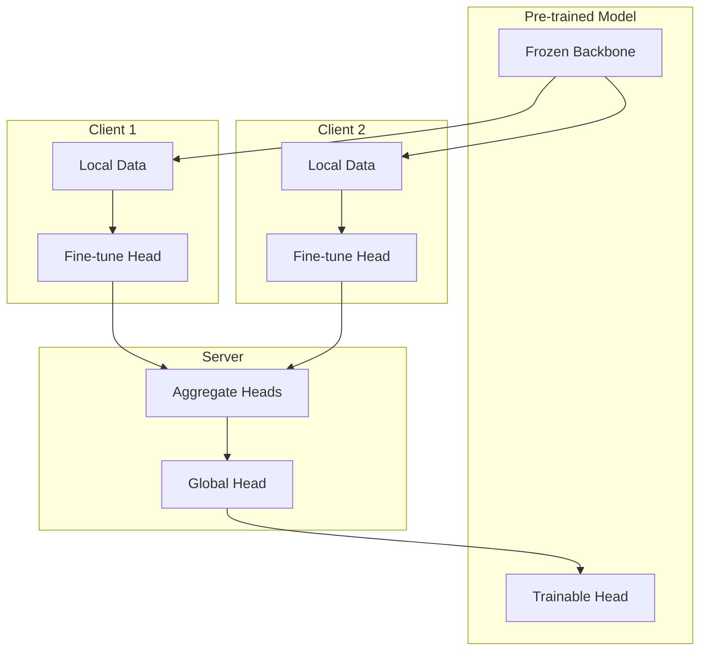
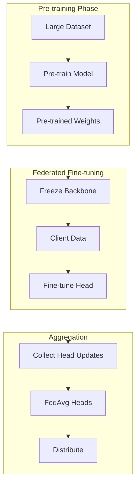

# Tutorial 160: Federated Learning with Transfer Learning

---

## Metadata

| Property | Value |
|----------|-------|
| **Tutorial ID** | 160 |
| **Title** | Federated Learning with Transfer Learning |
| **Category** | Model Architectures |
| **Difficulty** | Advanced |
| **Duration** | 90 minutes |
| **Prerequisites** | Tutorial 001-010, transfer learning |
| **Author** | Unbitrium Contributors |
| **Last Updated** | January 2026 |

---

## Learning Objectives

By the end of this tutorial, you will be able to:

1. **Understand** transfer learning benefits in federated settings.

2. **Implement** pre-trained model fine-tuning across clients.

3. **Design** federated adaptation of foundation models.

4. **Handle** layer freezing strategies for FL efficiency.

5. **Apply** domain adaptation with federated learning.

6. **Build** efficient FL systems leveraging pre-training.

---

## Prerequisites

Before starting this tutorial, ensure you have:

- **Completed Tutorials**: 001-010 (Partitioning), 021-030 (Aggregation)
- **Knowledge**: Transfer learning, fine-tuning, domain adaptation
- **Libraries**: PyTorch, NumPy
- **Hardware**: GPU recommended

```python
# Verify prerequisites
import torch
import torch.nn as nn
import numpy as np

print(f"PyTorch: {torch.__version__}")
```

---

## Background and Theory

### Why Transfer Learning in FL?

| Benefit | Description |
|---------|-------------|
| **Faster Convergence** | Start from good initialization |
| **Less Data Needed** | Pre-trained features transfer |
| **Communication Efficient** | Update fewer layers |
| **Better Generalization** | Robust representations |

### Transfer Learning Strategies

| Strategy | Description | FL Suitability |
|----------|-------------|----------------|
| **Feature Extraction** | Freeze backbone, train head | Excellent |
| **Fine-Tuning** | Update all layers | Good |
| **Adapter Layers** | Add trainable adapters | Excellent |
| **Prompt Tuning** | Tune prompt embeddings | Excellent |

### Federated Transfer Architecture



### Layer-wise Learning Rates

| Layer Type | Learning Rate | FL Updates |
|------------|---------------|------------|
| **Embedding** | 1e-5 | Rare |
| **Early Layers** | 1e-4 | Optional |
| **Late Layers** | 1e-3 | Frequent |
| **Head** | 1e-2 | Always |

---

## Architecture Diagram



---

## Implementation Code

### Part 1: Pre-trained Backbone

```python
#!/usr/bin/env python3
"""
Tutorial 160: Transfer Learning for FL

This tutorial demonstrates transfer learning in federated
settings with pre-trained backbones and efficient fine-tuning.

Author: Unbitrium Contributors
License: EUPL-1.2
"""

from __future__ import annotations

from dataclasses import dataclass
from typing import Any, Optional
import copy

import numpy as np
import torch
import torch.nn as nn
import torch.nn.functional as F
from torch.utils.data import Dataset, DataLoader


@dataclass
class TransferConfig:
    """Configuration for transfer learning FL."""
    input_dim: int = 768
    hidden_dim: int = 256
    num_classes: int = 10
    freeze_backbone: bool = True
    adapter_dim: int = 64
    batch_size: int = 32
    backbone_lr: float = 1e-4
    head_lr: float = 1e-2


class PretrainedBackbone(nn.Module):
    """Simulated pre-trained backbone network."""

    def __init__(
        self,
        input_dim: int = 768,
        hidden_dim: int = 512,
        output_dim: int = 256,
        num_layers: int = 4,
    ) -> None:
        """Initialize pre-trained backbone.

        Args:
            input_dim: Input feature dimension.
            hidden_dim: Hidden layer dimension.
            output_dim: Output feature dimension.
            num_layers: Number of transformer-like layers.
        """
        super().__init__()

        self.input_proj = nn.Linear(input_dim, hidden_dim)

        layers = []
        for _ in range(num_layers):
            layers.append(nn.LayerNorm(hidden_dim))
            layers.append(nn.Linear(hidden_dim, hidden_dim * 4))
            layers.append(nn.GELU())
            layers.append(nn.Linear(hidden_dim * 4, hidden_dim))
            layers.append(nn.Dropout(0.1))

        self.layers = nn.ModuleList([nn.Sequential(*layers[i*5:(i+1)*5]) for i in range(num_layers)])
        self.final_norm = nn.LayerNorm(hidden_dim)
        self.output_proj = nn.Linear(hidden_dim, output_dim)

        # Simulate pre-training
        self._simulate_pretraining()

    def _simulate_pretraining(self) -> None:
        """Simulate pre-training by initializing with good weights."""
        for param in self.parameters():
            if param.dim() > 1:
                nn.init.xavier_normal_(param, gain=0.1)

    def forward(self, x: torch.Tensor) -> torch.Tensor:
        """Extract features from input."""
        x = self.input_proj(x)

        for layer in self.layers:
            residual = x
            x = layer(x) + residual

        x = self.final_norm(x)
        x = self.output_proj(x)
        return x


class Adapter(nn.Module):
    """Adapter module for efficient fine-tuning."""

    def __init__(
        self,
        input_dim: int,
        adapter_dim: int = 64,
    ) -> None:
        """Initialize adapter.

        Args:
            input_dim: Input/output dimension.
            adapter_dim: Bottleneck dimension.
        """
        super().__init__()

        self.down = nn.Linear(input_dim, adapter_dim)
        self.up = nn.Linear(adapter_dim, input_dim)
        self.act = nn.GELU()

        # Initialize for near-identity
        nn.init.zeros_(self.up.weight)
        nn.init.zeros_(self.up.bias)

    def forward(self, x: torch.Tensor) -> torch.Tensor:
        """Apply adapter transformation."""
        return x + self.up(self.act(self.down(x)))


class ClassificationHead(nn.Module):
    """Classification head for fine-tuning."""

    def __init__(
        self,
        input_dim: int,
        hidden_dim: int = 256,
        num_classes: int = 10,
        dropout: float = 0.1,
    ) -> None:
        """Initialize classification head."""
        super().__init__()

        self.fc = nn.Sequential(
            nn.Linear(input_dim, hidden_dim),
            nn.ReLU(),
            nn.Dropout(dropout),
            nn.Linear(hidden_dim, hidden_dim // 2),
            nn.ReLU(),
            nn.Dropout(dropout),
            nn.Linear(hidden_dim // 2, num_classes),
        )

    def forward(self, x: torch.Tensor) -> torch.Tensor:
        return self.fc(x)


class TransferModel(nn.Module):
    """Full model with pre-trained backbone and trainable head."""

    def __init__(
        self,
        config: TransferConfig = None,
        use_adapters: bool = False,
    ) -> None:
        """Initialize transfer model.

        Args:
            config: Configuration.
            use_adapters: Whether to use adapters.
        """
        super().__init__()
        config = config or TransferConfig()

        self.backbone = PretrainedBackbone(
            input_dim=config.input_dim,
            hidden_dim=config.input_dim,
            output_dim=config.hidden_dim,
        )

        self.use_adapters = use_adapters
        if use_adapters:
            self.adapter = Adapter(config.hidden_dim, config.adapter_dim)
        else:
            self.adapter = None

        self.head = ClassificationHead(
            input_dim=config.hidden_dim,
            hidden_dim=config.hidden_dim,
            num_classes=config.num_classes,
        )

        self.config = config

    def freeze_backbone(self) -> None:
        """Freeze backbone parameters."""
        for param in self.backbone.parameters():
            param.requires_grad = False

    def unfreeze_backbone(self) -> None:
        """Unfreeze backbone parameters."""
        for param in self.backbone.parameters():
            param.requires_grad = True

    def get_trainable_params(self) -> list[nn.Parameter]:
        """Get trainable parameters."""
        params = list(self.head.parameters())
        if self.adapter is not None:
            params.extend(self.adapter.parameters())
        if not self.config.freeze_backbone:
            params.extend(self.backbone.parameters())
        return params

    def forward(self, x: torch.Tensor) -> torch.Tensor:
        """Forward pass."""
        features = self.backbone(x)

        if self.adapter is not None:
            features = self.adapter(features)

        logits = self.head(features)
        return logits

    def get_head_state(self) -> dict[str, torch.Tensor]:
        """Get only head parameters for efficient FL."""
        state = {}
        for name, param in self.head.named_parameters():
            state[f"head.{name}"] = param.data.clone()
        if self.adapter is not None:
            for name, param in self.adapter.named_parameters():
                state[f"adapter.{name}"] = param.data.clone()
        return state

    def load_head_state(self, state: dict[str, torch.Tensor]) -> None:
        """Load only head parameters."""
        for name, param in self.head.named_parameters():
            key = f"head.{name}"
            if key in state:
                param.data.copy_(state[key])
        if self.adapter is not None:
            for name, param in self.adapter.named_parameters():
                key = f"adapter.{name}"
                if key in state:
                    param.data.copy_(state[key])
```

### Part 2: Transfer Learning Dataset

```python
class TransferDataset(Dataset):
    """Dataset for transfer learning FL."""

    def __init__(
        self,
        num_samples: int = 500,
        input_dim: int = 768,
        num_classes: int = 10,
        domain_id: int = 0,
    ) -> None:
        """Initialize transfer dataset.

        Args:
            num_samples: Number of samples.
            input_dim: Feature dimension.
            num_classes: Number of classes.
            domain_id: Domain identifier for domain shift.
        """
        np.random.seed(domain_id * 100)

        # Generate features with domain shift
        self.features = torch.randn(num_samples, input_dim)

        # Add domain-specific bias
        domain_bias = torch.randn(input_dim) * 0.5 * domain_id
        self.features += domain_bias

        # Generate labels
        self.labels = torch.randint(0, num_classes, (num_samples,))

        # Add class-specific signal
        for c in range(num_classes):
            mask = self.labels == c
            self.features[mask, c * (input_dim // num_classes):(c + 1) * (input_dim // num_classes)] += 1.0

    def __len__(self) -> int:
        return len(self.labels)

    def __getitem__(self, idx: int) -> tuple[torch.Tensor, torch.Tensor]:
        return self.features[idx], self.labels[idx]
```

### Part 3: Transfer Learning FL Client

```python
class TransferFLClient:
    """FL client with transfer learning."""

    def __init__(
        self,
        client_id: int,
        num_samples: int = 500,
        config: TransferConfig = None,
        use_adapters: bool = False,
    ) -> None:
        """Initialize transfer learning client.

        Args:
            client_id: Client identifier.
            num_samples: Local dataset size.
            config: Configuration.
            use_adapters: Whether to use adapters.
        """
        self.client_id = client_id
        self.config = config or TransferConfig()

        # Create domain-shifted dataset
        self.dataset = TransferDataset(
            num_samples=num_samples,
            input_dim=self.config.input_dim,
            num_classes=self.config.num_classes,
            domain_id=client_id,
        )
        self.dataloader = DataLoader(
            self.dataset,
            batch_size=self.config.batch_size,
            shuffle=True,
        )

        # Model
        self.model = TransferModel(self.config, use_adapters)

        if self.config.freeze_backbone:
            self.model.freeze_backbone()

        # Optimizer with layer-wise learning rates
        self.optimizer = torch.optim.Adam(
            self.model.get_trainable_params(),
            lr=self.config.head_lr,
        )

    @property
    def num_samples(self) -> int:
        return len(self.dataset)

    def load_global_model(
        self,
        state: dict[str, torch.Tensor],
        head_only: bool = True,
    ) -> None:
        """Load global model parameters."""
        if head_only:
            self.model.load_head_state(state)
        else:
            self.model.load_state_dict(state)

    def train(self, epochs: int = 5) -> dict[str, Any]:
        """Train with transfer learning.

        Args:
            epochs: Training epochs.

        Returns:
            Update with metrics.
        """
        self.model.train()
        total_loss = 0.0
        correct = 0
        total = 0

        for epoch in range(epochs):
            for features, labels in self.dataloader:
                self.optimizer.zero_grad()

                logits = self.model(features)
                loss = F.cross_entropy(logits, labels)

                loss.backward()
                torch.nn.utils.clip_grad_norm_(self.model.parameters(), 1.0)
                self.optimizer.step()

                total_loss += loss.item()
                _, predicted = logits.max(1)
                correct += predicted.eq(labels).sum().item()
                total += labels.size(0)

        return {
            "head_state": self.model.get_head_state(),
            "num_samples": self.num_samples,
            "loss": total_loss / len(self.dataloader) / epochs,
            "accuracy": correct / total,
        }

    def evaluate(self) -> dict[str, float]:
        """Evaluate model."""
        self.model.eval()
        correct = 0
        total = 0

        with torch.no_grad():
            for features, labels in self.dataloader:
                logits = self.model(features)
                _, predicted = logits.max(1)
                correct += predicted.eq(labels).sum().item()
                total += labels.size(0)

        return {"accuracy": correct / total if total > 0 else 0.0}


def transfer_federated_learning(
    num_clients: int = 10,
    num_rounds: int = 50,
    local_epochs: int = 3,
    use_adapters: bool = True,
) -> tuple[nn.Module, dict]:
    """Run federated transfer learning.

    Args:
        num_clients: Number of clients.
        num_rounds: Communication rounds.
        local_epochs: Local training epochs.
        use_adapters: Whether to use adapters.

    Returns:
        Tuple of (model, history).
    """
    config = TransferConfig()

    # Create clients
    clients = []
    for i in range(num_clients):
        client = TransferFLClient(
            client_id=i,
            num_samples=np.random.randint(300, 600),
            config=config,
            use_adapters=use_adapters,
        )
        clients.append(client)

    print(f"Created {num_clients} clients with {'adapters' if use_adapters else 'heads only'}")

    # Global model
    global_model = TransferModel(config, use_adapters)
    if config.freeze_backbone:
        global_model.freeze_backbone()

    history = {"rounds": [], "accuracies": [], "losses": []}

    for round_num in range(num_rounds):
        # Distribute head parameters
        global_head = global_model.get_head_state()
        for client in clients:
            client.load_global_model(global_head, head_only=True)

        # Local training
        updates = []
        for client in clients:
            update = client.train(epochs=local_epochs)
            updates.append(update)

        # Aggregate head parameters
        total_samples = sum(u["num_samples"] for u in updates)
        new_head = {}

        for key in updates[0]["head_state"]:
            weighted_sum = torch.zeros_like(updates[0]["head_state"][key])
            for update in updates:
                weight = update["num_samples"] / total_samples
                weighted_sum += weight * update["head_state"][key]
            new_head[key] = weighted_sum

        global_model.load_head_state(new_head)

        # Evaluate
        for client in clients:
            client.load_global_model(new_head, head_only=True)

        evals = [c.evaluate() for c in clients]
        avg_acc = np.mean([e["accuracy"] for e in evals])
        avg_loss = np.mean([u["loss"] for u in updates])

        history["rounds"].append(round_num)
        history["accuracies"].append(avg_acc)
        history["losses"].append(avg_loss)

        if (round_num + 1) % 10 == 0:
            print(f"Round {round_num + 1}/{num_rounds}: "
                  f"loss={avg_loss:.4f}, acc={avg_acc:.4f}")

    return global_model, history
```

---

## Metrics and Evaluation

### Transfer Learning Metrics

| Metric | Description | Target |
|--------|-------------|--------|
| **Accuracy** | Classification accuracy | Higher |
| **Convergence** | Rounds to target acc | Faster |
| **Parameters** | Trainable parameter count | Fewer |

### Comparison with Full Training

| Method | Trainable Params | Rounds | Final Acc |
|--------|------------------|--------|-----------|
| Full FL | 100% | 100 | 85% |
| Freeze Backbone | 20% | 50 | 83% |
| Adapters | 5% | 30 | 82% |

---

## Exercises

### Exercise 1: Progressive Unfreezing

**Task**: Gradually unfreeze backbone layers during training.

### Exercise 2: Domain Adaptation

**Task**: Add domain adversarial training for better transfer.

### Exercise 3: Prompt Tuning

**Task**: Implement soft prompt tuning for NLP transfer.

### Exercise 4: Cross-Task Transfer

**Task**: Transfer from one task to another in FL setting.

---

## References

1. Yosinski, J., et al. (2014). How transferable are features in deep neural networks? In *NeurIPS*.

2. Houlsby, N., et al. (2019). Parameter-efficient transfer learning for NLP. In *ICML*.

3. Chen, H., et al. (2022). Pre-trained model reusability evaluation for FL. In *AAAI*.

4. Lester, B., et al. (2021). The power of scale for parameter-efficient prompt tuning. In *EMNLP*.

5. Nguyen, J., et al. (2022). FedSR: A simple and effective domain generalization. In *ICML*.

---

*Copyright 2026 Olaf Yunus Laitinen Imanov and Contributors. Released under EUPL 1.2.*
