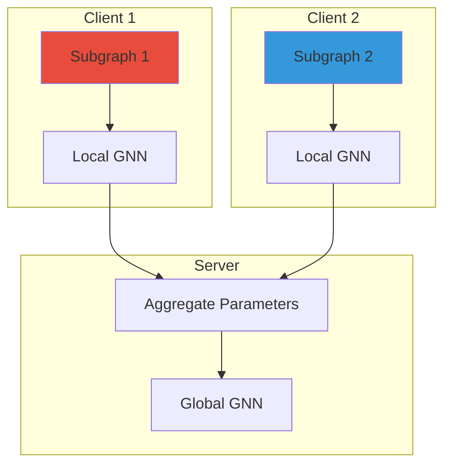
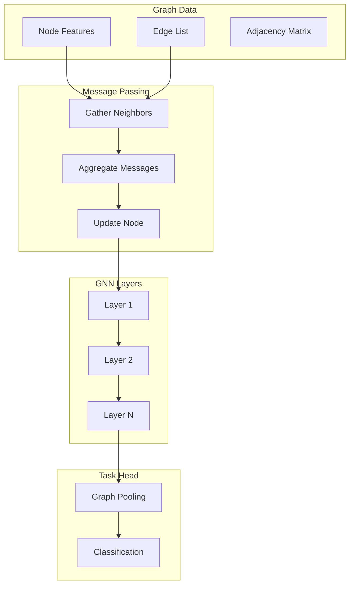

# Tutorial 161: Federated Learning with Graph Neural Networks

---

## Metadata

| Property | Value |
|----------|-------|
| **Tutorial ID** | 161 |
| **Title** | Federated Learning with Graph Neural Networks |
| **Category** | Advanced Architectures |
| **Difficulty** | Advanced |
| **Duration** | 90 minutes |
| **Prerequisites** | Tutorial 001-010, GNN basics |
| **Author** | Unbitrium Contributors |
| **Last Updated** | January 2026 |

---

## Learning Objectives

By the end of this tutorial, you will be able to:

1. **Understand** the challenges of combining GNNs with federated learning.

2. **Implement** Graph Convolutional Networks for node classification.

3. **Design** federated GNN systems with subgraph sampling.

4. **Handle** cross-client graph connections in FL settings.

5. **Apply** message passing for federated graph learning.

6. **Evaluate** GNN models on graph-based tasks.

---

## Prerequisites

Before starting this tutorial, ensure you have:

- **Completed Tutorials**: 001-010 (Partitioning), 021-030 (Aggregation)
- **Knowledge**: Graph theory, message passing neural networks
- **Libraries**: PyTorch
- **Hardware**: GPU recommended

```python
# Verify prerequisites
import torch
import numpy as np

print(f"PyTorch: {torch.__version__}")
```

---

## Background and Theory

### Graph Learning in FL

| Challenge | Description |
|-----------|-------------|
| **Graph Partitioning** | Splitting graphs across clients |
| **Missing Edges** | Cross-client connections |
| **Node Features** | Privacy of node attributes |
| **Aggregation** | Combining graph-local updates |

### GNN Architectures

| Model | Aggregation | Use Case |
|-------|-------------|----------|
| **GCN** | Spectral conv | Node classification |
| **GAT** | Attention | Heterogeneous graphs |
| **GraphSAGE** | Sampling | Large graphs |
| **GIN** | Sum/MLP | Graph classification |

### Federated GNN Architecture



---

## Architecture Diagram



---

## Implementation Code

### Part 1: Graph Data Structures

```python
#!/usr/bin/env python3
"""
Tutorial 161: Federated GNN

This tutorial demonstrates federated learning with
graph neural networks for distributed graph data.

Author: Unbitrium Contributors
License: EUPL-1.2
"""

from __future__ import annotations

from dataclasses import dataclass
from typing import Any

import numpy as np
import torch
import torch.nn as nn
import torch.nn.functional as F
from torch.utils.data import Dataset, DataLoader


@dataclass
class GNNConfig:
    """Configuration for federated GNN."""
    node_features: int = 32
    hidden_dim: int = 64
    num_classes: int = 7
    num_layers: int = 2
    dropout: float = 0.5
    batch_size: int = 32
    learning_rate: float = 0.01


@dataclass
class GraphData:
    """Graph data container."""
    x: torch.Tensor  # Node features (N, F)
    edge_index: torch.Tensor  # Edge list (2, E)
    y: torch.Tensor  # Node labels (N,)
    train_mask: torch.Tensor  # Training mask (N,)
    val_mask: torch.Tensor  # Validation mask (N,)

    @property
    def num_nodes(self) -> int:
        return self.x.size(0)

    @property
    def num_edges(self) -> int:
        return self.edge_index.size(1)


def generate_graph(
    num_nodes: int = 500,
    num_features: int = 32,
    num_classes: int = 7,
    edge_prob: float = 0.05,
    train_ratio: float = 0.6,
    seed: int = None,
) -> GraphData:
    """Generate a synthetic graph.

    Args:
        num_nodes: Number of nodes.
        num_features: Node feature dimension.
        num_classes: Number of classes.
        edge_prob: Edge probability.
        train_ratio: Training set ratio.
        seed: Random seed.

    Returns:
        GraphData object.
    """
    if seed is not None:
        np.random.seed(seed)
        torch.manual_seed(seed)

    # Generate node features
    x = torch.randn(num_nodes, num_features)

    # Generate labels (with class-correlated features)
    y = torch.randint(0, num_classes, (num_nodes,))
    for c in range(num_classes):
        mask = (y == c)
        x[mask, c % num_features] += 2.0  # Bias features

    # Generate edges (random graph with homophily)
    edge_list = []
    for i in range(num_nodes):
        for j in range(i + 1, num_nodes):
            # Higher probability for same-class nodes
            base_prob = edge_prob
            if y[i] == y[j]:
                base_prob *= 2

            if np.random.rand() < base_prob:
                edge_list.extend([[i, j], [j, i]])

    if len(edge_list) > 0:
        edge_index = torch.tensor(edge_list, dtype=torch.long).t()
    else:
        edge_index = torch.zeros((2, 0), dtype=torch.long)

    # Generate masks
    num_train = int(num_nodes * train_ratio)
    perm = torch.randperm(num_nodes)
    train_mask = torch.zeros(num_nodes, dtype=torch.bool)
    val_mask = torch.zeros(num_nodes, dtype=torch.bool)
    train_mask[perm[:num_train]] = True
    val_mask[perm[num_train:]] = True

    return GraphData(
        x=x,
        edge_index=edge_index,
        y=y,
        train_mask=train_mask,
        val_mask=val_mask,
    )


def normalize_adjacency(
    edge_index: torch.Tensor,
    num_nodes: int,
) -> torch.Tensor:
    """Compute normalized adjacency matrix.

    Args:
        edge_index: Edge list (2, E).
        num_nodes: Number of nodes.

    Returns:
        Sparse normalized adjacency.
    """
    # Add self-loops
    loop_index = torch.arange(num_nodes).unsqueeze(0).repeat(2, 1)
    edge_index = torch.cat([edge_index, loop_index], dim=1)

    # Compute degree
    row = edge_index[0]
    deg = torch.zeros(num_nodes)
    deg.scatter_add_(0, row, torch.ones(edge_index.size(1)))

    # D^{-1/2} A D^{-1/2}
    deg_inv_sqrt = deg.pow(-0.5)
    deg_inv_sqrt[deg_inv_sqrt == float('inf')] = 0

    # Create sparse normalized adjacency
    values = deg_inv_sqrt[edge_index[0]] * deg_inv_sqrt[edge_index[1]]

    adj = torch.sparse_coo_tensor(
        edge_index, values, (num_nodes, num_nodes)
    )

    return adj
```

### Part 2: GNN Models

```python
class GraphConvolution(nn.Module):
    """Graph convolution layer."""

    def __init__(
        self,
        in_features: int,
        out_features: int,
        bias: bool = True,
    ) -> None:
        """Initialize GCN layer."""
        super().__init__()
        self.weight = nn.Parameter(torch.FloatTensor(in_features, out_features))
        if bias:
            self.bias = nn.Parameter(torch.FloatTensor(out_features))
        else:
            self.register_parameter('bias', None)
        self.reset_parameters()

    def reset_parameters(self):
        nn.init.xavier_uniform_(self.weight)
        if self.bias is not None:
            nn.init.zeros_(self.bias)

    def forward(
        self,
        x: torch.Tensor,
        adj: torch.Tensor,
    ) -> torch.Tensor:
        """Forward pass.

        Args:
            x: Node features (N, in_features).
            adj: Normalized adjacency (N, N) sparse.

        Returns:
            Updated features (N, out_features).
        """
        support = torch.matmul(x, self.weight)
        output = torch.sparse.mm(adj, support)
        if self.bias is not None:
            output = output + self.bias
        return output


class GCN(nn.Module):
    """Graph Convolutional Network."""

    def __init__(
        self,
        in_features: int,
        hidden_dim: int,
        num_classes: int,
        num_layers: int = 2,
        dropout: float = 0.5,
    ) -> None:
        """Initialize GCN.

        Args:
            in_features: Input feature dimension.
            hidden_dim: Hidden dimension.
            num_classes: Number of output classes.
            num_layers: Number of GCN layers.
            dropout: Dropout rate.
        """
        super().__init__()
        self.num_layers = num_layers
        self.dropout = dropout

        self.convs = nn.ModuleList()
        self.convs.append(GraphConvolution(in_features, hidden_dim))

        for _ in range(num_layers - 2):
            self.convs.append(GraphConvolution(hidden_dim, hidden_dim))

        self.convs.append(GraphConvolution(hidden_dim, num_classes))

    def forward(
        self,
        x: torch.Tensor,
        adj: torch.Tensor,
    ) -> torch.Tensor:
        """Forward pass.

        Args:
            x: Node features.
            adj: Normalized adjacency.

        Returns:
            Node logits.
        """
        for i, conv in enumerate(self.convs[:-1]):
            x = conv(x, adj)
            x = F.relu(x)
            x = F.dropout(x, p=self.dropout, training=self.training)

        x = self.convs[-1](x, adj)
        return x


class GraphAttentionLayer(nn.Module):
    """Graph attention layer."""

    def __init__(
        self,
        in_features: int,
        out_features: int,
        dropout: float = 0.6,
        alpha: float = 0.2,
    ) -> None:
        """Initialize GAT layer."""
        super().__init__()
        self.in_features = in_features
        self.out_features = out_features
        self.dropout = dropout
        self.alpha = alpha

        self.W = nn.Parameter(torch.FloatTensor(in_features, out_features))
        self.a = nn.Parameter(torch.FloatTensor(2 * out_features, 1))

        self.leakyrelu = nn.LeakyReLU(alpha)
        self.reset_parameters()

    def reset_parameters(self):
        nn.init.xavier_uniform_(self.W)
        nn.init.xavier_uniform_(self.a)

    def forward(
        self,
        x: torch.Tensor,
        edge_index: torch.Tensor,
    ) -> torch.Tensor:
        """Compute attention-weighted aggregation."""
        h = torch.matmul(x, self.W)
        N = h.size(0)

        src, dst = edge_index
        h_src = h[src]
        h_dst = h[dst]

        # Compute attention coefficients
        edge_h = torch.cat([h_src, h_dst], dim=1)
        e = self.leakyrelu(torch.matmul(edge_h, self.a).squeeze())

        # Sparse softmax
        attention = torch.zeros(N, N)
        attention[src, dst] = e
        attention = F.softmax(attention, dim=1)
        attention = F.dropout(attention, p=self.dropout, training=self.training)

        # Aggregate
        h_prime = torch.matmul(attention, h)

        return h_prime


class GAT(nn.Module):
    """Graph Attention Network."""

    def __init__(
        self,
        in_features: int,
        hidden_dim: int,
        num_classes: int,
        num_heads: int = 8,
        dropout: float = 0.6,
    ) -> None:
        """Initialize GAT."""
        super().__init__()

        self.attn_layers = nn.ModuleList([
            GraphAttentionLayer(in_features, hidden_dim, dropout)
            for _ in range(num_heads)
        ])

        self.out_layer = GraphAttentionLayer(
            hidden_dim * num_heads, num_classes, dropout
        )

        self.dropout = dropout

    def forward(
        self,
        x: torch.Tensor,
        edge_index: torch.Tensor,
    ) -> torch.Tensor:
        """Forward pass."""
        x = F.dropout(x, p=self.dropout, training=self.training)

        # Multi-head attention
        x = torch.cat([attn(x, edge_index) for attn in self.attn_layers], dim=1)
        x = F.elu(x)
        x = F.dropout(x, p=self.dropout, training=self.training)

        x = self.out_layer(x, edge_index)

        return x
```

### Part 3: Federated GNN Client

```python
class GNNFLClient:
    """Federated learning client for GNN."""

    def __init__(
        self,
        client_id: int,
        graph: GraphData,
        config: GNNConfig = None,
        model_type: str = "gcn",
    ) -> None:
        """Initialize GNN FL client.

        Args:
            client_id: Client identifier.
            graph: Local graph data.
            config: Configuration.
            model_type: 'gcn' or 'gat'.
        """
        self.client_id = client_id
        self.config = config or GNNConfig()
        self.graph = graph

        # Compute normalized adjacency
        self.adj = normalize_adjacency(graph.edge_index, graph.num_nodes)

        # Initialize model
        if model_type == "gcn":
            self.model = GCN(
                in_features=graph.x.size(1),
                hidden_dim=self.config.hidden_dim,
                num_classes=self.config.num_classes,
                num_layers=self.config.num_layers,
                dropout=self.config.dropout,
            )
        else:
            self.model = GAT(
                in_features=graph.x.size(1),
                hidden_dim=self.config.hidden_dim,
                num_classes=self.config.num_classes,
                dropout=self.config.dropout,
            )

        self.optimizer = torch.optim.Adam(
            self.model.parameters(),
            lr=self.config.learning_rate,
            weight_decay=5e-4,
        )

    @property
    def num_nodes(self) -> int:
        return self.graph.num_nodes

    @property
    def num_train_nodes(self) -> int:
        return self.graph.train_mask.sum().item()

    def load_global_model(self, state_dict: dict[str, torch.Tensor]) -> None:
        self.model.load_state_dict(state_dict)

    def train(self, epochs: int = 10) -> dict[str, Any]:
        """Train GNN on local graph.

        Args:
            epochs: Training epochs.

        Returns:
            Update with metrics.
        """
        self.model.train()
        total_loss = 0.0

        for epoch in range(epochs):
            self.optimizer.zero_grad()

            logits = self.model(self.graph.x, self.adj)
            loss = F.cross_entropy(
                logits[self.graph.train_mask],
                self.graph.y[self.graph.train_mask],
            )

            loss.backward()
            self.optimizer.step()
            total_loss += loss.item()

        return {
            "state_dict": {k: v.clone() for k, v in self.model.state_dict().items()},
            "num_samples": self.num_train_nodes,
            "loss": total_loss / epochs,
        }

    def evaluate(self) -> dict[str, float]:
        """Evaluate on validation set."""
        self.model.eval()

        with torch.no_grad():
            logits = self.model(self.graph.x, self.adj)
            pred = logits.argmax(dim=1)

            val_acc = (
                (pred[self.graph.val_mask] == self.graph.y[self.graph.val_mask])
                .float().mean().item()
            )

            train_acc = (
                (pred[self.graph.train_mask] == self.graph.y[self.graph.train_mask])
                .float().mean().item()
            )

        return {
            "train_acc": train_acc,
            "val_acc": val_acc,
        }


def federated_gnn(
    num_clients: int = 5,
    num_rounds: int = 50,
    local_epochs: int = 10,
) -> nn.Module:
    """Run federated GNN training.

    Args:
        num_clients: Number of clients.
        num_rounds: Communication rounds.
        local_epochs: Local training epochs.

    Returns:
        Trained global model.
    """
    config = GNNConfig()

    # Create clients with disjoint subgraphs
    clients = []
    for i in range(num_clients):
        graph = generate_graph(
            num_nodes=300 + i * 50,
            num_features=config.node_features,
            num_classes=config.num_classes,
            seed=i * 100,
        )
        client = GNNFLClient(i, graph, config)
        clients.append(client)
        print(f"Client {i}: {graph.num_nodes} nodes, {graph.num_edges} edges")

    # Global model
    global_model = GCN(
        in_features=config.node_features,
        hidden_dim=config.hidden_dim,
        num_classes=config.num_classes,
        num_layers=config.num_layers,
        dropout=config.dropout,
    )

    for round_num in range(num_rounds):
        global_state = global_model.state_dict()
        for client in clients:
            client.load_global_model(global_state)

        # Train
        updates = []
        for client in clients:
            update = client.train(epochs=local_epochs)
            updates.append(update)

        # Aggregate
        total_samples = sum(u["num_samples"] for u in updates)
        new_state = {}
        for key in global_state.keys():
            weighted_sum = torch.zeros_like(global_state[key])
            for update in updates:
                w = update["num_samples"] / total_samples
                weighted_sum += w * update["state_dict"][key]
            new_state[key] = weighted_sum

        global_model.load_state_dict(new_state)

        # Evaluate
        evals = [c.evaluate() for c in clients]
        avg_val_acc = np.mean([e["val_acc"] for e in evals])

        if (round_num + 1) % 10 == 0:
            avg_loss = np.mean([u["loss"] for u in updates])
            print(f"Round {round_num + 1}/{num_rounds}: "
                  f"loss={avg_loss:.4f}, val_acc={avg_val_acc:.4f}")

    return global_model
```

---

## Metrics and Evaluation

### GNN Metrics

| Metric | Description | Target |
|--------|-------------|--------|
| **Node Accuracy** | Classification accuracy | Higher |
| **F1 Score** | Class-balanced metric | Higher |
| **Homophily** | Edge label consistency | Measure |

### Expected Performance

| Model | Accuracy |
|-------|----------|
| GCN | 75-80% |
| GAT | 78-82% |

---

## Exercises

### Exercise 1: GraphSAGE

**Task**: Implement GraphSAGE with neighbor sampling.

### Exercise 2: Cross-Client Edges

**Task**: Handle edges between clients securely.

### Exercise 3: Graph Classification

**Task**: Extend to whole-graph classification tasks.

### Exercise 4: Inductive Learning

**Task**: Train on seen nodes, predict on unseen.

---

## References

1. Kipf, T., & Welling, M. (2017). Semi-supervised classification with GCNs. In *ICLR*.

2. Veličković, P., et al. (2018). Graph attention networks. In *ICLR*.

3. Hamilton, W., et al. (2017). Inductive representation learning on large graphs. In *NeurIPS*.

4. He, C., et al. (2021). FedGraphNN: A federated learning benchmark for graph neural networks. *arXiv*.

5. Zhang, K., et al. (2021). Subgraph federated learning with missing neighbor generation. In *NeurIPS*.

---

*Copyright 2026 Olaf Yunus Laitinen Imanov and Contributors. Released under EUPL 1.2.*
