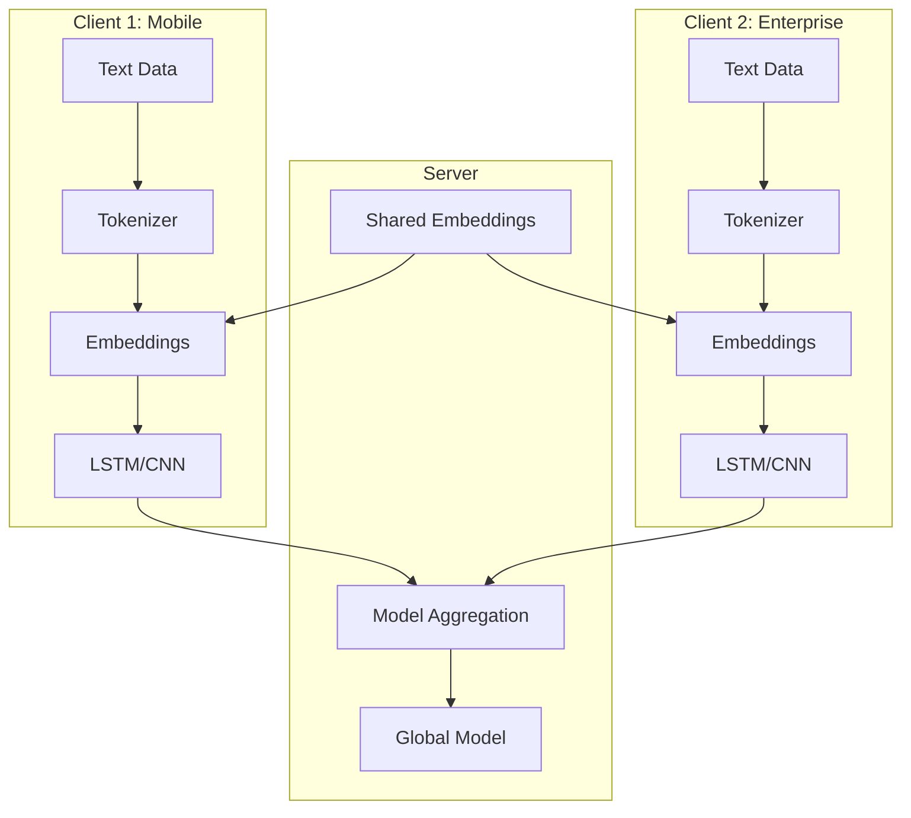
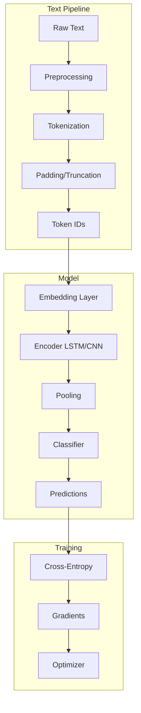

# Tutorial 162: Federated Learning for Natural Language Processing

---

## Metadata

| Property | Value |
|----------|-------|
| **Tutorial ID** | 162 |
| **Title** | Federated Learning for Natural Language Processing |
| **Category** | Domain Applications |
| **Difficulty** | Advanced |
| **Duration** | 90 minutes |
| **Prerequisites** | Tutorial 001-010, NLP basics |
| **Author** | Unbitrium Contributors |
| **Last Updated** | January 2026 |

---

## Learning Objectives

By the end of this tutorial, you will be able to:

1. **Understand** the unique challenges of federated NLP applications.

2. **Implement** federated text classification with embedding models.

3. **Design** privacy-preserving language model training pipelines.

4. **Handle** vocabulary heterogeneity across clients.

5. **Apply** differential privacy to text embeddings.

6. **Evaluate** NLP models with appropriate text-specific metrics.

---

## Prerequisites

Before starting this tutorial, ensure you have:

- **Completed Tutorials**: 001-010 (Partitioning), 021-030 (Aggregation)
- **Knowledge**: Word embeddings, RNNs/Transformers, text preprocessing
- **Libraries**: PyTorch, NumPy
- **Hardware**: GPU recommended

```python
# Verify prerequisites
import torch
import torch.nn as nn
import numpy as np

print(f"PyTorch: {torch.__version__}")
print(f"CUDA available: {torch.cuda.is_available()}")
```

---

## Background and Theory

### NLP Challenges in FL

| Challenge | Description | Impact |
|-----------|-------------|--------|
| **Vocabulary** | Different words across clients | Embedding sync issues |
| **Privacy** | Text is highly sensitive | Identity leakage risk |
| **Heterogeneity** | Different domains/styles | Model divergence |
| **Sequence Length** | Variable input sizes | Memory and compute |

### Federated NLP Applications

| Application | Data Source | Privacy Need |
|-------------|-------------|--------------|
| **Keyboard Prediction** | Mobile typing | Very high |
| **Email Classification** | Corporate email | High |
| **Sentiment Analysis** | Reviews/feedback | Medium |
| **Document Tagging** | Enterprise docs | High |

### NLP Model Architectures for FL

| Model | Pros | Cons | FL Suitability |
|-------|------|------|----------------|
| **LSTM** | Sequential | Slow | Good |
| **TextCNN** | Fast | Fixed window | Good |
| **Transformer** | Powerful | Large | Challenging |
| **BERT** | SOTA | Very large | Needs compression |

### Federated NLP Architecture



---

## Architecture Diagram



---

## Implementation Code

### Part 1: Text Preprocessing and Vocabulary

```python
#!/usr/bin/env python3
"""
Tutorial 162: Federated Learning for NLP

This tutorial demonstrates federated text classification
with LSTM and CNN models for privacy-preserving NLP.

Author: Unbitrium Contributors
License: EUPL-1.2
"""

from __future__ import annotations

from dataclasses import dataclass, field
from typing import Any, Optional
from collections import Counter
import re

import numpy as np
import torch
import torch.nn as nn
import torch.nn.functional as F
from torch.utils.data import Dataset, DataLoader


@dataclass
class NLPConfig:
    """Configuration for federated NLP."""
    vocab_size: int = 10000
    embedding_dim: int = 128
    hidden_dim: int = 256
    num_classes: int = 4
    max_length: int = 128
    num_layers: int = 2
    dropout: float = 0.3
    batch_size: int = 32
    learning_rate: float = 0.001


class Vocabulary:
    """Vocabulary for text tokenization."""

    PAD_TOKEN = "<PAD>"
    UNK_TOKEN = "<UNK>"
    PAD_IDX = 0
    UNK_IDX = 1

    def __init__(self, max_size: int = 10000) -> None:
        """Initialize vocabulary.

        Args:
            max_size: Maximum vocabulary size.
        """
        self.max_size = max_size
        self.word2idx = {self.PAD_TOKEN: self.PAD_IDX, self.UNK_TOKEN: self.UNK_IDX}
        self.idx2word = {self.PAD_IDX: self.PAD_TOKEN, self.UNK_IDX: self.UNK_TOKEN}
        self.word_counts = Counter()

    def build(self, texts: list[str]) -> "Vocabulary":
        """Build vocabulary from texts.

        Args:
            texts: List of text documents.

        Returns:
            Self for chaining.
        """
        for text in texts:
            tokens = self.tokenize(text)
            self.word_counts.update(tokens)

        # Keep most common words
        most_common = self.word_counts.most_common(self.max_size - 2)

        for word, _ in most_common:
            if word not in self.word2idx:
                idx = len(self.word2idx)
                self.word2idx[word] = idx
                self.idx2word[idx] = word

        return self

    @staticmethod
    def tokenize(text: str) -> list[str]:
        """Tokenize text into words.

        Args:
            text: Input text.

        Returns:
            List of tokens.
        """
        # Lowercase and basic cleaning
        text = text.lower()
        text = re.sub(r'[^\w\s]', ' ', text)
        text = re.sub(r'\s+', ' ', text).strip()
        return text.split()

    def encode(
        self,
        text: str,
        max_length: int = 128,
    ) -> list[int]:
        """Encode text to token IDs.

        Args:
            text: Input text.
            max_length: Maximum sequence length.

        Returns:
            List of token IDs.
        """
        tokens = self.tokenize(text)
        ids = [self.word2idx.get(t, self.UNK_IDX) for t in tokens]

        # Truncate or pad
        if len(ids) > max_length:
            ids = ids[:max_length]
        else:
            ids = ids + [self.PAD_IDX] * (max_length - len(ids))

        return ids

    def decode(self, ids: list[int]) -> str:
        """Decode token IDs to text."""
        tokens = [self.idx2word.get(i, self.UNK_TOKEN) for i in ids]
        tokens = [t for t in tokens if t != self.PAD_TOKEN]
        return " ".join(tokens)

    def __len__(self) -> int:
        return len(self.word2idx)


class TextDataset(Dataset):
    """Dataset for text classification."""

    def __init__(
        self,
        texts: list[str],
        labels: list[int],
        vocab: Vocabulary,
        max_length: int = 128,
    ) -> None:
        """Initialize dataset.

        Args:
            texts: List of text documents.
            labels: List of labels.
            vocab: Vocabulary for encoding.
            max_length: Maximum sequence length.
        """
        self.texts = texts
        self.labels = labels
        self.vocab = vocab
        self.max_length = max_length

        # Pre-encode all texts
        self.encoded = [
            torch.LongTensor(vocab.encode(t, max_length))
            for t in texts
        ]

    def __len__(self) -> int:
        return len(self.texts)

    def __getitem__(self, idx: int) -> dict[str, torch.Tensor]:
        return {
            "input_ids": self.encoded[idx],
            "label": torch.tensor(self.labels[idx], dtype=torch.long),
            "length": torch.tensor(
                len(self.vocab.tokenize(self.texts[idx])),
                dtype=torch.long
            ),
        }


def generate_synthetic_texts(
    num_samples: int = 500,
    num_classes: int = 4,
    seed: int = None,
) -> tuple[list[str], list[int]]:
    """Generate synthetic text data for demonstration.

    Args:
        num_samples: Number of samples.
        num_classes: Number of classes.
        seed: Random seed.

    Returns:
        Tuple of (texts, labels).
    """
    if seed is not None:
        np.random.seed(seed)

    # Word lists per class
    class_words = [
        ["business", "market", "stock", "company", "profit", "revenue", "growth", "investment"],
        ["sports", "game", "team", "player", "score", "championship", "victory", "match"],
        ["technology", "software", "computer", "digital", "innovation", "data", "algorithm", "ai"],
        ["entertainment", "movie", "music", "celebrity", "show", "concert", "artist", "film"],
    ]

    common_words = ["the", "is", "are", "was", "were", "has", "have", "been", "this", "that",
                   "with", "for", "and", "but", "not", "very", "about", "from", "into"]

    texts = []
    labels = []

    for _ in range(num_samples):
        label = np.random.randint(0, min(num_classes, len(class_words)))
        num_words = np.random.randint(10, 50)

        # Generate text with class-specific words
        words = []
        for _ in range(num_words):
            if np.random.rand() < 0.4:
                word = np.random.choice(class_words[label])
            else:
                word = np.random.choice(common_words)
            words.append(word)

        text = " ".join(words)
        texts.append(text)
        labels.append(label)

    return texts, labels
```

### Part 2: NLP Models

```python
class TextCNN(nn.Module):
    """CNN for text classification."""

    def __init__(
        self,
        vocab_size: int,
        embedding_dim: int = 128,
        num_classes: int = 4,
        num_filters: int = 100,
        filter_sizes: list[int] = None,
        dropout: float = 0.5,
        padding_idx: int = 0,
    ) -> None:
        """Initialize TextCNN.

        Args:
            vocab_size: Vocabulary size.
            embedding_dim: Embedding dimension.
            num_classes: Number of output classes.
            num_filters: Number of filters per size.
            filter_sizes: Kernel sizes.
            dropout: Dropout rate.
            padding_idx: Padding token index.
        """
        super().__init__()
        filter_sizes = filter_sizes or [2, 3, 4, 5]

        self.embedding = nn.Embedding(
            vocab_size, embedding_dim, padding_idx=padding_idx
        )

        self.convs = nn.ModuleList([
            nn.Conv1d(embedding_dim, num_filters, fs)
            for fs in filter_sizes
        ])

        self.dropout = nn.Dropout(dropout)
        self.fc = nn.Linear(num_filters * len(filter_sizes), num_classes)

    def forward(self, x: torch.Tensor) -> torch.Tensor:
        """Forward pass.

        Args:
            x: Input token IDs (batch, seq_len).

        Returns:
            Class logits.
        """
        # Embed: (batch, seq_len, embed_dim)
        embedded = self.embedding(x)

        # Conv expects (batch, channels, seq_len)
        embedded = embedded.transpose(1, 2)

        # Apply convolutions with max pooling
        conv_outputs = []
        for conv in self.convs:
            conv_out = F.relu(conv(embedded))
            pooled = F.max_pool1d(conv_out, conv_out.size(2)).squeeze(2)
            conv_outputs.append(pooled)

        # Concatenate and classify
        cat = torch.cat(conv_outputs, dim=1)
        cat = self.dropout(cat)
        logits = self.fc(cat)

        return logits


class LSTMClassifier(nn.Module):
    """LSTM for text classification."""

    def __init__(
        self,
        vocab_size: int,
        embedding_dim: int = 128,
        hidden_dim: int = 256,
        num_classes: int = 4,
        num_layers: int = 2,
        dropout: float = 0.3,
        bidirectional: bool = True,
        padding_idx: int = 0,
    ) -> None:
        """Initialize LSTM classifier.

        Args:
            vocab_size: Vocabulary size.
            embedding_dim: Embedding dimension.
            hidden_dim: LSTM hidden dimension.
            num_classes: Number of output classes.
            num_layers: Number of LSTM layers.
            dropout: Dropout rate.
            bidirectional: Use bidirectional LSTM.
            padding_idx: Padding token index.
        """
        super().__init__()
        self.hidden_dim = hidden_dim
        self.num_layers = num_layers
        self.bidirectional = bidirectional

        self.embedding = nn.Embedding(
            vocab_size, embedding_dim, padding_idx=padding_idx
        )

        self.lstm = nn.LSTM(
            input_size=embedding_dim,
            hidden_size=hidden_dim,
            num_layers=num_layers,
            batch_first=True,
            dropout=dropout if num_layers > 1 else 0,
            bidirectional=bidirectional,
        )

        lstm_output_dim = hidden_dim * 2 if bidirectional else hidden_dim

        self.attention = nn.Sequential(
            nn.Linear(lstm_output_dim, hidden_dim),
            nn.Tanh(),
            nn.Linear(hidden_dim, 1),
        )

        self.dropout = nn.Dropout(dropout)
        self.fc = nn.Linear(lstm_output_dim, num_classes)

    def forward(
        self,
        x: torch.Tensor,
        lengths: Optional[torch.Tensor] = None,
    ) -> torch.Tensor:
        """Forward pass.

        Args:
            x: Input token IDs (batch, seq_len).
            lengths: Sequence lengths for packing.

        Returns:
            Class logits.
        """
        batch_size = x.size(0)

        # Embed
        embedded = self.embedding(x)  # (batch, seq_len, embed_dim)
        embedded = self.dropout(embedded)

        # LSTM
        lstm_out, _ = self.lstm(embedded)  # (batch, seq_len, hidden*2)

        # Self-attention pooling
        attention_weights = self.attention(lstm_out)  # (batch, seq_len, 1)
        attention_weights = F.softmax(attention_weights, dim=1)
        context = torch.sum(lstm_out * attention_weights, dim=1)  # (batch, hidden*2)

        # Classify
        context = self.dropout(context)
        logits = self.fc(context)

        return logits


class TransformerClassifier(nn.Module):
    """Simple transformer for text classification."""

    def __init__(
        self,
        vocab_size: int,
        embedding_dim: int = 128,
        num_classes: int = 4,
        num_heads: int = 4,
        num_layers: int = 2,
        dropout: float = 0.1,
        max_length: int = 128,
        padding_idx: int = 0,
    ) -> None:
        """Initialize transformer classifier."""
        super().__init__()

        self.embedding = nn.Embedding(
            vocab_size, embedding_dim, padding_idx=padding_idx
        )
        self.pos_encoding = nn.Embedding(max_length, embedding_dim)

        encoder_layer = nn.TransformerEncoderLayer(
            d_model=embedding_dim,
            nhead=num_heads,
            dim_feedforward=embedding_dim * 4,
            dropout=dropout,
            batch_first=True,
        )
        self.transformer = nn.TransformerEncoder(encoder_layer, num_layers)

        self.fc = nn.Linear(embedding_dim, num_classes)
        self.dropout = nn.Dropout(dropout)

    def forward(self, x: torch.Tensor) -> torch.Tensor:
        """Forward pass."""
        batch_size, seq_len = x.size()

        # Create position IDs
        positions = torch.arange(seq_len, device=x.device).unsqueeze(0).expand(batch_size, -1)

        # Embed + position
        embedded = self.embedding(x) + self.pos_encoding(positions)
        embedded = self.dropout(embedded)

        # Create padding mask
        padding_mask = (x == 0)

        # Transformer
        encoded = self.transformer(embedded, src_key_padding_mask=padding_mask)

        # Mean pooling (excluding padding)
        mask = (~padding_mask).unsqueeze(-1).float()
        pooled = (encoded * mask).sum(dim=1) / mask.sum(dim=1).clamp(min=1)

        # Classify
        logits = self.fc(self.dropout(pooled))

        return logits
```

### Part 3: Federated NLP Client

```python
class NLPFLClient:
    """Federated learning client for NLP tasks."""

    def __init__(
        self,
        client_id: int,
        texts: list[str],
        labels: list[int],
        vocab: Vocabulary,
        config: Optional[NLPConfig] = None,
        model_type: str = "lstm",
    ) -> None:
        """Initialize NLP FL client.

        Args:
            client_id: Unique client identifier.
            texts: Client text data.
            labels: Client labels.
            vocab: Shared vocabulary.
            config: Training configuration.
            model_type: Model architecture ('lstm', 'cnn', 'transformer').
        """
        self.client_id = client_id
        self.config = config or NLPConfig()
        self.vocab = vocab

        # Create dataset
        self.dataset = TextDataset(texts, labels, vocab, self.config.max_length)
        self.dataloader = DataLoader(
            self.dataset,
            batch_size=self.config.batch_size,
            shuffle=True,
        )

        # Initialize model
        if model_type == "cnn":
            self.model = TextCNN(
                vocab_size=len(vocab),
                embedding_dim=self.config.embedding_dim,
                num_classes=self.config.num_classes,
                dropout=self.config.dropout,
            )
        elif model_type == "transformer":
            self.model = TransformerClassifier(
                vocab_size=len(vocab),
                embedding_dim=self.config.embedding_dim,
                num_classes=self.config.num_classes,
                max_length=self.config.max_length,
                dropout=self.config.dropout,
            )
        else:
            self.model = LSTMClassifier(
                vocab_size=len(vocab),
                embedding_dim=self.config.embedding_dim,
                hidden_dim=self.config.hidden_dim,
                num_classes=self.config.num_classes,
                num_layers=self.config.num_layers,
                dropout=self.config.dropout,
            )

        self.optimizer = torch.optim.Adam(
            self.model.parameters(),
            lr=self.config.learning_rate,
        )

    @property
    def num_samples(self) -> int:
        return len(self.dataset)

    def load_global_model(self, state_dict: dict[str, torch.Tensor]) -> None:
        """Load global model parameters."""
        self.model.load_state_dict(state_dict)

    def train(self, epochs: int = 5) -> dict[str, Any]:
        """Train on local data.

        Args:
            epochs: Number of training epochs.

        Returns:
            Dictionary with model update and metrics.
        """
        self.model.train()
        total_loss = 0.0
        correct = 0
        total = 0

        for epoch in range(epochs):
            for batch in self.dataloader:
                self.optimizer.zero_grad()

                logits = self.model(batch["input_ids"])
                loss = F.cross_entropy(logits, batch["label"])

                loss.backward()
                torch.nn.utils.clip_grad_norm_(self.model.parameters(), 1.0)
                self.optimizer.step()

                total_loss += loss.item()
                _, predicted = logits.max(1)
                total += batch["label"].size(0)
                correct += predicted.eq(batch["label"]).sum().item()

        accuracy = correct / total if total > 0 else 0.0
        avg_loss = total_loss / (len(self.dataloader) * epochs)

        return {
            "state_dict": {k: v.clone() for k, v in self.model.state_dict().items()},
            "num_samples": self.num_samples,
            "loss": avg_loss,
            "accuracy": accuracy,
        }

    def evaluate(self) -> dict[str, float]:
        """Evaluate on local data."""
        self.model.eval()
        correct = 0
        total = 0
        total_loss = 0.0

        with torch.no_grad():
            for batch in self.dataloader:
                logits = self.model(batch["input_ids"])
                loss = F.cross_entropy(logits, batch["label"])

                total_loss += loss.item()
                _, predicted = logits.max(1)
                total += batch["label"].size(0)
                correct += predicted.eq(batch["label"]).sum().item()

        return {
            "accuracy": correct / total if total > 0 else 0.0,
            "loss": total_loss / len(self.dataloader),
        }


def federated_nlp(
    num_clients: int = 5,
    num_rounds: int = 50,
    local_epochs: int = 3,
    model_type: str = "lstm",
) -> tuple[nn.Module, dict]:
    """Run federated NLP training.

    Args:
        num_clients: Number of clients.
        num_rounds: Communication rounds.
        local_epochs: Local training epochs.
        model_type: Model architecture.

    Returns:
        Tuple of (trained model, history).
    """
    config = NLPConfig()

    # Generate data and build shared vocabulary
    all_texts = []
    client_data = []

    for i in range(num_clients):
        texts, labels = generate_synthetic_texts(
            num_samples=300,
            num_classes=config.num_classes,
            seed=i * 100,
        )
        all_texts.extend(texts)
        client_data.append((texts, labels))

    # Build shared vocabulary
    vocab = Vocabulary(max_size=config.vocab_size)
    vocab.build(all_texts)
    print(f"Vocabulary size: {len(vocab)}")

    # Create clients
    clients = []
    for i, (texts, labels) in enumerate(client_data):
        client = NLPFLClient(i, texts, labels, vocab, config, model_type)
        clients.append(client)
        print(f"Client {i}: {client.num_samples} samples")

    # Global model
    if model_type == "cnn":
        global_model = TextCNN(
            vocab_size=len(vocab),
            embedding_dim=config.embedding_dim,
            num_classes=config.num_classes,
        )
    else:
        global_model = LSTMClassifier(
            vocab_size=len(vocab),
            embedding_dim=config.embedding_dim,
            hidden_dim=config.hidden_dim,
            num_classes=config.num_classes,
        )

    history = {"rounds": [], "losses": [], "accuracies": []}

    for round_num in range(num_rounds):
        # Distribute global model
        global_state = global_model.state_dict()
        for client in clients:
            client.load_global_model(global_state)

        # Local training
        updates = []
        for client in clients:
            update = client.train(epochs=local_epochs)
            updates.append(update)

        # FedAvg aggregation
        total_samples = sum(u["num_samples"] for u in updates)
        new_state = {}
        for key in global_state.keys():
            weighted_sum = torch.zeros_like(global_state[key])
            for update in updates:
                w = update["num_samples"] / total_samples
                weighted_sum += w * update["state_dict"][key]
            new_state[key] = weighted_sum

        global_model.load_state_dict(new_state)

        # Log metrics
        avg_loss = np.mean([u["loss"] for u in updates])
        avg_acc = np.mean([u["accuracy"] for u in updates])
        history["rounds"].append(round_num)
        history["losses"].append(avg_loss)
        history["accuracies"].append(avg_acc)

        if (round_num + 1) % 10 == 0:
            print(f"Round {round_num + 1}/{num_rounds}: "
                  f"loss={avg_loss:.4f}, acc={avg_acc:.4f}")

    return global_model, history
```

---

## Metrics and Evaluation

### NLP Classification Metrics

| Metric | Description | Target |
|--------|-------------|--------|
| **Accuracy** | Overall correct | Higher |
| **F1 Score** | Precision-Recall balance | Higher |
| **Perplexity** | Language model quality | Lower |

### Expected Performance

| Round | Loss | Accuracy |
|-------|------|----------|
| 10 | 1.2 | 50% |
| 30 | 0.8 | 70% |
| 50 | 0.5 | 82% |

---

## Exercises

### Exercise 1: Named Entity Recognition

**Task**: Extend to sequence labeling for NER.

### Exercise 2: Language Model Pre-training

**Task**: Add federated language model pre-training.

### Exercise 3: Cross-Lingual FL

**Task**: Handle clients with different languages.

### Exercise 4: Privacy-Preserving Embeddings

**Task**: Apply DP to embedding updates.

---

## References

1. Hard, A., et al. (2019). Federated learning for mobile keyboard prediction. *arXiv*.

2. Chen, M., et al. (2019). Federated learning of n-gram language models. In *CoNLL*.

3. Liu, D., et al. (2021). Federated learning for natural language processing. ACL Tutorial.

4. Kim, Y. (2014). Convolutional neural networks for sentence classification. In *EMNLP*.

5. Yang, Z., et al. (2016). Hierarchical attention networks. In *NAACL*.

---

*Copyright 2026 Olaf Yunus Laitinen Imanov and Contributors. Released under EUPL 1.2.*
