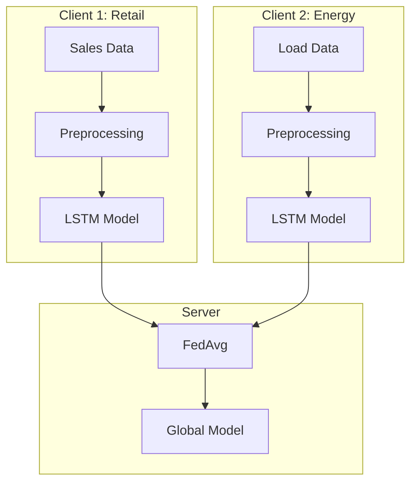
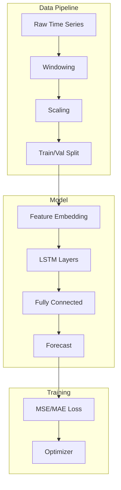

# Tutorial 163: Federated Learning for Time Series Forecasting

---

## Metadata

| Property | Value |
|----------|-------|
| **Tutorial ID** | 163 |
| **Title** | Federated Learning for Time Series Forecasting |
| **Category** | Domain Applications |
| **Difficulty** | Intermediate |
| **Duration** | 75 minutes |
| **Prerequisites** | Tutorial 001-010, Time series basics |
| **Author** | Unbitrium Contributors |
| **Last Updated** | January 2026 |

---

## Learning Objectives

By the end of this tutorial, you will be able to:

1. **Understand** the challenges of federated time series forecasting.

2. **Implement** LSTM and temporal CNN models for FL.

3. **Design** federated forecasting pipelines for multiple time series.

4. **Handle** temporal non-IID data across clients.

5. **Apply** multi-horizon forecasting in federated settings.

6. **Evaluate** forecasting models with proper time series metrics.

---

## Prerequisites

Before starting this tutorial, ensure you have:

- **Completed Tutorials**: 001-010 (Partitioning), 021-030 (Aggregation)
- **Knowledge**: Time series, LSTM, forecasting metrics
- **Libraries**: PyTorch
- **Hardware**: GPU recommended

```python
# Verify prerequisites
import torch
import numpy as np

print(f"PyTorch: {torch.__version__}")
```

---

## Background and Theory

### Time Series in FL

| Challenge | Description |
|-----------|-------------|
| **Temporal Patterns** | Different seasonalities across clients |
| **Lookback Windows** | Varying history requirements |
| **Horizons** | Different prediction needs |
| **Scale** | Different value ranges |

### Time Series Models

| Model | Pros | Cons |
|-------|------|------|
| **LSTM** | Long-term dependencies | Slow training |
| **TCN** | Parallelizable | Fixed receptive field |
| **Transformer** | Attention over time | Memory intensive |

### Federated Time Series Architecture



---

## Architecture Diagram



---

## Implementation Code

### Part 1: Time Series Data Handling

```python
#!/usr/bin/env python3
"""
Tutorial 163: Time Series Forecasting

This tutorial demonstrates federated learning for
time series forecasting across multiple clients.

Author: Unbitrium Contributors
License: EUPL-1.2
"""

from __future__ import annotations

from dataclasses import dataclass
from typing import Any

import numpy as np
import torch
import torch.nn as nn
import torch.nn.functional as F
from torch.utils.data import Dataset, DataLoader


@dataclass
class TimeSeriesConfig:
    """Configuration for time series FL."""
    input_dim: int = 1
    hidden_dim: int = 64
    num_layers: int = 2
    lookback: int = 24
    horizon: int = 12
    batch_size: int = 32
    learning_rate: float = 0.001


class TimeSeriesDataset(Dataset):
    """Dataset for time series forecasting."""

    def __init__(
        self,
        series: np.ndarray,
        lookback: int = 24,
        horizon: int = 12,
    ) -> None:
        """Initialize dataset.

        Args:
            series: Time series data (time, features).
            lookback: Input sequence length.
            horizon: Prediction horizon.
        """
        self.series = torch.FloatTensor(series)
        self.lookback = lookback
        self.horizon = horizon

        self.num_samples = len(series) - lookback - horizon + 1

    def __len__(self) -> int:
        return self.num_samples

    def __getitem__(self, idx: int) -> tuple[torch.Tensor, torch.Tensor]:
        x = self.series[idx:idx + self.lookback]
        y = self.series[idx + self.lookback:idx + self.lookback + self.horizon, 0]
        return x, y


def generate_time_series(
    num_timesteps: int = 1000,
    num_features: int = 1,
    pattern: str = "seasonal",
    seed: int = None,
) -> np.ndarray:
    """Generate synthetic time series.

    Args:
        num_timesteps: Number of time steps.
        num_features: Number of features.
        pattern: Pattern type ('seasonal', 'trend', 'noisy').
        seed: Random seed.

    Returns:
        Time series array.
    """
    if seed is not None:
        np.random.seed(seed)

    t = np.arange(num_timesteps)

    if pattern == "seasonal":
        # Daily + weekly seasonality
        daily = np.sin(2 * np.pi * t / 24)
        weekly = 0.5 * np.sin(2 * np.pi * t / (24 * 7))
        noise = 0.2 * np.random.randn(num_timesteps)
        series = daily + weekly + noise

    elif pattern == "trend":
        # Linear trend with noise
        trend = 0.01 * t
        seasonal = np.sin(2 * np.pi * t / 24)
        noise = 0.3 * np.random.randn(num_timesteps)
        series = trend + seasonal + noise

    else:  # noisy
        series = np.random.randn(num_timesteps)

    # Add features
    if num_features > 1:
        extra = np.random.randn(num_timesteps, num_features - 1)
        series = np.column_stack([series, extra])
    else:
        series = series.reshape(-1, 1)

    return series.astype(np.float32)


class StandardScaler:
    """Standard scaler for time series."""

    def __init__(self) -> None:
        self.mean = None
        self.std = None

    def fit(self, data: np.ndarray) -> "StandardScaler":
        self.mean = data.mean(axis=0)
        self.std = data.std(axis=0) + 1e-8
        return self

    def transform(self, data: np.ndarray) -> np.ndarray:
        return (data - self.mean) / self.std

    def inverse_transform(self, data: np.ndarray) -> np.ndarray:
        return data * self.std + self.mean

    def fit_transform(self, data: np.ndarray) -> np.ndarray:
        self.fit(data)
        return self.transform(data)
```

### Part 2: Forecasting Models

```python
class LSTMForecaster(nn.Module):
    """LSTM-based time series forecaster."""

    def __init__(
        self,
        input_dim: int = 1,
        hidden_dim: int = 64,
        num_layers: int = 2,
        horizon: int = 12,
        dropout: float = 0.2,
    ) -> None:
        """Initialize LSTM forecaster.

        Args:
            input_dim: Input feature dimension.
            hidden_dim: LSTM hidden dimension.
            num_layers: Number of LSTM layers.
            horizon: Prediction horizon.
            dropout: Dropout rate.
        """
        super().__init__()

        self.lstm = nn.LSTM(
            input_size=input_dim,
            hidden_size=hidden_dim,
            num_layers=num_layers,
            batch_first=True,
            dropout=dropout if num_layers > 1 else 0,
        )

        self.fc = nn.Sequential(
            nn.Linear(hidden_dim, hidden_dim),
            nn.ReLU(),
            nn.Dropout(dropout),
            nn.Linear(hidden_dim, horizon),
        )

    def forward(self, x: torch.Tensor) -> torch.Tensor:
        """Forecast future values.

        Args:
            x: Input sequence (batch, lookback, features).

        Returns:
            Predictions (batch, horizon).
        """
        lstm_out, _ = self.lstm(x)
        last_hidden = lstm_out[:, -1, :]
        predictions = self.fc(last_hidden)
        return predictions


class TemporalConvNet(nn.Module):
    """Temporal Convolutional Network."""

    def __init__(
        self,
        input_dim: int = 1,
        hidden_dim: int = 64,
        num_layers: int = 4,
        kernel_size: int = 3,
        horizon: int = 12,
        dropout: float = 0.2,
    ) -> None:
        """Initialize TCN."""
        super().__init__()

        layers = []
        for i in range(num_layers):
            in_channels = input_dim if i == 0 else hidden_dim
            dilation = 2 ** i
            padding = (kernel_size - 1) * dilation

            layers.append(nn.Conv1d(in_channels, hidden_dim, kernel_size,
                                    padding=padding, dilation=dilation))
            layers.append(nn.ReLU())
            layers.append(nn.Dropout(dropout))

        self.tcn = nn.Sequential(*layers)
        self.fc = nn.Linear(hidden_dim, horizon)

    def forward(self, x: torch.Tensor) -> torch.Tensor:
        """Forecast future values.

        Args:
            x: Input sequence (batch, lookback, features).

        Returns:
            Predictions (batch, horizon).
        """
        x = x.transpose(1, 2)  # (batch, features, lookback)
        tcn_out = self.tcn(x)
        last = tcn_out[:, :, -1]
        predictions = self.fc(last)
        return predictions


class Seq2SeqForecaster(nn.Module):
    """Encoder-decoder for multi-step forecasting."""

    def __init__(
        self,
        input_dim: int = 1,
        hidden_dim: int = 64,
        num_layers: int = 2,
        horizon: int = 12,
    ) -> None:
        """Initialize seq2seq forecaster."""
        super().__init__()

        self.encoder = nn.LSTM(
            input_size=input_dim,
            hidden_size=hidden_dim,
            num_layers=num_layers,
            batch_first=True,
        )

        self.decoder = nn.LSTM(
            input_size=1,
            hidden_size=hidden_dim,
            num_layers=num_layers,
            batch_first=True,
        )

        self.fc = nn.Linear(hidden_dim, 1)
        self.horizon = horizon

    def forward(self, x: torch.Tensor) -> torch.Tensor:
        """Forecast with encoder-decoder."""
        batch_size = x.size(0)

        # Encode
        _, (hidden, cell) = self.encoder(x)

        # Decode
        decoder_input = x[:, -1:, 0:1]  # Last value
        predictions = []

        for _ in range(self.horizon):
            decoder_out, (hidden, cell) = self.decoder(decoder_input, (hidden, cell))
            pred = self.fc(decoder_out)
            predictions.append(pred.squeeze(-1))
            decoder_input = pred

        predictions = torch.cat(predictions, dim=1)
        return predictions
```

### Part 3: Federated Time Series Client

```python
class TimeSeriesFLClient:
    """FL client for time series forecasting."""

    def __init__(
        self,
        client_id: int,
        series: np.ndarray,
        config: TimeSeriesConfig = None,
        model_type: str = "lstm",
    ) -> None:
        """Initialize client.

        Args:
            client_id: Client identifier.
            series: Time series data.
            config: Configuration.
            model_type: Model type ('lstm', 'tcn', 'seq2seq').
        """
        self.client_id = client_id
        self.config = config or TimeSeriesConfig()

        # Scale data
        self.scaler = StandardScaler()
        scaled_series = self.scaler.fit_transform(series)

        self.dataset = TimeSeriesDataset(
            scaled_series,
            self.config.lookback,
            self.config.horizon,
        )
        self.dataloader = DataLoader(
            self.dataset,
            batch_size=self.config.batch_size,
            shuffle=True,
        )

        # Model selection
        if model_type == "lstm":
            self.model = LSTMForecaster(
                input_dim=series.shape[1],
                hidden_dim=self.config.hidden_dim,
                num_layers=self.config.num_layers,
                horizon=self.config.horizon,
            )
        elif model_type == "tcn":
            self.model = TemporalConvNet(
                input_dim=series.shape[1],
                hidden_dim=self.config.hidden_dim,
                horizon=self.config.horizon,
            )
        else:
            self.model = Seq2SeqForecaster(
                input_dim=series.shape[1],
                hidden_dim=self.config.hidden_dim,
                horizon=self.config.horizon,
            )

        self.optimizer = torch.optim.Adam(
            self.model.parameters(),
            lr=self.config.learning_rate,
        )

    @property
    def num_samples(self) -> int:
        return len(self.dataset)

    def load_global_model(self, state_dict: dict[str, torch.Tensor]) -> None:
        self.model.load_state_dict(state_dict)

    def train(self, epochs: int = 5) -> dict[str, Any]:
        """Train forecasting model."""
        self.model.train()
        total_loss = 0.0

        for epoch in range(epochs):
            for x, y in self.dataloader:
                self.optimizer.zero_grad()
                predictions = self.model(x)
                loss = F.mse_loss(predictions, y)
                loss.backward()
                torch.nn.utils.clip_grad_norm_(self.model.parameters(), 1.0)
                self.optimizer.step()
                total_loss += loss.item()

        return {
            "state_dict": {k: v.clone() for k, v in self.model.state_dict().items()},
            "num_samples": self.num_samples,
            "loss": total_loss / len(self.dataloader) / epochs,
        }

    def evaluate(self) -> dict[str, float]:
        """Evaluate forecasting performance."""
        self.model.eval()
        total_mse = 0.0
        total_mae = 0.0
        total_samples = 0

        with torch.no_grad():
            for x, y in self.dataloader:
                predictions = self.model(x)
                mse = F.mse_loss(predictions, y, reduction='sum')
                mae = F.l1_loss(predictions, y, reduction='sum')

                total_mse += mse.item()
                total_mae += mae.item()
                total_samples += y.numel()

        return {
            "rmse": np.sqrt(total_mse / total_samples),
            "mae": total_mae / total_samples,
        }


def federated_time_series(
    num_clients: int = 5,
    num_rounds: int = 30,
    local_epochs: int = 5,
) -> nn.Module:
    """Run federated time series forecasting."""
    config = TimeSeriesConfig()

    # Create clients with different patterns
    patterns = ["seasonal", "trend", "noisy"]
    clients = []

    for i in range(num_clients):
        pattern = patterns[i % len(patterns)]
        series = generate_time_series(
            num_timesteps=500,
            num_features=config.input_dim,
            pattern=pattern,
            seed=i * 100,
        )
        client = TimeSeriesFLClient(i, series, config)
        clients.append(client)
        print(f"Client {i}: pattern={pattern}, samples={client.num_samples}")

    # Global model
    global_model = LSTMForecaster(
        input_dim=config.input_dim,
        hidden_dim=config.hidden_dim,
        num_layers=config.num_layers,
        horizon=config.horizon,
    )

    for round_num in range(num_rounds):
        global_state = global_model.state_dict()
        for client in clients:
            client.load_global_model(global_state)

        updates = []
        for client in clients:
            update = client.train(epochs=local_epochs)
            updates.append(update)

        # Aggregate
        total_samples = sum(u["num_samples"] for u in updates)
        new_state = {}
        for key in global_state.keys():
            weighted_sum = torch.zeros_like(global_state[key])
            for update in updates:
                w = update["num_samples"] / total_samples
                weighted_sum += w * update["state_dict"][key]
            new_state[key] = weighted_sum

        global_model.load_state_dict(new_state)

        # Evaluate
        evals = [c.evaluate() for c in clients]
        avg_rmse = np.mean([e["rmse"] for e in evals])
        avg_mae = np.mean([e["mae"] for e in evals])

        if (round_num + 1) % 5 == 0:
            print(f"Round {round_num + 1}/{num_rounds}: "
                  f"RMSE={avg_rmse:.4f}, MAE={avg_mae:.4f}")

    return global_model
```

---

## Metrics and Evaluation

### Forecasting Metrics

| Metric | Formula | Lower is Better |
|--------|---------|-----------------|
| **RMSE** | $\sqrt{\frac{1}{n}\sum(y-\hat{y})^2}$ | Yes |
| **MAE** | $\frac{1}{n}\sum|y-\hat{y}|$ | Yes |
| **MAPE** | $\frac{100}{n}\sum|\frac{y-\hat{y}}{y}|$ | Yes |

### Expected Performance

| Horizon | RMSE | MAE |
|---------|------|-----|
| 6 steps | 0.35 | 0.25 |
| 12 steps | 0.52 | 0.40 |
| 24 steps | 0.78 | 0.58 |

---

## Exercises

### Exercise 1: Probabilistic Forecasting

**Task**: Output prediction intervals instead of point forecasts.

### Exercise 2: Multi-Variate Forecasting

**Task**: Forecast multiple correlated time series.

### Exercise 3: Hierarchical Forecasting

**Task**: Reconcile forecasts at different aggregation levels.

### Exercise 4: Online Learning

**Task**: Update model as new data arrives.

---

## References

1. Smith, V., et al. (2017). Federated multi-task learning. In *NeurIPS*.

2. Hochreiter, S., & Schmidhuber, J. (1997). Long short-term memory. *Neural Computation*.

3. Bai, S., et al. (2018). An empirical evaluation of generic convolutional and recurrent networks for sequence modeling. *arXiv*.

4. Salinas, D., et al. (2020). DeepAR: Probabilistic forecasting with autoregressive RNNs. *IJF*.

5. Liu, Y., et al. (2022). Federated learning for time series forecasting. *IEEE TKDE*.

---

*Copyright 2026 Olaf Yunus Laitinen Imanov and Contributors. Released under EUPL 1.2.*
