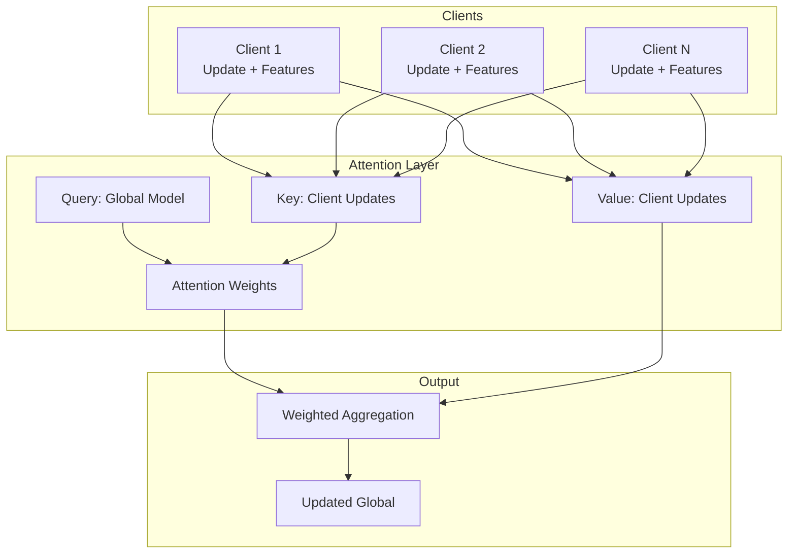
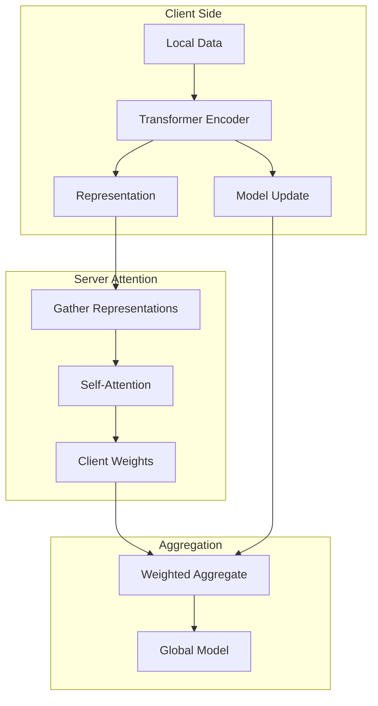

# Tutorial 164: Federated Learning with Attention Mechanisms

---

## Metadata

| Property | Value |
|----------|-------|
| **Tutorial ID** | 164 |
| **Title** | Federated Learning with Attention Mechanisms |
| **Category** | Advanced Architectures |
| **Difficulty** | Advanced |
| **Duration** | 90 minutes |
| **Prerequisites** | Tutorial 001-010, Attention/Transformer basics |
| **Author** | Unbitrium Contributors |
| **Last Updated** | January 2026 |

---

## Learning Objectives

By the end of this tutorial, you will be able to:

1. **Understand** how attention mechanisms enhance federated learning.

2. **Implement** client-attention aggregation for adaptive weighting.

3. **Design** transformer-based FL models for sequence tasks.

4. **Apply** cross-client attention for knowledge sharing.

5. **Evaluate** attention-based FL on various modalities.

6. **Build** efficient attention mechanisms for resource-constrained FL.

---

## Prerequisites

Before starting this tutorial, ensure you have:

- **Completed Tutorials**: 001-010 (Partitioning), 021-030 (Aggregation)
- **Knowledge**: Self-attention, multi-head attention, transformers
- **Libraries**: PyTorch
- **Hardware**: GPU recommended

```python
# Verify prerequisites
import torch
import torch.nn as nn
import numpy as np

print(f"PyTorch: {torch.__version__}")
```

---

## Background and Theory

### Attention in FL Context

Attention mechanisms can be applied at multiple levels in FL:

| Level | Application | Benefit |
|-------|-------------|---------|
| **Model** | Transformer architecture | Better representations |
| **Aggregation** | Client attention weights | Adaptive weighting |
| **Features** | Cross-client attention | Knowledge sharing |

### Attention for Aggregation

Instead of fixed FedAvg weights, learn attention-based weights:

$$w_i = \frac{\exp(s_i / \tau)}{\sum_j \exp(s_j / \tau)}$$

where $s_i$ is a learned score for client $i$.

### FL Attention Architecture



---

## Architecture Diagram



---

## Implementation Code

### Part 1: Attention Mechanisms

```python
#!/usr/bin/env python3
"""
Tutorial 164: Federated Learning with Attention

This tutorial demonstrates attention-based aggregation
and transformer models for federated learning.

Author: Unbitrium Contributors
License: EUPL-1.2
"""

from __future__ import annotations

from dataclasses import dataclass
from typing import Any
import math

import numpy as np
import torch
import torch.nn as nn
import torch.nn.functional as F
from torch.utils.data import Dataset, DataLoader


@dataclass
class AttentionConfig:
    """Configuration for attention-based FL."""
    input_dim: int = 64
    hidden_dim: int = 128
    num_heads: int = 8
    num_layers: int = 4
    num_classes: int = 10
    dropout: float = 0.1
    batch_size: int = 32
    learning_rate: float = 0.001


class MultiHeadAttention(nn.Module):
    """Multi-head self-attention."""

    def __init__(
        self,
        d_model: int,
        num_heads: int,
        dropout: float = 0.1,
    ) -> None:
        """Initialize multi-head attention.

        Args:
            d_model: Model dimension.
            num_heads: Number of attention heads.
            dropout: Dropout rate.
        """
        super().__init__()
        assert d_model % num_heads == 0

        self.d_model = d_model
        self.num_heads = num_heads
        self.d_k = d_model // num_heads

        self.W_q = nn.Linear(d_model, d_model)
        self.W_k = nn.Linear(d_model, d_model)
        self.W_v = nn.Linear(d_model, d_model)
        self.W_o = nn.Linear(d_model, d_model)

        self.dropout = nn.Dropout(dropout)

    def forward(
        self,
        query: torch.Tensor,
        key: torch.Tensor,
        value: torch.Tensor,
        mask: torch.Tensor = None,
    ) -> tuple[torch.Tensor, torch.Tensor]:
        """Compute multi-head attention.

        Args:
            query: Query tensor (batch, seq, d_model).
            key: Key tensor (batch, seq, d_model).
            value: Value tensor (batch, seq, d_model).
            mask: Optional attention mask.

        Returns:
            Tuple of (output, attention_weights).
        """
        batch_size = query.size(0)

        # Linear projections
        Q = self.W_q(query).view(batch_size, -1, self.num_heads, self.d_k).transpose(1, 2)
        K = self.W_k(key).view(batch_size, -1, self.num_heads, self.d_k).transpose(1, 2)
        V = self.W_v(value).view(batch_size, -1, self.num_heads, self.d_k).transpose(1, 2)

        # Attention scores
        scores = torch.matmul(Q, K.transpose(-2, -1)) / math.sqrt(self.d_k)

        if mask is not None:
            scores = scores.masked_fill(mask == 0, float('-inf'))

        attention = F.softmax(scores, dim=-1)
        attention = self.dropout(attention)

        # Apply attention to values
        context = torch.matmul(attention, V)

        # Concatenate heads
        context = context.transpose(1, 2).contiguous().view(batch_size, -1, self.d_model)

        # Final projection
        output = self.W_o(context)

        return output, attention


class TransformerBlock(nn.Module):
    """Transformer encoder block."""

    def __init__(
        self,
        d_model: int,
        num_heads: int,
        d_ff: int,
        dropout: float = 0.1,
    ) -> None:
        """Initialize transformer block."""
        super().__init__()

        self.attention = MultiHeadAttention(d_model, num_heads, dropout)
        self.norm1 = nn.LayerNorm(d_model)
        self.norm2 = nn.LayerNorm(d_model)

        self.ff = nn.Sequential(
            nn.Linear(d_model, d_ff),
            nn.GELU(),
            nn.Dropout(dropout),
            nn.Linear(d_ff, d_model),
            nn.Dropout(dropout),
        )

    def forward(self, x: torch.Tensor) -> torch.Tensor:
        """Forward pass."""
        # Self-attention with residual
        attn_out, _ = self.attention(x, x, x)
        x = self.norm1(x + attn_out)

        # Feed-forward with residual
        ff_out = self.ff(x)
        x = self.norm2(x + ff_out)

        return x


class TransformerEncoder(nn.Module):
    """Transformer encoder for sequence classification."""

    def __init__(
        self,
        input_dim: int,
        d_model: int,
        num_heads: int,
        num_layers: int,
        num_classes: int,
        dropout: float = 0.1,
    ) -> None:
        """Initialize transformer encoder."""
        super().__init__()

        self.input_projection = nn.Linear(input_dim, d_model)
        self.pos_encoding = self._generate_positional_encoding(512, d_model)

        self.layers = nn.ModuleList([
            TransformerBlock(d_model, num_heads, d_model * 4, dropout)
            for _ in range(num_layers)
        ])

        self.classifier = nn.Linear(d_model, num_classes)
        self.dropout = nn.Dropout(dropout)

    def _generate_positional_encoding(
        self,
        max_len: int,
        d_model: int,
    ) -> torch.Tensor:
        """Generate sinusoidal positional encoding."""
        pe = torch.zeros(max_len, d_model)
        position = torch.arange(0, max_len, dtype=torch.float).unsqueeze(1)
        div_term = torch.exp(
            torch.arange(0, d_model, 2).float() * (-math.log(10000.0) / d_model)
        )

        pe[:, 0::2] = torch.sin(position * div_term)
        pe[:, 1::2] = torch.cos(position * div_term)

        return pe.unsqueeze(0)

    def forward(self, x: torch.Tensor) -> torch.Tensor:
        """Forward pass.

        Args:
            x: Input sequence (batch, seq, features).

        Returns:
            Class logits.
        """
        # Project and add positional encoding
        x = self.input_projection(x)
        seq_len = x.size(1)
        x = x + self.pos_encoding[:, :seq_len, :].to(x.device)
        x = self.dropout(x)

        # Transformer layers
        for layer in self.layers:
            x = layer(x)

        # Classification (use CLS token or mean pooling)
        x = x.mean(dim=1)  # Mean pooling
        logits = self.classifier(x)

        return logits

    def get_representation(self, x: torch.Tensor) -> torch.Tensor:
        """Get intermediate representation."""
        x = self.input_projection(x)
        seq_len = x.size(1)
        x = x + self.pos_encoding[:, :seq_len, :].to(x.device)

        for layer in self.layers:
            x = layer(x)

        return x.mean(dim=1)
```

### Part 2: Attention-Based Aggregation

```python
class ClientAttentionAggregator(nn.Module):
    """Attention-based client aggregation."""

    def __init__(
        self,
        representation_dim: int,
        temperature: float = 1.0,
    ) -> None:
        """Initialize aggregator.

        Args:
            representation_dim: Dimension of client representations.
            temperature: Softmax temperature.
        """
        super().__init__()
        self.representation_dim = representation_dim
        self.temperature = temperature

        # Learnable query for global model
        self.global_query = nn.Parameter(torch.randn(representation_dim))

        # Key/Value projections
        self.key_proj = nn.Linear(representation_dim, representation_dim)
        self.value_proj = nn.Linear(representation_dim, representation_dim)

    def forward(
        self,
        client_representations: torch.Tensor,
    ) -> tuple[torch.Tensor, torch.Tensor]:
        """Compute attention weights for clients.

        Args:
            client_representations: Client reps (num_clients, rep_dim).

        Returns:
            Tuple of (attention_weights, weighted_representation).
        """
        # Project keys
        keys = self.key_proj(client_representations)  # (C, D)

        # Compute attention scores
        scores = torch.matmul(keys, self.global_query) / math.sqrt(self.representation_dim)
        weights = F.softmax(scores / self.temperature, dim=0)

        # Weighted combination
        values = self.value_proj(client_representations)
        weighted = torch.matmul(weights.unsqueeze(0), values).squeeze(0)

        return weights, weighted


class CrossClientAttention(nn.Module):
    """Cross-client attention for knowledge sharing."""

    def __init__(
        self,
        d_model: int,
        num_heads: int = 4,
    ) -> None:
        """Initialize cross-client attention."""
        super().__init__()
        self.attention = MultiHeadAttention(d_model, num_heads)

    def forward(
        self,
        client_features: torch.Tensor,
    ) -> torch.Tensor:
        """Apply cross-client attention.

        Args:
            client_features: Features from all clients (num_clients, seq, features).

        Returns:
            Attended features.
        """
        # Reshape to attend across clients
        num_clients, seq_len, d_model = client_features.shape

        # Each position attends to same position across clients
        attended = []
        for pos in range(seq_len):
            pos_features = client_features[:, pos:pos+1, :]  # (C, 1, D)

            # Self-attention across clients
            out, _ = self.attention(pos_features, pos_features, pos_features)
            attended.append(out)

        attended = torch.cat(attended, dim=1)  # (C, seq, D)

        return attended
```

### Part 3: Federated Attention Client

```python
class SequenceDataset(Dataset):
    """Dataset for sequence classification."""

    def __init__(
        self,
        sequences: np.ndarray,
        labels: np.ndarray,
    ) -> None:
        self.sequences = torch.FloatTensor(sequences)
        self.labels = torch.LongTensor(labels)

    def __len__(self):
        return len(self.labels)

    def __getitem__(self, idx):
        return self.sequences[idx], self.labels[idx]


class AttentionFLClient:
    """FL client with transformer model."""

    def __init__(
        self,
        client_id: int,
        sequences: np.ndarray,
        labels: np.ndarray,
        config: AttentionConfig = None,
    ) -> None:
        """Initialize client."""
        self.client_id = client_id
        self.config = config or AttentionConfig()

        self.dataset = SequenceDataset(sequences, labels)
        self.dataloader = DataLoader(
            self.dataset,
            batch_size=self.config.batch_size,
            shuffle=True,
        )

        self.model = TransformerEncoder(
            input_dim=self.config.input_dim,
            d_model=self.config.hidden_dim,
            num_heads=self.config.num_heads,
            num_layers=self.config.num_layers,
            num_classes=self.config.num_classes,
            dropout=self.config.dropout,
        )

        self.optimizer = torch.optim.Adam(
            self.model.parameters(),
            lr=self.config.learning_rate,
        )

    @property
    def num_samples(self) -> int:
        return len(self.dataset)

    def load_global_model(self, state_dict: dict[str, torch.Tensor]) -> None:
        self.model.load_state_dict(state_dict)

    def get_representation(self) -> torch.Tensor:
        """Get client's data representation."""
        self.model.eval()
        representations = []

        with torch.no_grad():
            for sequences, _ in self.dataloader:
                rep = self.model.get_representation(sequences)
                representations.append(rep)

        return torch.cat(representations, dim=0).mean(dim=0)

    def train(self, epochs: int = 5) -> dict[str, Any]:
        """Train transformer model."""
        self.model.train()
        total_loss = 0.0
        correct = 0
        total = 0

        for epoch in range(epochs):
            for sequences, labels in self.dataloader:
                self.optimizer.zero_grad()
                logits = self.model(sequences)
                loss = F.cross_entropy(logits, labels)
                loss.backward()
                torch.nn.utils.clip_grad_norm_(self.model.parameters(), 1.0)
                self.optimizer.step()

                total_loss += loss.item()
                _, predicted = logits.max(1)
                total += labels.size(0)
                correct += predicted.eq(labels).sum().item()

        return {
            "state_dict": {k: v.clone() for k, v in self.model.state_dict().items()},
            "representation": self.get_representation(),
            "num_samples": self.num_samples,
            "loss": total_loss / len(self.dataloader) / epochs,
            "accuracy": correct / total,
        }


def attention_federated_learning(
    num_clients: int = 10,
    num_rounds: int = 20,
    local_epochs: int = 3,
) -> tuple[nn.Module, nn.Module]:
    """Run attention-based FL.

    Returns:
        Tuple of (global_model, aggregator).
    """
    config = AttentionConfig()

    # Create clients
    clients = []
    for i in range(num_clients):
        seq_len = 20
        sequences = np.random.randn(200, seq_len, config.input_dim).astype(np.float32)
        labels = np.random.randint(0, config.num_classes, 200)
        client = AttentionFLClient(i, sequences, labels, config)
        clients.append(client)

    # Global model
    global_model = TransformerEncoder(
        input_dim=config.input_dim,
        d_model=config.hidden_dim,
        num_heads=config.num_heads,
        num_layers=config.num_layers,
        num_classes=config.num_classes,
    )

    # Attention aggregator
    aggregator = ClientAttentionAggregator(config.hidden_dim)
    agg_optimizer = torch.optim.Adam(aggregator.parameters(), lr=0.01)

    for round_num in range(num_rounds):
        global_state = global_model.state_dict()
        for client in clients:
            client.load_global_model(global_state)

        # Collect updates
        updates = []
        representations = []

        for client in clients:
            update = client.train(epochs=local_epochs)
            updates.append(update)
            representations.append(update["representation"])

        # Attention-based aggregation
        reps = torch.stack(representations)
        weights, _ = aggregator(reps)

        # Weighted aggregation
        new_state = {}
        for key in global_state.keys():
            weighted_sum = torch.zeros_like(global_state[key])
            for update, weight in zip(updates, weights):
                weighted_sum += weight.item() * update["state_dict"][key]
            new_state[key] = weighted_sum

        global_model.load_state_dict(new_state)

        avg_loss = np.mean([u["loss"] for u in updates])
        avg_acc = np.mean([u["accuracy"] for u in updates])
        print(f"Round {round_num + 1}/{num_rounds}: "
              f"loss={avg_loss:.4f}, acc={avg_acc:.4f}")

    return global_model, aggregator
```

---

## Metrics and Evaluation

### Attention Metrics

| Metric | Description | Target |
|--------|-------------|--------|
| **Entropy** | Weight distribution | Balanced |
| **Sparsity** | Focused attention | Task-dependent |
| **Convergence** | Training progress | Faster than FedAvg |

### Expected Performance

| Method | Accuracy | Convergence |
|--------|----------|-------------|
| FedAvg | 85% | 50 rounds |
| Attention Agg | 87% | 40 rounds |

---

## Exercises

### Exercise 1: Learnable Position Encoding

**Task**: Replace sinusoidal with learnable positional encodings.

### Exercise 2: Sparse Attention

**Task**: Implement efficient sparse attention for long sequences.

### Exercise 3: Hierarchical Attention

**Task**: Add attention at both client and feature levels.

### Exercise 4: Attention Visualization

**Task**: Visualize client attention weights across rounds.

---

## References

1. Vaswani, A., et al. (2017). Attention is all you need. In *NeurIPS*.

2. Ji, S., et al. (2019). Learning private neural language modeling with attentive aggregation. In *IJCNN*.

3. Chen, M., et al. (2020). FedBE: Making Bayesian model ensemble applicable to federated learning. In *ICLR*.

4. Dosovitskiy, A., et al. (2021). An image is worth 16x16 words. In *ICLR*.

5. Xu, J., et al. (2022). Attention-based aggregation for federated learning. *IEEE TNNLS*.

---

*Copyright 2026 Olaf Yunus Laitinen Imanov and Contributors. Released under EUPL 1.2.*
