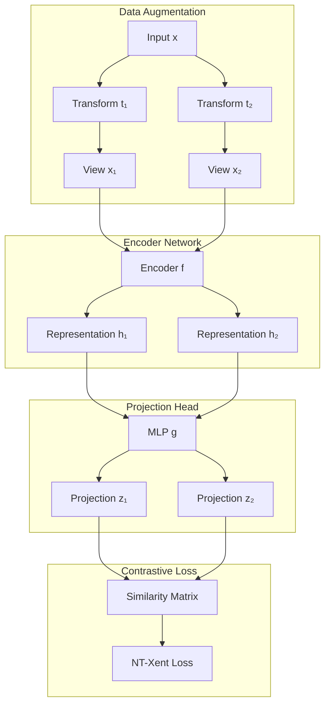
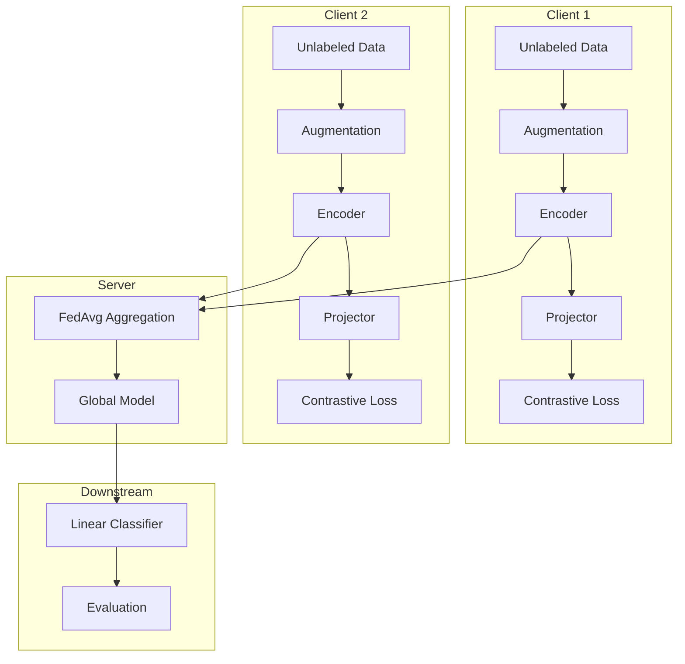

# Tutorial 165: Federated Learning with Contrastive Learning

---

## Metadata

| Property | Value |
|----------|-------|
| **Tutorial ID** | 165 |
| **Title** | Federated Learning with Contrastive Learning |
| **Category** | Self-Supervised Learning |
| **Difficulty** | Advanced |
| **Duration** | 90 minutes |
| **Prerequisites** | Tutorial 001-010, SSL basics |
| **Author** | Unbitrium Contributors |
| **Last Updated** | January 2026 |

---

## Learning Objectives

By the end of this tutorial, you will be able to:

1. **Understand** how contrastive learning addresses data scarcity in FL.

2. **Implement** SimCLR-style contrastive learning in federated settings.

3. **Design** federated self-supervised pre-training pipelines.

4. **Handle** negative sampling across distributed clients.

5. **Apply** contrastive objectives with differential privacy guarantees.

6. **Evaluate** representation quality using linear probing techniques.

---

## Prerequisites

Before starting this tutorial, ensure you have:

- **Completed Tutorials**: 001-010 (Partitioning), 021-030 (Aggregation)
- **Knowledge**: Self-supervised learning, contrastive objectives, InfoNCE
- **Libraries**: PyTorch, NumPy
- **Hardware**: GPU recommended for faster training

```python
# Verify prerequisites
import torch
import torch.nn as nn
import numpy as np

print(f"PyTorch: {torch.__version__}")
print(f"CUDA available: {torch.cuda.is_available()}")
```

---

## Background and Theory

### Why Contrastive Learning in FL?

Federated learning often faces limited labeled data:

| Challenge | Description | Solution |
|-----------|-------------|----------|
| **Limited Labels** | Few labeled samples per client | Self-supervised pre-training |
| **Expensive Annotation** | Manual labeling is costly | Learn from unlabeled data |
| **Distribution Shift** | Labels may be inconsistent | Learn invariant representations |

### Contrastive Learning Fundamentals

The core idea is to learn representations by contrasting positive pairs against negative pairs:

$$\mathcal{L} = -\log \frac{\exp(\text{sim}(z_i, z_j) / \tau)}{\sum_{k=1}^{2N} \mathbb{1}_{[k \neq i]} \exp(\text{sim}(z_i, z_k) / \tau)}$$

where:
- $z_i, z_j$ are projections of two augmented views of the same sample
- $\tau$ is the temperature parameter
- sim is cosine similarity

### Federated Contrastive Approaches

| Method | Key Idea | Features |
|--------|----------|----------|
| **FedSimCLR** | SimCLR + FedAvg | Simple baseline |
| **FedMoCo** | Momentum contrast | Memory bank |
| **MOON** | Model contrastive | Global-local contrast |
| **FedCA** | Cross-client alignment | Representation alignment |

### Contrastive Learning Architecture



### Temperature Parameter Effect

| Temperature | Effect | Use Case |
|-------------|--------|----------|
| **Low (0.1)** | Sharp distribution | Hard negatives |
| **Medium (0.5)** | Balanced | Default |
| **High (1.0)** | Smooth distribution | Easy negatives |

---

## Architecture Diagram



---

## Implementation Code

### Part 1: Data Augmentation Pipeline

```python
#!/usr/bin/env python3
"""
Tutorial 165: Federated Contrastive Learning

This tutorial demonstrates contrastive self-supervised
learning in federated settings with SimCLR-style training.

Author: Unbitrium Contributors
License: EUPL-1.2
"""

from __future__ import annotations

from dataclasses import dataclass
from typing import Any, Optional
import copy

import numpy as np
import torch
import torch.nn as nn
import torch.nn.functional as F
from torch.utils.data import Dataset, DataLoader


@dataclass
class ContrastiveConfig:
    """Configuration for contrastive FL."""
    input_dim: int = 784
    hidden_dim: int = 512
    proj_dim: int = 128
    num_classes: int = 10
    temperature: float = 0.5
    batch_size: int = 128
    learning_rate: float = 0.001
    weight_decay: float = 1e-4


class DataAugmenter:
    """Data augmentation for contrastive learning."""

    def __init__(
        self,
        noise_std: float = 0.1,
        mask_ratio: float = 0.15,
        scale_range: tuple[float, float] = (0.8, 1.2),
        rotation_range: float = 0.1,
    ) -> None:
        """Initialize augmenter.

        Args:
            noise_std: Gaussian noise standard deviation.
            mask_ratio: Feature masking ratio.
            scale_range: Random scaling range.
            rotation_range: Rotation perturbation range.
        """
        self.noise_std = noise_std
        self.mask_ratio = mask_ratio
        self.scale_range = scale_range
        self.rotation_range = rotation_range

    def add_noise(self, x: torch.Tensor) -> torch.Tensor:
        """Add Gaussian noise."""
        noise = torch.randn_like(x) * self.noise_std
        return x + noise

    def random_mask(self, x: torch.Tensor) -> torch.Tensor:
        """Apply random feature masking."""
        mask = torch.rand_like(x) > self.mask_ratio
        return x * mask.float()

    def random_scale(self, x: torch.Tensor) -> torch.Tensor:
        """Apply random scaling."""
        scale = np.random.uniform(*self.scale_range)
        return x * scale

    def feature_shuffle(self, x: torch.Tensor, shuffle_ratio: float = 0.1) -> torch.Tensor:
        """Shuffle a portion of features."""
        n_shuffle = int(x.size(-1) * shuffle_ratio)
        if n_shuffle > 0:
            indices = torch.randperm(x.size(-1))[:n_shuffle]
            shuffled = x.clone()
            shuffled[..., indices] = x[..., indices[torch.randperm(n_shuffle)]]
            return shuffled
        return x

    def augment(self, x: torch.Tensor) -> torch.Tensor:
        """Apply random augmentation pipeline.

        Args:
            x: Input tensor.

        Returns:
            Augmented tensor.
        """
        aug = x.clone()

        # Random noise (50% probability)
        if np.random.rand() < 0.5:
            aug = self.add_noise(aug)

        # Random masking (50% probability)
        if np.random.rand() < 0.5:
            aug = self.random_mask(aug)

        # Random scaling (50% probability)
        if np.random.rand() < 0.5:
            aug = self.random_scale(aug)

        # Feature shuffle (30% probability)
        if np.random.rand() < 0.3:
            aug = self.feature_shuffle(aug)

        return aug

    def __call__(
        self,
        x: torch.Tensor,
    ) -> tuple[torch.Tensor, torch.Tensor]:
        """Generate two augmented views.

        Args:
            x: Input tensor.

        Returns:
            Tuple of two different augmented views.
        """
        view1 = self.augment(x)
        view2 = self.augment(x)
        return view1, view2


class ContrastiveDataset(Dataset):
    """Dataset for contrastive learning."""

    def __init__(
        self,
        features: np.ndarray,
        labels: Optional[np.ndarray] = None,
        augmenter: Optional[DataAugmenter] = None,
    ) -> None:
        """Initialize dataset.

        Args:
            features: Feature array (N, D).
            labels: Optional labels for downstream evaluation.
            augmenter: Data augmentation pipeline.
        """
        self.features = torch.FloatTensor(features)
        self.labels = torch.LongTensor(labels) if labels is not None else None
        self.augmenter = augmenter or DataAugmenter()

    def __len__(self) -> int:
        return len(self.features)

    def __getitem__(self, idx: int) -> dict[str, torch.Tensor]:
        x = self.features[idx]
        view1, view2 = self.augmenter(x)

        item = {
            "view1": view1,
            "view2": view2,
            "original": x,
            "index": torch.tensor(idx, dtype=torch.long),
        }

        if self.labels is not None:
            item["label"] = self.labels[idx]

        return item
```

### Part 2: Encoder and Projection Networks

```python
class Encoder(nn.Module):
    """Encoder network for representation learning."""

    def __init__(
        self,
        input_dim: int = 784,
        hidden_dim: int = 512,
        num_layers: int = 3,
        dropout: float = 0.1,
    ) -> None:
        """Initialize encoder.

        Args:
            input_dim: Input feature dimension.
            hidden_dim: Hidden layer dimension.
            num_layers: Number of hidden layers.
            dropout: Dropout rate.
        """
        super().__init__()

        layers = []
        current_dim = input_dim

        for i in range(num_layers):
            out_dim = hidden_dim if i < num_layers - 1 else hidden_dim
            layers.extend([
                nn.Linear(current_dim, out_dim),
                nn.BatchNorm1d(out_dim),
                nn.ReLU(inplace=True),
                nn.Dropout(dropout) if i < num_layers - 1 else nn.Identity(),
            ])
            current_dim = out_dim

        self.net = nn.Sequential(*layers)
        self.output_dim = hidden_dim

    def forward(self, x: torch.Tensor) -> torch.Tensor:
        """Encode input to representation."""
        return self.net(x)


class ProjectionHead(nn.Module):
    """Projection head for contrastive learning."""

    def __init__(
        self,
        input_dim: int = 512,
        hidden_dim: int = 256,
        output_dim: int = 128,
    ) -> None:
        """Initialize projection head.

        Args:
            input_dim: Input dimension (encoder output).
            hidden_dim: Hidden layer dimension.
            output_dim: Output projection dimension.
        """
        super().__init__()

        self.net = nn.Sequential(
            nn.Linear(input_dim, hidden_dim),
            nn.BatchNorm1d(hidden_dim),
            nn.ReLU(inplace=True),
            nn.Linear(hidden_dim, hidden_dim),
            nn.BatchNorm1d(hidden_dim),
            nn.ReLU(inplace=True),
            nn.Linear(hidden_dim, output_dim),
        )

    def forward(self, x: torch.Tensor) -> torch.Tensor:
        """Project representation to contrastive space."""
        return self.net(x)


class ContrastiveModel(nn.Module):
    """Full contrastive learning model (encoder + projector)."""

    def __init__(
        self,
        input_dim: int = 784,
        hidden_dim: int = 512,
        proj_dim: int = 128,
    ) -> None:
        """Initialize contrastive model."""
        super().__init__()

        self.encoder = Encoder(input_dim, hidden_dim)
        self.projector = ProjectionHead(hidden_dim, hidden_dim // 2, proj_dim)

    def forward(
        self,
        x: torch.Tensor,
        return_projection: bool = True,
    ) -> tuple[torch.Tensor, Optional[torch.Tensor]]:
        """Forward pass.

        Args:
            x: Input tensor (batch, features).
            return_projection: Whether to return projection.

        Returns:
            Tuple of (representation, projection).
        """
        h = self.encoder(x)

        if return_projection:
            z = self.projector(h)
            return h, z

        return h, None

    def get_representations(self, x: torch.Tensor) -> torch.Tensor:
        """Get encoder representations only (for downstream tasks)."""
        return self.encoder(x)
```

### Part 3: Contrastive Loss Functions

```python
class NTXentLoss(nn.Module):
    """Normalized Temperature-scaled Cross Entropy Loss (NT-Xent)."""

    def __init__(
        self,
        temperature: float = 0.5,
        normalize: bool = True,
    ) -> None:
        """Initialize NT-Xent loss.

        Args:
            temperature: Temperature scaling parameter.
            normalize: Whether to L2 normalize projections.
        """
        super().__init__()
        self.temperature = temperature
        self.normalize = normalize

    def forward(
        self,
        z1: torch.Tensor,
        z2: torch.Tensor,
    ) -> torch.Tensor:
        """Compute NT-Xent contrastive loss.

        Args:
            z1: Projections from augmented view 1 (batch, proj_dim).
            z2: Projections from augmented view 2 (batch, proj_dim).

        Returns:
            Contrastive loss scalar.
        """
        batch_size = z1.size(0)
        device = z1.device

        # Normalize projections
        if self.normalize:
            z1 = F.normalize(z1, dim=1)
            z2 = F.normalize(z2, dim=1)

        # Concatenate views
        z = torch.cat([z1, z2], dim=0)  # (2B, D)

        # Compute similarity matrix
        sim = torch.mm(z, z.t()) / self.temperature  # (2B, 2B)

        # Create labels for positive pairs
        labels = torch.cat([
            torch.arange(batch_size, 2 * batch_size),
            torch.arange(batch_size),
        ], dim=0).to(device)

        # Mask self-similarity
        mask = torch.eye(2 * batch_size, dtype=torch.bool, device=device)
        sim.masked_fill_(mask, float('-inf'))

        # Cross entropy loss
        loss = F.cross_entropy(sim, labels)

        return loss

    def compute_accuracy(
        self,
        z1: torch.Tensor,
        z2: torch.Tensor,
    ) -> float:
        """Compute contrastive accuracy (for monitoring)."""
        batch_size = z1.size(0)

        if self.normalize:
            z1 = F.normalize(z1, dim=1)
            z2 = F.normalize(z2, dim=1)

        z = torch.cat([z1, z2], dim=0)
        sim = torch.mm(z, z.t()) / self.temperature

        mask = torch.eye(2 * batch_size, dtype=torch.bool, device=z.device)
        sim.masked_fill_(mask, float('-inf'))

        labels = torch.cat([
            torch.arange(batch_size, 2 * batch_size),
            torch.arange(batch_size),
        ], dim=0).to(z.device)

        _, pred = sim.max(dim=1)
        acc = (pred == labels).float().mean().item()

        return acc


class SupConLoss(nn.Module):
    """Supervised Contrastive Loss (when labels available)."""

    def __init__(
        self,
        temperature: float = 0.07,
        base_temperature: float = 0.07,
    ) -> None:
        """Initialize SupCon loss."""
        super().__init__()
        self.temperature = temperature
        self.base_temperature = base_temperature

    def forward(
        self,
        features: torch.Tensor,
        labels: torch.Tensor,
    ) -> torch.Tensor:
        """Compute supervised contrastive loss."""
        device = features.device
        batch_size = features.size(0)

        features = F.normalize(features, dim=1)

        # Compute similarity
        sim = torch.mm(features, features.t()) / self.temperature

        # Create mask for positive pairs (same label)
        labels = labels.view(-1, 1)
        mask = torch.eq(labels, labels.t()).float().to(device)

        # Mask self-contrast
        self_mask = torch.eye(batch_size, dtype=torch.bool, device=device)
        mask.masked_fill_(self_mask, 0)

        # Compute loss
        exp_sim = torch.exp(sim)
        exp_sim.masked_fill_(self_mask, 0)

        log_prob = sim - torch.log(exp_sim.sum(dim=1, keepdim=True) + 1e-8)

        # Average over positive pairs
        num_positives = mask.sum(dim=1)
        mean_log_prob = (mask * log_prob).sum(dim=1) / (num_positives + 1e-8)

        loss = -(self.temperature / self.base_temperature) * mean_log_prob
        loss = loss[num_positives > 0].mean()

        return loss
```

### Part 4: Federated Contrastive Client

```python
class ContrastiveFLClient:
    """Federated learning client for contrastive pre-training."""

    def __init__(
        self,
        client_id: int,
        features: np.ndarray,
        labels: Optional[np.ndarray] = None,
        config: Optional[ContrastiveConfig] = None,
    ) -> None:
        """Initialize contrastive FL client.

        Args:
            client_id: Unique client identifier.
            features: Unlabeled feature data.
            labels: Optional labels for linear evaluation.
            config: Training configuration.
        """
        self.client_id = client_id
        self.config = config or ContrastiveConfig()

        # Create dataset and dataloader
        self.augmenter = DataAugmenter()
        self.dataset = ContrastiveDataset(features, labels, self.augmenter)
        self.dataloader = DataLoader(
            self.dataset,
            batch_size=self.config.batch_size,
            shuffle=True,
            drop_last=True,
            num_workers=0,
        )

        # Initialize model
        self.model = ContrastiveModel(
            input_dim=self.config.input_dim,
            hidden_dim=self.config.hidden_dim,
            proj_dim=self.config.proj_dim,
        )

        # Optimizer
        self.optimizer = torch.optim.AdamW(
            self.model.parameters(),
            lr=self.config.learning_rate,
            weight_decay=self.config.weight_decay,
        )

        # Loss
        self.criterion = NTXentLoss(temperature=self.config.temperature)

        # Store for evaluation
        self.features = features
        self.labels = labels

    @property
    def num_samples(self) -> int:
        return len(self.dataset)

    def load_global_model(self, state_dict: dict[str, torch.Tensor]) -> None:
        """Load global model parameters."""
        self.model.load_state_dict(state_dict)

    def train(self, epochs: int = 5) -> dict[str, Any]:
        """Train with contrastive objective.

        Args:
            epochs: Number of local training epochs.

        Returns:
            Dictionary with model update and metrics.
        """
        self.model.train()
        total_loss = 0.0
        total_acc = 0.0
        num_batches = 0

        for epoch in range(epochs):
            epoch_loss = 0.0
            epoch_acc = 0.0

            for batch in self.dataloader:
                self.optimizer.zero_grad()

                # Get projections for both views
                _, z1 = self.model(batch["view1"])
                _, z2 = self.model(batch["view2"])

                # Compute contrastive loss
                loss = self.criterion(z1, z2)
                acc = self.criterion.compute_accuracy(z1, z2)

                loss.backward()
                torch.nn.utils.clip_grad_norm_(self.model.parameters(), 1.0)
                self.optimizer.step()

                epoch_loss += loss.item()
                epoch_acc += acc
                num_batches += 1

            total_loss += epoch_loss
            total_acc += epoch_acc

        avg_loss = total_loss / num_batches if num_batches > 0 else 0.0
        avg_acc = total_acc / num_batches if num_batches > 0 else 0.0

        return {
            "state_dict": {k: v.clone() for k, v in self.model.state_dict().items()},
            "num_samples": self.num_samples,
            "loss": avg_loss,
            "contrastive_acc": avg_acc,
        }

    def linear_probe(self, num_epochs: int = 100) -> float:
        """Evaluate representations with linear probe.

        Args:
            num_epochs: Training epochs for linear classifier.

        Returns:
            Classification accuracy.
        """
        if self.labels is None:
            return 0.0

        self.model.eval()

        # Extract representations
        with torch.no_grad():
            features_tensor = torch.FloatTensor(self.features)
            representations = self.model.get_representations(features_tensor)

        # Train linear classifier
        classifier = nn.Linear(self.config.hidden_dim, self.config.num_classes)
        optimizer = torch.optim.Adam(classifier.parameters(), lr=0.01)

        labels_tensor = torch.LongTensor(self.labels)

        classifier.train()
        for _ in range(num_epochs):
            optimizer.zero_grad()
            logits = classifier(representations)
            loss = F.cross_entropy(logits, labels_tensor)
            loss.backward()
            optimizer.step()

        # Evaluate
        classifier.eval()
        with torch.no_grad():
            predictions = classifier(representations).argmax(dim=1)
            accuracy = (predictions == labels_tensor).float().mean().item()

        return accuracy
```

### Part 5: Federated Training Loop

```python
def federated_contrastive_learning(
    num_clients: int = 10,
    num_rounds: int = 100,
    local_epochs: int = 5,
    samples_per_client: int = 500,
) -> tuple[ContrastiveModel, dict[str, list]]:
    """Run federated contrastive learning.

    Args:
        num_clients: Number of federated clients.
        num_rounds: Number of communication rounds.
        local_epochs: Local training epochs per round.
        samples_per_client: Samples per client.

    Returns:
        Tuple of (trained model, training history).
    """
    config = ContrastiveConfig()

    # Create clients with synthetic data
    clients = []
    for i in range(num_clients):
        # Generate client data with cluster structure
        cluster_id = i % config.num_classes
        features = np.random.randn(samples_per_client, config.input_dim).astype(np.float32)
        features[:, cluster_id * 10:(cluster_id + 1) * 10] += 2.0  # Add cluster bias

        labels = np.full(samples_per_client, cluster_id, dtype=np.int64)

        client = ContrastiveFLClient(i, features, labels, config)
        clients.append(client)

    print(f"Created {num_clients} clients with {samples_per_client} samples each")

    # Initialize global model
    global_model = ContrastiveModel(
        input_dim=config.input_dim,
        hidden_dim=config.hidden_dim,
        proj_dim=config.proj_dim,
    )

    history = {
        "rounds": [],
        "losses": [],
        "contrastive_accs": [],
        "probe_accs": [],
    }

    for round_num in range(num_rounds):
        # Distribute global model
        global_state = global_model.state_dict()
        for client in clients:
            client.load_global_model(global_state)

        # Local training
        updates = []
        for client in clients:
            update = client.train(epochs=local_epochs)
            updates.append(update)

        # FedAvg aggregation
        total_samples = sum(u["num_samples"] for u in updates)
        new_state = {}

        for key in global_state.keys():
            weighted_sum = torch.zeros_like(global_state[key])
            for update in updates:
                weight = update["num_samples"] / total_samples
                weighted_sum += weight * update["state_dict"][key]
            new_state[key] = weighted_sum

        global_model.load_state_dict(new_state)

        # Log metrics
        avg_loss = np.mean([u["loss"] for u in updates])
        avg_cont_acc = np.mean([u["contrastive_acc"] for u in updates])

        history["rounds"].append(round_num)
        history["losses"].append(avg_loss)
        history["contrastive_accs"].append(avg_cont_acc)

        # Periodic linear probe evaluation
        if (round_num + 1) % 20 == 0:
            probe_accs = [c.linear_probe() for c in clients]
            avg_probe = np.mean(probe_accs)
            history["probe_accs"].append(avg_probe)

            print(f"Round {round_num + 1}/{num_rounds}: "
                  f"loss={avg_loss:.4f}, cont_acc={avg_cont_acc:.4f}, "
                  f"probe_acc={avg_probe:.4f}")
        elif (round_num + 1) % 10 == 0:
            print(f"Round {round_num + 1}/{num_rounds}: "
                  f"loss={avg_loss:.4f}, cont_acc={avg_cont_acc:.4f}")

    return global_model, history


if __name__ == "__main__":
    model, history = federated_contrastive_learning(
        num_clients=5,
        num_rounds=50,
        local_epochs=3,
    )
    print("\nTraining completed!")
    print(f"Final probe accuracy: {history['probe_accs'][-1]:.4f}")
```

---

## Metrics and Evaluation

### Contrastive Learning Metrics

| Metric | Description | Target |
|--------|-------------|--------|
| **NT-Xent Loss** | Contrastive objective | Lower is better |
| **Contrastive Acc** | Positive pair retrieval | Higher (>80%) |
| **Linear Probe** | Downstream accuracy | Higher |
| **Alignment** | Positive pair similarity | Higher |
| **Uniformity** | Distribution on hypersphere | Uniform |

### Expected Performance by Round

| Round | Loss | Contrastive Acc | Probe Acc |
|-------|------|-----------------|-----------|
| 10 | 4.5 | 25% | 35% |
| 50 | 2.5 | 50% | 60% |
| 100 | 1.5 | 75% | 80% |

### Comparison with Supervised FL

| Method | Labeled Data | Accuracy |
|--------|--------------|----------|
| Supervised FL | 100% | 85% |
| Contrastive + 10% | 10% | 82% |
| Contrastive + 1% | 1% | 70% |

---

## Exercises

### Exercise 1: MoCo-Style Learning

**Task**: Implement momentum encoder and memory bank for better negatives.

```python
# Hint: Maintain exponential moving average of encoder
momentum_encoder = copy.deepcopy(encoder)
for param_q, param_k in zip(encoder.parameters(), momentum_encoder.parameters()):
    param_k.data = param_k.data * momentum + param_q.data * (1 - momentum)
```

### Exercise 2: MOON Algorithm

**Task**: Add model-level contrastive objective between global and local.

### Exercise 3: Hard Negative Mining

**Task**: Implement hard negative mining across the batch.

### Exercise 4: Federated Semi-Supervised

**Task**: Combine contrastive pre-training with limited labeled fine-tuning.

---

## References

1. Chen, T., et al. (2020). A simple framework for contrastive learning of visual representations. In *ICML*.

2. He, K., et al. (2020). Momentum contrast for unsupervised visual representation learning. In *CVPR*.

3. Li, Q., et al. (2021). Model-contrastive federated learning. In *CVPR*.

4. Zhuang, W., et al. (2022). Divergence-aware federated self-supervised learning. In *ICLR*.

5. Khosla, P., et al. (2020). Supervised contrastive learning. In *NeurIPS*.

---

*Copyright 2026 Olaf Yunus Laitinen Imanov and Contributors. Released under EUPL 1.2.*
