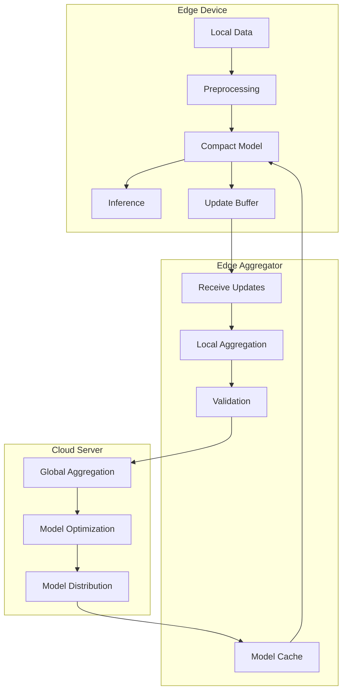

# Tutorial 169: Federated Learning for Edge Computing

---

## Metadata

| Property | Value |
|----------|-------|
| **Tutorial ID** | 169 |
| **Title** | Federated Learning for Edge Computing |
| **Category** | System Design |
| **Difficulty** | Advanced |
| **Duration** | 90 minutes |
| **Prerequisites** | Tutorial 001-010, edge computing basics |
| **Author** | Unbitrium Contributors |
| **Last Updated** | January 2026 |

---

## Learning Objectives

By the end of this tutorial, you will be able to:

1. **Understand** edge computing requirements for federated learning.

2. **Implement** efficient models optimized for edge deployment.

3. **Design** hierarchical FL architectures with edge servers.

4. **Handle** intermittent connectivity and resource constraints.

5. **Apply** on-device inference with federated updates.

6. **Build** edge-native FL systems for IoT applications.

---

## Prerequisites

Before starting this tutorial, ensure you have:

- **Completed Tutorials**: 001-010 (Partitioning), 021-030 (Aggregation)
- **Knowledge**: Edge computing, embedded systems, model optimization
- **Libraries**: PyTorch, NumPy
- **Hardware**: CPU sufficient (or edge device for deployment)

```python
# Verify prerequisites
import torch
import torch.nn as nn
import numpy as np
import sys

print(f"PyTorch: {torch.__version__}")
print(f"Platform: {sys.platform}")
```

---

## Background and Theory

### Edge Computing Characteristics

| Characteristic | Description | Impact on FL |
|----------------|-------------|--------------|
| **Limited Memory** | 256MB - 4GB RAM | Small models |
| **Limited Compute** | ARM/embedded CPUs | Slow training |
| **Battery Powered** | mAh constraints | Minimal updates |
| **Intermittent** | Unstable connectivity | Async protocols |

### Edge FL Architecture Tiers

| Tier | Role | Resources |
|------|------|-----------|
| **End Devices** | Data collection, inference | Very limited |
| **Edge Servers** | Local aggregation | Moderate |
| **Cloud** | Final aggregation, orchestration | Abundant |

### Edge Device Categories


### Model Optimization for Edge

| Technique | Size Reduction | Accuracy Drop |
|-----------|----------------|---------------|
| **Quantization** | 4x | < 1% |
| **Pruning** | 2-10x | 1-5% |
| **Knowledge Distillation** | 5-20x | 2-5% |
| **Architecture Search** | Variable | Optimal |

---

## Architecture Diagram



---

## Implementation Code

### Part 1: Edge-Optimized Models

```python
#!/usr/bin/env python3
"""
Tutorial 169: Federated Learning for Edge Computing

This tutorial demonstrates edge-optimized FL with
compact models and hierarchical aggregation.

Author: Unbitrium Contributors
License: EUPL-1.2
"""

from __future__ import annotations

from dataclasses import dataclass
from typing import Any, Optional
import time

import numpy as np
import torch
import torch.nn as nn
import torch.nn.functional as F
from torch.utils.data import Dataset, DataLoader


@dataclass
class EdgeConfig:
    """Configuration for edge FL."""
    max_model_size_mb: float = 10.0
    max_memory_mb: float = 256.0
    max_latency_ms: float = 100.0
    quantization_bits: int = 8
    batch_size: int = 16  # Small for edge
    learning_rate: float = 0.01
    edge_aggregation_frequency: int = 5


class DepthwiseSeparableConv(nn.Module):
    """Depthwise separable convolution for efficiency."""

    def __init__(
        self,
        in_channels: int,
        out_channels: int,
        kernel_size: int = 3,
        stride: int = 1,
        padding: int = 1,
    ) -> None:
        """Initialize depthwise separable conv."""
        super().__init__()

        self.depthwise = nn.Conv2d(
            in_channels, in_channels, kernel_size,
            stride=stride, padding=padding, groups=in_channels, bias=False
        )
        self.pointwise = nn.Conv2d(
            in_channels, out_channels, 1, bias=False
        )
        self.bn = nn.BatchNorm2d(out_channels)

    def forward(self, x: torch.Tensor) -> torch.Tensor:
        x = self.depthwise(x)
        x = self.pointwise(x)
        x = self.bn(x)
        return F.relu(x)


class MobileNetTiny(nn.Module):
    """Tiny MobileNet-style model for edge devices."""

    def __init__(
        self,
        input_channels: int = 3,
        num_classes: int = 10,
        width_multiplier: float = 0.25,
    ) -> None:
        """Initialize tiny mobile model.

        Args:
            input_channels: Input channels.
            num_classes: Output classes.
            width_multiplier: Width scaling factor.
        """
        super().__init__()

        def make_channels(c):
            return max(8, int(c * width_multiplier))

        self.features = nn.Sequential(
            nn.Conv2d(input_channels, make_channels(32), 3, 2, 1, bias=False),
            nn.BatchNorm2d(make_channels(32)),
            nn.ReLU(inplace=True),

            DepthwiseSeparableConv(make_channels(32), make_channels(64)),
            DepthwiseSeparableConv(make_channels(64), make_channels(128), stride=2),
            DepthwiseSeparableConv(make_channels(128), make_channels(128)),
            DepthwiseSeparableConv(make_channels(128), make_channels(256), stride=2),
            DepthwiseSeparableConv(make_channels(256), make_channels(256)),

            nn.AdaptiveAvgPool2d(1),
        )

        self.classifier = nn.Linear(make_channels(256), num_classes)

    def forward(self, x: torch.Tensor) -> torch.Tensor:
        x = self.features(x)
        x = x.view(x.size(0), -1)
        x = self.classifier(x)
        return x

    def get_model_size_mb(self) -> float:
        """Get model size in megabytes."""
        param_size = sum(p.numel() * p.element_size() for p in self.parameters())
        return param_size / (1024 * 1024)


class EdgeMLPModel(nn.Module):
    """Compact MLP for edge tabular tasks."""

    def __init__(
        self,
        input_dim: int,
        num_classes: int,
        hidden_dims: list[int] = None,
    ) -> None:
        """Initialize edge MLP."""
        super().__init__()

        hidden_dims = hidden_dims or [32, 16]

        layers = []
        current_dim = input_dim

        for hidden_dim in hidden_dims:
            layers.extend([
                nn.Linear(current_dim, hidden_dim),
                nn.ReLU(inplace=True),
                nn.Dropout(0.1),
            ])
            current_dim = hidden_dim

        layers.append(nn.Linear(current_dim, num_classes))
        self.net = nn.Sequential(*layers)

    def forward(self, x: torch.Tensor) -> torch.Tensor:
        return self.net(x)

    def get_model_size_mb(self) -> float:
        param_size = sum(p.numel() * p.element_size() for p in self.parameters())
        return param_size / (1024 * 1024)


class ModelQuantizer:
    """Simple quantization for edge deployment."""

    def __init__(self, bits: int = 8) -> None:
        """Initialize quantizer."""
        self.bits = bits
        self.scale = {}
        self.zero_point = {}

    def quantize(
        self,
        state_dict: dict[str, torch.Tensor],
    ) -> dict[str, torch.Tensor]:
        """Quantize model weights.

        Args:
            state_dict: Model parameters.

        Returns:
            Quantized parameters.
        """
        quantized = {}

        for key, tensor in state_dict.items():
            if tensor.dtype == torch.float32:
                min_val = tensor.min().item()
                max_val = tensor.max().item()

                scale = (max_val - min_val) / (2 ** self.bits - 1)
                zero_point = -min_val / scale if scale != 0 else 0

                self.scale[key] = scale
                self.zero_point[key] = zero_point

                q = ((tensor - min_val) / (scale + 1e-8)).round().clamp(0, 2 ** self.bits - 1)
                quantized[key] = q.to(torch.uint8)
            else:
                quantized[key] = tensor

        return quantized

    def dequantize(
        self,
        quantized: dict[str, torch.Tensor],
    ) -> dict[str, torch.Tensor]:
        """Dequantize model weights."""
        dequantized = {}

        for key, tensor in quantized.items():
            if tensor.dtype == torch.uint8:
                scale = self.scale[key]
                min_val = -self.zero_point[key] * scale
                dequantized[key] = tensor.float() * scale + min_val
            else:
                dequantized[key] = tensor

        return dequantized

    def compression_ratio(self) -> float:
        """Get compression ratio."""
        return 32 / self.bits  # float32 to quantized
```

### Part 2: Edge Device Simulation

```python
@dataclass
class DeviceProfile:
    """Edge device resource profile."""
    device_id: str
    memory_mb: float
    compute_flops: float
    battery_capacity_mah: float
    battery_level: float
    network_bandwidth_kbps: float
    is_connected: bool = True


class EdgeDevice:
    """Simulated edge device for FL."""

    def __init__(
        self,
        device_id: str,
        features: np.ndarray,
        labels: np.ndarray,
        profile: DeviceProfile = None,
        config: EdgeConfig = None,
    ) -> None:
        """Initialize edge device.

        Args:
            device_id: Device identifier.
            features: Local data features.
            labels: Local data labels.
            profile: Device resource profile.
            config: Edge configuration.
        """
        self.device_id = device_id
        self.config = config or EdgeConfig()
        self.profile = profile or DeviceProfile(
            device_id=device_id,
            memory_mb=256.0,
            compute_flops=1e9,
            battery_capacity_mah=3000,
            battery_level=1.0,
            network_bandwidth_kbps=1000,
        )

        # Data
        self.features = torch.FloatTensor(features)
        self.labels = torch.LongTensor(labels)

        # Model (will be loaded)
        self.model: Optional[nn.Module] = None

        # Update buffer for intermittent connectivity
        self.update_buffer: list[dict] = []
        self.last_sync_round = 0

        # Statistics
        self.training_time_total = 0.0
        self.energy_consumed = 0.0

    @property
    def num_samples(self) -> int:
        return len(self.labels)

    def can_train(self) -> bool:
        """Check if device can participate."""
        return (
            self.profile.is_connected and
            self.profile.battery_level > 0.2 and
            self.model is not None
        )

    def load_model(self, model: nn.Module) -> None:
        """Load model for training/inference."""
        self.model = model

    def _simulate_training_time(self, num_epochs: int) -> float:
        """Simulate training time based on device profile."""
        base_time = 0.1 * num_epochs * self.num_samples / self.config.batch_size
        # Scale by compute power relative to baseline
        time = base_time * (1e10 / self.profile.compute_flops)
        return time

    def _simulate_energy_consumption(self, training_time: float) -> float:
        """Simulate energy consumption."""
        # Approximate mAh consumed
        power_mw = 500  # Typical training power
        energy = power_mw * training_time / 3600  # mAh
        return energy

    def train(self, epochs: int = 1) -> Optional[dict]:
        """Train on local data with resource simulation.

        Args:
            epochs: Number of training epochs.

        Returns:
            Update dict or None if cannot train.
        """
        if not self.can_train():
            return None

        start_time = time.time()

        # Create dataset
        dataset = torch.utils.data.TensorDataset(self.features, self.labels)
        dataloader = DataLoader(dataset, batch_size=self.config.batch_size, shuffle=True)

        optimizer = torch.optim.SGD(
            self.model.parameters(), lr=self.config.learning_rate
        )

        self.model.train()
        total_loss = 0.0

        for epoch in range(epochs):
            for x, y in dataloader:
                optimizer.zero_grad()
                out = self.model(x)
                loss = F.cross_entropy(out, y)
                loss.backward()
                optimizer.step()
                total_loss += loss.item()

        training_time = time.time() - start_time + self._simulate_training_time(epochs)
        energy = self._simulate_energy_consumption(training_time)

        # Update device state
        self.training_time_total += training_time
        self.energy_consumed += energy
        self.profile.battery_level -= energy / self.profile.battery_capacity_mah

        update = {
            "device_id": self.device_id,
            "state_dict": {k: v.clone() for k, v in self.model.state_dict().items()},
            "num_samples": self.num_samples,
            "loss": total_loss / len(dataloader) / epochs,
            "training_time": training_time,
            "energy": energy,
        }

        # Handle intermittent connectivity
        if self.profile.is_connected:
            return update
        else:
            self.update_buffer.append(update)
            return None

    def inference(self, x: torch.Tensor) -> torch.Tensor:
        """Run inference on device."""
        if self.model is None:
            raise ValueError("Model not loaded")

        self.model.eval()
        with torch.no_grad():
            return self.model(x)

    def sync_buffer(self) -> list[dict]:
        """Sync buffered updates when connectivity returns."""
        if not self.profile.is_connected:
            return []

        updates = self.update_buffer.copy()
        self.update_buffer = []
        return updates
```

### Part 3: Edge Aggregation Server

```python
class EdgeAggregator:
    """Edge server for local aggregation."""

    def __init__(
        self,
        aggregator_id: str,
        devices: list[EdgeDevice],
        aggregation_frequency: int = 5,
    ) -> None:
        """Initialize edge aggregator.

        Args:
            aggregator_id: Aggregator identifier.
            devices: Devices managed by this aggregator.
            aggregation_frequency: Rounds before cloud sync.
        """
        self.aggregator_id = aggregator_id
        self.devices = devices
        self.aggregation_frequency = aggregation_frequency

        self.local_model: Optional[nn.Module] = None
        self.round_counter = 0
        self.pending_for_cloud: list[dict] = []

    def set_model(self, model: nn.Module) -> None:
        """Set model for aggregation."""
        self.local_model = model
        for device in self.devices:
            device.load_model(model)

    def run_local_round(self) -> dict[str, Any]:
        """Run one local FL round.

        Returns:
            Round statistics.
        """
        if self.local_model is None:
            raise ValueError("Model not set")

        # Distribute model
        for device in self.devices:
            device.load_model(self.local_model)

        # Collect updates
        updates = []
        for device in self.devices:
            update = device.train(epochs=1)
            if update:
                updates.append(update)

            # Also check buffered updates
            buffered = device.sync_buffer()
            updates.extend(buffered)

        # Aggregate locally
        if updates:
            new_state = self._aggregate(updates)
            self.local_model.load_state_dict(new_state)

        self.round_counter += 1

        stats = {
            "aggregator_id": self.aggregator_id,
            "round": self.round_counter,
            "participating_devices": len(updates),
            "total_samples": sum(u["num_samples"] for u in updates),
        }

        # Check if time to sync with cloud
        if self.round_counter % self.aggregation_frequency == 0:
            self.pending_for_cloud.append({
                "state_dict": {k: v.clone() for k, v in self.local_model.state_dict().items()},
                "num_samples": stats["total_samples"],
            })

        return stats

    def _aggregate(
        self,
        updates: list[dict],
    ) -> dict[str, torch.Tensor]:
        """Aggregate device updates."""
        total_samples = sum(u["num_samples"] for u in updates)

        new_state = {}
        for key in updates[0]["state_dict"]:
            weighted_sum = torch.zeros_like(updates[0]["state_dict"][key])
            for update in updates:
                weight = update["num_samples"] / total_samples
                weighted_sum += weight * update["state_dict"][key]
            new_state[key] = weighted_sum

        return new_state

    def get_cloud_update(self) -> Optional[dict]:
        """Get aggregated update for cloud."""
        if not self.pending_for_cloud:
            return None

        update = self.pending_for_cloud[-1]
        self.pending_for_cloud = []
        return update


def edge_federated_learning(
    num_devices: int = 20,
    num_edge_servers: int = 4,
    num_rounds: int = 50,
) -> tuple[nn.Module, dict]:
    """Run edge FL simulation.

    Args:
        num_devices: Total edge devices.
        num_edge_servers: Number of edge aggregators.
        num_rounds: Total rounds.

    Returns:
        Tuple of (final model, history).
    """
    config = EdgeConfig()
    devices_per_edge = num_devices // num_edge_servers

    # Create devices and edge servers
    edge_servers = []
    device_counter = 0

    for i in range(num_edge_servers):
        devices = []
        for j in range(devices_per_edge):
            features = np.random.randn(100, 32).astype(np.float32)
            labels = np.random.randint(0, 10, 100)

            profile = DeviceProfile(
                device_id=f"device_{device_counter}",
                memory_mb=256 + np.random.rand() * 256,
                compute_flops=1e9 * (0.5 + np.random.rand()),
                battery_capacity_mah=3000,
                battery_level=0.5 + np.random.rand() * 0.5,
                network_bandwidth_kbps=500 + np.random.rand() * 1000,
                is_connected=np.random.rand() > 0.1,
            )

            device = EdgeDevice(
                f"device_{device_counter}",
                features, labels, profile, config
            )
            devices.append(device)
            device_counter += 1

        edge = EdgeAggregator(f"edge_{i}", devices, config.edge_aggregation_frequency)
        edge_servers.append(edge)

    # Global model
    global_model = EdgeMLPModel(32, 10, [32, 16])
    print(f"Model size: {global_model.get_model_size_mb():.4f} MB")

    # Initialize edge servers
    for edge in edge_servers:
        edge.set_model(global_model)

    history = {"rounds": [], "participating": [], "samples": []}

    for round_num in range(num_rounds):
        # Run local rounds on each edge
        edge_stats = []
        for edge in edge_servers:
            stats = edge.run_local_round()
            edge_stats.append(stats)

        # Occasionally sync with cloud
        if round_num % config.edge_aggregation_frequency == 0:
            cloud_updates = []
            for edge in edge_servers:
                update = edge.get_cloud_update()
                if update:
                    cloud_updates.append(update)

            if cloud_updates:
                # Cloud aggregation
                total = sum(u["num_samples"] for u in cloud_updates)
                new_global = {}
                for key in global_model.state_dict():
                    weighted = torch.zeros_like(global_model.state_dict()[key])
                    for up in cloud_updates:
                        weighted += (up["num_samples"] / total) * up["state_dict"][key]
                    new_global[key] = weighted

                global_model.load_state_dict(new_global)

                # Push to all edges
                for edge in edge_servers:
                    edge.set_model(global_model)

        total_participating = sum(s["participating_devices"] for s in edge_stats)
        total_samples = sum(s["total_samples"] for s in edge_stats)

        history["rounds"].append(round_num)
        history["participating"].append(total_participating)
        history["samples"].append(total_samples)

        if (round_num + 1) % 10 == 0:
            print(f"Round {round_num + 1}/{num_rounds}: "
                  f"devices={total_participating}, samples={total_samples}")

    return global_model, history
```

---

## Metrics and Evaluation

### Edge Metrics

| Metric | Description | Target |
|--------|-------------|--------|
| **Latency** | Inference time | < 100ms |
| **Model Size** | On-device storage | < 10MB |
| **Energy** | Per-round consumption | Minimal |
| **Participation** | Active devices | > 70% |

### Performance by Device Tier

| Tier | Inference | Training | Memory |
|------|-----------|----------|--------|
| Low-end | 200ms | Minutes | 256MB |
| Mid-range | 50ms | 30s | 512MB |
| High-end | 10ms | 5s | 2GB |

---

## Exercises

### Exercise 1: TinyML Models

**Task**: Create models under 1MB for microcontrollers.

### Exercise 2: Offline Training

**Task**: Handle fully offline devices with eventual sync.

### Exercise 3: Adaptive Batching

**Task**: Adjust batch size based on available memory.

### Exercise 4: Energy-Aware Scheduling

**Task**: Schedule training based on battery and charging.

---

## References

1. Li, D., & Wang, J. (2019). FedMD: Heterogeneous federated learning via model distillation. *arXiv*.

2. Diao, E., et al. (2021). HeteroFL: Computation and communication efficient FL for heterogeneous clients. *ICLR*.

3. Wang, C., et al. (2020). Towards efficient scheduling of FL on heterogeneous resources. *IEEE IoTJ*.

4. Lin, Y., et al. (2018). Deep gradient compression: Reducing communication bandwidth. *ICLR*.

5. Cai, H., et al. (2020). Once-for-All: Train one network. *ICLR*.

---

*Copyright 2026 Olaf Yunus Laitinen Imanov and Contributors. Released under EUPL 1.2.*
