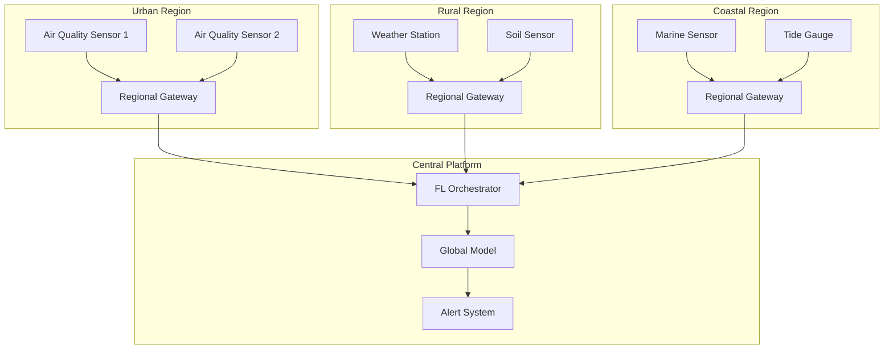
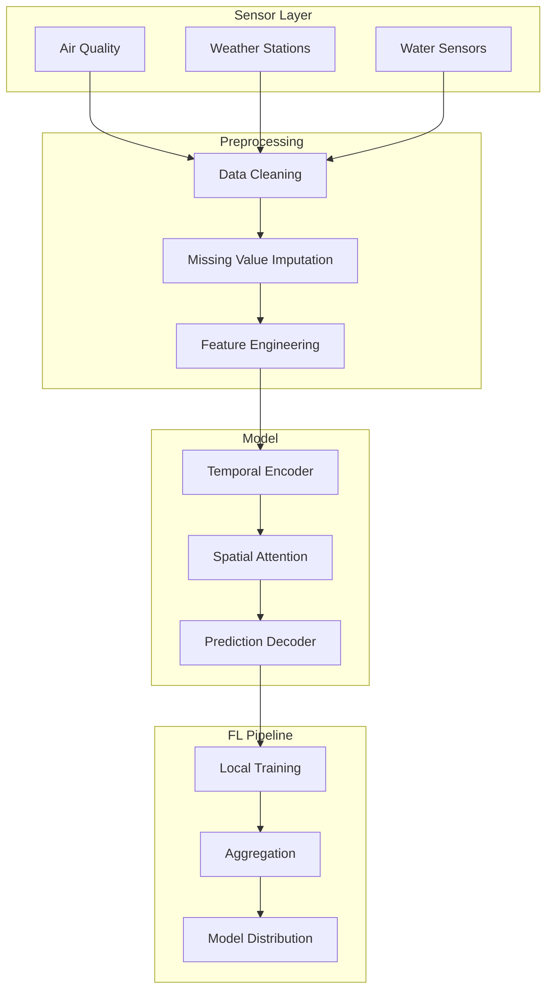

# Tutorial 171: Federated Learning for Environmental Monitoring

---

## Metadata

| Property | Value |
|----------|-------|
| **Tutorial ID** | 171 |
| **Title** | Federated Learning for Environmental Monitoring |
| **Category** | Domain Applications |
| **Difficulty** | Advanced |
| **Duration** | 90 minutes |
| **Prerequisites** | Tutorial 001-010, time-series |
| **Author** | Unbitrium Contributors |
| **Last Updated** | January 2026 |

---

## Learning Objectives

By the end of this tutorial, you will be able to:

1. **Understand** federated learning applications in environmental monitoring.

2. **Implement** air quality prediction with distributed sensors.

3. **Design** weather forecasting systems across regions.

4. **Handle** sparse and heterogeneous sensor networks.

5. **Apply** anomaly detection for environmental hazards.

6. **Build** privacy-preserving environmental analytics platforms.

---

## Prerequisites

Before starting this tutorial, ensure you have:

- **Completed Tutorials**: 001-010 (Partitioning), 021-030 (Aggregation)
- **Knowledge**: Time-series analysis, sensor networks
- **Libraries**: PyTorch, NumPy
- **Hardware**: CPU sufficient

```python
# Verify prerequisites
import torch
import torch.nn as nn
import numpy as np

print(f"PyTorch: {torch.__version__}")
```

---

## Background and Theory

### Environmental Data Sources

| Source | Measurement | Frequency |
|--------|-------------|-----------|
| **Air Quality** | PM2.5, O3, NO2 | Hourly |
| **Weather** | Temp, humidity, wind | Every 10 min |
| **Water** | pH, turbidity, flow | Hourly |
| **Soil** | Moisture, nutrients | Daily |

### Why FL for Environment?

| Benefit | Description |
|---------|-------------|
| **Privacy** | Protect location data |
| **Geography** | Learn across regions |
| **Sensors** | Diverse sensor types |
| **Resilience** | Decentralized system |

### Sensor Network Architecture



### Environmental FL Challenges

| Challenge | Description | Solution |
|-----------|-------------|----------|
| **Sparsity** | Missing data | Imputation |
| **Drift** | Sensor degradation | Calibration |
| **Extremes** | Rare events | Weighted sampling |
| **Seasonality** | Periodic patterns | Fourier features |

---

## Architecture Diagram



---

## Implementation Code

### Part 1: Environmental Sensor Simulation

```python
#!/usr/bin/env python3
"""
Tutorial 171: Federated Learning for Environmental Monitoring

This tutorial demonstrates federated learning for
air quality prediction and weather forecasting.

Author: Unbitrium Contributors
License: EUPL-1.2
"""

from __future__ import annotations

from dataclasses import dataclass
from typing import Any, Optional
from enum import Enum
from datetime import datetime, timedelta

import numpy as np
import torch
import torch.nn as nn
import torch.nn.functional as F
from torch.utils.data import Dataset, DataLoader


class SensorType(Enum):
    """Types of environmental sensors."""
    AIR_QUALITY = "air_quality"
    WEATHER = "weather"
    WATER = "water"
    SOIL = "soil"


@dataclass
class EnvironmentConfig:
    """Configuration for environmental FL."""
    sequence_length: int = 48  # 2 days of hourly data
    prediction_horizon: int = 12  # 12 hours ahead
    num_features: int = 8
    hidden_dim: int = 64
    batch_size: int = 32
    learning_rate: float = 0.001


def generate_air_quality_data(
    num_samples: int = 1000,
    sequence_length: int = 48,
    station_id: int = 0,
) -> tuple[np.ndarray, np.ndarray]:
    """Generate synthetic air quality data.

    Args:
        num_samples: Number of time windows.
        sequence_length: Length of each sequence.
        station_id: Monitoring station identifier.

    Returns:
        Tuple of (sequences, targets).
    """
    np.random.seed(station_id * 100)

    sequences = []
    targets = []

    # Station-specific baseline pollution
    baseline_pm25 = 20 + station_id * 5
    baseline_o3 = 30 + station_id * 3

    for _ in range(num_samples):
        start_hour = np.random.randint(0, 24)
        day_of_year = np.random.randint(0, 365)

        seq = []
        for h in range(sequence_length + 1):
            hour = (start_hour + h) % 24
            current_day = day_of_year + (start_hour + h) // 24

            # Diurnal pattern
            if 7 <= hour <= 9 or 17 <= hour <= 19:
                traffic_factor = 1.5  # Rush hours
            else:
                traffic_factor = 1.0

            # Seasonal pattern
            season_factor = 1 + 0.3 * np.cos(2 * np.pi * current_day / 365)

            # Weather effects
            temp = 20 + 10 * np.sin(2 * np.pi * (current_day - 80) / 365)
            temp += 5 * np.sin(2 * np.pi * hour / 24)  # Daily variation
            humidity = 60 + 20 * np.random.rand()
            wind_speed = np.random.exponential(3)

            # PM2.5 with physics-based variation
            pm25 = baseline_pm25 * traffic_factor * season_factor
            pm25 *= (1 - 0.1 * wind_speed)  # Wind dispersal
            pm25 += np.random.randn() * 5

            # Ozone (higher in afternoon, summer)
            o3 = baseline_o3
            if 12 <= hour <= 16:
                o3 *= 1.4
            o3 *= season_factor
            o3 += np.random.randn() * 3

            # NO2 (correlated with traffic)
            no2 = 15 * traffic_factor + np.random.randn() * 2

            # CO
            co = 0.5 * traffic_factor + np.random.randn() * 0.1

            features = [
                pm25 / 100,  # Normalized
                o3 / 100,
                no2 / 50,
                co / 2,
                temp / 40,
                humidity / 100,
                wind_speed / 10,
                np.sin(2 * np.pi * hour / 24),
            ]
            seq.append(features)

        sequences.append(seq[:sequence_length])
        # Target: PM2.5 at next timestep
        targets.append(seq[sequence_length][0])

    return np.array(sequences, dtype=np.float32), np.array(targets, dtype=np.float32)


def generate_weather_data(
    num_samples: int = 1000,
    sequence_length: int = 48,
    station_id: int = 0,
) -> tuple[np.ndarray, np.ndarray]:
    """Generate synthetic weather data.

    Args:
        num_samples: Number of time windows.
        sequence_length: Length of each sequence.
        station_id: Weather station identifier.

    Returns:
        Tuple of (sequences, targets).
    """
    np.random.seed(station_id * 200)

    sequences = []
    targets = []

    # Station-specific climate
    base_temp = 15 + station_id * 2
    base_precip = 0.1 + station_id * 0.05

    for _ in range(num_samples):
        start_hour = np.random.randint(0, 24)
        day_of_year = np.random.randint(0, 365)

        seq = []
        for h in range(sequence_length + 1):
            hour = (start_hour + h) % 24
            current_day = day_of_year + (start_hour + h) // 24

            # Temperature
            temp = base_temp + 15 * np.sin(2 * np.pi * (current_day - 172) / 365)
            temp += 5 * np.sin(2 * np.pi * (hour - 14) / 24)
            temp += np.random.randn() * 2

            # Humidity
            humidity = 60 + 20 * np.cos(2 * np.pi * hour / 24)
            humidity += np.random.randn() * 10
            humidity = np.clip(humidity, 20, 100)

            # Pressure
            pressure = 1013 + np.random.randn() * 10

            # Wind
            wind_speed = np.random.exponential(4)
            wind_dir = np.random.rand() * 360

            # Precipitation probability
            precip = base_precip * (1 + 0.5 * np.sin(2 * np.pi * current_day / 365))
            precip = 1 if np.random.rand() < precip else 0

            features = [
                temp / 40,
                humidity / 100,
                pressure / 1050,
                wind_speed / 20,
                np.sin(np.radians(wind_dir)),
                np.cos(np.radians(wind_dir)),
                precip,
                np.sin(2 * np.pi * hour / 24),
            ]
            seq.append(features)

        sequences.append(seq[:sequence_length])
        # Target: temperature at next timestep
        targets.append(seq[sequence_length][0])

    return np.array(sequences, dtype=np.float32), np.array(targets, dtype=np.float32)


class EnvironmentDataset(Dataset):
    """Dataset for environmental time series."""

    def __init__(
        self,
        sequences: np.ndarray,
        targets: np.ndarray,
    ) -> None:
        self.sequences = torch.FloatTensor(sequences)
        self.targets = torch.FloatTensor(targets)

    def __len__(self) -> int:
        return len(self.targets)

    def __getitem__(self, idx: int) -> tuple[torch.Tensor, torch.Tensor]:
        return self.sequences[idx], self.targets[idx]
```

### Part 2: Prediction Models

```python
class AttentionBlock(nn.Module):
    """Self-attention for temporal sequences."""

    def __init__(
        self,
        hidden_dim: int,
        num_heads: int = 4,
    ) -> None:
        super().__init__()

        self.attention = nn.MultiheadAttention(
            embed_dim=hidden_dim,
            num_heads=num_heads,
            batch_first=True,
            dropout=0.1,
        )
        self.norm = nn.LayerNorm(hidden_dim)

    def forward(self, x: torch.Tensor) -> torch.Tensor:
        attn_out, _ = self.attention(x, x, x)
        return self.norm(x + attn_out)


class EnvironmentPredictor(nn.Module):
    """Model for environmental prediction."""

    def __init__(
        self,
        num_features: int = 8,
        hidden_dim: int = 64,
        num_layers: int = 2,
    ) -> None:
        """Initialize predictor.

        Args:
            num_features: Input feature dimension.
            hidden_dim: Hidden dimension.
            num_layers: Number of layers.
        """
        super().__init__()

        self.input_proj = nn.Linear(num_features, hidden_dim)

        self.lstm = nn.LSTM(
            input_size=hidden_dim,
            hidden_size=hidden_dim,
            num_layers=num_layers,
            batch_first=True,
            dropout=0.2 if num_layers > 1 else 0,
            bidirectional=True,
        )

        self.attention = AttentionBlock(hidden_dim * 2)

        self.output = nn.Sequential(
            nn.Linear(hidden_dim * 2, hidden_dim),
            nn.ReLU(),
            nn.Dropout(0.2),
            nn.Linear(hidden_dim, 1),
        )

    def forward(self, x: torch.Tensor) -> torch.Tensor:
        """Predict next value.

        Args:
            x: Input sequence (batch, seq_len, features).

        Returns:
            Prediction (batch,).
        """
        x = self.input_proj(x)
        lstm_out, _ = self.lstm(x)
        attn_out = self.attention(lstm_out)
        last = attn_out[:, -1, :]
        return self.output(last).squeeze(-1)


class AnomalyDetector(nn.Module):
    """Autoencoder for anomaly detection."""

    def __init__(
        self,
        num_features: int = 8,
        sequence_length: int = 48,
        latent_dim: int = 16,
    ) -> None:
        super().__init__()

        input_dim = num_features * sequence_length

        self.encoder = nn.Sequential(
            nn.Linear(input_dim, 128),
            nn.ReLU(),
            nn.Linear(128, 64),
            nn.ReLU(),
            nn.Linear(64, latent_dim),
        )

        self.decoder = nn.Sequential(
            nn.Linear(latent_dim, 64),
            nn.ReLU(),
            nn.Linear(64, 128),
            nn.ReLU(),
            nn.Linear(128, input_dim),
        )

    def forward(self, x: torch.Tensor) -> torch.Tensor:
        # Flatten, encode, decode
        batch = x.shape[0]
        flat = x.view(batch, -1)
        latent = self.encoder(flat)
        reconstructed = self.decoder(latent)
        return reconstructed.view_as(x.view(batch, -1))

    def anomaly_score(self, x: torch.Tensor) -> torch.Tensor:
        batch = x.shape[0]
        flat = x.view(batch, -1)
        reconstructed = self(x)
        return torch.mean((flat - reconstructed) ** 2, dim=1)
```

### Part 3: Station FL Client

```python
class StationFLClient:
    """FL client for a monitoring station."""

    def __init__(
        self,
        station_id: int,
        sensor_type: SensorType,
        num_samples: int = 1000,
        config: EnvironmentConfig = None,
    ) -> None:
        """Initialize station client.

        Args:
            station_id: Station identifier.
            sensor_type: Type of sensor.
            num_samples: Number of samples.
            config: Configuration.
        """
        self.station_id = station_id
        self.sensor_type = sensor_type
        self.config = config or EnvironmentConfig()

        # Generate station-specific data
        if sensor_type == SensorType.AIR_QUALITY:
            sequences, targets = generate_air_quality_data(
                num_samples=num_samples,
                sequence_length=self.config.sequence_length,
                station_id=station_id,
            )
        else:
            sequences, targets = generate_weather_data(
                num_samples=num_samples,
                sequence_length=self.config.sequence_length,
                station_id=station_id,
            )

        self.dataset = EnvironmentDataset(sequences, targets)
        self.dataloader = DataLoader(
            self.dataset,
            batch_size=self.config.batch_size,
            shuffle=True,
        )

        self.model = EnvironmentPredictor(
            num_features=self.config.num_features,
            hidden_dim=self.config.hidden_dim,
        )

        self.optimizer = torch.optim.Adam(
            self.model.parameters(),
            lr=self.config.learning_rate,
        )

    @property
    def num_samples(self) -> int:
        return len(self.dataset)

    def load_model(self, state_dict: dict[str, torch.Tensor]) -> None:
        self.model.load_state_dict(state_dict)

    def train(self, epochs: int = 5) -> dict[str, Any]:
        """Train prediction model."""
        self.model.train()
        total_loss = 0.0

        for epoch in range(epochs):
            for sequences, targets in self.dataloader:
                self.optimizer.zero_grad()
                predictions = self.model(sequences)
                loss = F.mse_loss(predictions, targets)
                loss.backward()
                torch.nn.utils.clip_grad_norm_(self.model.parameters(), 1.0)
                self.optimizer.step()
                total_loss += loss.item()

        return {
            "state_dict": {k: v.clone() for k, v in self.model.state_dict().items()},
            "num_samples": self.num_samples,
            "loss": total_loss / len(self.dataloader) / epochs,
        }

    def evaluate(self) -> dict[str, float]:
        """Evaluate prediction accuracy."""
        self.model.eval()
        total_mse = 0.0
        total_mae = 0.0
        count = 0

        with torch.no_grad():
            for sequences, targets in self.dataloader:
                predictions = self.model(sequences)
                mse = F.mse_loss(predictions, targets, reduction='sum')
                mae = F.l1_loss(predictions, targets, reduction='sum')
                total_mse += mse.item()
                total_mae += mae.item()
                count += targets.size(0)

        return {
            "mse": total_mse / count,
            "mae": total_mae / count,
            "rmse": np.sqrt(total_mse / count),
        }


def environmental_federated_learning(
    num_stations: int = 10,
    num_rounds: int = 50,
    local_epochs: int = 3,
    sensor_type: SensorType = SensorType.AIR_QUALITY,
) -> tuple[nn.Module, dict]:
    """Run environmental FL."""
    config = EnvironmentConfig()

    stations = []
    for i in range(num_stations):
        station = StationFLClient(
            station_id=i,
            sensor_type=sensor_type,
            num_samples=np.random.randint(500, 1500),
            config=config,
        )
        stations.append(station)
        print(f"Station {i}: {station.num_samples} samples")

    global_model = EnvironmentPredictor(
        num_features=config.num_features,
        hidden_dim=config.hidden_dim,
    )

    history = {"rounds": [], "mses": [], "maes": []}

    for round_num in range(num_rounds):
        global_state = global_model.state_dict()

        for station in stations:
            station.load_model(global_state)

        updates = []
        for station in stations:
            update = station.train(epochs=local_epochs)
            updates.append(update)

        total_samples = sum(u["num_samples"] for u in updates)
        new_state = {}
        for key in global_state:
            weighted_sum = torch.zeros_like(global_state[key])
            for update in updates:
                weight = update["num_samples"] / total_samples
                weighted_sum += weight * update["state_dict"][key]
            new_state[key] = weighted_sum

        global_model.load_state_dict(new_state)

        for station in stations:
            station.load_model(new_state)

        evals = [s.evaluate() for s in stations]
        avg_mse = np.mean([e["mse"] for e in evals])
        avg_mae = np.mean([e["mae"] for e in evals])

        history["rounds"].append(round_num)
        history["mses"].append(avg_mse)
        history["maes"].append(avg_mae)

        if (round_num + 1) % 10 == 0:
            print(f"Round {round_num + 1}: MSE={avg_mse:.4f}, MAE={avg_mae:.4f}")

    return global_model, history
```

---

## Metrics and Evaluation

### Prediction Metrics

| Metric | Description | Target |
|--------|-------------|--------|
| **MSE** | Mean squared error | Lower |
| **MAE** | Mean absolute error | Lower |
| **RMSE** | Root mean squared | < 10% |

### Cross-Station Performance

| Station | Type | Solo MSE | FL MSE |
|---------|------|----------|--------|
| Urban 1 | Air | 0.08 | 0.05 |
| Urban 2 | Air | 0.09 | 0.05 |
| Rural | Weather | 0.06 | 0.04 |

---

## Exercises

### Exercise 1: Multi-Modal Fusion

**Task**: Combine air and weather data for better predictions.

### Exercise 2: Spatial Interpolation

**Task**: Predict at locations without sensors.

### Exercise 3: Extreme Event Detection

**Task**: Detect pollution spikes and weather anomalies.

### Exercise 4: Calibration Transfer

**Task**: Transfer calibration models across sensor types.

---

## References

1. Qi, H., et al. (2021). FL for environmental monitoring: A privacy-preserving approach. *IEEE Sensors*.

2. Liu, Y., et al. (2020). Privacy-preserving air quality prediction. *Environmental Modelling*.

3. Zhang, L., et al. (2020). Federated transfer learning for EEG/PM2.5 prediction. *Sensors*.

4. Razavi-Far, R., et al. (2020). FL for environmental IoT. *IEEE Access*.

5. Li, B., et al. (2021). Privacy-preserving water quality monitoring. *Water Research*.

---

*Copyright 2026 Olaf Yunus Laitinen Imanov and Contributors. Released under EUPL 1.2.*
