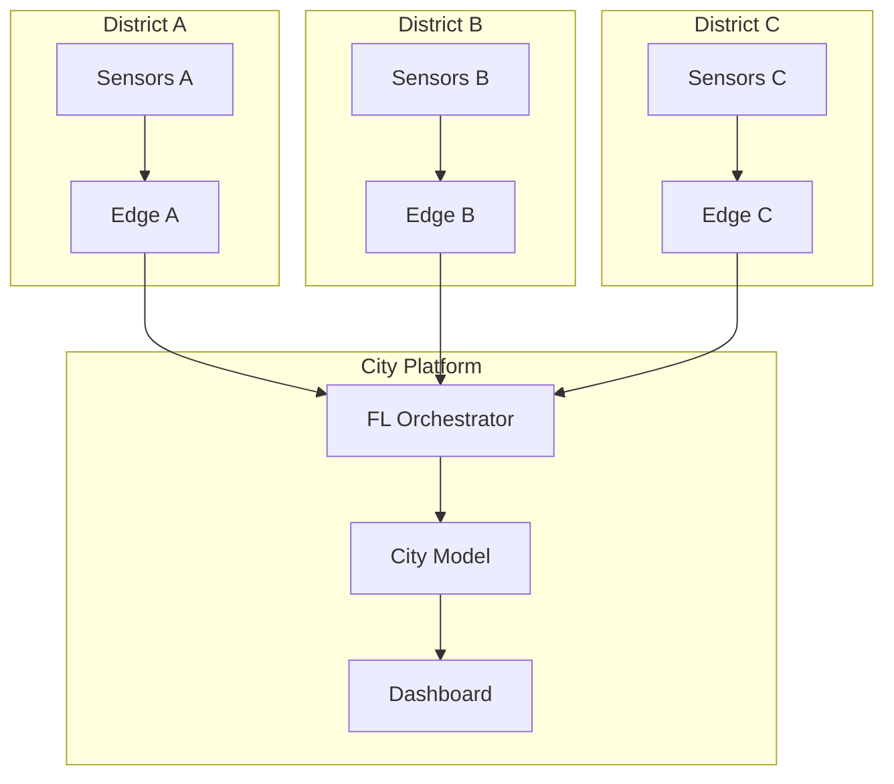
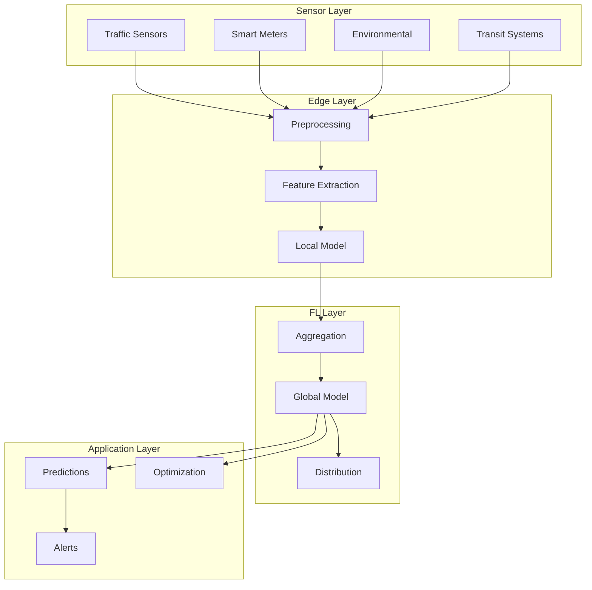

# Tutorial 172: Federated Learning for Smart Cities

---

## Metadata

| Property | Value |
|----------|-------|
| **Tutorial ID** | 172 |
| **Title** | Federated Learning for Smart Cities |
| **Category** | Domain Applications |
| **Difficulty** | Advanced |
| **Duration** | 90 minutes |
| **Prerequisites** | Tutorial 001-010, IoT basics |
| **Author** | Unbitrium Contributors |
| **Last Updated** | January 2026 |

---

## Learning Objectives

By the end of this tutorial, you will be able to:

1. **Understand** federated learning applications in smart cities.

2. **Implement** traffic prediction models with distributed data.

3. **Design** energy consumption forecasting systems.

4. **Handle** multi-modal sensor fusion in FL settings.

5. **Apply** privacy-preserving analytics for citizen data.

6. **Build** scalable urban intelligence platforms.

---

## Prerequisites

Before starting this tutorial, ensure you have:

- **Completed Tutorials**: 001-010 (Partitioning), 021-030 (Aggregation)
- **Knowledge**: Time-series forecasting, IoT systems
- **Libraries**: PyTorch, NumPy
- **Hardware**: CPU sufficient

```python
# Verify prerequisites
import torch
import torch.nn as nn
import numpy as np

print(f"PyTorch: {torch.__version__}")
```

---

## Background and Theory

### Smart City Data Sources

| Source | Data Type | Privacy Level |
|--------|-----------|---------------|
| **Traffic Cameras** | Video/counts | High |
| **Smart Meters** | Energy usage | High |
| **Environmental** | Air quality | Medium |
| **Transit** | Ridership | Low |

### FL Applications in Smart Cities

| Application | Benefit | Challenge |
|-------------|---------|-----------|
| **Traffic Prediction** | Reduce congestion | Real-time |
| **Energy Management** | Reduce costs | Heterogeneity |
| **Parking** | Availability forecast | Sparse data |
| **Safety** | Incident detection | Privacy |

### Smart City FL Architecture



### Urban Data Characteristics

| Characteristic | Description | Impact |
|----------------|-------------|--------|
| **Spatial** | Location-dependent | Heterogeneous |
| **Temporal** | Time-varying patterns | Concept drift |
| **Multi-modal** | Different sensor types | Fusion needed |
| **Sparse** | Incomplete coverage | Imputation |

---

## Architecture Diagram



---

## Implementation Code

### Part 1: Urban Sensor Simulation

```python
#!/usr/bin/env python3
"""
Tutorial 172: Federated Learning for Smart Cities

This tutorial demonstrates federated learning for
traffic prediction and energy management in smart cities.

Author: Unbitrium Contributors
License: EUPL-1.2
"""

from __future__ import annotations

from dataclasses import dataclass
from typing import Any, Optional
from enum import Enum
from datetime import datetime, timedelta

import numpy as np
import torch
import torch.nn as nn
import torch.nn.functional as F
from torch.utils.data import Dataset, DataLoader


class SensorType(Enum):
    """Types of urban sensors."""
    TRAFFIC = "traffic"
    ENERGY = "energy"
    ENVIRONMENT = "environment"
    TRANSIT = "transit"


@dataclass
class SmartCityConfig:
    """Configuration for smart city FL."""
    sequence_length: int = 24  # Hours
    prediction_horizon: int = 6  # Hours ahead
    num_features: int = 8
    hidden_dim: int = 64
    batch_size: int = 32
    learning_rate: float = 0.001


def generate_traffic_data(
    num_samples: int = 1000,
    sequence_length: int = 24,
    district_id: int = 0,
) -> tuple[np.ndarray, np.ndarray]:
    """Generate synthetic traffic count data.

    Args:
        num_samples: Number of time windows.
        sequence_length: Length of each sequence.
        district_id: District identifier.

    Returns:
        Tuple of (sequences, targets).
    """
    np.random.seed(district_id * 100)

    sequences = []
    targets = []

    for _ in range(num_samples):
        # Time features
        start_hour = np.random.randint(0, 24)

        seq = []
        for h in range(sequence_length + 1):
            hour = (start_hour + h) % 24

            # Daily pattern
            if 7 <= hour <= 9:
                base = 80 + np.random.randn() * 10  # Morning rush
            elif 17 <= hour <= 19:
                base = 90 + np.random.randn() * 10  # Evening rush
            elif 0 <= hour <= 5:
                base = 10 + np.random.randn() * 5  # Night
            else:
                base = 40 + np.random.randn() * 10  # Normal

            # District effect
            base *= (1 + 0.1 * district_id)

            # Weather effect (random)
            weather_effect = np.random.uniform(0.8, 1.2)
            base *= weather_effect

            # Features
            features = [
                base / 100,  # Normalized count
                np.sin(2 * np.pi * hour / 24),  # Hour sine
                np.cos(2 * np.pi * hour / 24),  # Hour cosine
                np.random.rand(),  # Weather
                district_id / 10,  # District
                np.random.randn(),  # Random
                np.random.randn(),  # Random
                np.random.randn(),  # Random
            ]
            seq.append(features)

        sequences.append(seq[:sequence_length])
        # Target: traffic count at next hour
        targets.append(seq[sequence_length][0])

    return np.array(sequences, dtype=np.float32), np.array(targets, dtype=np.float32)


def generate_energy_data(
    num_samples: int = 1000,
    sequence_length: int = 24,
    building_id: int = 0,
) -> tuple[np.ndarray, np.ndarray]:
    """Generate synthetic energy consumption data.

    Args:
        num_samples: Number of time windows.
        sequence_length: Length of each sequence.
        building_id: Building identifier.

    Returns:
        Tuple of (sequences, targets).
    """
    np.random.seed(building_id * 200)

    sequences = []
    targets = []

    for _ in range(num_samples):
        start_hour = np.random.randint(0, 24)
        day_type = np.random.choice(["weekday", "weekend"])
        temperature = np.random.uniform(-10, 35)

        seq = []
        for h in range(sequence_length + 1):
            hour = (start_hour + h) % 24

            # Base load
            if day_type == "weekday":
                if 8 <= hour <= 18:
                    base = 100 + np.random.randn() * 10  # Work hours
                else:
                    base = 30 + np.random.randn() * 5  # Off hours
            else:
                base = 50 + np.random.randn() * 10  # Weekend

            # Temperature effect (HVAC)
            if temperature > 25:
                hvac = 20 * (temperature - 25)  # Cooling
            elif temperature < 10:
                hvac = 15 * (10 - temperature)  # Heating
            else:
                hvac = 0

            consumption = base + hvac

            # Building effect
            consumption *= (1 + 0.2 * building_id)

            features = [
                consumption / 200,  # Normalized
                np.sin(2 * np.pi * hour / 24),
                np.cos(2 * np.pi * hour / 24),
                temperature / 40,
                1 if day_type == "weekday" else 0,
                building_id / 10,
                np.random.randn(),
                np.random.randn(),
            ]
            seq.append(features)

        sequences.append(seq[:sequence_length])
        targets.append(seq[sequence_length][0])

    return np.array(sequences, dtype=np.float32), np.array(targets, dtype=np.float32)


class SmartCityDataset(Dataset):
    """Dataset for smart city time series."""

    def __init__(
        self,
        sequences: np.ndarray,
        targets: np.ndarray,
    ) -> None:
        self.sequences = torch.FloatTensor(sequences)
        self.targets = torch.FloatTensor(targets)

    def __len__(self) -> int:
        return len(self.targets)

    def __getitem__(self, idx: int) -> tuple[torch.Tensor, torch.Tensor]:
        return self.sequences[idx], self.targets[idx]
```

### Part 2: Prediction Models

```python
class TemporalBlock(nn.Module):
    """Temporal convolution block."""

    def __init__(
        self,
        in_channels: int,
        out_channels: int,
        kernel_size: int = 3,
        dilation: int = 1,
    ) -> None:
        super().__init__()

        padding = (kernel_size - 1) * dilation

        self.conv1 = nn.Conv1d(
            in_channels, out_channels, kernel_size,
            padding=padding, dilation=dilation
        )
        self.conv2 = nn.Conv1d(
            out_channels, out_channels, kernel_size,
            padding=padding, dilation=dilation
        )

        self.bn1 = nn.BatchNorm1d(out_channels)
        self.bn2 = nn.BatchNorm1d(out_channels)
        self.dropout = nn.Dropout(0.2)

        self.downsample = nn.Conv1d(in_channels, out_channels, 1) \
            if in_channels != out_channels else None

    def forward(self, x: torch.Tensor) -> torch.Tensor:
        # x: (batch, channels, seq_len)
        residual = x

        out = self.conv1(x)
        out = out[:, :, :x.size(2)]  # Causal cropping
        out = self.bn1(out)
        out = F.relu(out)
        out = self.dropout(out)

        out = self.conv2(out)
        out = out[:, :, :x.size(2)]
        out = self.bn2(out)

        if self.downsample is not None:
            residual = self.downsample(residual)

        return F.relu(out + residual)


class TCNPredictor(nn.Module):
    """Temporal Convolutional Network for prediction."""

    def __init__(
        self,
        num_features: int = 8,
        hidden_dim: int = 64,
        num_layers: int = 4,
        kernel_size: int = 3,
    ) -> None:
        """Initialize TCN predictor.

        Args:
            num_features: Input feature dimension.
            hidden_dim: Hidden channel dimension.
            num_layers: Number of temporal blocks.
            kernel_size: Convolution kernel size.
        """
        super().__init__()

        layers = []
        current_channels = num_features

        for i in range(num_layers):
            dilation = 2 ** i
            out_channels = hidden_dim
            layers.append(TemporalBlock(
                current_channels, out_channels, kernel_size, dilation
            ))
            current_channels = out_channels

        self.tcn = nn.Sequential(*layers)
        self.output = nn.Linear(hidden_dim, 1)

    def forward(self, x: torch.Tensor) -> torch.Tensor:
        """Predict next value.

        Args:
            x: Input sequence (batch, seq_len, features).

        Returns:
            Prediction (batch,).
        """
        # Transpose for conv1d: (batch, features, seq_len)
        x = x.transpose(1, 2)
        features = self.tcn(x)
        # Take last time step
        last = features[:, :, -1]
        return self.output(last).squeeze(-1)


class LSTMPredictor(nn.Module):
    """LSTM-based predictor."""

    def __init__(
        self,
        num_features: int = 8,
        hidden_dim: int = 64,
        num_layers: int = 2,
    ) -> None:
        super().__init__()

        self.lstm = nn.LSTM(
            input_size=num_features,
            hidden_size=hidden_dim,
            num_layers=num_layers,
            batch_first=True,
            dropout=0.2 if num_layers > 1 else 0,
        )

        self.output = nn.Sequential(
            nn.Linear(hidden_dim, hidden_dim // 2),
            nn.ReLU(),
            nn.Linear(hidden_dim // 2, 1),
        )

    def forward(self, x: torch.Tensor) -> torch.Tensor:
        lstm_out, _ = self.lstm(x)
        last = lstm_out[:, -1, :]
        return self.output(last).squeeze(-1)
```

### Part 3: District FL Client

```python
class DistrictFLClient:
    """FL client for a city district."""

    def __init__(
        self,
        district_id: int,
        sensor_type: SensorType,
        num_samples: int = 1000,
        config: SmartCityConfig = None,
    ) -> None:
        """Initialize district client.

        Args:
            district_id: District identifier.
            sensor_type: Type of sensor data.
            num_samples: Number of samples.
            config: Configuration.
        """
        self.district_id = district_id
        self.sensor_type = sensor_type
        self.config = config or SmartCityConfig()

        # Generate district-specific data
        if sensor_type == SensorType.TRAFFIC:
            sequences, targets = generate_traffic_data(
                num_samples=num_samples,
                sequence_length=self.config.sequence_length,
                district_id=district_id,
            )
        else:
            sequences, targets = generate_energy_data(
                num_samples=num_samples,
                sequence_length=self.config.sequence_length,
                building_id=district_id,
            )

        self.dataset = SmartCityDataset(sequences, targets)
        self.dataloader = DataLoader(
            self.dataset,
            batch_size=self.config.batch_size,
            shuffle=True,
        )

        # Model
        self.model = TCNPredictor(
            num_features=self.config.num_features,
            hidden_dim=self.config.hidden_dim,
        )

        self.optimizer = torch.optim.Adam(
            self.model.parameters(),
            lr=self.config.learning_rate,
        )

    @property
    def num_samples(self) -> int:
        return len(self.dataset)

    def load_model(self, state_dict: dict[str, torch.Tensor]) -> None:
        self.model.load_state_dict(state_dict)

    def train(self, epochs: int = 5) -> dict[str, Any]:
        """Train prediction model.

        Args:
            epochs: Training epochs.

        Returns:
            Update with metrics.
        """
        self.model.train()
        total_loss = 0.0

        for epoch in range(epochs):
            for sequences, targets in self.dataloader:
                self.optimizer.zero_grad()

                predictions = self.model(sequences)
                loss = F.mse_loss(predictions, targets)

                loss.backward()
                torch.nn.utils.clip_grad_norm_(self.model.parameters(), 1.0)
                self.optimizer.step()

                total_loss += loss.item()

        return {
            "state_dict": {k: v.clone() for k, v in self.model.state_dict().items()},
            "num_samples": self.num_samples,
            "loss": total_loss / len(self.dataloader) / epochs,
        }

    def evaluate(self) -> dict[str, float]:
        """Evaluate prediction accuracy."""
        self.model.eval()
        total_mse = 0.0
        total_mae = 0.0
        count = 0

        with torch.no_grad():
            for sequences, targets in self.dataloader:
                predictions = self.model(sequences)
                mse = F.mse_loss(predictions, targets, reduction='sum')
                mae = F.l1_loss(predictions, targets, reduction='sum')
                total_mse += mse.item()
                total_mae += mae.item()
                count += targets.size(0)

        return {
            "mse": total_mse / count,
            "mae": total_mae / count,
            "rmse": np.sqrt(total_mse / count),
        }


def smart_city_federated_learning(
    num_districts: int = 10,
    num_rounds: int = 50,
    local_epochs: int = 3,
    sensor_type: SensorType = SensorType.TRAFFIC,
) -> tuple[nn.Module, dict]:
    """Run smart city FL.

    Args:
        num_districts: Number of districts.
        num_rounds: Communication rounds.
        local_epochs: Local training epochs.
        sensor_type: Type of sensor data.

    Returns:
        Tuple of (model, history).
    """
    config = SmartCityConfig()

    # Create district clients
    districts = []
    for i in range(num_districts):
        district = DistrictFLClient(
            district_id=i,
            sensor_type=sensor_type,
            num_samples=np.random.randint(500, 1500),
            config=config,
        )
        districts.append(district)
        print(f"District {i}: {district.num_samples} samples")

    # Global model
    global_model = TCNPredictor(
        num_features=config.num_features,
        hidden_dim=config.hidden_dim,
    )

    history = {"rounds": [], "mses": [], "maes": []}

    for round_num in range(num_rounds):
        global_state = global_model.state_dict()

        # Distribute to districts
        for district in districts:
            district.load_model(global_state)

        # Local training
        updates = []
        for district in districts:
            update = district.train(epochs=local_epochs)
            updates.append(update)

        # Aggregate
        total_samples = sum(u["num_samples"] for u in updates)
        new_state = {}

        for key in global_state:
            weighted_sum = torch.zeros_like(global_state[key])
            for update in updates:
                weight = update["num_samples"] / total_samples
                weighted_sum += weight * update["state_dict"][key]
            new_state[key] = weighted_sum

        global_model.load_state_dict(new_state)

        # Evaluate
        for district in districts:
            district.load_model(new_state)

        evals = [d.evaluate() for d in districts]
        avg_mse = np.mean([e["mse"] for e in evals])
        avg_mae = np.mean([e["mae"] for e in evals])

        history["rounds"].append(round_num)
        history["mses"].append(avg_mse)
        history["maes"].append(avg_mae)

        if (round_num + 1) % 10 == 0:
            print(f"Round {round_num + 1}/{num_rounds}: "
                  f"MSE={avg_mse:.4f}, MAE={avg_mae:.4f}")

    return global_model, history
```

---

## Metrics and Evaluation

### Prediction Metrics

| Metric | Description | Target |
|--------|-------------|--------|
| **MSE** | Mean squared error | Lower |
| **MAE** | Mean absolute error | Lower |
| **MAPE** | Percentage error | < 15% |

### Cross-District Performance

| District | Samples | Solo MSE | FL MSE |
|----------|---------|----------|--------|
| A | 500 | 0.15 | 0.08 |
| B | 1000 | 0.12 | 0.07 |
| C | 1500 | 0.10 | 0.07 |

---

## Exercises

### Exercise 1: Multi-Modal Fusion

**Task**: Combine traffic and weather for better prediction.

### Exercise 2: Spatial Aggregation

**Task**: Weight districts by geographic proximity.

### Exercise 3: Anomaly Detection

**Task**: Detect unusual patterns in city data.

### Exercise 4: Real-Time Updates

**Task**: Enable continuous learning from streaming data.

---

## References

1. Liu, Y., et al. (2020). Privacy-preserving traffic flow prediction. *IEEE IoTJ*.

2. Jiang, J., et al. (2021). Federated learning for smart city applications. *IEEE Access*.

3. Zheng, G., et al. (2020). Federated meta-learning for rare event prediction. In *KDD*.

4. Liu, L., et al. (2020). A federated learning approach for privacy protection in smart city. *Digital Signal*.

5. Wang, X., et al. (2021). From sensing to privacy preserving: A survey. *ACM Computing Surveys*.

---

*Copyright 2026 Olaf Yunus Laitinen Imanov and Contributors. Released under EUPL 1.2.*
