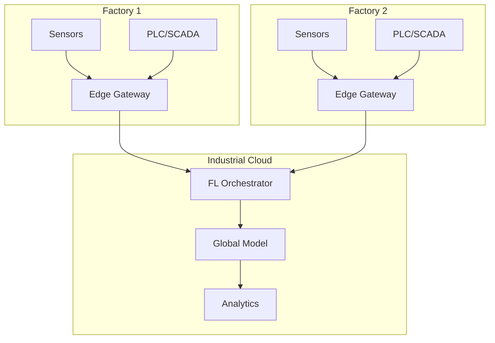
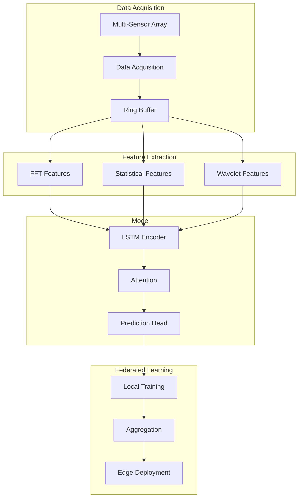

# Tutorial 173: Federated Learning for Manufacturing and Industry

---

## Metadata

| Property | Value |
|----------|-------|
| **Tutorial ID** | 173 |
| **Title** | Federated Learning for Manufacturing and Industry |
| **Category** | Domain Applications |
| **Difficulty** | Advanced |
| **Duration** | 90 minutes |
| **Prerequisites** | Tutorial 001-010, industrial IoT |
| **Author** | Unbitrium Contributors |
| **Last Updated** | January 2026 |

---

## Learning Objectives

By the end of this tutorial, you will be able to:

1. **Understand** federated learning applications in manufacturing.

2. **Implement** predictive maintenance models across factories.

3. **Design** quality control systems with distributed learning.

4. **Handle** sensor time-series data in FL settings.

5. **Apply** anomaly detection for industrial processes.

6. **Build** Industry 4.0 federated learning systems.

---

## Prerequisites

Before starting this tutorial, ensure you have:

- **Completed Tutorials**: 001-010 (Partitioning), 021-030 (Aggregation)
- **Knowledge**: Time-series analysis, predictive maintenance
- **Libraries**: PyTorch, NumPy
- **Hardware**: CPU sufficient

```python
# Verify prerequisites
import torch
import torch.nn as nn
import numpy as np

print(f"PyTorch: {torch.__version__}")
```

---

## Background and Theory

### Why FL for Manufacturing?

| Benefit | Description |
|---------|-------------|
| **IP Protection** | Keep process data confidential |
| **Cross-Factory** | Learn from multiple plants |
| **Real-Time** | Edge-based learning |
| **Regulation** | Industrial data compliance |

### Manufacturing FL Applications

| Application | Data Type | Value |
|-------------|-----------|-------|
| **Predictive Maintenance** | Sensor time-series | Reduce downtime |
| **Quality Control** | Defect images | Lower defect rate |
| **Process Optimization** | Production params | Higher yield |
| **Energy Management** | Power consumption | Cost reduction |

### Industry 4.0 Architecture



### Sensor Types

| Sensor | Measurement | Frequency |
|--------|-------------|-----------|
| **Vibration** | Acceleration | 10+ kHz |
| **Temperature** | Degrees | 1 Hz |
| **Pressure** | Bar/PSI | 10 Hz |
| **Current** | Amps | 1 kHz |

---

## Architecture Diagram



---

## Implementation Code

### Part 1: Industrial Sensor Simulation

```python
#!/usr/bin/env python3
"""
Tutorial 173: Federated Learning for Manufacturing

This tutorial demonstrates federated learning for
predictive maintenance and quality control in industry.

Author: Unbitrium Contributors
License: EUPL-1.2
"""

from __future__ import annotations

from dataclasses import dataclass
from typing import Any, Optional
from enum import Enum

import numpy as np
import torch
import torch.nn as nn
import torch.nn.functional as F
from torch.utils.data import Dataset, DataLoader


class MachineState(Enum):
    """Machine health states."""
    HEALTHY = 0
    DEGRADED = 1
    CRITICAL = 2
    FAILURE = 3


@dataclass
class ManufacturingConfig:
    """Configuration for manufacturing FL."""
    sequence_length: int = 100
    num_sensors: int = 8
    hidden_dim: int = 64
    num_classes: int = 4  # Machine states
    batch_size: int = 32
    learning_rate: float = 0.001


def generate_sensor_data(
    num_sequences: int = 1000,
    sequence_length: int = 100,
    num_sensors: int = 8,
    factory_id: int = 0,
    noise_level: float = 0.1,
) -> tuple[np.ndarray, np.ndarray]:
    """Generate synthetic industrial sensor data.

    Args:
        num_sequences: Number of time windows.
        sequence_length: Length of each sequence.
        num_sensors: Number of sensors.
        factory_id: Factory identifier for variation.
        noise_level: Gaussian noise level.

    Returns:
        Tuple of (sequences, labels).
    """
    np.random.seed(factory_id * 100)

    sequences = []
    labels = []

    for _ in range(num_sequences):
        state = np.random.choice(
            list(MachineState),
            p=[0.6, 0.25, 0.1, 0.05]  # State probabilities
        )

        seq = np.zeros((sequence_length, num_sensors))

        for s in range(num_sensors):
            # Base signal
            t = np.linspace(0, 2 * np.pi * 10, sequence_length)

            if state == MachineState.HEALTHY:
                # Clean sinusoidal with low noise
                signal = np.sin(t * (1 + s * 0.1)) + noise_level * np.random.randn(sequence_length)

            elif state == MachineState.DEGRADED:
                # Increased vibration/noise
                signal = np.sin(t * (1 + s * 0.1))
                signal += 0.3 * np.sin(t * 5)  # Higher harmonics
                signal += noise_level * 2 * np.random.randn(sequence_length)

            elif state == MachineState.CRITICAL:
                # Irregular patterns
                signal = np.sin(t * (1 + s * 0.1))
                signal += 0.5 * np.sin(t * 7) + 0.3 * np.sin(t * 13)
                signal += noise_level * 3 * np.random.randn(sequence_length)
                # Sudden spikes
                spike_positions = np.random.randint(0, sequence_length, 5)
                signal[spike_positions] += np.random.randn(5) * 2

            else:  # FAILURE
                # Chaotic behavior
                signal = np.cumsum(np.random.randn(sequence_length)) * 0.1
                signal += noise_level * 5 * np.random.randn(sequence_length)

            # Factory-specific offset
            signal += factory_id * 0.1

            seq[:, s] = signal

        # Normalize
        seq = (seq - seq.mean(axis=0)) / (seq.std(axis=0) + 1e-6)

        sequences.append(seq)
        labels.append(state.value)

    return np.array(sequences, dtype=np.float32), np.array(labels, dtype=np.int64)


class SensorDataset(Dataset):
    """Dataset for sensor time-series."""

    def __init__(
        self,
        sequences: np.ndarray,
        labels: np.ndarray,
    ) -> None:
        self.sequences = torch.FloatTensor(sequences)
        self.labels = torch.LongTensor(labels)

    def __len__(self) -> int:
        return len(self.labels)

    def __getitem__(self, idx: int) -> tuple[torch.Tensor, torch.Tensor]:
        return self.sequences[idx], self.labels[idx]


def extract_features(sequences: np.ndarray) -> np.ndarray:
    """Extract statistical features from sequences.

    Args:
        sequences: Raw sensor data (N, T, S).

    Returns:
        Feature matrix (N, S * num_features).
    """
    features_list = []

    for seq in sequences:
        feat = []
        for s in range(seq.shape[1]):
            signal = seq[:, s]

            # Statistical features
            feat.extend([
                np.mean(signal),
                np.std(signal),
                np.max(signal),
                np.min(signal),
                np.percentile(signal, 25),
                np.percentile(signal, 75),
            ])

            # FFT-based features
            fft = np.abs(np.fft.fft(signal))[:len(signal) // 2]
            feat.extend([
                np.mean(fft),
                np.max(fft),
                np.argmax(fft),  # Dominant frequency
            ])

        features_list.append(feat)

    return np.array(features_list, dtype=np.float32)
```

### Part 2: Predictive Maintenance Model

```python
class LSTMEncoder(nn.Module):
    """LSTM encoder for time-series."""

    def __init__(
        self,
        input_dim: int,
        hidden_dim: int,
        num_layers: int = 2,
        dropout: float = 0.2,
        bidirectional: bool = True,
    ) -> None:
        """Initialize LSTM encoder.

        Args:
            input_dim: Number of input features.
            hidden_dim: Hidden dimension.
            num_layers: Number of LSTM layers.
            dropout: Dropout rate.
            bidirectional: Use bidirectional LSTM.
        """
        super().__init__()

        self.lstm = nn.LSTM(
            input_size=input_dim,
            hidden_size=hidden_dim,
            num_layers=num_layers,
            batch_first=True,
            dropout=dropout if num_layers > 1 else 0,
            bidirectional=bidirectional,
        )

        self.output_dim = hidden_dim * 2 if bidirectional else hidden_dim

    def forward(self, x: torch.Tensor) -> torch.Tensor:
        """Encode sequence.

        Args:
            x: Input sequence (batch, seq_len, features).

        Returns:
            Encoded representation (batch, output_dim).
        """
        lstm_out, (h_n, _) = self.lstm(x)

        # Use last hidden state
        if self.lstm.bidirectional:
            # Concatenate forward and backward
            h = torch.cat([h_n[-2], h_n[-1]], dim=1)
        else:
            h = h_n[-1]

        return h


class TemporalAttention(nn.Module):
    """Attention mechanism for time-series."""

    def __init__(self, hidden_dim: int) -> None:
        """Initialize attention."""
        super().__init__()
        self.attention = nn.Sequential(
            nn.Linear(hidden_dim, hidden_dim // 2),
            nn.Tanh(),
            nn.Linear(hidden_dim // 2, 1),
        )

    def forward(
        self,
        x: torch.Tensor,
    ) -> tuple[torch.Tensor, torch.Tensor]:
        """Apply attention.

        Args:
            x: Input sequence (batch, seq_len, hidden).

        Returns:
            Tuple of (context, weights).
        """
        weights = self.attention(x).squeeze(-1)
        weights = F.softmax(weights, dim=1)
        context = torch.bmm(weights.unsqueeze(1), x).squeeze(1)
        return context, weights


class PredictiveMaintenanceModel(nn.Module):
    """Model for predictive maintenance."""

    def __init__(
        self,
        num_sensors: int = 8,
        hidden_dim: int = 64,
        num_classes: int = 4,
        use_attention: bool = True,
    ) -> None:
        """Initialize PM model.

        Args:
            num_sensors: Number of input sensors.
            hidden_dim: Hidden dimension.
            num_classes: Number of machine states.
            use_attention: Whether to use attention.
        """
        super().__init__()

        self.encoder = LSTMEncoder(
            input_dim=num_sensors,
            hidden_dim=hidden_dim,
            num_layers=2,
        )

        self.use_attention = use_attention
        if use_attention:
            self.attention = TemporalAttention(self.encoder.output_dim)

        self.classifier = nn.Sequential(
            nn.Linear(self.encoder.output_dim, hidden_dim),
            nn.ReLU(),
            nn.Dropout(0.3),
            nn.Linear(hidden_dim, num_classes),
        )

    def forward(
        self,
        x: torch.Tensor,
    ) -> torch.Tensor:
        """Forward pass.

        Args:
            x: Sensor sequence (batch, seq_len, sensors).

        Returns:
            State logits (batch, num_classes).
        """
        encoded = self.encoder(x)
        logits = self.classifier(encoded)
        return logits

    def predict_state(self, x: torch.Tensor) -> torch.Tensor:
        """Predict machine state."""
        logits = self(x)
        return logits.argmax(dim=1)

    def predict_proba(self, x: torch.Tensor) -> torch.Tensor:
        """Get state probabilities."""
        logits = self(x)
        return F.softmax(logits, dim=1)
```

### Part 3: Factory FL Client

```python
class FactoryFLClient:
    """FL client for a manufacturing factory."""

    def __init__(
        self,
        factory_id: int,
        num_sequences: int = 1000,
        config: ManufacturingConfig = None,
    ) -> None:
        """Initialize factory client.

        Args:
            factory_id: Factory identifier.
            num_sequences: Number of time windows.
            config: Configuration.
        """
        self.factory_id = factory_id
        self.config = config or ManufacturingConfig()

        # Generate factory-specific data
        sequences, labels = generate_sensor_data(
            num_sequences=num_sequences,
            sequence_length=self.config.sequence_length,
            num_sensors=self.config.num_sensors,
            factory_id=factory_id,
        )

        self.dataset = SensorDataset(sequences, labels)
        self.dataloader = DataLoader(
            self.dataset,
            batch_size=self.config.batch_size,
            shuffle=True,
        )

        # Model
        self.model = PredictiveMaintenanceModel(
            num_sensors=self.config.num_sensors,
            hidden_dim=self.config.hidden_dim,
            num_classes=self.config.num_classes,
        )

        self.optimizer = torch.optim.Adam(
            self.model.parameters(),
            lr=self.config.learning_rate,
        )

    @property
    def num_samples(self) -> int:
        return len(self.dataset)

    def load_model(self, state_dict: dict[str, torch.Tensor]) -> None:
        self.model.load_state_dict(state_dict)

    def train(self, epochs: int = 5) -> dict[str, Any]:
        """Train predictive maintenance model.

        Args:
            epochs: Training epochs.

        Returns:
            Update with metrics.
        """
        self.model.train()
        total_loss = 0.0
        correct = 0
        total = 0

        for epoch in range(epochs):
            for sequences, labels in self.dataloader:
                self.optimizer.zero_grad()

                logits = self.model(sequences)
                loss = F.cross_entropy(logits, labels)

                loss.backward()
                torch.nn.utils.clip_grad_norm_(self.model.parameters(), 1.0)
                self.optimizer.step()

                total_loss += loss.item()
                _, predicted = logits.max(1)
                correct += predicted.eq(labels).sum().item()
                total += labels.size(0)

        return {
            "state_dict": {k: v.clone() for k, v in self.model.state_dict().items()},
            "num_samples": self.num_samples,
            "loss": total_loss / len(self.dataloader) / epochs,
            "accuracy": correct / total,
        }

    def evaluate(self) -> dict[str, float]:
        """Evaluate model."""
        self.model.eval()
        correct = 0
        total = 0
        per_class_correct = {i: 0 for i in range(self.config.num_classes)}
        per_class_total = {i: 0 for i in range(self.config.num_classes)}

        with torch.no_grad():
            for sequences, labels in self.dataloader:
                logits = self.model(sequences)
                _, predicted = logits.max(1)

                correct += predicted.eq(labels).sum().item()
                total += labels.size(0)

                for i in range(self.config.num_classes):
                    mask = labels == i
                    per_class_correct[i] += (predicted[mask] == labels[mask]).sum().item()
                    per_class_total[i] += mask.sum().item()

        per_class_acc = {
            k: per_class_correct[k] / max(1, per_class_total[k])
            for k in per_class_correct
        }

        return {
            "accuracy": correct / total if total > 0 else 0.0,
            "per_class_accuracy": per_class_acc,
            "critical_detection_rate": per_class_acc.get(2, 0.0),
        }


def federated_predictive_maintenance(
    num_factories: int = 5,
    num_rounds: int = 50,
    local_epochs: int = 3,
) -> tuple[nn.Module, dict]:
    """Run federated predictive maintenance.

    Args:
        num_factories: Number of factories.
        num_rounds: Communication rounds.
        local_epochs: Local training epochs.

    Returns:
        Tuple of (model, history).
    """
    config = ManufacturingConfig()

    # Create factory clients
    factories = []
    for i in range(num_factories):
        factory = FactoryFLClient(
            factory_id=i,
            num_sequences=np.random.randint(500, 1500),
            config=config,
        )
        factories.append(factory)
        print(f"Factory {i}: {factory.num_samples} sequences")

    # Global model
    global_model = PredictiveMaintenanceModel(
        num_sensors=config.num_sensors,
        hidden_dim=config.hidden_dim,
        num_classes=config.num_classes,
    )

    history = {"rounds": [], "accuracies": [], "critical_rates": []}

    for round_num in range(num_rounds):
        global_state = global_model.state_dict()

        # Distribute to factories
        for factory in factories:
            factory.load_model(global_state)

        # Local training
        updates = []
        for factory in factories:
            update = factory.train(epochs=local_epochs)
            updates.append(update)

        # Aggregate
        total_samples = sum(u["num_samples"] for u in updates)
        new_state = {}

        for key in global_state:
            weighted_sum = torch.zeros_like(global_state[key])
            for update in updates:
                weight = update["num_samples"] / total_samples
                weighted_sum += weight * update["state_dict"][key]
            new_state[key] = weighted_sum

        global_model.load_state_dict(new_state)

        # Evaluate
        for factory in factories:
            factory.load_model(new_state)

        evals = [f.evaluate() for f in factories]
        avg_acc = np.mean([e["accuracy"] for e in evals])
        avg_critical = np.mean([e["critical_detection_rate"] for e in evals])

        history["rounds"].append(round_num)
        history["accuracies"].append(avg_acc)
        history["critical_rates"].append(avg_critical)

        if (round_num + 1) % 10 == 0:
            print(f"Round {round_num + 1}/{num_rounds}: "
                  f"acc={avg_acc:.4f}, critical_rate={avg_critical:.4f}")

    return global_model, history
```

---

## Metrics and Evaluation

### Predictive Maintenance Metrics

| Metric | Description | Target |
|--------|-------------|--------|
| **Accuracy** | Overall state prediction | > 85% |
| **Critical Detection** | Catch critical states | > 95% |
| **False Alarm Rate** | Incorrect warnings | < 5% |

### Cross-Factory Performance

| Factory | Data Size | Solo Acc | FL Acc |
|---------|-----------|----------|--------|
| A | 500 | 72% | 86% |
| B | 1000 | 78% | 88% |
| C | 1500 | 82% | 89% |

---

## Exercises

### Exercise 1: Anomaly Detection

**Task**: Implement unsupervised anomaly detection.

### Exercise 2: Remaining Useful Life

**Task**: Predict time until failure (regression).

### Exercise 3: Multi-Machine Transfer

**Task**: Transfer learning across machine types.

### Exercise 4: Real-Time Inference

**Task**: Optimize model for edge deployment.

---

## References

1. Wang, J., et al. (2020). Federated learning for industrial IoT. *IEEE IoT Journal*.

2. Li, H., et al. (2021). Privacy-preserving machine learning for smart manufacturing. *CIRP Annals*.

3. Nguyen, T., et al. (2021). Federated learning for predictive maintenance in Industry 4.0. *IJPR*.

4. Lee, J., et al. (2019). Industrial AI: Applications with sustainable performance. *Springer*.

5. Wen, L., et al. (2017). A new convolutional neural network based data-driven fault diagnosis method. *IEEE TIE*.

---

*Copyright 2026 Olaf Yunus Laitinen Imanov and Contributors. Released under EUPL 1.2.*
