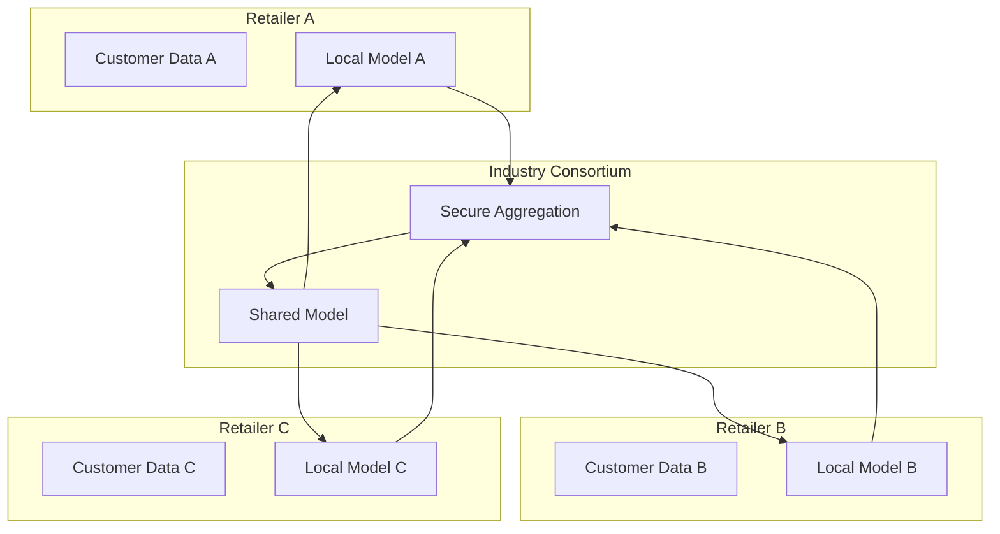
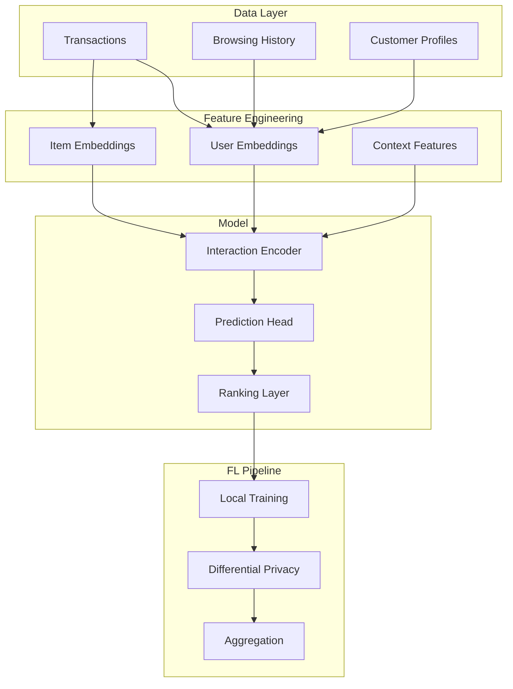

# Tutorial 174: Federated Learning for Retail and E-commerce

---

## Metadata

| Property | Value |
|----------|-------|
| **Tutorial ID** | 174 |
| **Title** | Federated Learning for Retail and E-commerce |
| **Category** | Domain Applications |
| **Difficulty** | Advanced |
| **Duration** | 90 minutes |
| **Prerequisites** | Tutorial 001-010, recommendation systems |
| **Author** | Unbitrium Contributors |
| **Last Updated** | January 2026 |

---

## Learning Objectives

By the end of this tutorial, you will be able to:

1. **Understand** federated learning applications in retail.

2. **Implement** privacy-preserving product recommendation.

3. **Design** cross-retailer demand forecasting systems.

4. **Handle** customer behavior data in FL settings.

5. **Apply** personalized pricing with differential privacy.

6. **Build** collaborative retail analytics platforms.

---

## Prerequisites

Before starting this tutorial, ensure you have:

- **Completed Tutorials**: 001-010 (Partitioning), 021-030 (Aggregation)
- **Knowledge**: Recommendation systems, demand forecasting
- **Libraries**: PyTorch, NumPy
- **Hardware**: CPU sufficient

```python
# Verify prerequisites
import torch
import torch.nn as nn
import numpy as np

print(f"PyTorch: {torch.__version__}")
```

---

## Background and Theory

### Why FL for Retail?

| Benefit | Description |
|---------|-------------|
| **Privacy** | Keep customer data private |
| **Collaboration** | Learn from industry patterns |
| **Personalization** | Better recommendations |
| **Compliance** | GDPR/CCPA ready |

### Retail FL Applications

| Application | Data Type | Value |
|-------------|-----------|-------|
| **Recommendations** | Purchase history | Higher conversion |
| **Demand Forecast** | Sales data | Inventory optimization |
| **Pricing** | Transaction data | Revenue optimization |
| **Churn Prediction** | Customer behavior | Retention |

### Multi-Retailer Architecture



### Recommendation Approaches

| Method | Model Type | FL Challenge |
|--------|------------|--------------|
| **Collaborative** | Matrix factorization | User overlaps |
| **Content-based** | Item features | Feature alignment |
| **Hybrid** | Combined | Complexity |
| **Sequential** | RNN/Transformer | Sequence privacy |

---

## Architecture Diagram



---

## Implementation Code

### Part 1: Retail Data Simulation

```python
#!/usr/bin/env python3
"""
Tutorial 174: Federated Learning for Retail

This tutorial demonstrates federated learning for
product recommendation and demand forecasting.

Author: Unbitrium Contributors
License: EUPL-1.2
"""

from __future__ import annotations

from dataclasses import dataclass
from typing import Any, Optional
from datetime import datetime, timedelta

import numpy as np
import torch
import torch.nn as nn
import torch.nn.functional as F
from torch.utils.data import Dataset, DataLoader


@dataclass
class RetailConfig:
    """Configuration for retail FL."""
    num_users: int = 1000
    num_items: int = 500
    embedding_dim: int = 64
    hidden_dim: int = 128
    num_classes: int = 5  # Rating 1-5
    batch_size: int = 128
    learning_rate: float = 0.001


def generate_retail_data(
    num_users: int = 1000,
    num_items: int = 500,
    num_interactions: int = 10000,
    retailer_id: int = 0,
) -> tuple[np.ndarray, np.ndarray, np.ndarray]:
    """Generate synthetic retail interaction data.

    Args:
        num_users: Number of users.
        num_items: Number of products.
        num_interactions: Number of interactions.
        retailer_id: Retailer identifier.

    Returns:
        Tuple of (user_ids, item_ids, ratings).
    """
    np.random.seed(retailer_id * 100)

    # User preferences (latent factors)
    user_factors = np.random.randn(num_users, 10)
    item_factors = np.random.randn(num_items, 10)

    # Retailer-specific item popularity
    item_popularity = np.random.power(0.3, num_items)
    item_popularity = item_popularity / item_popularity.sum()

    # User activity levels
    user_activity = np.random.power(0.5, num_users)
    user_activity = user_activity / user_activity.sum()

    user_ids = []
    item_ids = []
    ratings = []

    for _ in range(num_interactions):
        # Sample user and item
        user = np.random.choice(num_users, p=user_activity)
        item = np.random.choice(num_items, p=item_popularity)

        # Generate rating based on latent factors
        score = np.dot(user_factors[user], item_factors[item])
        # Add retailer bias
        score += retailer_id * 0.1
        # Convert to 1-5 rating
        rating = int(np.clip(score * 0.5 + 3, 1, 5))

        user_ids.append(user)
        item_ids.append(item)
        ratings.append(rating - 1)  # 0-indexed for classification

    return (
        np.array(user_ids, dtype=np.int64),
        np.array(item_ids, dtype=np.int64),
        np.array(ratings, dtype=np.int64),
    )


class RetailDataset(Dataset):
    """Dataset for retail interactions."""

    def __init__(
        self,
        user_ids: np.ndarray,
        item_ids: np.ndarray,
        ratings: np.ndarray,
    ) -> None:
        self.user_ids = torch.LongTensor(user_ids)
        self.item_ids = torch.LongTensor(item_ids)
        self.ratings = torch.LongTensor(ratings)

    def __len__(self) -> int:
        return len(self.ratings)

    def __getitem__(self, idx: int) -> tuple[torch.Tensor, torch.Tensor, torch.Tensor]:
        return self.user_ids[idx], self.item_ids[idx], self.ratings[idx]


def generate_demand_data(
    num_products: int = 100,
    num_days: int = 365,
    retailer_id: int = 0,
) -> tuple[np.ndarray, np.ndarray]:
    """Generate synthetic demand forecasting data.

    Args:
        num_products: Number of products.
        num_days: Number of days.
        retailer_id: Retailer identifier.

    Returns:
        Tuple of (features, demand).
    """
    np.random.seed(retailer_id * 200)

    features = []
    demand = []

    for _ in range(num_products):
        # Base demand
        base = np.random.randint(10, 100)

        for day in range(num_days):
            # Day of week effect
            dow = day % 7
            dow_effect = 1.2 if dow >= 5 else 1.0  # Weekend boost

            # Seasonality
            season_effect = 1 + 0.3 * np.sin(2 * np.pi * day / 365)

            # Trend
            trend = 1 + 0.0001 * day

            # Retailer effect
            retailer_effect = 1 + 0.1 * retailer_id

            # Calculate demand
            d = int(base * dow_effect * season_effect * trend * retailer_effect)
            d += np.random.randint(-5, 6)
            d = max(0, d)

            # Features
            feat = [
                dow / 7,
                day / 365,
                np.sin(2 * np.pi * day / 7),
                np.cos(2 * np.pi * day / 7),
                np.sin(2 * np.pi * day / 365),
                np.cos(2 * np.pi * day / 365),
                retailer_id / 10,
            ]

            features.append(feat)
            demand.append(d)

    return np.array(features, dtype=np.float32), np.array(demand, dtype=np.float32)
```

### Part 2: Recommendation Models

```python
class CollaborativeFilteringModel(nn.Module):
    """Neural collaborative filtering model."""

    def __init__(
        self,
        num_users: int,
        num_items: int,
        embedding_dim: int = 64,
        hidden_dim: int = 128,
        num_classes: int = 5,
    ) -> None:
        """Initialize NCF model.

        Args:
            num_users: Number of users.
            num_items: Number of items.
            embedding_dim: Embedding dimension.
            hidden_dim: Hidden layer dimension.
            num_classes: Number of rating classes.
        """
        super().__init__()

        self.user_embedding = nn.Embedding(num_users, embedding_dim)
        self.item_embedding = nn.Embedding(num_items, embedding_dim)

        self.mlp = nn.Sequential(
            nn.Linear(embedding_dim * 2, hidden_dim),
            nn.ReLU(),
            nn.Dropout(0.2),
            nn.Linear(hidden_dim, hidden_dim // 2),
            nn.ReLU(),
            nn.Dropout(0.2),
            nn.Linear(hidden_dim // 2, num_classes),
        )

    def forward(
        self,
        user_ids: torch.Tensor,
        item_ids: torch.Tensor,
    ) -> torch.Tensor:
        """Forward pass.

        Args:
            user_ids: User indices.
            item_ids: Item indices.

        Returns:
            Rating logits.
        """
        user_emb = self.user_embedding(user_ids)
        item_emb = self.item_embedding(item_ids)

        concat = torch.cat([user_emb, item_emb], dim=1)
        logits = self.mlp(concat)

        return logits

    def predict_rating(
        self,
        user_ids: torch.Tensor,
        item_ids: torch.Tensor,
    ) -> torch.Tensor:
        """Predict ratings."""
        logits = self(user_ids, item_ids)
        return logits.argmax(dim=1) + 1  # 1-5 rating


class DemandForecaster(nn.Module):
    """Neural network for demand forecasting."""

    def __init__(
        self,
        input_dim: int = 7,
        hidden_dim: int = 64,
        num_layers: int = 3,
    ) -> None:
        """Initialize demand forecaster.

        Args:
            input_dim: Input feature dimension.
            hidden_dim: Hidden layer dimension.
            num_layers: Number of hidden layers.
        """
        super().__init__()

        layers = []
        current_dim = input_dim

        for i in range(num_layers):
            layers.append(nn.Linear(current_dim, hidden_dim))
            layers.append(nn.ReLU())
            layers.append(nn.Dropout(0.1))
            current_dim = hidden_dim

        layers.append(nn.Linear(hidden_dim, 1))
        layers.append(nn.ReLU())  # Demand is non-negative

        self.net = nn.Sequential(*layers)

    def forward(self, x: torch.Tensor) -> torch.Tensor:
        """Predict demand."""
        return self.net(x).squeeze(-1)
```

### Part 3: Retail FL Client

```python
class RetailFLClient:
    """FL client for retail applications."""

    def __init__(
        self,
        retailer_id: int,
        num_interactions: int = 10000,
        config: RetailConfig = None,
        task: str = "recommendation",
    ) -> None:
        """Initialize retail client.

        Args:
            retailer_id: Retailer identifier.
            num_interactions: Number of interactions.
            config: Configuration.
            task: 'recommendation' or 'demand'.
        """
        self.retailer_id = retailer_id
        self.config = config or RetailConfig()
        self.task = task

        if task == "recommendation":
            user_ids, item_ids, ratings = generate_retail_data(
                num_users=self.config.num_users,
                num_items=self.config.num_items,
                num_interactions=num_interactions,
                retailer_id=retailer_id,
            )
            self.dataset = RetailDataset(user_ids, item_ids, ratings)

            self.model = CollaborativeFilteringModel(
                num_users=self.config.num_users,
                num_items=self.config.num_items,
                embedding_dim=self.config.embedding_dim,
                hidden_dim=self.config.hidden_dim,
                num_classes=self.config.num_classes,
            )
        else:
            features, demand = generate_demand_data(
                num_products=100,
                num_days=365,
                retailer_id=retailer_id,
            )
            self.dataset = torch.utils.data.TensorDataset(
                torch.FloatTensor(features),
                torch.FloatTensor(demand),
            )

            self.model = DemandForecaster(
                input_dim=7,
                hidden_dim=self.config.hidden_dim,
            )

        self.dataloader = DataLoader(
            self.dataset,
            batch_size=self.config.batch_size,
            shuffle=True,
        )

        self.optimizer = torch.optim.Adam(
            self.model.parameters(),
            lr=self.config.learning_rate,
        )

    @property
    def num_samples(self) -> int:
        return len(self.dataset)

    def load_model(self, state_dict: dict[str, torch.Tensor]) -> None:
        self.model.load_state_dict(state_dict)

    def train(self, epochs: int = 5) -> dict[str, Any]:
        """Train model.

        Args:
            epochs: Training epochs.

        Returns:
            Update with metrics.
        """
        self.model.train()
        total_loss = 0.0

        for epoch in range(epochs):
            for batch in self.dataloader:
                self.optimizer.zero_grad()

                if self.task == "recommendation":
                    user_ids, item_ids, ratings = batch
                    logits = self.model(user_ids, item_ids)
                    loss = F.cross_entropy(logits, ratings)
                else:
                    features, demand = batch
                    predictions = self.model(features)
                    loss = F.mse_loss(predictions, demand)

                loss.backward()
                torch.nn.utils.clip_grad_norm_(self.model.parameters(), 1.0)
                self.optimizer.step()

                total_loss += loss.item()

        return {
            "state_dict": {k: v.clone() for k, v in self.model.state_dict().items()},
            "num_samples": self.num_samples,
            "loss": total_loss / len(self.dataloader) / epochs,
        }

    def evaluate(self) -> dict[str, float]:
        """Evaluate model."""
        self.model.eval()

        if self.task == "recommendation":
            correct = 0
            total = 0

            with torch.no_grad():
                for batch in self.dataloader:
                    user_ids, item_ids, ratings = batch
                    logits = self.model(user_ids, item_ids)
                    _, predicted = logits.max(1)
                    correct += predicted.eq(ratings).sum().item()
                    total += ratings.size(0)

            return {"accuracy": correct / total if total > 0 else 0.0}
        else:
            total_mape = 0.0
            count = 0

            with torch.no_grad():
                for batch in self.dataloader:
                    features, demand = batch
                    predictions = self.model(features)
                    mape = torch.abs((predictions - demand) / (demand + 1)).mean()
                    total_mape += mape.item()
                    count += 1

            return {"mape": total_mape / count if count > 0 else 0.0}


def federated_retail_learning(
    num_retailers: int = 5,
    num_rounds: int = 50,
    local_epochs: int = 3,
    task: str = "recommendation",
) -> tuple[nn.Module, dict]:
    """Run federated retail learning.

    Args:
        num_retailers: Number of retailers.
        num_rounds: Communication rounds.
        local_epochs: Local epochs.
        task: 'recommendation' or 'demand'.

    Returns:
        Tuple of (model, history).
    """
    config = RetailConfig()

    # Create retailer clients
    retailers = []
    for i in range(num_retailers):
        retailer = RetailFLClient(
            retailer_id=i,
            num_interactions=np.random.randint(5000, 15000),
            config=config,
            task=task,
        )
        retailers.append(retailer)
        print(f"Retailer {i}: {retailer.num_samples} samples")

    # Global model
    if task == "recommendation":
        global_model = CollaborativeFilteringModel(
            num_users=config.num_users,
            num_items=config.num_items,
            embedding_dim=config.embedding_dim,
            hidden_dim=config.hidden_dim,
            num_classes=config.num_classes,
        )
    else:
        global_model = DemandForecaster(
            input_dim=7,
            hidden_dim=config.hidden_dim,
        )

    history = {"rounds": [], "metrics": []}

    for round_num in range(num_rounds):
        global_state = global_model.state_dict()

        # Distribute to retailers
        for retailer in retailers:
            retailer.load_model(global_state)

        # Local training
        updates = []
        for retailer in retailers:
            update = retailer.train(epochs=local_epochs)
            updates.append(update)

        # Aggregate
        total_samples = sum(u["num_samples"] for u in updates)
        new_state = {}

        for key in global_state:
            weighted_sum = torch.zeros_like(global_state[key])
            for update in updates:
                weight = update["num_samples"] / total_samples
                weighted_sum += weight * update["state_dict"][key]
            new_state[key] = weighted_sum

        global_model.load_state_dict(new_state)

        # Evaluate
        for retailer in retailers:
            retailer.load_model(new_state)

        evals = [r.evaluate() for r in retailers]

        if task == "recommendation":
            metric_key = "accuracy"
        else:
            metric_key = "mape"

        avg_metric = np.mean([e[metric_key] for e in evals])

        history["rounds"].append(round_num)
        history["metrics"].append(avg_metric)

        if (round_num + 1) % 10 == 0:
            print(f"Round {round_num + 1}/{num_rounds}: {metric_key}={avg_metric:.4f}")

    return global_model, history
```

---

## Metrics and Evaluation

### Recommendation Metrics

| Metric | Description | Target |
|--------|-------------|--------|
| **Accuracy** | Rating prediction | > 40% |
| **NDCG** | Ranking quality | > 0.8 |
| **Hit Rate** | Top-K accuracy | > 0.7 |

### Demand Forecasting Metrics

| Metric | Description | Target |
|--------|-------------|--------|
| **MAPE** | Percentage error | < 15% |
| **MAE** | Absolute error | Lower |
| **RMSE** | Root mean squared | Lower |

---

## Exercises

### Exercise 1: Sequential Recommendations

**Task**: Add sequence modeling for session-based recommendations.

### Exercise 2: Cross-Domain Transfer

**Task**: Transfer embeddings across product categories.

### Exercise 3: Dynamic Pricing

**Task**: Implement federated pricing optimization.

### Exercise 4: Inventory Optimization

**Task**: Combine demand forecast with inventory control.

---

## References

1. Muhammad, F., et al. (2020). FedRec: Federated recommendation systems. In *RecSys*.

2. Perifanis, V., & Efraimidis, P. (2022). FL for ranking browser history suggestions. In *ECIR*.

3. Jalalirad, A., et al. (2019). A simple and efficient federated recommender system. *arXiv*.

4. Wu, Q., et al. (2021). Hierarchical personalization for FL. In *KDD*.

5. Qi, T., et al. (2020). Privacy-preserving news recommendation model training via FL. In *EMNLP*.

---

*Copyright 2026 Olaf Yunus Laitinen Imanov and Contributors. Released under EUPL 1.2.*
