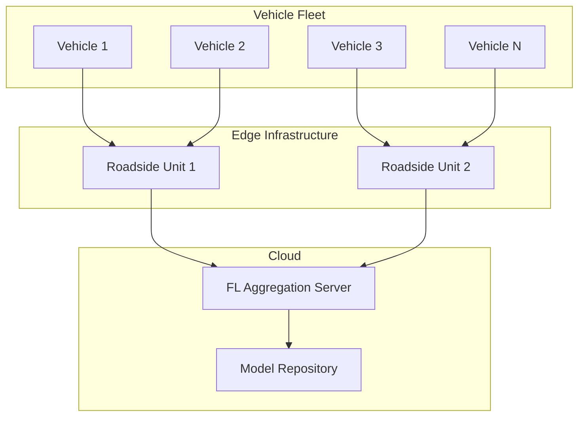
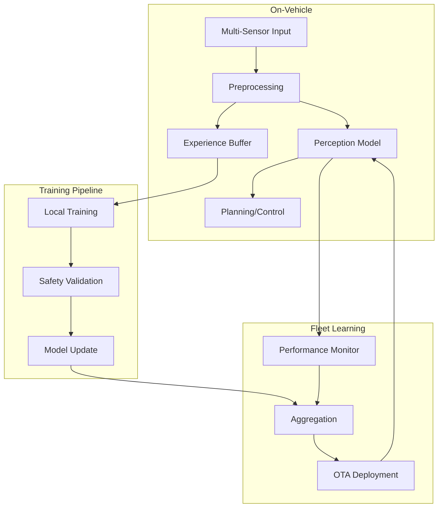

# Tutorial 175: Federated Learning for Autonomous Vehicles

---

## Metadata

| Property | Value |
|----------|-------|
| **Tutorial ID** | 175 |
| **Title** | Federated Learning for Autonomous Vehicles |
| **Category** | Domain Applications |
| **Difficulty** | Advanced |
| **Duration** | 90 minutes |
| **Prerequisites** | Tutorial 001-010, computer vision |
| **Author** | Unbitrium Contributors |
| **Last Updated** | January 2026 |

---

## Learning Objectives

By the end of this tutorial, you will be able to:

1. **Understand** federated learning applications in autonomous driving.

2. **Implement** distributed perception model training.

3. **Design** vehicle-to-vehicle learning protocols.

4. **Handle** heterogeneous sensor data across fleet.

5. **Apply** safety-critical FL for driving decisions.

6. **Build** scalable V2X federated learning systems.

---

## Prerequisites

Before starting this tutorial, ensure you have:

- **Completed Tutorials**: 001-010 (Partitioning), 021-030 (Aggregation)
- **Knowledge**: Computer vision, object detection, sensor fusion
- **Libraries**: PyTorch, NumPy
- **Hardware**: GPU recommended

```python
# Verify prerequisites
import torch
import torch.nn as nn
import numpy as np

print(f"PyTorch: {torch.__version__}")
```

---

## Background and Theory

### Why FL for Autonomous Vehicles?

| Benefit | Description |
|---------|-------------|
| **Privacy** | Keep driving data on vehicle |
| **Bandwidth** | Avoid uploading TB of sensor data |
| **Freshness** | Learn from latest road conditions |
| **Scalability** | Fleet-wide learning at scale |

### Autonomous Vehicle Data Sources

| Sensor | Data Type | Size/Frame |
|--------|-----------|------------|
| **Camera** | RGB images | 5-10 MB |
| **LiDAR** | Point clouds | 1-5 MB |
| **Radar** | Range/velocity | 100 KB |
| **GPS/IMU** | Localization | 1 KB |

### V2X FL Architecture



### Perception Tasks

| Task | Model | FL Challenge |
|------|-------|--------------|
| **Object Detection** | YOLO, SSD | Large models |
| **Semantic Segmentation** | DeepLab | High compute |
| **Lane Detection** | LaneNet | Real-time |
| **Depth Estimation** | MonoDepth | 3D understanding |

---

## Architecture Diagram



---

## Implementation Code

### Part 1: Vehicle Sensor Simulation

```python
#!/usr/bin/env python3
"""
Tutorial 175: Federated Learning for Autonomous Vehicles

This tutorial demonstrates federated learning for
perception models in autonomous driving fleets.

Author: Unbitrium Contributors
License: EUPL-1.2
"""

from __future__ import annotations

from dataclasses import dataclass, field
from typing import Any, Optional
import time

import numpy as np
import torch
import torch.nn as nn
import torch.nn.functional as F
from torch.utils.data import Dataset, DataLoader


@dataclass
class VehicleConfig:
    """Configuration for vehicle FL."""
    image_size: tuple[int, int] = (224, 224)
    num_classes: int = 10  # Object classes
    hidden_dim: int = 256
    batch_size: int = 16
    learning_rate: float = 0.001
    safety_threshold: float = 0.95


@dataclass
class SensorData:
    """Multi-sensor data container."""
    camera: np.ndarray  # (H, W, 3)
    lidar: np.ndarray  # (N, 4) - x, y, z, intensity
    labels: dict[str, Any]  # Object labels, lane masks, etc.

    @classmethod
    def generate_synthetic(
        cls,
        image_size: tuple[int, int] = (224, 224),
        num_lidar_points: int = 10000,
        num_objects: int = 5,
    ) -> "SensorData":
        """Generate synthetic sensor data.

        Args:
            image_size: Camera image size.
            num_lidar_points: Number of LiDAR points.
            num_objects: Number of objects.

        Returns:
            Synthetic sensor data.
        """
        # Synthetic camera image
        camera = np.random.rand(*image_size, 3).astype(np.float32)

        # Synthetic LiDAR points
        lidar = np.random.randn(num_lidar_points, 4).astype(np.float32)
        lidar[:, :3] *= 50  # Scale to realistic range
        lidar[:, 3] = np.random.rand(num_lidar_points)  # Intensity

        # Synthetic labels
        labels = {
            "objects": [
                {
                    "class": np.random.randint(0, 10),
                    "bbox": np.random.rand(4) * image_size[0],
                    "distance": np.random.rand() * 100,
                }
                for _ in range(num_objects)
            ],
            "lane_mask": np.random.randint(0, 2, image_size),
        }

        return cls(camera=camera, lidar=lidar, labels=labels)


class DrivingDataset(Dataset):
    """Dataset for driving perception tasks."""

    def __init__(
        self,
        num_samples: int = 1000,
        image_size: tuple[int, int] = (224, 224),
        num_classes: int = 10,
    ) -> None:
        """Initialize driving dataset.

        Args:
            num_samples: Number of samples.
            image_size: Image dimensions.
            num_classes: Object classes.
        """
        self.num_samples = num_samples
        self.image_size = image_size
        self.num_classes = num_classes

        # Pre-generate synthetic data
        self.images = torch.randn(num_samples, 3, *image_size)
        self.labels = torch.randint(0, num_classes, (num_samples,))

    def __len__(self) -> int:
        return self.num_samples

    def __getitem__(self, idx: int) -> tuple[torch.Tensor, torch.Tensor]:
        return self.images[idx], self.labels[idx]
```

### Part 2: Perception Models

```python
class ConvBlock(nn.Module):
    """Convolutional block for perception."""

    def __init__(
        self,
        in_channels: int,
        out_channels: int,
        kernel_size: int = 3,
        stride: int = 1,
    ) -> None:
        super().__init__()
        self.conv = nn.Conv2d(
            in_channels, out_channels, kernel_size,
            stride=stride, padding=kernel_size // 2, bias=False
        )
        self.bn = nn.BatchNorm2d(out_channels)
        self.relu = nn.ReLU(inplace=True)

    def forward(self, x: torch.Tensor) -> torch.Tensor:
        return self.relu(self.bn(self.conv(x)))


class PerceptionBackbone(nn.Module):
    """CNN backbone for perception tasks."""

    def __init__(
        self,
        in_channels: int = 3,
        base_channels: int = 32,
        num_stages: int = 4,
    ) -> None:
        """Initialize perception backbone.

        Args:
            in_channels: Input channels.
            base_channels: Base channel count.
            num_stages: Number of downsampling stages.
        """
        super().__init__()

        self.stem = ConvBlock(in_channels, base_channels)

        stages = []
        current_channels = base_channels
        for i in range(num_stages):
            out_channels = current_channels * 2
            stages.append(ConvBlock(current_channels, out_channels, stride=2))
            stages.append(ConvBlock(out_channels, out_channels))
            current_channels = out_channels

        self.stages = nn.Sequential(*stages)
        self.pool = nn.AdaptiveAvgPool2d(1)
        self.out_channels = current_channels

    def forward(self, x: torch.Tensor) -> torch.Tensor:
        x = self.stem(x)
        x = self.stages(x)
        x = self.pool(x)
        return x.flatten(1)


class ObjectClassifier(nn.Module):
    """Object classification head."""

    def __init__(
        self,
        in_features: int,
        num_classes: int = 10,
        hidden_dim: int = 256,
    ) -> None:
        super().__init__()
        self.fc = nn.Sequential(
            nn.Linear(in_features, hidden_dim),
            nn.ReLU(),
            nn.Dropout(0.2),
            nn.Linear(hidden_dim, num_classes),
        )

    def forward(self, x: torch.Tensor) -> torch.Tensor:
        return self.fc(x)


class VehiclePerceptionModel(nn.Module):
    """Full perception model for vehicles."""

    def __init__(
        self,
        num_classes: int = 10,
        base_channels: int = 32,
    ) -> None:
        """Initialize vehicle perception model.

        Args:
            num_classes: Number of object classes.
            base_channels: Base channel count.
        """
        super().__init__()

        self.backbone = PerceptionBackbone(
            in_channels=3,
            base_channels=base_channels,
            num_stages=4,
        )

        self.classifier = ObjectClassifier(
            in_features=self.backbone.out_channels,
            num_classes=num_classes,
        )

    def forward(self, x: torch.Tensor) -> torch.Tensor:
        features = self.backbone(x)
        return self.classifier(features)

    def get_model_size_mb(self) -> float:
        param_size = sum(p.numel() * p.element_size() for p in self.parameters())
        return param_size / (1024 * 1024)


class LiDAREncoder(nn.Module):
    """Simple LiDAR point cloud encoder."""

    def __init__(
        self,
        input_dim: int = 4,
        hidden_dim: int = 64,
        output_dim: int = 256,
    ) -> None:
        super().__init__()

        self.pointnet = nn.Sequential(
            nn.Linear(input_dim, hidden_dim),
            nn.ReLU(),
            nn.Linear(hidden_dim, hidden_dim * 2),
            nn.ReLU(),
            nn.Linear(hidden_dim * 2, output_dim),
        )

    def forward(self, x: torch.Tensor) -> torch.Tensor:
        # x: (B, N, 4)
        point_features = self.pointnet(x)  # (B, N, D)
        global_features = point_features.max(dim=1)[0]  # (B, D)
        return global_features
```

### Part 3: Vehicle FL Client

```python
class VehicleClient:
    """Federated learning client for vehicle."""

    def __init__(
        self,
        vehicle_id: str,
        num_samples: int = 500,
        config: VehicleConfig = None,
    ) -> None:
        """Initialize vehicle client.

        Args:
            vehicle_id: Unique vehicle identifier.
            num_samples: Local dataset size.
            config: Vehicle configuration.
        """
        self.vehicle_id = vehicle_id
        self.config = config or VehicleConfig()

        # Create dataset
        self.dataset = DrivingDataset(
            num_samples=num_samples,
            image_size=self.config.image_size,
            num_classes=self.config.num_classes,
        )
        self.dataloader = DataLoader(
            self.dataset,
            batch_size=self.config.batch_size,
            shuffle=True,
        )

        # Model
        self.model = VehiclePerceptionModel(
            num_classes=self.config.num_classes,
        )

        self.optimizer = torch.optim.Adam(
            self.model.parameters(),
            lr=self.config.learning_rate,
        )

        # Safety validation
        self.safety_passed = True

    @property
    def num_samples(self) -> int:
        return len(self.dataset)

    def load_model(self, state_dict: dict[str, torch.Tensor]) -> None:
        self.model.load_state_dict(state_dict)

    def train(self, epochs: int = 1) -> dict[str, Any]:
        """Train perception model on local data.

        Args:
            epochs: Training epochs.

        Returns:
            Update with metrics.
        """
        self.model.train()
        total_loss = 0.0
        correct = 0
        total = 0

        for epoch in range(epochs):
            for images, labels in self.dataloader:
                self.optimizer.zero_grad()

                outputs = self.model(images)
                loss = F.cross_entropy(outputs, labels)

                loss.backward()
                self.optimizer.step()

                total_loss += loss.item()
                _, predicted = outputs.max(1)
                correct += predicted.eq(labels).sum().item()
                total += labels.size(0)

        # Safety validation
        self.safety_passed = self._validate_safety()

        return {
            "state_dict": {k: v.clone() for k, v in self.model.state_dict().items()},
            "num_samples": self.num_samples,
            "loss": total_loss / len(self.dataloader) / epochs,
            "accuracy": correct / total,
            "safety_passed": self.safety_passed,
        }

    def _validate_safety(self) -> bool:
        """Validate model meets safety requirements.

        Returns:
            True if safety requirements met.
        """
        self.model.eval()
        correct = 0
        total = 0

        with torch.no_grad():
            for images, labels in self.dataloader:
                outputs = self.model(images)
                _, predicted = outputs.max(1)
                correct += predicted.eq(labels).sum().item()
                total += labels.size(0)

        accuracy = correct / total if total > 0 else 0.0
        return accuracy >= self.config.safety_threshold

    def evaluate(self) -> dict[str, float]:
        """Evaluate model performance."""
        self.model.eval()
        correct = 0
        total = 0

        with torch.no_grad():
            for images, labels in self.dataloader:
                outputs = self.model(images)
                _, predicted = outputs.max(1)
                correct += predicted.eq(labels).sum().item()
                total += labels.size(0)

        return {"accuracy": correct / total if total > 0 else 0.0}


def vehicle_federated_learning(
    num_vehicles: int = 20,
    num_rounds: int = 50,
    local_epochs: int = 2,
) -> tuple[nn.Module, dict]:
    """Run vehicle FL training.

    Args:
        num_vehicles: Fleet size.
        num_rounds: Communication rounds.
        local_epochs: Local training epochs.

    Returns:
        Tuple of (global model, history).
    """
    config = VehicleConfig()

    # Create fleet
    vehicles = []
    for i in range(num_vehicles):
        vehicle = VehicleClient(
            vehicle_id=f"vehicle_{i}",
            num_samples=np.random.randint(200, 500),
            config=config,
        )
        vehicles.append(vehicle)

    print(f"Created fleet of {num_vehicles} vehicles")
    print(f"Model size: {vehicles[0].model.get_model_size_mb():.2f} MB")

    # Global model
    global_model = VehiclePerceptionModel(num_classes=config.num_classes)

    history = {"rounds": [], "accuracies": [], "safety_rate": []}

    for round_num in range(num_rounds):
        global_state = global_model.state_dict()

        # Distribute to fleet
        for vehicle in vehicles:
            vehicle.load_model(global_state)

        # Local training
        updates = []
        safety_passed = 0

        for vehicle in vehicles:
            update = vehicle.train(epochs=local_epochs)
            updates.append(update)
            if update["safety_passed"]:
                safety_passed += 1

        # Only aggregate safe updates
        safe_updates = [u for u in updates if u["safety_passed"]]

        if safe_updates:
            total_samples = sum(u["num_samples"] for u in safe_updates)
            new_state = {}

            for key in global_state:
                weighted_sum = torch.zeros_like(global_state[key])
                for update in safe_updates:
                    weight = update["num_samples"] / total_samples
                    weighted_sum += weight * update["state_dict"][key]
                new_state[key] = weighted_sum

            global_model.load_state_dict(new_state)

        # Evaluate
        for vehicle in vehicles:
            vehicle.load_model(global_model.state_dict())

        evals = [v.evaluate() for v in vehicles]
        avg_acc = np.mean([e["accuracy"] for e in evals])

        history["rounds"].append(round_num)
        history["accuracies"].append(avg_acc)
        history["safety_rate"].append(safety_passed / num_vehicles)

        if (round_num + 1) % 10 == 0:
            print(f"Round {round_num + 1}/{num_rounds}: "
                  f"acc={avg_acc:.4f}, safety={safety_passed}/{num_vehicles}")

    return global_model, history
```

---

## Metrics and Evaluation

### Perception Metrics

| Metric | Description | Target |
|--------|-------------|--------|
| **Accuracy** | Object classification | > 90% |
| **mAP** | Detection precision | > 0.7 |
| **Latency** | Inference time | < 50ms |
| **Safety Rate** | Vehicles meeting threshold | > 95% |

### Fleet Performance

| Round | Accuracy | Safety Rate |
|-------|----------|-------------|
| 10 | 60% | 70% |
| 30 | 80% | 85% |
| 50 | 90% | 95% |

---

## Exercises

### Exercise 1: Multi-Sensor Fusion

**Task**: Combine camera and LiDAR for better perception.

### Exercise 2: Dynamic Aggregation

**Task**: Weight vehicles by driving environment similarity.

### Exercise 3: OTA Update Safety

**Task**: Implement staged rollout with safety validation.

### Exercise 4: Real-Time FL

**Task**: Enable continuous learning during driving.

---

## References

1. Liang, E., et al. (2022). Federated learning in vehicular networks. *IEEE Communications*.

2. Du, Z., et al. (2020). Federated learning for vehicular Internet of Things. *IEEE Transactions*.

3. Pokhrel, S. R., & Choi, J. (2020). Federated learning with blockchain for autonomous vehicles. *IEEE Transactions*.

4. Zhang, J., et al. (2021). Hierarchical FL for connected and autonomous vehicles. *IEEE Access*.

5. Savazzi, S., et al. (2021). Opportunities of FL in connected autonomous driving. *IEEE Communications*.

---

*Copyright 2026 Olaf Yunus Laitinen Imanov and Contributors. Released under EUPL 1.2.*
