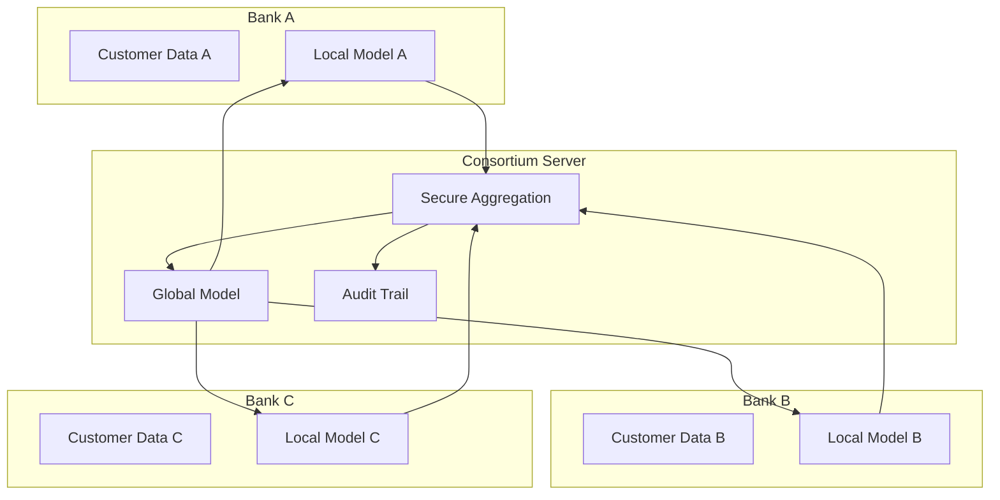
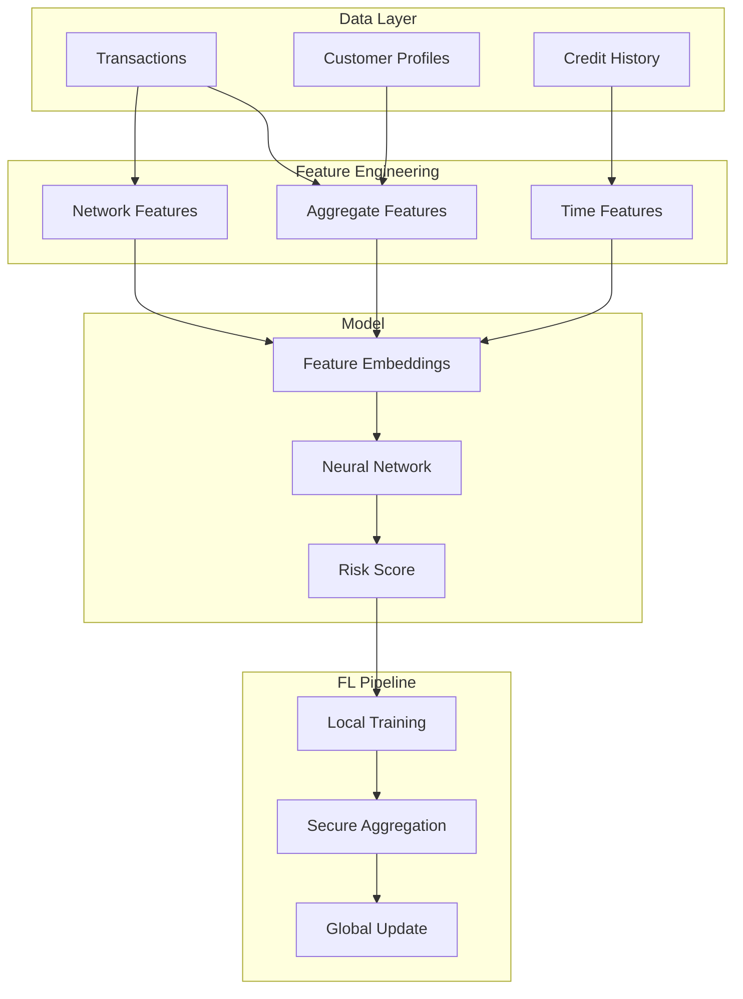

# Tutorial 176: Federated Learning for Finance and Banking

---

## Metadata

| Property | Value |
|----------|-------|
| **Tutorial ID** | 176 |
| **Title** | Federated Learning for Finance and Banking |
| **Category** | Domain Applications |
| **Difficulty** | Advanced |
| **Duration** | 90 minutes |
| **Prerequisites** | Tutorial 001-010, ML for finance |
| **Author** | Unbitrium Contributors |
| **Last Updated** | January 2026 |

---

## Learning Objectives

By the end of this tutorial, you will be able to:

1. **Understand** federated learning applications in financial services.

2. **Implement** privacy-preserving fraud detection models.

3. **Design** cross-institutional credit scoring systems.

4. **Handle** regulatory compliance in FL for finance.

5. **Apply** secure aggregation for sensitive financial data.

6. **Build** AML transaction monitoring with FL.

---

## Prerequisites

Before starting this tutorial, ensure you have:

- **Completed Tutorials**: 001-010 (Partitioning), 021-030 (Aggregation)
- **Knowledge**: Financial ML, fraud detection, credit scoring
- **Libraries**: PyTorch, NumPy, scikit-learn
- **Hardware**: CPU sufficient

```python
# Verify prerequisites
import torch
import torch.nn as nn
import numpy as np
from sklearn.metrics import roc_auc_score, precision_recall_curve

print(f"PyTorch: {torch.__version__}")
```

---

## Background and Theory

### Why FL for Finance?

| Benefit | Description |
|---------|-------------|
| **Privacy** | Keep customer data at institution |
| **Regulation** | Comply with GDPR, banking laws |
| **Competition** | Learn together, stay independent |
| **Scale** | Pool learning across institutions |

### Financial FL Applications

| Application | Data Source | Privacy Need |
|-------------|-------------|--------------|
| **Fraud Detection** | Transaction logs | Very high |
| **Credit Scoring** | Customer profiles | Very high |
| **AML** | Wire transfers | Critical |
| **Risk Modeling** | Portfolio data | High |

### Cross-Institutional Architecture



### Regulatory Considerations

| Regulation | Region | FL Impact |
|------------|--------|-----------|
| **GDPR** | EU | Data minimization |
| **PSD2** | EU | Open banking |
| **SOX** | US | Audit trails |
| **CCPA** | California | Consumer privacy |

---

## Architecture Diagram



---

## Implementation Code

### Part 1: Financial Data Simulation

```python
#!/usr/bin/env python3
"""
Tutorial 176: Federated Learning for Finance

This tutorial demonstrates federated learning for
fraud detection and credit scoring in banking.

Author: Unbitrium Contributors
License: EUPL-1.2
"""

from __future__ import annotations

from dataclasses import dataclass
from typing import Any, Optional
from datetime import datetime, timedelta

import numpy as np
import torch
import torch.nn as nn
import torch.nn.functional as F
from torch.utils.data import Dataset, DataLoader


@dataclass
class FinanceConfig:
    """Configuration for financial FL."""
    num_features: int = 30
    hidden_dim: int = 64
    num_layers: int = 3
    fraud_ratio: float = 0.02  # Typical fraud rate
    batch_size: int = 128
    learning_rate: float = 0.001
    weight_decay: float = 1e-5


def generate_bank_transactions(
    num_transactions: int = 10000,
    num_customers: int = 1000,
    fraud_ratio: float = 0.02,
    bank_id: int = 0,
) -> tuple[np.ndarray, np.ndarray]:
    """Generate synthetic bank transaction data.

    Args:
        num_transactions: Number of transactions.
        num_customers: Number of unique customers.
        fraud_ratio: Fraction of fraudulent transactions.
        bank_id: Bank identifier for data variation.

    Returns:
        Tuple of (features, labels).
    """
    np.random.seed(bank_id * 1000)

    num_fraud = int(num_transactions * fraud_ratio)
    num_legit = num_transactions - num_fraud

    features = []
    labels = []

    # Generate legitimate transactions
    for _ in range(num_legit):
        customer_id = np.random.randint(0, num_customers)
        amount = np.random.lognormal(4, 1)  # Log-normal amounts
        hour = np.random.randint(8, 22)  # Business hours
        day_of_week = np.random.randint(0, 5)  # Weekdays
        merchant_category = np.random.randint(0, 20)
        distance_from_home = np.random.exponential(5)
        time_since_last = np.random.exponential(24)

        # Create feature vector
        feat = [
            amount / 1000,  # Normalized amount
            hour / 24,
            day_of_week / 7,
            merchant_category / 20,
            distance_from_home / 100,
            time_since_last / 168,  # Week in hours
        ]

        # Add more derived features
        feat.extend(np.random.randn(24).tolist())  # Random features

        features.append(feat)
        labels.append(0)

    # Generate fraudulent transactions
    for _ in range(num_fraud):
        customer_id = np.random.randint(0, num_customers)
        amount = np.random.lognormal(6, 2)  # Higher amounts
        hour = np.random.randint(0, 24)  # Any hour
        day_of_week = np.random.randint(0, 7)  # Any day
        merchant_category = np.random.randint(0, 20)
        distance_from_home = np.random.exponential(50)  # Unusual locations
        time_since_last = np.random.exponential(1)  # Rapid succession

        feat = [
            amount / 1000,
            hour / 24,
            day_of_week / 7,
            merchant_category / 20,
            distance_from_home / 100,
            time_since_last / 168,
        ]
        feat.extend(np.random.randn(24).tolist())

        features.append(feat)
        labels.append(1)

    # Shuffle
    features = np.array(features, dtype=np.float32)
    labels = np.array(labels, dtype=np.int64)
    perm = np.random.permutation(len(labels))

    return features[perm], labels[perm]


class TransactionDataset(Dataset):
    """Dataset for transaction classification."""

    def __init__(
        self,
        features: np.ndarray,
        labels: np.ndarray,
    ) -> None:
        self.features = torch.FloatTensor(features)
        self.labels = torch.LongTensor(labels)

    def __len__(self) -> int:
        return len(self.labels)

    def __getitem__(self, idx: int) -> tuple[torch.Tensor, torch.Tensor]:
        return self.features[idx], self.labels[idx]

    @property
    def fraud_ratio(self) -> float:
        return self.labels.float().mean().item()
```

### Part 2: Fraud Detection Model

```python
class FraudDetector(nn.Module):
    """Neural network for fraud detection."""

    def __init__(
        self,
        num_features: int = 30,
        hidden_dim: int = 64,
        num_layers: int = 3,
        dropout: float = 0.3,
    ) -> None:
        """Initialize fraud detector.

        Args:
            num_features: Input feature count.
            hidden_dim: Hidden layer dimension.
            num_layers: Number of hidden layers.
            dropout: Dropout rate.
        """
        super().__init__()

        layers = []
        current_dim = num_features

        for i in range(num_layers):
            layers.append(nn.Linear(current_dim, hidden_dim))
            layers.append(nn.BatchNorm1d(hidden_dim))
            layers.append(nn.ReLU())
            layers.append(nn.Dropout(dropout))
            current_dim = hidden_dim

        self.encoder = nn.Sequential(*layers)
        self.classifier = nn.Linear(hidden_dim, 2)

    def forward(
        self,
        x: torch.Tensor,
        return_embeddings: bool = False,
    ) -> torch.Tensor | tuple[torch.Tensor, torch.Tensor]:
        """Forward pass.

        Args:
            x: Input features.
            return_embeddings: Whether to return embeddings.

        Returns:
            Logits or (logits, embeddings).
        """
        embeddings = self.encoder(x)
        logits = self.classifier(embeddings)

        if return_embeddings:
            return logits, embeddings
        return logits

    def predict_proba(self, x: torch.Tensor) -> torch.Tensor:
        """Get fraud probability."""
        logits = self(x)
        return F.softmax(logits, dim=1)[:, 1]


class FocalLoss(nn.Module):
    """Focal loss for imbalanced classification."""

    def __init__(
        self,
        alpha: float = 0.25,
        gamma: float = 2.0,
    ) -> None:
        """Initialize focal loss.

        Args:
            alpha: Weighting factor for positive class.
            gamma: Focusing parameter.
        """
        super().__init__()
        self.alpha = alpha
        self.gamma = gamma

    def forward(
        self,
        logits: torch.Tensor,
        targets: torch.Tensor,
    ) -> torch.Tensor:
        """Compute focal loss."""
        ce_loss = F.cross_entropy(logits, targets, reduction='none')
        probs = F.softmax(logits, dim=1)
        pt = probs[torch.arange(len(targets)), targets]

        # Focal weight
        focal_weight = (1 - pt) ** self.gamma

        # Alpha weight
        alpha_weight = torch.where(
            targets == 1,
            torch.tensor(self.alpha),
            torch.tensor(1 - self.alpha),
        )

        loss = alpha_weight * focal_weight * ce_loss
        return loss.mean()
```

### Part 3: Bank FL Client

```python
class BankFLClient:
    """Federated learning client for a bank."""

    def __init__(
        self,
        bank_id: int,
        num_transactions: int = 10000,
        config: FinanceConfig = None,
    ) -> None:
        """Initialize bank FL client.

        Args:
            bank_id: Bank identifier.
            num_transactions: Number of transactions.
            config: Configuration.
        """
        self.bank_id = bank_id
        self.config = config or FinanceConfig()

        # Generate bank-specific data
        features, labels = generate_bank_transactions(
            num_transactions=num_transactions,
            fraud_ratio=self.config.fraud_ratio * (0.5 + bank_id * 0.2),
            bank_id=bank_id,
        )

        self.dataset = TransactionDataset(features, labels)
        self.dataloader = DataLoader(
            self.dataset,
            batch_size=self.config.batch_size,
            shuffle=True,
        )

        # Model
        self.model = FraudDetector(
            num_features=self.config.num_features,
            hidden_dim=self.config.hidden_dim,
            num_layers=self.config.num_layers,
        )

        self.optimizer = torch.optim.Adam(
            self.model.parameters(),
            lr=self.config.learning_rate,
            weight_decay=self.config.weight_decay,
        )

        self.criterion = FocalLoss()

    @property
    def num_samples(self) -> int:
        return len(self.dataset)

    @property
    def fraud_rate(self) -> float:
        return self.dataset.fraud_ratio

    def load_model(self, state_dict: dict[str, torch.Tensor]) -> None:
        self.model.load_state_dict(state_dict)

    def train(self, epochs: int = 5) -> dict[str, Any]:
        """Train fraud detection model.

        Args:
            epochs: Training epochs.

        Returns:
            Update with metrics.
        """
        self.model.train()
        total_loss = 0.0
        all_preds = []
        all_labels = []

        for epoch in range(epochs):
            for features, labels in self.dataloader:
                self.optimizer.zero_grad()

                logits = self.model(features)
                loss = self.criterion(logits, labels)

                loss.backward()
                torch.nn.utils.clip_grad_norm_(self.model.parameters(), 1.0)
                self.optimizer.step()

                total_loss += loss.item()

                probs = F.softmax(logits, dim=1)[:, 1].detach()
                all_preds.extend(probs.tolist())
                all_labels.extend(labels.tolist())

        # Calculate AUC
        try:
            auc = roc_auc_score(all_labels, all_preds)
        except ValueError:
            auc = 0.5

        return {
            "state_dict": {k: v.clone() for k, v in self.model.state_dict().items()},
            "num_samples": self.num_samples,
            "loss": total_loss / len(self.dataloader) / epochs,
            "auc": auc,
        }

    def evaluate(self) -> dict[str, float]:
        """Evaluate model performance."""
        self.model.eval()
        all_preds = []
        all_labels = []
        total_loss = 0.0

        with torch.no_grad():
            for features, labels in self.dataloader:
                logits = self.model(features)
                loss = self.criterion(logits, labels)
                total_loss += loss.item()

                probs = F.softmax(logits, dim=1)[:, 1]
                all_preds.extend(probs.tolist())
                all_labels.extend(labels.tolist())

        try:
            auc = roc_auc_score(all_labels, all_preds)
        except ValueError:
            auc = 0.5

        # Calculate precision at 5% recall (typical for fraud)
        precision, recall, _ = precision_recall_curve(all_labels, all_preds)
        idx = np.argmin(np.abs(recall - 0.95))
        precision_at_95 = precision[idx]

        return {
            "auc": auc,
            "loss": total_loss / len(self.dataloader),
            "precision_at_95_recall": precision_at_95,
        }


def federated_fraud_detection(
    num_banks: int = 5,
    num_rounds: int = 50,
    local_epochs: int = 3,
) -> tuple[nn.Module, dict]:
    """Run federated fraud detection.

    Args:
        num_banks: Number of participating banks.
        num_rounds: Communication rounds.
        local_epochs: Local training epochs.

    Returns:
        Tuple of (model, history).
    """
    config = FinanceConfig()

    # Create bank clients
    banks = []
    for i in range(num_banks):
        bank = BankFLClient(
            bank_id=i,
            num_transactions=np.random.randint(5000, 15000),
            config=config,
        )
        banks.append(bank)
        print(f"Bank {i}: {bank.num_samples} transactions, "
              f"{bank.fraud_rate*100:.2f}% fraud rate")

    # Global model
    global_model = FraudDetector(
        num_features=config.num_features,
        hidden_dim=config.hidden_dim,
        num_layers=config.num_layers,
    )

    history = {"rounds": [], "aucs": [], "losses": []}

    for round_num in range(num_rounds):
        global_state = global_model.state_dict()

        # Distribute to banks
        for bank in banks:
            bank.load_model(global_state)

        # Local training
        updates = []
        for bank in banks:
            update = bank.train(epochs=local_epochs)
            updates.append(update)

        # Aggregate
        total_samples = sum(u["num_samples"] for u in updates)
        new_state = {}

        for key in global_state:
            weighted_sum = torch.zeros_like(global_state[key])
            for update in updates:
                weight = update["num_samples"] / total_samples
                weighted_sum += weight * update["state_dict"][key]
            new_state[key] = weighted_sum

        global_model.load_state_dict(new_state)

        # Evaluate
        for bank in banks:
            bank.load_model(new_state)

        evals = [b.evaluate() for b in banks]
        avg_auc = np.mean([e["auc"] for e in evals])
        avg_loss = np.mean([e["loss"] for e in evals])

        history["rounds"].append(round_num)
        history["aucs"].append(avg_auc)
        history["losses"].append(avg_loss)

        if (round_num + 1) % 10 == 0:
            avg_p95 = np.mean([e["precision_at_95_recall"] for e in evals])
            print(f"Round {round_num + 1}/{num_rounds}: "
                  f"AUC={avg_auc:.4f}, P@95R={avg_p95:.4f}")

    return global_model, history
```

---

## Metrics and Evaluation

### Fraud Detection Metrics

| Metric | Description | Target |
|--------|-------------|--------|
| **AUC-ROC** | Ranking quality | > 0.95 |
| **Precision@95R** | Precision at 95% recall | > 0.2 |
| **False Positive Rate** | Legitimate flagged | < 1% |

### Cross-Bank Performance

| Bank | Data Size | Solo AUC | FL AUC |
|------|-----------|----------|--------|
| A | 5K | 0.82 | 0.91 |
| B | 10K | 0.85 | 0.93 |
| C | 15K | 0.87 | 0.94 |

---

## Exercises

### Exercise 1: Credit Scoring

**Task**: Implement federated credit scoring model.

### Exercise 2: Transaction Monitoring

**Task**: Add sequence modeling for AML detection.

### Exercise 3: Privacy Budget

**Task**: Add differential privacy with epsilon tracking.

### Exercise 4: Regulatory Audit

**Task**: Implement audit trail for FL rounds.

---

## References

1. Yang, Q., et al. (2019). Federated machine learning: Concept and applications. *ACM TIST*.

2. Long, G., et al. (2020). Federated learning for open banking. *IEEE BigData*.

3. Webank. (2019). FATE: An industrial grade federated learning framework.

4. Byrd, D., & Polychroniadou, A. (2020). Differentially private secure multi-party computation for FL in financial services. In *ICAIF*.

5. Sheng, S., et al. (2021). Practical FL framework for anti-money laundering. *arXiv*.

---

*Copyright 2026 Olaf Yunus Laitinen Imanov and Contributors. Released under EUPL 1.2.*
