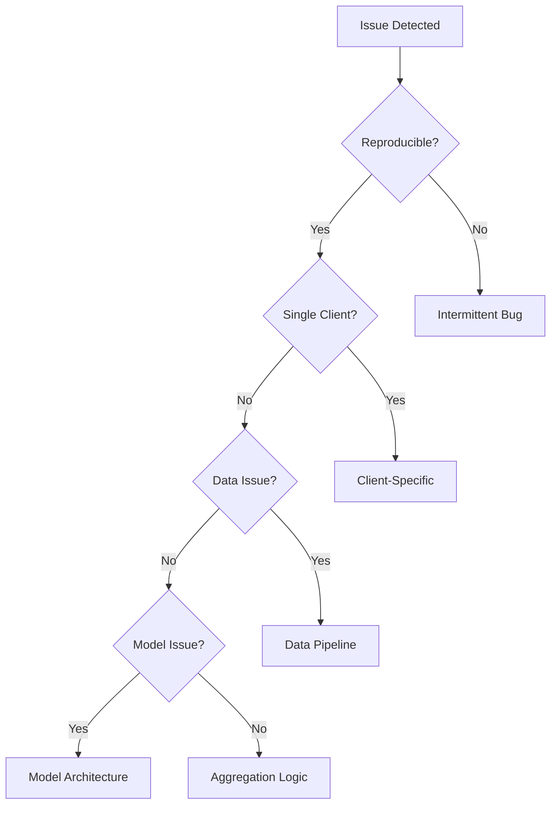
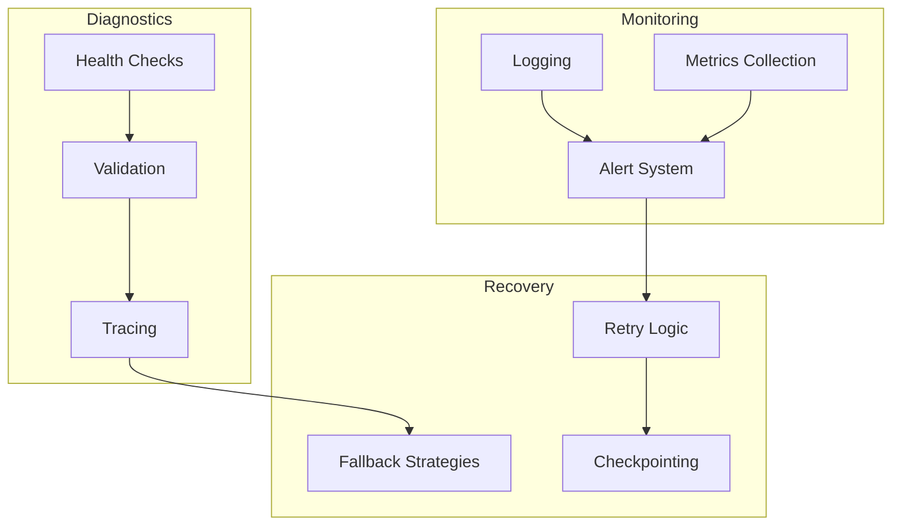

# Tutorial 177: Federated Learning Debugging and Troubleshooting

---

## Metadata

| Property | Value |
|----------|-------|
| **Tutorial ID** | 177 |
| **Title** | Federated Learning Debugging and Troubleshooting |
| **Category** | Operations |
| **Difficulty** | Intermediate |
| **Duration** | 75 minutes |
| **Prerequisites** | Tutorial 001-010 |
| **Author** | Unbitrium Contributors |
| **Last Updated** | January 2026 |

---

## Learning Objectives

By the end of this tutorial, you will be able to:

1. **Identify** common issues in federated learning systems.

2. **Debug** convergence problems and detect client failures.

3. **Monitor** training progress with appropriate logging.

4. **Diagnose** communication and synchronization issues.

5. **Apply** systematic troubleshooting methodologies.

6. **Implement** health checks and automatic recovery.

---

## Prerequisites

Before starting this tutorial, ensure you have:

- **Completed Tutorials**: 001-010 (Partitioning), 021-030 (Aggregation)
- **Knowledge**: Python debugging, logging, distributed systems
- **Libraries**: PyTorch
- **Hardware**: CPU sufficient

```python
# Verify prerequisites
import torch
import numpy as np
import logging

print(f"PyTorch: {torch.__version__}")
logging.basicConfig(level=logging.INFO)
```

---

## Background and Theory

### Common FL Issues

| Category | Issues | Symptoms |
|----------|--------|----------|
| **Convergence** | Non-convergence, oscillation | Loss not decreasing |
| **Communication** | Timeouts, dropped messages | Missing updates |
| **Data** | Corrupt data, label errors | Inconsistent metrics |
| **Resources** | OOM, slow training | Crashes, timeouts |

### Debugging Hierarchy



### Monitoring Levels

| Level | What to Monitor | Frequency |
|-------|-----------------|-----------|
| **System** | CPU, memory, network | Continuous |
| **Round** | Loss, accuracy, timing | Per round |
| **Client** | Local metrics, failures | Per client |
| **Model** | Weights, gradients | Periodic |

---

## Architecture Diagram



---

## Implementation Code

### Part 1: Logging and Monitoring

```python
#!/usr/bin/env python3
"""
Tutorial 177: Debugging and Troubleshooting

This tutorial demonstrates debugging techniques for
federated learning systems.

Author: Unbitrium Contributors
License: EUPL-1.2
"""

from __future__ import annotations

import logging
import time
import traceback
from dataclasses import dataclass, field
from typing import Any, Optional
from enum import Enum

import numpy as np
import torch
import torch.nn as nn


class LogLevel(Enum):
    """Log levels for FL system."""
    DEBUG = logging.DEBUG
    INFO = logging.INFO
    WARNING = logging.WARNING
    ERROR = logging.ERROR
    CRITICAL = logging.CRITICAL


@dataclass
class FLLogger:
    """Structured logger for federated learning."""

    name: str = "FL"
    level: LogLevel = LogLevel.INFO

    def __post_init__(self):
        self.logger = logging.getLogger(self.name)
        self.logger.setLevel(self.level.value)

        if not self.logger.handlers:
            handler = logging.StreamHandler()
            formatter = logging.Formatter(
                '%(asctime)s - %(name)s - %(levelname)s - %(message)s'
            )
            handler.setFormatter(formatter)
            self.logger.addHandler(handler)

    def log_round_start(self, round_num: int, num_clients: int) -> None:
        """Log round start."""
        self.logger.info(f"Round {round_num} starting with {num_clients} clients")

    def log_round_end(
        self,
        round_num: int,
        metrics: dict[str, float],
        duration: float,
    ) -> None:
        """Log round completion."""
        metrics_str = ", ".join(f"{k}={v:.4f}" for k, v in metrics.items())
        self.logger.info(
            f"Round {round_num} completed in {duration:.2f}s: {metrics_str}"
        )

    def log_client_update(
        self,
        client_id: int,
        status: str,
        metrics: dict[str, float] = None,
    ) -> None:
        """Log client update."""
        if metrics:
            metrics_str = ", ".join(f"{k}={v:.4f}" for k, v in metrics.items())
            self.logger.debug(f"Client {client_id} {status}: {metrics_str}")
        else:
            self.logger.debug(f"Client {client_id} {status}")

    def log_error(
        self,
        message: str,
        exception: Exception = None,
    ) -> None:
        """Log error with optional exception."""
        if exception:
            self.logger.error(f"{message}: {str(exception)}")
            self.logger.debug(traceback.format_exc())
        else:
            self.logger.error(message)

    def log_warning(self, message: str) -> None:
        """Log warning."""
        self.logger.warning(message)


@dataclass
class MetricsCollector:
    """Collect and aggregate FL metrics."""

    metrics: dict[str, list] = field(default_factory=dict)
    round_times: list[float] = field(default_factory=list)

    def record(self, name: str, value: float) -> None:
        """Record a metric value."""
        if name not in self.metrics:
            self.metrics[name] = []
        self.metrics[name].append(value)

    def record_round_time(self, duration: float) -> None:
        """Record round duration."""
        self.round_times.append(duration)

    def get_summary(self) -> dict[str, dict[str, float]]:
        """Get summary statistics."""
        summary = {}
        for name, values in self.metrics.items():
            if values:
                summary[name] = {
                    "mean": np.mean(values),
                    "std": np.std(values),
                    "min": np.min(values),
                    "max": np.max(values),
                    "latest": values[-1],
                }
        return summary

    def detect_anomalies(self, threshold: float = 3.0) -> list[str]:
        """Detect anomalous metrics (beyond threshold std devs)."""
        anomalies = []
        for name, values in self.metrics.items():
            if len(values) >= 5:
                mean = np.mean(values[:-1])
                std = np.std(values[:-1])
                latest = values[-1]

                if std > 0 and abs(latest - mean) > threshold * std:
                    anomalies.append(
                        f"{name}: {latest:.4f} (expected ~{mean:.4f})"
                    )
        return anomalies
```

### Part 2: Health Checks and Validation

```python
@dataclass
class HealthCheck:
    """Health check utilities for FL."""

    def check_model_health(
        self,
        model: nn.Module,
    ) -> dict[str, Any]:
        """Check model for common issues.

        Args:
            model: PyTorch model.

        Returns:
            Health report.
        """
        issues = []
        stats = {}

        for name, param in model.named_parameters():
            if param.requires_grad:
                # Check for NaN/Inf
                if torch.isnan(param).any():
                    issues.append(f"NaN in {name}")
                if torch.isinf(param).any():
                    issues.append(f"Inf in {name}")

                # Check magnitude
                mean = param.abs().mean().item()
                max_val = param.abs().max().item()

                if max_val > 1000:
                    issues.append(f"Large values in {name}: max={max_val:.2f}")
                if mean < 1e-7:
                    issues.append(f"Near-zero values in {name}: mean={mean:.2e}")

                stats[name] = {"mean": mean, "max": max_val}

        return {
            "healthy": len(issues) == 0,
            "issues": issues,
            "stats": stats,
        }

    def check_gradient_health(
        self,
        model: nn.Module,
    ) -> dict[str, Any]:
        """Check gradients for issues.

        Args:
            model: Model with gradients.

        Returns:
            Gradient health report.
        """
        issues = []
        grad_norms = {}

        for name, param in model.named_parameters():
            if param.grad is not None:
                grad = param.grad

                if torch.isnan(grad).any():
                    issues.append(f"NaN gradient in {name}")
                if torch.isinf(grad).any():
                    issues.append(f"Inf gradient in {name}")

                norm = grad.norm().item()
                grad_norms[name] = norm

                if norm > 100:
                    issues.append(f"Large gradient in {name}: {norm:.2f}")
                if norm < 1e-10 and param.requires_grad:
                    issues.append(f"Vanishing gradient in {name}")

        return {
            "healthy": len(issues) == 0,
            "issues": issues,
            "norms": grad_norms,
        }

    def check_update_health(
        self,
        old_state: dict[str, torch.Tensor],
        new_state: dict[str, torch.Tensor],
    ) -> dict[str, Any]:
        """Check model update for issues.

        Args:
            old_state: Previous state.
            new_state: New state.

        Returns:
            Update health report.
        """
        issues = []
        changes = {}

        for name in old_state.keys():
            if name in new_state:
                old = old_state[name]
                new = new_state[name]

                if old.shape != new.shape:
                    issues.append(f"Shape mismatch in {name}")
                    continue

                diff = (new - old).abs()
                max_change = diff.max().item()
                mean_change = diff.mean().item()

                changes[name] = {
                    "max_change": max_change,
                    "mean_change": mean_change,
                }

                if max_change == 0:
                    issues.append(f"No change in {name}")
                if max_change > 10:
                    issues.append(f"Large change in {name}: {max_change:.2f}")

        return {
            "healthy": len(issues) == 0,
            "issues": issues,
            "changes": changes,
        }


@dataclass
class DataValidator:
    """Validate FL data and updates."""

    def validate_client_update(
        self,
        update: dict[str, Any],
        expected_keys: list[str] = None,
    ) -> tuple[bool, list[str]]:
        """Validate client update structure.

        Args:
            update: Client update dictionary.
            expected_keys: Required keys.

        Returns:
            Tuple of (valid, issues).
        """
        issues = []
        expected = expected_keys or ["state_dict", "num_samples"]

        for key in expected:
            if key not in update:
                issues.append(f"Missing key: {key}")

        if "state_dict" in update:
            for name, tensor in update["state_dict"].items():
                if torch.isnan(tensor).any():
                    issues.append(f"NaN in {name}")
                if torch.isinf(tensor).any():
                    issues.append(f"Inf in {name}")

        if "num_samples" in update:
            if update["num_samples"] <= 0:
                issues.append("Invalid num_samples")

        return len(issues) == 0, issues

    def validate_aggregation(
        self,
        updates: list[dict[str, torch.Tensor]],
        weights: list[float],
    ) -> tuple[bool, list[str]]:
        """Validate aggregation inputs.

        Args:
            updates: List of state dicts.
            weights: Aggregation weights.

        Returns:
            Tuple of (valid, issues).
        """
        issues = []

        if len(updates) != len(weights):
            issues.append("Updates and weights length mismatch")

        if abs(sum(weights) - 1.0) > 1e-5:
            issues.append(f"Weights don't sum to 1: {sum(weights)}")

        if any(w < 0 for w in weights):
            issues.append("Negative weights found")

        # Check state dict consistency
        if updates:
            first_keys = set(updates[0].keys())
            for i, update in enumerate(updates[1:], 1):
                if set(update.keys()) != first_keys:
                    issues.append(f"Key mismatch in update {i}")

        return len(issues) == 0, issues
```

### Part 3: Debug Client and Error Recovery

```python
class DebugFLClient:
    """FL client with debugging capabilities."""

    def __init__(
        self,
        client_id: int,
        model: nn.Module,
        logger: FLLogger = None,
    ) -> None:
        """Initialize debug client."""
        self.client_id = client_id
        self.model = model
        self.logger = logger or FLLogger()
        self.health = HealthCheck()
        self.training_history = []

    def train_with_debug(
        self,
        dataloader,
        epochs: int = 5,
        check_every: int = 10,
    ) -> dict[str, Any]:
        """Train with extensive debugging.

        Args:
            dataloader: Training data.
            epochs: Number of epochs.
            check_every: Steps between health checks.

        Returns:
            Training result with debug info.
        """
        self.model.train()
        optimizer = torch.optim.SGD(self.model.parameters(), lr=0.01)
        criterion = nn.CrossEntropyLoss()

        debug_info = {
            "grad_norms": [],
            "losses": [],
            "issues": [],
        }

        step = 0
        for epoch in range(epochs):
            for batch_idx, (features, labels) in enumerate(dataloader):
                try:
                    optimizer.zero_grad()
                    outputs = self.model(features)
                    loss = criterion(outputs, labels)
                    loss.backward()

                    # Periodic health check
                    if step % check_every == 0:
                        grad_health = self.health.check_gradient_health(self.model)
                        if not grad_health["healthy"]:
                            for issue in grad_health["issues"]:
                                self.logger.log_warning(
                                    f"Client {self.client_id}: {issue}"
                                )
                                debug_info["issues"].append(issue)

                        # Gradient clipping if needed
                        total_norm = torch.nn.utils.clip_grad_norm_(
                            self.model.parameters(), max_norm=10.0
                        )
                        debug_info["grad_norms"].append(total_norm.item())

                    optimizer.step()
                    debug_info["losses"].append(loss.item())
                    step += 1

                except Exception as e:
                    self.logger.log_error(
                        f"Client {self.client_id} training error",
                        exception=e,
                    )
                    debug_info["issues"].append(str(e))
                    break

        # Final health check
        model_health = self.health.check_model_health(self.model)
        debug_info["model_health"] = model_health

        return {
            "state_dict": {k: v.clone() for k, v in self.model.state_dict().items()},
            "num_samples": len(dataloader.dataset),
            "debug_info": debug_info,
        }


class ErrorRecovery:
    """Error recovery strategies for FL."""

    def __init__(self, max_retries: int = 3) -> None:
        """Initialize recovery handler."""
        self.max_retries = max_retries
        self.failed_clients = {}

    def handle_client_failure(
        self,
        client_id: int,
        error: Exception,
        retry_count: int = 0,
    ) -> str:
        """Handle client failure.

        Args:
            client_id: Failed client.
            error: Exception that occurred.
            retry_count: Current retry count.

        Returns:
            Recovery action.
        """
        self.failed_clients[client_id] = {
            "error": str(error),
            "retries": retry_count,
        }

        if retry_count < self.max_retries:
            return "RETRY"
        else:
            return "SKIP"

    def handle_aggregation_failure(
        self,
        updates: list[dict],
    ) -> list[dict]:
        """Handle aggregation with failed updates.

        Args:
            updates: Updates including potentially invalid ones.

        Returns:
            Filtered valid updates.
        """
        validator = DataValidator()
        valid_updates = []

        for update in updates:
            valid, issues = validator.validate_client_update(update)
            if valid:
                valid_updates.append(update)

        return valid_updates

    def checkpoint_and_recover(
        self,
        model: nn.Module,
        round_num: int,
        checkpoint_path: str = None,
    ) -> None:
        """Save checkpoint for recovery.

        Args:
            model: Current model.
            round_num: Current round.
            checkpoint_path: Save path.
        """
        checkpoint = {
            "round": round_num,
            "model_state": model.state_dict(),
            "failed_clients": self.failed_clients,
        }

        path = checkpoint_path or f"checkpoint_round_{round_num}.pt"
        torch.save(checkpoint, path)


def debug_federated_training(
    num_clients: int = 5,
    num_rounds: int = 10,
) -> None:
    """Demonstrate debugging in FL."""
    logger = FLLogger(level=LogLevel.DEBUG)
    metrics = MetricsCollector()
    recovery = ErrorRecovery()

    # Model
    model = nn.Sequential(
        nn.Linear(32, 64),
        nn.ReLU(),
        nn.Linear(64, 10),
    )

    logger.log_round_start(0, num_clients)

    for round_num in range(num_rounds):
        start_time = time.time()

        # Simulate training with potential issues
        updates = []
        for i in range(num_clients):
            # Simulate occasional failures
            if np.random.rand() < 0.1:
                logger.log_warning(f"Client {i} failed")
                action = recovery.handle_client_failure(i, Exception("Timeout"))
                continue

            update = {
                "state_dict": {k: v + 0.01 * torch.randn_like(v)
                               for k, v in model.state_dict().items()},
                "num_samples": 100,
            }
            updates.append(update)

        # Filter valid updates
        valid_updates = recovery.handle_aggregation_failure(updates)

        if valid_updates:
            # Aggregate
            n = len(valid_updates)
            new_state = {}
            for key in model.state_dict().keys():
                new_state[key] = sum(u["state_dict"][key] for u in valid_updates) / n
            model.load_state_dict(new_state)

        duration = time.time() - start_time
        metrics.record("round_time", duration)
        metrics.record_round_time(duration)

        # Check for anomalies
        anomalies = metrics.detect_anomalies()
        if anomalies:
            for a in anomalies:
                logger.log_warning(f"Anomaly: {a}")

        logger.log_round_end(round_num, {"clients": len(valid_updates)}, duration)

    print("\nFinal Summary:")
    print(metrics.get_summary())
```

---

## Metrics and Evaluation

### Debugging Metrics

| Metric | Description | Action Threshold |
|--------|-------------|------------------|
| **Loss NaN** | Invalid loss | Immediate stop |
| **Grad Norm** | Gradient magnitude | > 100: clip |
| **Update Size** | Parameter change | > 10: investigate |

### Common Issues and Solutions

| Issue | Cause | Solution |
|-------|-------|----------|
| NaN loss | LR too high | Reduce LR |
| No convergence | Non-IID data | Adjust aggregation |
| Timeout | Slow client | Async training |

---

## Exercises

### Exercise 1: Custom Health Checks

**Task**: Add checks for learning rate schedule and momentum.

### Exercise 2: Distributed Tracing

**Task**: Implement request tracing across clients and server.

### Exercise 3: Automatic Recovery

**Task**: Implement automatic model rollback on detected issues.

### Exercise 4: Visualization Dashboard

**Task**: Create a real-time monitoring dashboard.

---

## References

1. Kairouz, P., et al. (2021). Advances and open problems in FL. *Foundations and Trends*.

2. Bonawitz, K., et al. (2019). Towards federated learning at scale. In *MLSys*.

3. Li, T., et al. (2020). Federated optimization in heterogeneous networks. In *MLSys*.

4. Rothchild, D., et al. (2020). FetchSGD: Communication-efficient FL. In *ICML*.

5. So, J., et al. (2021). Byzantine-resilient high-dimensional SGD. In *ICML*.

---

*Copyright 2026 Olaf Yunus Laitinen Imanov and Contributors. Released under EUPL 1.2.*
