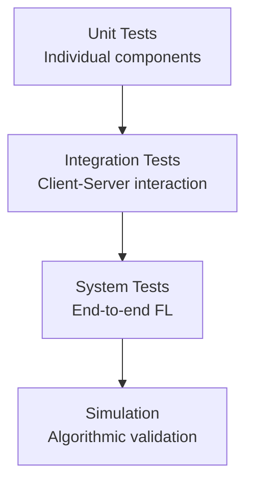
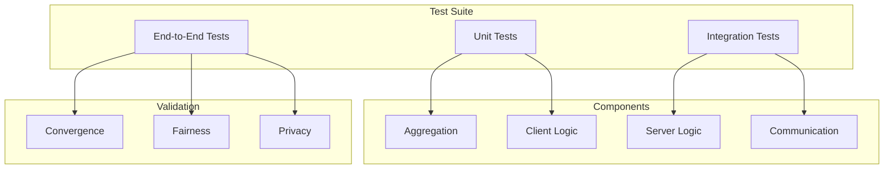

# Tutorial 178: Federated Learning Testing and Validation

---

## Metadata

| Property | Value |
|----------|-------|
| **Tutorial ID** | 178 |
| **Title** | Federated Learning Testing and Validation |
| **Category** | Quality Assurance |
| **Difficulty** | Intermediate |
| **Duration** | 75 minutes |
| **Prerequisites** | Tutorial 001-010 |
| **Author** | Unbitrium Contributors |
| **Last Updated** | January 2026 |

---

## Learning Objectives

By the end of this tutorial, you will be able to:

1. **Understand** the unique testing challenges in federated learning systems.

2. **Implement** unit tests for FL components and aggregation algorithms.

3. **Design** integration tests for client-server communication.

4. **Apply** simulation-based validation for FL algorithms.

5. **Evaluate** model performance across heterogeneous client distributions.

6. **Build** comprehensive test suites for production FL deployments.

---

## Prerequisites

Before starting this tutorial, ensure you have:

- **Completed Tutorials**: 001-010 (Partitioning), 021-030 (Aggregation)
- **Knowledge**: Python testing (pytest), software testing principles
- **Libraries**: PyTorch, pytest
- **Hardware**: CPU sufficient

```python
# Verify prerequisites
import torch
import numpy as np

print(f"PyTorch: {torch.__version__}")
```

---

## Background and Theory

### Testing Challenges in FL

| Challenge | Description |
|-----------|-------------|
| **Distributed** | Multiple clients, asynchronous updates |
| **Non-deterministic** | Random sampling, varying participation |
| **Privacy** | Cannot inspect client data directly |
| **Heterogeneity** | Different data, hardware, conditions |

### Testing Levels



### Test Categories

| Category | Focus | Examples |
|----------|-------|----------|
| **Correctness** | Algorithm logic | Aggregation math |
| **Robustness** | Edge cases | Missing clients |
| **Performance** | Speed, memory | Training time |
| **Privacy** | Data protection | DP guarantees |

---

## Architecture Diagram



---

## Implementation Code

### Part 1: Unit Tests for FL Components

```python
#!/usr/bin/env python3
"""
Tutorial 178: Testing and Validation

This tutorial demonstrates comprehensive testing
strategies for federated learning systems.

Author: Unbitrium Contributors
License: EUPL-1.2
"""

from __future__ import annotations

from dataclasses import dataclass
from typing import Any
import copy

import numpy as np
import torch
import torch.nn as nn
from torch.utils.data import Dataset, DataLoader


# ============= FL Components to Test =============

class FedAvgAggregator:
    """FedAvg aggregation algorithm."""

    def aggregate(
        self,
        updates: list[dict[str, torch.Tensor]],
        weights: list[float],
    ) -> dict[str, torch.Tensor]:
        """Aggregate model updates.

        Args:
            updates: List of state dicts.
            weights: Aggregation weights (should sum to 1).

        Returns:
            Aggregated state dict.
        """
        if not updates:
            raise ValueError("No updates to aggregate")

        if abs(sum(weights) - 1.0) > 1e-5:
            raise ValueError(f"Weights must sum to 1, got {sum(weights)}")

        result = {}
        for key in updates[0].keys():
            weighted_sum = torch.zeros_like(updates[0][key])
            for update, weight in zip(updates, weights):
                weighted_sum += weight * update[key]
            result[key] = weighted_sum

        return result


class DifferentialPrivacy:
    """DP mechanism for gradients."""

    def __init__(
        self,
        epsilon: float,
        delta: float,
        sensitivity: float = 1.0,
    ) -> None:
        """Initialize DP."""
        self.epsilon = epsilon
        self.delta = delta
        self.sensitivity = sensitivity

        # Compute noise scale
        self.sigma = sensitivity * np.sqrt(2 * np.log(1.25 / delta)) / epsilon

    def add_noise(self, tensor: torch.Tensor) -> torch.Tensor:
        """Add Gaussian noise for DP."""
        noise = torch.randn_like(tensor) * self.sigma
        return tensor + noise


class SimpleClient:
    """Simple FL client for testing."""

    def __init__(
        self,
        client_id: int,
        data: torch.Tensor,
        labels: torch.Tensor,
    ) -> None:
        """Initialize client."""
        self.client_id = client_id
        self.data = data
        self.labels = labels
        self.model = nn.Linear(data.shape[1], labels.max().item() + 1)

    def train(self, epochs: int = 1) -> dict[str, torch.Tensor]:
        """Train and return update."""
        optimizer = torch.optim.SGD(self.model.parameters(), lr=0.01)

        for _ in range(epochs):
            optimizer.zero_grad()
            outputs = self.model(self.data)
            loss = nn.functional.cross_entropy(outputs, self.labels)
            loss.backward()
            optimizer.step()

        return {k: v.clone() for k, v in self.model.state_dict().items()}


# ============= Unit Tests =============

class TestFedAvgAggregator:
    """Unit tests for FedAvg aggregation."""

    def test_single_update(self):
        """Test aggregation with single update."""
        aggregator = FedAvgAggregator()

        update = {"weight": torch.tensor([1.0, 2.0, 3.0])}
        result = aggregator.aggregate([update], [1.0])

        assert torch.allclose(result["weight"], update["weight"])
        print("✓ Single update test passed")

    def test_equal_weights(self):
        """Test aggregation with equal weights."""
        aggregator = FedAvgAggregator()

        update1 = {"weight": torch.tensor([1.0, 0.0])}
        update2 = {"weight": torch.tensor([0.0, 2.0])}

        result = aggregator.aggregate(
            [update1, update2],
            [0.5, 0.5],
        )

        expected = torch.tensor([0.5, 1.0])
        assert torch.allclose(result["weight"], expected)
        print("✓ Equal weights test passed")

    def test_unequal_weights(self):
        """Test aggregation with unequal weights."""
        aggregator = FedAvgAggregator()

        update1 = {"weight": torch.tensor([10.0])}
        update2 = {"weight": torch.tensor([0.0])}

        result = aggregator.aggregate(
            [update1, update2],
            [0.7, 0.3],
        )

        expected = torch.tensor([7.0])
        assert torch.allclose(result["weight"], expected)
        print("✓ Unequal weights test passed")

    def test_empty_updates(self):
        """Test error on empty updates."""
        aggregator = FedAvgAggregator()

        try:
            aggregator.aggregate([], [])
            assert False, "Should raise ValueError"
        except ValueError as e:
            assert "No updates" in str(e)
            print("✓ Empty updates test passed")

    def test_invalid_weights(self):
        """Test error on invalid weights."""
        aggregator = FedAvgAggregator()
        update = {"weight": torch.tensor([1.0])}

        try:
            aggregator.aggregate([update], [0.5])  # Doesn't sum to 1
            assert False, "Should raise ValueError"
        except ValueError as e:
            assert "sum to 1" in str(e)
            print("✓ Invalid weights test passed")

    def test_preserves_shape(self):
        """Test that aggregation preserves tensor shapes."""
        aggregator = FedAvgAggregator()

        shapes = [(10, 20), (5,), (3, 4, 5)]
        for shape in shapes:
            update1 = {"weight": torch.randn(shape)}
            update2 = {"weight": torch.randn(shape)}

            result = aggregator.aggregate([update1, update2], [0.5, 0.5])
            assert result["weight"].shape == shape

        print("✓ Shape preservation test passed")


class TestDifferentialPrivacy:
    """Unit tests for differential privacy."""

    def test_noise_added(self):
        """Test that noise is actually added."""
        dp = DifferentialPrivacy(epsilon=1.0, delta=1e-5)
        tensor = torch.zeros(100)

        noisy = dp.add_noise(tensor)

        # Noisy tensor should not be all zeros
        assert not torch.allclose(noisy, tensor)
        print("✓ Noise addition test passed")

    def test_noise_scale(self):
        """Test noise scale is reasonable."""
        dp = DifferentialPrivacy(epsilon=1.0, delta=1e-5)
        tensor = torch.zeros(10000)

        noisy = dp.add_noise(tensor)
        std = noisy.std().item()

        # Std should be close to sigma
        assert abs(std - dp.sigma) < 0.1 * dp.sigma
        print(f"✓ Noise scale test passed (std={std:.4f}, sigma={dp.sigma:.4f})")

    def test_higher_epsilon_less_noise(self):
        """Test that higher epsilon means less noise."""
        dp_low = DifferentialPrivacy(epsilon=0.1, delta=1e-5)
        dp_high = DifferentialPrivacy(epsilon=10.0, delta=1e-5)

        assert dp_high.sigma < dp_low.sigma
        print("✓ Epsilon-noise relationship test passed")
```

### Part 2: Integration Tests

```python
class TestClientServerIntegration:
    """Integration tests for client-server interaction."""

    def setup_clients(self, num_clients: int = 3) -> list[SimpleClient]:
        """Create test clients."""
        clients = []
        for i in range(num_clients):
            data = torch.randn(50, 10)
            labels = torch.randint(0, 5, (50,))
            client = SimpleClient(i, data, labels)
            clients.append(client)
        return clients

    def test_client_produces_update(self):
        """Test that client training produces update."""
        clients = self.setup_clients(1)
        client = clients[0]

        initial_state = copy.deepcopy(client.model.state_dict())
        update = client.train(epochs=5)

        # Update should differ from initial
        for key in initial_state:
            assert not torch.allclose(update[key], initial_state[key])

        print("✓ Client update test passed")

    def test_aggregation_produces_update(self):
        """Test full client-aggregation flow."""
        clients = self.setup_clients(3)
        aggregator = FedAvgAggregator()

        # Get updates
        updates = []
        for client in clients:
            update = client.train(epochs=1)
            updates.append(update)

        # Aggregate
        weights = [1/3, 1/3, 1/3]
        aggregated = aggregator.aggregate(updates, weights)

        # Aggregated should have same structure
        assert set(aggregated.keys()) == set(updates[0].keys())
        for key in aggregated:
            assert aggregated[key].shape == updates[0][key].shape

        print("✓ Client-server integration test passed")

    def test_model_loading(self):
        """Test that clients can load aggregated model."""
        clients = self.setup_clients(2)
        aggregator = FedAvgAggregator()

        # Round 1
        updates = [client.train(epochs=1) for client in clients]
        aggregated = aggregator.aggregate(updates, [0.5, 0.5])

        # Load aggregated model
        for client in clients:
            client.model.load_state_dict(aggregated)

        # Verify loaded
        for client in clients:
            for key in aggregated:
                assert torch.allclose(
                    client.model.state_dict()[key],
                    aggregated[key],
                )

        print("✓ Model loading test passed")


class TestConvergenceValidation:
    """Tests for convergence behavior."""

    def test_loss_decreases(self):
        """Test that loss decreases over rounds."""
        clients = []
        for i in range(5):
            # Create correlated data for convergence
            data = torch.randn(100, 10)
            labels = (data[:, 0] > 0).long()
            clients.append(SimpleClient(i, data, labels))

        aggregator = FedAvgAggregator()
        losses = []

        for round_num in range(10):
            # Train all clients
            updates = []
            round_loss = 0

            for client in clients:
                outputs = client.model(client.data)
                loss = nn.functional.cross_entropy(outputs, client.labels)
                round_loss += loss.item()

                update = client.train(epochs=1)
                updates.append(update)

            losses.append(round_loss / len(clients))

            # Aggregate and distribute
            weights = [1/len(clients)] * len(clients)
            aggregated = aggregator.aggregate(updates, weights)

            for client in clients:
                client.model.load_state_dict(aggregated)

        # Loss should generally decrease
        assert losses[-1] < losses[0], f"Loss did not decrease: {losses[0]:.4f} -> {losses[-1]:.4f}"
        print(f"✓ Convergence test passed (loss: {losses[0]:.4f} -> {losses[-1]:.4f})")

    def test_handles_heterogeneous_data(self):
        """Test convergence with non-IID data."""
        clients = []

        # Each client has different label distribution
        for i in range(5):
            data = torch.randn(100, 10)
            # Bias labels toward class i
            labels = torch.full((100,), i, dtype=torch.long)
            clients.append(SimpleClient(i, data, labels))

        aggregator = FedAvgAggregator()

        # Run FL
        for round_num in range(5):
            updates = [client.train(epochs=1) for client in clients]
            weights = [1/len(clients)] * len(clients)
            aggregated = aggregator.aggregate(updates, weights)

            for client in clients:
                client.model.load_state_dict(aggregated)

        # Should not crash with heterogeneous data
        print("✓ Heterogeneous data test passed")


def run_all_tests():
    """Run all test suites."""
    print("\n" + "=" * 50)
    print("Running FL Test Suite")
    print("=" * 50)

    # Unit tests
    print("\n--- Unit Tests: FedAvg Aggregator ---")
    test_agg = TestFedAvgAggregator()
    test_agg.test_single_update()
    test_agg.test_equal_weights()
    test_agg.test_unequal_weights()
    test_agg.test_empty_updates()
    test_agg.test_invalid_weights()
    test_agg.test_preserves_shape()

    print("\n--- Unit Tests: Differential Privacy ---")
    test_dp = TestDifferentialPrivacy()
    test_dp.test_noise_added()
    test_dp.test_noise_scale()
    test_dp.test_higher_epsilon_less_noise()

    # Integration tests
    print("\n--- Integration Tests ---")
    test_int = TestClientServerIntegration()
    test_int.test_client_produces_update()
    test_int.test_aggregation_produces_update()
    test_int.test_model_loading()

    # Convergence tests
    print("\n--- Convergence Tests ---")
    test_conv = TestConvergenceValidation()
    test_conv.test_loss_decreases()
    test_conv.test_handles_heterogeneous_data()

    print("\n" + "=" * 50)
    print("All tests passed!")
    print("=" * 50)


if __name__ == "__main__":
    run_all_tests()
```

---

## Metrics and Evaluation

### Test Coverage

| Component | Required Coverage |
|-----------|------------------|
| Aggregation | > 95% |
| Client Logic | > 90% |
| Communication | > 85% |
| Privacy | > 95% |

### Quality Metrics

| Metric | Target |
|--------|--------|
| **Unit Tests** | All pass |
| **Integration Tests** | All pass |
| **Performance** | < 2x baseline |
| **Convergence** | Loss decreases |

---

## Exercises

### Exercise 1: Pytest Suite

**Task**: Convert tests to proper pytest format with fixtures.

### Exercise 2: Privacy Tests

**Task**: Add tests verifying differential privacy guarantees.

### Exercise 3: Fault Injection

**Task**: Test behavior with client failures and network issues.

### Exercise 4: Performance Benchmarks

**Task**: Create benchmarks for aggregation speed.

---

## References

1. Caldas, S., et al. (2018). LEAF: A benchmark for federated settings. *arXiv*.

2. He, C., et al. (2020). FedML: A research library for federated machine learning. *arXiv*.

3. Bonawitz, K., et al. (2019). Towards federated learning at scale. In *MLSys*.

4. Li, T., et al. (2020). Federated optimization in heterogeneous networks. In *MLSys*.

5. Beutel, D. J., et al. (2020). Flower: A friendly federated learning framework. *arXiv*.

---

*Copyright 2026 Olaf Yunus Laitinen Imanov and Contributors. Released under EUPL 1.2.*
