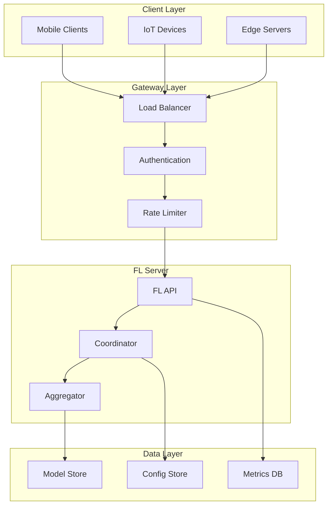
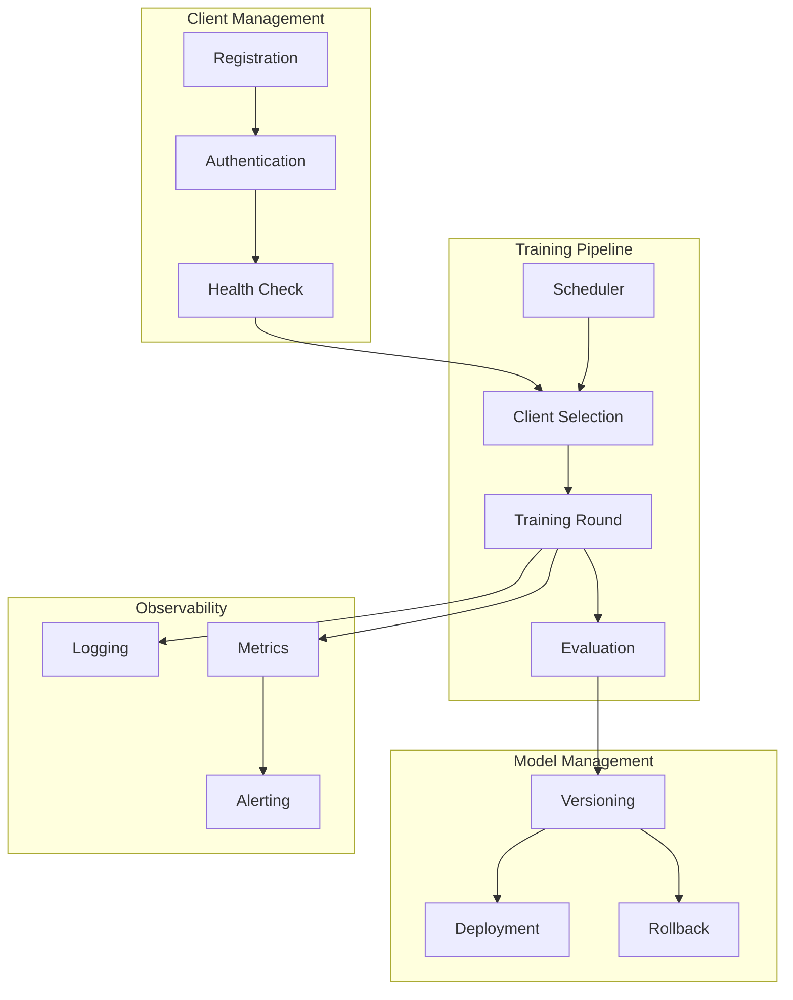

# Tutorial 179: Federated Learning Deployment and Production

---

## Metadata

| Property | Value |
|----------|-------|
| **Tutorial ID** | 179 |
| **Title** | Federated Learning Deployment and Production |
| **Category** | Operations |
| **Difficulty** | Advanced |
| **Duration** | 90 minutes |
| **Prerequisites** | Tutorial 001-010, DevOps basics |
| **Author** | Unbitrium Contributors |
| **Last Updated** | January 2026 |

---

## Learning Objectives

By the end of this tutorial, you will be able to:

1. **Understand** production requirements for federated learning systems.

2. **Implement** model versioning and rollback mechanisms.

3. **Design** client registration and authentication systems.

4. **Apply** monitoring and alerting for FL deployments.

5. **Handle** A/B testing and gradual rollouts.

6. **Build** production-grade FL infrastructure.

---

## Prerequisites

Before starting this tutorial, ensure you have:

- **Completed Tutorials**: 001-010 (Partitioning), 021-030 (Aggregation)
- **Knowledge**: REST APIs, Docker, CI/CD concepts
- **Libraries**: PyTorch, Flask
- **Hardware**: CPU sufficient

```python
# Verify prerequisites
import torch
import numpy as np
from datetime import datetime

print(f"PyTorch: {torch.__version__}")
```

---

## Background and Theory

### Production FL Requirements

| Requirement | Description | Importance |
|-------------|-------------|------------|
| **Reliability** | 99.9% uptime | Critical |
| **Scalability** | 1M+ clients | High |
| **Security** | Auth, encryption | Critical |
| **Monitoring** | Metrics, alerts | High |
| **Recoverability** | Rollback, backup | High |

### FL Production Components



### Deployment Strategies

| Strategy | Description | Risk |
|----------|-------------|------|
| **Blue-Green** | Switch between versions | Low |
| **Canary** | Gradual rollout | Medium |
| **A/B Testing** | Compare versions | Low |
| **Rolling** | Progressive update | Medium |

---

## Architecture Diagram



---

## Implementation Code

### Part 1: Model Versioning

```python
#!/usr/bin/env python3
"""
Tutorial 179: Deployment and Production

This tutorial demonstrates production-grade federated
learning deployment with versioning and monitoring.

Author: Unbitrium Contributors
License: EUPL-1.2
"""

from __future__ import annotations

from dataclasses import dataclass, field
from typing import Any, Optional
from datetime import datetime
from enum import Enum
import hashlib
import json
import copy

import numpy as np
import torch
import torch.nn as nn


class ModelStatus(Enum):
    """Model deployment status."""
    TRAINING = "training"
    STAGED = "staged"
    DEPLOYED = "deployed"
    RETIRED = "retired"
    ROLLBACK = "rollback"


@dataclass
class ModelVersion:
    """Model version metadata."""
    version_id: str
    round_number: int
    created_at: datetime
    status: ModelStatus
    metrics: dict[str, float]
    config: dict[str, Any]
    parent_version: Optional[str] = None
    checksum: Optional[str] = None

    def to_dict(self) -> dict:
        """Convert to dictionary for serialization."""
        return {
            "version_id": self.version_id,
            "round_number": self.round_number,
            "created_at": self.created_at.isoformat(),
            "status": self.status.value,
            "metrics": self.metrics,
            "config": self.config,
            "parent_version": self.parent_version,
            "checksum": self.checksum,
        }


class ModelRegistry:
    """Registry for model versions and deployments."""

    def __init__(self, storage_path: str = "./models") -> None:
        """Initialize registry.

        Args:
            storage_path: Path for model storage.
        """
        self.storage_path = storage_path
        self.versions: dict[str, ModelVersion] = {}
        self.models: dict[str, dict[str, torch.Tensor]] = {}
        self.current_deployed: Optional[str] = None

    def _compute_checksum(self, state_dict: dict[str, torch.Tensor]) -> str:
        """Compute model checksum for integrity."""
        hasher = hashlib.sha256()
        for key in sorted(state_dict.keys()):
            hasher.update(key.encode())
            hasher.update(state_dict[key].cpu().numpy().tobytes())
        return hasher.hexdigest()[:16]

    def _generate_version_id(self, round_number: int) -> str:
        """Generate unique version ID."""
        timestamp = datetime.now().strftime("%Y%m%d%H%M%S")
        return f"v{round_number}_{timestamp}"

    def register(
        self,
        state_dict: dict[str, torch.Tensor],
        round_number: int,
        metrics: dict[str, float],
        config: dict[str, Any] = None,
    ) -> str:
        """Register a new model version.

        Args:
            state_dict: Model state dictionary.
            round_number: Training round number.
            metrics: Evaluation metrics.
            config: Training configuration.

        Returns:
            Version ID.
        """
        version_id = self._generate_version_id(round_number)
        checksum = self._compute_checksum(state_dict)

        version = ModelVersion(
            version_id=version_id,
            round_number=round_number,
            created_at=datetime.now(),
            status=ModelStatus.STAGED,
            metrics=metrics.copy(),
            config=config or {},
            parent_version=self.current_deployed,
            checksum=checksum,
        )

        self.versions[version_id] = version
        self.models[version_id] = {k: v.clone() for k, v in state_dict.items()}

        print(f"Registered model {version_id} with metrics: {metrics}")
        return version_id

    def deploy(self, version_id: str) -> bool:
        """Deploy a model version.

        Args:
            version_id: Version to deploy.

        Returns:
            True if successful.
        """
        if version_id not in self.versions:
            print(f"Version {version_id} not found")
            return False

        # Update status
        if self.current_deployed:
            self.versions[self.current_deployed].status = ModelStatus.RETIRED

        self.versions[version_id].status = ModelStatus.DEPLOYED
        self.current_deployed = version_id

        print(f"Deployed model {version_id}")
        return True

    def rollback(self, steps: int = 1) -> Optional[str]:
        """Rollback to previous version.

        Args:
            steps: Number of versions to rollback.

        Returns:
            Rolled back version ID or None.
        """
        current = self.current_deployed
        for _ in range(steps):
            if current and current in self.versions:
                parent = self.versions[current].parent_version
                if parent:
                    current = parent
                else:
                    break

        if current and current != self.current_deployed:
            self.versions[current].status = ModelStatus.ROLLBACK
            old_deployed = self.current_deployed
            self.current_deployed = current
            print(f"Rolled back from {old_deployed} to {current}")
            return current

        return None

    def get_model(self, version_id: str = None) -> Optional[dict[str, torch.Tensor]]:
        """Get model state dict.

        Args:
            version_id: Version to get (None for current deployed).

        Returns:
            Model state dictionary.
        """
        vid = version_id or self.current_deployed
        if vid and vid in self.models:
            return {k: v.clone() for k, v in self.models[vid].items()}
        return None

    def list_versions(self, status: ModelStatus = None) -> list[dict]:
        """List model versions.

        Args:
            status: Filter by status.

        Returns:
            List of version metadata.
        """
        versions = []
        for vid, version in self.versions.items():
            if status is None or version.status == status:
                versions.append(version.to_dict())
        return sorted(versions, key=lambda x: x["created_at"], reverse=True)
```

### Part 2: Client Management

```python
@dataclass
class ClientInfo:
    """Client registration information."""
    client_id: str
    registered_at: datetime
    last_seen: datetime
    device_type: str
    fl_version: str
    capabilities: dict[str, Any] = field(default_factory=dict)
    is_active: bool = True
    rounds_participated: int = 0
    total_samples_contributed: int = 0


class ClientManager:
    """Manage FL client lifecycle."""

    def __init__(
        self,
        heartbeat_timeout: int = 300,
        max_clients: int = 10000,
    ) -> None:
        """Initialize client manager.

        Args:
            heartbeat_timeout: Seconds before client considered inactive.
            max_clients: Maximum registered clients.
        """
        self.clients: dict[str, ClientInfo] = {}
        self.heartbeat_timeout = heartbeat_timeout
        self.max_clients = max_clients
        self.api_keys: dict[str, str] = {}  # client_id -> api_key

    def _generate_api_key(self) -> str:
        """Generate secure API key."""
        import secrets
        return secrets.token_urlsafe(32)

    def register(
        self,
        client_id: str,
        device_type: str,
        fl_version: str,
        capabilities: dict[str, Any] = None,
    ) -> tuple[bool, Optional[str]]:
        """Register a new client.

        Args:
            client_id: Unique client identifier.
            device_type: Device type (mobile, iot, edge).
            fl_version: FL SDK version.
            capabilities: Client capabilities.

        Returns:
            Tuple of (success, api_key).
        """
        if len(self.clients) >= self.max_clients:
            return False, None

        if client_id in self.clients:
            # Re-registration updates info
            self.clients[client_id].last_seen = datetime.now()
            self.clients[client_id].is_active = True
            return True, self.api_keys.get(client_id)

        now = datetime.now()
        client = ClientInfo(
            client_id=client_id,
            registered_at=now,
            last_seen=now,
            device_type=device_type,
            fl_version=fl_version,
            capabilities=capabilities or {},
        )

        api_key = self._generate_api_key()
        self.clients[client_id] = client
        self.api_keys[client_id] = api_key

        print(f"Registered client {client_id} ({device_type})")
        return True, api_key

    def authenticate(self, client_id: str, api_key: str) -> bool:
        """Authenticate client request.

        Args:
            client_id: Client identifier.
            api_key: API key to verify.

        Returns:
            True if authenticated.
        """
        return (
            client_id in self.api_keys and
            self.api_keys[client_id] == api_key and
            self.clients[client_id].is_active
        )

    def heartbeat(self, client_id: str) -> bool:
        """Update client heartbeat.

        Args:
            client_id: Client to update.

        Returns:
            True if client exists.
        """
        if client_id in self.clients:
            self.clients[client_id].last_seen = datetime.now()
            self.clients[client_id].is_active = True
            return True
        return False

    def get_active_clients(self) -> list[str]:
        """Get list of active client IDs."""
        now = datetime.now()
        active = []
        for cid, client in self.clients.items():
            elapsed = (now - client.last_seen).total_seconds()
            if elapsed <= self.heartbeat_timeout and client.is_active:
                active.append(cid)
            else:
                client.is_active = False
        return active

    def record_participation(
        self,
        client_id: str,
        num_samples: int,
    ) -> None:
        """Record client participation in a round."""
        if client_id in self.clients:
            self.clients[client_id].rounds_participated += 1
            self.clients[client_id].total_samples_contributed += num_samples

    def get_statistics(self) -> dict[str, Any]:
        """Get client statistics."""
        active = self.get_active_clients()
        total = len(self.clients)

        by_type = {}
        for client in self.clients.values():
            by_type[client.device_type] = by_type.get(client.device_type, 0) + 1

        return {
            "total_clients": total,
            "active_clients": len(active),
            "by_device_type": by_type,
            "total_rounds": sum(c.rounds_participated for c in self.clients.values()),
            "total_samples": sum(c.total_samples_contributed for c in self.clients.values()),
        }
```

### Part 3: Monitoring and Metrics

```python
@dataclass
class MetricPoint:
    """Single metric data point."""
    name: str
    value: float
    timestamp: datetime
    tags: dict[str, str] = field(default_factory=dict)


class MetricsCollector:
    """Collect and aggregate FL metrics."""

    def __init__(self, retention_hours: int = 24) -> None:
        """Initialize metrics collector.

        Args:
            retention_hours: Hours to retain metrics.
        """
        self.metrics: list[MetricPoint] = []
        self.retention_hours = retention_hours
        self.alerts: list[dict] = []
        self.thresholds: dict[str, tuple[float, float]] = {}  # (min, max)

    def record(
        self,
        name: str,
        value: float,
        tags: dict[str, str] = None,
    ) -> None:
        """Record a metric value.

        Args:
            name: Metric name.
            value: Metric value.
            tags: Optional tags.
        """
        point = MetricPoint(
            name=name,
            value=value,
            timestamp=datetime.now(),
            tags=tags or {},
        )
        self.metrics.append(point)
        self._check_threshold(name, value)
        self._cleanup()

    def set_threshold(
        self,
        name: str,
        min_value: float = None,
        max_value: float = None,
    ) -> None:
        """Set alert threshold for a metric."""
        self.thresholds[name] = (min_value, max_value)

    def _check_threshold(self, name: str, value: float) -> None:
        """Check if value exceeds threshold."""
        if name in self.thresholds:
            min_val, max_val = self.thresholds[name]
            if (min_val is not None and value < min_val) or \
               (max_val is not None and value > max_val):
                self.alerts.append({
                    "metric": name,
                    "value": value,
                    "threshold": self.thresholds[name],
                    "timestamp": datetime.now().isoformat(),
                })

    def _cleanup(self) -> None:
        """Remove old metrics."""
        cutoff = datetime.now().timestamp() - (self.retention_hours * 3600)
        self.metrics = [
            m for m in self.metrics
            if m.timestamp.timestamp() > cutoff
        ]

    def query(
        self,
        name: str,
        hours: int = 1,
        aggregation: str = "mean",
    ) -> Optional[float]:
        """Query aggregated metric value.

        Args:
            name: Metric name.
            hours: Hours to look back.
            aggregation: mean, min, max, sum.

        Returns:
            Aggregated value.
        """
        cutoff = datetime.now().timestamp() - (hours * 3600)
        values = [
            m.value for m in self.metrics
            if m.name == name and m.timestamp.timestamp() > cutoff
        ]

        if not values:
            return None

        if aggregation == "mean":
            return np.mean(values)
        elif aggregation == "min":
            return np.min(values)
        elif aggregation == "max":
            return np.max(values)
        elif aggregation == "sum":
            return np.sum(values)
        return None

    def get_alerts(self, clear: bool = False) -> list[dict]:
        """Get pending alerts."""
        alerts = self.alerts.copy()
        if clear:
            self.alerts = []
        return alerts


class FLProductionServer:
    """Production federated learning server."""

    def __init__(self, model: nn.Module) -> None:
        """Initialize production server."""
        self.registry = ModelRegistry()
        self.clients = ClientManager()
        self.metrics = MetricsCollector()

        # Register initial model
        initial_state = model.state_dict()
        version_id = self.registry.register(
            initial_state,
            round_number=0,
            metrics={"accuracy": 0.0, "loss": float("inf")},
            config={"initial": True},
        )
        self.registry.deploy(version_id)

        # Set alert thresholds
        self.metrics.set_threshold("accuracy", min_value=0.5)
        self.metrics.set_threshold("loss", max_value=5.0)
        self.metrics.set_threshold("active_clients", min_value=5)

        self.current_round = 0

    def run_round(
        self,
        client_updates: list[dict[str, Any]],
        eval_metrics: dict[str, float],
    ) -> str:
        """Execute one FL round.

        Args:
            client_updates: Client model updates.
            eval_metrics: Evaluation metrics.

        Returns:
            New model version ID.
        """
        self.current_round += 1

        # Get current model
        current_model = self.registry.get_model()

        # Aggregate updates (simplified)
        if client_updates:
            total_samples = sum(u.get("num_samples", 1) for u in client_updates)
            aggregated = {}

            for key in current_model:
                weighted_sum = torch.zeros_like(current_model[key])
                for update in client_updates:
                    w = update.get("num_samples", 1) / total_samples
                    weighted_sum += w * update["state_dict"][key]
                aggregated[key] = weighted_sum

            # Register new version
            version_id = self.registry.register(
                aggregated,
                round_number=self.current_round,
                metrics=eval_metrics,
            )

            # Record metrics
            for name, value in eval_metrics.items():
                self.metrics.record(name, value, {"round": str(self.current_round)})

            # Auto-deploy if improved
            current_version = self.registry.versions.get(self.registry.current_deployed)
            if current_version:
                current_acc = current_version.metrics.get("accuracy", 0)
                new_acc = eval_metrics.get("accuracy", 0)
                if new_acc > current_acc + 0.01:  # 1% improvement threshold
                    self.registry.deploy(version_id)

            # Record client participation
            for update in client_updates:
                self.clients.record_participation(
                    update.get("client_id", "unknown"),
                    update.get("num_samples", 0),
                )

            return version_id

        return self.registry.current_deployed

    def get_status(self) -> dict[str, Any]:
        """Get server status."""
        return {
            "current_round": self.current_round,
            "deployed_version": self.registry.current_deployed,
            "client_stats": self.clients.get_statistics(),
            "recent_alerts": self.metrics.get_alerts(),
            "metrics": {
                "accuracy": self.metrics.query("accuracy", hours=1, aggregation="mean"),
                "loss": self.metrics.query("loss", hours=1, aggregation="mean"),
            },
        }
```

---

## Metrics and Evaluation

### Production Metrics

| Metric | Description | Target |
|--------|-------------|--------|
| **Uptime** | Server availability | > 99.9% |
| **Latency** | Round completion time | < 10min |
| **Success Rate** | Successful updates | > 95% |
| **Client Health** | Active clients | > 80% |

### Deployment Checklist

- [ ] Model versioning enabled
- [ ] Rollback mechanism tested
- [ ] Client authentication working
- [ ] Metrics collection active
- [ ] Alert thresholds configured
- [ ] Backup procedures in place

---

## Exercises

### Exercise 1: Blue-Green Deployment

**Task**: Implement blue-green deployment for zero-downtime updates.

### Exercise 2: Canary Release

**Task**: Add gradual rollout with automatic rollback on degradation.

### Exercise 3: Client Cohorts

**Task**: Implement client cohort management for A/B testing.

### Exercise 4: Auto-Scaling

**Task**: Add auto-scaling based on client load.

---

## References

1. Bonawitz, K., et al. (2019). Towards federated learning at scale. In *MLSys*.

2. Hard, A., et al. (2019). Federated learning for mobile keyboard prediction. *arXiv*.

3. Kairouz, P., et al. (2021). Advances and open problems in FL. *Foundations and Trends*.

4. Huba, D., et al. (2022). PAPAYA: Practical, private, and scalable FL. In *MLSys*.

5. Paulik, M., et al. (2021). Federated evaluation and tuning for on-device personalization. *arXiv*.

---

*Copyright 2026 Olaf Yunus Laitinen Imanov and Contributors. Released under EUPL 1.2.*
