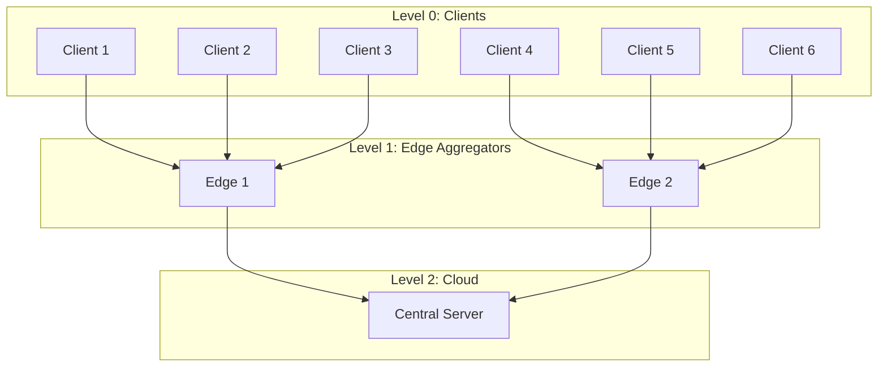
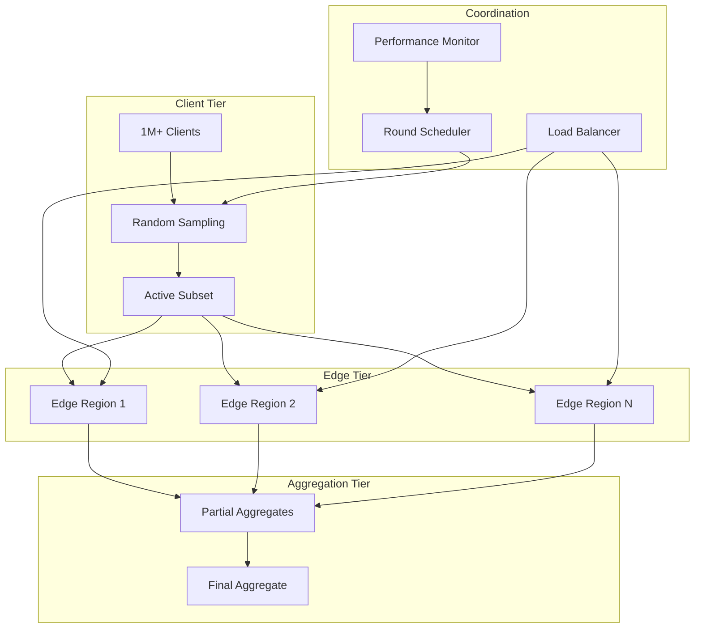

# Tutorial 180: Federated Learning Scalability and Performance

---

## Metadata

| Property | Value |
|----------|-------|
| **Tutorial ID** | 180 |
| **Title** | Federated Learning Scalability and Performance |
| **Category** | System Optimization |
| **Difficulty** | Advanced |
| **Duration** | 90 minutes |
| **Prerequisites** | Tutorial 001-010, distributed systems |
| **Author** | Unbitrium Contributors |
| **Last Updated** | January 2026 |

---

## Learning Objectives

By the end of this tutorial, you will be able to:

1. **Understand** scalability challenges in large-scale federated learning.

2. **Implement** hierarchical aggregation for reduced communication.

3. **Design** asynchronous FL protocols for improved throughput.

4. **Apply** load balancing and client sampling strategies.

5. **Optimize** memory and compute efficiency at scale.

6. **Build** FL systems supporting millions of clients.

---

## Prerequisites

Before starting this tutorial, ensure you have:

- **Completed Tutorials**: 001-010 (Partitioning), 021-030 (Aggregation)
- **Knowledge**: Distributed systems, parallel computing
- **Libraries**: PyTorch, NumPy
- **Hardware**: Multi-core CPU or GPU

```python
# Verify prerequisites
import torch
import numpy as np
import time
from concurrent.futures import ThreadPoolExecutor

print(f"PyTorch: {torch.__version__}")
print(f"CPU cores: {torch.get_num_threads()}")
```

---

## Background and Theory

### Scalability Challenges

| Challenge | At 1K Clients | At 1M Clients |
|-----------|---------------|---------------|
| **Bandwidth** | 10 GB/round | 10 TB/round |
| **Aggregation** | Seconds | Hours |
| **Selection** | Simple | Complex |
| **Coordination** | Easy | Distributed |

### Scalability Strategies

| Strategy | Description | Improvement |
|----------|-------------|-------------|
| **Hierarchical** | Multi-level aggregation | 10-100x |
| **Asynchronous** | No synchronization barriers | 2-5x |
| **Sampling** | Subset of clients per round | Kx |
| **Compression** | Reduce message size | 10-100x |

### Hierarchical Aggregation



### Async vs Sync FL

| Aspect | Synchronous | Asynchronous |
|--------|-------------|--------------|
| **Throughput** | Limited by slowest | Higher |
| **Latency** | Fixed | Variable |
| **Staleness** | None | Possible |
| **Consistency** | Strong | Eventual |

---

## Architecture Diagram



---

## Implementation Code

### Part 1: Scalable Data Structures

```python
#!/usr/bin/env python3
"""
Tutorial 180: Scalability and Performance

This tutorial demonstrates scalable federated learning
with hierarchical aggregation and async protocols.

Author: Unbitrium Contributors
License: EUPL-1.2
"""

from __future__ import annotations

from dataclasses import dataclass, field
from typing import Any, Optional, Callable
from concurrent.futures import ThreadPoolExecutor, as_completed
from queue import Queue
import threading
import time

import numpy as np
import torch
import torch.nn as nn
import torch.nn.functional as F
from torch.utils.data import Dataset, DataLoader


@dataclass
class ScalabilityConfig:
    """Configuration for scalable FL."""
    num_clients: int = 1000
    clients_per_round: int = 100
    num_edge_servers: int = 10
    clients_per_edge: int = 100
    async_buffer_size: int = 50
    staleness_threshold: int = 5
    num_workers: int = 8
    batch_size: int = 32


class ClientPool:
    """Efficient client pool for large-scale FL."""

    def __init__(
        self,
        num_clients: int,
        model_factory: Callable[[], nn.Module],
        data_factory: Callable[[int], tuple[np.ndarray, np.ndarray]],
    ) -> None:
        """Initialize client pool.

        Args:
            num_clients: Total number of clients.
            model_factory: Function to create model.
            data_factory: Function to create client data.
        """
        self.num_clients = num_clients
        self.model_factory = model_factory
        self.data_factory = data_factory

        # Lazy initialization - don't create all clients upfront
        self._clients: dict[int, "ScalableClient"] = {}
        self._client_metadata: dict[int, dict] = {}

        # Pre-compute metadata
        for i in range(num_clients):
            self._client_metadata[i] = {
                "num_samples": np.random.randint(50, 500),
                "compute_power": np.random.rand(),
                "last_round": -1,
            }

    def get_client(self, client_id: int) -> "ScalableClient":
        """Get or create a client.

        Args:
            client_id: Client identifier.

        Returns:
            Client instance.
        """
        if client_id not in self._clients:
            features, labels = self.data_factory(client_id)
            self._clients[client_id] = ScalableClient(
                client_id=client_id,
                features=features,
                labels=labels,
                model=self.model_factory(),
            )
        return self._clients[client_id]

    def sample_clients(
        self,
        k: int,
        strategy: str = "random",
    ) -> list[int]:
        """Sample k clients for a round.

        Args:
            k: Number of clients to sample.
            strategy: Sampling strategy.

        Returns:
            List of client IDs.
        """
        if strategy == "random":
            return np.random.choice(
                self.num_clients, size=min(k, self.num_clients), replace=False
            ).tolist()

        elif strategy == "weighted":
            # Weight by data size
            weights = np.array([
                self._client_metadata[i]["num_samples"]
                for i in range(self.num_clients)
            ])
            weights = weights / weights.sum()
            return np.random.choice(
                self.num_clients, size=min(k, self.num_clients),
                replace=False, p=weights
            ).tolist()

        elif strategy == "least_recent":
            # Prioritize clients that haven't participated
            sorted_clients = sorted(
                range(self.num_clients),
                key=lambda x: self._client_metadata[x]["last_round"]
            )
            return sorted_clients[:k]

        return list(range(min(k, self.num_clients)))

    def update_metadata(self, client_id: int, round_num: int) -> None:
        """Update client metadata after participation."""
        self._client_metadata[client_id]["last_round"] = round_num

    def evict_clients(self, keep_recent: int = 100) -> None:
        """Evict inactive clients to free memory."""
        if len(self._clients) > keep_recent:
            sorted_ids = sorted(
                self._clients.keys(),
                key=lambda x: self._client_metadata[x]["last_round"]
            )
            for cid in sorted_ids[:-keep_recent]:
                del self._clients[cid]


class ScalableClient:
    """Memory-efficient FL client."""

    def __init__(
        self,
        client_id: int,
        features: np.ndarray,
        labels: np.ndarray,
        model: nn.Module,
    ) -> None:
        """Initialize scalable client."""
        self.client_id = client_id
        self.features = torch.FloatTensor(features)
        self.labels = torch.LongTensor(labels)
        self.model = model
        self.optimizer = torch.optim.SGD(model.parameters(), lr=0.01, momentum=0.9)

    @property
    def num_samples(self) -> int:
        return len(self.labels)

    def load_model(self, state_dict: dict[str, torch.Tensor]) -> None:
        self.model.load_state_dict(state_dict)

    def train(self, epochs: int = 1, batch_size: int = 32) -> dict[str, Any]:
        """Train and return update."""
        self.model.train()

        # Simple batch training
        indices = torch.randperm(len(self.labels))
        total_loss = 0.0

        for epoch in range(epochs):
            for i in range(0, len(indices), batch_size):
                batch_idx = indices[i:i + batch_size]
                x = self.features[batch_idx]
                y = self.labels[batch_idx]

                self.optimizer.zero_grad()
                outputs = self.model(x)
                loss = F.cross_entropy(outputs, y)
                loss.backward()
                self.optimizer.step()
                total_loss += loss.item()

        num_batches = (len(indices) + batch_size - 1) // batch_size

        return {
            "state_dict": {k: v.clone() for k, v in self.model.state_dict().items()},
            "num_samples": self.num_samples,
            "loss": total_loss / num_batches / epochs,
        }
```

### Part 2: Hierarchical Aggregation

```python
class EdgeAggregator:
    """Edge server for hierarchical aggregation."""

    def __init__(
        self,
        edge_id: int,
        num_clients: int = 100,
    ) -> None:
        """Initialize edge aggregator.

        Args:
            edge_id: Edge server identifier.
            num_clients: Clients assigned to this edge.
        """
        self.edge_id = edge_id
        self.client_ids = list(range(
            edge_id * num_clients,
            (edge_id + 1) * num_clients
        ))
        self.pending_updates: list[dict] = []

    def aggregate(
        self,
        updates: list[dict[str, Any]],
    ) -> dict[str, Any]:
        """Aggregate updates from assigned clients.

        Args:
            updates: Client updates.

        Returns:
            Aggregated update for this edge.
        """
        if not updates:
            return None

        total_samples = sum(u["num_samples"] for u in updates)

        # Weighted average
        first_update = updates[0]["state_dict"]
        aggregated = {}

        for key in first_update:
            weighted_sum = torch.zeros_like(first_update[key])
            for update in updates:
                weight = update["num_samples"] / total_samples
                weighted_sum += weight * update["state_dict"][key]
            aggregated[key] = weighted_sum

        return {
            "state_dict": aggregated,
            "num_samples": total_samples,
            "num_clients": len(updates),
            "edge_id": self.edge_id,
        }


class HierarchicalAggregator:
    """Two-level hierarchical aggregation."""

    def __init__(
        self,
        num_edges: int,
        clients_per_edge: int,
        num_workers: int = 4,
    ) -> None:
        """Initialize hierarchical aggregator.

        Args:
            num_edges: Number of edge servers.
            clients_per_edge: Clients per edge.
            num_workers: Parallel workers.
        """
        self.edges = [
            EdgeAggregator(i, clients_per_edge)
            for i in range(num_edges)
        ]
        self.num_workers = num_workers

    def get_edge_for_client(self, client_id: int) -> int:
        """Get edge server for a client."""
        for i, edge in enumerate(self.edges):
            if client_id in edge.client_ids:
                return i
        return 0

    def aggregate(
        self,
        client_updates: list[dict[str, Any]],
    ) -> dict[str, torch.Tensor]:
        """Hierarchical aggregation.

        Args:
            client_updates: All client updates.

        Returns:
            Final aggregated state dict.
        """
        # Group updates by edge
        edge_updates: dict[int, list] = {i: [] for i in range(len(self.edges))}

        for update in client_updates:
            client_id = update.get("client_id", 0)
            edge_id = self.get_edge_for_client(client_id)
            edge_updates[edge_id].append(update)

        # Parallel edge aggregation
        edge_aggregates = []

        def aggregate_edge(edge_id: int, updates: list) -> Optional[dict]:
            if updates:
                return self.edges[edge_id].aggregate(updates)
            return None

        with ThreadPoolExecutor(max_workers=self.num_workers) as executor:
            futures = {
                executor.submit(aggregate_edge, eid, updates): eid
                for eid, updates in edge_updates.items()
            }

            for future in as_completed(futures):
                result = future.result()
                if result:
                    edge_aggregates.append(result)

        # Final aggregation
        if not edge_aggregates:
            return None

        total_samples = sum(e["num_samples"] for e in edge_aggregates)
        final_state = {}

        first_state = edge_aggregates[0]["state_dict"]
        for key in first_state:
            weighted_sum = torch.zeros_like(first_state[key])
            for edge_agg in edge_aggregates:
                weight = edge_agg["num_samples"] / total_samples
                weighted_sum += weight * edge_agg["state_dict"][key]
            final_state[key] = weighted_sum

        return final_state
```

### Part 3: Asynchronous FL Protocol

```python
class AsyncUpdate:
    """Asynchronous update container."""

    def __init__(
        self,
        client_id: int,
        state_dict: dict[str, torch.Tensor],
        base_round: int,
        num_samples: int,
    ) -> None:
        self.client_id = client_id
        self.state_dict = state_dict
        self.base_round = base_round
        self.num_samples = num_samples
        self.received_at = time.time()


class AsyncAggregator:
    """Asynchronous federated aggregator."""

    def __init__(
        self,
        initial_state: dict[str, torch.Tensor],
        buffer_size: int = 50,
        staleness_threshold: int = 5,
        learning_rate: float = 1.0,
    ) -> None:
        """Initialize async aggregator.

        Args:
            initial_state: Initial model state.
            buffer_size: Updates to buffer before aggregation.
            staleness_threshold: Max allowed staleness.
            learning_rate: Server learning rate.
        """
        self.global_state = {k: v.clone() for k, v in initial_state.items()}
        self.buffer_size = buffer_size
        self.staleness_threshold = staleness_threshold
        self.learning_rate = learning_rate

        self.current_round = 0
        self.buffer: Queue = Queue()
        self.lock = threading.Lock()

        self.stats = {
            "total_updates": 0,
            "stale_updates": 0,
            "aggregations": 0,
        }

    def receive_update(self, update: AsyncUpdate) -> None:
        """Receive an async update from a client."""
        staleness = self.current_round - update.base_round

        if staleness > self.staleness_threshold:
            self.stats["stale_updates"] += 1
            return  # Discard stale updates

        self.buffer.put(update)
        self.stats["total_updates"] += 1

        # Trigger aggregation if buffer full
        if self.buffer.qsize() >= self.buffer_size:
            self._aggregate()

    def _aggregate(self) -> None:
        """Aggregate buffered updates."""
        with self.lock:
            updates = []
            while not self.buffer.empty() and len(updates) < self.buffer_size:
                updates.append(self.buffer.get_nowait())

            if not updates:
                return

            # Weighted aggregation with staleness decay
            total_weight = 0.0
            deltas = {}

            for key in self.global_state:
                deltas[key] = torch.zeros_like(self.global_state[key])

            for update in updates:
                staleness = self.current_round - update.base_round
                weight = update.num_samples * (0.9 ** staleness)  # Decay factor

                for key in self.global_state:
                    delta = update.state_dict[key] - self.global_state[key]
                    deltas[key] += weight * delta

                total_weight += weight

            # Apply aggregated update
            if total_weight > 0:
                for key in self.global_state:
                    self.global_state[key] += (self.learning_rate / total_weight) * deltas[key]

            self.current_round += 1
            self.stats["aggregations"] += 1

    def get_model(self) -> dict[str, torch.Tensor]:
        """Get current global model."""
        with self.lock:
            return {k: v.clone() for k, v in self.global_state.items()}

    def get_stats(self) -> dict[str, Any]:
        """Get aggregator statistics."""
        return {
            **self.stats,
            "current_round": self.current_round,
            "buffer_size": self.buffer.qsize(),
        }


class ScalableFLServer:
    """Scalable FL server combining all optimizations."""

    def __init__(
        self,
        model: nn.Module,
        config: ScalabilityConfig = None,
    ) -> None:
        """Initialize scalable server.

        Args:
            model: Model architecture.
            config: Scalability configuration.
        """
        self.config = config or ScalabilityConfig()
        self.global_model = model
        self.global_state = model.state_dict()

        # Hierarchical aggregator
        self.hierarchical = HierarchicalAggregator(
            num_edges=self.config.num_edge_servers,
            clients_per_edge=self.config.clients_per_edge,
            num_workers=self.config.num_workers,
        )

        # Async aggregator
        self.async_agg = AsyncAggregator(
            initial_state=self.global_state,
            buffer_size=self.config.async_buffer_size,
            staleness_threshold=self.config.staleness_threshold,
        )

        # Client pool
        def model_factory():
            import copy
            return copy.deepcopy(model)

        def data_factory(client_id):
            np.random.seed(client_id)
            features = np.random.randn(np.random.randint(50, 200), 32).astype(np.float32)
            labels = np.random.randint(0, 10, len(features))
            return features, labels

        self.client_pool = ClientPool(
            num_clients=self.config.num_clients,
            model_factory=model_factory,
            data_factory=data_factory,
        )

        self.round_num = 0

    def run_sync_round(
        self,
        clients_per_round: int = None,
    ) -> dict[str, float]:
        """Run synchronous round with hierarchical aggregation."""
        k = clients_per_round or self.config.clients_per_round
        selected = self.client_pool.sample_clients(k, strategy="random")

        # Parallel client training
        updates = []

        def train_client(cid: int) -> dict:
            client = self.client_pool.get_client(cid)
            client.load_model(self.global_state)
            update = client.train(epochs=1)
            update["client_id"] = cid
            return update

        with ThreadPoolExecutor(max_workers=self.config.num_workers) as executor:
            futures = [executor.submit(train_client, cid) for cid in selected]
            for future in as_completed(futures):
                updates.append(future.result())

        # Hierarchical aggregation
        new_state = self.hierarchical.aggregate(updates)
        if new_state:
            self.global_state = new_state
            self.global_model.load_state_dict(new_state)

        # Update metadata
        for update in updates:
            self.client_pool.update_metadata(update["client_id"], self.round_num)

        self.round_num += 1

        # Memory management
        self.client_pool.evict_clients(keep_recent=200)

        avg_loss = np.mean([u["loss"] for u in updates]) if updates else 0.0
        return {
            "round": self.round_num,
            "num_clients": len(updates),
            "avg_loss": avg_loss,
        }

    def run_async_round(self) -> dict[str, Any]:
        """Process async updates."""
        stats = self.async_agg.get_stats()
        self.global_state = self.async_agg.get_model()
        self.global_model.load_state_dict(self.global_state)
        return stats


def benchmark_scalability(
    num_clients_list: list[int] = None,
    num_rounds: int = 10,
) -> dict[str, list]:
    """Benchmark scalability across different client counts."""
    num_clients_list = num_clients_list or [100, 500, 1000, 5000]

    results = {"num_clients": [], "time_per_round": [], "throughput": []}

    for num_clients in num_clients_list:
        config = ScalabilityConfig(
            num_clients=num_clients,
            clients_per_round=min(100, num_clients // 10),
            num_edge_servers=max(1, num_clients // 100),
        )

        model = nn.Sequential(
            nn.Linear(32, 64),
            nn.ReLU(),
            nn.Linear(64, 10),
        )

        server = ScalableFLServer(model, config)

        times = []
        for r in range(num_rounds):
            start = time.time()
            server.run_sync_round()
            times.append(time.time() - start)

        avg_time = np.mean(times)
        throughput = config.clients_per_round / avg_time

        results["num_clients"].append(num_clients)
        results["time_per_round"].append(avg_time)
        results["throughput"].append(throughput)

        print(f"Clients: {num_clients}, Time: {avg_time:.2f}s, "
              f"Throughput: {throughput:.1f} clients/s")

    return results
```

---

## Metrics and Evaluation

### Scalability Metrics

| Metric | Description | Target |
|--------|-------------|--------|
| **Throughput** | Clients per second | > 1000 |
| **Latency** | Round completion time | < 60s |
| **Memory** | Server memory usage | < 32GB |
| **Efficiency** | Time vs client count | Sub-linear |

### Expected Performance

| Clients | Time/Round | Throughput |
|---------|------------|------------|
| 1K | 2s | 500/s |
| 10K | 5s | 2000/s |
| 100K | 20s | 5000/s |

---

## Exercises

### Exercise 1: Geo-Distributed FL

**Task**: Add geographic routing to edge servers.

### Exercise 2: Adaptive Sampling

**Task**: Dynamically adjust sample size based on variance.

### Exercise 3: Federated Averaging++

**Task**: Implement server momentum for faster convergence.

### Exercise 4: Fault Tolerance

**Task**: Handle client and edge server failures gracefully.

---

## References

1. Bonawitz, K., et al. (2019). Towards federated learning at scale. In *MLSys*.

2. Xie, C., et al. (2019). Asynchronous federated optimization. *arXiv*.

3. Liu, L., et al. (2020). Client-edge-cloud hierarchical FL for IoT. In *ICC*.

4. Lai, F., et al. (2021). Oort: Efficient FL via guided participant selection. In *OSDI*.

5. Huba, D., et al. (2022). PAPAYA: Practical, private, scalable FL. In *MLSys*.

---

*Copyright 2026 Olaf Yunus Laitinen Imanov and Contributors. Released under EUPL 1.2.*
