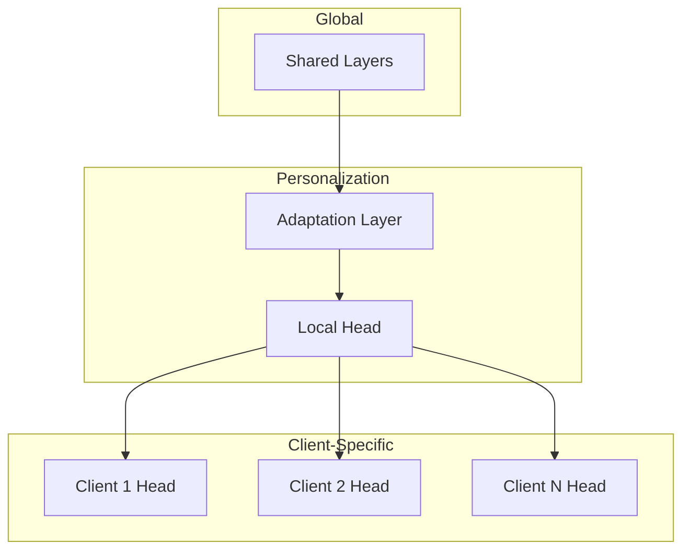

# Tutorial 181: Federated Learning Personalization Strategies

---

## Metadata

| Property | Value |
|----------|-------|
| **Tutorial ID** | 181 |
| **Title** | Federated Learning Personalization Strategies |
| **Category** | Advanced Algorithms |
| **Difficulty** | Advanced |
| **Duration** | 90 minutes |
| **Prerequisites** | Tutorial 001-010, Meta-learning basics |
| **Author** | Unbitrium Contributors |
| **Last Updated** | January 2026 |

---

## Learning Objectives

By the end of this tutorial, you will be able to:

1. **Understand** the need for personalization in heterogeneous FL settings.

2. **Implement** local fine-tuning and multi-task learning approaches.

3. **Design** meta-learning frameworks for personalized FL (Per-FedAvg, MAML).

4. **Apply** mixture of experts for client-specific predictions.

5. **Evaluate** personalization vs generalization trade-offs.

6. **Build** adaptive FL systems that balance global and local knowledge.

---

## Prerequisites

Before starting this tutorial, ensure you have:

- **Completed Tutorials**: 001-010 (Partitioning), 021-030 (Aggregation)
- **Knowledge**: Transfer learning, meta-learning concepts
- **Libraries**: PyTorch
- **Hardware**: GPU recommended

```python
# Verify prerequisites
import torch
import torch.nn as nn
import numpy as np

print(f"PyTorch: {torch.__version__}")
```

---

## Background and Theory

### Why Personalization?

Standard FL assumes all clients benefit from single global model, but:

| Issue | Description | Impact |
|-------|-------------|--------|
| **Data Heterogeneity** | Non-IID distributions | Poor local fit |
| **Task Variation** | Different objectives | Suboptimal global |
| **User Preferences** | Individual patterns | Generic predictions |

### Personalization Spectrum


### Personalization Approaches

| Approach | Description | Pros | Cons |
|----------|-------------|------|------|
| **Local Fine-Tuning** | Fine-tune global | Simple | Overfitting |
| **Multi-Task** | Shared + local layers | Flexible | Complexity |
| **Meta-Learning** | Learn to adapt | Fast adapt | Training cost |
| **Mixture of Experts** | Client-specific routing | Capacity | Memory |

---

## Architecture Diagram



---

## Implementation Code

### Part 1: Local Fine-Tuning

```python
#!/usr/bin/env python3
"""
Tutorial 181: Personalization Strategies

This tutorial demonstrates personalization approaches
for heterogeneous federated learning.

Author: Unbitrium Contributors
License: EUPL-1.2
"""

from __future__ import annotations

from dataclasses import dataclass
from typing import Any
import copy

import numpy as np
import torch
import torch.nn as nn
import torch.nn.functional as F
from torch.utils.data import Dataset, DataLoader


@dataclass
class PersonalizationConfig:
    """Configuration for personalization."""
    input_dim: int = 32
    hidden_dim: int = 64
    num_classes: int = 10
    local_layers: int = 1
    finetune_epochs: int = 3
    meta_lr: float = 0.01
    inner_lr: float = 0.1
    batch_size: int = 32


class PersonalizedModel(nn.Module):
    """Model with shared and personal components."""

    def __init__(
        self,
        input_dim: int = 32,
        hidden_dim: int = 64,
        num_classes: int = 10,
    ) -> None:
        """Initialize personalized model.

        Args:
            input_dim: Input dimension.
            hidden_dim: Hidden dimension.
            num_classes: Number of classes.
        """
        super().__init__()

        # Shared layers (federated)
        self.shared = nn.Sequential(
            nn.Linear(input_dim, hidden_dim),
            nn.ReLU(),
            nn.Linear(hidden_dim, hidden_dim),
            nn.ReLU(),
        )

        # Personal layers (local only)
        self.personal = nn.Sequential(
            nn.Linear(hidden_dim, hidden_dim // 2),
            nn.ReLU(),
            nn.Linear(hidden_dim // 2, num_classes),
        )

    def forward(self, x: torch.Tensor) -> torch.Tensor:
        """Forward pass."""
        shared_features = self.shared(x)
        output = self.personal(shared_features)
        return output

    def get_shared_state(self) -> dict[str, torch.Tensor]:
        """Get only shared layer parameters."""
        return {
            k: v.clone() for k, v in self.state_dict().items()
            if k.startswith("shared")
        }

    def get_personal_state(self) -> dict[str, torch.Tensor]:
        """Get only personal layer parameters."""
        return {
            k: v.clone() for k, v in self.state_dict().items()
            if k.startswith("personal")
        }

    def load_shared_state(self, state: dict[str, torch.Tensor]) -> None:
        """Load only shared parameters."""
        current = self.state_dict()
        for k, v in state.items():
            if k in current and k.startswith("shared"):
                current[k] = v
        self.load_state_dict(current)


class LocalFineTuner:
    """Local fine-tuning personalization."""

    def __init__(
        self,
        model: nn.Module,
        finetune_epochs: int = 3,
        finetune_lr: float = 0.001,
    ) -> None:
        """Initialize fine-tuner.

        Args:
            model: Base model.
            finetune_epochs: Fine-tuning epochs.
            finetune_lr: Fine-tuning learning rate.
        """
        self.model = model
        self.finetune_epochs = finetune_epochs
        self.finetune_lr = finetune_lr

    def finetune(
        self,
        dataloader: DataLoader,
        freeze_shared: bool = False,
    ) -> nn.Module:
        """Fine-tune model on local data.

        Args:
            dataloader: Local data.
            freeze_shared: Whether to freeze shared layers.

        Returns:
            Fine-tuned model.
        """
        model = copy.deepcopy(self.model)

        if freeze_shared:
            for name, param in model.named_parameters():
                if "shared" in name:
                    param.requires_grad = False

        optimizer = torch.optim.Adam(
            filter(lambda p: p.requires_grad, model.parameters()),
            lr=self.finetune_lr,
        )

        model.train()
        for epoch in range(self.finetune_epochs):
            for features, labels in dataloader:
                optimizer.zero_grad()
                outputs = model(features)
                loss = F.cross_entropy(outputs, labels)
                loss.backward()
                optimizer.step()

        return model
```

### Part 2: Meta-Learning (MAML-Style)

```python
class MAMLPersonalization:
    """Model-Agnostic Meta-Learning for personalization."""

    def __init__(
        self,
        model: nn.Module,
        inner_lr: float = 0.1,
        outer_lr: float = 0.01,
        inner_steps: int = 5,
    ) -> None:
        """Initialize MAML.

        Args:
            model: Base model.
            inner_lr: Inner loop learning rate.
            outer_lr: Outer loop learning rate.
            inner_steps: Inner loop steps.
        """
        self.model = model
        self.inner_lr = inner_lr
        self.outer_lr = outer_lr
        self.inner_steps = inner_steps

        self.meta_optimizer = torch.optim.Adam(
            model.parameters(),
            lr=outer_lr,
        )

    def inner_loop(
        self,
        support_data: tuple[torch.Tensor, torch.Tensor],
    ) -> nn.Module:
        """Perform inner loop adaptation.

        Args:
            support_data: Support set (features, labels).

        Returns:
            Adapted model.
        """
        features, labels = support_data
        adapted_model = copy.deepcopy(self.model)

        for _ in range(self.inner_steps):
            outputs = adapted_model(features)
            loss = F.cross_entropy(outputs, labels)

            grads = torch.autograd.grad(
                loss, adapted_model.parameters(), create_graph=True
            )

            with torch.no_grad():
                for param, grad in zip(adapted_model.parameters(), grads):
                    param.sub_(self.inner_lr * grad)

        return adapted_model

    def outer_step(
        self,
        tasks: list[tuple[tuple, tuple]],
    ) -> float:
        """Perform outer loop meta-update.

        Args:
            tasks: List of (support_data, query_data) tuples.

        Returns:
            Meta loss.
        """
        self.meta_optimizer.zero_grad()
        meta_loss = 0.0

        for support_data, query_data in tasks:
            # Inner loop adaptation
            adapted_model = self.inner_loop(support_data)

            # Evaluate on query set
            query_features, query_labels = query_data
            outputs = adapted_model(query_features)
            loss = F.cross_entropy(outputs, query_labels)
            meta_loss += loss

        meta_loss /= len(tasks)
        meta_loss.backward()
        self.meta_optimizer.step()

        return meta_loss.item()

    def personalize(
        self,
        support_data: tuple[torch.Tensor, torch.Tensor],
    ) -> nn.Module:
        """Personalize model for a new task.

        Args:
            support_data: Local support data.

        Returns:
            Personalized model.
        """
        return self.inner_loop(support_data)


class PerFedAvg:
    """Personalized Federated Averaging."""

    def __init__(
        self,
        model: nn.Module,
        alpha: float = 0.5,
        learning_rate: float = 0.01,
    ) -> None:
        """Initialize Per-FedAvg.

        Args:
            model: Global model.
            alpha: Personalization weight.
            learning_rate: Learning rate.
        """
        self.model = model
        self.alpha = alpha
        self.learning_rate = learning_rate
        self.personal_models = {}

    def get_personalized_model(self, client_id: int) -> nn.Module:
        """Get or create personalized model for client."""
        if client_id not in self.personal_models:
            self.personal_models[client_id] = copy.deepcopy(self.model)
        return self.personal_models[client_id]

    def update_personal(
        self,
        client_id: int,
        global_state: dict[str, torch.Tensor],
        local_state: dict[str, torch.Tensor],
    ) -> None:
        """Update personal model with weighted combination.

        Args:
            client_id: Client identifier.
            global_state: Global model state.
            local_state: Local trained state.
        """
        personal_model = self.get_personalized_model(client_id)
        new_state = {}

        for key in global_state.keys():
            # Weighted combination
            new_state[key] = (
                self.alpha * global_state[key] +
                (1 - self.alpha) * local_state[key]
            )

        personal_model.load_state_dict(new_state)
```

### Part 3: Personalized FL Client

```python
class PersonalDataset(Dataset):
    """Dataset for personalization experiments."""

    def __init__(self, features: np.ndarray, labels: np.ndarray):
        self.features = torch.FloatTensor(features)
        self.labels = torch.LongTensor(labels)

    def __len__(self):
        return len(self.labels)

    def __getitem__(self, idx):
        return self.features[idx], self.labels[idx]


class PersonalizedFLClient:
    """FL client with personalization."""

    def __init__(
        self,
        client_id: int,
        features: np.ndarray,
        labels: np.ndarray,
        config: PersonalizationConfig = None,
    ) -> None:
        """Initialize personalized client."""
        self.client_id = client_id
        self.config = config or PersonalizationConfig()

        self.dataset = PersonalDataset(features, labels)
        self.dataloader = DataLoader(
            self.dataset,
            batch_size=self.config.batch_size,
            shuffle=True,
        )

        # Split for support/query in meta-learning
        n = len(features)
        split = int(0.7 * n)
        self.support_data = (
            torch.FloatTensor(features[:split]),
            torch.LongTensor(labels[:split]),
        )
        self.query_data = (
            torch.FloatTensor(features[split:]),
            torch.LongTensor(labels[split:]),
        )

        self.model = PersonalizedModel(
            input_dim=self.config.input_dim,
            hidden_dim=self.config.hidden_dim,
            num_classes=self.config.num_classes,
        )

        self.personal_state = None

    @property
    def num_samples(self) -> int:
        return len(self.dataset)

    def load_global_model(self, state: dict[str, torch.Tensor]) -> None:
        """Load global shared parameters."""
        self.model.load_shared_state(state)

    def train_federated(self, epochs: int = 5) -> dict[str, Any]:
        """Train shared layers for federation."""
        self.model.train()
        optimizer = torch.optim.Adam(
            self.model.shared.parameters(),
            lr=0.01,
        )

        total_loss = 0.0
        for epoch in range(epochs):
            for features, labels in self.dataloader:
                optimizer.zero_grad()
                outputs = self.model(features)
                loss = F.cross_entropy(outputs, labels)
                loss.backward()
                optimizer.step()
                total_loss += loss.item()

        return {
            "shared_state": self.model.get_shared_state(),
            "num_samples": self.num_samples,
            "loss": total_loss / len(self.dataloader) / epochs,
        }

    def personalize(
        self,
        method: str = "finetune",
    ) -> float:
        """Personalize the model.

        Args:
            method: 'finetune' or 'meta'.

        Returns:
            Personalized accuracy.
        """
        if method == "finetune":
            finetuner = LocalFineTuner(
                self.model,
                finetune_epochs=self.config.finetune_epochs,
            )
            self.model = finetuner.finetune(
                self.dataloader,
                freeze_shared=True,
            )
        else:
            # Meta-learning style quick adaptation
            maml = MAMLPersonalization(
                self.model,
                inner_lr=self.config.inner_lr,
            )
            self.model = maml.personalize(self.support_data)

        # Evaluate
        return self._evaluate()

    def _evaluate(self) -> float:
        """Evaluate model accuracy."""
        self.model.eval()
        correct = 0
        total = 0

        with torch.no_grad():
            for features, labels in self.dataloader:
                outputs = self.model(features)
                _, predicted = outputs.max(1)
                total += labels.size(0)
                correct += predicted.eq(labels).sum().item()

        return correct / total


def personalized_federated_learning(
    num_clients: int = 10,
    num_rounds: int = 15,
    personalize_every: int = 5,
) -> dict[str, list]:
    """Run personalized FL.

    Args:
        num_clients: Number of clients.
        num_rounds: Communication rounds.
        personalize_every: Rounds between personalization.

    Returns:
        Training history.
    """
    config = PersonalizationConfig()

    # Create clients with heterogeneous data
    clients = []
    for i in range(num_clients):
        # Each client has different label distribution
        features = np.random.randn(200, config.input_dim).astype(np.float32)
        base_labels = np.random.randint(0, config.num_classes, 200)
        # Shift labels for heterogeneity
        labels = (base_labels + i) % config.num_classes

        client = PersonalizedFLClient(i, features, labels, config)
        clients.append(client)

    history = {
        "rounds": [],
        "global_acc": [],
        "personal_acc": [],
    }

    for round_num in range(num_rounds):
        # Get current global state
        if round_num == 0:
            global_state = clients[0].model.get_shared_state()
        else:
            # Aggregate shared layers
            updates = []
            for client in clients:
                update = client.train_federated(epochs=3)
                updates.append(update)

            total_samples = sum(u["num_samples"] for u in updates)
            global_state = {}

            for key in updates[0]["shared_state"].keys():
                weighted_sum = torch.zeros_like(updates[0]["shared_state"][key])
                for update in updates:
                    weight = update["num_samples"] / total_samples
                    weighted_sum += weight * update["shared_state"][key]
                global_state[key] = weighted_sum

        # Distribute global model
        for client in clients:
            client.load_global_model(global_state)

        # Periodic personalization
        if (round_num + 1) % personalize_every == 0:
            personal_accs = []
            for client in clients:
                acc = client.personalize(method="finetune")
                personal_accs.append(acc)

            avg_personal = np.mean(personal_accs)
            print(f"Round {round_num + 1}: Personal acc = {avg_personal:.4f}")
            history["personal_acc"].append(avg_personal)
        else:
            # Global accuracy
            global_accs = [c._evaluate() for c in clients]
            avg_global = np.mean(global_accs)
            print(f"Round {round_num + 1}: Global acc = {avg_global:.4f}")
            history["global_acc"].append(avg_global)

        history["rounds"].append(round_num)

    return history
```

---

## Metrics and Evaluation

### Personalization Metrics

| Metric | Description | Target |
|--------|-------------|--------|
| **Local Accuracy** | Accuracy on local test | Higher |
| **Global Accuracy** | Accuracy on global test | Maintain |
| **Adaptation Speed** | Steps to adapt | Lower |

### Method Comparison

| Method | Accuracy | Adaptation | Memory |
|--------|----------|------------|--------|
| Global | Baseline | N/A | Low |
| Fine-tune | +5-10% | Slow | Medium |
| Per-FedAvg | +3-8% | Fast | Medium |
| MAML | +5-12% | Very fast | High |

---

## Exercises

### Exercise 1: Hypernetworks

**Task**: Implement hypernetwork-based personalization.

### Exercise 2: Mixture of Experts

**Task**: Add client routing for expert selection.

### Exercise 3: Continual Personalization

**Task**: Handle evolving client distributions over time.

### Exercise 4: Privacy in Personalization

**Task**: Ensure personalization doesn't leak private information.

---

## References

1. Fallah, A., et al. (2020). Personalized federated learning with MAML. In *NeurIPS*.

2. Deng, Y., et al. (2020). Adaptive personalized federated learning. *arXiv*.

3. Collins, L., et al. (2021). Exploiting shared representations for personalized FL. In *ICML*.

4. Finn, C., et al. (2017). Model-agnostic meta-learning for fast adaptation. In *ICML*.

5. Li, T., et al. (2021). Ditto: Fair and robust federated learning through personalization. In *ICML*.

---

*Copyright 2026 Olaf Yunus Laitinen Imanov and Contributors. Released under EUPL 1.2.*
