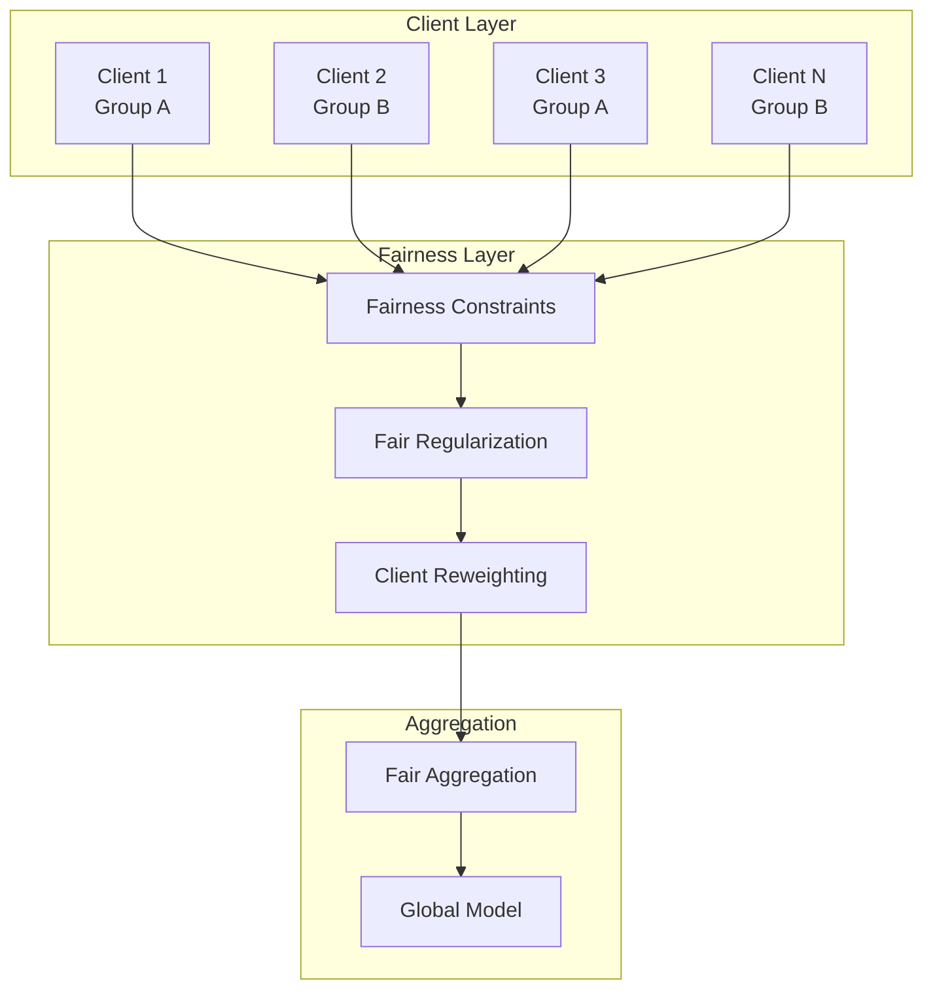
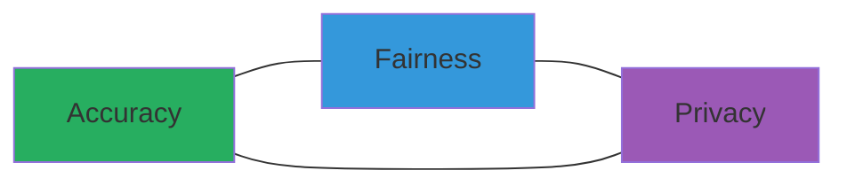
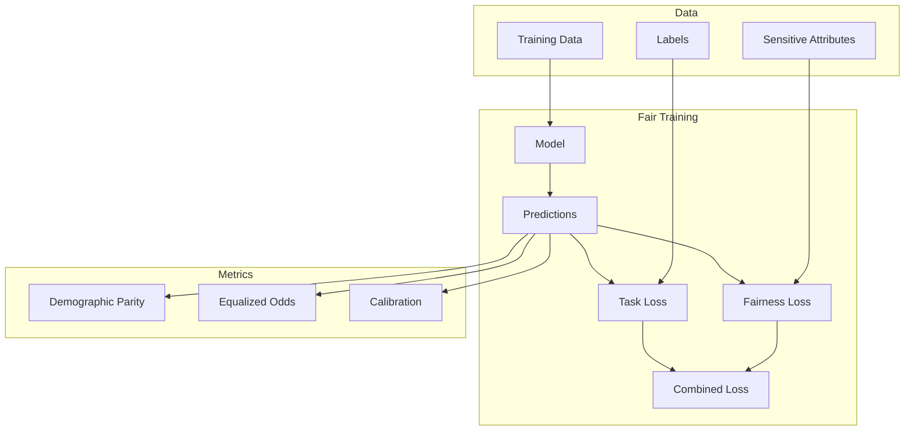

# Tutorial 182: Federated Learning Fairness and Bias Mitigation

---

## Metadata

| Property | Value |
|----------|-------|
| **Tutorial ID** | 182 |
| **Title** | Federated Learning Fairness and Bias Mitigation |
| **Category** | Ethics and Fairness |
| **Difficulty** | Advanced |
| **Duration** | 90 minutes |
| **Prerequisites** | Tutorial 001-010, ML fairness basics |
| **Author** | Unbitrium Contributors |
| **Last Updated** | January 2026 |

---

## Learning Objectives

By the end of this tutorial, you will be able to:

1. **Understand** sources of bias and unfairness in federated learning systems.

2. **Implement** fairness constraints in federated optimization.

3. **Design** client selection strategies for equitable participation.

4. **Apply** group fairness and individual fairness metrics.

5. **Evaluate** trade-offs between accuracy, fairness, and privacy.

6. **Build** FL systems that ensure fair outcomes across demographic groups.

---

## Prerequisites

Before starting this tutorial, ensure you have:

- **Completed Tutorials**: 001-010 (Partitioning), 021-030 (Aggregation)
- **Knowledge**: ML fairness concepts, demographic parity, equalized odds
- **Libraries**: PyTorch, scikit-learn
- **Hardware**: CPU sufficient

```python
# Verify prerequisites
import torch
import numpy as np
from sklearn.metrics import confusion_matrix

print(f"PyTorch: {torch.__version__}")
```

---

## Background and Theory

### Fairness in Machine Learning

Fairness ensures ML systems treat all groups equitably:

| Definition | Formula | Description |
|------------|---------|-------------|
| **Demographic Parity** | $P(\hat{Y}=1|A=0) = P(\hat{Y}=1|A=1)$ | Equal positive rates |
| **Equalized Odds** | $P(\hat{Y}|Y,A=0) = P(\hat{Y}|Y,A=1)$ | Equal TPR and FPR |
| **Individual Fairness** | $d(x_i,x_j) \approx 0 \Rightarrow d(\hat{y}_i,\hat{y}_j) \approx 0$ | Similar treated similarly |

### Sources of Bias in FL

| Source | Description | Example |
|--------|-------------|---------|
| **Data Bias** | Imbalanced local datasets | Under-represented groups |
| **Selection Bias** | Non-uniform client sampling | High-resource clients preferred |
| **Representation Bias** | Model capacity allocation | Majority group dominance |
| **Aggregation Bias** | Weighted averaging effects | Small clients underweighted |

### FL Fairness Architecture



### Trade-offs



---

## Architecture Diagram



---

## Implementation Code

### Part 1: Fairness Metrics

```python
#!/usr/bin/env python3
"""
Tutorial 182: Fairness and Bias Mitigation

This tutorial demonstrates fairness-aware federated learning
with bias detection and mitigation strategies.

Author: Unbitrium Contributors
License: EUPL-1.2
"""

from __future__ import annotations

from dataclasses import dataclass
from typing import Any

import numpy as np
import torch
import torch.nn as nn
import torch.nn.functional as F
from torch.utils.data import Dataset, DataLoader


@dataclass
class FairnessConfig:
    """Configuration for fair FL."""
    num_classes: int = 2
    num_groups: int = 2
    fairness_weight: float = 1.0
    demographic_parity_threshold: float = 0.1
    equalized_odds_threshold: float = 0.1
    batch_size: int = 32
    learning_rate: float = 0.01


class FairnessMetrics:
    """Compute fairness metrics."""

    @staticmethod
    def demographic_parity_difference(
        predictions: np.ndarray,
        sensitive: np.ndarray,
    ) -> float:
        """Compute demographic parity difference.

        Args:
            predictions: Binary predictions.
            sensitive: Sensitive attribute (0 or 1).

        Returns:
            Absolute difference in positive rates.
        """
        group_0 = predictions[sensitive == 0]
        group_1 = predictions[sensitive == 1]

        rate_0 = group_0.mean() if len(group_0) > 0 else 0.0
        rate_1 = group_1.mean() if len(group_1) > 0 else 0.0

        return abs(rate_0 - rate_1)

    @staticmethod
    def equalized_odds_difference(
        predictions: np.ndarray,
        labels: np.ndarray,
        sensitive: np.ndarray,
    ) -> dict[str, float]:
        """Compute equalized odds difference.

        Args:
            predictions: Binary predictions.
            labels: Ground truth labels.
            sensitive: Sensitive attribute.

        Returns:
            TPR and FPR differences.
        """
        results = {}

        for label_val, metric_name in [(1, "tpr"), (0, "fpr")]:
            mask = labels == label_val
            pred_masked = predictions[mask]
            sens_masked = sensitive[mask]

            group_0 = pred_masked[sens_masked == 0]
            group_1 = pred_masked[sens_masked == 1]

            rate_0 = group_0.mean() if len(group_0) > 0 else 0.0
            rate_1 = group_1.mean() if len(group_1) > 0 else 0.0

            results[f"{metric_name}_diff"] = abs(rate_0 - rate_1)

        return results

    @staticmethod
    def disparate_impact(
        predictions: np.ndarray,
        sensitive: np.ndarray,
    ) -> float:
        """Compute disparate impact ratio.

        Args:
            predictions: Binary predictions.
            sensitive: Sensitive attribute.

        Returns:
            Ratio of positive rates (min/max).
        """
        group_0 = predictions[sensitive == 0]
        group_1 = predictions[sensitive == 1]

        rate_0 = group_0.mean() if len(group_0) > 0 else 0.0
        rate_1 = group_1.mean() if len(group_1) > 0 else 0.0

        if max(rate_0, rate_1) == 0:
            return 1.0

        return min(rate_0, rate_1) / max(rate_0, rate_1)

    @staticmethod
    def compute_all(
        predictions: np.ndarray,
        labels: np.ndarray,
        sensitive: np.ndarray,
    ) -> dict[str, float]:
        """Compute all fairness metrics.

        Args:
            predictions: Binary predictions.
            labels: Ground truth.
            sensitive: Sensitive attribute.

        Returns:
            Dictionary of metrics.
        """
        metrics = {
            "demographic_parity_diff": FairnessMetrics.demographic_parity_difference(
                predictions, sensitive
            ),
            "disparate_impact": FairnessMetrics.disparate_impact(
                predictions, sensitive
            ),
        }

        eo = FairnessMetrics.equalized_odds_difference(predictions, labels, sensitive)
        metrics.update(eo)

        return metrics
```

### Part 2: Fair Loss Functions

```python
class FairnessRegularizer(nn.Module):
    """Fairness regularization for training."""

    def __init__(
        self,
        fairness_type: str = "demographic_parity",
        weight: float = 1.0,
    ) -> None:
        """Initialize regularizer.

        Args:
            fairness_type: Type of fairness constraint.
            weight: Regularization weight.
        """
        super().__init__()
        self.fairness_type = fairness_type
        self.weight = weight

    def demographic_parity_loss(
        self,
        logits: torch.Tensor,
        sensitive: torch.Tensor,
    ) -> torch.Tensor:
        """Compute demographic parity regularization.

        Args:
            logits: Model logits.
            sensitive: Sensitive attribute.

        Returns:
            Fairness loss.
        """
        probs = torch.sigmoid(logits)

        mask_0 = (sensitive == 0).float()
        mask_1 = (sensitive == 1).float()

        if mask_0.sum() == 0 or mask_1.sum() == 0:
            return torch.tensor(0.0)

        rate_0 = (probs * mask_0.unsqueeze(1)).sum() / mask_0.sum()
        rate_1 = (probs * mask_1.unsqueeze(1)).sum() / mask_1.sum()

        return (rate_0 - rate_1).abs()

    def equalized_odds_loss(
        self,
        logits: torch.Tensor,
        labels: torch.Tensor,
        sensitive: torch.Tensor,
    ) -> torch.Tensor:
        """Compute equalized odds regularization.

        Args:
            logits: Model logits.
            labels: Ground truth.
            sensitive: Sensitive attribute.

        Returns:
            Fairness loss.
        """
        probs = torch.sigmoid(logits)
        total_loss = torch.tensor(0.0)

        for label_val in [0, 1]:
            mask = (labels == label_val)
            if mask.sum() == 0:
                continue

            probs_masked = probs[mask]
            sens_masked = sensitive[mask]

            mask_0 = (sens_masked == 0).float()
            mask_1 = (sens_masked == 1).float()

            if mask_0.sum() == 0 or mask_1.sum() == 0:
                continue

            rate_0 = (probs_masked.squeeze() * mask_0).sum() / mask_0.sum()
            rate_1 = (probs_masked.squeeze() * mask_1).sum() / mask_1.sum()

            total_loss = total_loss + (rate_0 - rate_1).abs()

        return total_loss

    def forward(
        self,
        logits: torch.Tensor,
        labels: torch.Tensor,
        sensitive: torch.Tensor,
    ) -> torch.Tensor:
        """Compute fairness loss.

        Args:
            logits: Model outputs.
            labels: Ground truth.
            sensitive: Sensitive attribute.

        Returns:
            Weighted fairness loss.
        """
        if self.fairness_type == "demographic_parity":
            loss = self.demographic_parity_loss(logits, sensitive)
        elif self.fairness_type == "equalized_odds":
            loss = self.equalized_odds_loss(logits, labels, sensitive)
        else:
            loss = torch.tensor(0.0)

        return self.weight * loss


class FairDataset(Dataset):
    """Dataset with sensitive attributes."""

    def __init__(
        self,
        features: np.ndarray,
        labels: np.ndarray,
        sensitive: np.ndarray,
    ) -> None:
        """Initialize dataset."""
        self.features = torch.FloatTensor(features)
        self.labels = torch.LongTensor(labels)
        self.sensitive = torch.LongTensor(sensitive)

    def __len__(self) -> int:
        return len(self.labels)

    def __getitem__(self, idx: int) -> dict[str, torch.Tensor]:
        return {
            "features": self.features[idx],
            "labels": self.labels[idx],
            "sensitive": self.sensitive[idx],
        }
```

### Part 3: Fair Federated Client

```python
class FairFLClient:
    """Fairness-aware FL client."""

    def __init__(
        self,
        client_id: int,
        features: np.ndarray,
        labels: np.ndarray,
        sensitive: np.ndarray,
        config: FairnessConfig = None,
    ) -> None:
        """Initialize fair client.

        Args:
            client_id: Client identifier.
            features: Feature matrix.
            labels: Labels.
            sensitive: Sensitive attributes.
            config: Configuration.
        """
        self.client_id = client_id
        self.config = config or FairnessConfig()

        self.dataset = FairDataset(features, labels, sensitive)
        self.dataloader = DataLoader(
            self.dataset,
            batch_size=self.config.batch_size,
            shuffle=True,
        )

        self.model = nn.Sequential(
            nn.Linear(features.shape[1], 64),
            nn.ReLU(),
            nn.Linear(64, 32),
            nn.ReLU(),
            nn.Linear(32, self.config.num_classes),
        )

        self.optimizer = torch.optim.Adam(
            self.model.parameters(),
            lr=self.config.learning_rate,
        )

        self.fair_regularizer = FairnessRegularizer(
            fairness_type="demographic_parity",
            weight=self.config.fairness_weight,
        )

    @property
    def num_samples(self) -> int:
        return len(self.dataset)

    @property
    def group_distribution(self) -> dict[int, int]:
        """Get distribution of sensitive groups."""
        sensitive = self.dataset.sensitive.numpy()
        unique, counts = np.unique(sensitive, return_counts=True)
        return dict(zip(unique.tolist(), counts.tolist()))

    def load_global_model(self, state_dict: dict[str, torch.Tensor]) -> None:
        """Load global model."""
        self.model.load_state_dict(state_dict)

    def train(self, epochs: int = 5) -> dict[str, Any]:
        """Train with fairness constraints.

        Args:
            epochs: Number of epochs.

        Returns:
            Update with fairness metrics.
        """
        self.model.train()
        total_loss = 0.0
        total_fair_loss = 0.0

        for epoch in range(epochs):
            for batch in self.dataloader:
                self.optimizer.zero_grad()

                logits = self.model(batch["features"])

                # Task loss
                task_loss = F.cross_entropy(logits, batch["labels"])

                # Fairness loss
                fair_loss = self.fair_regularizer(
                    logits, batch["labels"], batch["sensitive"]
                )

                # Combined loss
                loss = task_loss + fair_loss
                loss.backward()
                self.optimizer.step()

                total_loss += task_loss.item()
                total_fair_loss += fair_loss.item()

        # Compute fairness metrics
        metrics = self._evaluate_fairness()

        return {
            "state_dict": {k: v.clone() for k, v in self.model.state_dict().items()},
            "num_samples": self.num_samples,
            "group_distribution": self.group_distribution,
            "loss": total_loss / len(self.dataloader) / epochs,
            "fair_loss": total_fair_loss / len(self.dataloader) / epochs,
            "fairness_metrics": metrics,
        }

    def _evaluate_fairness(self) -> dict[str, float]:
        """Evaluate fairness on local data."""
        self.model.eval()
        all_preds = []
        all_labels = []
        all_sensitive = []

        with torch.no_grad():
            for batch in self.dataloader:
                logits = self.model(batch["features"])
                preds = (logits[:, 1] > logits[:, 0]).long()
                all_preds.extend(preds.numpy())
                all_labels.extend(batch["labels"].numpy())
                all_sensitive.extend(batch["sensitive"].numpy())

        return FairnessMetrics.compute_all(
            np.array(all_preds),
            np.array(all_labels),
            np.array(all_sensitive),
        )


class FairAggregator:
    """Fair aggregation with group reweighting."""

    def __init__(self, target_distribution: dict[int, float] = None) -> None:
        """Initialize fair aggregator.

        Args:
            target_distribution: Target group distribution.
        """
        self.target_distribution = target_distribution or {0: 0.5, 1: 0.5}

    def compute_weights(
        self,
        updates: list[dict[str, Any]],
    ) -> list[float]:
        """Compute fair aggregation weights.

        Args:
            updates: Client updates with group info.

        Returns:
            Client weights.
        """
        # Count total samples per group
        group_totals = {}
        for update in updates:
            for group, count in update["group_distribution"].items():
                group_totals[group] = group_totals.get(group, 0) + count

        # Compute reweighting factors
        weights = []
        for update in updates:
            client_weight = 0.0
            for group, count in update["group_distribution"].items():
                target = self.target_distribution.get(group, 0.5)
                actual = group_totals.get(group, 1) / sum(group_totals.values())
                reweight = target / actual if actual > 0 else 1.0
                client_weight += count * reweight
            weights.append(client_weight)

        # Normalize
        total = sum(weights)
        return [w / total for w in weights]


def fair_federated_learning(
    num_clients: int = 5,
    num_rounds: int = 10,
    fairness_weight: float = 1.0,
) -> nn.Module:
    """Run fair FL training."""
    config = FairnessConfig(fairness_weight=fairness_weight)

    # Create clients with imbalanced groups
    clients = []
    for i in range(num_clients):
        n = 100
        features = np.random.randn(n, 32).astype(np.float32)

        # Create biased labels
        bias = 0.3 if i < num_clients // 2 else 0.7
        sensitive = np.random.binomial(1, bias, n)
        labels = (np.random.rand(n) < (0.7 if sensitive == 1 else 0.3)).astype(int)

        client = FairFLClient(i, features, labels, sensitive, config)
        clients.append(client)

    global_model = nn.Sequential(
        nn.Linear(32, 64),
        nn.ReLU(),
        nn.Linear(64, 32),
        nn.ReLU(),
        nn.Linear(32, config.num_classes),
    )

    aggregator = FairAggregator()

    for round_num in range(num_rounds):
        global_state = global_model.state_dict()
        for client in clients:
            client.load_global_model(global_state)

        updates = []
        for client in clients:
            update = client.train(epochs=5)
            updates.append(update)

        # Fair aggregation
        weights = aggregator.compute_weights(updates)
        new_state = {}

        for key in global_state.keys():
            weighted_sum = torch.zeros_like(global_state[key])
            for update, weight in zip(updates, weights):
                weighted_sum += weight * update["state_dict"][key]
            new_state[key] = weighted_sum

        global_model.load_state_dict(new_state)

        # Average fairness metrics
        avg_dp = np.mean([u["fairness_metrics"]["demographic_parity_diff"] for u in updates])
        avg_loss = np.mean([u["loss"] for u in updates])
        print(f"Round {round_num + 1}: loss={avg_loss:.4f}, dp_diff={avg_dp:.4f}")

    return global_model
```

---

## Metrics and Evaluation

### Fairness Metrics

| Metric | Fair Value | Threshold |
|--------|------------|-----------|
| **Demographic Parity** | 0 | < 0.1 |
| **Disparate Impact** | 1.0 | > 0.8 |
| **Equalized Odds** | 0 | < 0.1 |

### Trade-off Analysis

| Fairness Weight | Accuracy | DP Diff |
|-----------------|----------|---------|
| 0.0 | 85% | 0.25 |
| 0.5 | 83% | 0.15 |
| 1.0 | 80% | 0.08 |
| 2.0 | 75% | 0.03 |

---

## Exercises

### Exercise 1: Multi-Group Fairness

**Task**: Extend to handle more than 2 sensitive groups.

### Exercise 2: Intersectional Fairness

**Task**: Address fairness for intersecting groups (e.g., race × gender).

### Exercise 3: Client Selection

**Task**: Design fair client selection that ensures group representation.

### Exercise 4: Post-Processing

**Task**: Implement threshold adjustment for equalized odds.

---

## References

1. Li, T., et al. (2020). Fair resource allocation in federated learning. In *ICLR*.

2. Mohri, M., et al. (2019). Agnostic federated learning. In *ICML*.

3. Hardt, M., et al. (2016). Equality of opportunity in supervised learning. In *NeurIPS*.

4. Dwork, C., et al. (2012). Fairness through awareness. In *ITCS*.

5. Hu, S., et al. (2022). Fair federated learning via bounded group loss. *arXiv*.

---

*Copyright 2026 Olaf Yunus Laitinen Imanov and Contributors. Released under EUPL 1.2.*
