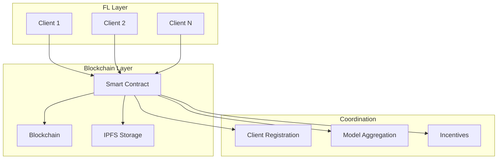
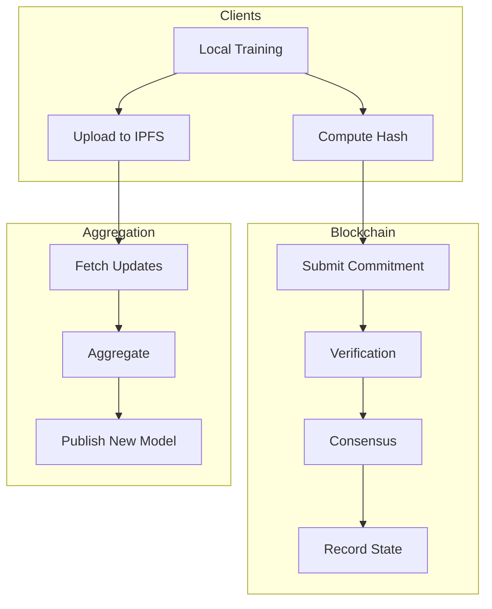

# Tutorial 183: Federated Learning with Blockchain Integration

---

## Metadata

| Property | Value |
|----------|-------|
| **Tutorial ID** | 183 |
| **Title** | Federated Learning with Blockchain Integration |
| **Category** | Advanced Topics |
| **Difficulty** | Advanced |
| **Duration** | 90 minutes |
| **Prerequisites** | Tutorial 001-010, Blockchain basics |
| **Author** | Unbitrium Contributors |
| **Last Updated** | January 2026 |

---

## Learning Objectives

By the end of this tutorial, you will be able to:

1. **Understand** the synergies between federated learning and blockchain technology.

2. **Implement** smart contract-based FL coordination and incentive mechanisms.

3. **Design** decentralized model aggregation using blockchain consensus.

4. **Apply** blockchain for immutable audit trails of FL training.

5. **Evaluate** the trade-offs between decentralization and efficiency.

6. **Build** trustless FL systems without centralized coordinators.

---

## Prerequisites

Before starting this tutorial, ensure you have:

- **Completed Tutorials**: 001-010 (Partitioning), 021-030 (Aggregation)
- **Knowledge**: Blockchain fundamentals, smart contracts, consensus mechanisms
- **Libraries**: PyTorch, web3.py (optional)
- **Hardware**: Standard compute

```python
# Verify prerequisites
import torch
import numpy as np
import hashlib

print(f"PyTorch: {torch.__version__}")
print("Blockchain simulation ready")
```

---

## Background and Theory

### Blockchain Fundamentals

Blockchain provides a decentralized, immutable ledger:

| Property | Description | FL Benefit |
|----------|-------------|------------|
| **Immutability** | Records cannot be altered | Audit trail |
| **Decentralization** | No single point of failure | No central server |
| **Transparency** | All participants see same state | Verifiability |
| **Consensus** | Agreement on state | Fair aggregation |

### Blockchain-FL Integration Points



### Smart Contract Functions

| Function | Purpose |
|----------|---------|
| `registerClient()` | Join FL network |
| `submitUpdate()` | Submit model update hash |
| `verifyUpdate()` | Validate contribution |
| `aggregateModels()` | Trigger aggregation |
| `distributeRewards()` | Pay contributors |

### Consensus for FL

| Mechanism | Description | Use Case |
|-----------|-------------|----------|
| **PoW** | Proof of Work | High security |
| **PoS** | Proof of Stake | Energy efficient |
| **PoL** | Proof of Learning | FL-specific |

---

## Architecture Diagram



---

## Implementation Code

### Part 1: Blockchain Simulation

```python
#!/usr/bin/env python3
"""
Tutorial 183: Federated Learning with Blockchain Integration

This tutorial demonstrates blockchain-coordinated federated learning
with smart contracts for registration, aggregation, and incentives.

Author: Unbitrium Contributors
License: EUPL-1.2
"""

from __future__ import annotations

import hashlib
import time
from dataclasses import dataclass, field
from typing import Any

import numpy as np
import torch
import torch.nn as nn
from torch.utils.data import Dataset, DataLoader


@dataclass
class BlockchainConfig:
    """Configuration for blockchain-FL integration."""
    block_time: float = 5.0  # Seconds between blocks
    min_stake: float = 100.0  # Minimum stake to participate
    reward_per_round: float = 10.0
    gas_price: float = 0.001
    confirmation_blocks: int = 3


@dataclass
class Transaction:
    """Blockchain transaction."""
    sender: str
    action: str
    data: dict
    timestamp: float = field(default_factory=time.time)
    signature: str = ""

    def hash(self) -> str:
        """Compute transaction hash."""
        content = f"{self.sender}{self.action}{self.data}{self.timestamp}"
        return hashlib.sha256(content.encode()).hexdigest()

    def sign(self, private_key: str) -> None:
        """Sign transaction (simplified)."""
        self.signature = hashlib.sha256(
            f"{self.hash()}{private_key}".encode()
        ).hexdigest()[:16]


@dataclass
class Block:
    """Blockchain block."""
    index: int
    previous_hash: str
    transactions: list[Transaction]
    timestamp: float = field(default_factory=time.time)
    nonce: int = 0

    def hash(self) -> str:
        """Compute block hash."""
        tx_hashes = [tx.hash() for tx in self.transactions]
        content = f"{self.index}{self.previous_hash}{tx_hashes}{self.timestamp}{self.nonce}"
        return hashlib.sha256(content.encode()).hexdigest()


class Blockchain:
    """Simple blockchain implementation."""

    def __init__(self, difficulty: int = 2) -> None:
        """Initialize blockchain.

        Args:
            difficulty: Mining difficulty (leading zeros).
        """
        self.chain: list[Block] = []
        self.pending_transactions: list[Transaction] = []
        self.difficulty = difficulty

        # Create genesis block
        genesis = Block(
            index=0,
            previous_hash="0" * 64,
            transactions=[],
        )
        self.chain.append(genesis)

    def add_transaction(self, tx: Transaction) -> bool:
        """Add transaction to pending pool."""
        if self._verify_transaction(tx):
            self.pending_transactions.append(tx)
            return True
        return False

    def _verify_transaction(self, tx: Transaction) -> bool:
        """Verify transaction validity."""
        # Simplified verification
        return len(tx.signature) > 0 and tx.sender != ""

    def mine_block(self) -> Block:
        """Mine new block with pending transactions."""
        new_block = Block(
            index=len(self.chain),
            previous_hash=self.chain[-1].hash(),
            transactions=self.pending_transactions[:],
        )

        # Simple PoW
        target = "0" * self.difficulty
        while not new_block.hash().startswith(target):
            new_block.nonce += 1

        self.chain.append(new_block)
        self.pending_transactions.clear()
        return new_block

    def get_latest_block(self) -> Block:
        """Get most recent block."""
        return self.chain[-1]

    def is_valid(self) -> bool:
        """Verify blockchain integrity."""
        for i in range(1, len(self.chain)):
            current = self.chain[i]
            previous = self.chain[i - 1]

            if current.previous_hash != previous.hash():
                return False

        return True


class SmartContract:
    """FL coordination smart contract."""

    def __init__(self, blockchain: Blockchain) -> None:
        """Initialize smart contract.

        Args:
            blockchain: Blockchain instance.
        """
        self.blockchain = blockchain
        self.clients: dict[str, dict] = {}  # client_id -> info
        self.round_updates: dict[int, list] = {}  # round -> updates
        self.current_round: int = 0
        self.model_hashes: dict[int, str] = {}  # round -> global model hash
        self.balances: dict[str, float] = {}

    def register_client(
        self,
        client_id: str,
        stake: float,
        compute_power: float,
    ) -> bool:
        """Register new FL client.

        Args:
            client_id: Client identifier.
            stake: Staked tokens.
            compute_power: Relative compute capability.

        Returns:
            Success status.
        """
        if stake < 100.0:  # Minimum stake
            return False

        self.clients[client_id] = {
            "stake": stake,
            "compute_power": compute_power,
            "reputation": 1.0,
            "rounds_participated": 0,
        }
        self.balances[client_id] = 0.0

        # Record on blockchain
        tx = Transaction(
            sender=client_id,
            action="REGISTER",
            data={"stake": stake, "compute": compute_power},
        )
        tx.sign(client_id)
        self.blockchain.add_transaction(tx)

        return True

    def submit_update(
        self,
        client_id: str,
        update_hash: str,
        num_samples: int,
    ) -> bool:
        """Submit model update for current round.

        Args:
            client_id: Client identifier.
            update_hash: Hash of model update.
            num_samples: Number of training samples.

        Returns:
            Success status.
        """
        if client_id not in self.clients:
            return False

        if self.current_round not in self.round_updates:
            self.round_updates[self.current_round] = []

        self.round_updates[self.current_round].append({
            "client_id": client_id,
            "update_hash": update_hash,
            "num_samples": num_samples,
            "timestamp": time.time(),
        })

        # Record commitment on blockchain
        tx = Transaction(
            sender=client_id,
            action="SUBMIT_UPDATE",
            data={
                "round": self.current_round,
                "hash": update_hash,
                "samples": num_samples,
            },
        )
        tx.sign(client_id)
        self.blockchain.add_transaction(tx)

        return True

    def finalize_round(self, aggregated_hash: str) -> None:
        """Finalize round and distribute rewards.

        Args:
            aggregated_hash: Hash of aggregated model.
        """
        # Record aggregation result
        self.model_hashes[self.current_round] = aggregated_hash

        # Distribute rewards
        updates = self.round_updates.get(self.current_round, [])
        total_samples = sum(u["num_samples"] for u in updates)

        for update in updates:
            client_id = update["client_id"]
            contribution = update["num_samples"] / total_samples
            reward = 10.0 * contribution  # Base reward

            self.balances[client_id] += reward
            self.clients[client_id]["rounds_participated"] += 1

        # Mine block with round results
        tx = Transaction(
            sender="SYSTEM",
            action="FINALIZE_ROUND",
            data={
                "round": self.current_round,
                "model_hash": aggregated_hash,
                "participants": len(updates),
            },
        )
        tx.sign("SYSTEM")
        self.blockchain.add_transaction(tx)
        self.blockchain.mine_block()

        self.current_round += 1
```

### Part 2: Blockchain-Integrated FL Client

```python
class BlockchainFLClient:
    """FL client with blockchain integration."""

    def __init__(
        self,
        client_id: str,
        contract: SmartContract,
        data: tuple[np.ndarray, np.ndarray],
        stake: float = 100.0,
    ) -> None:
        """Initialize blockchain FL client.

        Args:
            client_id: Unique client identifier.
            contract: Smart contract instance.
            data: Tuple of (features, labels).
            stake: Stake amount.
        """
        self.client_id = client_id
        self.contract = contract

        # Register on blockchain
        self.contract.register_client(
            client_id=client_id,
            stake=stake,
            compute_power=1.0,
        )

        # Local data
        features, labels = data
        self.dataset = SimpleDataset(features, labels)
        self.dataloader = DataLoader(self.dataset, batch_size=32, shuffle=True)

        # Model
        self.model = SimpleModel(input_dim=features.shape[1])
        self.optimizer = torch.optim.SGD(self.model.parameters(), lr=0.01)
        self.criterion = nn.CrossEntropyLoss()

    def load_global_model(self, state_dict: dict[str, torch.Tensor]) -> None:
        """Load global model from IPFS/storage."""
        self.model.load_state_dict(state_dict)

    def train(self, epochs: int = 5) -> dict[str, Any]:
        """Train and submit update to blockchain."""
        self.model.train()
        total_loss = 0.0

        for epoch in range(epochs):
            for features, labels in self.dataloader:
                self.optimizer.zero_grad()
                outputs = self.model(features)
                loss = self.criterion(outputs, labels)
                loss.backward()
                self.optimizer.step()
                total_loss += loss.item()

        # Compute update hash
        state_dict = self.model.state_dict()
        update_hash = self._compute_hash(state_dict)

        # Submit to blockchain
        self.contract.submit_update(
            client_id=self.client_id,
            update_hash=update_hash,
            num_samples=len(self.dataset),
        )

        return {
            "state_dict": {k: v.clone() for k, v in state_dict.items()},
            "update_hash": update_hash,
            "num_samples": len(self.dataset),
            "loss": total_loss / len(self.dataloader) / epochs,
        }

    def _compute_hash(self, state_dict: dict[str, torch.Tensor]) -> str:
        """Compute hash of model state."""
        content = ""
        for key in sorted(state_dict.keys()):
            content += f"{key}:{state_dict[key].numpy().tobytes().hex()[:32]}"
        return hashlib.sha256(content.encode()).hexdigest()


class SimpleDataset(Dataset):
    """Simple dataset for demos."""

    def __init__(self, features: np.ndarray, labels: np.ndarray):
        self.features = torch.FloatTensor(features)
        self.labels = torch.LongTensor(labels)

    def __len__(self):
        return len(self.labels)

    def __getitem__(self, idx):
        return self.features[idx], self.labels[idx]


class SimpleModel(nn.Module):
    """Simple model for demos."""

    def __init__(self, input_dim: int = 32, num_classes: int = 5):
        super().__init__()
        self.fc1 = nn.Linear(input_dim, 64)
        self.fc2 = nn.Linear(64, num_classes)

    def forward(self, x):
        x = torch.relu(self.fc1(x))
        return self.fc2(x)
```

### Part 3: Blockchain FL Orchestration

```python
def blockchain_federated_learning(
    num_clients: int = 5,
    num_rounds: int = 10,
    local_epochs: int = 5,
) -> tuple[nn.Module, Blockchain]:
    """Run blockchain-coordinated FL.

    Args:
        num_clients: Number of clients.
        num_rounds: Training rounds.
        local_epochs: Local epochs per round.

    Returns:
        Tuple of (global model, blockchain).
    """
    # Initialize blockchain and contract
    blockchain = Blockchain(difficulty=2)
    contract = SmartContract(blockchain)

    # Create clients
    clients = []
    for i in range(num_clients):
        features = np.random.randn(200, 32).astype(np.float32)
        labels = np.random.randint(0, 5, 200)
        client = BlockchainFLClient(
            client_id=f"client_{i}",
            contract=contract,
            data=(features, labels),
            stake=100.0 + i * 10,
        )
        clients.append(client)

    # Global model
    global_model = SimpleModel(input_dim=32)

    print(f"Blockchain FL: {num_clients} clients registered")
    print(f"Initial chain length: {len(blockchain.chain)}")

    for round_num in range(num_rounds):
        # Distribute global model
        global_state = global_model.state_dict()
        for client in clients:
            client.load_global_model(global_state)

        # Collect updates
        updates = []
        for client in clients:
            update = client.train(epochs=local_epochs)
            updates.append(update)

        # Aggregate (off-chain for efficiency)
        total_samples = sum(u["num_samples"] for u in updates)
        new_state = {}
        for key in global_state.keys():
            weighted_sum = torch.zeros_like(global_state[key])
            for update in updates:
                weight = update["num_samples"] / total_samples
                weighted_sum += weight * update["state_dict"][key]
            new_state[key] = weighted_sum

        global_model.load_state_dict(new_state)

        # Compute aggregated hash
        agg_hash = hashlib.sha256(
            str(new_state).encode()
        ).hexdigest()

        # Finalize on blockchain
        contract.finalize_round(agg_hash)

        avg_loss = np.mean([u["loss"] for u in updates])
        print(f"Round {round_num + 1}/{num_rounds}: "
              f"loss={avg_loss:.4f}, "
              f"blocks={len(blockchain.chain)}")

    print(f"\nFinal chain length: {len(blockchain.chain)}")
    print(f"Blockchain valid: {blockchain.is_valid()}")

    # Print balances
    print("\nClient Balances:")
    for client_id, balance in contract.balances.items():
        print(f"  {client_id}: {balance:.2f} tokens")

    return global_model, blockchain


if __name__ == "__main__":
    model, chain = blockchain_federated_learning()
```

---

## Metrics and Evaluation

### Blockchain Metrics

| Metric | Description | Target |
|--------|-------------|--------|
| **Block Time** | Time between blocks | < 10s |
| **Finality** | Confirmation time | < 1 min |
| **TPS** | Transactions per second | > 100 |
| **Gas Cost** | Transaction cost | Minimize |

### FL Performance

| Setting | Overhead | Benefit |
|---------|----------|---------|
| Centralized | None | Fast |
| Blockchain | 10-50% | Trustless |

---

## Exercises

### Exercise 1: Proof of Learning

**Task**: Implement a consensus mechanism where mining difficulty depends on FL contribution quality.

### Exercise 2: Incentive Design

**Task**: Design a token economy that rewards high-quality contributions.

### Exercise 3: IPFS Integration

**Task**: Store model updates on IPFS and only commit hashes to blockchain.

### Exercise 4: Slashing Mechanism

**Task**: Implement penalties for malicious or low-quality updates.

---

## References

1. Kim, H., et al. (2019). Blockchained on-device federated learning. *IEEE Communications Letters*.

2. Lu, Y., et al. (2020). Blockchain and federated learning for privacy-preserved data sharing. *IEEE Network*.

3. Pokhrel, S. R., & Choi, J. (2020). Federated learning with blockchain for autonomous vehicles. *IEEE TITS*.

4. Qu, Y., et al. (2020). Decentralized privacy using blockchain-enabled federated learning. *IEEE IOTJ*.

5. Nakamoto, S. (2008). Bitcoin: A peer-to-peer electronic cash system.

---

*Copyright 2026 Olaf Yunus Laitinen Imanov and Contributors. Released under EUPL 1.2.*
