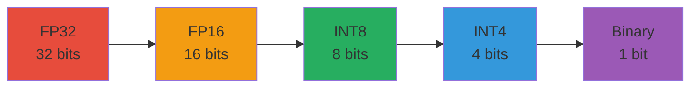
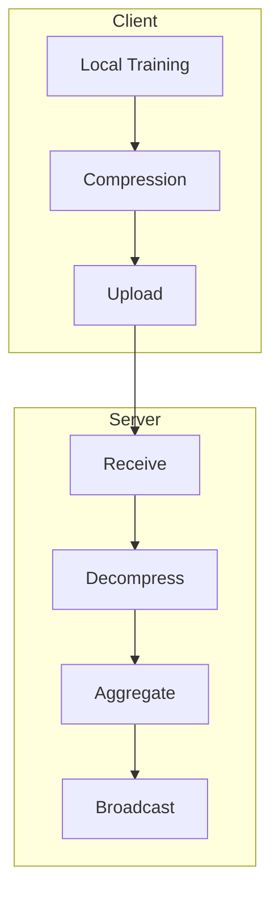
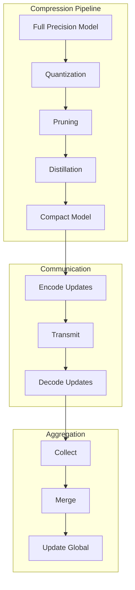

# Tutorial 184: Federated Learning Model Compression and Quantization

---

## Metadata

| Property | Value |
|----------|-------|
| **Tutorial ID** | 184 |
| **Title** | Federated Learning Model Compression and Quantization |
| **Category** | Optimization |
| **Difficulty** | Advanced |
| **Duration** | 90 minutes |
| **Prerequisites** | Tutorial 001-010, Neural network basics |
| **Author** | Unbitrium Contributors |
| **Last Updated** | January 2026 |

---

## Learning Objectives

By the end of this tutorial, you will be able to:

1. **Understand** why model compression is critical for federated learning efficiency.

2. **Implement** weight quantization techniques for reduced communication.

3. **Design** pruning strategies compatible with federated aggregation.

4. **Apply** knowledge distillation for model size reduction.

5. **Evaluate** compression trade-offs between size, accuracy, and training time.

6. **Build** bandwidth-efficient FL systems for resource-constrained environments.

---

## Prerequisites

Before starting this tutorial, ensure you have:

- **Completed Tutorials**: 001-010 (Partitioning), 021-030 (Aggregation)
- **Knowledge**: Neural network architectures, optimization
- **Libraries**: PyTorch
- **Hardware**: CPU sufficient

```python
# Verify prerequisites
import torch
import torch.nn as nn
import numpy as np

print(f"PyTorch: {torch.__version__}")
```

---

## Background and Theory

### Why Compression in FL?

Communication is the primary bottleneck in federated learning:

| Factor | Impact |
|--------|--------|
| **Bandwidth** | Limited upload speed on edge devices |
| **Latency** | Round-trip time for model sync |
| **Cost** | Data transfer charges |
| **Energy** | Battery consumption for transmission |

### Compression Techniques

| Technique | Compression | Accuracy Impact |
|-----------|-------------|-----------------|
| **Quantization** | 4-32x | Minimal |
| **Pruning** | 2-10x | Moderate |
| **Low-rank** | 2-4x | Minimal |
| **Sparsification** | 10-100x | Variable |

### Quantization Levels



### Federated Compression Architecture



---

## Architecture Diagram



---

## Implementation Code

### Part 1: Quantization

```python
#!/usr/bin/env python3
"""
Tutorial 184: Model Compression and Quantization

This tutorial demonstrates compression techniques for
bandwidth-efficient federated learning.

Author: Unbitrium Contributors
License: EUPL-1.2
"""

from __future__ import annotations

from dataclasses import dataclass
from typing import Any

import numpy as np
import torch
import torch.nn as nn
import torch.nn.functional as F
from torch.utils.data import Dataset, DataLoader


@dataclass
class CompressionConfig:
    """Configuration for model compression."""
    quantization_bits: int = 8
    pruning_ratio: float = 0.5
    sparsification_ratio: float = 0.1
    distillation_temp: float = 3.0
    batch_size: int = 32
    learning_rate: float = 0.01


class Quantizer:
    """Weight quantization utilities."""

    def __init__(self, bits: int = 8) -> None:
        """Initialize quantizer.

        Args:
            bits: Number of bits for quantization.
        """
        self.bits = bits
        self.levels = 2 ** bits
        self.max_val = (self.levels - 1) // 2
        self.min_val = -self.max_val - 1

    def quantize(
        self,
        tensor: torch.Tensor,
    ) -> tuple[torch.Tensor, float, float]:
        """Quantize tensor to fixed-point.

        Args:
            tensor: Float tensor to quantize.

        Returns:
            Tuple of (quantized, scale, zero_point).
        """
        min_val = tensor.min().item()
        max_val = tensor.max().item()

        scale = (max_val - min_val) / (self.levels - 1) if max_val != min_val else 1.0
        zero_point = min_val

        quantized = ((tensor - zero_point) / scale).round().clamp(0, self.levels - 1)

        if self.bits <= 8:
            quantized = quantized.to(torch.int8)
        else:
            quantized = quantized.to(torch.int16)

        return quantized, scale, zero_point

    def dequantize(
        self,
        quantized: torch.Tensor,
        scale: float,
        zero_point: float,
    ) -> torch.Tensor:
        """Dequantize back to float.

        Args:
            quantized: Quantized tensor.
            scale: Quantization scale.
            zero_point: Quantization zero point.

        Returns:
            Dequantized float tensor.
        """
        return quantized.float() * scale + zero_point

    def quantize_model(
        self,
        state_dict: dict[str, torch.Tensor],
    ) -> dict[str, Any]:
        """Quantize entire model state.

        Args:
            state_dict: Model state dictionary.

        Returns:
            Quantized state with metadata.
        """
        quantized = {}
        for name, tensor in state_dict.items():
            if tensor.dtype == torch.float32:
                q_tensor, scale, zp = self.quantize(tensor)
                quantized[name] = {
                    "data": q_tensor,
                    "scale": scale,
                    "zero_point": zp,
                    "shape": tensor.shape,
                }
            else:
                quantized[name] = {"data": tensor}
        return quantized

    def dequantize_model(
        self,
        quantized: dict[str, Any],
    ) -> dict[str, torch.Tensor]:
        """Dequantize model state.

        Args:
            quantized: Quantized state dictionary.

        Returns:
            Float state dictionary.
        """
        state_dict = {}
        for name, q_data in quantized.items():
            if "scale" in q_data:
                tensor = self.dequantize(
                    q_data["data"],
                    q_data["scale"],
                    q_data["zero_point"],
                ).view(q_data["shape"])
                state_dict[name] = tensor
            else:
                state_dict[name] = q_data["data"]
        return state_dict

    def compute_compression_ratio(
        self,
        original: dict[str, torch.Tensor],
        quantized: dict[str, Any],
    ) -> float:
        """Compute compression ratio.

        Args:
            original: Original state dict.
            quantized: Quantized state dict.

        Returns:
            Compression ratio.
        """
        original_bits = sum(t.numel() * 32 for t in original.values())
        quantized_bits = sum(
            q["data"].numel() * self.bits + 64  # + metadata
            for q in quantized.values()
            if "data" in q
        )
        return original_bits / quantized_bits
```

### Part 2: Pruning

```python
class Pruner:
    """Weight pruning utilities."""

    def __init__(self, ratio: float = 0.5) -> None:
        """Initialize pruner.

        Args:
            ratio: Fraction of weights to prune.
        """
        self.ratio = ratio

    def magnitude_prune(
        self,
        tensor: torch.Tensor,
    ) -> tuple[torch.Tensor, torch.Tensor]:
        """Prune by magnitude.

        Args:
            tensor: Weight tensor.

        Returns:
            Tuple of (pruned_tensor, mask).
        """
        flat = tensor.abs().flatten()
        k = int(len(flat) * self.ratio)

        if k > 0:
            threshold = flat.kthsmallest(k)[-1]
            mask = tensor.abs() > threshold
        else:
            mask = torch.ones_like(tensor, dtype=torch.bool)

        pruned = tensor * mask.float()
        return pruned, mask

    def structured_prune(
        self,
        tensor: torch.Tensor,
        dim: int = 0,
    ) -> tuple[torch.Tensor, torch.Tensor]:
        """Structured pruning (whole filters/channels).

        Args:
            tensor: Weight tensor.
            dim: Dimension to prune.

        Returns:
            Tuple of (pruned_tensor, mask).
        """
        norms = tensor.abs().sum(dim=tuple(d for d in range(tensor.dim()) if d != dim))
        k = int(len(norms) * self.ratio)

        if k > 0:
            threshold = norms.kthsmallest(k)[-1]
            mask = norms > threshold
        else:
            mask = torch.ones(tensor.size(dim), dtype=torch.bool)

        # Expand mask to full tensor shape
        shape = [1] * tensor.dim()
        shape[dim] = tensor.size(dim)
        full_mask = mask.view(shape).expand_as(tensor)

        pruned = tensor * full_mask.float()
        return pruned, mask

    def prune_model(
        self,
        model: nn.Module,
        structured: bool = False,
    ) -> dict[str, torch.Tensor]:
        """Prune entire model.

        Args:
            model: PyTorch model.
            structured: Use structured pruning.

        Returns:
            Masks for each pruned layer.
        """
        masks = {}
        for name, param in model.named_parameters():
            if param.dim() >= 2:  # Prune weight matrices
                if structured:
                    _, mask = self.structured_prune(param.data)
                else:
                    param.data, mask = self.magnitude_prune(param.data)
                masks[name] = mask
        return masks


class GradientSparsifier:
    """Gradient sparsification for communication."""

    def __init__(self, top_k_ratio: float = 0.1) -> None:
        """Initialize sparsifier.

        Args:
            top_k_ratio: Fraction of gradients to keep.
        """
        self.top_k_ratio = top_k_ratio
        self.residuals = {}

    def sparsify(
        self,
        name: str,
        gradient: torch.Tensor,
    ) -> tuple[torch.Tensor, torch.Tensor]:
        """Sparsify gradient using top-k.

        Args:
            name: Parameter name.
            gradient: Full gradient.

        Returns:
            Tuple of (values, indices).
        """
        # Add residual from previous round
        if name in self.residuals:
            gradient = gradient + self.residuals[name]

        flat = gradient.flatten()
        k = max(1, int(len(flat) * self.top_k_ratio))

        values, indices = flat.abs().topk(k)
        values = flat[indices]  # Keep signs

        # Store residual
        residual = gradient.clone()
        residual.flatten()[indices] = 0
        self.residuals[name] = residual

        return values, indices

    def desparsify(
        self,
        values: torch.Tensor,
        indices: torch.Tensor,
        shape: tuple,
    ) -> torch.Tensor:
        """Reconstruct full gradient.

        Args:
            values: Sparse values.
            indices: Value indices.
            shape: Original shape.

        Returns:
            Full gradient tensor.
        """
        gradient = torch.zeros(np.prod(shape))
        gradient[indices] = values
        return gradient.view(shape)
```

### Part 3: Knowledge Distillation

```python
class KnowledgeDistiller:
    """Knowledge distillation for model compression."""

    def __init__(
        self,
        temperature: float = 3.0,
        alpha: float = 0.5,
    ) -> None:
        """Initialize distiller.

        Args:
            temperature: Softmax temperature.
            alpha: Weight for distillation loss.
        """
        self.temperature = temperature
        self.alpha = alpha

    def distillation_loss(
        self,
        student_logits: torch.Tensor,
        teacher_logits: torch.Tensor,
        labels: torch.Tensor,
    ) -> torch.Tensor:
        """Compute distillation loss.

        Args:
            student_logits: Student model outputs.
            teacher_logits: Teacher model outputs.
            labels: Ground truth labels.

        Returns:
            Combined loss.
        """
        # Soft targets
        soft_loss = F.kl_div(
            F.log_softmax(student_logits / self.temperature, dim=1),
            F.softmax(teacher_logits / self.temperature, dim=1),
            reduction='batchmean',
        ) * (self.temperature ** 2)

        # Hard targets
        hard_loss = F.cross_entropy(student_logits, labels)

        return self.alpha * soft_loss + (1 - self.alpha) * hard_loss


class CompressedFLClient:
    """FL client with compression."""

    def __init__(
        self,
        client_id: int,
        features: np.ndarray,
        labels: np.ndarray,
        config: CompressionConfig = None,
    ) -> None:
        """Initialize compressed client."""
        self.client_id = client_id
        self.config = config or CompressionConfig()

        self.features = torch.FloatTensor(features)
        self.labels = torch.LongTensor(labels)

        self.model = nn.Sequential(
            nn.Linear(features.shape[1], 64),
            nn.ReLU(),
            nn.Linear(64, 32),
            nn.ReLU(),
            nn.Linear(32, 10),
        )

        self.optimizer = torch.optim.SGD(
            self.model.parameters(),
            lr=self.config.learning_rate,
        )

        self.quantizer = Quantizer(bits=self.config.quantization_bits)
        self.pruner = Pruner(ratio=self.config.pruning_ratio)
        self.sparsifier = GradientSparsifier(self.config.sparsification_ratio)

    def train(self, epochs: int = 5) -> dict[str, Any]:
        """Train and return compressed update."""
        self.model.train()
        total_loss = 0.0

        for epoch in range(epochs):
            self.optimizer.zero_grad()
            outputs = self.model(self.features)
            loss = F.cross_entropy(outputs, self.labels)
            loss.backward()
            self.optimizer.step()
            total_loss += loss.item()

        # Get state and compress
        state_dict = self.model.state_dict()
        quantized = self.quantizer.quantize_model(state_dict)

        compression_ratio = self.quantizer.compute_compression_ratio(
            state_dict, quantized
        )

        return {
            "quantized_state": quantized,
            "num_samples": len(self.labels),
            "loss": total_loss / epochs,
            "compression_ratio": compression_ratio,
        }

    def load_model(self, state_dict: dict[str, torch.Tensor]) -> None:
        """Load global model."""
        self.model.load_state_dict(state_dict)


def compressed_federated_learning(
    num_clients: int = 5,
    num_rounds: int = 10,
    bits: int = 8,
) -> nn.Module:
    """Run compressed FL."""
    config = CompressionConfig(quantization_bits=bits)

    # Create clients
    clients = []
    for i in range(num_clients):
        features = np.random.randn(100, 32).astype(np.float32)
        labels = np.random.randint(0, 10, 100)
        client = CompressedFLClient(i, features, labels, config)
        clients.append(client)

    # Global model
    global_model = nn.Sequential(
        nn.Linear(32, 64),
        nn.ReLU(),
        nn.Linear(64, 32),
        nn.ReLU(),
        nn.Linear(32, 10),
    )

    quantizer = Quantizer(bits=bits)

    for round_num in range(num_rounds):
        global_state = global_model.state_dict()
        for client in clients:
            client.load_model(global_state)

        updates = []
        for client in clients:
            update = client.train(epochs=5)
            updates.append(update)

        # Aggregate (dequantize, average, requantize)
        total_samples = sum(u["num_samples"] for u in updates)
        new_state = {}

        for key in global_state.keys():
            weighted_sum = torch.zeros_like(global_state[key])
            for update in updates:
                weight = update["num_samples"] / total_samples
                deq = quantizer.dequantize_model(update["quantized_state"])
                weighted_sum += weight * deq[key]
            new_state[key] = weighted_sum

        global_model.load_state_dict(new_state)

        avg_comp = np.mean([u["compression_ratio"] for u in updates])
        avg_loss = np.mean([u["loss"] for u in updates])
        print(f"Round {round_num + 1}: loss={avg_loss:.4f}, compression={avg_comp:.1f}x")

    return global_model
```

---

## Metrics and Evaluation

### Compression Metrics

| Metric | Description | Target |
|--------|-------------|--------|
| **Compression Ratio** | Size reduction | 4-32x |
| **Accuracy Drop** | Quality loss | < 2% |
| **Speedup** | Communication time | 2-10x |

### Technique Comparison

| Technique | Bits | Compression | Accuracy |
|-----------|------|-------------|----------|
| FP32 | 32 | 1x | 100% |
| FP16 | 16 | 2x | ~100% |
| INT8 | 8 | 4x | 99% |
| INT4 | 4 | 8x | 97% |

---

## Exercises

### Exercise 1: Mixed Precision

**Task**: Implement mixed-precision quantization (different bits per layer).

### Exercise 2: Adaptive Compression

**Task**: Adjust compression based on network conditions.

### Exercise 3: Lottery Ticket

**Task**: Find winning lottery tickets in federated settings.

### Exercise 4: Error Feedback

**Task**: Implement error feedback for gradient compression.

---

## References

1. Sattler, F., et al. (2019). Robust and communication-efficient FL from non-IID data. *IEEE TNNLS*.

2. Reisizadeh, A., et al. (2020). FedPAQ: Communication-efficient FL with periodic averaging and quantization. In *AISTATS*.

3. Aji, A. F., & Heafield, K. (2017). Sparse communication for distributed gradient descent. In *EMNLP*.

4. Han, S., et al. (2016). Deep compression: Compressing DNNs with pruning, trained quantization and Huffman coding. In *ICLR*.

5. Hinton, G., et al. (2015). Distilling the knowledge in a neural network. *arXiv*.

---

*Copyright 2026 Olaf Yunus Laitinen Imanov and Contributors. Released under EUPL 1.2.*
