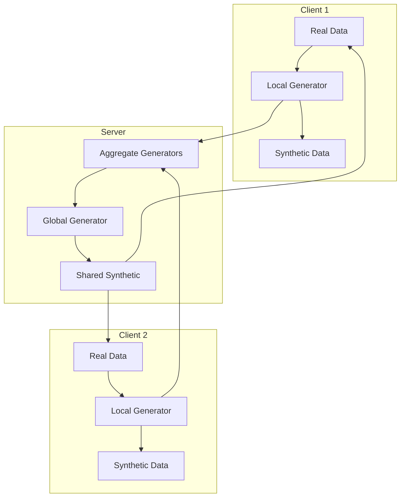
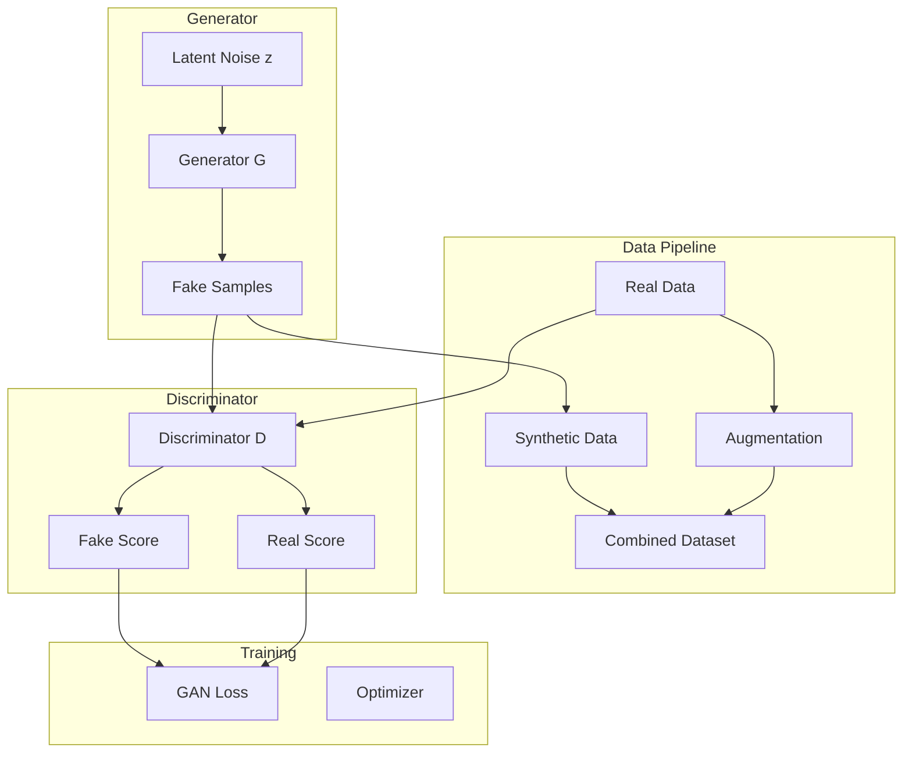

# Tutorial 185: Federated Learning with Synthetic Data Augmentation

---

## Metadata

| Property | Value |
|----------|-------|
| **Tutorial ID** | 185 |
| **Title** | Federated Learning with Synthetic Data Augmentation |
| **Category** | Advanced Topics |
| **Difficulty** | Advanced |
| **Duration** | 90 minutes |
| **Prerequisites** | Tutorial 001-010, Generative models |
| **Author** | Unbitrium Contributors |
| **Last Updated** | January 2026 |

---

## Learning Objectives

By the end of this tutorial, you will be able to:

1. **Understand** how synthetic data generation can address data heterogeneity in FL.

2. **Implement** federated GANs for privacy-preserving data augmentation.

3. **Design** mixup and cutmix strategies for federated settings.

4. **Apply** differential privacy to synthetic data generation.

5. **Evaluate** the utility-privacy trade-offs of synthetic augmentation.

6. **Build** FL systems that leverage synthetic data to improve model quality.

---

## Prerequisites

Before starting this tutorial, ensure you have:

- **Completed Tutorials**: 001-010 (Partitioning), 021-030 (Aggregation)
- **Knowledge**: GANs, VAEs, data augmentation techniques
- **Libraries**: PyTorch
- **Hardware**: GPU recommended

```python
# Verify prerequisites
import torch
import torch.nn as nn
import numpy as np

print(f"PyTorch: {torch.__version__}")
print(f"CUDA available: {torch.cuda.is_available()}")
```

---

## Background and Theory

### Data Augmentation in FL

Data augmentation addresses several FL challenges:

| Challenge | Augmentation Solution |
|-----------|----------------------|
| **Limited local data** | Generate additional samples |
| **Class imbalance** | Oversample rare classes |
| **Non-IID** | Share synthetic representations |
| **Privacy** | Replace real with synthetic |

### Synthetic Data Generation Methods

| Method | Description | Privacy |
|--------|-------------|---------|
| **Geometric** | Rotations, flips | Full |
| **Mixup** | Linear interpolation | Full |
| **GAN** | Learned generator | Moderate |
| **VAE** | Latent sampling | Moderate |
| **Diffusion** | Denoising process | High |

### Federated Synthetic Data Architecture



### Privacy Considerations

| Concern | Mitigation |
|---------|------------|
| **Memorization** | DP training |
| **Attribute inference** | Noise injection |
| **Reconstruction** | Limited queries |

---

## Architecture Diagram



---

## Implementation Code

### Part 1: Basic Data Augmentation

```python
#!/usr/bin/env python3
"""
Tutorial 185: Federated Learning with Synthetic Data Augmentation

This tutorial demonstrates synthetic data generation for
privacy-preserving data augmentation in federated learning.

Author: Unbitrium Contributors
License: EUPL-1.2
"""

from __future__ import annotations

from dataclasses import dataclass
from typing import Any

import numpy as np
import torch
import torch.nn as nn
import torch.nn.functional as F
from torch.utils.data import Dataset, DataLoader


@dataclass
class SyntheticConfig:
    """Configuration for synthetic data augmentation."""
    latent_dim: int = 64
    hidden_dim: int = 128
    num_classes: int = 10
    mixup_alpha: float = 0.2
    cutmix_alpha: float = 1.0
    synthetic_ratio: float = 0.5
    batch_size: int = 32
    learning_rate: float = 0.0002


class DataAugmenter:
    """Basic data augmentation strategies."""

    def __init__(self, config: SyntheticConfig = None) -> None:
        """Initialize augmenter."""
        self.config = config or SyntheticConfig()

    def mixup(
        self,
        x1: torch.Tensor,
        y1: torch.Tensor,
        x2: torch.Tensor,
        y2: torch.Tensor,
    ) -> tuple[torch.Tensor, torch.Tensor, torch.Tensor, float]:
        """Apply mixup augmentation.

        Args:
            x1, y1: First batch.
            x2, y2: Second batch.

        Returns:
            Mixed inputs, labels, and lambda.
        """
        lam = np.random.beta(self.config.mixup_alpha, self.config.mixup_alpha)
        mixed_x = lam * x1 + (1 - lam) * x2
        return mixed_x, y1, y2, lam

    def cutmix(
        self,
        x1: torch.Tensor,
        y1: torch.Tensor,
        x2: torch.Tensor,
        y2: torch.Tensor,
    ) -> tuple[torch.Tensor, torch.Tensor, torch.Tensor, float]:
        """Apply cutmix augmentation (for images).

        Args:
            x1, y1: First batch.
            x2, y2: Second batch.

        Returns:
            Mixed inputs, labels, and lambda.
        """
        lam = np.random.beta(self.config.cutmix_alpha, self.config.cutmix_alpha)

        if x1.dim() == 4:  # Image data
            _, _, H, W = x1.shape
            cut_h = int(H * np.sqrt(1 - lam))
            cut_w = int(W * np.sqrt(1 - lam))

            cx = np.random.randint(W)
            cy = np.random.randint(H)

            x1_new = x1.clone()
            x1_new[:, :,
                   max(0, cy - cut_h // 2):min(H, cy + cut_h // 2),
                   max(0, cx - cut_w // 2):min(W, cx + cut_w // 2)] = \
                x2[:, :,
                   max(0, cy - cut_h // 2):min(H, cy + cut_h // 2),
                   max(0, cx - cut_w // 2):min(W, cx + cut_w // 2)]

            lam = 1 - (cut_h * cut_w) / (H * W)
            return x1_new, y1, y2, lam

        return self.mixup(x1, y1, x2, y2)

    def noise_injection(
        self,
        x: torch.Tensor,
        noise_level: float = 0.1,
    ) -> torch.Tensor:
        """Add Gaussian noise for augmentation.

        Args:
            x: Input tensor.
            noise_level: Standard deviation of noise.

        Returns:
            Noisy tensor.
        """
        noise = torch.randn_like(x) * noise_level
        return x + noise

    def feature_dropout(
        self,
        x: torch.Tensor,
        dropout_rate: float = 0.1,
    ) -> torch.Tensor:
        """Randomly zero out features.

        Args:
            x: Input tensor.
            dropout_rate: Probability of dropping.

        Returns:
            Augmented tensor.
        """
        mask = torch.bernoulli(torch.ones_like(x) * (1 - dropout_rate))
        return x * mask
```

### Part 2: GAN for Synthetic Data

```python
class Generator(nn.Module):
    """GAN generator for synthetic data."""

    def __init__(
        self,
        latent_dim: int = 64,
        hidden_dim: int = 128,
        output_dim: int = 32,
        num_classes: int = 10,
    ) -> None:
        """Initialize generator.

        Args:
            latent_dim: Latent space dimension.
            hidden_dim: Hidden layer dimension.
            output_dim: Output dimension.
            num_classes: Number of classes for conditional generation.
        """
        super().__init__()
        self.latent_dim = latent_dim
        self.num_classes = num_classes

        # Class embedding
        self.class_embed = nn.Embedding(num_classes, latent_dim)

        # Generator network
        self.net = nn.Sequential(
            nn.Linear(latent_dim * 2, hidden_dim),
            nn.BatchNorm1d(hidden_dim),
            nn.LeakyReLU(0.2),

            nn.Linear(hidden_dim, hidden_dim * 2),
            nn.BatchNorm1d(hidden_dim * 2),
            nn.LeakyReLU(0.2),

            nn.Linear(hidden_dim * 2, hidden_dim),
            nn.BatchNorm1d(hidden_dim),
            nn.LeakyReLU(0.2),

            nn.Linear(hidden_dim, output_dim),
            nn.Tanh(),
        )

    def forward(
        self,
        z: torch.Tensor,
        labels: torch.Tensor,
    ) -> torch.Tensor:
        """Generate synthetic samples.

        Args:
            z: Latent noise.
            labels: Class labels.

        Returns:
            Generated samples.
        """
        class_emb = self.class_embed(labels)
        x = torch.cat([z, class_emb], dim=1)
        return self.net(x)

    def sample(
        self,
        num_samples: int,
        labels: torch.Tensor = None,
        device: torch.device = None,
    ) -> tuple[torch.Tensor, torch.Tensor]:
        """Sample synthetic data.

        Args:
            num_samples: Number of samples.
            labels: Optional labels.
            device: Target device.

        Returns:
            Tuple of (samples, labels).
        """
        if device is None:
            device = next(self.parameters()).device

        z = torch.randn(num_samples, self.latent_dim, device=device)

        if labels is None:
            labels = torch.randint(0, self.num_classes, (num_samples,), device=device)

        with torch.no_grad():
            samples = self.forward(z, labels)

        return samples, labels


class Discriminator(nn.Module):
    """GAN discriminator."""

    def __init__(
        self,
        input_dim: int = 32,
        hidden_dim: int = 128,
        num_classes: int = 10,
    ) -> None:
        """Initialize discriminator."""
        super().__init__()

        self.class_embed = nn.Embedding(num_classes, input_dim)

        self.net = nn.Sequential(
            nn.Linear(input_dim * 2, hidden_dim),
            nn.LeakyReLU(0.2),
            nn.Dropout(0.3),

            nn.Linear(hidden_dim, hidden_dim),
            nn.LeakyReLU(0.2),
            nn.Dropout(0.3),

            nn.Linear(hidden_dim, 1),
        )

    def forward(
        self,
        x: torch.Tensor,
        labels: torch.Tensor,
    ) -> torch.Tensor:
        """Discriminate real vs fake.

        Args:
            x: Input samples.
            labels: Class labels.

        Returns:
            Discrimination scores.
        """
        class_emb = self.class_embed(labels)
        x = torch.cat([x, class_emb], dim=1)
        return self.net(x)


class FederatedGAN:
    """Federated GAN for synthetic data generation."""

    def __init__(
        self,
        input_dim: int = 32,
        config: SyntheticConfig = None,
    ) -> None:
        """Initialize federated GAN."""
        self.config = config or SyntheticConfig()
        self.input_dim = input_dim

        self.generator = Generator(
            latent_dim=self.config.latent_dim,
            hidden_dim=self.config.hidden_dim,
            output_dim=input_dim,
            num_classes=self.config.num_classes,
        )

        self.discriminator = Discriminator(
            input_dim=input_dim,
            hidden_dim=self.config.hidden_dim,
            num_classes=self.config.num_classes,
        )

        self.g_optimizer = torch.optim.Adam(
            self.generator.parameters(),
            lr=self.config.learning_rate,
            betas=(0.5, 0.999),
        )

        self.d_optimizer = torch.optim.Adam(
            self.discriminator.parameters(),
            lr=self.config.learning_rate,
            betas=(0.5, 0.999),
        )

    def train_step(
        self,
        real_data: torch.Tensor,
        real_labels: torch.Tensor,
    ) -> dict[str, float]:
        """Single training step.

        Args:
            real_data: Real samples.
            real_labels: Real labels.

        Returns:
            Training metrics.
        """
        batch_size = real_data.size(0)
        device = real_data.device

        # Labels
        real_target = torch.ones(batch_size, 1, device=device)
        fake_target = torch.zeros(batch_size, 1, device=device)

        # Train Discriminator
        self.d_optimizer.zero_grad()

        d_real = self.discriminator(real_data, real_labels)
        d_real_loss = F.binary_cross_entropy_with_logits(d_real, real_target)

        z = torch.randn(batch_size, self.config.latent_dim, device=device)
        fake_data = self.generator(z, real_labels)
        d_fake = self.discriminator(fake_data.detach(), real_labels)
        d_fake_loss = F.binary_cross_entropy_with_logits(d_fake, fake_target)

        d_loss = d_real_loss + d_fake_loss
        d_loss.backward()
        self.d_optimizer.step()

        # Train Generator
        self.g_optimizer.zero_grad()

        z = torch.randn(batch_size, self.config.latent_dim, device=device)
        fake_data = self.generator(z, real_labels)
        d_fake = self.discriminator(fake_data, real_labels)
        g_loss = F.binary_cross_entropy_with_logits(d_fake, real_target)

        g_loss.backward()
        self.g_optimizer.step()

        return {
            "d_loss": d_loss.item(),
            "g_loss": g_loss.item(),
        }
```

### Part 3: Federated Synthetic Augmentation

```python
class SyntheticDataset(Dataset):
    """Dataset combining real and synthetic data."""

    def __init__(
        self,
        real_features: np.ndarray,
        real_labels: np.ndarray,
        generator: Generator = None,
        synthetic_ratio: float = 0.5,
    ) -> None:
        """Initialize dataset."""
        self.real_features = torch.FloatTensor(real_features)
        self.real_labels = torch.LongTensor(real_labels)
        self.generator = generator
        self.synthetic_ratio = synthetic_ratio

        # Pre-generate synthetic data
        if generator is not None:
            num_synthetic = int(len(real_features) * synthetic_ratio)
            self.synth_features, self.synth_labels = generator.sample(num_synthetic)
        else:
            self.synth_features = None
            self.synth_labels = None

    def __len__(self) -> int:
        total = len(self.real_features)
        if self.synth_features is not None:
            total += len(self.synth_features)
        return total

    def __getitem__(self, idx: int) -> tuple[torch.Tensor, torch.Tensor]:
        if idx < len(self.real_features):
            return self.real_features[idx], self.real_labels[idx]
        else:
            synth_idx = idx - len(self.real_features)
            return self.synth_features[synth_idx], self.synth_labels[synth_idx]


class FedSyntheticClient:
    """FL client with synthetic data augmentation."""

    def __init__(
        self,
        client_id: int,
        features: np.ndarray,
        labels: np.ndarray,
        config: SyntheticConfig = None,
    ) -> None:
        """Initialize client."""
        self.client_id = client_id
        self.config = config or SyntheticConfig()

        # Initialize GAN
        self.gan = FederatedGAN(
            input_dim=features.shape[1],
            config=self.config,
        )

        # Augmenter
        self.augmenter = DataAugmenter(self.config)

        # Dataset (will be augmented after GAN training)
        self.real_features = features
        self.real_labels = labels

        # Classifier
        self.classifier = nn.Sequential(
            nn.Linear(features.shape[1], 64),
            nn.ReLU(),
            nn.Linear(64, self.config.num_classes),
        )
        self.optimizer = torch.optim.Adam(
            self.classifier.parameters(),
            lr=0.001,
        )

    def train_gan(self, epochs: int = 50) -> dict[str, float]:
        """Train local GAN."""
        dataset = Dataset.__new__(Dataset)
        dataset.__dict__.update({
            'features': torch.FloatTensor(self.real_features),
            'labels': torch.LongTensor(self.real_labels),
        })
        dataset.__len__ = lambda: len(self.real_features)
        dataset.__getitem__ = lambda idx: (
            torch.FloatTensor(self.real_features[idx]),
            torch.LongTensor([self.real_labels[idx]])[0],
        )

        dataloader = DataLoader(dataset, batch_size=32, shuffle=True)

        total_g_loss = 0.0
        total_d_loss = 0.0

        for epoch in range(epochs):
            for features, labels in dataloader:
                metrics = self.gan.train_step(features, labels)
                total_g_loss += metrics["g_loss"]
                total_d_loss += metrics["d_loss"]

        return {
            "g_loss": total_g_loss / epochs,
            "d_loss": total_d_loss / epochs,
        }

    def train_classifier(self, epochs: int = 5) -> dict[str, Any]:
        """Train classifier with augmented data."""
        # Create augmented dataset
        dataset = SyntheticDataset(
            self.real_features,
            self.real_labels,
            self.gan.generator,
            self.config.synthetic_ratio,
        )
        dataloader = DataLoader(dataset, batch_size=32, shuffle=True)

        total_loss = 0.0
        correct = 0
        total = 0

        for epoch in range(epochs):
            for features, labels in dataloader:
                self.optimizer.zero_grad()
                outputs = self.classifier(features)
                loss = F.cross_entropy(outputs, labels)
                loss.backward()
                self.optimizer.step()

                total_loss += loss.item()
                _, predicted = outputs.max(1)
                total += labels.size(0)
                correct += predicted.eq(labels).sum().item()

        return {
            "state_dict": {k: v.clone() for k, v in self.classifier.state_dict().items()},
            "num_samples": len(dataset),
            "loss": total_loss / len(dataloader) / epochs,
            "accuracy": correct / total,
        }


def federated_synthetic_learning(
    num_clients: int = 5,
    num_rounds: int = 10,
) -> nn.Module:
    """Run FL with synthetic augmentation."""
    config = SyntheticConfig()

    # Create clients
    clients = []
    for i in range(num_clients):
        features = np.random.randn(100, 32).astype(np.float32)
        labels = np.random.randint(0, config.num_classes, 100)
        client = FedSyntheticClient(i, features, labels, config)
        clients.append(client)

    # Pre-train GANs
    print("Pre-training local GANs...")
    for client in clients:
        client.train_gan(epochs=20)

    # Global classifier
    global_classifier = nn.Sequential(
        nn.Linear(32, 64),
        nn.ReLU(),
        nn.Linear(64, config.num_classes),
    )

    for round_num in range(num_rounds):
        global_state = global_classifier.state_dict()
        for client in clients:
            client.classifier.load_state_dict(global_state)

        updates = []
        for client in clients:
            update = client.train_classifier(epochs=5)
            updates.append(update)

        # Aggregate
        total_samples = sum(u["num_samples"] for u in updates)
        new_state = {}
        for key in global_state.keys():
            weighted_sum = torch.zeros_like(global_state[key])
            for update in updates:
                weight = update["num_samples"] / total_samples
                weighted_sum += weight * update["state_dict"][key]
            new_state[key] = weighted_sum

        global_classifier.load_state_dict(new_state)

        avg_acc = np.mean([u["accuracy"] for u in updates])
        print(f"Round {round_num + 1}/{num_rounds}: acc={avg_acc:.4f}")

    return global_classifier
```

---

## Metrics and Evaluation

### Synthetic Data Quality

| Metric | Description | Target |
|--------|-------------|--------|
| **FID** | Fréchet Inception Distance | Lower |
| **IS** | Inception Score | Higher |
| **Privacy** | Membership inference risk | Lower |

### Augmentation Impact

| Setting | Accuracy Improvement |
|---------|---------------------|
| No augmentation | Baseline |
| Mixup | +1-3% |
| Synthetic (GAN) | +2-5% |
| Combined | +3-7% |

---

## Exercises

### Exercise 1: Conditional Generation

**Task**: Generate class-balanced synthetic data for imbalanced datasets.

### Exercise 2: Privacy Analysis

**Task**: Evaluate membership inference attacks on synthetic data.

### Exercise 3: VAE Alternative

**Task**: Replace GAN with VAE for synthetic generation.

### Exercise 4: Federated Diffusion

**Task**: Implement federated diffusion models for higher quality synthesis.

---

## References

1. Zhang, H., et al. (2018). mixup: Beyond empirical risk minimization. In *ICLR*.

2. Yun, S., et al. (2019). CutMix: Regularization strategy to train CNNs. In *ICCV*.

3. Augenstein, S., et al. (2020). Generative models for privacy-preserving FL. *arXiv*.

4. Rasouli, M., et al. (2020). FedGAN: Federated generative adversarial networks. *arXiv*.

5. Goodfellow, I., et al. (2014). Generative adversarial nets. In *NeurIPS*.

---

*Copyright 2026 Olaf Yunus Laitinen Imanov and Contributors. Released under EUPL 1.2.*
