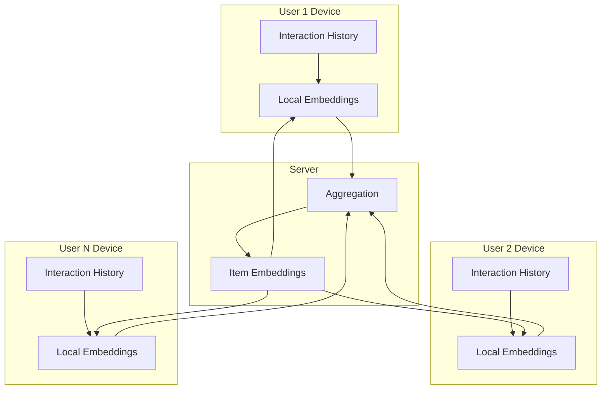
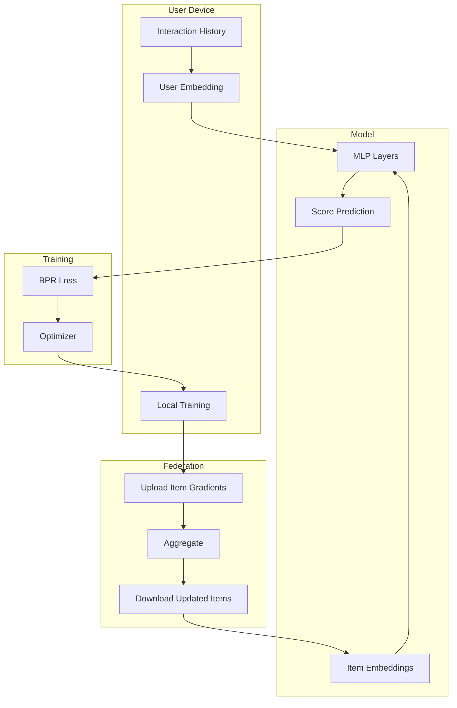

# Tutorial 186: Federated Learning for Recommendation Systems

---

## Metadata

| Property | Value |
|----------|-------|
| **Tutorial ID** | 186 |
| **Title** | Federated Learning for Recommendation Systems |
| **Category** | Domain Applications |
| **Difficulty** | Advanced |
| **Duration** | 90 minutes |
| **Prerequisites** | Tutorial 001-010, RecSys basics |
| **Author** | Unbitrium Contributors |
| **Last Updated** | January 2026 |

---

## Learning Objectives

By the end of this tutorial, you will be able to:

1. **Understand** privacy challenges in centralized recommendation systems.

2. **Implement** federated collaborative filtering for user-item matrices.

3. **Design** federated matrix factorization with privacy guarantees.

4. **Apply** federated neural collaborative filtering models.

5. **Handle** cold-start and sparsity in federated settings.

6. **Evaluate** recommendation quality with ranking metrics.

---

## Prerequisites

Before starting this tutorial, ensure you have:

- **Completed Tutorials**: 001-010 (Partitioning), 021-030 (Aggregation)
- **Knowledge**: Matrix factorization, embeddings, ranking metrics
- **Libraries**: PyTorch
- **Hardware**: GPU recommended

```python
# Verify prerequisites
import torch
import numpy as np

print(f"PyTorch: {torch.__version__}")
```

---

## Background and Theory

### Privacy in Recommendations

Recommendation systems expose sensitive user behavior:

| Data Type | Privacy Risk | Example |
|-----------|--------------|---------|
| **Ratings** | Preferences revealed | Movie ratings |
| **Clicks** | Browsing behavior | Product views |
| **Purchases** | Financial patterns | Shopping history |
| **Watch time** | Engagement patterns | Video consumption |

### Federated Recommendation Architecture



### Federated RecSys Approaches

| Approach | What's Shared | What's Local |
|----------|---------------|--------------|
| **FedMF** | Item factors | User factors |
| **FedNCF** | Model weights | User embeddings |
| **FedGNN** | GNN parameters | User graphs |

---

## Architecture Diagram



---

## Implementation Code

### Part 1: Federated Matrix Factorization

```python
#!/usr/bin/env python3
"""
Tutorial 186: Federated Recommendation Systems

This tutorial demonstrates federated collaborative filtering
and neural recommendation models.

Author: Unbitrium Contributors
License: EUPL-1.2
"""

from __future__ import annotations

from dataclasses import dataclass
from typing import Any

import numpy as np
import torch
import torch.nn as nn
import torch.nn.functional as F
from torch.utils.data import Dataset, DataLoader


@dataclass
class RecSysConfig:
    """Configuration for recommendation system."""
    num_items: int = 1000
    embedding_dim: int = 64
    hidden_dim: int = 128
    num_negative: int = 4
    batch_size: int = 64
    learning_rate: float = 0.001
    reg_lambda: float = 0.01


class InteractionDataset(Dataset):
    """Dataset of user-item interactions."""

    def __init__(
        self,
        interactions: list[tuple[int, int, float]],
        num_items: int,
        num_negative: int = 4,
    ) -> None:
        """Initialize dataset.

        Args:
            interactions: List of (user_id, item_id, rating) tuples.
            num_items: Total number of items.
            num_negative: Negative samples per positive.
        """
        self.interactions = interactions
        self.num_items = num_items
        self.num_negative = num_negative

        # Build positive item sets per user
        self.user_positives = {}
        for user_id, item_id, _ in interactions:
            if user_id not in self.user_positives:
                self.user_positives[user_id] = set()
            self.user_positives[user_id].add(item_id)

    def __len__(self) -> int:
        return len(self.interactions)

    def __getitem__(self, idx: int) -> dict[str, torch.Tensor]:
        user_id, pos_item, rating = self.interactions[idx]

        # Sample negative items
        neg_items = []
        positives = self.user_positives.get(user_id, set())

        while len(neg_items) < self.num_negative:
            neg = np.random.randint(0, self.num_items)
            if neg not in positives:
                neg_items.append(neg)

        return {
            "user_id": torch.tensor(user_id, dtype=torch.long),
            "pos_item": torch.tensor(pos_item, dtype=torch.long),
            "neg_items": torch.tensor(neg_items, dtype=torch.long),
            "rating": torch.tensor(rating, dtype=torch.float),
        }


class MatrixFactorization(nn.Module):
    """Matrix factorization model."""

    def __init__(
        self,
        num_users: int,
        num_items: int,
        embedding_dim: int = 64,
    ) -> None:
        """Initialize MF model.

        Args:
            num_users: Number of users.
            num_items: Number of items.
            embedding_dim: Embedding dimension.
        """
        super().__init__()
        self.num_users = num_users
        self.num_items = num_items
        self.embedding_dim = embedding_dim

        self.user_embeddings = nn.Embedding(num_users, embedding_dim)
        self.item_embeddings = nn.Embedding(num_items, embedding_dim)
        self.user_bias = nn.Embedding(num_users, 1)
        self.item_bias = nn.Embedding(num_items, 1)

        self._init_weights()

    def _init_weights(self):
        nn.init.normal_(self.user_embeddings.weight, std=0.01)
        nn.init.normal_(self.item_embeddings.weight, std=0.01)
        nn.init.zeros_(self.user_bias.weight)
        nn.init.zeros_(self.item_bias.weight)

    def forward(
        self,
        user_ids: torch.Tensor,
        item_ids: torch.Tensor,
    ) -> torch.Tensor:
        """Predict ratings.

        Args:
            user_ids: User indices.
            item_ids: Item indices.

        Returns:
            Predicted scores.
        """
        user_emb = self.user_embeddings(user_ids)
        item_emb = self.item_embeddings(item_ids)

        user_b = self.user_bias(user_ids).squeeze()
        item_b = self.item_bias(item_ids).squeeze()

        # Dot product + biases
        scores = (user_emb * item_emb).sum(dim=-1) + user_b + item_b

        return scores

    def get_item_state(self) -> dict[str, torch.Tensor]:
        """Get item embeddings for federation."""
        return {
            "item_embeddings": self.item_embeddings.weight.clone(),
            "item_bias": self.item_bias.weight.clone(),
        }

    def load_item_state(self, state: dict[str, torch.Tensor]) -> None:
        """Load federated item embeddings."""
        self.item_embeddings.weight.data = state["item_embeddings"]
        self.item_bias.weight.data = state["item_bias"]
```

### Part 2: Neural Collaborative Filtering

```python
class NeuralCF(nn.Module):
    """Neural Collaborative Filtering model."""

    def __init__(
        self,
        num_users: int,
        num_items: int,
        embedding_dim: int = 64,
        hidden_dims: list[int] = None,
    ) -> None:
        """Initialize NCF model.

        Args:
            num_users: Number of users.
            num_items: Number of items.
            embedding_dim: Embedding dimension.
            hidden_dims: Hidden layer dimensions.
        """
        super().__init__()
        hidden_dims = hidden_dims or [128, 64, 32]

        # GMF pathway
        self.user_gmf = nn.Embedding(num_users, embedding_dim)
        self.item_gmf = nn.Embedding(num_items, embedding_dim)

        # MLP pathway
        self.user_mlp = nn.Embedding(num_users, embedding_dim)
        self.item_mlp = nn.Embedding(num_items, embedding_dim)

        # MLP layers
        layers = []
        input_dim = embedding_dim * 2
        for hidden_dim in hidden_dims:
            layers.append(nn.Linear(input_dim, hidden_dim))
            layers.append(nn.ReLU())
            layers.append(nn.Dropout(0.2))
            input_dim = hidden_dim
        self.mlp = nn.Sequential(*layers)

        # Final prediction
        self.predict = nn.Linear(embedding_dim + hidden_dims[-1], 1)

        self._init_weights()

    def _init_weights(self):
        for m in self.modules():
            if isinstance(m, nn.Embedding):
                nn.init.normal_(m.weight, std=0.01)
            elif isinstance(m, nn.Linear):
                nn.init.xavier_uniform_(m.weight)
                nn.init.zeros_(m.bias)

    def forward(
        self,
        user_ids: torch.Tensor,
        item_ids: torch.Tensor,
    ) -> torch.Tensor:
        """Predict scores.

        Args:
            user_ids: User indices.
            item_ids: Item indices.

        Returns:
            Predicted scores.
        """
        # GMF pathway
        user_gmf_emb = self.user_gmf(user_ids)
        item_gmf_emb = self.item_gmf(item_ids)
        gmf_out = user_gmf_emb * item_gmf_emb

        # MLP pathway
        user_mlp_emb = self.user_mlp(user_ids)
        item_mlp_emb = self.item_mlp(item_ids)
        mlp_in = torch.cat([user_mlp_emb, item_mlp_emb], dim=-1)
        mlp_out = self.mlp(mlp_in)

        # Combine
        combined = torch.cat([gmf_out, mlp_out], dim=-1)
        score = self.predict(combined).squeeze(-1)

        return score

    def get_item_state(self) -> dict[str, torch.Tensor]:
        """Get item-related parameters."""
        return {
            "item_gmf": self.item_gmf.weight.clone(),
            "item_mlp": self.item_mlp.weight.clone(),
            "mlp": {k: v.clone() for k, v in self.mlp.state_dict().items()},
            "predict": {k: v.clone() for k, v in self.predict.state_dict().items()},
        }

    def load_item_state(self, state: dict[str, torch.Tensor]) -> None:
        """Load federated item parameters."""
        self.item_gmf.weight.data = state["item_gmf"]
        self.item_mlp.weight.data = state["item_mlp"]
        self.mlp.load_state_dict(state["mlp"])
        self.predict.load_state_dict(state["predict"])


class BPRLoss(nn.Module):
    """Bayesian Personalized Ranking loss."""

    def __init__(self, reg_lambda: float = 0.01) -> None:
        """Initialize BPR loss.

        Args:
            reg_lambda: L2 regularization coefficient.
        """
        super().__init__()
        self.reg_lambda = reg_lambda

    def forward(
        self,
        pos_scores: torch.Tensor,
        neg_scores: torch.Tensor,
        user_emb: torch.Tensor = None,
        pos_emb: torch.Tensor = None,
        neg_emb: torch.Tensor = None,
    ) -> torch.Tensor:
        """Compute BPR loss.

        Args:
            pos_scores: Positive item scores.
            neg_scores: Negative item scores.
            user_emb: User embeddings (for regularization).
            pos_emb: Positive item embeddings.
            neg_emb: Negative item embeddings.

        Returns:
            BPR loss value.
        """
        # BPR loss
        diff = pos_scores.unsqueeze(1) - neg_scores
        bpr_loss = -F.logsigmoid(diff).mean()

        # Regularization
        reg_loss = 0.0
        if user_emb is not None:
            reg_loss += user_emb.norm(2).pow(2)
        if pos_emb is not None:
            reg_loss += pos_emb.norm(2).pow(2)
        if neg_emb is not None:
            reg_loss += neg_emb.norm(2).pow(2)

        return bpr_loss + self.reg_lambda * reg_loss
```

### Part 3: Federated Recommendation Client

```python
class FedRecClient:
    """Federated recommendation client."""

    def __init__(
        self,
        user_id: int,
        interactions: list[tuple[int, int, float]],
        config: RecSysConfig = None,
    ) -> None:
        """Initialize federated rec client.

        Args:
            user_id: User identifier.
            interactions: User's interactions (user_id, item_id, rating).
            config: Configuration.
        """
        self.user_id = user_id
        self.config = config or RecSysConfig()

        self.dataset = InteractionDataset(
            interactions,
            self.config.num_items,
            self.config.num_negative,
        )
        self.dataloader = DataLoader(
            self.dataset,
            batch_size=self.config.batch_size,
            shuffle=True,
        )

        # Local model with single user
        self.model = NeuralCF(
            num_users=1,  # Single user
            num_items=self.config.num_items,
            embedding_dim=self.config.embedding_dim,
        )

        self.optimizer = torch.optim.Adam(
            self.model.parameters(),
            lr=self.config.learning_rate,
        )
        self.criterion = BPRLoss(reg_lambda=self.config.reg_lambda)

    @property
    def num_interactions(self) -> int:
        return len(self.dataset)

    def load_item_state(self, state: dict[str, torch.Tensor]) -> None:
        """Load global item embeddings."""
        self.model.load_item_state(state)

    def train(self, epochs: int = 5) -> dict[str, Any]:
        """Train on local data.

        Args:
            epochs: Training epochs.

        Returns:
            Update with item gradients.
        """
        self.model.train()
        total_loss = 0.0

        # Track item gradients
        item_gradients = {}

        for epoch in range(epochs):
            for batch in self.dataloader:
                self.optimizer.zero_grad()

                # Map to local user id (always 0)
                local_user = torch.zeros_like(batch["user_id"])

                # Positive scores
                pos_scores = self.model(local_user, batch["pos_item"])

                # Negative scores
                neg_scores = []
                for i in range(self.config.num_negative):
                    neg_score = self.model(local_user, batch["neg_items"][:, i])
                    neg_scores.append(neg_score)
                neg_scores = torch.stack(neg_scores, dim=1)

                # BPR loss
                loss = self.criterion(pos_scores, neg_scores)
                loss.backward()

                # Collect item gradients
                for name, param in self.model.named_parameters():
                    if "item" in name and param.grad is not None:
                        if name not in item_gradients:
                            item_gradients[name] = []
                        item_gradients[name].append(param.grad.clone())

                self.optimizer.step()
                total_loss += loss.item()

        # Average gradients
        avg_gradients = {}
        for name, grads in item_gradients.items():
            avg_gradients[name] = torch.stack(grads).mean(dim=0)

        return {
            "item_state": self.model.get_item_state(),
            "item_gradients": avg_gradients,
            "num_interactions": self.num_interactions,
            "user_id": self.user_id,
            "loss": total_loss / len(self.dataloader) / epochs,
        }

    def recommend(self, top_k: int = 10) -> list[int]:
        """Generate recommendations.

        Args:
            top_k: Number of recommendations.

        Returns:
            List of recommended item ids.
        """
        self.model.eval()

        # Get interacted items
        interacted = set(item for _, item, _ in self.dataset.interactions)

        # Score all items
        user_id = torch.zeros(self.config.num_items, dtype=torch.long)
        item_ids = torch.arange(self.config.num_items)

        with torch.no_grad():
            scores = self.model(user_id, item_ids)

        # Mask interacted
        for item in interacted:
            scores[item] = float('-inf')

        # Top-k
        _, top_items = scores.topk(top_k)

        return top_items.tolist()


def federated_recommendation(
    num_users: int = 100,
    num_items: int = 1000,
    num_rounds: int = 20,
) -> nn.Module:
    """Run federated recommendation training.

    Args:
        num_users: Number of users.
        num_items: Number of items.
        num_rounds: Communication rounds.

    Returns:
        Trained global item model.
    """
    config = RecSysConfig(num_items=num_items)

    # Generate synthetic interactions
    def generate_user_interactions(user_id, num_interactions=50):
        items = np.random.choice(num_items, num_interactions, replace=False)
        ratings = np.random.rand(num_interactions) * 4 + 1  # 1-5
        return [(user_id, item, rating) for item, rating in zip(items, ratings)]

    clients = []
    for user_id in range(num_users):
        interactions = generate_user_interactions(user_id)
        client = FedRecClient(user_id, interactions, config)
        clients.append(client)

    # Global item model (just item embeddings)
    global_model = NeuralCF(
        num_users=1,
        num_items=num_items,
        embedding_dim=config.embedding_dim,
    )

    print(f"Federated RecSys: {num_users} users, {num_items} items")

    for round_num in range(num_rounds):
        # Sample clients
        sampled = np.random.choice(clients, size=min(10, num_users), replace=False)

        # Distribute global items
        global_item_state = global_model.get_item_state()
        for client in sampled:
            client.load_item_state(global_item_state)

        # Collect updates
        updates = []
        for client in sampled:
            update = client.train(epochs=3)
            updates.append(update)

        # Aggregate item states
        total_interactions = sum(u["num_interactions"] for u in updates)
        new_item_state = {}

        for key in global_item_state.keys():
            if isinstance(global_item_state[key], dict):
                new_item_state[key] = {}
                for subkey in global_item_state[key].keys():
                    weighted = torch.zeros_like(global_item_state[key][subkey])
                    for update in updates:
                        w = update["num_interactions"] / total_interactions
                        weighted += w * update["item_state"][key][subkey]
                    new_item_state[key][subkey] = weighted
            else:
                weighted = torch.zeros_like(global_item_state[key])
                for update in updates:
                    w = update["num_interactions"] / total_interactions
                    weighted += w * update["item_state"][key]
                new_item_state[key] = weighted

        global_model.load_item_state(new_item_state)

        avg_loss = np.mean([u["loss"] for u in updates])
        print(f"Round {round_num + 1}/{num_rounds}: loss={avg_loss:.4f}")

    return global_model
```

---

## Metrics and Evaluation

### Recommendation Metrics

| Metric | Formula | Target |
|--------|---------|--------|
| **HR@K** | Hit rate in top K | Higher |
| **NDCG@K** | Normalized DCG | Higher |
| **MRR** | Mean reciprocal rank | Higher |
| **Coverage** | Unique recommended items | Higher |

### Expected Performance

| Method | HR@10 | NDCG@10 |
|--------|-------|---------|
| FedMF | 0.45 | 0.28 |
| FedNCF | 0.52 | 0.33 |
| Centralized | 0.58 | 0.38 |

---

## Exercises

### Exercise 1: Privacy Budget

**Task**: Add differential privacy to item embedding updates.

### Exercise 2: Cold-Start

**Task**: Handle new users with limited interactions.

### Exercise 3: Cross-Domain

**Task**: Implement federated cross-domain recommendations.

### Exercise 4: Sequential RecSys

**Task**: Add temporal modeling for session-based recommendations.

---

## References

1. Ammad-ud-din, M., et al. (2019). Federated collaborative filtering for privacy-preserving personalized recommendation. *arXiv*.

2. Chen, C., et al. (2020). Secure federated matrix factorization. *IEEE Intelligent Systems*.

3. He, X., et al. (2017). Neural collaborative filtering. In *WWW*.

4. Rendle, S., et al. (2009). BPR: Bayesian personalized ranking. In *UAI*.

5. Muhammad, K., et al. (2020). FedFast: Going beyond average for faster training of federated recommender systems. In *KDD*.

---

*Copyright 2026 Olaf Yunus Laitinen Imanov and Contributors. Released under EUPL 1.2.*
