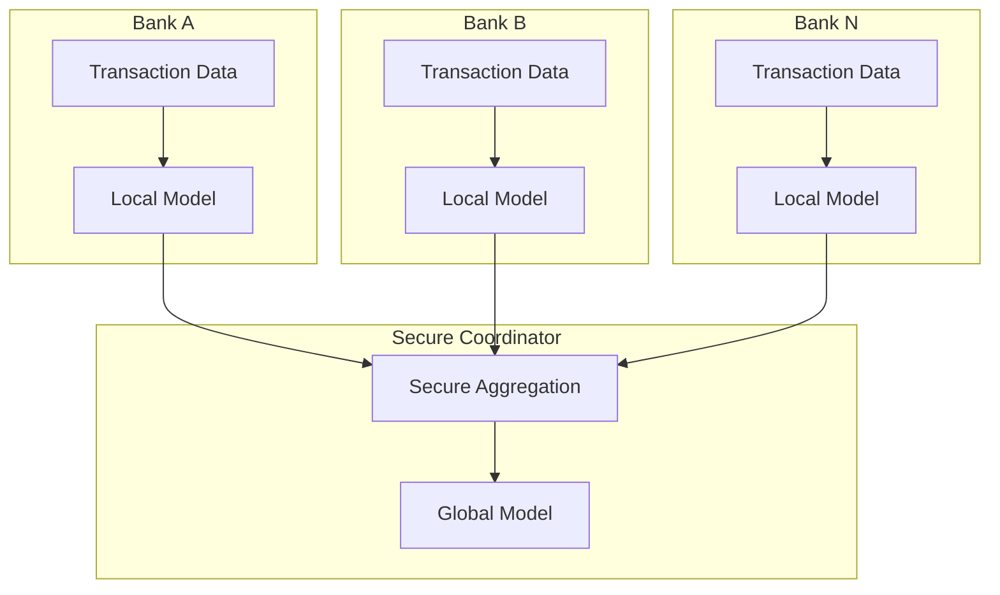
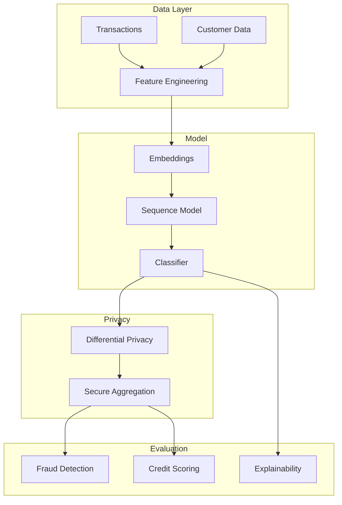

# Tutorial 187: Federated Learning for Financial Applications

---

## Metadata

| Property | Value |
|----------|-------|
| **Tutorial ID** | 187 |
| **Title** | Federated Learning for Financial Applications |
| **Category** | Domain Applications |
| **Difficulty** | Advanced |
| **Duration** | 90 minutes |
| **Prerequisites** | Tutorial 001-010, Financial ML basics |
| **Author** | Unbitrium Contributors |
| **Last Updated** | January 2026 |

---

## Learning Objectives

By the end of this tutorial, you will be able to:

1. **Understand** the regulatory and privacy requirements for FL in finance.

2. **Implement** federated credit scoring and fraud detection models.

3. **Design** cross-institutional learning while maintaining data sovereignty.

4. **Apply** secure aggregation for sensitive financial data.

5. **Handle** extreme class imbalance in fraud detection.

6. **Evaluate** financial models using domain-specific metrics.

---

## Prerequisites

Before starting this tutorial, ensure you have:

- **Completed Tutorials**: 001-010 (Partitioning), 071-080 (Privacy)
- **Knowledge**: Credit scoring, fraud detection, financial regulations
- **Libraries**: PyTorch, scikit-learn
- **Hardware**: CPU sufficient

```python
# Verify prerequisites
import torch
import numpy as np
from sklearn.metrics import roc_auc_score, precision_recall_curve

print(f"PyTorch: {torch.__version__}")
```

---

## Background and Theory

### Financial ML Challenges

| Challenge | Description | Regulatory |
|-----------|-------------|------------|
| **Data Privacy** | Customer financial data | GDPR, CCPA |
| **Competition** | Banks are competitors | Antitrust |
| **Fraud Patterns** | Evolving attack vectors | AML/KYC |
| **Explainability** | Model decisions | Fair Lending |

### Financial FL Use Cases

| Use Case | Benefit | Stakeholders |
|----------|---------|--------------|
| **Credit Scoring** | Better risk models | Banks, Credit Bureaus |
| **Fraud Detection** | Cross-bank patterns | Payment Networks |
| **AML** | Money laundering detection | Regulators |
| **Risk Management** | Systemic risk modeling | Central Banks |

### Cross-Institutional Architecture



### Regulatory Compliance

| Regulation | Region | Key Requirements |
|------------|--------|------------------|
| **GDPR** | EU | Data minimization, consent |
| **CCPA** | California | Consumer rights |
| **PCI-DSS** | Global | Payment data security |
| **Basel III** | Global | Risk management |

---

## Architecture Diagram



---

## Implementation Code

### Part 1: Financial Data Structures

```python
#!/usr/bin/env python3
"""
Tutorial 187: Federated Learning for Financial Applications

This tutorial demonstrates federated fraud detection and
credit scoring across financial institutions.

Author: Unbitrium Contributors
License: EUPL-1.2
"""

from __future__ import annotations

from dataclasses import dataclass
from typing import Any

import numpy as np
import torch
import torch.nn as nn
import torch.nn.functional as F
from torch.utils.data import Dataset, DataLoader, WeightedRandomSampler
from sklearn.metrics import (
    roc_auc_score,
    average_precision_score,
    precision_recall_curve,
    f1_score,
)


@dataclass
class FinancialConfig:
    """Configuration for financial FL."""
    transaction_features: int = 32
    customer_features: int = 16
    sequence_length: int = 10
    hidden_dim: int = 64
    num_classes: int = 2
    fraud_weight: float = 10.0  # Class weight for fraud
    batch_size: int = 64
    learning_rate: float = 0.001
    dp_epsilon: float = 10.0


class TransactionDataset(Dataset):
    """Dataset for transaction sequences."""

    def __init__(
        self,
        transactions: np.ndarray,
        customer_features: np.ndarray,
        labels: np.ndarray,
        sequence_length: int = 10,
    ) -> None:
        """Initialize dataset.

        Args:
            transactions: Transaction features (N, T, D).
            customer_features: Customer features (N, C).
            labels: Fraud labels (N,).
            sequence_length: Sequence length.
        """
        self.transactions = torch.FloatTensor(transactions)
        self.customers = torch.FloatTensor(customer_features)
        self.labels = torch.LongTensor(labels)
        self.sequence_length = sequence_length

    def __len__(self) -> int:
        return len(self.labels)

    def __getitem__(self, idx: int) -> dict[str, torch.Tensor]:
        return {
            "transactions": self.transactions[idx],
            "customer": self.customers[idx],
            "label": self.labels[idx],
        }


def generate_financial_data(
    num_samples: int = 1000,
    num_features: int = 32,
    customer_features: int = 16,
    sequence_length: int = 10,
    fraud_rate: float = 0.02,
    seed: int = None,
) -> tuple[np.ndarray, np.ndarray, np.ndarray]:
    """Generate synthetic financial data.

    Args:
        num_samples: Number of samples.
        num_features: Transaction features.
        customer_features: Customer features.
        sequence_length: Transaction sequence length.
        fraud_rate: Fraction of fraudulent transactions.
        seed: Random seed.

    Returns:
        Tuple of (transactions, customer_features, labels).
    """
    if seed is not None:
        np.random.seed(seed)

    # Transaction sequences
    transactions = np.random.randn(
        num_samples, sequence_length, num_features
    ).astype(np.float32)

    # Customer features
    customers = np.random.randn(
        num_samples, customer_features
    ).astype(np.float32)

    # Labels with class imbalance
    num_fraud = int(num_samples * fraud_rate)
    labels = np.zeros(num_samples, dtype=np.int64)
    fraud_indices = np.random.choice(num_samples, num_fraud, replace=False)
    labels[fraud_indices] = 1

    # Add fraud patterns
    for idx in fraud_indices:
        # Unusual transaction amounts
        transactions[idx, :, 0] += 3  # Higher amounts
        transactions[idx, :, 1] += 2  # Unusual patterns
        # Different customer behavior
        customers[idx, :3] += 2

    return transactions, customers, labels
```

### Part 2: Financial Models

```python
class FraudDetector(nn.Module):
    """LSTM-based fraud detection model."""

    def __init__(
        self,
        transaction_dim: int = 32,
        customer_dim: int = 16,
        hidden_dim: int = 64,
        num_classes: int = 2,
    ) -> None:
        """Initialize fraud detector.

        Args:
            transaction_dim: Transaction feature dimension.
            customer_dim: Customer feature dimension.
            hidden_dim: LSTM hidden dimension.
            num_classes: Number of output classes.
        """
        super().__init__()

        # Transaction sequence encoder
        self.lstm = nn.LSTM(
            input_size=transaction_dim,
            hidden_size=hidden_dim,
            num_layers=2,
            batch_first=True,
            dropout=0.2,
            bidirectional=True,
        )

        # Customer encoder
        self.customer_encoder = nn.Sequential(
            nn.Linear(customer_dim, hidden_dim),
            nn.ReLU(),
            nn.Dropout(0.2),
        )

        # Attention for transaction sequence
        self.attention = nn.Sequential(
            nn.Linear(hidden_dim * 2, hidden_dim),
            nn.Tanh(),
            nn.Linear(hidden_dim, 1),
        )

        # Classifier
        self.classifier = nn.Sequential(
            nn.Linear(hidden_dim * 2 + hidden_dim, hidden_dim),
            nn.ReLU(),
            nn.Dropout(0.3),
            nn.Linear(hidden_dim, num_classes),
        )

    def forward(
        self,
        transactions: torch.Tensor,
        customer: torch.Tensor,
    ) -> torch.Tensor:
        """Forward pass.

        Args:
            transactions: Transaction sequence (batch, seq, features).
            customer: Customer features (batch, features).

        Returns:
            Class logits.
        """
        # Encode transactions
        lstm_out, _ = self.lstm(transactions)  # (batch, seq, hidden*2)

        # Attention
        attention_weights = self.attention(lstm_out)  # (batch, seq, 1)
        attention_weights = F.softmax(attention_weights, dim=1)
        transaction_repr = (lstm_out * attention_weights).sum(dim=1)

        # Encode customer
        customer_repr = self.customer_encoder(customer)

        # Combine and classify
        combined = torch.cat([transaction_repr, customer_repr], dim=1)
        logits = self.classifier(combined)

        return logits


class CreditScorer(nn.Module):
    """Credit scoring model."""

    def __init__(
        self,
        input_dim: int = 48,
        hidden_dim: int = 64,
    ) -> None:
        """Initialize credit scorer."""
        super().__init__()

        self.network = nn.Sequential(
            nn.Linear(input_dim, hidden_dim),
            nn.ReLU(),
            nn.BatchNorm1d(hidden_dim),
            nn.Dropout(0.3),

            nn.Linear(hidden_dim, hidden_dim),
            nn.ReLU(),
            nn.BatchNorm1d(hidden_dim),
            nn.Dropout(0.3),

            nn.Linear(hidden_dim, hidden_dim // 2),
            nn.ReLU(),
            nn.Dropout(0.2),

            nn.Linear(hidden_dim // 2, 1),
            nn.Sigmoid(),
        )

    def forward(self, x: torch.Tensor) -> torch.Tensor:
        """Predict default probability."""
        return self.network(x)


class FocalLoss(nn.Module):
    """Focal loss for class imbalance."""

    def __init__(
        self,
        alpha: float = 0.25,
        gamma: float = 2.0,
    ) -> None:
        """Initialize focal loss.

        Args:
            alpha: Weighting factor.
            gamma: Focusing parameter.
        """
        super().__init__()
        self.alpha = alpha
        self.gamma = gamma

    def forward(
        self,
        inputs: torch.Tensor,
        targets: torch.Tensor,
    ) -> torch.Tensor:
        """Compute focal loss."""
        ce_loss = F.cross_entropy(inputs, targets, reduction='none')
        pt = torch.exp(-ce_loss)
        focal_loss = self.alpha * (1 - pt) ** self.gamma * ce_loss
        return focal_loss.mean()
```

### Part 3: Federated Financial Client

```python
class FinancialFLClient:
    """FL client for financial institution."""

    def __init__(
        self,
        bank_id: int,
        transactions: np.ndarray,
        customers: np.ndarray,
        labels: np.ndarray,
        config: FinancialConfig = None,
    ) -> None:
        """Initialize financial FL client.

        Args:
            bank_id: Bank identifier.
            transactions: Transaction sequences.
            customers: Customer features.
            labels: Fraud labels.
            config: Configuration.
        """
        self.bank_id = bank_id
        self.config = config or FinancialConfig()

        self.dataset = TransactionDataset(
            transactions, customers, labels,
            self.config.sequence_length,
        )

        # Handle class imbalance with weighted sampling
        class_counts = np.bincount(labels)
        weights = 1.0 / class_counts[labels]
        sampler = WeightedRandomSampler(
            weights, len(weights), replacement=True
        )

        self.dataloader = DataLoader(
            self.dataset,
            batch_size=self.config.batch_size,
            sampler=sampler,
        )

        self.model = FraudDetector(
            transaction_dim=self.config.transaction_features,
            customer_dim=self.config.customer_features,
            hidden_dim=self.config.hidden_dim,
        )

        self.optimizer = torch.optim.Adam(
            self.model.parameters(),
            lr=self.config.learning_rate,
        )

        self.criterion = FocalLoss(alpha=0.25, gamma=2.0)

    @property
    def num_samples(self) -> int:
        return len(self.dataset)

    @property
    def fraud_rate(self) -> float:
        """Local fraud rate."""
        return self.dataset.labels.float().mean().item()

    def load_global_model(self, state_dict: dict[str, torch.Tensor]) -> None:
        """Load global model."""
        self.model.load_state_dict(state_dict)

    def train(self, epochs: int = 5) -> dict[str, Any]:
        """Train fraud detector.

        Args:
            epochs: Number of epochs.

        Returns:
            Update with metrics.
        """
        self.model.train()
        total_loss = 0.0

        for epoch in range(epochs):
            for batch in self.dataloader:
                self.optimizer.zero_grad()

                logits = self.model(
                    batch["transactions"],
                    batch["customer"],
                )
                loss = self.criterion(logits, batch["label"])

                loss.backward()
                torch.nn.utils.clip_grad_norm_(self.model.parameters(), 1.0)
                self.optimizer.step()

                total_loss += loss.item()

        # Evaluate
        metrics = self._evaluate()

        return {
            "state_dict": {k: v.clone() for k, v in self.model.state_dict().items()},
            "num_samples": self.num_samples,
            "bank_id": self.bank_id,
            "fraud_rate": self.fraud_rate,
            "loss": total_loss / len(self.dataloader) / epochs,
            "metrics": metrics,
        }

    def _evaluate(self) -> dict[str, float]:
        """Evaluate model on local data."""
        self.model.eval()
        all_probs = []
        all_labels = []

        with torch.no_grad():
            eval_loader = DataLoader(self.dataset, batch_size=64)
            for batch in eval_loader:
                logits = self.model(batch["transactions"], batch["customer"])
                probs = F.softmax(logits, dim=1)[:, 1]
                all_probs.extend(probs.numpy())
                all_labels.extend(batch["label"].numpy())

        probs = np.array(all_probs)
        labels = np.array(all_labels)

        # Metrics
        auc = roc_auc_score(labels, probs) if len(np.unique(labels)) > 1 else 0.5
        ap = average_precision_score(labels, probs) if sum(labels) > 0 else 0.0

        # Find optimal threshold
        precision, recall, thresholds = precision_recall_curve(labels, probs)
        f1_scores = 2 * precision * recall / (precision + recall + 1e-8)
        best_idx = np.argmax(f1_scores[:-1])
        best_threshold = thresholds[best_idx]

        preds = (probs > best_threshold).astype(int)
        f1 = f1_score(labels, preds, zero_division=0)

        return {
            "auc_roc": float(auc),
            "auc_pr": float(ap),
            "f1": float(f1),
            "threshold": float(best_threshold),
        }


def federated_fraud_detection(
    num_banks: int = 5,
    num_rounds: int = 20,
    local_epochs: int = 5,
) -> tuple[nn.Module, dict]:
    """Run federated fraud detection.

    Args:
        num_banks: Number of participating banks.
        num_rounds: Communication rounds.
        local_epochs: Local epochs.

    Returns:
        Tuple of (global model, history).
    """
    config = FinancialConfig()

    # Create banks with varying fraud rates
    clients = []
    for i in range(num_banks):
        fraud_rate = 0.01 + 0.02 * np.random.rand()  # 1-3% fraud
        transactions, customers, labels = generate_financial_data(
            num_samples=1000,
            fraud_rate=fraud_rate,
            seed=i * 100,
        )
        client = FinancialFLClient(i, transactions, customers, labels, config)
        clients.append(client)
        print(f"Bank {i}: {client.num_samples} samples, {client.fraud_rate:.2%} fraud")

    global_model = FraudDetector(
        transaction_dim=config.transaction_features,
        customer_dim=config.customer_features,
        hidden_dim=config.hidden_dim,
    )

    history = {"rounds": [], "aucs": [], "f1s": []}

    for round_num in range(num_rounds):
        global_state = global_model.state_dict()
        for client in clients:
            client.load_global_model(global_state)

        updates = []
        for client in clients:
            update = client.train(epochs=local_epochs)
            updates.append(update)

        # Aggregate
        total_samples = sum(u["num_samples"] for u in updates)
        new_state = {}
        for key in global_state.keys():
            weighted_sum = torch.zeros_like(global_state[key])
            for update in updates:
                weight = update["num_samples"] / total_samples
                weighted_sum += weight * update["state_dict"][key]
            new_state[key] = weighted_sum

        global_model.load_state_dict(new_state)

        # Metrics
        avg_auc = np.mean([u["metrics"]["auc_roc"] for u in updates])
        avg_f1 = np.mean([u["metrics"]["f1"] for u in updates])

        history["rounds"].append(round_num)
        history["aucs"].append(avg_auc)
        history["f1s"].append(avg_f1)

        print(f"Round {round_num + 1}/{num_rounds}: "
              f"auc={avg_auc:.4f}, f1={avg_f1:.4f}")

    return global_model, history
```

---

## Metrics and Evaluation

### Financial ML Metrics

| Metric | Description | Target |
|--------|-------------|--------|
| **AUC-ROC** | Ranking quality | > 0.90 |
| **AUC-PR** | Precision-recall AUC | > 0.50 |
| **F1 Score** | Balance P/R | > 0.60 |
| **FPR@95TPR** | False positive at 95% recall | < 10% |

### Business Metrics

| Metric | Description |
|--------|-------------|
| **Loss Reduction** | Fraud losses prevented |
| **Precision** | Minimize false alerts |
| **Processing Time** | Real-time decisions |

---

## Exercises

### Exercise 1: Cross-Border FL

**Task**: Implement FL across institutions with different regulatory requirements.

### Exercise 2: Explainability

**Task**: Add SHAP or LIME explanations for fraud predictions.

### Exercise 3: Real-Time Inference

**Task**: Optimize for real-time transaction scoring.

### Exercise 4: Synthetic Fraud Patterns

**Task**: Use federated GAN to share fraud patterns without raw data.

---

## References

1. Yang, W., et al. (2019). Federated machine learning for credit card fraud detection. In *CIKM*.

2. Suzumura, T., et al. (2019). Towards federated graph learning for collaborative financial crime detection. *arXiv*.

3. Zheng, W., et al. (2020). Federated learning for financial applications. In *ICAIF*.

4. Lin, T., et al. (2017). Focal loss for dense object detection. In *ICCV*.

5. Abdallah, A., et al. (2016). Fraud detection using machine learning: A survey. *IEEE Access*.

---

*Copyright 2026 Olaf Yunus Laitinen Imanov and Contributors. Released under EUPL 1.2.*
