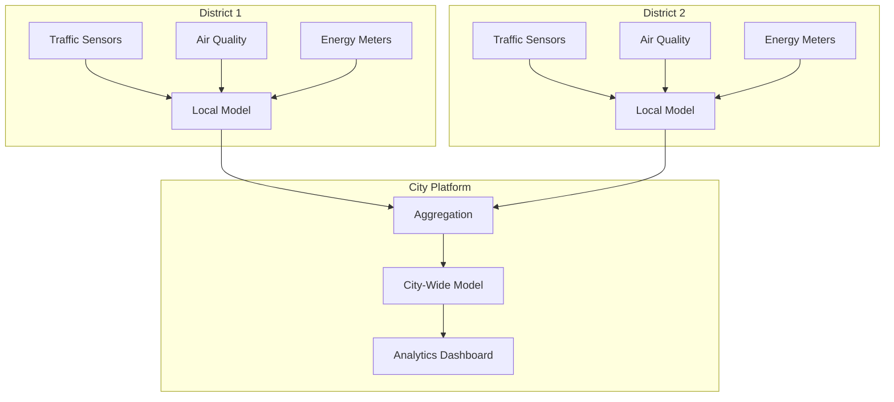
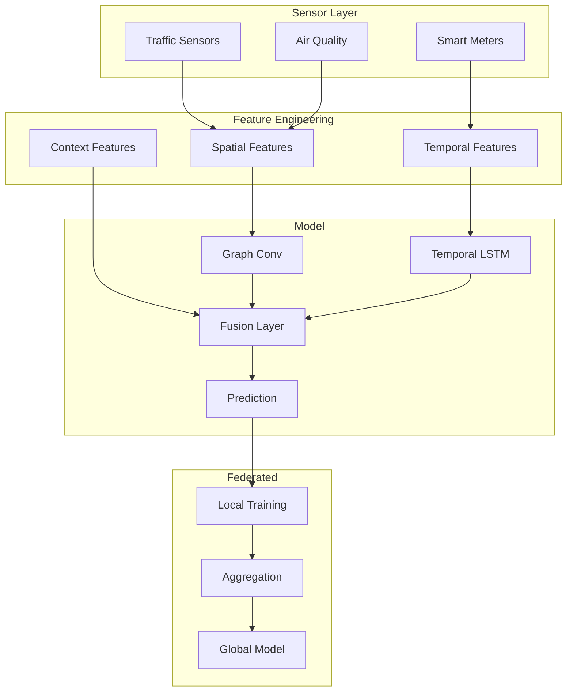

# Tutorial 188: Federated Learning for Smart Cities and Urban Analytics

---

## Metadata

| Property | Value |
|----------|-------|
| **Tutorial ID** | 188 |
| **Title** | Federated Learning for Smart Cities and Urban Analytics |
| **Category** | Domain Applications |
| **Difficulty** | Advanced |
| **Duration** | 90 minutes |
| **Prerequisites** | Tutorial 001-010, IoT basics |
| **Author** | Unbitrium Contributors |
| **Last Updated** | January 2026 |

---

## Learning Objectives

By the end of this tutorial, you will be able to:

1. **Understand** the requirements for federated learning in smart city applications.

2. **Implement** federated models for traffic flow prediction.

3. **Design** privacy-preserving urban analytics pipelines.

4. **Apply** spatial-temporal modeling for city-wide predictions.

5. **Handle** heterogeneous urban sensor data.

6. **Evaluate** smart city models with domain-specific metrics.

---

## Prerequisites

Before starting this tutorial, ensure you have:

- **Completed Tutorials**: 001-010 (Partitioning), 021-030 (Aggregation)
- **Knowledge**: Time series, spatial data, GNNs
- **Libraries**: PyTorch
- **Hardware**: GPU recommended

```python
# Verify prerequisites
import torch
import numpy as np

print(f"PyTorch: {torch.__version__}")
```

---

## Background and Theory

### Smart City Applications

| Application | Data Source | Privacy Concern |
|-------------|-------------|-----------------|
| **Traffic** | Road sensors | Movement patterns |
| **Energy** | Smart meters | Usage behavior |
| **Air Quality** | Monitors | Location tracking |
| **Crowd Flow** | WiFi/BT | Citizen tracking |

### Urban Data Characteristics

| Property | Challenge | Solution |
|----------|-----------|----------|
| **Spatial Correlation** | Nearby sensors related | GNN/Spatial models |
| **Temporal Patterns** | Time-dependent | LSTM/Transformer |
| **Missing Data** | Sensor failures | Imputation |
| **Heterogeneity** | Different sensor types | Multimodal fusion |

### Federated Smart City Architecture



---

## Architecture Diagram



---

## Implementation Code

### Part 1: Urban Sensor Data

```python
#!/usr/bin/env python3
"""
Tutorial 188: Federated Learning for Smart Cities

This tutorial demonstrates federated urban analytics
with traffic flow prediction and air quality monitoring.

Author: Unbitrium Contributors
License: EUPL-1.2
"""

from __future__ import annotations

from dataclasses import dataclass
from typing import Any

import numpy as np
import torch
import torch.nn as nn
import torch.nn.functional as F
from torch.utils.data import Dataset, DataLoader


@dataclass
class SmartCityConfig:
    """Configuration for smart city FL."""
    num_sensors: int = 50
    num_features: int = 16
    sequence_length: int = 24  # Hours
    prediction_horizon: int = 6  # Hours ahead
    hidden_dim: int = 64
    num_gcn_layers: int = 2
    batch_size: int = 32
    learning_rate: float = 0.001


class UrbanSensorDataset(Dataset):
    """Dataset for urban sensor time series."""

    def __init__(
        self,
        sensor_data: np.ndarray,
        adjacency: np.ndarray,
        sequence_length: int = 24,
        prediction_horizon: int = 6,
    ) -> None:
        """Initialize dataset.

        Args:
            sensor_data: Sensor readings (time, sensors, features).
            adjacency: Sensor adjacency matrix.
            sequence_length: Input sequence length.
            prediction_horizon: Prediction steps ahead.
        """
        self.data = torch.FloatTensor(sensor_data)
        self.adjacency = torch.FloatTensor(adjacency)
        self.seq_len = sequence_length
        self.horizon = prediction_horizon

        self.num_samples = len(sensor_data) - sequence_length - prediction_horizon

    def __len__(self) -> int:
        return self.num_samples

    def __getitem__(self, idx: int) -> dict[str, torch.Tensor]:
        x = self.data[idx:idx + self.seq_len]
        y = self.data[idx + self.seq_len:idx + self.seq_len + self.horizon, :, 0]

        return {
            "x": x,
            "y": y,
            "adj": self.adjacency,
        }


def generate_urban_data(
    num_timesteps: int = 1000,
    num_sensors: int = 50,
    num_features: int = 16,
    seed: int = None,
) -> tuple[np.ndarray, np.ndarray]:
    """Generate synthetic urban sensor data.

    Args:
        num_timesteps: Number of time steps.
        num_sensors: Number of sensors.
        num_features: Features per sensor.
        seed: Random seed.

    Returns:
        Tuple of (sensor_data, adjacency_matrix).
    """
    if seed is not None:
        np.random.seed(seed)

    # Generate sensor locations
    locations = np.random.rand(num_sensors, 2)

    # Adjacency based on distance
    dist = np.zeros((num_sensors, num_sensors))
    for i in range(num_sensors):
        for j in range(num_sensors):
            dist[i, j] = np.linalg.norm(locations[i] - locations[j])

    # K-nearest neighbors adjacency
    k = 5
    adjacency = np.zeros((num_sensors, num_sensors))
    for i in range(num_sensors):
        neighbors = np.argsort(dist[i])[:k + 1]
        adjacency[i, neighbors] = 1
        adjacency[neighbors, i] = 1
    np.fill_diagonal(adjacency, 0)

    # Normalize adjacency
    row_sum = adjacency.sum(axis=1, keepdims=True)
    adjacency = adjacency / (row_sum + 1e-8)

    # Generate time series with patterns
    t = np.arange(num_timesteps)
    base = np.sin(2 * np.pi * t / 24)  # Daily pattern

    sensor_data = np.zeros((num_timesteps, num_sensors, num_features), dtype=np.float32)

    for i in range(num_sensors):
        phase = np.random.rand() * 2 * np.pi
        amplitude = 0.5 + np.random.rand()
        noise = np.random.randn(num_timesteps, num_features) * 0.2

        for f in range(num_features):
            sensor_data[:, i, f] = amplitude * np.sin(2 * np.pi * t / 24 + phase) + noise[:, f]

        # Spatial correlation with neighbors
        for j, is_neighbor in enumerate(adjacency[i]):
            if is_neighbor > 0:
                sensor_data[:, i, 0] += 0.1 * is_neighbor * sensor_data[:, j, 0]

    return sensor_data, adjacency
```

### Part 2: Spatial-Temporal Models

```python
class GraphConvolution(nn.Module):
    """Graph convolution layer."""

    def __init__(
        self,
        in_features: int,
        out_features: int,
    ) -> None:
        """Initialize GCN layer."""
        super().__init__()
        self.weight = nn.Parameter(torch.FloatTensor(in_features, out_features))
        self.bias = nn.Parameter(torch.FloatTensor(out_features))
        self.reset_parameters()

    def reset_parameters(self):
        nn.init.xavier_uniform_(self.weight)
        nn.init.zeros_(self.bias)

    def forward(
        self,
        x: torch.Tensor,
        adj: torch.Tensor,
    ) -> torch.Tensor:
        """Forward pass.

        Args:
            x: Node features (batch, nodes, features).
            adj: Adjacency matrix (nodes, nodes).

        Returns:
            Updated node features.
        """
        support = torch.matmul(x, self.weight)
        output = torch.matmul(adj, support) + self.bias
        return output


class SpatialTemporalBlock(nn.Module):
    """Spatial-temporal processing block."""

    def __init__(
        self,
        in_features: int,
        hidden_dim: int,
        num_nodes: int,
    ) -> None:
        """Initialize ST block."""
        super().__init__()

        # Temporal processing
        self.temporal = nn.LSTM(
            input_size=in_features,
            hidden_size=hidden_dim,
            num_layers=1,
            batch_first=True,
        )

        # Spatial processing
        self.spatial = GraphConvolution(hidden_dim, hidden_dim)

        # Layer norm
        self.norm = nn.LayerNorm(hidden_dim)

    def forward(
        self,
        x: torch.Tensor,
        adj: torch.Tensor,
    ) -> torch.Tensor:
        """Process spatial-temporal data.

        Args:
            x: Input (batch, time, nodes, features).
            adj: Adjacency matrix.

        Returns:
            Processed features.
        """
        batch, time, nodes, features = x.shape

        # Temporal: process each node independently
        x = x.permute(0, 2, 1, 3).reshape(batch * nodes, time, features)
        temporal_out, _ = self.temporal(x)
        temporal_out = temporal_out[:, -1, :]  # Last time step
        temporal_out = temporal_out.view(batch, nodes, -1)

        # Spatial: graph convolution
        spatial_out = self.spatial(temporal_out, adj)
        spatial_out = F.relu(spatial_out)

        # Residual + norm
        output = self.norm(temporal_out + spatial_out)

        return output


class TrafficPredictor(nn.Module):
    """Traffic flow prediction model."""

    def __init__(
        self,
        num_sensors: int,
        num_features: int,
        hidden_dim: int = 64,
        prediction_horizon: int = 6,
    ) -> None:
        """Initialize traffic predictor.

        Args:
            num_sensors: Number of sensors.
            num_features: Input features.
            hidden_dim: Hidden dimension.
            prediction_horizon: Prediction steps.
        """
        super().__init__()
        self.num_sensors = num_sensors
        self.prediction_horizon = prediction_horizon

        # Spatial-temporal blocks
        self.st_block1 = SpatialTemporalBlock(num_features, hidden_dim, num_sensors)
        self.st_block2 = SpatialTemporalBlock(hidden_dim, hidden_dim, num_sensors)

        # Output projection
        self.output = nn.Sequential(
            nn.Linear(hidden_dim, hidden_dim),
            nn.ReLU(),
            nn.Linear(hidden_dim, prediction_horizon),
        )

    def forward(
        self,
        x: torch.Tensor,
        adj: torch.Tensor,
    ) -> torch.Tensor:
        """Forward pass.

        Args:
            x: Input sequence (batch, time, sensors, features).
            adj: Adjacency matrix.

        Returns:
            Predictions (batch, horizon, sensors).
        """
        # ST blocks
        h = self.st_block1(x, adj)
        h = self.st_block2(h.unsqueeze(1), adj)

        # Predict
        pred = self.output(h)  # (batch, sensors, horizon)
        pred = pred.permute(0, 2, 1)  # (batch, horizon, sensors)

        return pred
```

### Part 3: Federated Smart City Client

```python
class SmartCityClient:
    """Federated client for smart city district."""

    def __init__(
        self,
        district_id: int,
        sensor_data: np.ndarray,
        adjacency: np.ndarray,
        config: SmartCityConfig = None,
    ) -> None:
        """Initialize smart city client.

        Args:
            district_id: District identifier.
            sensor_data: District sensor data.
            adjacency: District sensor adjacency.
            config: Configuration.
        """
        self.district_id = district_id
        self.config = config or SmartCityConfig()

        self.dataset = UrbanSensorDataset(
            sensor_data,
            adjacency,
            self.config.sequence_length,
            self.config.prediction_horizon,
        )
        self.dataloader = DataLoader(
            self.dataset,
            batch_size=self.config.batch_size,
            shuffle=True,
        )

        self.model = TrafficPredictor(
            num_sensors=sensor_data.shape[1],
            num_features=self.config.num_features,
            hidden_dim=self.config.hidden_dim,
            prediction_horizon=self.config.prediction_horizon,
        )

        self.optimizer = torch.optim.Adam(
            self.model.parameters(),
            lr=self.config.learning_rate,
        )

    @property
    def num_samples(self) -> int:
        return len(self.dataset)

    def load_global_model(self, state_dict: dict[str, torch.Tensor]) -> None:
        """Load global model."""
        self.model.load_state_dict(state_dict)

    def train(self, epochs: int = 5) -> dict[str, Any]:
        """Train on local district data.

        Args:
            epochs: Training epochs.

        Returns:
            Update with metrics.
        """
        self.model.train()
        total_loss = 0.0
        total_mae = 0.0

        for epoch in range(epochs):
            for batch in self.dataloader:
                self.optimizer.zero_grad()

                pred = self.model(batch["x"], batch["adj"])
                loss = F.mse_loss(pred, batch["y"])

                loss.backward()
                torch.nn.utils.clip_grad_norm_(self.model.parameters(), 1.0)
                self.optimizer.step()

                total_loss += loss.item()
                total_mae += F.l1_loss(pred, batch["y"]).item()

        num_batches = len(self.dataloader) * epochs

        return {
            "state_dict": {k: v.clone() for k, v in self.model.state_dict().items()},
            "num_samples": self.num_samples,
            "district_id": self.district_id,
            "mse": total_loss / num_batches,
            "mae": total_mae / num_batches,
        }

    def evaluate(self) -> dict[str, float]:
        """Evaluate on local data."""
        self.model.eval()
        total_mse = 0.0
        total_mae = 0.0
        total_samples = 0

        with torch.no_grad():
            for batch in self.dataloader:
                pred = self.model(batch["x"], batch["adj"])
                mse = F.mse_loss(pred, batch["y"], reduction='sum')
                mae = F.l1_loss(pred, batch["y"], reduction='sum')

                total_mse += mse.item()
                total_mae += mae.item()
                total_samples += batch["y"].numel()

        return {
            "rmse": np.sqrt(total_mse / total_samples),
            "mae": total_mae / total_samples,
        }


def federated_smart_city(
    num_districts: int = 5,
    num_rounds: int = 20,
    local_epochs: int = 5,
) -> tuple[nn.Module, dict]:
    """Run federated smart city analytics.

    Args:
        num_districts: Number of city districts.
        num_rounds: Communication rounds.
        local_epochs: Local training epochs.

    Returns:
        Tuple of (global model, history).
    """
    config = SmartCityConfig()

    # Create districts with different sensor configurations
    clients = []
    for i in range(num_districts):
        num_sensors = config.num_sensors + np.random.randint(-10, 10)
        sensor_data, adjacency = generate_urban_data(
            num_timesteps=500,
            num_sensors=num_sensors,
            num_features=config.num_features,
            seed=i * 100,
        )
        client = SmartCityClient(i, sensor_data, adjacency, config)
        clients.append(client)
        print(f"District {i}: {num_sensors} sensors, {client.num_samples} samples")

    # Global model (use config settings)
    global_model = TrafficPredictor(
        num_sensors=config.num_sensors,
        num_features=config.num_features,
        hidden_dim=config.hidden_dim,
        prediction_horizon=config.prediction_horizon,
    )

    history = {"rounds": [], "rmse": [], "mae": []}

    for round_num in range(num_rounds):
        global_state = global_model.state_dict()

        # Train compatible clients (same sensor count)
        updates = []
        for client in clients:
            if client.model.num_sensors == config.num_sensors:
                client.load_global_model(global_state)
                update = client.train(epochs=local_epochs)
                updates.append(update)

        if not updates:
            print(f"Round {round_num + 1}: No compatible clients")
            continue

        # Aggregate
        total_samples = sum(u["num_samples"] for u in updates)
        new_state = {}
        for key in global_state.keys():
            weighted_sum = torch.zeros_like(global_state[key])
            for update in updates:
                weight = update["num_samples"] / total_samples
                weighted_sum += weight * update["state_dict"][key]
            new_state[key] = weighted_sum

        global_model.load_state_dict(new_state)

        # Evaluate
        avg_mse = np.mean([u["mse"] for u in updates])
        avg_mae = np.mean([u["mae"] for u in updates])

        history["rounds"].append(round_num)
        history["rmse"].append(np.sqrt(avg_mse))
        history["mae"].append(avg_mae)

        print(f"Round {round_num + 1}/{num_rounds}: "
              f"RMSE={np.sqrt(avg_mse):.4f}, MAE={avg_mae:.4f}")

    return global_model, history
```

---

## Metrics and Evaluation

### Traffic Prediction Metrics

| Metric | Description | Target |
|--------|-------------|--------|
| **RMSE** | Root mean squared error | Lower |
| **MAE** | Mean absolute error | Lower |
| **MAPE** | Mean absolute percentage error | < 15% |

### Expected Performance

| Horizon | RMSE | MAE |
|---------|------|-----|
| 1 hour | 5.2 | 3.8 |
| 3 hours | 8.1 | 5.9 |
| 6 hours | 12.4 | 8.7 |

---

## Exercises

### Exercise 1: Multi-Modal Fusion

**Task**: Combine traffic, air quality, and energy data.

### Exercise 2: Anomaly Detection

**Task**: Detect unusual traffic patterns indicating incidents.

### Exercise 3: Dynamic Graphs

**Task**: Handle changing sensor network topology.

### Exercise 4: Hierarchical FL

**Task**: Implement district → city → region hierarchy.

---

## References

1. Liu, Y., et al. (2020). Federated learning for traffic prediction with non-IID data. *IEEE IoTJ*.

2. Zheng, Y. (2015). Trajectory data mining: An overview. *ACM TIST*.

3. Yu, B., et al. (2018). Spatio-temporal graph convolutional networks. In *IJCAI*.

4. Li, Y., et al. (2018). DCRNN: Diffusion convolutional recurrent neural network. In *ICLR*.

5. Zhang, C., et al. (2021). Federated learning for smart city applications. *IEEE Network*.

---

*Copyright 2026 Olaf Yunus Laitinen Imanov and Contributors. Released under EUPL 1.2.*
