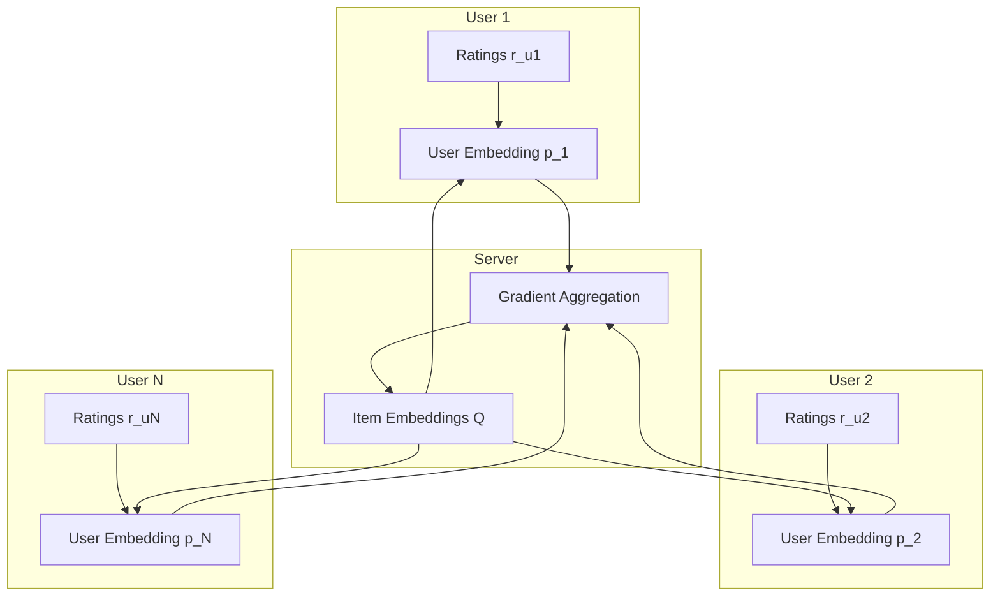
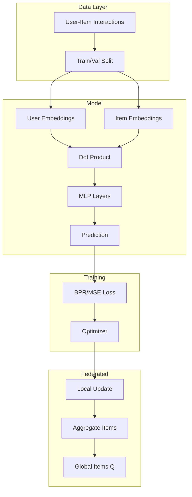

# Tutorial 189: Federated Learning for Recommender Systems

---

## Metadata

| Property | Value |
|----------|-------|
| **Tutorial ID** | 189 |
| **Title** | Federated Learning for Recommender Systems |
| **Category** | Advanced Applications |
| **Difficulty** | Advanced |
| **Duration** | 90 minutes |
| **Prerequisites** | Tutorial 001-010, Matrix factorization basics |
| **Author** | Unbitrium Contributors |
| **Last Updated** | January 2026 |

---

## Learning Objectives

By the end of this tutorial, you will be able to:

1. **Understand** the privacy challenges in recommender systems and how federated learning addresses them.

2. **Implement** federated matrix factorization for collaborative filtering.

3. **Design** federated neural collaborative filtering models.

4. **Handle** the cold-start problem in federated recommendation settings.

5. **Evaluate** recommendation quality using precision, recall, NDCG, and hit rate.

6. **Apply** privacy-preserving techniques to protect user preferences.

---

## Prerequisites

Before starting this tutorial, ensure you have:

- **Completed Tutorials**: 001-010 (Partitioning), 021-030 (Aggregation)
- **Knowledge**: Collaborative filtering, matrix factorization
- **Libraries**: PyTorch, pandas
- **Hardware**: GPU optional

```python
# Verify prerequisites
import torch
import numpy as np
import pandas as pd

print(f"PyTorch: {torch.__version__}")
print(f"NumPy: {np.__version__}")
```

---

## Background and Theory

### Recommender Systems Overview

Recommender systems predict user preferences for items:

$$\hat{r}_{ui} = f(u, i; \theta)$$

where:
- $u$ is the user
- $i$ is the item
- $\hat{r}_{ui}$ is the predicted rating/score
- $\theta$ are model parameters

### Collaborative Filtering

Collaborative filtering leverages user-item interaction patterns:

| Method | Description | Complexity |
|--------|-------------|------------|
| **User-based** | Similar users like similar items | $O(|U|^2)$ |
| **Item-based** | Items liked together | $O(|I|^2)$ |
| **Matrix Factorization** | Low-rank decomposition | $O(k \cdot nnz)$ |
| **Neural CF** | Deep learning approach | $O(model)$ |

### Matrix Factorization

Decompose the rating matrix:

$$R \approx P \cdot Q^T$$

where:
- $P \in \mathbb{R}^{|U| \times k}$ are user embeddings
- $Q \in \mathbb{R}^{|I| \times k}$ are item embeddings
- $k$ is the latent dimension

### Federated Recommendation Architecture



### Challenges in Federated Recommendations

| Challenge | Description | Solution |
|-----------|-------------|----------|
| **Privacy** | Ratings reveal preferences | Local user embeddings |
| **Cold Start** | New users/items | Transfer learning |
| **Sparsity** | Few ratings per user | Implicit feedback |
| **Heterogeneity** | Different rating patterns | Personalization |

---

## Architecture Diagram



---

## Implementation Code

### Part 1: Data Structures and Models

```python
#!/usr/bin/env python3
"""
Tutorial 189: Federated Learning for Recommender Systems

This tutorial demonstrates federated collaborative filtering
for privacy-preserving recommendations.

Author: Unbitrium Contributors
License: EUPL-1.2
"""

from __future__ import annotations

from dataclasses import dataclass
from typing import Any

import numpy as np
import torch
import torch.nn as nn
from torch.utils.data import Dataset, DataLoader


@dataclass
class RecommenderConfig:
    """Configuration for recommender system."""
    num_users: int = 1000
    num_items: int = 500
    embedding_dim: int = 64
    hidden_dims: list[int] = None
    dropout: float = 0.1
    batch_size: int = 256
    learning_rate: float = 0.001
    neg_samples: int = 4

    def __post_init__(self):
        if self.hidden_dims is None:
            self.hidden_dims = [128, 64]


class InteractionDataset(Dataset):
    """Dataset for user-item interactions."""

    def __init__(
        self,
        user_ids: np.ndarray,
        item_ids: np.ndarray,
        ratings: np.ndarray = None,
    ) -> None:
        """Initialize dataset.

        Args:
            user_ids: User indices.
            item_ids: Item indices.
            ratings: Optional explicit ratings.
        """
        self.user_ids = torch.LongTensor(user_ids)
        self.item_ids = torch.LongTensor(item_ids)
        self.ratings = (
            torch.FloatTensor(ratings) if ratings is not None
            else torch.ones(len(user_ids))
        )

    def __len__(self) -> int:
        return len(self.user_ids)

    def __getitem__(self, idx: int) -> dict[str, torch.Tensor]:
        return {
            "user": self.user_ids[idx],
            "item": self.item_ids[idx],
            "rating": self.ratings[idx],
        }


class MatrixFactorization(nn.Module):
    """Matrix factorization model for collaborative filtering."""

    def __init__(
        self,
        num_users: int,
        num_items: int,
        embedding_dim: int = 64,
    ) -> None:
        """Initialize MF model.

        Args:
            num_users: Number of users.
            num_items: Number of items.
            embedding_dim: Embedding dimension.
        """
        super().__init__()
        self.num_users = num_users
        self.num_items = num_items
        self.embedding_dim = embedding_dim

        # User embeddings
        self.user_embeddings = nn.Embedding(num_users, embedding_dim)

        # Item embeddings
        self.item_embeddings = nn.Embedding(num_items, embedding_dim)

        # Biases
        self.user_bias = nn.Embedding(num_users, 1)
        self.item_bias = nn.Embedding(num_items, 1)
        self.global_bias = nn.Parameter(torch.zeros(1))

        # Initialize
        self._init_weights()

    def _init_weights(self) -> None:
        """Initialize embeddings."""
        nn.init.normal_(self.user_embeddings.weight, std=0.01)
        nn.init.normal_(self.item_embeddings.weight, std=0.01)
        nn.init.zeros_(self.user_bias.weight)
        nn.init.zeros_(self.item_bias.weight)

    def forward(
        self,
        users: torch.Tensor,
        items: torch.Tensor,
    ) -> torch.Tensor:
        """Predict ratings.

        Args:
            users: User indices.
            items: Item indices.

        Returns:
            Predicted ratings.
        """
        user_emb = self.user_embeddings(users)
        item_emb = self.item_embeddings(items)

        # Dot product
        dot = (user_emb * item_emb).sum(dim=1)

        # Add biases
        u_bias = self.user_bias(users).squeeze()
        i_bias = self.item_bias(items).squeeze()

        return dot + u_bias + i_bias + self.global_bias


class NeuralCollaborativeFiltering(nn.Module):
    """Neural Collaborative Filtering model."""

    def __init__(
        self,
        num_users: int,
        num_items: int,
        embedding_dim: int = 64,
        hidden_dims: list[int] = None,
        dropout: float = 0.1,
    ) -> None:
        """Initialize NCF model.

        Args:
            num_users: Number of users.
            num_items: Number of items.
            embedding_dim: Embedding dimension.
            hidden_dims: MLP hidden dimensions.
            dropout: Dropout rate.
        """
        super().__init__()
        if hidden_dims is None:
            hidden_dims = [128, 64]

        # GMF embeddings
        self.user_gmf = nn.Embedding(num_users, embedding_dim)
        self.item_gmf = nn.Embedding(num_items, embedding_dim)

        # MLP embeddings
        self.user_mlp = nn.Embedding(num_users, embedding_dim)
        self.item_mlp = nn.Embedding(num_items, embedding_dim)

        # MLP layers
        mlp_layers = []
        prev_dim = embedding_dim * 2
        for hidden_dim in hidden_dims:
            mlp_layers.extend([
                nn.Linear(prev_dim, hidden_dim),
                nn.ReLU(),
                nn.Dropout(dropout),
            ])
            prev_dim = hidden_dim
        self.mlp = nn.Sequential(*mlp_layers)

        # Final prediction
        self.output = nn.Linear(embedding_dim + hidden_dims[-1], 1)

        self._init_weights()

    def _init_weights(self) -> None:
        """Initialize weights."""
        for emb in [self.user_gmf, self.item_gmf, self.user_mlp, self.item_mlp]:
            nn.init.normal_(emb.weight, std=0.01)

    def forward(
        self,
        users: torch.Tensor,
        items: torch.Tensor,
    ) -> torch.Tensor:
        """Predict scores.

        Args:
            users: User indices.
            items: Item indices.

        Returns:
            Predicted scores.
        """
        # GMF path
        gmf_user = self.user_gmf(users)
        gmf_item = self.item_gmf(items)
        gmf_out = gmf_user * gmf_item

        # MLP path
        mlp_user = self.user_mlp(users)
        mlp_item = self.item_mlp(items)
        mlp_input = torch.cat([mlp_user, mlp_item], dim=1)
        mlp_out = self.mlp(mlp_input)

        # Combine
        combined = torch.cat([gmf_out, mlp_out], dim=1)
        output = self.output(combined).squeeze()

        return torch.sigmoid(output)
```

### Part 2: Federated Recommender Client

```python
class FedRecClient:
    """Federated learning client for recommendations."""

    def __init__(
        self,
        client_id: int,
        user_ids: np.ndarray,
        item_ids: np.ndarray,
        ratings: np.ndarray = None,
        num_users: int = None,
        num_items: int = None,
        config: RecommenderConfig = None,
        model_type: str = "mf",
    ) -> None:
        """Initialize recommendation client.

        Args:
            client_id: Client identifier.
            user_ids: User indices in interactions.
            item_ids: Item indices in interactions.
            ratings: Explicit ratings (optional).
            num_users: Total number of users.
            num_items: Total number of items.
            config: Configuration.
            model_type: 'mf' or 'ncf'.
        """
        self.client_id = client_id
        self.config = config or RecommenderConfig()

        # Adjust for global counts
        if num_users is not None:
            self.config.num_users = num_users
        if num_items is not None:
            self.config.num_items = num_items

        # Create dataset
        self.dataset = InteractionDataset(user_ids, item_ids, ratings)
        self.dataloader = DataLoader(
            self.dataset,
            batch_size=self.config.batch_size,
            shuffle=True,
        )

        # Store items for negative sampling
        self.positive_items = set(item_ids.tolist())
        self.all_items = set(range(self.config.num_items))

        # Create model
        if model_type == "mf":
            self.model = MatrixFactorization(
                num_users=self.config.num_users,
                num_items=self.config.num_items,
                embedding_dim=self.config.embedding_dim,
            )
        else:
            self.model = NeuralCollaborativeFiltering(
                num_users=self.config.num_users,
                num_items=self.config.num_items,
                embedding_dim=self.config.embedding_dim,
                hidden_dims=self.config.hidden_dims,
            )

        self.optimizer = torch.optim.Adam(
            self.model.parameters(),
            lr=self.config.learning_rate,
        )

    @property
    def num_interactions(self) -> int:
        """Number of local interactions."""
        return len(self.dataset)

    def load_global_model(self, state_dict: dict[str, torch.Tensor]) -> None:
        """Load global model (item embeddings)."""
        # Only load item-related parameters
        current_state = self.model.state_dict()
        for key, value in state_dict.items():
            if 'item' in key or 'output' in key or 'mlp' in key:
                current_state[key] = value
        self.model.load_state_dict(current_state)

    def sample_negatives(
        self,
        users: torch.Tensor,
        num_neg: int = 4,
    ) -> torch.Tensor:
        """Sample negative items for BPR loss."""
        batch_size = users.size(0)
        neg_items = []

        for _ in range(batch_size):
            neg = []
            for _ in range(num_neg):
                while True:
                    item = np.random.randint(0, self.config.num_items)
                    if item not in self.positive_items:
                        neg.append(item)
                        break
            neg_items.append(neg)

        return torch.LongTensor(neg_items)

    def bpr_loss(
        self,
        users: torch.Tensor,
        pos_items: torch.Tensor,
        neg_items: torch.Tensor,
    ) -> torch.Tensor:
        """Compute BPR loss.

        Args:
            users: User indices.
            pos_items: Positive item indices.
            neg_items: Negative item indices (batch, num_neg).

        Returns:
            BPR loss.
        """
        pos_scores = self.model(users, pos_items)

        neg_scores = []
        for i in range(neg_items.size(1)):
            neg_score = self.model(users, neg_items[:, i])
            neg_scores.append(neg_score)

        neg_scores = torch.stack(neg_scores, dim=1)  # (batch, num_neg)

        # BPR: log sigmoid(pos - neg)
        diff = pos_scores.unsqueeze(1) - neg_scores
        loss = -torch.log(torch.sigmoid(diff) + 1e-8).mean()

        return loss

    def train(self, epochs: int = 5) -> dict[str, Any]:
        """Perform local training.

        Args:
            epochs: Local epochs.

        Returns:
            Update dictionary.
        """
        self.model.train()
        total_loss = 0.0
        num_batches = 0

        for epoch in range(epochs):
            for batch in self.dataloader:
                self.optimizer.zero_grad()

                users = batch["user"]
                items = batch["item"]
                neg_items = self.sample_negatives(
                    users, self.config.neg_samples
                )

                loss = self.bpr_loss(users, items, neg_items)
                loss.backward()
                self.optimizer.step()

                total_loss += loss.item()
                num_batches += 1

        avg_loss = total_loss / num_batches if num_batches > 0 else 0.0

        return {
            "state_dict": {
                k: v.clone() for k, v in self.model.state_dict().items()
                if 'item' in k or 'output' in k or 'mlp' in k
            },
            "num_samples": self.num_interactions,
            "client_id": self.client_id,
            "loss": avg_loss,
        }

    def evaluate(
        self,
        test_items: list[int],
        k: int = 10,
    ) -> dict[str, float]:
        """Evaluate recommendations.

        Args:
            test_items: Held-out test items.
            k: Top-K for metrics.

        Returns:
            Evaluation metrics.
        """
        if not test_items:
            return {}

        self.model.eval()
        user = torch.LongTensor([self.client_id])

        with torch.no_grad():
            all_items = torch.arange(self.config.num_items)
            users = user.repeat(self.config.num_items)
            scores = self.model(users, all_items).numpy()

        # Rank items
        ranked_items = np.argsort(-scores)[:k]
        test_set = set(test_items)

        # Metrics
        hits = sum(1 for item in ranked_items if item in test_set)
        precision = hits / k
        recall = hits / len(test_set) if test_set else 0

        # NDCG
        dcg = sum(
            1 / np.log2(i + 2) for i, item in enumerate(ranked_items)
            if item in test_set
        )
        idcg = sum(1 / np.log2(i + 2) for i in range(min(len(test_set), k)))
        ndcg = dcg / idcg if idcg > 0 else 0

        return {
            "precision": float(precision),
            "recall": float(recall),
            "ndcg": float(ndcg),
            "hit_rate": float(hits > 0),
        }


def federated_recommender(
    num_clients: int = 10,
    num_rounds: int = 20,
    local_epochs: int = 5,
) -> tuple[nn.Module, dict]:
    """Run federated recommendation training.

    Args:
        num_clients: Number of clients.
        num_rounds: Communication rounds.
        local_epochs: Local epochs per round.

    Returns:
        Tuple of (global model, history).
    """
    config = RecommenderConfig(
        num_users=num_clients,
        num_items=500,
    )

    # Generate synthetic data
    clients = []
    for i in range(num_clients):
        num_interactions = np.random.randint(50, 200)
        item_ids = np.random.choice(
            config.num_items,
            size=num_interactions,
            replace=True,
        )
        user_ids = np.full(num_interactions, i, dtype=np.int64)

        client = FedRecClient(
            client_id=i,
            user_ids=user_ids,
            item_ids=item_ids,
            num_users=num_clients,
            num_items=config.num_items,
            config=config,
        )
        clients.append(client)

    # Global model (tracks shared item embeddings)
    global_model = MatrixFactorization(
        num_users=num_clients,
        num_items=config.num_items,
        embedding_dim=config.embedding_dim,
    )

    history = {"rounds": [], "losses": []}

    for round_num in range(num_rounds):
        global_state = global_model.state_dict()

        # Filter to item parameters
        item_state = {
            k: v for k, v in global_state.items()
            if 'item' in k
        }

        for client in clients:
            client.load_global_model(item_state)

        updates = []
        for client in clients:
            update = client.train(epochs=local_epochs)
            updates.append(update)

        # Aggregate item embeddings
        total_samples = sum(u["num_samples"] for u in updates)
        new_state = {}

        for key in item_state.keys():
            if key in updates[0]["state_dict"]:
                weighted_sum = torch.zeros_like(item_state[key])
                for update in updates:
                    weight = update["num_samples"] / total_samples
                    weighted_sum += weight * update["state_dict"][key]
                new_state[key] = weighted_sum

        # Update global model
        current_state = global_model.state_dict()
        current_state.update(new_state)
        global_model.load_state_dict(current_state)

        avg_loss = np.mean([u["loss"] for u in updates])
        history["rounds"].append(round_num)
        history["losses"].append(avg_loss)

        print(f"Round {round_num + 1}/{num_rounds}: loss={avg_loss:.4f}")

    return global_model, history
```

---

## Metrics and Evaluation

### Recommendation Metrics

| Metric | Formula | Interpretation |
|--------|---------|----------------|
| **Precision@K** | $\frac{|Rec_K \cap Rel|}{K}$ | Relevance of recommendations |
| **Recall@K** | $\frac{|Rec_K \cap Rel|}{|Rel|}$ | Coverage of relevant items |
| **NDCG@K** | $\frac{DCG}{IDCG}$ | Ranking quality |
| **Hit Rate** | $\mathbb{1}[|Rec_K \cap Rel| > 0]$ | Binary success |

### Expected Results

| Setting | Precision@10 | NDCG@10 |
|---------|--------------|---------|
| Dense | 0.15 - 0.30 | 0.25 - 0.45 |
| Sparse | 0.05 - 0.15 | 0.10 - 0.25 |

---

## Exercises

### Exercise 1: Cold Start Handling

**Task**: Implement strategies for new users with no interaction history.

### Exercise 2: Privacy Analysis

**Task**: Analyze what information leaks through shared item embeddings.

### Exercise 3: Implicit Feedback

**Task**: Modify for implicit feedback (clicks, views) instead of ratings.

### Exercise 4: Cross-Domain Recommendations

**Task**: Implement federated cross-domain recommendations.

---

## References

1. Ammad-ud-din, M., et al. (2019). Federated collaborative filtering for privacy-preserving personalized recommendation system. *arXiv*.

2. He, X., et al. (2017). Neural collaborative filtering. In *WWW*.

3. Rendle, S., et al. (2009). BPR: Bayesian personalized ranking from implicit feedback. In *UAI*.

4. Koren, Y., Bell, R., & Volinsky, C. (2009). Matrix factorization techniques for recommender systems. *Computer*.

5. Lin, G., et al. (2020). FedRec: Federated recommendation with explicit feedback. *IEEE Intelligent Systems*.

---

*Copyright 2026 Olaf Yunus Laitinen Imanov and Contributors. Released under EUPL 1.2.*
