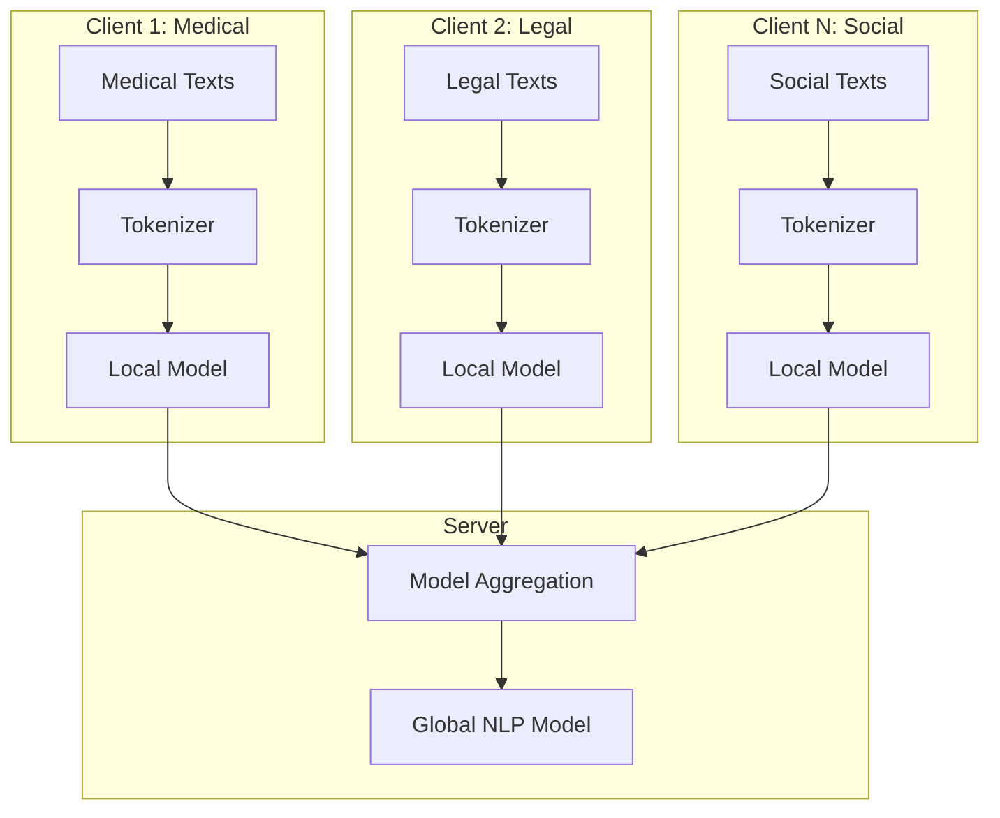
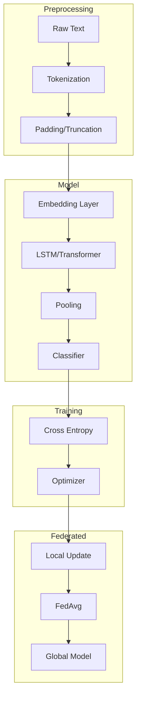

# Tutorial 190: Federated Learning for Natural Language Processing

---

## Metadata

| Property | Value |
|----------|-------|
| **Tutorial ID** | 190 |
| **Title** | Federated Learning for Natural Language Processing |
| **Category** | Advanced Applications |
| **Difficulty** | Advanced |
| **Duration** | 90 minutes |
| **Prerequisites** | Tutorial 001-010, NLP basics, Transformers |
| **Author** | Unbitrium Contributors |
| **Last Updated** | January 2026 |

---

## Learning Objectives

By the end of this tutorial, you will be able to:

1. **Understand** the unique challenges of federated NLP including vocabulary heterogeneity and sequence length variation.

2. **Implement** federated text classification with LSTM and Transformer encoders.

3. **Design** federated language models for next-token prediction.

4. **Handle** out-of-vocabulary tokens and vocabulary alignment across clients.

5. **Apply** differential privacy for protecting sensitive text data.

6. **Evaluate** federated NLP models using perplexity, accuracy, and F1 scores.

---

## Prerequisites

Before starting this tutorial, ensure you have:

- **Completed Tutorials**: 001-010 (Partitioning), 021-030 (Aggregation)
- **Knowledge**: Text preprocessing, word embeddings, attention mechanisms
- **Libraries**: PyTorch, torchtext (optional)
- **Hardware**: GPU recommended for transformers

```python
# Verify prerequisites
import torch
import numpy as np

print(f"PyTorch: {torch.__version__}")
print(f"CUDA available: {torch.cuda.is_available()}")
```

---

## Background and Theory

### NLP Tasks in Federated Settings

| Task | Description | Challenge |
|------|-------------|-----------|
| **Text Classification** | Categorize documents | Label heterogeneity |
| **Named Entity Recognition** | Extract entities | Domain-specific entities |
| **Language Modeling** | Predict next token | Vocabulary size |
| **Sentiment Analysis** | Detect sentiment | Cultural differences |

### Vocabulary Challenges

Different clients may have different word distributions:

$$\mathcal{V}_k \neq \mathcal{V}_j \quad \text{for clients } k \neq j$$

Solutions include:
- Shared global vocabulary
- Subword tokenization (BPE, WordPiece)
- Character-level models

### Federated NLP Architecture



### Privacy in Text Data

Text data contains highly sensitive information:
- Personal identifiers
- Medical records
- Private communications

Differential privacy for embeddings:

$$\tilde{E} = E + \mathcal{N}(0, \sigma^2 I)$$

---

## Architecture Diagram



---

## Implementation Code

### Part 1: Text Preprocessing and Dataset

```python
#!/usr/bin/env python3
"""
Tutorial 190: Federated Learning for Natural Language Processing

This tutorial demonstrates federated text classification
across distributed text corpora.

Author: Unbitrium Contributors
License: EUPL-1.2
"""

from __future__ import annotations

import re
from collections import Counter
from dataclasses import dataclass, field
from typing import Any

import numpy as np
import torch
import torch.nn as nn
from torch.utils.data import Dataset, DataLoader
from torch.nn.utils.rnn import pad_sequence


@dataclass
class NLPConfig:
    """Configuration for federated NLP."""
    vocab_size: int = 10000
    embedding_dim: int = 128
    hidden_dim: int = 256
    num_layers: int = 2
    num_classes: int = 4
    max_length: int = 128
    dropout: float = 0.3
    batch_size: int = 32
    learning_rate: float = 0.001


class Vocabulary:
    """Vocabulary for text tokenization."""

    def __init__(self, max_size: int = 10000) -> None:
        """Initialize vocabulary.

        Args:
            max_size: Maximum vocabulary size.
        """
        self.max_size = max_size
        self.word2idx = {"<PAD>": 0, "<UNK>": 1, "<BOS>": 2, "<EOS>": 3}
        self.idx2word = {v: k for k, v in self.word2idx.items()}
        self.word_counts = Counter()

    def build(self, texts: list[str]) -> None:
        """Build vocabulary from texts.

        Args:
            texts: List of text documents.
        """
        for text in texts:
            tokens = self.tokenize(text)
            self.word_counts.update(tokens)

        # Add most common words
        for word, _ in self.word_counts.most_common(self.max_size - 4):
            if word not in self.word2idx:
                idx = len(self.word2idx)
                self.word2idx[word] = idx
                self.idx2word[idx] = word

    def tokenize(self, text: str) -> list[str]:
        """Simple tokenization."""
        text = text.lower()
        text = re.sub(r"[^a-zA-Z\s]", "", text)
        return text.split()

    def encode(self, text: str, max_length: int = None) -> list[int]:
        """Encode text to indices."""
        tokens = self.tokenize(text)
        if max_length:
            tokens = tokens[:max_length]
        return [self.word2idx.get(t, 1) for t in tokens]  # 1 = <UNK>

    def decode(self, indices: list[int]) -> str:
        """Decode indices to text."""
        return " ".join(self.idx2word.get(i, "<UNK>") for i in indices)

    def __len__(self) -> int:
        return len(self.word2idx)


class TextDataset(Dataset):
    """Dataset for text classification."""

    def __init__(
        self,
        texts: list[str],
        labels: list[int],
        vocab: Vocabulary,
        max_length: int = 128,
    ) -> None:
        """Initialize dataset.

        Args:
            texts: List of text documents.
            labels: List of labels.
            vocab: Vocabulary object.
            max_length: Maximum sequence length.
        """
        self.texts = texts
        self.labels = labels
        self.vocab = vocab
        self.max_length = max_length

    def __len__(self) -> int:
        return len(self.texts)

    def __getitem__(self, idx: int) -> dict[str, torch.Tensor]:
        text = self.texts[idx]
        label = self.labels[idx]

        # Encode
        indices = self.vocab.encode(text, self.max_length)

        return {
            "input_ids": torch.LongTensor(indices),
            "label": torch.tensor(label, dtype=torch.long),
            "length": torch.tensor(len(indices), dtype=torch.long),
        }


def collate_fn(batch: list[dict]) -> dict[str, torch.Tensor]:
    """Collate function for padding."""
    input_ids = [item["input_ids"] for item in batch]
    labels = torch.stack([item["label"] for item in batch])
    lengths = torch.stack([item["length"] for item in batch])

    # Pad sequences
    input_ids = pad_sequence(input_ids, batch_first=True, padding_value=0)

    return {
        "input_ids": input_ids,
        "labels": labels,
        "lengths": lengths,
    }
```

### Part 2: Text Classification Models

```python
class LSTMClassifier(nn.Module):
    """LSTM-based text classifier."""

    def __init__(
        self,
        vocab_size: int,
        embedding_dim: int = 128,
        hidden_dim: int = 256,
        num_layers: int = 2,
        num_classes: int = 4,
        dropout: float = 0.3,
        bidirectional: bool = True,
    ) -> None:
        """Initialize LSTM classifier.

        Args:
            vocab_size: Vocabulary size.
            embedding_dim: Embedding dimension.
            hidden_dim: LSTM hidden dimension.
            num_layers: Number of LSTM layers.
            num_classes: Number of output classes.
            dropout: Dropout rate.
            bidirectional: Whether to use bidirectional LSTM.
        """
        super().__init__()
        self.hidden_dim = hidden_dim
        self.num_layers = num_layers
        self.bidirectional = bidirectional
        self.num_directions = 2 if bidirectional else 1

        # Embedding layer
        self.embedding = nn.Embedding(
            vocab_size, embedding_dim, padding_idx=0
        )

        # LSTM
        self.lstm = nn.LSTM(
            input_size=embedding_dim,
            hidden_size=hidden_dim,
            num_layers=num_layers,
            batch_first=True,
            dropout=dropout if num_layers > 1 else 0,
            bidirectional=bidirectional,
        )

        # Classifier
        self.dropout = nn.Dropout(dropout)
        self.classifier = nn.Linear(
            hidden_dim * self.num_directions, num_classes
        )

    def forward(
        self,
        input_ids: torch.Tensor,
        lengths: torch.Tensor = None,
    ) -> torch.Tensor:
        """Forward pass.

        Args:
            input_ids: Token indices (batch, seq_len).
            lengths: Sequence lengths.

        Returns:
            Logits (batch, num_classes).
        """
        # Embed
        embedded = self.embedding(input_ids)  # (batch, seq, embed)

        # LSTM
        if lengths is not None:
            # Pack padded sequence for efficiency
            packed = nn.utils.rnn.pack_padded_sequence(
                embedded,
                lengths.cpu(),
                batch_first=True,
                enforce_sorted=False,
            )
            output, (hidden, cell) = self.lstm(packed)
        else:
            output, (hidden, cell) = self.lstm(embedded)

        # Use final hidden state
        if self.bidirectional:
            hidden = torch.cat([hidden[-2], hidden[-1]], dim=1)
        else:
            hidden = hidden[-1]

        # Classify
        hidden = self.dropout(hidden)
        logits = self.classifier(hidden)

        return logits


class TransformerClassifier(nn.Module):
    """Transformer-based text classifier."""

    def __init__(
        self,
        vocab_size: int,
        embedding_dim: int = 128,
        nhead: int = 4,
        num_layers: int = 2,
        num_classes: int = 4,
        dropout: float = 0.3,
        max_length: int = 128,
    ) -> None:
        """Initialize Transformer classifier."""
        super().__init__()
        self.embedding_dim = embedding_dim

        # Token embedding
        self.embedding = nn.Embedding(vocab_size, embedding_dim, padding_idx=0)

        # Positional encoding
        self.pos_encoding = PositionalEncoding(embedding_dim, dropout, max_length)

        # Transformer encoder
        encoder_layer = nn.TransformerEncoderLayer(
            d_model=embedding_dim,
            nhead=nhead,
            dim_feedforward=embedding_dim * 4,
            dropout=dropout,
            batch_first=True,
        )
        self.transformer = nn.TransformerEncoder(encoder_layer, num_layers)

        # Classifier
        self.classifier = nn.Linear(embedding_dim, num_classes)

    def forward(
        self,
        input_ids: torch.Tensor,
        lengths: torch.Tensor = None,
    ) -> torch.Tensor:
        """Forward pass."""
        # Create attention mask for padding
        mask = (input_ids == 0)  # True for padding

        # Embed and add positional encoding
        x = self.embedding(input_ids) * np.sqrt(self.embedding_dim)
        x = self.pos_encoding(x)

        # Transformer
        x = self.transformer(x, src_key_padding_mask=mask)

        # Pool (mean of non-padding tokens)
        if lengths is not None:
            mask_expanded = ~mask.unsqueeze(-1).expand(x.size())
            x = (x * mask_expanded).sum(dim=1) / lengths.unsqueeze(-1).float()
        else:
            x = x.mean(dim=1)

        # Classify
        logits = self.classifier(x)

        return logits


class PositionalEncoding(nn.Module):
    """Positional encoding for Transformer."""

    def __init__(self, d_model: int, dropout: float, max_len: int = 5000):
        super().__init__()
        self.dropout = nn.Dropout(p=dropout)

        pe = torch.zeros(max_len, d_model)
        position = torch.arange(0, max_len, dtype=torch.float).unsqueeze(1)
        div_term = torch.exp(
            torch.arange(0, d_model, 2).float() * (-np.log(10000.0) / d_model)
        )
        pe[:, 0::2] = torch.sin(position * div_term)
        pe[:, 1::2] = torch.cos(position * div_term)
        pe = pe.unsqueeze(0)
        self.register_buffer("pe", pe)

    def forward(self, x: torch.Tensor) -> torch.Tensor:
        x = x + self.pe[:, :x.size(1), :]
        return self.dropout(x)
```

### Part 3: Federated NLP Client

```python
class FedNLPClient:
    """Federated learning client for NLP."""

    def __init__(
        self,
        client_id: int,
        texts: list[str],
        labels: list[int],
        vocab: Vocabulary,
        config: NLPConfig = None,
        model_type: str = "lstm",
    ) -> None:
        """Initialize NLP client.

        Args:
            client_id: Client identifier.
            texts: List of texts.
            labels: List of labels.
            vocab: Shared vocabulary.
            config: Configuration.
            model_type: 'lstm' or 'transformer'.
        """
        self.client_id = client_id
        self.config = config or NLPConfig()

        # Create dataset
        self.dataset = TextDataset(texts, labels, vocab, self.config.max_length)
        self.dataloader = DataLoader(
            self.dataset,
            batch_size=self.config.batch_size,
            shuffle=True,
            collate_fn=collate_fn,
        )

        # Create model
        if model_type == "lstm":
            self.model = LSTMClassifier(
                vocab_size=len(vocab),
                embedding_dim=self.config.embedding_dim,
                hidden_dim=self.config.hidden_dim,
                num_layers=self.config.num_layers,
                num_classes=self.config.num_classes,
                dropout=self.config.dropout,
            )
        else:
            self.model = TransformerClassifier(
                vocab_size=len(vocab),
                embedding_dim=self.config.embedding_dim,
                num_layers=self.config.num_layers,
                num_classes=self.config.num_classes,
                dropout=self.config.dropout,
            )

        self.optimizer = torch.optim.Adam(
            self.model.parameters(),
            lr=self.config.learning_rate,
        )
        self.criterion = nn.CrossEntropyLoss()

    @property
    def num_samples(self) -> int:
        """Number of local samples."""
        return len(self.dataset)

    def load_global_model(self, state_dict: dict[str, torch.Tensor]) -> None:
        """Load global model."""
        self.model.load_state_dict(state_dict)

    def train(self, epochs: int = 5) -> dict[str, Any]:
        """Perform local training."""
        self.model.train()
        total_loss = 0.0
        correct = 0
        total = 0

        for epoch in range(epochs):
            for batch in self.dataloader:
                self.optimizer.zero_grad()

                logits = self.model(batch["input_ids"], batch["lengths"])
                loss = self.criterion(logits, batch["labels"])

                loss.backward()
                torch.nn.utils.clip_grad_norm_(self.model.parameters(), 1.0)
                self.optimizer.step()

                total_loss += loss.item()
                preds = logits.argmax(dim=1)
                correct += (preds == batch["labels"]).sum().item()
                total += len(batch["labels"])

        accuracy = correct / total if total > 0 else 0.0

        return {
            "state_dict": {
                k: v.clone() for k, v in self.model.state_dict().items()
            },
            "num_samples": self.num_samples,
            "client_id": self.client_id,
            "loss": total_loss / len(self.dataloader) / epochs,
            "accuracy": accuracy,
        }


def federated_nlp_training(
    num_clients: int = 5,
    num_rounds: int = 20,
    local_epochs: int = 5,
) -> tuple[nn.Module, dict]:
    """Run federated NLP training."""
    config = NLPConfig()

    # Generate synthetic data
    categories = ["tech", "sports", "politics", "entertainment"]
    all_texts = []
    all_labels = []

    for i in range(num_clients):
        num_docs = np.random.randint(100, 300)
        for _ in range(num_docs):
            label = np.random.randint(0, 4)
            # Generate dummy text
            words = np.random.choice(
                ["the", "is", "a", "of", "and", "to", "in", "for", "on", "with",
                 "technology", "sports", "politics", "entertainment", "news",
                 "computer", "game", "election", "movie", "music"],
                size=np.random.randint(20, 100),
            )
            text = " ".join(words)
            all_texts.append(text)
            all_labels.append(label)

    # Build shared vocabulary
    vocab = Vocabulary(max_size=config.vocab_size)
    vocab.build(all_texts)

    # Create clients
    clients = []
    texts_per_client = len(all_texts) // num_clients

    for i in range(num_clients):
        start = i * texts_per_client
        end = start + texts_per_client
        client = FedNLPClient(
            client_id=i,
            texts=all_texts[start:end],
            labels=all_labels[start:end],
            vocab=vocab,
            config=config,
        )
        clients.append(client)

    # Global model
    global_model = LSTMClassifier(
        vocab_size=len(vocab),
        embedding_dim=config.embedding_dim,
        hidden_dim=config.hidden_dim,
        num_layers=config.num_layers,
        num_classes=config.num_classes,
    )

    history = {"rounds": [], "losses": [], "accuracies": []}

    for round_num in range(num_rounds):
        global_state = global_model.state_dict()
        for client in clients:
            client.load_global_model(global_state)

        updates = []
        for client in clients:
            update = client.train(epochs=local_epochs)
            updates.append(update)

        # FedAvg
        total_samples = sum(u["num_samples"] for u in updates)
        new_state = {}
        for key in global_state.keys():
            weighted_sum = torch.zeros_like(global_state[key])
            for update in updates:
                weight = update["num_samples"] / total_samples
                weighted_sum += weight * update["state_dict"][key]
            new_state[key] = weighted_sum

        global_model.load_state_dict(new_state)

        avg_loss = np.mean([u["loss"] for u in updates])
        avg_acc = np.mean([u["accuracy"] for u in updates])

        history["rounds"].append(round_num)
        history["losses"].append(avg_loss)
        history["accuracies"].append(avg_acc)

        print(f"Round {round_num + 1}/{num_rounds}: "
              f"loss={avg_loss:.4f}, acc={avg_acc:.4f}")

    return global_model, history
```

---

## Metrics and Evaluation

### NLP Metrics

| Metric | Formula | Use Case |
|--------|---------|----------|
| **Accuracy** | $\frac{TP + TN}{Total}$ | Classification |
| **F1 Score** | $\frac{2 \cdot P \cdot R}{P + R}$ | Imbalanced data |
| **Perplexity** | $2^{H(p)}$ | Language modeling |
| **BLEU** | n-gram precision | Generation |

### Expected Results

| Task | Expected Accuracy |
|------|------------------|
| Text Classification | 0.75 - 0.90 |
| Sentiment Analysis | 0.80 - 0.92 |

---

## Exercises

### Exercise 1: Vocabulary Alignment

**Task**: Implement subword tokenization (BPE) for better vocabulary sharing.

### Exercise 2: Domain Adaptation

**Task**: Handle clients with very different text domains.

### Exercise 3: Privacy for Text

**Task**: Apply differential privacy to embeddings.

### Exercise 4: Multilingual FL

**Task**: Extend to multilingual text with shared representations.

---

## References

1. Hard, A., et al. (2018). Federated learning for mobile keyboard prediction. *arXiv*.

2. Liu, Y., et al. (2021). Federated learning for NLP: A survey. *arXiv*.

3. McMahan, H. B., et al. (2017). Communication-efficient learning of deep networks. In *AISTATS*.

4. Devlin, J., et al. (2019). BERT: Pre-training of deep bidirectional transformers. In *NAACL*.

5. Lin, T., et al. (2021). FedNLP: Benchmarking federated learning methods for NLP. In *NAACL Findings*.

---

*Copyright 2026 Olaf Yunus Laitinen Imanov and Contributors. Released under EUPL 1.2.*
