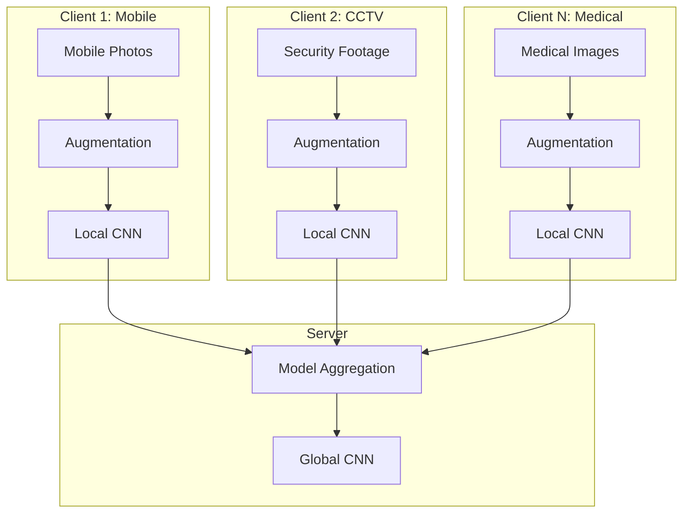
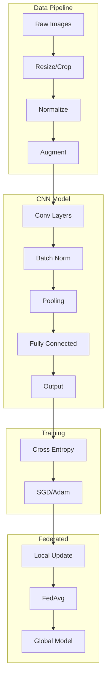

# Tutorial 191: Federated Learning for Computer Vision

---

## Metadata

| Property | Value |
|----------|-------|
| **Tutorial ID** | 191 |
| **Title** | Federated Learning for Computer Vision |
| **Category** | Advanced Applications |
| **Difficulty** | Advanced |
| **Duration** | 90 minutes |
| **Prerequisites** | Tutorial 001-010, CNN basics |
| **Author** | Unbitrium Contributors |
| **Last Updated** | January 2026 |

---

## Learning Objectives

By the end of this tutorial, you will be able to:

1. **Understand** the unique challenges of federated computer vision including data heterogeneity in image distributions.

2. **Implement** federated image classification with CNNs and ResNets.

3. **Design** federated object detection models with efficient aggregation strategies.

4. **Handle** domain shift across different image sources and camera types.

5. **Apply** data augmentation techniques to improve generalization in federated settings.

6. **Evaluate** federated vision models using accuracy, mAP, and IoU metrics.

---

## Prerequisites

Before starting this tutorial, ensure you have:

- **Completed Tutorials**: 001-010 (Partitioning), 021-030 (Aggregation)
- **Knowledge**: Convolutional neural networks, image preprocessing
- **Libraries**: PyTorch, torchvision
- **Hardware**: GPU recommended

```python
# Verify prerequisites
import torch
import torchvision
import numpy as np

print(f"PyTorch: {torch.__version__}")
print(f"Torchvision: {torchvision.__version__}")
print(f"CUDA available: {torch.cuda.is_available()}")
```

---

## Background and Theory

### Computer Vision in Federated Settings

Federated computer vision faces unique challenges:

| Challenge | Description | Example |
|-----------|-------------|---------|
| **Domain Shift** | Different image sources | Medical vs consumer cameras |
| **Resolution Variance** | Different image sizes | Phone vs DSLR |
| **Label Heterogeneity** | Different label distributions | Urban vs rural scenes |
| **Lighting Conditions** | Varying environments | Indoor vs outdoor |

### Image Classification Architecture

Standard CNN classification pipeline:

$$\hat{y} = \text{softmax}(f_\theta(x))$$

where $f_\theta$ is a CNN with parameters $\theta$.

### Federated Vision Architecture



### Domain Adaptation Techniques

| Technique | Description | Benefit |
|-----------|-------------|---------|
| **Batch Norm** | Local statistics | Domain-specific |
| **Feature Alignment** | Match distributions | Transfer learning |
| **Data Augmentation** | Increase diversity | Robustness |
| **Style Transfer** | Domain randomization | Generalization |

---

## Architecture Diagram



---

## Implementation Code

### Part 1: Data Preprocessing and Augmentation

```python
#!/usr/bin/env python3
"""
Tutorial 191: Federated Learning for Computer Vision

This tutorial demonstrates federated image classification
using CNNs with domain adaptation techniques.

Author: Unbitrium Contributors
License: EUPL-1.2
"""

from __future__ import annotations

from dataclasses import dataclass
from typing import Any, Callable

import numpy as np
import torch
import torch.nn as nn
import torch.nn.functional as F
from torch.utils.data import Dataset, DataLoader
import torchvision.transforms as transforms


@dataclass
class VisionConfig:
    """Configuration for federated computer vision."""
    image_size: int = 32
    num_channels: int = 3
    num_classes: int = 10
    batch_size: int = 32
    learning_rate: float = 0.01
    momentum: float = 0.9
    weight_decay: float = 1e-4


def get_transforms(
    image_size: int = 32,
    train: bool = True,
    augment_strength: str = "medium",
) -> transforms.Compose:
    """Get image transforms.

    Args:
        image_size: Target image size.
        train: Whether for training.
        augment_strength: 'light', 'medium', or 'heavy'.

    Returns:
        Compose transform.
    """
    normalize = transforms.Normalize(
        mean=[0.485, 0.456, 0.406],
        std=[0.229, 0.224, 0.225],
    )

    if not train:
        return transforms.Compose([
            transforms.Resize(image_size),
            transforms.CenterCrop(image_size),
            transforms.ToTensor(),
            normalize,
        ])

    if augment_strength == "light":
        augmentations = [
            transforms.RandomHorizontalFlip(),
        ]
    elif augment_strength == "medium":
        augmentations = [
            transforms.RandomHorizontalFlip(),
            transforms.RandomCrop(image_size, padding=4),
            transforms.ColorJitter(0.2, 0.2, 0.2),
        ]
    else:  # heavy
        augmentations = [
            transforms.RandomHorizontalFlip(),
            transforms.RandomCrop(image_size, padding=4),
            transforms.ColorJitter(0.4, 0.4, 0.4, 0.1),
            transforms.RandomRotation(15),
            transforms.RandomAffine(0, translate=(0.1, 0.1)),
        ]

    return transforms.Compose([
        transforms.Resize(image_size),
        *augmentations,
        transforms.ToTensor(),
        normalize,
    ])


class SyntheticImageDataset(Dataset):
    """Synthetic image dataset for testing."""

    def __init__(
        self,
        num_samples: int = 1000,
        image_size: int = 32,
        num_classes: int = 10,
        seed: int = None,
        domain_shift: float = 0.0,
    ) -> None:
        """Initialize dataset.

        Args:
            num_samples: Number of samples.
            image_size: Image size.
            num_classes: Number of classes.
            seed: Random seed.
            domain_shift: Amount of domain shift.
        """
        if seed is not None:
            np.random.seed(seed)

        self.images = np.random.randn(
            num_samples, 3, image_size, image_size
        ).astype(np.float32)

        # Apply domain shift
        if domain_shift > 0:
            self.images += domain_shift * np.random.randn(1, 3, 1, 1)

        # Normalize
        self.images = (self.images - self.images.mean()) / (self.images.std() + 1e-8)

        self.labels = np.random.randint(0, num_classes, num_samples)

    def __len__(self) -> int:
        return len(self.images)

    def __getitem__(self, idx: int) -> tuple[torch.Tensor, int]:
        image = torch.FloatTensor(self.images[idx])
        label = int(self.labels[idx])
        return image, label
```

### Part 2: CNN Models

```python
class SimpleCNN(nn.Module):
    """Simple CNN for image classification."""

    def __init__(
        self,
        num_channels: int = 3,
        num_classes: int = 10,
        image_size: int = 32,
    ) -> None:
        """Initialize CNN.

        Args:
            num_channels: Input channels.
            num_classes: Output classes.
            image_size: Input image size.
        """
        super().__init__()

        self.features = nn.Sequential(
            # Conv block 1
            nn.Conv2d(num_channels, 32, 3, padding=1),
            nn.BatchNorm2d(32),
            nn.ReLU(inplace=True),
            nn.Conv2d(32, 32, 3, padding=1),
            nn.BatchNorm2d(32),
            nn.ReLU(inplace=True),
            nn.MaxPool2d(2),

            # Conv block 2
            nn.Conv2d(32, 64, 3, padding=1),
            nn.BatchNorm2d(64),
            nn.ReLU(inplace=True),
            nn.Conv2d(64, 64, 3, padding=1),
            nn.BatchNorm2d(64),
            nn.ReLU(inplace=True),
            nn.MaxPool2d(2),

            # Conv block 3
            nn.Conv2d(64, 128, 3, padding=1),
            nn.BatchNorm2d(128),
            nn.ReLU(inplace=True),
            nn.Conv2d(128, 128, 3, padding=1),
            nn.BatchNorm2d(128),
            nn.ReLU(inplace=True),
            nn.MaxPool2d(2),
        )

        # Calculate flattened size
        self.flat_size = 128 * (image_size // 8) ** 2

        self.classifier = nn.Sequential(
            nn.Dropout(0.5),
            nn.Linear(self.flat_size, 256),
            nn.ReLU(inplace=True),
            nn.Dropout(0.5),
            nn.Linear(256, num_classes),
        )

    def forward(self, x: torch.Tensor) -> torch.Tensor:
        """Forward pass."""
        x = self.features(x)
        x = x.view(x.size(0), -1)
        x = self.classifier(x)
        return x


class ResidualBlock(nn.Module):
    """Residual block for ResNet."""

    def __init__(
        self,
        in_channels: int,
        out_channels: int,
        stride: int = 1,
    ) -> None:
        super().__init__()

        self.conv1 = nn.Conv2d(
            in_channels, out_channels, 3, stride=stride, padding=1, bias=False
        )
        self.bn1 = nn.BatchNorm2d(out_channels)
        self.conv2 = nn.Conv2d(
            out_channels, out_channels, 3, stride=1, padding=1, bias=False
        )
        self.bn2 = nn.BatchNorm2d(out_channels)

        self.shortcut = nn.Sequential()
        if stride != 1 or in_channels != out_channels:
            self.shortcut = nn.Sequential(
                nn.Conv2d(in_channels, out_channels, 1, stride=stride, bias=False),
                nn.BatchNorm2d(out_channels),
            )

    def forward(self, x: torch.Tensor) -> torch.Tensor:
        out = F.relu(self.bn1(self.conv1(x)))
        out = self.bn2(self.conv2(out))
        out += self.shortcut(x)
        out = F.relu(out)
        return out


class ResNet(nn.Module):
    """ResNet for image classification."""

    def __init__(
        self,
        num_classes: int = 10,
        num_blocks: list[int] = None,
    ) -> None:
        super().__init__()
        if num_blocks is None:
            num_blocks = [2, 2, 2, 2]  # ResNet-18 style

        self.in_channels = 64

        self.conv1 = nn.Conv2d(3, 64, 3, stride=1, padding=1, bias=False)
        self.bn1 = nn.BatchNorm2d(64)

        self.layer1 = self._make_layer(64, num_blocks[0], stride=1)
        self.layer2 = self._make_layer(128, num_blocks[1], stride=2)
        self.layer3 = self._make_layer(256, num_blocks[2], stride=2)
        self.layer4 = self._make_layer(512, num_blocks[3], stride=2)

        self.avgpool = nn.AdaptiveAvgPool2d((1, 1))
        self.fc = nn.Linear(512, num_classes)

    def _make_layer(
        self,
        out_channels: int,
        num_blocks: int,
        stride: int,
    ) -> nn.Sequential:
        strides = [stride] + [1] * (num_blocks - 1)
        layers = []
        for stride in strides:
            layers.append(ResidualBlock(self.in_channels, out_channels, stride))
            self.in_channels = out_channels
        return nn.Sequential(*layers)

    def forward(self, x: torch.Tensor) -> torch.Tensor:
        out = F.relu(self.bn1(self.conv1(x)))
        out = self.layer1(out)
        out = self.layer2(out)
        out = self.layer3(out)
        out = self.layer4(out)
        out = self.avgpool(out)
        out = out.view(out.size(0), -1)
        out = self.fc(out)
        return out
```

### Part 3: Federated Vision Client

```python
class FedVisionClient:
    """Federated learning client for computer vision."""

    def __init__(
        self,
        client_id: int,
        dataset: Dataset,
        config: VisionConfig = None,
        model_type: str = "cnn",
    ) -> None:
        """Initialize vision client.

        Args:
            client_id: Client identifier.
            dataset: Image dataset.
            config: Configuration.
            model_type: 'cnn' or 'resnet'.
        """
        self.client_id = client_id
        self.config = config or VisionConfig()

        self.dataloader = DataLoader(
            dataset,
            batch_size=self.config.batch_size,
            shuffle=True,
        )

        if model_type == "cnn":
            self.model = SimpleCNN(
                num_channels=self.config.num_channels,
                num_classes=self.config.num_classes,
                image_size=self.config.image_size,
            )
        else:
            self.model = ResNet(num_classes=self.config.num_classes)

        self.optimizer = torch.optim.SGD(
            self.model.parameters(),
            lr=self.config.learning_rate,
            momentum=self.config.momentum,
            weight_decay=self.config.weight_decay,
        )
        self.criterion = nn.CrossEntropyLoss()
        self.device = torch.device("cuda" if torch.cuda.is_available() else "cpu")
        self.model.to(self.device)

    @property
    def num_samples(self) -> int:
        return len(self.dataloader.dataset)

    def load_global_model(self, state_dict: dict[str, torch.Tensor]) -> None:
        self.model.load_state_dict(state_dict)

    def train(self, epochs: int = 5) -> dict[str, Any]:
        self.model.train()
        total_loss = 0.0
        correct = 0
        total = 0

        for epoch in range(epochs):
            for images, labels in self.dataloader:
                images = images.to(self.device)
                labels = labels.to(self.device)

                self.optimizer.zero_grad()
                outputs = self.model(images)
                loss = self.criterion(outputs, labels)
                loss.backward()
                self.optimizer.step()

                total_loss += loss.item()
                _, predicted = outputs.max(1)
                total += labels.size(0)
                correct += predicted.eq(labels).sum().item()

        accuracy = correct / total if total > 0 else 0.0
        avg_loss = total_loss / len(self.dataloader) / epochs

        return {
            "state_dict": {k: v.cpu().clone() for k, v in self.model.state_dict().items()},
            "num_samples": self.num_samples,
            "client_id": self.client_id,
            "loss": avg_loss,
            "accuracy": accuracy,
        }


def federated_vision_training(
    num_clients: int = 5,
    num_rounds: int = 20,
    local_epochs: int = 5,
    heterogeneous: bool = True,
) -> tuple[nn.Module, dict]:
    """Run federated vision training."""
    config = VisionConfig()

    clients = []
    for i in range(num_clients):
        domain_shift = i * 0.5 if heterogeneous else 0.0
        dataset = SyntheticImageDataset(
            num_samples=500,
            image_size=config.image_size,
            num_classes=config.num_classes,
            seed=i * 100,
            domain_shift=domain_shift,
        )
        client = FedVisionClient(client_id=i, dataset=dataset, config=config)
        clients.append(client)

    global_model = SimpleCNN(
        num_channels=config.num_channels,
        num_classes=config.num_classes,
        image_size=config.image_size,
    )

    history = {"rounds": [], "losses": [], "accuracies": []}

    for round_num in range(num_rounds):
        global_state = global_model.state_dict()
        for client in clients:
            client.load_global_model(global_state)

        updates = []
        for client in clients:
            update = client.train(epochs=local_epochs)
            updates.append(update)

        total_samples = sum(u["num_samples"] for u in updates)
        new_state = {}
        for key in global_state.keys():
            weighted_sum = torch.zeros_like(global_state[key])
            for update in updates:
                weight = update["num_samples"] / total_samples
                weighted_sum += weight * update["state_dict"][key]
            new_state[key] = weighted_sum

        global_model.load_state_dict(new_state)

        avg_loss = np.mean([u["loss"] for u in updates])
        avg_acc = np.mean([u["accuracy"] for u in updates])
        history["rounds"].append(round_num)
        history["losses"].append(avg_loss)
        history["accuracies"].append(avg_acc)

        print(f"Round {round_num + 1}/{num_rounds}: loss={avg_loss:.4f}, acc={avg_acc:.4f}")

    return global_model, history
```

---

## Metrics and Evaluation

### Classification Metrics

| Metric | Formula | Use Case |
|--------|---------|----------|
| **Accuracy** | $\frac{Correct}{Total}$ | Balanced classes |
| **Top-5 Accuracy** | Correct in top 5 | ImageNet |
| **F1 Score** | Harmonic mean P, R | Imbalanced |
| **mAP** | Mean average precision | Detection |

### Expected Results

| Model | CIFAR-10 Accuracy |
|-------|------------------|
| SimpleCNN | 0.70 - 0.80 |
| ResNet-18 | 0.85 - 0.92 |

---

## Exercises

### Exercise 1: Domain Adaptation

**Task**: Implement batch normalization with local statistics for domain adaptation.

### Exercise 2: Feature Alignment

**Task**: Add a domain discriminator for adversarial domain adaptation.

### Exercise 3: Object Detection

**Task**: Extend to federated YOLO-style object detection.

### Exercise 4: Segmentation

**Task**: Implement federated semantic segmentation with U-Net.

---

## References

1. Liu, Q., et al. (2020). FedVision: An online visual object detection platform powered by federated learning. In *AAAI*.

2. He, K., et al. (2016). Deep residual learning for image recognition. In *CVPR*.

3. Hsu, T. M. H., et al. (2019). Measuring the effects of non-identical data distribution for federated visual classification. *arXiv*.

4. Li, D., et al. (2021). FedBN: Federated learning on non-IID features via local batch normalization. In *ICLR*.

5. Krizhevsky, A., et al. (2012). ImageNet classification with deep CNNs. In *NeurIPS*.

---

*Copyright 2026 Olaf Yunus Laitinen Imanov and Contributors. Released under EUPL 1.2.*
