# Tutorial 192: Federated Learning for Anomaly Detection

---

## Metadata

| Property | Value |
|----------|-------|
| **Tutorial ID** | 192 |
| **Title** | Federated Learning for Anomaly Detection |
| **Category** | Advanced Applications |
| **Difficulty** | Advanced |
| **Duration** | 90 minutes |
| **Prerequisites** | Tutorial 001-010, Autoencoder basics |
| **Author** | Unbitrium Contributors |
| **Last Updated** | January 2026 |

---

## Learning Objectives

By the end of this tutorial, you will be able to:

1. **Understand** the unique challenges of federated anomaly detection including class imbalance and heterogeneous normal behavior.

2. **Implement** federated autoencoders for unsupervised anomaly detection across distributed data sources.

3. **Design** threshold strategies that account for varying baseline behavior across clients.

4. **Apply** one-class classification techniques in federated settings.

5. **Evaluate** anomaly detection performance using precision, recall, F1, and ROC-AUC.

6. **Analyze** the trade-offs between global anomaly definitions and client-specific thresholds.

---

## Prerequisites

Before starting this tutorial, ensure you have:

- **Completed Tutorials**: 001-010 (Partitioning), 021-030 (Aggregation)
- **Knowledge**: Autoencoders, reconstruction error, one-class classification
- **Libraries**: PyTorch, scikit-learn
- **Hardware**: GPU optional

```python
# Verify prerequisites
import torch
import numpy as np
from sklearn.metrics import roc_auc_score, precision_recall_curve

print(f"PyTorch: {torch.__version__}")
print(f"CUDA available: {torch.cuda.is_available()}")
```

---

## Background and Theory

### Anomaly Detection Overview

Anomaly detection identifies patterns that deviate significantly from expected behavior:

$$\text{anomaly}(x) = \begin{cases} 1 & \text{if } s(x) > \tau \\ 0 & \text{otherwise} \end{cases}$$

where $s(x)$ is an anomaly score and $\tau$ is the threshold.

### Types of Anomalies

| Type | Description | Example |
|------|-------------|---------|
| **Point** | Single outlier | Unusual transaction |
| **Contextual** | Context-dependent | High temp in winter |
| **Collective** | Group anomaly | DDoS attack pattern |

### Autoencoder-Based Detection

Autoencoders learn to reconstruct normal data:

$$\mathcal{L}_{AE} = \|x - \hat{x}\|^2$$

Anomalies have high reconstruction error because the model only learns normal patterns.

### Federated Anomaly Detection Architecture


### Challenges in Federated Anomaly Detection

| Challenge | Description | Solution |
|-----------|-------------|----------|
| **Class Imbalance** | Anomalies are rare | Weighted loss, sampling |
| **Normal Heterogeneity** | Different baseline behavior | Local thresholds |
| **Label Scarcity** | Unsupervised setting | Reconstruction-based |
| **Privacy** | Anomalies may be sensitive | Differential privacy |

---

## Architecture Diagram

```mermaid
flowchart TB
    subgraph "Data Pipeline"
        RAW[Raw Data]
        NORM[Normalization]
        TRAIN[Training Set]
    end

    subgraph "Autoencoder"
        ENC[Encoder]
        LAT[Latent Space]
        DEC[Decoder]
        RECON[Reconstruction]
    end

    subgraph "Anomaly Scoring"
        ERR[Reconstruction Error]
        THRESH[Threshold τ]
        PRED[Anomaly Prediction]
    end

    subgraph "Federated"
        LOCAL[Local Training]
        AGG[FedAvg]
        GLOBAL[Global Model]
    end

    RAW --> NORM
    NORM --> TRAIN
    TRAIN --> ENC
    ENC --> LAT
    LAT --> DEC
    DEC --> RECON
    RECON --> ERR
    ERR --> THRESH
    THRESH --> PRED
    LOCAL --> AGG
    AGG --> GLOBAL
```



---

## Implementation Code

### Part 1: Autoencoder Models

```python
#!/usr/bin/env python3
"""
Tutorial 192: Federated Learning for Anomaly Detection

This tutorial demonstrates federated autoencoder-based anomaly
detection across distributed data sources.

Author: Unbitrium Contributors
License: EUPL-1.2
"""

from __future__ import annotations

from dataclasses import dataclass
from typing import Any

import numpy as np
import torch
import torch.nn as nn
from torch.utils.data import Dataset, DataLoader
from sklearn.metrics import (
    roc_auc_score,
    precision_recall_fscore_support,
    average_precision_score,
)


@dataclass
class AnomalyDetectionConfig:
    """Configuration for anomaly detection."""
    input_dim: int = 32
    hidden_dims: list[int] = None
    latent_dim: int = 8
    dropout: float = 0.1
    batch_size: int = 64
    learning_rate: float = 0.001
    threshold_percentile: float = 95.0

    def __post_init__(self):
        if self.hidden_dims is None:
            self.hidden_dims = [64, 32, 16]


class Autoencoder(nn.Module):
    """Autoencoder for anomaly detection."""

    def __init__(
        self,
        input_dim: int,
        hidden_dims: list[int],
        latent_dim: int,
        dropout: float = 0.1,
    ) -> None:
        """Initialize autoencoder.

        Args:
            input_dim: Input dimension.
            hidden_dims: List of hidden layer dimensions.
            latent_dim: Latent space dimension.
            dropout: Dropout rate.
        """
        super().__init__()
        self.input_dim = input_dim
        self.latent_dim = latent_dim

        # Build encoder
        encoder_layers = []
        prev_dim = input_dim
        for hidden_dim in hidden_dims:
            encoder_layers.extend([
                nn.Linear(prev_dim, hidden_dim),
                nn.BatchNorm1d(hidden_dim),
                nn.ReLU(),
                nn.Dropout(dropout),
            ])
            prev_dim = hidden_dim
        encoder_layers.append(nn.Linear(prev_dim, latent_dim))
        self.encoder = nn.Sequential(*encoder_layers)

        # Build decoder (mirror of encoder)
        decoder_layers = []
        prev_dim = latent_dim
        for hidden_dim in reversed(hidden_dims):
            decoder_layers.extend([
                nn.Linear(prev_dim, hidden_dim),
                nn.BatchNorm1d(hidden_dim),
                nn.ReLU(),
                nn.Dropout(dropout),
            ])
            prev_dim = hidden_dim
        decoder_layers.append(nn.Linear(prev_dim, input_dim))
        self.decoder = nn.Sequential(*decoder_layers)

    def encode(self, x: torch.Tensor) -> torch.Tensor:
        """Encode input to latent space."""
        return self.encoder(x)

    def decode(self, z: torch.Tensor) -> torch.Tensor:
        """Decode latent vector to reconstruction."""
        return self.decoder(z)

    def forward(self, x: torch.Tensor) -> torch.Tensor:
        """Forward pass: encode then decode."""
        z = self.encode(x)
        x_recon = self.decode(z)
        return x_recon

    def reconstruction_error(self, x: torch.Tensor) -> torch.Tensor:
        """Compute reconstruction error for anomaly scoring."""
        x_recon = self.forward(x)
        error = torch.mean((x - x_recon) ** 2, dim=1)
        return error


class VariationalAutoencoder(nn.Module):
    """Variational Autoencoder for probabilistic anomaly detection."""

    def __init__(
        self,
        input_dim: int,
        hidden_dims: list[int],
        latent_dim: int,
        dropout: float = 0.1,
    ) -> None:
        """Initialize VAE."""
        super().__init__()
        self.input_dim = input_dim
        self.latent_dim = latent_dim

        # Encoder
        encoder_layers = []
        prev_dim = input_dim
        for hidden_dim in hidden_dims:
            encoder_layers.extend([
                nn.Linear(prev_dim, hidden_dim),
                nn.ReLU(),
                nn.Dropout(dropout),
            ])
            prev_dim = hidden_dim
        self.encoder = nn.Sequential(*encoder_layers)

        # Latent space
        self.fc_mu = nn.Linear(prev_dim, latent_dim)
        self.fc_var = nn.Linear(prev_dim, latent_dim)

        # Decoder
        decoder_layers = []
        prev_dim = latent_dim
        for hidden_dim in reversed(hidden_dims):
            decoder_layers.extend([
                nn.Linear(prev_dim, hidden_dim),
                nn.ReLU(),
                nn.Dropout(dropout),
            ])
            prev_dim = hidden_dim
        decoder_layers.append(nn.Linear(prev_dim, input_dim))
        self.decoder = nn.Sequential(*decoder_layers)

    def encode(self, x: torch.Tensor) -> tuple[torch.Tensor, torch.Tensor]:
        """Encode to latent distribution parameters."""
        h = self.encoder(x)
        mu = self.fc_mu(h)
        log_var = self.fc_var(h)
        return mu, log_var

    def reparameterize(
        self,
        mu: torch.Tensor,
        log_var: torch.Tensor,
    ) -> torch.Tensor:
        """Reparameterization trick."""
        std = torch.exp(0.5 * log_var)
        eps = torch.randn_like(std)
        return mu + eps * std

    def decode(self, z: torch.Tensor) -> torch.Tensor:
        """Decode latent vector."""
        return self.decoder(z)

    def forward(
        self,
        x: torch.Tensor,
    ) -> tuple[torch.Tensor, torch.Tensor, torch.Tensor]:
        """Forward pass."""
        mu, log_var = self.encode(x)
        z = self.reparameterize(mu, log_var)
        x_recon = self.decode(z)
        return x_recon, mu, log_var

    def loss_function(
        self,
        x: torch.Tensor,
        x_recon: torch.Tensor,
        mu: torch.Tensor,
        log_var: torch.Tensor,
        beta: float = 1.0,
    ) -> torch.Tensor:
        """Compute VAE loss: reconstruction + KL divergence."""
        recon_loss = nn.functional.mse_loss(x_recon, x, reduction='mean')
        kl_loss = -0.5 * torch.mean(1 + log_var - mu.pow(2) - log_var.exp())
        return recon_loss + beta * kl_loss
```

### Part 2: Data Generation and Preprocessing

```python
class AnomalyDataset(Dataset):
    """Dataset for anomaly detection."""

    def __init__(
        self,
        data: np.ndarray,
        labels: np.ndarray = None,
    ) -> None:
        """Initialize dataset.

        Args:
            data: Feature matrix.
            labels: Anomaly labels (0=normal, 1=anomaly).
        """
        self.data = torch.FloatTensor(data)
        self.labels = labels

    def __len__(self) -> int:
        return len(self.data)

    def __getitem__(self, idx: int) -> dict[str, torch.Tensor]:
        item = {"x": self.data[idx]}
        if self.labels is not None:
            item["y"] = torch.tensor(self.labels[idx], dtype=torch.long)
        return item


def generate_anomaly_data(
    n_samples: int = 1000,
    n_features: int = 32,
    anomaly_ratio: float = 0.05,
    seed: int = None,
    cluster_center: np.ndarray = None,
    cluster_std: float = 1.0,
) -> tuple[np.ndarray, np.ndarray]:
    """Generate synthetic anomaly detection data.

    Args:
        n_samples: Number of samples.
        n_features: Number of features.
        anomaly_ratio: Fraction of anomalies.
        seed: Random seed.
        cluster_center: Center of normal cluster.
        cluster_std: Standard deviation of normal data.

    Returns:
        Tuple of (features, labels).
    """
    if seed is not None:
        np.random.seed(seed)

    n_anomalies = int(n_samples * anomaly_ratio)
    n_normal = n_samples - n_anomalies

    # Normal data from Gaussian cluster
    if cluster_center is None:
        cluster_center = np.zeros(n_features)
    normal_data = np.random.randn(n_normal, n_features) * cluster_std + cluster_center

    # Anomalies from different distribution
    anomaly_data = np.random.randn(n_anomalies, n_features) * 3 + 5

    # Combine
    data = np.vstack([normal_data, anomaly_data])
    labels = np.array([0] * n_normal + [1] * n_anomalies)

    # Shuffle
    perm = np.random.permutation(n_samples)
    data = data[perm]
    labels = labels[perm]

    return data, labels
```

### Part 3: Federated Anomaly Detection Client

```python
class FedAnomalyClient:
    """Federated learning client for anomaly detection."""

    def __init__(
        self,
        client_id: int,
        data: np.ndarray,
        labels: np.ndarray = None,
        config: AnomalyDetectionConfig = None,
    ) -> None:
        """Initialize client.

        Args:
            client_id: Client identifier.
            data: Feature matrix.
            labels: Optional anomaly labels.
            config: Configuration.
        """
        self.client_id = client_id
        self.config = config or AnomalyDetectionConfig()

        # Create dataset (train only on normal samples if labels available)
        if labels is not None:
            train_data = data[labels == 0]  # Only normal for training
        else:
            train_data = data

        self.train_dataset = AnomalyDataset(train_data)
        self.eval_dataset = AnomalyDataset(data, labels)

        self.train_loader = DataLoader(
            self.train_dataset,
            batch_size=self.config.batch_size,
            shuffle=True,
        )

        # Create model
        self.model = Autoencoder(
            input_dim=self.config.input_dim,
            hidden_dims=self.config.hidden_dims,
            latent_dim=self.config.latent_dim,
            dropout=self.config.dropout,
        )

        self.optimizer = torch.optim.Adam(
            self.model.parameters(),
            lr=self.config.learning_rate,
        )
        self.criterion = nn.MSELoss()

        # Threshold (computed after training)
        self.threshold = None

    @property
    def num_samples(self) -> int:
        """Number of training samples."""
        return len(self.train_dataset)

    def load_global_model(self, state_dict: dict[str, torch.Tensor]) -> None:
        """Load global model parameters."""
        self.model.load_state_dict(state_dict)

    def train(self, epochs: int = 5) -> dict[str, Any]:
        """Perform local training.

        Args:
            epochs: Number of local epochs.

        Returns:
            Update dictionary.
        """
        self.model.train()
        total_loss = 0.0
        num_batches = 0

        for epoch in range(epochs):
            epoch_loss = 0.0

            for batch in self.train_loader:
                self.optimizer.zero_grad()
                x = batch["x"]
                x_recon = self.model(x)
                loss = self.criterion(x_recon, x)
                loss.backward()
                self.optimizer.step()

                epoch_loss += loss.item()
                num_batches += 1

            total_loss += epoch_loss

        # Compute threshold on training data
        self._compute_threshold()

        avg_loss = total_loss / num_batches if num_batches > 0 else 0.0

        return {
            "state_dict": {
                k: v.clone() for k, v in self.model.state_dict().items()
            },
            "num_samples": self.num_samples,
            "client_id": self.client_id,
            "loss": avg_loss,
            "threshold": self.threshold,
        }

    def _compute_threshold(self) -> None:
        """Compute anomaly threshold from training data."""
        self.model.eval()
        errors = []

        with torch.no_grad():
            for batch in self.train_loader:
                x = batch["x"]
                error = self.model.reconstruction_error(x)
                errors.extend(error.numpy().tolist())

        self.threshold = np.percentile(
            errors,
            self.config.threshold_percentile,
        )

    def evaluate(self) -> dict[str, float]:
        """Evaluate anomaly detection performance.

        Returns:
            Evaluation metrics.
        """
        if self.eval_dataset.labels is None:
            return {}

        self.model.eval()
        all_scores = []
        all_labels = []

        eval_loader = DataLoader(
            self.eval_dataset,
            batch_size=self.config.batch_size,
        )

        with torch.no_grad():
            for batch in eval_loader:
                x = batch["x"]
                error = self.model.reconstruction_error(x)
                all_scores.extend(error.numpy().tolist())
                all_labels.extend(batch["y"].numpy().tolist())

        scores = np.array(all_scores)
        labels = np.array(all_labels)

        # Predictions
        predictions = (scores > self.threshold).astype(int)

        # Metrics
        precision, recall, f1, _ = precision_recall_fscore_support(
            labels, predictions, average='binary', zero_division=0
        )
        auc_roc = roc_auc_score(labels, scores) if len(np.unique(labels)) > 1 else 0.0
        auc_pr = average_precision_score(labels, scores) if sum(labels) > 0 else 0.0

        return {
            "precision": float(precision),
            "recall": float(recall),
            "f1": float(f1),
            "auc_roc": float(auc_roc),
            "auc_pr": float(auc_pr),
            "threshold": float(self.threshold),
        }


def federated_anomaly_detection(
    num_clients: int = 5,
    num_rounds: int = 20,
    local_epochs: int = 5,
    heterogeneous: bool = True,
) -> tuple[nn.Module, dict]:
    """Run federated anomaly detection.

    Args:
        num_clients: Number of clients.
        num_rounds: Communication rounds.
        local_epochs: Local epochs per round.
        heterogeneous: Whether clients have different normal patterns.

    Returns:
        Tuple of (global model, history).
    """
    config = AnomalyDetectionConfig()

    # Generate client data
    clients = []
    for i in range(num_clients):
        if heterogeneous:
            center = np.random.randn(config.input_dim) * 2
            std = 1.0 + 0.5 * np.random.rand()
        else:
            center = np.zeros(config.input_dim)
            std = 1.0

        data, labels = generate_anomaly_data(
            n_samples=500,
            n_features=config.input_dim,
            anomaly_ratio=0.05,
            seed=i * 100,
            cluster_center=center,
            cluster_std=std,
        )

        client = FedAnomalyClient(
            client_id=i,
            data=data,
            labels=labels,
            config=config,
        )
        clients.append(client)

    # Initialize global model
    global_model = Autoencoder(
        input_dim=config.input_dim,
        hidden_dims=config.hidden_dims,
        latent_dim=config.latent_dim,
    )

    history = {"rounds": [], "losses": [], "f1_scores": []}

    for round_num in range(num_rounds):
        global_state = global_model.state_dict()
        for client in clients:
            client.load_global_model(global_state)

        updates = []
        for client in clients:
            update = client.train(epochs=local_epochs)
            updates.append(update)

        # FedAvg
        total_samples = sum(u["num_samples"] for u in updates)
        new_state = {}
        for key in global_state.keys():
            weighted_sum = torch.zeros_like(global_state[key])
            for update in updates:
                weight = update["num_samples"] / total_samples
                weighted_sum += weight * update["state_dict"][key]
            new_state[key] = weighted_sum

        global_model.load_state_dict(new_state)

        # Evaluate
        avg_loss = np.mean([u["loss"] for u in updates])
        f1_scores = []
        for client in clients:
            metrics = client.evaluate()
            if metrics:
                f1_scores.append(metrics["f1"])

        avg_f1 = np.mean(f1_scores) if f1_scores else 0.0

        history["rounds"].append(round_num)
        history["losses"].append(avg_loss)
        history["f1_scores"].append(avg_f1)

        print(f"Round {round_num + 1}/{num_rounds}: "
              f"loss={avg_loss:.4f}, f1={avg_f1:.4f}")

    return global_model, history
```

---

## Metrics and Evaluation

### Anomaly Detection Metrics

| Metric | Formula | Interpretation |
|--------|---------|----------------|
| **Precision** | $\frac{TP}{TP + FP}$ | Anomaly prediction accuracy |
| **Recall** | $\frac{TP}{TP + FN}$ | Anomaly detection rate |
| **F1 Score** | $\frac{2 \cdot P \cdot R}{P + R}$ | Harmonic mean |
| **AUC-ROC** | Area under ROC curve | Ranking quality |

### Expected Results

| Setting | Expected F1 | Expected AUC |
|---------|-------------|--------------|
| Homogeneous | 0.75 - 0.90 | 0.90 - 0.98 |
| Heterogeneous | 0.60 - 0.80 | 0.80 - 0.95 |

---

## Exercises

### Exercise 1: VAE-Based Detection

**Task**: Replace the standard autoencoder with VAE and compare performance.

### Exercise 2: Adaptive Thresholds

**Task**: Implement local adaptive thresholds that adjust to client-specific patterns.

### Exercise 3: Privacy-Preserving Anomalies

**Task**: Add differential privacy to protect sensitive anomaly patterns.

### Exercise 4: Real-Time Detection

**Task**: Modify for streaming data with incremental updates.

---

## References

1. Malhotra, P., et al. (2016). LSTM-based encoder-decoder for anomaly detection. In *ICML Workshop*.

2. Liu, Y., et al. (2020). Federated anomaly detection over distributed data streams. In *IEEE BigData*.

3. Kingma, D. P., & Welling, M. (2014). Auto-encoding variational bayes. In *ICLR*.

4. Chandola, V., Banerjee, A., & Kumar, V. (2009). Anomaly detection: A survey. *ACM Computing Surveys*.

5. Audibert, J., et al. (2020). USAD: UnSupervised anomaly detection on multivariate time series. In *KDD*.

---

*Copyright 2026 Olaf Yunus Laitinen Imanov and Contributors. Released under EUPL 1.2.*
