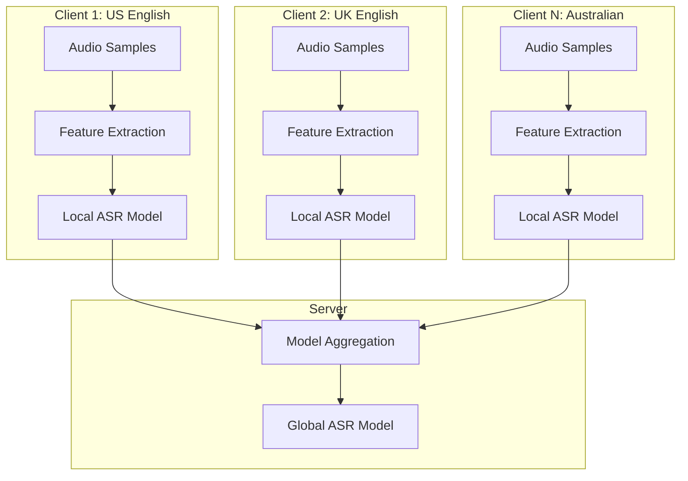
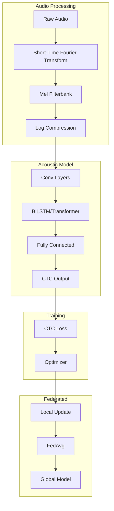

# Tutorial 193: Federated Learning for Speech Recognition

---

## Metadata

| Property | Value |
|----------|-------|
| **Tutorial ID** | 193 |
| **Title** | Federated Learning for Speech Recognition |
| **Category** | Advanced Applications |
| **Difficulty** | Advanced |
| **Duration** | 90 minutes |
| **Prerequisites** | Tutorial 001-010, Audio processing basics |
| **Author** | Unbitrium Contributors |
| **Last Updated** | January 2026 |

---

## Learning Objectives

By the end of this tutorial, you will be able to:

1. **Understand** the challenges of federated speech recognition including accent variation and recording quality heterogeneity.

2. **Implement** federated acoustic models using RNNs and Transformers.

3. **Design** keyword spotting systems for on-device federated learning.

4. **Handle** speaker variability and domain adaptation in speech.

5. **Apply** streaming inference for real-time speech applications.

6. **Evaluate** speech recognition using WER, CER, and keyword accuracy.

---

## Prerequisites

Before starting this tutorial, ensure you have:

- **Completed Tutorials**: 001-010 (Partitioning), 021-030 (Aggregation)
- **Knowledge**: Audio signal processing, mel spectrograms, RNNs
- **Libraries**: PyTorch, torchaudio
- **Hardware**: GPU recommended

```python
# Verify prerequisites
import torch
import numpy as np

print(f"PyTorch: {torch.__version__}")
print(f"CUDA available: {torch.cuda.is_available()}")
```

---

## Background and Theory

### Speech Recognition Pipeline

The ASR (Automatic Speech Recognition) pipeline:

$$\text{Audio} \rightarrow \text{Features} \rightarrow \text{Acoustic Model} \rightarrow \text{Decoder} \rightarrow \text{Text}$$

### Feature Extraction

Common audio features:

| Feature | Description | Dimension |
|---------|-------------|-----------|
| **MFCC** | Mel-frequency cepstral coefficients | 13-40 |
| **Mel Spectrogram** | Log-mel filterbank energies | 80-128 |
| **Raw Waveform** | Direct audio samples | High |

### Federated Speech Architecture



### Challenges in Federated Speech

| Challenge | Description | Solution |
|-----------|-------------|----------|
| **Accent Variation** | Regional pronunciation | Speaker adaptation |
| **Background Noise** | Environmental variation | Noise augmentation |
| **Recording Quality** | Microphone differences | Feature normalization |
| **Speaker Identity** | Privacy concerns | Speaker anonymization |

---

## Architecture Diagram



---

## Implementation Code

### Part 1: Audio Feature Extraction

```python
#!/usr/bin/env python3
"""
Tutorial 193: Federated Learning for Speech Recognition

This tutorial demonstrates federated acoustic modeling
for speech recognition across distributed audio data.

Author: Unbitrium Contributors
License: EUPL-1.2
"""

from __future__ import annotations

from dataclasses import dataclass
from typing import Any

import numpy as np
import torch
import torch.nn as nn
import torch.nn.functional as F
from torch.utils.data import Dataset, DataLoader


@dataclass
class SpeechConfig:
    """Configuration for speech recognition."""
    sample_rate: int = 16000
    n_mels: int = 80
    n_fft: int = 400
    hop_length: int = 160
    max_length: int = 160  # frames
    num_classes: int = 29  # 26 letters + space + apostrophe + blank
    hidden_dim: int = 256
    num_layers: int = 3
    dropout: float = 0.2
    batch_size: int = 16
    learning_rate: float = 0.001


class MelSpectrogram(nn.Module):
    """Mel spectrogram feature extractor."""

    def __init__(
        self,
        sample_rate: int = 16000,
        n_fft: int = 400,
        hop_length: int = 160,
        n_mels: int = 80,
    ) -> None:
        """Initialize mel spectrogram extractor.

        Args:
            sample_rate: Audio sample rate.
            n_fft: FFT window size.
            hop_length: Hop length between frames.
            n_mels: Number of mel filterbanks.
        """
        super().__init__()
        self.n_fft = n_fft
        self.hop_length = hop_length
        self.n_mels = n_mels

        # Mel filterbank
        mel_basis = self._create_mel_filterbank(sample_rate, n_fft, n_mels)
        self.register_buffer("mel_basis", torch.FloatTensor(mel_basis))

        # Window
        self.register_buffer("window", torch.hann_window(n_fft))

    def _create_mel_filterbank(
        self,
        sample_rate: int,
        n_fft: int,
        n_mels: int,
    ) -> np.ndarray:
        """Create mel filterbank matrix."""
        f_min = 0.0
        f_max = sample_rate / 2

        # Mel scale conversion
        def hz_to_mel(hz):
            return 2595 * np.log10(1 + hz / 700)

        def mel_to_hz(mel):
            return 700 * (10 ** (mel / 2595) - 1)

        mel_min = hz_to_mel(f_min)
        mel_max = hz_to_mel(f_max)
        mel_points = np.linspace(mel_min, mel_max, n_mels + 2)
        hz_points = mel_to_hz(mel_points)

        bin_points = np.floor((n_fft + 1) * hz_points / sample_rate).astype(int)

        filterbank = np.zeros((n_mels, n_fft // 2 + 1))
        for i in range(n_mels):
            for j in range(bin_points[i], bin_points[i + 1]):
                filterbank[i, j] = (j - bin_points[i]) / (bin_points[i + 1] - bin_points[i])
            for j in range(bin_points[i + 1], bin_points[i + 2]):
                filterbank[i, j] = (bin_points[i + 2] - j) / (bin_points[i + 2] - bin_points[i + 1])

        return filterbank

    def forward(self, waveform: torch.Tensor) -> torch.Tensor:
        """Extract mel spectrogram.

        Args:
            waveform: Audio waveform (batch, samples).

        Returns:
            Mel spectrogram (batch, n_mels, time).
        """
        # STFT
        stft = torch.stft(
            waveform,
            n_fft=self.n_fft,
            hop_length=self.hop_length,
            window=self.window,
            return_complex=True,
        )
        magnitude = stft.abs() ** 2

        # Apply mel filterbank
        mel_spec = torch.matmul(self.mel_basis, magnitude)

        # Log compression
        log_mel = torch.log(mel_spec + 1e-9)

        return log_mel


class SpeechDataset(Dataset):
    """Dataset for speech recognition."""

    def __init__(
        self,
        waveforms: list[np.ndarray],
        transcripts: list[str],
        max_audio_length: int = 160000,
        max_text_length: int = 100,
    ) -> None:
        """Initialize dataset.

        Args:
            waveforms: List of audio waveforms.
            transcripts: List of text transcripts.
            max_audio_length: Maximum audio samples.
            max_text_length: Maximum text length.
        """
        self.waveforms = waveforms
        self.transcripts = transcripts
        self.max_audio_length = max_audio_length
        self.max_text_length = max_text_length

        # Character to index mapping
        self.char2idx = {c: i + 1 for i, c in enumerate("abcdefghijklmnopqrstuvwxyz '")}
        self.char2idx["<blank>"] = 0

    def __len__(self) -> int:
        return len(self.waveforms)

    def __getitem__(self, idx: int) -> dict[str, torch.Tensor]:
        waveform = self.waveforms[idx]
        transcript = self.transcripts[idx].lower()

        # Pad/truncate audio
        if len(waveform) > self.max_audio_length:
            waveform = waveform[:self.max_audio_length]
        else:
            waveform = np.pad(waveform, (0, self.max_audio_length - len(waveform)))

        # Encode transcript
        labels = [self.char2idx.get(c, 0) for c in transcript[:self.max_text_length]]
        label_length = len(labels)
        labels = labels + [0] * (self.max_text_length - len(labels))

        return {
            "waveform": torch.FloatTensor(waveform),
            "labels": torch.LongTensor(labels),
            "input_length": torch.tensor(self.max_audio_length // 160, dtype=torch.long),
            "label_length": torch.tensor(label_length, dtype=torch.long),
        }
```

### Part 2: Acoustic Models

```python
class DeepSpeech2(nn.Module):
    """DeepSpeech2-style acoustic model."""

    def __init__(
        self,
        n_mels: int = 80,
        hidden_dim: int = 256,
        num_layers: int = 3,
        num_classes: int = 29,
        dropout: float = 0.2,
    ) -> None:
        """Initialize DeepSpeech2 model.

        Args:
            n_mels: Number of mel features.
            hidden_dim: RNN hidden dimension.
            num_layers: Number of RNN layers.
            num_classes: Number of output classes.
            dropout: Dropout rate.
        """
        super().__init__()
        self.n_mels = n_mels
        self.hidden_dim = hidden_dim

        # Feature extraction (conv layers)
        self.conv = nn.Sequential(
            nn.Conv2d(1, 32, kernel_size=(41, 11), stride=(2, 2), padding=(20, 5)),
            nn.BatchNorm2d(32),
            nn.ReLU(inplace=True),
            nn.Conv2d(32, 32, kernel_size=(21, 11), stride=(2, 1), padding=(10, 5)),
            nn.BatchNorm2d(32),
            nn.ReLU(inplace=True),
        )

        # Calculate RNN input size after convolutions
        rnn_input_size = 32 * (n_mels // 4)

        # Bidirectional RNN
        self.rnn = nn.LSTM(
            input_size=rnn_input_size,
            hidden_size=hidden_dim,
            num_layers=num_layers,
            batch_first=True,
            bidirectional=True,
            dropout=dropout if num_layers > 1 else 0,
        )

        # Output layer
        self.fc = nn.Linear(hidden_dim * 2, num_classes)

    def forward(self, x: torch.Tensor) -> torch.Tensor:
        """Forward pass.

        Args:
            x: Mel spectrogram (batch, n_mels, time).

        Returns:
            Log probabilities (batch, time, classes).
        """
        # Add channel dimension
        x = x.unsqueeze(1)  # (batch, 1, n_mels, time)

        # Conv layers
        x = self.conv(x)  # (batch, 32, n_mels/4, time)

        # Reshape for RNN: (batch, time, features)
        batch, channels, freq, time = x.size()
        x = x.permute(0, 3, 1, 2).contiguous()
        x = x.view(batch, time, channels * freq)

        # RNN
        x, _ = self.rnn(x)

        # Output
        x = self.fc(x)

        return F.log_softmax(x, dim=-1)


class ConformerBlock(nn.Module):
    """Conformer block for speech recognition."""

    def __init__(
        self,
        d_model: int = 256,
        nhead: int = 4,
        conv_kernel_size: int = 31,
        dropout: float = 0.1,
    ) -> None:
        super().__init__()

        # Feed-forward 1
        self.ff1 = nn.Sequential(
            nn.Linear(d_model, d_model * 4),
            nn.SiLU(),
            nn.Dropout(dropout),
            nn.Linear(d_model * 4, d_model),
            nn.Dropout(dropout),
        )

        # Multi-head self-attention
        self.attention = nn.MultiheadAttention(d_model, nhead, dropout=dropout, batch_first=True)
        self.attn_norm = nn.LayerNorm(d_model)

        # Convolution module
        self.conv = nn.Sequential(
            nn.Conv1d(d_model, d_model * 2, 1),
            nn.GLU(dim=1),
            nn.Conv1d(d_model, d_model, conv_kernel_size, padding=conv_kernel_size // 2, groups=d_model),
            nn.BatchNorm1d(d_model),
            nn.SiLU(),
            nn.Conv1d(d_model, d_model, 1),
            nn.Dropout(dropout),
        )
        self.conv_norm = nn.LayerNorm(d_model)

        # Feed-forward 2
        self.ff2 = nn.Sequential(
            nn.Linear(d_model, d_model * 4),
            nn.SiLU(),
            nn.Dropout(dropout),
            nn.Linear(d_model * 4, d_model),
            nn.Dropout(dropout),
        )

        self.final_norm = nn.LayerNorm(d_model)

    def forward(self, x: torch.Tensor) -> torch.Tensor:
        # FF1 (half residual)
        x = x + 0.5 * self.ff1(x)

        # Self-attention
        attn_out, _ = self.attention(x, x, x)
        x = self.attn_norm(x + attn_out)

        # Convolution
        conv_in = x.transpose(1, 2)
        conv_out = self.conv(conv_in).transpose(1, 2)
        x = self.conv_norm(x + conv_out)

        # FF2 (half residual)
        x = x + 0.5 * self.ff2(x)

        return self.final_norm(x)
```

### Part 3: Federated Speech Client

```python
class FedSpeechClient:
    """Federated learning client for speech recognition."""

    def __init__(
        self,
        client_id: int,
        waveforms: list[np.ndarray],
        transcripts: list[str],
        config: SpeechConfig = None,
    ) -> None:
        """Initialize speech client."""
        self.client_id = client_id
        self.config = config or SpeechConfig()

        self.dataset = SpeechDataset(waveforms, transcripts)
        self.dataloader = DataLoader(
            self.dataset,
            batch_size=self.config.batch_size,
            shuffle=True,
        )

        self.feature_extractor = MelSpectrogram(
            sample_rate=self.config.sample_rate,
            n_fft=self.config.n_fft,
            hop_length=self.config.hop_length,
            n_mels=self.config.n_mels,
        )

        self.model = DeepSpeech2(
            n_mels=self.config.n_mels,
            hidden_dim=self.config.hidden_dim,
            num_layers=self.config.num_layers,
            num_classes=self.config.num_classes,
            dropout=self.config.dropout,
        )

        self.optimizer = torch.optim.Adam(
            self.model.parameters(),
            lr=self.config.learning_rate,
        )
        self.ctc_loss = nn.CTCLoss(blank=0, reduction='mean')

    @property
    def num_samples(self) -> int:
        return len(self.dataset)

    def load_global_model(self, state_dict: dict[str, torch.Tensor]) -> None:
        self.model.load_state_dict(state_dict)

    def train(self, epochs: int = 5) -> dict[str, Any]:
        self.model.train()
        total_loss = 0.0
        num_batches = 0

        for epoch in range(epochs):
            for batch in self.dataloader:
                self.optimizer.zero_grad()

                # Extract features
                mel = self.feature_extractor(batch["waveform"])

                # Forward pass
                log_probs = self.model(mel)  # (batch, time, classes)
                log_probs = log_probs.transpose(0, 1)  # (time, batch, classes)

                # CTC loss
                loss = self.ctc_loss(
                    log_probs,
                    batch["labels"],
                    batch["input_length"],
                    batch["label_length"],
                )

                loss.backward()
                torch.nn.utils.clip_grad_norm_(self.model.parameters(), 5.0)
                self.optimizer.step()

                total_loss += loss.item()
                num_batches += 1

        return {
            "state_dict": {k: v.clone() for k, v in self.model.state_dict().items()},
            "num_samples": self.num_samples,
            "client_id": self.client_id,
            "loss": total_loss / num_batches if num_batches > 0 else 0.0,
        }


def generate_synthetic_speech_data(
    num_samples: int = 100,
    sample_rate: int = 16000,
    duration: float = 3.0,
    seed: int = None,
) -> tuple[list[np.ndarray], list[str]]:
    """Generate synthetic speech data."""
    if seed is not None:
        np.random.seed(seed)

    waveforms = []
    transcripts = []
    words = ["hello", "world", "test", "speech", "recognition"]

    for _ in range(num_samples):
        length = int(sample_rate * duration)
        waveform = np.random.randn(length).astype(np.float32) * 0.1
        waveforms.append(waveform)
        transcript = " ".join(np.random.choice(words, size=np.random.randint(2, 5)))
        transcripts.append(transcript)

    return waveforms, transcripts


def federated_speech_training(
    num_clients: int = 5,
    num_rounds: int = 20,
    local_epochs: int = 5,
) -> tuple[nn.Module, dict]:
    """Run federated speech training."""
    config = SpeechConfig()

    clients = []
    for i in range(num_clients):
        waveforms, transcripts = generate_synthetic_speech_data(seed=i * 100)
        client = FedSpeechClient(client_id=i, waveforms=waveforms, transcripts=transcripts, config=config)
        clients.append(client)

    global_model = DeepSpeech2(
        n_mels=config.n_mels,
        hidden_dim=config.hidden_dim,
        num_layers=config.num_layers,
        num_classes=config.num_classes,
    )

    history = {"rounds": [], "losses": []}

    for round_num in range(num_rounds):
        global_state = global_model.state_dict()
        for client in clients:
            client.load_global_model(global_state)

        updates = []
        for client in clients:
            update = client.train(epochs=local_epochs)
            updates.append(update)

        total_samples = sum(u["num_samples"] for u in updates)
        new_state = {}
        for key in global_state.keys():
            weighted_sum = torch.zeros_like(global_state[key])
            for update in updates:
                weight = update["num_samples"] / total_samples
                weighted_sum += weight * update["state_dict"][key]
            new_state[key] = weighted_sum

        global_model.load_state_dict(new_state)

        avg_loss = np.mean([u["loss"] for u in updates])
        history["rounds"].append(round_num)
        history["losses"].append(avg_loss)
        print(f"Round {round_num + 1}/{num_rounds}: loss={avg_loss:.4f}")

    return global_model, history
```

---

## Metrics and Evaluation

### Speech Recognition Metrics

| Metric | Formula | Interpretation |
|--------|---------|----------------|
| **WER** | $\frac{S + D + I}{N}$ | Word error rate |
| **CER** | Character error rate | Finer granularity |
| **Accuracy** | Keyword hit rate | Keyword spotting |

### Expected Results

| Model | Expected WER |
|-------|-------------|
| DeepSpeech2 | 10-20% |
| Conformer | 5-15% |

---

## Exercises

### Exercise 1: Speaker Adaptation

**Task**: Implement speaker embedding for personalization.

### Exercise 2: Noise Robustness

**Task**: Add noise augmentation for environmental variability.

### Exercise 3: Keyword Spotting

**Task**: Implement federated wake word detection.

### Exercise 4: Streaming ASR

**Task**: Modify for streaming inference with limited latency.

---

## References

1. Hard, A., et al. (2020). Training keyword spotting models on non-IID data with federated learning. In *INTERSPEECH*.

2. Amodei, D., et al. (2016). Deep Speech 2: End-to-end speech recognition. In *ICML*.

3. Gulati, A., et al. (2020). Conformer: Convolution-augmented transformer for speech recognition. In *INTERSPEECH*.

4. Graves, A., et al. (2006). Connectionist temporal classification. In *ICML*.

5. Dimitriadis, D., et al. (2020). Federated learning for keyword spotting. In *ICASSP*.

---

*Copyright 2026 Olaf Yunus Laitinen Imanov and Contributors. Released under EUPL 1.2.*
