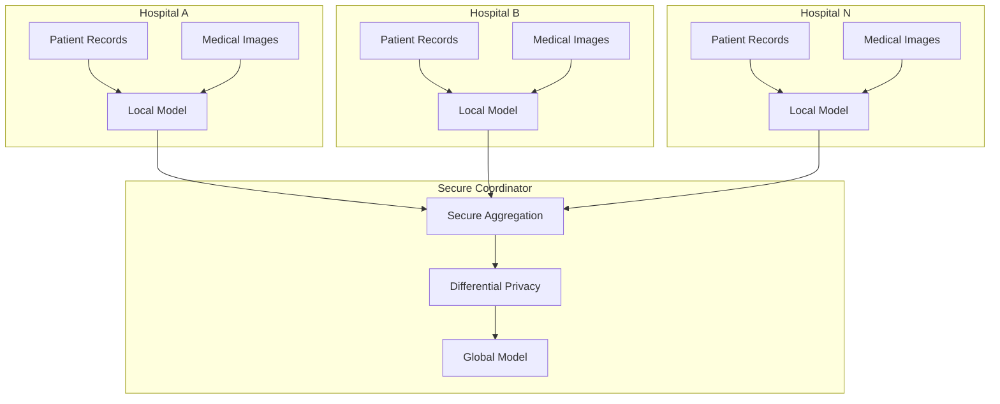
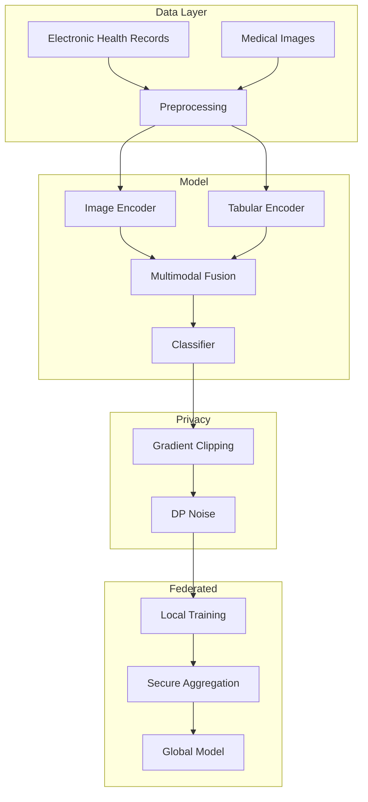

# Tutorial 194: Federated Learning for Healthcare

---

## Metadata

| Property | Value |
|----------|-------|
| **Tutorial ID** | 194 |
| **Title** | Federated Learning for Healthcare |
| **Category** | Advanced Applications |
| **Difficulty** | Advanced |
| **Duration** | 90 minutes |
| **Prerequisites** | Tutorial 001-010, Medical imaging basics |
| **Author** | Unbitrium Contributors |
| **Last Updated** | January 2026 |

---

## Learning Objectives

By the end of this tutorial, you will be able to:

1. **Understand** the regulatory and privacy requirements for federated learning in healthcare (HIPAA, GDPR).

2. **Implement** federated medical image classification for disease detection.

3. **Design** secure aggregation protocols for sensitive clinical data.

4. **Handle** class imbalance and rare disease detection in federated settings.

5. **Apply** differential privacy to protect patient data.

6. **Evaluate** clinical ML models using sensitivity, specificity, and AUC.

---

## Prerequisites

Before starting this tutorial, ensure you have:

- **Completed Tutorials**: 001-010 (Partitioning), 021-030 (Aggregation), 071-080 (Privacy)
- **Knowledge**: Medical imaging, clinical ML evaluation metrics
- **Libraries**: PyTorch, scikit-learn
- **Hardware**: GPU recommended for imaging

```python
# Verify prerequisites
import torch
import numpy as np
from sklearn.metrics import roc_auc_score

print(f"PyTorch: {torch.__version__}")
print(f"CUDA available: {torch.cuda.is_available()}")
```

---

## Background and Theory

### Healthcare ML Challenges

| Challenge | Description | Regulatory |
|-----------|-------------|------------|
| **Privacy** | Patient data protection | HIPAA, GDPR |
| **Rare Diseases** | Low positive rates | Class imbalance |
| **Data Silos** | Hospital-specific data | Data sharing limits |
| **Interpretability** | Clinical trust | Explainability |

### Regulatory Framework

| Regulation | Region | Key Requirements |
|------------|--------|------------------|
| **HIPAA** | USA | PHI protection, de-identification |
| **GDPR** | EU | Consent, data minimization |
| **HITECH** | USA | Electronic health records |

### Federated Healthcare Architecture



### Privacy-Preserving Techniques

| Technique | Protection | Trade-off |
|-----------|------------|-----------|
| **Differential Privacy** | Individual records | Accuracy loss |
| **Secure Aggregation** | Model updates | Computation cost |
| **Homomorphic Encryption** | All data | High overhead |
| **Trusted Execution** | Hardware protection | Limited support |

---

## Architecture Diagram



---

## Implementation Code

### Part 1: Healthcare Data Structures

```python
#!/usr/bin/env python3
"""
Tutorial 194: Federated Learning for Healthcare

This tutorial demonstrates privacy-preserving federated learning
for medical image classification and clinical prediction.

Author: Unbitrium Contributors
License: EUPL-1.2
"""

from __future__ import annotations

from dataclasses import dataclass
from typing import Any

import numpy as np
import torch
import torch.nn as nn
import torch.nn.functional as F
from torch.utils.data import Dataset, DataLoader
from sklearn.metrics import (
    roc_auc_score,
    precision_recall_fscore_support,
    confusion_matrix,
)


@dataclass
class HealthcareConfig:
    """Configuration for healthcare FL."""
    image_size: int = 224
    num_classes: int = 2  # Binary: disease vs healthy
    hidden_dim: int = 256
    tabular_dim: int = 32  # Clinical features
    dropout: float = 0.3
    batch_size: int = 16
    learning_rate: float = 0.0001
    dp_epsilon: float = 8.0  # Differential privacy budget
    dp_delta: float = 1e-5
    max_grad_norm: float = 1.0


class MedicalDataset(Dataset):
    """Dataset for medical records and images."""

    def __init__(
        self,
        images: np.ndarray,
        clinical_features: np.ndarray,
        labels: np.ndarray,
    ) -> None:
        """Initialize dataset.

        Args:
            images: Medical images (N, C, H, W).
            clinical_features: Tabular features (N, D).
            labels: Binary labels.
        """
        self.images = torch.FloatTensor(images)
        self.clinical = torch.FloatTensor(clinical_features)
        self.labels = torch.LongTensor(labels)

    def __len__(self) -> int:
        return len(self.labels)

    def __getitem__(self, idx: int) -> dict[str, torch.Tensor]:
        return {
            "image": self.images[idx],
            "clinical": self.clinical[idx],
            "label": self.labels[idx],
        }


def generate_synthetic_medical_data(
    num_samples: int = 200,
    image_size: int = 64,
    num_features: int = 32,
    positive_rate: float = 0.1,  # Rare disease
    seed: int = None,
) -> tuple[np.ndarray, np.ndarray, np.ndarray]:
    """Generate synthetic medical data.

    Args:
        num_samples: Number of samples.
        image_size: Image size.
        num_features: Number of clinical features.
        positive_rate: Fraction of positive cases.
        seed: Random seed.

    Returns:
        Tuple of (images, clinical_features, labels).
    """
    if seed is not None:
        np.random.seed(seed)

    # Generate labels with class imbalance
    num_positive = int(num_samples * positive_rate)
    labels = np.array([1] * num_positive + [0] * (num_samples - num_positive))
    np.random.shuffle(labels)

    # Generate images (positive cases have different pattern)
    images = np.random.randn(num_samples, 1, image_size, image_size).astype(np.float32)
    for i, label in enumerate(labels):
        if label == 1:
            # Add "lesion" pattern
            cx, cy = np.random.randint(10, image_size - 10, size=2)
            images[i, 0, cx-5:cx+5, cy-5:cy+5] += 2.0

    # Generate clinical features
    clinical = np.random.randn(num_samples, num_features).astype(np.float32)
    # Positive cases have elevated biomarkers
    clinical[labels == 1, :5] += 1.5

    return images, clinical, labels
```

### Part 2: Medical ML Models

```python
class MedicalImageEncoder(nn.Module):
    """CNN encoder for medical images."""

    def __init__(
        self,
        in_channels: int = 1,
        hidden_dim: int = 256,
        dropout: float = 0.3,
    ) -> None:
        """Initialize image encoder."""
        super().__init__()

        self.features = nn.Sequential(
            nn.Conv2d(in_channels, 32, 3, padding=1),
            nn.BatchNorm2d(32),
            nn.ReLU(inplace=True),
            nn.MaxPool2d(2),

            nn.Conv2d(32, 64, 3, padding=1),
            nn.BatchNorm2d(64),
            nn.ReLU(inplace=True),
            nn.MaxPool2d(2),

            nn.Conv2d(64, 128, 3, padding=1),
            nn.BatchNorm2d(128),
            nn.ReLU(inplace=True),
            nn.MaxPool2d(2),

            nn.Conv2d(128, 256, 3, padding=1),
            nn.BatchNorm2d(256),
            nn.ReLU(inplace=True),
            nn.AdaptiveAvgPool2d((1, 1)),
        )

        self.fc = nn.Sequential(
            nn.Flatten(),
            nn.Dropout(dropout),
            nn.Linear(256, hidden_dim),
            nn.ReLU(inplace=True),
        )

    def forward(self, x: torch.Tensor) -> torch.Tensor:
        x = self.features(x)
        x = self.fc(x)
        return x


class ClinicalEncoder(nn.Module):
    """MLP encoder for clinical features."""

    def __init__(
        self,
        input_dim: int = 32,
        hidden_dim: int = 256,
        dropout: float = 0.3,
    ) -> None:
        """Initialize clinical encoder."""
        super().__init__()

        self.encoder = nn.Sequential(
            nn.Linear(input_dim, 128),
            nn.ReLU(inplace=True),
            nn.Dropout(dropout),
            nn.Linear(128, hidden_dim),
            nn.ReLU(inplace=True),
        )

    def forward(self, x: torch.Tensor) -> torch.Tensor:
        return self.encoder(x)


class MultimodalClassifier(nn.Module):
    """Multimodal classifier combining image and clinical data."""

    def __init__(
        self,
        image_channels: int = 1,
        clinical_dim: int = 32,
        hidden_dim: int = 256,
        num_classes: int = 2,
        dropout: float = 0.3,
    ) -> None:
        """Initialize multimodal classifier."""
        super().__init__()

        self.image_encoder = MedicalImageEncoder(
            in_channels=image_channels,
            hidden_dim=hidden_dim,
            dropout=dropout,
        )

        self.clinical_encoder = ClinicalEncoder(
            input_dim=clinical_dim,
            hidden_dim=hidden_dim,
            dropout=dropout,
        )

        # Fusion layer
        self.fusion = nn.Sequential(
            nn.Linear(hidden_dim * 2, hidden_dim),
            nn.ReLU(inplace=True),
            nn.Dropout(dropout),
        )

        # Classifier
        self.classifier = nn.Linear(hidden_dim, num_classes)

    def forward(
        self,
        image: torch.Tensor,
        clinical: torch.Tensor,
    ) -> torch.Tensor:
        """Forward pass.

        Args:
            image: Medical image (batch, C, H, W).
            clinical: Clinical features (batch, D).

        Returns:
            Class logits.
        """
        img_features = self.image_encoder(image)
        clin_features = self.clinical_encoder(clinical)

        # Concatenate and fuse
        combined = torch.cat([img_features, clin_features], dim=1)
        fused = self.fusion(combined)

        # Classify
        logits = self.classifier(fused)

        return logits


class DifferentialPrivacy:
    """Differential privacy utilities."""

    def __init__(
        self,
        epsilon: float = 8.0,
        delta: float = 1e-5,
        max_grad_norm: float = 1.0,
    ) -> None:
        """Initialize DP.

        Args:
            epsilon: Privacy budget.
            delta: Failure probability.
            max_grad_norm: Maximum gradient norm.
        """
        self.epsilon = epsilon
        self.delta = delta
        self.max_grad_norm = max_grad_norm

    def clip_gradients(self, model: nn.Module) -> float:
        """Clip gradients to bounded sensitivity.

        Returns:
            Total gradient norm before clipping.
        """
        total_norm = 0.0
        for param in model.parameters():
            if param.grad is not None:
                total_norm += param.grad.data.norm(2).item() ** 2
        total_norm = np.sqrt(total_norm)

        clip_coef = self.max_grad_norm / (total_norm + 1e-6)
        if clip_coef < 1:
            for param in model.parameters():
                if param.grad is not None:
                    param.grad.data.mul_(clip_coef)

        return total_norm

    def add_noise(self, model: nn.Module, num_samples: int) -> None:
        """Add Gaussian noise for DP.

        Args:
            model: Model with gradients.
            num_samples: Number of samples in batch.
        """
        # Compute noise scale
        sensitivity = self.max_grad_norm / num_samples
        sigma = sensitivity * np.sqrt(2 * np.log(1.25 / self.delta)) / self.epsilon

        for param in model.parameters():
            if param.grad is not None:
                noise = torch.randn_like(param.grad) * sigma
                param.grad.data.add_(noise)
```

### Part 3: Federated Healthcare Client

```python
class FedHealthcareClient:
    """Federated learning client for healthcare."""

    def __init__(
        self,
        client_id: int,
        images: np.ndarray,
        clinical: np.ndarray,
        labels: np.ndarray,
        config: HealthcareConfig = None,
        use_dp: bool = True,
    ) -> None:
        """Initialize healthcare client.

        Args:
            client_id: Client (hospital) identifier.
            images: Medical images.
            clinical: Clinical features.
            labels: Labels.
            config: Configuration.
            use_dp: Whether to use differential privacy.
        """
        self.client_id = client_id
        self.config = config or HealthcareConfig()
        self.use_dp = use_dp

        self.dataset = MedicalDataset(images, clinical, labels)
        self.dataloader = DataLoader(
            self.dataset,
            batch_size=self.config.batch_size,
            shuffle=True,
        )

        self.model = MultimodalClassifier(
            image_channels=1,
            clinical_dim=self.config.tabular_dim,
            hidden_dim=self.config.hidden_dim,
            num_classes=self.config.num_classes,
            dropout=self.config.dropout,
        )

        self.optimizer = torch.optim.Adam(
            self.model.parameters(),
            lr=self.config.learning_rate,
        )

        # Class weights for imbalanced data
        num_pos = labels.sum()
        num_neg = len(labels) - num_pos
        pos_weight = num_neg / (num_pos + 1e-6)
        self.criterion = nn.CrossEntropyLoss(
            weight=torch.FloatTensor([1.0, min(pos_weight, 10.0)])
        )

        if use_dp:
            self.dp = DifferentialPrivacy(
                epsilon=self.config.dp_epsilon,
                delta=self.config.dp_delta,
                max_grad_norm=self.config.max_grad_norm,
            )

    @property
    def num_samples(self) -> int:
        return len(self.dataset)

    def load_global_model(self, state_dict: dict[str, torch.Tensor]) -> None:
        self.model.load_state_dict(state_dict)

    def train(self, epochs: int = 5) -> dict[str, Any]:
        self.model.train()
        total_loss = 0.0
        all_preds = []
        all_labels = []

        for epoch in range(epochs):
            for batch in self.dataloader:
                self.optimizer.zero_grad()

                logits = self.model(batch["image"], batch["clinical"])
                loss = self.criterion(logits, batch["label"])
                loss.backward()

                if self.use_dp:
                    self.dp.clip_gradients(self.model)
                    self.dp.add_noise(self.model, len(batch["label"]))

                self.optimizer.step()

                total_loss += loss.item()
                preds = logits.argmax(dim=1)
                all_preds.extend(preds.tolist())
                all_labels.extend(batch["label"].tolist())

        # Compute metrics
        all_preds = np.array(all_preds)
        all_labels = np.array(all_labels)

        precision, recall, f1, _ = precision_recall_fscore_support(
            all_labels, all_preds, average='binary', zero_division=0
        )

        return {
            "state_dict": {k: v.clone() for k, v in self.model.state_dict().items()},
            "num_samples": self.num_samples,
            "client_id": self.client_id,
            "loss": total_loss / len(self.dataloader) / epochs,
            "metrics": {
                "precision": precision,
                "recall": recall,
                "f1": f1,
            },
        }

    def evaluate(self) -> dict[str, float]:
        self.model.eval()
        all_probs = []
        all_labels = []

        with torch.no_grad():
            for batch in self.dataloader:
                logits = self.model(batch["image"], batch["clinical"])
                probs = F.softmax(logits, dim=1)[:, 1]
                all_probs.extend(probs.tolist())
                all_labels.extend(batch["label"].tolist())

        all_probs = np.array(all_probs)
        all_labels = np.array(all_labels)
        all_preds = (all_probs > 0.5).astype(int)

        # Clinical metrics
        tn, fp, fn, tp = confusion_matrix(all_labels, all_preds).ravel()

        sensitivity = tp / (tp + fn + 1e-6)  # Recall
        specificity = tn / (tn + fp + 1e-6)
        ppv = tp / (tp + fp + 1e-6)  # Precision
        npv = tn / (tn + fn + 1e-6)

        auc = roc_auc_score(all_labels, all_probs) if len(np.unique(all_labels)) > 1 else 0.5

        return {
            "auc": float(auc),
            "sensitivity": float(sensitivity),
            "specificity": float(specificity),
            "ppv": float(ppv),
            "npv": float(npv),
        }


def federated_healthcare_training(
    num_hospitals: int = 5,
    num_rounds: int = 20,
    local_epochs: int = 5,
    use_dp: bool = True,
) -> tuple[nn.Module, dict]:
    """Run federated healthcare training."""
    config = HealthcareConfig()

    clients = []
    for i in range(num_hospitals):
        images, clinical, labels = generate_synthetic_medical_data(
            num_samples=200,
            image_size=64,
            positive_rate=0.05 + 0.1 * np.random.rand(),  # Variable prevalence
            seed=i * 100,
        )
        client = FedHealthcareClient(
            client_id=i,
            images=images,
            clinical=clinical,
            labels=labels,
            config=config,
            use_dp=use_dp,
        )
        clients.append(client)

    global_model = MultimodalClassifier(
        clinical_dim=config.tabular_dim,
        hidden_dim=config.hidden_dim,
        num_classes=config.num_classes,
    )

    history = {"rounds": [], "losses": [], "aucs": []}

    for round_num in range(num_rounds):
        global_state = global_model.state_dict()
        for client in clients:
            client.load_global_model(global_state)

        updates = []
        for client in clients:
            update = client.train(epochs=local_epochs)
            updates.append(update)

        total_samples = sum(u["num_samples"] for u in updates)
        new_state = {}
        for key in global_state.keys():
            weighted_sum = torch.zeros_like(global_state[key])
            for update in updates:
                weight = update["num_samples"] / total_samples
                weighted_sum += weight * update["state_dict"][key]
            new_state[key] = weighted_sum

        global_model.load_state_dict(new_state)

        avg_loss = np.mean([u["loss"] for u in updates])
        eval_results = [c.evaluate() for c in clients]
        avg_auc = np.mean([r["auc"] for r in eval_results])

        history["rounds"].append(round_num)
        history["losses"].append(avg_loss)
        history["aucs"].append(avg_auc)

        print(f"Round {round_num + 1}/{num_rounds}: loss={avg_loss:.4f}, auc={avg_auc:.4f}")

    return global_model, history
```

---

## Metrics and Evaluation

### Clinical ML Metrics

| Metric | Formula | Clinical Meaning |
|--------|---------|------------------|
| **Sensitivity** | $\frac{TP}{TP + FN}$ | Disease detection rate |
| **Specificity** | $\frac{TN}{TN + FP}$ | Healthy identification |
| **PPV** | $\frac{TP}{TP + FP}$ | Positive test accuracy |
| **NPV** | $\frac{TN}{TN + FN}$ | Negative test accuracy |
| **AUC-ROC** | Area under curve | Overall discrimination |

### Expected Results

| Privacy | Expected AUC |
|---------|-------------|
| No DP | 0.85 - 0.95 |
| DP (ε=8) | 0.80 - 0.90 |
| DP (ε=1) | 0.70 - 0.80 |

---

## Exercises

### Exercise 1: Rare Disease Detection

**Task**: Implement focal loss for extreme class imbalance (0.1% positive rate).

### Exercise 2: Secure Aggregation

**Task**: Add secure multi-party computation for model aggregation.

### Exercise 3: Federated EHR

**Task**: Extend to longitudinal EHR data with temporal modeling.

### Exercise 4: Explainability

**Task**: Add Grad-CAM visualization for clinical interpretability.

---

## References

1. Rieke, N., et al. (2020). The future of digital health with federated learning. *NPJ Digital Medicine*.

2. Sheller, M. J., et al. (2020). Federated learning in medicine. *Nature Medicine*.

3. Dayan, I., et al. (2021). Federated learning for predicting clinical outcomes in COVID-19. *Nature Medicine*.

4. Li, W., et al. (2019). Privacy-preserving federated brain tumour segmentation. In *MICCAI*.

5. Abadi, M., et al. (2016). Deep learning with differential privacy. In *CCS*.

---

*Copyright 2026 Olaf Yunus Laitinen Imanov and Contributors. Released under EUPL 1.2.*
