# Tutorial 195: Federated Reinforcement Learning

---

## Metadata

| Property | Value |
|----------|-------|
| **Tutorial ID** | 195 |
| **Title** | Federated Reinforcement Learning |
| **Category** | Advanced Applications |
| **Difficulty** | Advanced |
| **Duration** | 90 minutes |
| **Prerequisites** | Tutorial 001-010, RL basics |
| **Author** | Unbitrium Contributors |
| **Last Updated** | January 2026 |

---

## Learning Objectives

By the end of this tutorial, you will be able to:

1. **Understand** the fundamentals of federated reinforcement learning (FedRL) and how it differs from traditional centralized RL.

2. **Implement** federated policy gradient methods where agents learn from distributed environments.

3. **Design** value function aggregation strategies for heterogeneous reward structures.

4. **Analyze** the impact of environment heterogeneity on convergence and policy quality.

5. **Apply** privacy-preserving techniques to protect sensitive trajectory information.

6. **Evaluate** federated RL policies using standard metrics including cumulative reward and sample efficiency.

---

## Prerequisites

Before starting this tutorial, ensure you have:

- **Completed Tutorials**: 001-010 (Partitioning), 021-030 (Aggregation)
- **Knowledge**: Reinforcement learning basics (MDPs, policy gradients, value functions)
- **Libraries**: PyTorch, gym (OpenAI Gymnasium)
- **Hardware**: CPU sufficient, GPU optional

```python
# Verify prerequisites
import torch
import numpy as np

try:
    import gymnasium as gym
    print(f"Gymnasium available")
except ImportError:
    import gym
    print(f"OpenAI Gym available")

print(f"PyTorch: {torch.__version__}")
```

---

## Background and Theory

### Reinforcement Learning Overview

Reinforcement learning (RL) involves an agent learning to make decisions by interacting with an environment. The core components are:

- **State** $s \in \mathcal{S}$: Current observation
- **Action** $a \in \mathcal{A}$: Agent's decision
- **Reward** $r$: Immediate feedback
- **Policy** $\pi(a|s)$: Action selection strategy
- **Value function** $V^\pi(s)$: Expected cumulative reward

The goal is to learn a policy that maximizes expected cumulative reward:

$$J(\pi) = \mathbb{E}_{\tau \sim \pi} \left[ \sum_{t=0}^{T} \gamma^t r_t \right]$$

### Markov Decision Process

An MDP is defined as $(\mathcal{S}, \mathcal{A}, P, R, \gamma)$ where:

$$P(s'|s, a) \text{ is the transition probability}$$
$$R(s, a) \text{ is the reward function}$$
$$\gamma \in [0, 1) \text{ is the discount factor}$$

### Federated Reinforcement Learning

In federated RL, multiple agents interact with their own environments:


### Challenges in Federated RL

| Challenge | Description | Solution |
|-----------|-------------|----------|
| **Environment Heterogeneity** | Different dynamics $P_k(s'|s,a)$ | Domain randomization, robust policies |
| **Reward Heterogeneity** | Different reward functions $R_k$ | Reward normalization, multi-task learning |
| **Non-stationarity** | Policies change during training | Off-policy correction, importance sampling |
| **Sample Efficiency** | Limited interaction per client | Experience replay sharing |

### Policy Gradient Methods

The policy gradient theorem states:

$$\nabla_\theta J(\pi_\theta) = \mathbb{E}_{\tau \sim \pi_\theta} \left[ \sum_{t=0}^{T} \nabla_\theta \log \pi_\theta(a_t|s_t) \cdot G_t \right]$$

where $G_t = \sum_{t'=t}^{T} \gamma^{t'-t} r_{t'}$ is the return.

### Federated Policy Gradient

The federated policy gradient objective is:

$$\nabla_\theta J(\pi_\theta) = \sum_{k=1}^{K} w_k \cdot \mathbb{E}_{\tau \sim \pi_\theta, P_k} \left[ \nabla_\theta \log \pi_\theta(a|s) \cdot A^\pi(s,a) \right]$$

where $A^\pi(s,a) = Q^\pi(s,a) - V^\pi(s)$ is the advantage function.

---

## Architecture Diagram

```mermaid
flowchart TB
    subgraph "Data Collection"
        ENV1[Environment 1]
        ENV2[Environment 2]
        ENVN[Environment N]
    end

    subgraph "Local Training"
        TRAJ1[Trajectories τ₁]
        TRAJ2[Trajectories τ₂]
        TRAJN[Trajectories τₙ]
        GRAD1[∇J₁]
        GRAD2[∇J₂]
        GRADN[∇Jₙ]
    end

    subgraph "Policy Network"
        ACTOR[Actor π_θ]
        CRITIC[Critic V_φ]
    end

    subgraph "Federated Aggregation"
        AGG_ACTOR[Aggregate Actor]
        AGG_CRITIC[Aggregate Critic]
    end

    ENV1 --> TRAJ1
    ENV2 --> TRAJ2
    ENVN --> TRAJN

    TRAJ1 --> GRAD1
    TRAJ2 --> GRAD2
    TRAJN --> GRADN

    GRAD1 --> AGG_ACTOR
    GRAD2 --> AGG_ACTOR
    GRADN --> AGG_ACTOR

    AGG_ACTOR --> ACTOR
    AGG_CRITIC --> CRITIC
```



---

## Implementation Code

### Part 1: Environment and Trajectory Collection

```python
#!/usr/bin/env python3
"""
Tutorial 195: Federated Reinforcement Learning

This tutorial demonstrates federated policy gradient methods
where multiple agents learn from distributed environments.

Author: Unbitrium Contributors
License: EUPL-1.2
"""

from __future__ import annotations

from dataclasses import dataclass, field
from typing import Any

import numpy as np
import torch
import torch.nn as nn
import torch.nn.functional as F
from torch.distributions import Categorical

try:
    import gymnasium as gym
except ImportError:
    import gym


@dataclass
class Transition:
    """Single environment transition."""
    state: np.ndarray
    action: int
    reward: float
    next_state: np.ndarray
    done: bool
    log_prob: float


@dataclass
class Trajectory:
    """Complete episode trajectory."""
    transitions: list[Transition] = field(default_factory=list)

    def add(self, transition: Transition) -> None:
        """Add transition to trajectory."""
        self.transitions.append(transition)

    @property
    def length(self) -> int:
        """Trajectory length."""
        return len(self.transitions)

    @property
    def total_reward(self) -> float:
        """Sum of rewards."""
        return sum(t.reward for t in self.transitions)

    def compute_returns(self, gamma: float = 0.99) -> list[float]:
        """Compute discounted returns for each timestep."""
        returns = []
        G = 0
        for t in reversed(self.transitions):
            G = t.reward + gamma * G * (1 - t.done)
            returns.insert(0, G)
        return returns


class PolicyNetwork(nn.Module):
    """Actor-Critic policy network."""

    def __init__(
        self,
        state_dim: int,
        action_dim: int,
        hidden_dim: int = 128,
    ) -> None:
        """Initialize policy network.

        Args:
            state_dim: State space dimension.
            action_dim: Action space dimension.
            hidden_dim: Hidden layer dimension.
        """
        super().__init__()

        # Shared feature extractor
        self.shared = nn.Sequential(
            nn.Linear(state_dim, hidden_dim),
            nn.ReLU(),
            nn.Linear(hidden_dim, hidden_dim),
            nn.ReLU(),
        )

        # Actor head (policy)
        self.actor = nn.Linear(hidden_dim, action_dim)

        # Critic head (value function)
        self.critic = nn.Linear(hidden_dim, 1)

    def forward(
        self,
        state: torch.Tensor,
    ) -> tuple[torch.Tensor, torch.Tensor]:
        """Forward pass.

        Args:
            state: State tensor.

        Returns:
            Tuple of (action logits, state value).
        """
        features = self.shared(state)
        action_logits = self.actor(features)
        value = self.critic(features)
        return action_logits, value

    def get_action(
        self,
        state: np.ndarray,
    ) -> tuple[int, float]:
        """Sample action from policy.

        Args:
            state: Current state.

        Returns:
            Tuple of (action, log probability).
        """
        state_tensor = torch.FloatTensor(state).unsqueeze(0)
        logits, _ = self.forward(state_tensor)
        probs = F.softmax(logits, dim=-1)
        dist = Categorical(probs)
        action = dist.sample()
        log_prob = dist.log_prob(action)
        return action.item(), log_prob.item()

    def evaluate(
        self,
        states: torch.Tensor,
        actions: torch.Tensor,
    ) -> tuple[torch.Tensor, torch.Tensor, torch.Tensor]:
        """Evaluate actions for policy gradient.

        Args:
            states: Batch of states.
            actions: Batch of actions.

        Returns:
            Tuple of (log probs, values, entropy).
        """
        logits, values = self.forward(states)
        probs = F.softmax(logits, dim=-1)
        dist = Categorical(probs)
        log_probs = dist.log_prob(actions)
        entropy = dist.entropy()
        return log_probs, values.squeeze(-1), entropy
```

### Part 2: Federated RL Client

```python
class FedRLClient:
    """Federated reinforcement learning client."""

    def __init__(
        self,
        client_id: int,
        env_name: str = "CartPole-v1",
        hidden_dim: int = 128,
        learning_rate: float = 0.001,
        gamma: float = 0.99,
        num_episodes: int = 10,
        env_seed: int = None,
    ) -> None:
        """Initialize FedRL client.

        Args:
            client_id: Unique client identifier.
            env_name: Gymnasium environment name.
            hidden_dim: Policy hidden dimension.
            learning_rate: Learning rate.
            gamma: Discount factor.
            num_episodes: Episodes per round.
            env_seed: Environment seed (for heterogeneity).
        """
        self.client_id = client_id
        self.gamma = gamma
        self.num_episodes = num_episodes
        self.learning_rate = learning_rate

        # Create environment
        self.env = gym.make(env_name)
        if env_seed is not None:
            self.env.reset(seed=env_seed)

        # Get dimensions
        self.state_dim = self.env.observation_space.shape[0]
        self.action_dim = self.env.action_space.n

        # Create policy
        self.policy = PolicyNetwork(
            state_dim=self.state_dim,
            action_dim=self.action_dim,
            hidden_dim=hidden_dim,
        )

        self.optimizer = torch.optim.Adam(
            self.policy.parameters(),
            lr=learning_rate,
        )

    def load_global_model(self, state_dict: dict[str, torch.Tensor]) -> None:
        """Load global policy parameters."""
        self.policy.load_state_dict(state_dict)

    def collect_trajectories(self) -> list[Trajectory]:
        """Collect trajectories from environment.

        Returns:
            List of episode trajectories.
        """
        trajectories = []

        for _ in range(self.num_episodes):
            trajectory = Trajectory()
            state, _ = self.env.reset()
            done = False

            while not done:
                action, log_prob = self.policy.get_action(state)
                next_state, reward, terminated, truncated, _ = self.env.step(action)
                done = terminated or truncated

                transition = Transition(
                    state=state,
                    action=action,
                    reward=reward,
                    next_state=next_state,
                    done=done,
                    log_prob=log_prob,
                )
                trajectory.add(transition)
                state = next_state

            trajectories.append(trajectory)

        return trajectories

    def compute_loss(
        self,
        trajectories: list[Trajectory],
    ) -> tuple[torch.Tensor, dict[str, float]]:
        """Compute policy gradient loss.

        Args:
            trajectories: Collected trajectories.

        Returns:
            Tuple of (loss, metrics).
        """
        all_states = []
        all_actions = []
        all_returns = []
        all_log_probs = []

        for traj in trajectories:
            returns = traj.compute_returns(self.gamma)
            for t, G in zip(traj.transitions, returns):
                all_states.append(t.state)
                all_actions.append(t.action)
                all_returns.append(G)
                all_log_probs.append(t.log_prob)

        # Convert to tensors
        states = torch.FloatTensor(np.array(all_states))
        actions = torch.LongTensor(all_actions)
        returns = torch.FloatTensor(all_returns)

        # Normalize returns
        returns = (returns - returns.mean()) / (returns.std() + 1e-8)

        # Evaluate policy
        log_probs, values, entropy = self.policy.evaluate(states, actions)

        # Advantage
        advantages = returns - values.detach()

        # Policy loss (negative because we want to maximize)
        policy_loss = -(log_probs * advantages).mean()

        # Value loss
        value_loss = F.mse_loss(values, returns)

        # Entropy bonus (for exploration)
        entropy_loss = -0.01 * entropy.mean()

        # Total loss
        total_loss = policy_loss + 0.5 * value_loss + entropy_loss

        metrics = {
            "policy_loss": policy_loss.item(),
            "value_loss": value_loss.item(),
            "entropy": entropy.mean().item(),
            "mean_return": np.mean([t.total_reward for t in trajectories]),
        }

        return total_loss, metrics

    def train(self) -> dict[str, Any]:
        """Perform local training round.

        Returns:
            Update dictionary with state_dict and metadata.
        """
        self.policy.train()

        # Collect trajectories
        trajectories = self.collect_trajectories()

        # Compute loss and update
        self.optimizer.zero_grad()
        loss, metrics = self.compute_loss(trajectories)
        loss.backward()
        self.optimizer.step()

        # Count total transitions
        total_transitions = sum(t.length for t in trajectories)

        return {
            "state_dict": {
                k: v.clone() for k, v in self.policy.state_dict().items()
            },
            "num_samples": total_transitions,
            "client_id": self.client_id,
            "metrics": metrics,
        }
```

### Part 3: Federated RL Training Loop

```python
def federated_rl_training(
    num_clients: int = 5,
    num_rounds: int = 50,
    env_name: str = "CartPole-v1",
    clients_per_round: int = None,
    heterogeneous: bool = True,
) -> PolicyNetwork:
    """Run federated reinforcement learning.

    Args:
        num_clients: Number of clients.
        num_rounds: Communication rounds.
        env_name: Environment name.
        clients_per_round: Clients per round.
        heterogeneous: Whether to use different env seeds.

    Returns:
        Trained global policy.
    """
    import random

    # Create clients with environment heterogeneity
    clients = []
    for i in range(num_clients):
        seed = i * 100 if heterogeneous else None
        client = FedRLClient(
            client_id=i,
            env_name=env_name,
            env_seed=seed,
        )
        clients.append(client)

    # Initialize global model
    global_policy = PolicyNetwork(
        state_dim=clients[0].state_dim,
        action_dim=clients[0].action_dim,
    )

    # Training history
    history = {
        "rounds": [],
        "mean_rewards": [],
    }

    for round_num in range(num_rounds):
        # Select clients
        if clients_per_round is None or clients_per_round >= num_clients:
            selected = clients
        else:
            selected = random.sample(clients, clients_per_round)

        # Distribute global model
        global_state = global_policy.state_dict()
        for client in selected:
            client.load_global_model(global_state)

        # Collect updates
        updates = []
        round_rewards = []

        for client in selected:
            update = client.train()
            updates.append(update)
            round_rewards.append(update["metrics"]["mean_return"])
            print(f"  Client {client.client_id}: "
                  f"reward={update['metrics']['mean_return']:.2f}")

        # FedAvg aggregation
        total_samples = sum(u["num_samples"] for u in updates)
        new_state = {}

        for key in global_state.keys():
            weighted_sum = torch.zeros_like(global_state[key])
            for update in updates:
                weight = update["num_samples"] / total_samples
                weighted_sum += weight * update["state_dict"][key]
            new_state[key] = weighted_sum

        global_policy.load_state_dict(new_state)

        # Log progress
        mean_reward = np.mean(round_rewards)
        history["rounds"].append(round_num)
        history["mean_rewards"].append(mean_reward)

        print(f"Round {round_num + 1}/{num_rounds}: "
              f"mean_reward={mean_reward:.2f}")

    return global_policy, history


def evaluate_policy(
    policy: PolicyNetwork,
    env_name: str = "CartPole-v1",
    num_episodes: int = 100,
) -> dict[str, float]:
    """Evaluate trained policy.

    Args:
        policy: Trained policy network.
        env_name: Environment name.
        num_episodes: Number of evaluation episodes.

    Returns:
        Evaluation metrics.
    """
    env = gym.make(env_name)
    policy.eval()

    rewards = []
    lengths = []

    for _ in range(num_episodes):
        state, _ = env.reset()
        done = False
        total_reward = 0
        length = 0

        while not done:
            with torch.no_grad():
                state_tensor = torch.FloatTensor(state).unsqueeze(0)
                logits, _ = policy.forward(state_tensor)
                action = logits.argmax(dim=-1).item()

            state, reward, terminated, truncated, _ = env.step(action)
            done = terminated or truncated
            total_reward += reward
            length += 1

        rewards.append(total_reward)
        lengths.append(length)

    return {
        "mean_reward": np.mean(rewards),
        "std_reward": np.std(rewards),
        "mean_length": np.mean(lengths),
        "success_rate": np.mean([r >= 195 for r in rewards]),  # CartPole threshold
    }


# Main execution
if __name__ == "__main__":
    # Train federated RL
    policy, history = federated_rl_training(
        num_clients=5,
        num_rounds=50,
        heterogeneous=True,
    )

    # Evaluate
    results = evaluate_policy(policy)
    print(f"\nEvaluation Results:")
    print(f"  Mean Reward: {results['mean_reward']:.2f}")
    print(f"  Success Rate: {results['success_rate']:.2%}")
```

---

## Metrics and Evaluation

### Performance Metrics

| Metric | Description | Target |
|--------|-------------|--------|
| **Mean Reward** | Average episode reward | Environment-specific |
| **Success Rate** | % episodes reaching goal | > 90% |
| **Sample Efficiency** | Episodes to convergence | Lower is better |
| **Policy Entropy** | Exploration measure | Moderate |

### Expected Results for CartPole

| Round | Expected Mean Reward |
|-------|---------------------|
| 10 | 50-100 |
| 25 | 150-200 |
| 50 | 195+ (solved) |

### Convergence Analysis

Federated RL typically converges slower than centralized due to:
- Gradient staleness
- Environment heterogeneity
- Partial participation

---

## Exercises

### Exercise 1: Environment Heterogeneity

**Task**: Implement clients with modified CartPole dynamics (different pole lengths, masses). Analyze policy robustness.

### Exercise 2: Experience Replay Sharing

**Task**: Implement secure experience replay where clients share anonymized trajectories.

### Exercise 3: Personalized Policies

**Task**: Extend to personalized federated RL where each client maintains a local policy head.

### Exercise 4: Continuous Actions

**Task**: Modify for continuous action spaces using Gaussian policies.

---

## References

1. Nadiger, C., Kumar, A., & Abdelhak, S. (2019). Federated reinforcement learning for fast personalization. In *IEEE AIKE*.

2. Zhuo, H. H., Feng, W., Xu, Q., Yang, Q., & Lin, Y. (2019). Federated reinforcement learning. *arXiv preprint arXiv:1901.08277*.

3. Liang, X., Liu, Y., Chen, T., Liu, M., & Yang, Q. (2020). Federated transfer reinforcement learning for autonomous driving. *arXiv preprint arXiv:2002.10228*.

4. Fan, L., Ramamurthy, K. N., & Chen, P. Y. (2021). Fault-tolerant federated reinforcement learning with theoretical guarantee. In *NeurIPS*.

5. Schulman, J., Wolski, F., Dhariwal, P., Radford, A., & Klimov, O. (2017). Proximal policy optimization algorithms. *arXiv preprint arXiv:1707.06347*.

---

*Copyright 2026 Olaf Yunus Laitinen Imanov and Contributors. Released under EUPL 1.2.*
