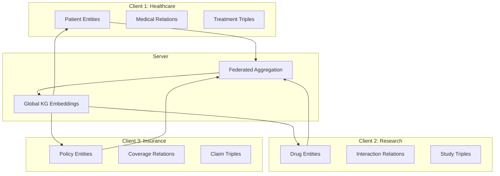
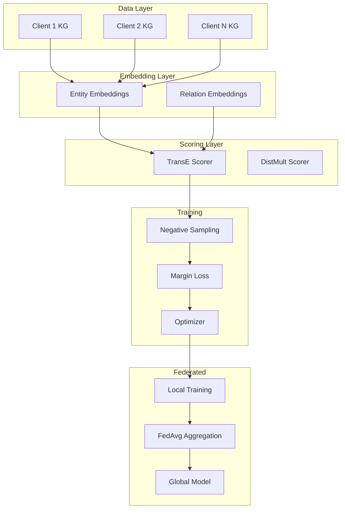

# Tutorial 196: Knowledge Graphs and Federated Learning

---

## Metadata

| Property | Value |
|----------|-------|
| **Tutorial ID** | 196 |
| **Title** | Knowledge Graphs and Federated Learning |
| **Category** | Advanced Applications |
| **Difficulty** | Advanced |
| **Duration** | 90 minutes |
| **Prerequisites** | Tutorial 001-010, Graph Neural Networks basics |
| **Author** | Unbitrium Contributors |
| **Last Updated** | January 2026 |

---

## Learning Objectives

By the end of this tutorial, you will be able to:

1. **Understand** the fundamentals of knowledge graph embeddings and their representation learning challenges in distributed settings.

2. **Implement** federated learning pipelines for knowledge graph completion tasks including link prediction and entity classification.

3. **Design** privacy-preserving strategies for sharing relation patterns without exposing sensitive entity connections.

4. **Evaluate** the quality of federated knowledge graph embeddings using standard metrics like Mean Reciprocal Rank (MRR) and Hits@K.

5. **Apply** entity alignment techniques across heterogeneous knowledge graphs held by different clients.

6. **Analyze** the trade-offs between privacy, communication efficiency, and embedding quality in federated KG scenarios.

---

## Prerequisites

Before starting this tutorial, ensure you have:

- **Completed Tutorials**: 001-010 (Partitioning fundamentals), 021-030 (Aggregation algorithms)
- **Knowledge**: Basic understanding of knowledge graphs, triples (head, relation, tail), and embedding methods
- **Libraries**: PyTorch, torch-geometric (optional), pykeen (optional)
- **Hardware**: GPU recommended for larger knowledge graphs

```python
# Verify prerequisites
import torch
import numpy as np
from unbitrium.aggregators import FedAvg
from unbitrium.partitioning import DirichletPartitioner

print(f"PyTorch: {torch.__version__}")
print(f"CUDA available: {torch.cuda.is_available()}")
```

---

## Background and Theory

### Knowledge Graphs Overview

A **knowledge graph** (KG) is a structured representation of real-world entities and their relationships. Formally, a KG is defined as:

$$\mathcal{G} = (\mathcal{E}, \mathcal{R}, \mathcal{T})$$

where:
- $\mathcal{E}$ is the set of entities
- $\mathcal{R}$ is the set of relation types
- $\mathcal{T} \subseteq \mathcal{E} \times \mathcal{R} \times \mathcal{E}$ is the set of triples

Each triple $(h, r, t) \in \mathcal{T}$ represents a factual statement where entity $h$ (head) is connected to entity $t$ (tail) via relation $r$.

### Knowledge Graph Embeddings

Knowledge graph embedding methods learn continuous vector representations for entities and relations:

$$\mathbf{e}_h, \mathbf{e}_t \in \mathbb{R}^d, \quad \mathbf{r} \in \mathbb{R}^d$$

The goal is to learn embeddings such that valid triples score higher than invalid ones:

$$f(h, r, t) > f(h', r, t') \quad \text{for valid triples}$$

### Popular Embedding Models

| Model | Scoring Function | Complexity |
|-------|-----------------|------------|
| **TransE** | $\|\mathbf{e}_h + \mathbf{r} - \mathbf{e}_t\|$ | $O(d)$ |
| **DistMult** | $\langle \mathbf{e}_h, \mathbf{r}, \mathbf{e}_t \rangle$ | $O(d)$ |
| **ComplEx** | $\text{Re}(\langle \mathbf{e}_h, \mathbf{r}, \bar{\mathbf{e}}_t \rangle)$ | $O(d)$ |
| **RotatE** | $\|\mathbf{e}_h \circ \mathbf{r} - \mathbf{e}_t\|$ | $O(d)$ |
| **ConvE** | CNN-based scoring | $O(d^2)$ |

### Federated Knowledge Graph Learning

In federated KG learning, knowledge is distributed across multiple clients:



### Challenges in Federated KG Learning

| Challenge | Description | Solution Approach |
|-----------|-------------|-------------------|
| **Entity Heterogeneity** | Different clients have different entity sets | Entity alignment, shared entity vocabulary |
| **Relation Privacy** | Relations reveal sensitive patterns | Differential privacy on relation embeddings |
| **Negative Sampling** | Local negatives may be global positives | Coordinated negative sampling |
| **Entity Alignment** | Same entity with different IDs | Cross-client entity matching |

### Mathematical Formulation

The federated KG embedding objective is:

$$\min_{\Theta} \sum_{k=1}^{K} \frac{|\mathcal{T}_k|}{|\mathcal{T}|} \mathcal{L}_k(\Theta)$$

where the local loss for client $k$ is:

$$\mathcal{L}_k(\Theta) = \sum_{(h,r,t) \in \mathcal{T}_k} \left[ \gamma + f(h,r,t) - f(h',r,t') \right]_+$$

with margin $\gamma$ and corrupted triples $(h', r, t')$.

---

## Architecture Diagram



---

## Implementation Code

### Part 1: Knowledge Graph Data Structures

```python
#!/usr/bin/env python3
"""
Tutorial 196: Federated Learning for Knowledge Graph Embeddings

This tutorial demonstrates how to train knowledge graph embeddings
in a federated setting where triples are distributed across clients.

Author: Unbitrium Contributors
License: EUPL-1.2
"""

from __future__ import annotations

import random
from dataclasses import dataclass, field
from typing import Any

import numpy as np
import torch
import torch.nn as nn
import torch.nn.functional as F
from torch.utils.data import Dataset, DataLoader


@dataclass
class Triple:
    """Represents a knowledge graph triple."""
    head: int
    relation: int
    tail: int

    def as_tuple(self) -> tuple[int, int, int]:
        """Return as tuple."""
        return (self.head, self.relation, self.tail)


@dataclass
class KnowledgeGraph:
    """Knowledge graph representation."""
    entities: set[int] = field(default_factory=set)
    relations: set[int] = field(default_factory=set)
    triples: list[Triple] = field(default_factory=list)

    @property
    def num_entities(self) -> int:
        """Number of unique entities."""
        return len(self.entities)

    @property
    def num_relations(self) -> int:
        """Number of unique relations."""
        return len(self.relations)

    @property
    def num_triples(self) -> int:
        """Number of triples."""
        return len(self.triples)

    def add_triple(self, head: int, relation: int, tail: int) -> None:
        """Add a triple to the knowledge graph."""
        self.entities.add(head)
        self.entities.add(tail)
        self.relations.add(relation)
        self.triples.append(Triple(head, relation, tail))

    @classmethod
    def from_triples(cls, triples: list[tuple[int, int, int]]) -> "KnowledgeGraph":
        """Create KG from list of triple tuples."""
        kg = cls()
        for h, r, t in triples:
            kg.add_triple(h, r, t)
        return kg


class TripleDataset(Dataset):
    """PyTorch dataset for knowledge graph triples."""

    def __init__(
        self,
        kg: KnowledgeGraph,
        num_negatives: int = 1,
        negative_mode: str = "both",
    ) -> None:
        """Initialize dataset.

        Args:
            kg: Knowledge graph.
            num_negatives: Number of negative samples per positive.
            negative_mode: 'head', 'tail', or 'both'.
        """
        self.kg = kg
        self.num_negatives = num_negatives
        self.negative_mode = negative_mode
        self.triple_set = set(t.as_tuple() for t in kg.triples)
        self.entity_list = list(kg.entities)

    def __len__(self) -> int:
        return len(self.kg.triples)

    def __getitem__(self, idx: int) -> dict[str, torch.Tensor]:
        """Get positive triple and negative samples."""
        triple = self.kg.triples[idx]
        h, r, t = triple.head, triple.relation, triple.tail

        # Generate negative samples
        neg_heads = []
        neg_tails = []

        for _ in range(self.num_negatives):
            if self.negative_mode in ("head", "both"):
                neg_h = self._corrupt_head(h, r, t)
                neg_heads.append(neg_h)

            if self.negative_mode in ("tail", "both"):
                neg_t = self._corrupt_tail(h, r, t)
                neg_tails.append(neg_t)

        return {
            "head": torch.tensor(h, dtype=torch.long),
            "relation": torch.tensor(r, dtype=torch.long),
            "tail": torch.tensor(t, dtype=torch.long),
            "neg_heads": torch.tensor(neg_heads, dtype=torch.long),
            "neg_tails": torch.tensor(neg_tails, dtype=torch.long),
        }

    def _corrupt_head(self, h: int, r: int, t: int) -> int:
        """Generate corrupted head."""
        while True:
            neg_h = random.choice(self.entity_list)
            if (neg_h, r, t) not in self.triple_set:
                return neg_h

    def _corrupt_tail(self, h: int, r: int, t: int) -> int:
        """Generate corrupted tail."""
        while True:
            neg_t = random.choice(self.entity_list)
            if (h, r, neg_t) not in self.triple_set:
                return neg_t
```

### Part 2: TransE Embedding Model

```python
class TransE(nn.Module):
    """TransE knowledge graph embedding model.

    The scoring function is: f(h, r, t) = ||e_h + r - e_t||

    Lower scores indicate more plausible triples.
    """

    def __init__(
        self,
        num_entities: int,
        num_relations: int,
        embedding_dim: int = 100,
        margin: float = 1.0,
        norm: int = 2,
    ) -> None:
        """Initialize TransE model.

        Args:
            num_entities: Number of unique entities.
            num_relations: Number of unique relations.
            embedding_dim: Dimension of embeddings.
            margin: Margin for ranking loss.
            norm: L1 or L2 norm.
        """
        super().__init__()
        self.num_entities = num_entities
        self.num_relations = num_relations
        self.embedding_dim = embedding_dim
        self.margin = margin
        self.norm = norm

        # Entity embeddings
        self.entity_embeddings = nn.Embedding(num_entities, embedding_dim)

        # Relation embeddings
        self.relation_embeddings = nn.Embedding(num_relations, embedding_dim)

        # Initialize embeddings
        self._init_embeddings()

    def _init_embeddings(self) -> None:
        """Initialize embeddings with uniform distribution."""
        nn.init.uniform_(
            self.entity_embeddings.weight,
            a=-6 / np.sqrt(self.embedding_dim),
            b=6 / np.sqrt(self.embedding_dim),
        )
        nn.init.uniform_(
            self.relation_embeddings.weight,
            a=-6 / np.sqrt(self.embedding_dim),
            b=6 / np.sqrt(self.embedding_dim),
        )

        # Normalize relation embeddings
        with torch.no_grad():
            self.relation_embeddings.weight.data = F.normalize(
                self.relation_embeddings.weight.data, p=2, dim=1
            )

    def score(
        self,
        heads: torch.Tensor,
        relations: torch.Tensor,
        tails: torch.Tensor,
    ) -> torch.Tensor:
        """Compute TransE scores for triples.

        Args:
            heads: Head entity indices.
            relations: Relation indices.
            tails: Tail entity indices.

        Returns:
            Scores (lower is better).
        """
        h = self.entity_embeddings(heads)
        r = self.relation_embeddings(relations)
        t = self.entity_embeddings(tails)

        # TransE: ||h + r - t||
        scores = torch.norm(h + r - t, p=self.norm, dim=-1)
        return scores

    def forward(
        self,
        heads: torch.Tensor,
        relations: torch.Tensor,
        tails: torch.Tensor,
        neg_heads: torch.Tensor,
        neg_tails: torch.Tensor,
    ) -> torch.Tensor:
        """Compute margin ranking loss.

        Args:
            heads: Positive head entities.
            relations: Relation indices.
            tails: Positive tail entities.
            neg_heads: Negative head entities.
            neg_tails: Negative tail entities.

        Returns:
            Loss value.
        """
        # Positive scores
        pos_scores = self.score(heads, relations, tails)

        # Negative scores (head corruption)
        neg_head_scores = self.score(
            neg_heads.squeeze(-1), relations, tails
        )

        # Negative scores (tail corruption)
        neg_tail_scores = self.score(
            heads, relations, neg_tails.squeeze(-1)
        )

        # Margin ranking loss
        loss_head = torch.relu(self.margin + pos_scores - neg_head_scores)
        loss_tail = torch.relu(self.margin + pos_scores - neg_tail_scores)

        return (loss_head + loss_tail).mean()

    def normalize_embeddings(self) -> None:
        """Normalize entity embeddings to unit ball."""
        with torch.no_grad():
            norms = self.entity_embeddings.weight.norm(p=2, dim=1, keepdim=True)
            self.entity_embeddings.weight.data = (
                self.entity_embeddings.weight.data / norms.clamp(min=1.0)
            )
```

### Part 3: Federated KG Learning

```python
class FederatedKGClient:
    """Federated learning client for knowledge graphs."""

    def __init__(
        self,
        client_id: int,
        kg: KnowledgeGraph,
        global_num_entities: int,
        global_num_relations: int,
        embedding_dim: int = 100,
        learning_rate: float = 0.01,
        local_epochs: int = 5,
        batch_size: int = 128,
    ) -> None:
        """Initialize KG client.

        Args:
            client_id: Unique client identifier.
            kg: Local knowledge graph.
            global_num_entities: Total entities across all clients.
            global_num_relations: Total relations across all clients.
            embedding_dim: Embedding dimension.
            learning_rate: Learning rate.
            local_epochs: Local training epochs.
            batch_size: Batch size.
        """
        self.client_id = client_id
        self.kg = kg
        self.embedding_dim = embedding_dim
        self.learning_rate = learning_rate
        self.local_epochs = local_epochs
        self.batch_size = batch_size

        # Create model with global dimensions
        self.model = TransE(
            num_entities=global_num_entities,
            num_relations=global_num_relations,
            embedding_dim=embedding_dim,
        )

        # Create dataset
        self.dataset = TripleDataset(kg, num_negatives=1)
        self.dataloader = DataLoader(
            self.dataset,
            batch_size=batch_size,
            shuffle=True,
        )

    @property
    def num_triples(self) -> int:
        """Number of local triples."""
        return self.kg.num_triples

    def load_global_model(self, state_dict: dict[str, torch.Tensor]) -> None:
        """Load global model parameters."""
        self.model.load_state_dict(state_dict)

    def train(self) -> dict[str, Any]:
        """Perform local training.

        Returns:
            Update dictionary with state_dict and metadata.
        """
        self.model.train()
        optimizer = torch.optim.Adam(
            self.model.parameters(),
            lr=self.learning_rate,
        )

        total_loss = 0.0
        num_batches = 0

        for epoch in range(self.local_epochs):
            epoch_loss = 0.0

            for batch in self.dataloader:
                optimizer.zero_grad()

                loss = self.model(
                    batch["head"],
                    batch["relation"],
                    batch["tail"],
                    batch["neg_heads"],
                    batch["neg_tails"],
                )

                loss.backward()
                optimizer.step()

                # Normalize entity embeddings
                self.model.normalize_embeddings()

                epoch_loss += loss.item()
                num_batches += 1

            total_loss += epoch_loss

        return {
            "state_dict": {
                k: v.clone() for k, v in self.model.state_dict().items()
            },
            "num_samples": self.num_triples,
            "client_id": self.client_id,
            "loss": total_loss / num_batches if num_batches > 0 else 0.0,
        }


def federated_kg_training(
    client_kgs: list[KnowledgeGraph],
    num_rounds: int = 10,
    clients_per_round: int = None,
    embedding_dim: int = 100,
    local_epochs: int = 5,
    learning_rate: float = 0.01,
) -> TransE:
    """Run federated knowledge graph training.

    Args:
        client_kgs: List of client knowledge graphs.
        num_rounds: Number of communication rounds.
        clients_per_round: Clients selected per round.
        embedding_dim: Embedding dimension.
        local_epochs: Local epochs per round.
        learning_rate: Learning rate.

    Returns:
        Trained global TransE model.
    """
    # Compute global entity and relation counts
    all_entities = set()
    all_relations = set()
    for kg in client_kgs:
        all_entities.update(kg.entities)
        all_relations.update(kg.relations)

    global_num_entities = len(all_entities)
    global_num_relations = len(all_relations)

    print(f"Global entities: {global_num_entities}")
    print(f"Global relations: {global_num_relations}")

    # Create clients
    clients = [
        FederatedKGClient(
            client_id=i,
            kg=kg,
            global_num_entities=global_num_entities,
            global_num_relations=global_num_relations,
            embedding_dim=embedding_dim,
            learning_rate=learning_rate,
            local_epochs=local_epochs,
        )
        for i, kg in enumerate(client_kgs)
    ]

    # Initialize global model
    global_model = TransE(
        num_entities=global_num_entities,
        num_relations=global_num_relations,
        embedding_dim=embedding_dim,
    )

    # Federated training loop
    for round_num in range(num_rounds):
        # Select clients
        if clients_per_round is None or clients_per_round >= len(clients):
            selected = clients
        else:
            selected = random.sample(clients, clients_per_round)

        # Distribute global model
        global_state = global_model.state_dict()
        for client in selected:
            client.load_global_model(global_state)

        # Collect local updates
        updates = []
        for client in selected:
            update = client.train()
            updates.append(update)
            print(f"  Client {client.client_id}: loss={update['loss']:.4f}")

        # Aggregate updates (FedAvg)
        total_samples = sum(u["num_samples"] for u in updates)
        new_state = {}

        for key in global_state.keys():
            weighted_sum = torch.zeros_like(global_state[key])
            for update in updates:
                weight = update["num_samples"] / total_samples
                weighted_sum += weight * update["state_dict"][key]
            new_state[key] = weighted_sum

        global_model.load_state_dict(new_state)
        print(f"Round {round_num + 1}/{num_rounds} complete")

    return global_model
```

### Part 4: Evaluation and Metrics

```python
def evaluate_link_prediction(
    model: TransE,
    test_triples: list[Triple],
    all_triples: set[tuple[int, int, int]],
    filter_: bool = True,
) -> dict[str, float]:
    """Evaluate link prediction performance.

    Args:
        model: Trained TransE model.
        test_triples: Test triples for evaluation.
        all_triples: All known triples (for filtering).
        filter_: Whether to use filtered ranking.

    Returns:
        Dictionary of evaluation metrics.
    """
    model.eval()

    ranks = []
    hits_at_1 = 0
    hits_at_3 = 0
    hits_at_10 = 0

    with torch.no_grad():
        for triple in test_triples:
            h, r, t = triple.head, triple.relation, triple.tail

            # Score all possible tails
            heads = torch.tensor([h] * model.num_entities)
            relations = torch.tensor([r] * model.num_entities)
            tails = torch.arange(model.num_entities)

            scores = model.score(heads, relations, tails)

            # Filter out known triples
            if filter_:
                for entity in range(model.num_entities):
                    if entity != t and (h, r, entity) in all_triples:
                        scores[entity] = float('inf')

            # Compute rank of correct tail
            rank = (scores < scores[t]).sum().item() + 1
            ranks.append(rank)

            # Hits@K
            if rank <= 1:
                hits_at_1 += 1
            if rank <= 3:
                hits_at_3 += 1
            if rank <= 10:
                hits_at_10 += 1

    num_triples = len(test_triples)

    return {
        "mrr": float(np.mean([1.0 / r for r in ranks])),
        "mr": float(np.mean(ranks)),
        "hits_at_1": hits_at_1 / num_triples,
        "hits_at_3": hits_at_3 / num_triples,
        "hits_at_10": hits_at_10 / num_triples,
    }
```

---

## Metrics and Evaluation

### Link Prediction Metrics

| Metric | Formula | Interpretation |
|--------|---------|----------------|
| **Mean Reciprocal Rank (MRR)** | $\frac{1}{|T|}\sum_{i=1}^{|T|} \frac{1}{\text{rank}_i}$ | Higher is better (max = 1) |
| **Mean Rank (MR)** | $\frac{1}{|T|}\sum_{i=1}^{|T|} \text{rank}_i$ | Lower is better |
| **Hits@K** | $\frac{|\{i : \text{rank}_i \leq K\}|}{|T|}$ | Higher is better (max = 1) |

### Expected Results

For a well-trained federated TransE model:

| Metric | Expected Range |
|--------|---------------|
| MRR | 0.20 - 0.40 |
| MR | 100 - 500 |
| Hits@1 | 0.10 - 0.25 |
| Hits@3 | 0.25 - 0.40 |
| Hits@10 | 0.40 - 0.60 |

### Privacy Analysis

Differential privacy can be applied to relation embeddings:

$$\mathbf{r}' = \mathbf{r} + \mathcal{N}(0, \sigma^2 I)$$

The sensitivity of relation embeddings depends on the scoring function.

---

## Exercises

### Exercise 1: Entity Alignment

**Task**: Implement an entity alignment mechanism where clients share entity descriptions (not embeddings) to match equivalent entities across knowledge graphs.

**Starter Code**:
```python
def align_entities(
    client_descriptions: list[dict[int, str]],
    similarity_threshold: float = 0.8,
) -> dict[tuple[int, int], tuple[int, int]]:
    """Align entities across clients based on descriptions."""
    # Your implementation here
    pass
```

### Exercise 2: Privacy of Relation Patterns

**Task**: Analyze what relation patterns can be inferred from aggregated embeddings. Implement differential privacy for relation embeddings.

### Exercise 3: Heterogeneous KG Federation

**Task**: Extend the implementation to handle clients with different relation schemas. Implement relation alignment.

### Exercise 4: Incremental Learning

**Task**: Modify the training loop to support new triples arriving over time without retraining from scratch.

---

## References

1. Bordes, A., Usunier, N., Garcia-Duran, A., Weston, J., & Yakhnenko, O. (2013). Translating embeddings for modeling multi-relational data. In *NeurIPS*.

2. Chen, M., Zhang, W., Zhang, W., Chen, Q., & Chen, H. (2021). Federated knowledge graph embeddings. In *SIGKDD*.

3. Peng, H., Li, J., Song, Y., & Liu, Y. (2021). Differentially private federated knowledge graphs embedding. In *CIKM*.

4. Sun, Z., Deng, Z.-H., Nie, J.-Y., & Tang, J. (2019). RotatE: Knowledge graph embedding by relational rotation in complex space. In *ICLR*.

5. Wang, Q., Mao, Z., Wang, B., & Guo, L. (2017). Knowledge graph embedding: A survey. *IEEE TKDE*.

---

*Copyright 2026 Olaf Yunus Laitinen Imanov and Contributors. Released under EUPL 1.2.*
