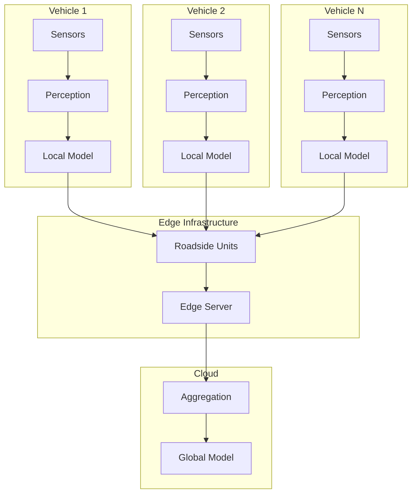
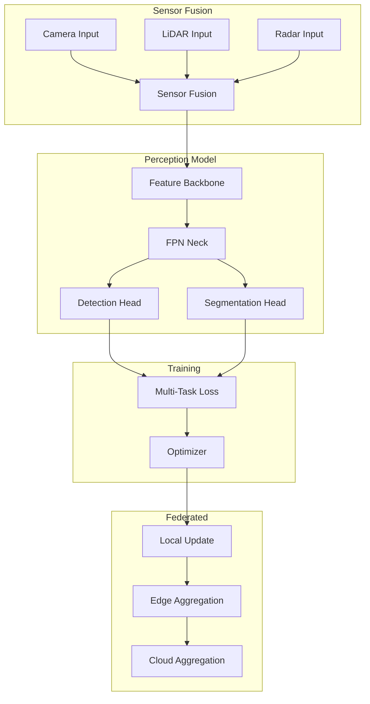

# Tutorial 197: Federated Learning for Autonomous Vehicles

---

## Metadata

| Property | Value |
|----------|-------|
| **Tutorial ID** | 197 |
| **Title** | Federated Learning for Autonomous Vehicles |
| **Category** | Advanced Applications |
| **Difficulty** | Advanced |
| **Duration** | 90 minutes |
| **Prerequisites** | Tutorial 001-010, Computer vision, Control systems |
| **Author** | Unbitrium Contributors |
| **Last Updated** | January 2026 |

---

## Learning Objectives

By the end of this tutorial, you will be able to:

1. **Understand** the unique requirements of federated learning for connected autonomous vehicles (CAVs).

2. **Implement** federated perception models for object detection and lane tracking.

3. **Design** vehicle-to-infrastructure (V2I) and vehicle-to-vehicle (V2V) learning architectures.

4. **Handle** heterogeneous sensor data across different vehicle platforms.

5. **Apply** real-time constraints and safety requirements in federated training.

6. **Evaluate** AV perception using mAP, IoU, and safety metrics.

---

## Prerequisites

Before starting this tutorial, ensure you have:

- **Completed Tutorials**: 001-010 (Partitioning), 021-030 (Aggregation), 191 (Computer Vision)
- **Knowledge**: Object detection, sensor fusion, vehicle dynamics
- **Libraries**: PyTorch, torchvision
- **Hardware**: GPU recommended

```python
# Verify prerequisites
import torch
import numpy as np

print(f"PyTorch: {torch.__version__}")
print(f"CUDA available: {torch.cuda.is_available()}")
```

---

## Background and Theory

### Autonomous Vehicle Perception

AV perception involves multiple sensor modalities:

| Sensor | Range | Conditions | Data Size |
|--------|-------|------------|-----------|
| **Camera** | 100-200m | Daylight | High |
| **LiDAR** | 200m+ | All weather | Very High |
| **Radar** | 250m+ | All weather | Low |
| **Ultrasonic** | 5m | Parking | Very Low |

### Federated AV Architecture



### V2X Communication

| Mode | Description | Latency |
|------|-------------|---------|
| **V2V** | Vehicle to Vehicle | < 10ms |
| **V2I** | Vehicle to Infrastructure | < 50ms |
| **V2N** | Vehicle to Network | < 100ms |
| **V2C** | Vehicle to Cloud | < 500ms |

### Challenges in Federated AV

| Challenge | Description | Solution |
|-----------|-------------|----------|
| **Real-time** | Low latency requirements | Edge aggregation |
| **Safety-critical** | Zero tolerance for errors | Conservative updates |
| **Heterogeneous sensors** | Different vehicle configs | Modular architecture |
| **Connectivity** | Intermittent connection | Asynchronous FL |

---

## Architecture Diagram



---

## Implementation Code

### Part 1: Sensor Data Structures

```python
#!/usr/bin/env python3
"""
Tutorial 197: Federated Learning for Autonomous Vehicles

This tutorial demonstrates federated perception learning
for connected autonomous vehicles.

Author: Unbitrium Contributors
License: EUPL-1.2
"""

from __future__ import annotations

from dataclasses import dataclass, field
from typing import Any

import numpy as np
import torch
import torch.nn as nn
import torch.nn.functional as F
from torch.utils.data import Dataset, DataLoader


@dataclass
class AVConfig:
    """Configuration for autonomous vehicle FL."""
    image_size: int = 256
    lidar_points: int = 10000
    num_classes: int = 10  # Vehicle, pedestrian, cyclist, etc.
    num_anchors: int = 9
    hidden_dim: int = 256
    dropout: float = 0.2
    batch_size: int = 8
    learning_rate: float = 0.001


@dataclass
class BoundingBox:
    """3D bounding box for object detection."""
    x: float  # Center x
    y: float  # Center y
    z: float  # Center z
    length: float
    width: float
    height: float
    yaw: float
    class_id: int
    confidence: float = 1.0


class AVDataset(Dataset):
    """Dataset for autonomous vehicle perception."""

    def __init__(
        self,
        images: np.ndarray,
        lidar_points: np.ndarray,
        boxes: list[list[BoundingBox]],
        config: AVConfig = None,
    ) -> None:
        """Initialize dataset.

        Args:
            images: Camera images (N, C, H, W).
            lidar_points: LiDAR point clouds (N, P, 4) - x, y, z, intensity.
            boxes: List of bounding boxes per sample.
            config: Configuration.
        """
        self.images = torch.FloatTensor(images)
        self.lidar = torch.FloatTensor(lidar_points)
        self.boxes = boxes
        self.config = config or AVConfig()

    def __len__(self) -> int:
        return len(self.images)

    def __getitem__(self, idx: int) -> dict[str, torch.Tensor]:
        # Encode boxes as target tensor
        boxes = self.boxes[idx]
        max_boxes = 50
        box_tensor = torch.zeros(max_boxes, 8)  # x, y, z, l, w, h, yaw, class

        for i, box in enumerate(boxes[:max_boxes]):
            box_tensor[i] = torch.tensor([
                box.x, box.y, box.z,
                box.length, box.width, box.height,
                box.yaw, box.class_id,
            ])

        return {
            "image": self.images[idx],
            "lidar": self.lidar[idx],
            "boxes": box_tensor,
            "num_boxes": torch.tensor(len(boxes), dtype=torch.long),
        }


def generate_synthetic_av_data(
    num_samples: int = 100,
    image_size: int = 256,
    num_points: int = 10000,
    max_objects: int = 20,
    seed: int = None,
) -> tuple[np.ndarray, np.ndarray, list[list[BoundingBox]]]:
    """Generate synthetic AV data.

    Returns:
        Tuple of (images, lidar_points, boxes).
    """
    if seed is not None:
        np.random.seed(seed)

    images = np.random.randn(num_samples, 3, image_size, image_size).astype(np.float32)
    lidar = np.random.randn(num_samples, num_points, 4).astype(np.float32)
    lidar[:, :, :3] *= 50  # Scale to -50 to 50 meters
    lidar[:, :, 3] = np.abs(lidar[:, :, 3])  # Intensity is positive

    all_boxes = []
    for _ in range(num_samples):
        num_objects = np.random.randint(1, max_objects)
        boxes = []
        for _ in range(num_objects):
            box = BoundingBox(
                x=np.random.uniform(-30, 30),
                y=np.random.uniform(-30, 30),
                z=np.random.uniform(-1, 2),
                length=np.random.uniform(3, 6),
                width=np.random.uniform(1.5, 2.5),
                height=np.random.uniform(1.2, 2.0),
                yaw=np.random.uniform(-np.pi, np.pi),
                class_id=np.random.randint(0, 10),
            )
            boxes.append(box)
        all_boxes.append(boxes)

    return images, lidar, all_boxes
```

### Part 2: Perception Models

```python
class ImageBackbone(nn.Module):
    """CNN backbone for camera images."""

    def __init__(self, in_channels: int = 3, out_channels: int = 256) -> None:
        super().__init__()

        self.layer1 = nn.Sequential(
            nn.Conv2d(in_channels, 64, 7, stride=2, padding=3),
            nn.BatchNorm2d(64),
            nn.ReLU(inplace=True),
            nn.MaxPool2d(3, stride=2, padding=1),
        )

        self.layer2 = self._make_layer(64, 64, 2)
        self.layer3 = self._make_layer(64, 128, 2, stride=2)
        self.layer4 = self._make_layer(128, 256, 2, stride=2)

        self.conv_out = nn.Conv2d(256, out_channels, 1)

    def _make_layer(
        self,
        in_channels: int,
        out_channels: int,
        blocks: int,
        stride: int = 1,
    ) -> nn.Sequential:
        layers = [
            nn.Conv2d(in_channels, out_channels, 3, stride=stride, padding=1),
            nn.BatchNorm2d(out_channels),
            nn.ReLU(inplace=True),
        ]
        for _ in range(1, blocks):
            layers.extend([
                nn.Conv2d(out_channels, out_channels, 3, padding=1),
                nn.BatchNorm2d(out_channels),
                nn.ReLU(inplace=True),
            ])
        return nn.Sequential(*layers)

    def forward(self, x: torch.Tensor) -> torch.Tensor:
        x = self.layer1(x)
        x = self.layer2(x)
        x = self.layer3(x)
        x = self.layer4(x)
        x = self.conv_out(x)
        return x


class PointNetEncoder(nn.Module):
    """PointNet encoder for LiDAR point clouds."""

    def __init__(
        self,
        in_channels: int = 4,
        out_channels: int = 256,
    ) -> None:
        super().__init__()

        self.conv1 = nn.Conv1d(in_channels, 64, 1)
        self.conv2 = nn.Conv1d(64, 128, 1)
        self.conv3 = nn.Conv1d(128, 256, 1)
        self.conv4 = nn.Conv1d(256, out_channels, 1)

        self.bn1 = nn.BatchNorm1d(64)
        self.bn2 = nn.BatchNorm1d(128)
        self.bn3 = nn.BatchNorm1d(256)
        self.bn4 = nn.BatchNorm1d(out_channels)

    def forward(self, x: torch.Tensor) -> torch.Tensor:
        """Process point cloud.

        Args:
            x: Point cloud (batch, points, channels).

        Returns:
            Global features (batch, out_channels).
        """
        x = x.transpose(1, 2)  # (batch, channels, points)

        x = F.relu(self.bn1(self.conv1(x)))
        x = F.relu(self.bn2(self.conv2(x)))
        x = F.relu(self.bn3(self.conv3(x)))
        x = F.relu(self.bn4(self.conv4(x)))

        # Global max pooling
        x = x.max(dim=2)[0]  # (batch, features)

        return x


class DetectionHead(nn.Module):
    """Detection head for object detection."""

    def __init__(
        self,
        in_channels: int = 512,
        num_classes: int = 10,
        num_anchors: int = 9,
    ) -> None:
        super().__init__()

        self.num_classes = num_classes
        self.num_anchors = num_anchors

        # Classification head
        self.cls_head = nn.Sequential(
            nn.Linear(in_channels, 256),
            nn.ReLU(inplace=True),
            nn.Linear(256, num_anchors * num_classes),
        )

        # Regression head (7 values: x, y, z, l, w, h, yaw)
        self.reg_head = nn.Sequential(
            nn.Linear(in_channels, 256),
            nn.ReLU(inplace=True),
            nn.Linear(256, num_anchors * 7),
        )

    def forward(
        self,
        features: torch.Tensor,
    ) -> tuple[torch.Tensor, torch.Tensor]:
        """Forward pass.

        Args:
            features: Fused features (batch, channels).

        Returns:
            Tuple of (class_logits, box_regression).
        """
        cls_logits = self.cls_head(features)
        box_reg = self.reg_head(features)

        batch_size = features.size(0)
        cls_logits = cls_logits.view(batch_size, self.num_anchors, self.num_classes)
        box_reg = box_reg.view(batch_size, self.num_anchors, 7)

        return cls_logits, box_reg


class FusionPerceptionModel(nn.Module):
    """Multi-modal perception model for AV."""

    def __init__(
        self,
        image_channels: int = 3,
        lidar_channels: int = 4,
        hidden_dim: int = 256,
        num_classes: int = 10,
        num_anchors: int = 9,
    ) -> None:
        super().__init__()

        self.image_encoder = ImageBackbone(image_channels, hidden_dim)
        self.lidar_encoder = PointNetEncoder(lidar_channels, hidden_dim)

        # Fusion
        self.fusion = nn.Sequential(
            nn.Linear(hidden_dim * 2, hidden_dim),
            nn.ReLU(inplace=True),
            nn.Dropout(0.2),
        )

        self.detection_head = DetectionHead(hidden_dim, num_classes, num_anchors)

    def forward(
        self,
        image: torch.Tensor,
        lidar: torch.Tensor,
    ) -> tuple[torch.Tensor, torch.Tensor]:
        """Forward pass.

        Args:
            image: Camera image (batch, C, H, W).
            lidar: Point cloud (batch, P, 4).

        Returns:
            Tuple of (class_logits, box_regression).
        """
        # Encode modalities
        img_features = self.image_encoder(image)
        img_features = F.adaptive_avg_pool2d(img_features, 1).flatten(1)

        lidar_features = self.lidar_encoder(lidar)

        # Fuse
        fused = torch.cat([img_features, lidar_features], dim=1)
        fused = self.fusion(fused)

        # Detect
        return self.detection_head(fused)
```

### Part 3: Federated AV Client

```python
class FedAVClient:
    """Federated learning client for autonomous vehicles."""

    def __init__(
        self,
        vehicle_id: int,
        images: np.ndarray,
        lidar: np.ndarray,
        boxes: list[list[BoundingBox]],
        config: AVConfig = None,
    ) -> None:
        """Initialize AV client."""
        self.vehicle_id = vehicle_id
        self.config = config or AVConfig()

        self.dataset = AVDataset(images, lidar, boxes, config)
        self.dataloader = DataLoader(
            self.dataset,
            batch_size=self.config.batch_size,
            shuffle=True,
        )

        self.model = FusionPerceptionModel(
            hidden_dim=self.config.hidden_dim,
            num_classes=self.config.num_classes,
            num_anchors=self.config.num_anchors,
        )

        self.optimizer = torch.optim.Adam(
            self.model.parameters(),
            lr=self.config.learning_rate,
        )

    @property
    def num_samples(self) -> int:
        return len(self.dataset)

    def load_global_model(self, state_dict: dict[str, torch.Tensor]) -> None:
        self.model.load_state_dict(state_dict)

    def compute_loss(
        self,
        cls_logits: torch.Tensor,
        box_reg: torch.Tensor,
        target_boxes: torch.Tensor,
        num_boxes: torch.Tensor,
    ) -> torch.Tensor:
        """Compute detection loss."""
        batch_size = cls_logits.size(0)
        total_loss = 0.0

        for i in range(batch_size):
            n = num_boxes[i].item()
            if n == 0:
                continue

            # Simple classification loss
            target_cls = target_boxes[i, :n, 7].long()
            pred_cls = cls_logits[i, :n, :]
            cls_loss = F.cross_entropy(pred_cls, target_cls % self.config.num_classes)

            # Box regression loss
            target_reg = target_boxes[i, :n, :7]
            pred_reg = box_reg[i, :n, :]
            reg_loss = F.smooth_l1_loss(pred_reg, target_reg)

            total_loss += cls_loss + reg_loss

        return total_loss / batch_size

    def train(self, epochs: int = 5) -> dict[str, Any]:
        self.model.train()
        total_loss = 0.0
        num_batches = 0

        for epoch in range(epochs):
            for batch in self.dataloader:
                self.optimizer.zero_grad()

                cls_logits, box_reg = self.model(batch["image"], batch["lidar"])
                loss = self.compute_loss(
                    cls_logits, box_reg, batch["boxes"], batch["num_boxes"]
                )

                loss.backward()
                torch.nn.utils.clip_grad_norm_(self.model.parameters(), 1.0)
                self.optimizer.step()

                total_loss += loss.item()
                num_batches += 1

        return {
            "state_dict": {k: v.clone() for k, v in self.model.state_dict().items()},
            "num_samples": self.num_samples,
            "vehicle_id": self.vehicle_id,
            "loss": total_loss / num_batches if num_batches > 0 else 0.0,
        }


def federated_av_training(
    num_vehicles: int = 10,
    num_rounds: int = 20,
    local_epochs: int = 5,
) -> tuple[nn.Module, dict]:
    """Run federated AV training."""
    config = AVConfig()

    clients = []
    for i in range(num_vehicles):
        images, lidar, boxes = generate_synthetic_av_data(
            num_samples=50,
            image_size=config.image_size,
            num_points=config.lidar_points,
            seed=i * 100,
        )
        client = FedAVClient(vehicle_id=i, images=images, lidar=lidar, boxes=boxes, config=config)
        clients.append(client)

    global_model = FusionPerceptionModel(
        hidden_dim=config.hidden_dim,
        num_classes=config.num_classes,
        num_anchors=config.num_anchors,
    )

    history = {"rounds": [], "losses": []}

    for round_num in range(num_rounds):
        global_state = global_model.state_dict()
        for client in clients:
            client.load_global_model(global_state)

        updates = []
        for client in clients:
            update = client.train(epochs=local_epochs)
            updates.append(update)

        total_samples = sum(u["num_samples"] for u in updates)
        new_state = {}
        for key in global_state.keys():
            weighted_sum = torch.zeros_like(global_state[key])
            for update in updates:
                weight = update["num_samples"] / total_samples
                weighted_sum += weight * update["state_dict"][key]
            new_state[key] = weighted_sum

        global_model.load_state_dict(new_state)

        avg_loss = np.mean([u["loss"] for u in updates])
        history["rounds"].append(round_num)
        history["losses"].append(avg_loss)
        print(f"Round {round_num + 1}/{num_rounds}: loss={avg_loss:.4f}")

    return global_model, history
```

---

## Metrics and Evaluation

### Detection Metrics

| Metric | Formula | Target |
|--------|---------|--------|
| **mAP** | Mean Average Precision | > 0.70 |
| **IoU** | Intersection over Union | > 0.50 |
| **FPS** | Frames per second | > 30 |

### Safety Metrics

| Metric | Description |
|--------|-------------|
| **Miss Rate** | Undetected objects |
| **False Positive** | Ghost detections |
| **Latency** | Detection delay |

---

## Exercises

### Exercise 1: Asynchronous Updates

**Task**: Implement asynchronous FL for vehicles with intermittent connectivity.

### Exercise 2: Sensor Heterogeneity

**Task**: Handle vehicles with different sensor configurations.

### Exercise 3: Safety-Critical Updates

**Task**: Implement conservative model updates for safety.

### Exercise 4: V2V Learning

**Task**: Implement direct vehicle-to-vehicle model sharing.

---

## References

1. Liang, X., et al. (2022). Federated learning for connected autonomous vehicles. *IEEE TVT*.

2. Pokhrel, S. R., et al. (2020). Federated learning with blockchain for autonomous vehicles. *IEEE TITS*.

3. Lu, Y., et al. (2020). Blockchain and federated learning for privacy-preserved data sharing. *IEEE Network*.

4. Qi, C. R., et al. (2017). PointNet: Deep learning on point sets. In *CVPR*.

5. Sadat, H., et al. (2020). Federated learning for autonomous driving. *arXiv*.

---

*Copyright 2026 Olaf Yunus Laitinen Imanov and Contributors. Released under EUPL 1.2.*
