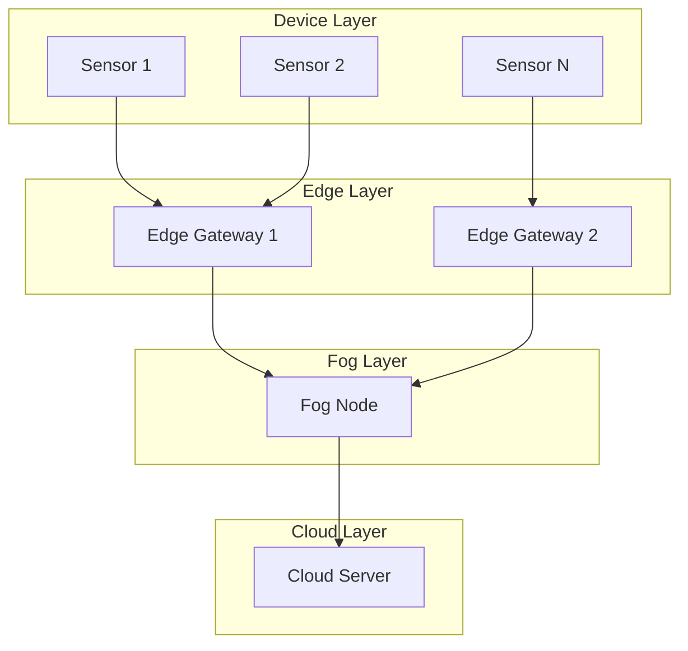
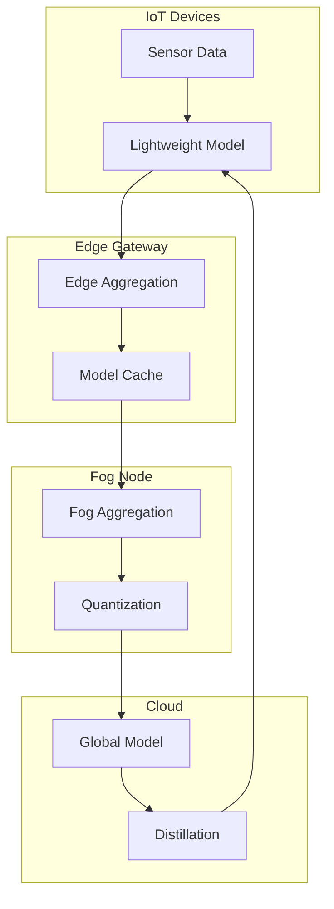

# Tutorial 198: Federated Learning for IoT and Edge Computing

---

## Metadata

| Property | Value |
|----------|-------|
| **Tutorial ID** | 198 |
| **Title** | Federated Learning for IoT and Edge Computing |
| **Category** | Advanced Applications |
| **Difficulty** | Advanced |
| **Duration** | 90 minutes |
| **Prerequisites** | Tutorial 001-010, Edge computing basics |
| **Author** | Unbitrium Contributors |
| **Last Updated** | January 2026 |

---

## Learning Objectives

By the end of this tutorial, you will be able to:

1. **Understand** the unique constraints of federated learning on IoT devices including limited compute, memory, and power.

2. **Implement** lightweight models suitable for edge deployment.

3. **Design** hierarchical aggregation for edge-cloud architectures.

4. **Handle** device heterogeneity and resource-aware client selection.

5. **Apply** model compression techniques for bandwidth-constrained scenarios.

6. **Evaluate** edge FL systems using latency, energy consumption, and accuracy.

---

## Prerequisites

Before starting this tutorial, ensure you have:

- **Completed Tutorials**: 001-010 (Partitioning), 021-030 (Aggregation)
- **Knowledge**: Edge computing, embedded systems, model compression
- **Libraries**: PyTorch
- **Hardware**: CPU sufficient

```python
# Verify prerequisites
import torch
import numpy as np

print(f"PyTorch: {torch.__version__}")
print(f"Available threads: {torch.get_num_threads()}")
```

---

## Background and Theory

### IoT Constraints

| Constraint | Typical Value | Impact |
|------------|---------------|--------|
| **CPU** | ARM Cortex-M/A | Limited compute |
| **RAM** | 32KB - 1GB | Small models |
| **Storage** | 1MB - 16GB | Model size limit |
| **Battery** | mAh limited | Energy efficiency |
| **Bandwidth** | kbps - Mbps | Communication cost |

### Edge Computing Hierarchy



### Resource-Aware FL Challenges

| Challenge | Description | Solution |
|-----------|-------------|----------|
| **Compute** | Slow training | Lightweight models |
| **Memory** | OOM errors | Gradient checkpointing |
| **Energy** | Battery drain | Efficient aggregation |
| **Bandwidth** | Slow sync | Compression |
| **Heterogeneity** | Different capabilities | Adaptive selection |

### Model Compression Techniques

| Technique | Compression | Accuracy |
|-----------|-------------|----------|
| **Quantization** | 4-16x | ~1% drop |
| **Pruning** | 2-10x | ~1-2% drop |
| **Knowledge Distillation** | Variable | Minimal |
| **Low-Rank Factorization** | 2-4x | ~1% drop |

---

## Architecture Diagram



---

## Implementation Code

### Part 1: Device Simulation and Lightweight Models

```python
#!/usr/bin/env python3
"""
Tutorial 198: Federated Learning for IoT and Edge Computing

This tutorial demonstrates resource-aware federated learning
for IoT devices with hierarchical aggregation.

Author: Unbitrium Contributors
License: EUPL-1.2
"""

from __future__ import annotations

from dataclasses import dataclass
from typing import Any
import time

import numpy as np
import torch
import torch.nn as nn
import torch.nn.functional as F
from torch.utils.data import Dataset, DataLoader


@dataclass
class IoTConfig:
    """Configuration for IoT federated learning."""
    input_dim: int = 16  # Sensor features
    hidden_dim: int = 32  # Small for edge
    num_classes: int = 5
    batch_size: int = 16
    learning_rate: float = 0.01
    num_edge_gateways: int = 3
    devices_per_gateway: int = 10


@dataclass
class DeviceProfile:
    """Device hardware profile."""
    name: str
    cpu_power: float  # Relative power (0-1)
    memory_mb: int
    battery_mah: int
    bandwidth_kbps: int

    @classmethod
    def raspberry_pi(cls) -> "DeviceProfile":
        return cls("Raspberry Pi", 0.3, 1024, 5000, 10000)

    @classmethod
    def arduino(cls) -> "DeviceProfile":
        return cls("Arduino", 0.05, 32, 1000, 100)

    @classmethod
    def esp32(cls) -> "DeviceProfile":
        return cls("ESP32", 0.1, 520, 2000, 1000)

    @classmethod
    def smartphone(cls) -> "DeviceProfile":
        return cls("Smartphone", 0.7, 4096, 4000, 50000)


class IoTDataset(Dataset):
    """Dataset for IoT sensor readings."""

    def __init__(
        self,
        features: np.ndarray,
        labels: np.ndarray,
    ) -> None:
        self.features = torch.FloatTensor(features)
        self.labels = torch.LongTensor(labels)

    def __len__(self) -> int:
        return len(self.labels)

    def __getitem__(self, idx: int) -> tuple[torch.Tensor, torch.Tensor]:
        return self.features[idx], self.labels[idx]


def generate_iot_data(
    num_samples: int = 500,
    num_features: int = 16,
    num_classes: int = 5,
    seed: int = None,
) -> tuple[np.ndarray, np.ndarray]:
    """Generate synthetic IoT sensor data."""
    if seed is not None:
        np.random.seed(seed)

    features = np.random.randn(num_samples, num_features).astype(np.float32)
    labels = np.random.randint(0, num_classes, num_samples)

    return features, labels


class TinyMLP(nn.Module):
    """Tiny MLP for resource-constrained devices."""

    def __init__(
        self,
        input_dim: int = 16,
        hidden_dim: int = 32,
        num_classes: int = 5,
    ) -> None:
        super().__init__()

        self.fc1 = nn.Linear(input_dim, hidden_dim)
        self.fc2 = nn.Linear(hidden_dim, hidden_dim)
        self.fc3 = nn.Linear(hidden_dim, num_classes)
        self.dropout = nn.Dropout(0.1)

    def forward(self, x: torch.Tensor) -> torch.Tensor:
        x = F.relu(self.fc1(x))
        x = self.dropout(x)
        x = F.relu(self.fc2(x))
        x = self.dropout(x)
        x = self.fc3(x)
        return x

    def count_parameters(self) -> int:
        return sum(p.numel() for p in self.parameters())


class MicroCNN(nn.Module):
    """Micro CNN for slightly more capable devices."""

    def __init__(
        self,
        input_channels: int = 1,
        num_classes: int = 5,
    ) -> None:
        super().__init__()

        self.conv1 = nn.Conv1d(input_channels, 8, 3, padding=1)
        self.conv2 = nn.Conv1d(8, 16, 3, padding=1)
        self.pool = nn.AdaptiveAvgPool1d(4)
        self.fc = nn.Linear(16 * 4, num_classes)

    def forward(self, x: torch.Tensor) -> torch.Tensor:
        x = x.unsqueeze(1)  # Add channel dimension
        x = F.relu(self.conv1(x))
        x = F.relu(self.conv2(x))
        x = self.pool(x)
        x = x.view(x.size(0), -1)
        x = self.fc(x)
        return x
```

### Part 2: Model Compression

```python
class ModelQuantizer:
    """Dynamic quantization for model compression."""

    def __init__(self, bits: int = 8) -> None:
        """Initialize quantizer.

        Args:
            bits: Number of bits for quantization.
        """
        self.bits = bits
        self.scale = 2 ** (bits - 1) - 1

    def quantize(self, model: nn.Module) -> dict[str, torch.Tensor]:
        """Quantize model weights.

        Args:
            model: PyTorch model.

        Returns:
            Quantized state dict.
        """
        quantized = {}
        for name, param in model.state_dict().items():
            if param.dtype == torch.float32:
                # Scale and quantize
                min_val = param.min()
                max_val = param.max()
                scale = max_val - min_val + 1e-8
                quantized_param = ((param - min_val) / scale * self.scale).round().to(torch.int8)
                quantized[name] = {
                    "data": quantized_param,
                    "min": min_val,
                    "scale": scale,
                }
            else:
                quantized[name] = {"data": param}
        return quantized

    def dequantize(self, quantized: dict) -> dict[str, torch.Tensor]:
        """Dequantize model weights.

        Args:
            quantized: Quantized weights.

        Returns:
            Float state dict.
        """
        state_dict = {}
        for name, q_data in quantized.items():
            if "min" in q_data:
                data = q_data["data"].float() / self.scale * q_data["scale"] + q_data["min"]
                state_dict[name] = data
            else:
                state_dict[name] = q_data["data"]
        return state_dict


class GradientCompressor:
    """Gradient compression for bandwidth reduction."""

    def __init__(self, compression_ratio: float = 0.1) -> None:
        """Initialize compressor.

        Args:
            compression_ratio: Fraction of gradients to keep.
        """
        self.compression_ratio = compression_ratio

    def compress(self, gradients: dict[str, torch.Tensor]) -> dict[str, Any]:
        """Compress gradients using top-k sparsification.

        Args:
            gradients: Gradient dictionary.

        Returns:
            Compressed gradients.
        """
        compressed = {}
        for name, grad in gradients.items():
            flat = grad.flatten()
            k = max(1, int(len(flat) * self.compression_ratio))

            # Top-k by magnitude
            values, indices = flat.abs().topk(k)
            compressed[name] = {
                "values": flat[indices],
                "indices": indices,
                "shape": grad.shape,
            }
        return compressed

    def decompress(self, compressed: dict[str, Any]) -> dict[str, torch.Tensor]:
        """Decompress gradients.

        Args:
            compressed: Compressed gradients.

        Returns:
            Full gradient tensors.
        """
        gradients = {}
        for name, c_data in compressed.items():
            grad = torch.zeros(c_data["shape"]).flatten()
            grad[c_data["indices"]] = c_data["values"]
            gradients[name] = grad.view(c_data["shape"])
        return gradients
```

### Part 3: Hierarchical Federated System

```python
class IoTDevice:
    """Simulated IoT device."""

    def __init__(
        self,
        device_id: int,
        features: np.ndarray,
        labels: np.ndarray,
        profile: DeviceProfile,
        config: IoTConfig = None,
    ) -> None:
        """Initialize IoT device."""
        self.device_id = device_id
        self.profile = profile
        self.config = config or IoTConfig()

        self.dataset = IoTDataset(features, labels)
        self.dataloader = DataLoader(
            self.dataset,
            batch_size=self.config.batch_size,
            shuffle=True,
        )

        self.model = TinyMLP(
            input_dim=self.config.input_dim,
            hidden_dim=self.config.hidden_dim,
            num_classes=self.config.num_classes,
        )

        self.optimizer = torch.optim.SGD(
            self.model.parameters(),
            lr=self.config.learning_rate,
        )
        self.criterion = nn.CrossEntropyLoss()

        # Resource tracking
        self.energy_consumed = 0.0
        self.training_time = 0.0

    @property
    def num_samples(self) -> int:
        return len(self.dataset)

    def load_model(self, state_dict: dict[str, torch.Tensor]) -> None:
        self.model.load_state_dict(state_dict)

    def train(self, epochs: int = 1) -> dict[str, Any]:
        """Train with resource tracking."""
        start_time = time.time()
        self.model.train()
        total_loss = 0.0
        correct = 0
        total = 0

        # Simulated resource scaling based on profile
        effective_epochs = max(1, int(epochs * self.profile.cpu_power))

        for epoch in range(effective_epochs):
            for features, labels in self.dataloader:
                self.optimizer.zero_grad()
                outputs = self.model(features)
                loss = self.criterion(outputs, labels)
                loss.backward()
                self.optimizer.step()

                total_loss += loss.item()
                _, predicted = outputs.max(1)
                total += labels.size(0)
                correct += predicted.eq(labels).sum().item()

        self.training_time = time.time() - start_time
        self.energy_consumed += self.training_time * self.profile.cpu_power * 10  # mAh estimate

        return {
            "state_dict": {k: v.clone() for k, v in self.model.state_dict().items()},
            "num_samples": self.num_samples,
            "device_id": self.device_id,
            "loss": total_loss / len(self.dataloader) / effective_epochs,
            "accuracy": correct / total,
            "energy_mah": self.energy_consumed,
            "time_s": self.training_time,
        }


class EdgeGateway:
    """Edge gateway for local aggregation."""

    def __init__(
        self,
        gateway_id: int,
        devices: list[IoTDevice],
    ) -> None:
        """Initialize edge gateway."""
        self.gateway_id = gateway_id
        self.devices = devices
        self.local_model = TinyMLP()
        self.quantizer = ModelQuantizer(bits=8)

    def aggregate_devices(self) -> dict[str, torch.Tensor]:
        """Aggregate updates from local devices."""
        total_samples = sum(d.num_samples for d in self.devices)
        aggregated = None

        for device in self.devices:
            update = device.train(epochs=1)
            weight = update["num_samples"] / total_samples

            if aggregated is None:
                aggregated = {
                    k: v * weight for k, v in update["state_dict"].items()
                }
            else:
                for k, v in update["state_dict"].items():
                    aggregated[k] += v * weight

        return aggregated

    def get_compressed_update(self) -> dict:
        """Get quantized model for cloud."""
        aggregated = self.aggregate_devices()
        self.local_model.load_state_dict(aggregated)
        return self.quantizer.quantize(self.local_model)


class FogNode:
    """Fog node for intermediate aggregation."""

    def __init__(
        self,
        edge_gateways: list[EdgeGateway],
    ) -> None:
        """Initialize fog node."""
        self.gateways = edge_gateways
        self.quantizer = ModelQuantizer(bits=8)

    def aggregate_edge(self) -> dict[str, torch.Tensor]:
        """Aggregate from edge gateways."""
        num_gateways = len(self.gateways)
        aggregated = None

        for gateway in self.gateways:
            compressed = gateway.get_compressed_update()
            update = self.quantizer.dequantize(compressed)

            if aggregated is None:
                aggregated = {k: v / num_gateways for k, v in update.items()}
            else:
                for k, v in update.items():
                    aggregated[k] += v / num_gateways

        return aggregated


def hierarchical_iot_training(
    num_gateways: int = 3,
    devices_per_gateway: int = 10,
    num_rounds: int = 20,
) -> tuple[nn.Module, dict]:
    """Run hierarchical IoT federated learning."""
    config = IoTConfig(
        num_edge_gateways=num_gateways,
        devices_per_gateway=devices_per_gateway,
    )

    # Device profiles
    profiles = [
        DeviceProfile.esp32(),
        DeviceProfile.arduino(),
        DeviceProfile.raspberry_pi(),
    ]

    # Create devices and gateways
    gateways = []
    device_id = 0

    for gw_id in range(num_gateways):
        devices = []
        for _ in range(devices_per_gateway):
            features, labels = generate_iot_data(
                num_samples=100,
                num_features=config.input_dim,
                seed=device_id * 100,
            )
            profile = profiles[device_id % len(profiles)]
            device = IoTDevice(device_id, features, labels, profile, config)
            devices.append(device)
            device_id += 1

        gateway = EdgeGateway(gw_id, devices)
        gateways.append(gateway)

    fog = FogNode(gateways)

    # Global model
    global_model = TinyMLP(
        input_dim=config.input_dim,
        hidden_dim=config.hidden_dim,
        num_classes=config.num_classes,
    )

    history = {"rounds": [], "losses": [], "energy": []}

    for round_num in range(num_rounds):
        # Distribute global model
        global_state = global_model.state_dict()
        for gateway in gateways:
            for device in gateway.devices:
                device.load_model(global_state)

        # Hierarchical aggregation
        aggregated = fog.aggregate_edge()
        global_model.load_state_dict(aggregated)

        # Metrics
        total_energy = sum(
            d.energy_consumed for gw in gateways for d in gw.devices
        )
        avg_loss = np.mean([
            d.train(epochs=0)["loss"] for gw in gateways for d in gw.devices
        ] or [0])

        history["rounds"].append(round_num)
        history["losses"].append(avg_loss)
        history["energy"].append(total_energy)

        print(f"Round {round_num + 1}/{num_rounds}: energy={total_energy:.2f} mAh")

    return global_model, history
```

---

## Metrics and Evaluation

### Edge FL Metrics

| Metric | Description | Target |
|--------|-------------|--------|
| **Accuracy** | Prediction accuracy | > 0.85 |
| **Latency** | Round-trip time | < 1s |
| **Energy** | Battery consumption | Minimize |
| **Bandwidth** | Data transferred | Minimize |

### Resource Efficiency

| Compression | Model Size | Accuracy Drop |
|-------------|------------|---------------|
| FP32 | 100% | 0% |
| INT8 | 25% | ~1% |
| INT4 | 12.5% | ~2-3% |

---

## Exercises

### Exercise 1: Adaptive Compression

**Task**: Implement adaptive compression based on network conditions.

### Exercise 2: Device Selection

**Task**: Implement resource-aware client selection.

### Exercise 3: Model Switching

**Task**: Switch between tiny/micro models based on device capability.

### Exercise 4: Energy-Aware Training

**Task**: Implement training schedules based on battery level.

---

## References

1. Khan, L. U., et al. (2021). Federated learning for edge networks. *IEEE CST*.

2. Wang, S., et al. (2019). Adaptive federated learning in resource constrained edge computing. *IEEE TMC*.

3. Mills, J., et al. (2019). Communication-efficient federated learning for wireless edge networks. In *ICC*.

4. Caldas, S., et al. (2018). Expanding the reach of federated learning by reducing client resource requirements. *arXiv*.

5. Bonawitz, K., et al. (2019). Towards federated learning at scale. In *MLSys*.

---

*Copyright 2026 Olaf Yunus Laitinen Imanov and Contributors. Released under EUPL 1.2.*
