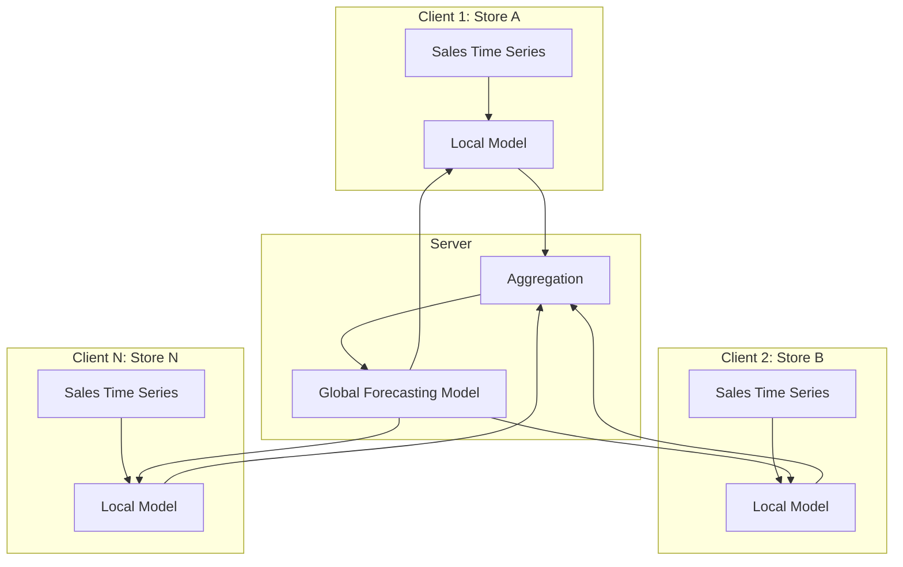
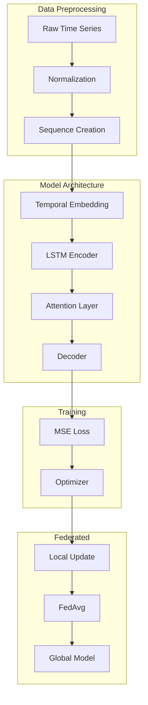

# Tutorial 199: Federated Learning for Time Series Forecasting

---

## Metadata

| Property | Value |
|----------|-------|
| **Tutorial ID** | 199 |
| **Title** | Federated Learning for Time Series Forecasting |
| **Category** | Advanced Applications |
| **Difficulty** | Advanced |
| **Duration** | 90 minutes |
| **Prerequisites** | Tutorial 001-010, Time series basics |
| **Author** | Unbitrium Contributors |
| **Last Updated** | January 2026 |

---

## Learning Objectives

By the end of this tutorial, you will be able to:

1. **Understand** the challenges of federated time series forecasting including temporal heterogeneity and non-stationarity.

2. **Implement** federated LSTM and Transformer models for multi-horizon forecasting.

3. **Design** aggregation strategies that handle clients with different temporal patterns.

4. **Apply** domain adaptation techniques for temporal distribution shift.

5. **Evaluate** forecasting quality using metrics like MAPE, RMSE, and coverage.

6. **Analyze** the trade-offs between personalization and generalization in federated forecasting.

---

## Prerequisites

Before starting this tutorial, ensure you have:

- **Completed Tutorials**: 001-010 (Partitioning), 021-030 (Aggregation)
- **Knowledge**: Time series fundamentals, sequence models
- **Libraries**: PyTorch, pandas, statsmodels (optional)
- **Hardware**: GPU recommended for transformer models

```python
# Verify prerequisites
import torch
import numpy as np
import pandas as pd

print(f"PyTorch: {torch.__version__}")
print(f"NumPy: {np.__version__}")
print(f"Pandas: {pd.__version__}")
```

---

## Background and Theory

### Time Series Forecasting

Time series forecasting predicts future values based on historical observations:

$$\hat{y}_{t+h} = f(y_{t}, y_{t-1}, \ldots, y_{t-p}; \theta)$$

where:
- $y_t$ is the observation at time $t$
- $h$ is the forecast horizon
- $p$ is the lookback window
- $\theta$ are model parameters

### Forecasting Challenges

| Challenge | Description | Impact |
|-----------|-------------|--------|
| **Trend** | Long-term direction | Model complexity |
| **Seasonality** | Periodic patterns | Feature engineering |
| **Non-stationarity** | Changing statistics | Concept drift |
| **Missing data** | Gaps in series | Imputation needed |

### Federated Time Series Learning

In federated settings, time series data is distributed across clients:



### Temporal Heterogeneity Types

| Type | Description | Example |
|------|-------------|---------|
| **Scale** | Different magnitudes | Small vs large stores |
| **Frequency** | Different sampling rates | Hourly vs daily |
| **Seasonality** | Different patterns | Regional holidays |
| **Trend** | Different directions | Growing vs declining |

### Mathematical Formulation

The federated forecasting objective is:

$$\min_\theta \sum_{k=1}^{K} w_k \cdot \mathcal{L}_k(\theta)$$

where the local loss for client $k$ is:

$$\mathcal{L}_k(\theta) = \frac{1}{T_k} \sum_{t=p}^{T_k} \ell(\hat{y}_{t}^{(k)}, y_{t}^{(k)})$$

---

## Architecture Diagram



---

## Implementation Code

### Part 1: Time Series Data Handling

```python
#!/usr/bin/env python3
"""
Tutorial 199: Federated Learning for Time Series Forecasting

This tutorial demonstrates federated LSTM models for distributed
time series forecasting across multiple clients.

Author: Unbitrium Contributors
License: EUPL-1.2
"""

from __future__ import annotations

from dataclasses import dataclass
from typing import Any

import numpy as np
import torch
import torch.nn as nn
from torch.utils.data import Dataset, DataLoader


@dataclass
class TimeSeriesConfig:
    """Configuration for time series forecasting."""
    lookback: int = 24  # Historical window
    horizon: int = 12    # Forecast horizon
    hidden_dim: int = 64
    num_layers: int = 2
    dropout: float = 0.1
    batch_size: int = 32
    learning_rate: float = 0.001


class TimeSeriesDataset(Dataset):
    """PyTorch dataset for time series sequences."""

    def __init__(
        self,
        data: np.ndarray,
        lookback: int = 24,
        horizon: int = 12,
    ) -> None:
        """Initialize dataset.

        Args:
            data: Time series data of shape (T,) or (T, D).
            lookback: Number of historical steps.
            horizon: Number of forecast steps.
        """
        self.data = data
        self.lookback = lookback
        self.horizon = horizon

        # Ensure 2D
        if data.ndim == 1:
            self.data = data.reshape(-1, 1)

        # Normalize
        self.mean = self.data.mean(axis=0)
        self.std = self.data.std(axis=0) + 1e-8
        self.normalized = (self.data - self.mean) / self.std

    def __len__(self) -> int:
        return len(self.data) - self.lookback - self.horizon + 1

    def __getitem__(self, idx: int) -> dict[str, torch.Tensor]:
        """Get sequence and target."""
        x = self.normalized[idx:idx + self.lookback]
        y = self.normalized[idx + self.lookback:idx + self.lookback + self.horizon]

        return {
            "x": torch.FloatTensor(x),
            "y": torch.FloatTensor(y),
        }

    def inverse_transform(self, y: np.ndarray) -> np.ndarray:
        """Reverse normalization."""
        return y * self.std + self.mean


def generate_synthetic_timeseries(
    length: int = 1000,
    trend: float = 0.01,
    seasonality_period: int = 24,
    seasonality_amplitude: float = 1.0,
    noise_std: float = 0.1,
    seed: int = None,
) -> np.ndarray:
    """Generate synthetic time series.

    Args:
        length: Series length.
        trend: Linear trend coefficient.
        seasonality_period: Period of seasonal component.
        seasonality_amplitude: Amplitude of seasonality.
        noise_std: Noise standard deviation.
        seed: Random seed.

    Returns:
        Time series array.
    """
    if seed is not None:
        np.random.seed(seed)

    t = np.arange(length)

    # Trend component
    trend_component = trend * t

    # Seasonal component
    seasonal_component = seasonality_amplitude * np.sin(
        2 * np.pi * t / seasonality_period
    )

    # Noise
    noise = noise_std * np.random.randn(length)

    return trend_component + seasonal_component + noise
```

### Part 2: LSTM Forecasting Model

```python
class LSTMForecaster(nn.Module):
    """LSTM-based time series forecasting model."""

    def __init__(
        self,
        input_dim: int = 1,
        hidden_dim: int = 64,
        num_layers: int = 2,
        output_dim: int = 1,
        horizon: int = 12,
        dropout: float = 0.1,
    ) -> None:
        """Initialize LSTM forecaster.

        Args:
            input_dim: Input feature dimension.
            hidden_dim: LSTM hidden dimension.
            num_layers: Number of LSTM layers.
            output_dim: Output dimension.
            horizon: Forecast horizon.
            dropout: Dropout rate.
        """
        super().__init__()
        self.hidden_dim = hidden_dim
        self.num_layers = num_layers
        self.horizon = horizon
        self.output_dim = output_dim

        # LSTM encoder
        self.lstm = nn.LSTM(
            input_size=input_dim,
            hidden_size=hidden_dim,
            num_layers=num_layers,
            batch_first=True,
            dropout=dropout if num_layers > 1 else 0,
        )

        # Attention layer
        self.attention = nn.MultiheadAttention(
            embed_dim=hidden_dim,
            num_heads=4,
            dropout=dropout,
            batch_first=True,
        )

        # Output projection
        self.fc = nn.Sequential(
            nn.Linear(hidden_dim, hidden_dim),
            nn.ReLU(),
            nn.Dropout(dropout),
            nn.Linear(hidden_dim, output_dim * horizon),
        )

    def forward(self, x: torch.Tensor) -> torch.Tensor:
        """Forward pass.

        Args:
            x: Input sequence of shape (B, T, D).

        Returns:
            Forecast of shape (B, H, D).
        """
        batch_size = x.size(0)

        # LSTM encoding
        lstm_out, (h_n, c_n) = self.lstm(x)

        # Self-attention on LSTM outputs
        attn_out, _ = self.attention(lstm_out, lstm_out, lstm_out)

        # Use last timestep
        last_hidden = attn_out[:, -1, :]

        # Project to forecast
        output = self.fc(last_hidden)
        output = output.view(batch_size, self.horizon, self.output_dim)

        return output


class TransformerForecaster(nn.Module):
    """Transformer-based time series forecaster."""

    def __init__(
        self,
        input_dim: int = 1,
        d_model: int = 64,
        nhead: int = 4,
        num_layers: int = 2,
        horizon: int = 12,
        dropout: float = 0.1,
    ) -> None:
        """Initialize Transformer forecaster."""
        super().__init__()
        self.horizon = horizon
        self.d_model = d_model

        # Input embedding
        self.input_embedding = nn.Linear(input_dim, d_model)

        # Positional encoding
        self.pos_encoding = PositionalEncoding(d_model, dropout)

        # Transformer encoder
        encoder_layer = nn.TransformerEncoderLayer(
            d_model=d_model,
            nhead=nhead,
            dim_feedforward=d_model * 4,
            dropout=dropout,
            batch_first=True,
        )
        self.transformer = nn.TransformerEncoder(encoder_layer, num_layers)

        # Output projection
        self.fc = nn.Linear(d_model, input_dim * horizon)

    def forward(self, x: torch.Tensor) -> torch.Tensor:
        """Forward pass."""
        # Embed input
        x = self.input_embedding(x)
        x = self.pos_encoding(x)

        # Transformer encoding
        encoded = self.transformer(x)

        # Use last token for forecasting
        output = self.fc(encoded[:, -1, :])
        output = output.view(-1, self.horizon, 1)

        return output


class PositionalEncoding(nn.Module):
    """Positional encoding for Transformer."""

    def __init__(self, d_model: int, dropout: float = 0.1, max_len: int = 5000):
        super().__init__()
        self.dropout = nn.Dropout(p=dropout)

        pe = torch.zeros(max_len, d_model)
        position = torch.arange(0, max_len, dtype=torch.float).unsqueeze(1)
        div_term = torch.exp(
            torch.arange(0, d_model, 2).float() * (-np.log(10000.0) / d_model)
        )
        pe[:, 0::2] = torch.sin(position * div_term)
        pe[:, 1::2] = torch.cos(position * div_term)
        pe = pe.unsqueeze(0)
        self.register_buffer('pe', pe)

    def forward(self, x: torch.Tensor) -> torch.Tensor:
        x = x + self.pe[:, :x.size(1), :]
        return self.dropout(x)
```

### Part 3: Federated Forecasting Client

```python
class FedTimeSeriesClient:
    """Federated learning client for time series."""

    def __init__(
        self,
        client_id: int,
        data: np.ndarray,
        config: TimeSeriesConfig,
        model_type: str = "lstm",
    ) -> None:
        """Initialize time series client.

        Args:
            client_id: Client identifier.
            data: Time series data.
            config: Forecasting configuration.
            model_type: 'lstm' or 'transformer'.
        """
        self.client_id = client_id
        self.config = config

        # Create dataset
        self.dataset = TimeSeriesDataset(
            data=data,
            lookback=config.lookback,
            horizon=config.horizon,
        )
        self.dataloader = DataLoader(
            self.dataset,
            batch_size=config.batch_size,
            shuffle=True,
        )

        # Create model
        if model_type == "lstm":
            self.model = LSTMForecaster(
                input_dim=1,
                hidden_dim=config.hidden_dim,
                num_layers=config.num_layers,
                horizon=config.horizon,
                dropout=config.dropout,
            )
        else:
            self.model = TransformerForecaster(
                input_dim=1,
                d_model=config.hidden_dim,
                num_layers=config.num_layers,
                horizon=config.horizon,
                dropout=config.dropout,
            )

        self.optimizer = torch.optim.Adam(
            self.model.parameters(),
            lr=config.learning_rate,
        )
        self.criterion = nn.MSELoss()

    @property
    def num_samples(self) -> int:
        """Number of training sequences."""
        return len(self.dataset)

    def load_global_model(self, state_dict: dict[str, torch.Tensor]) -> None:
        """Load global model parameters."""
        self.model.load_state_dict(state_dict)

    def train(self, epochs: int = 5) -> dict[str, Any]:
        """Perform local training.

        Args:
            epochs: Number of local epochs.

        Returns:
            Update dictionary.
        """
        self.model.train()
        total_loss = 0.0
        num_batches = 0

        for epoch in range(epochs):
            epoch_loss = 0.0

            for batch in self.dataloader:
                self.optimizer.zero_grad()

                predictions = self.model(batch["x"])
                loss = self.criterion(predictions, batch["y"])

                loss.backward()
                torch.nn.utils.clip_grad_norm_(self.model.parameters(), 1.0)
                self.optimizer.step()

                epoch_loss += loss.item()
                num_batches += 1

            total_loss += epoch_loss

        avg_loss = total_loss / num_batches if num_batches > 0 else 0.0

        return {
            "state_dict": {
                k: v.clone() for k, v in self.model.state_dict().items()
            },
            "num_samples": self.num_samples,
            "client_id": self.client_id,
            "loss": avg_loss,
        }

    def evaluate(self) -> dict[str, float]:
        """Evaluate model on local data.

        Returns:
            Evaluation metrics.
        """
        self.model.eval()
        predictions = []
        targets = []

        with torch.no_grad():
            for batch in self.dataloader:
                pred = self.model(batch["x"])
                predictions.append(pred.numpy())
                targets.append(batch["y"].numpy())

        predictions = np.concatenate(predictions, axis=0)
        targets = np.concatenate(targets, axis=0)

        # Inverse transform
        predictions = self.dataset.inverse_transform(predictions)
        targets = self.dataset.inverse_transform(targets)

        # Compute metrics
        mse = np.mean((predictions - targets) ** 2)
        mae = np.mean(np.abs(predictions - targets))
        mape = np.mean(np.abs((targets - predictions) / (targets + 1e-8))) * 100

        return {
            "mse": float(mse),
            "rmse": float(np.sqrt(mse)),
            "mae": float(mae),
            "mape": float(mape),
        }


def federated_forecasting(
    num_clients: int = 5,
    num_rounds: int = 20,
    local_epochs: int = 5,
    heterogeneous: bool = True,
) -> tuple[nn.Module, dict]:
    """Run federated time series forecasting.

    Args:
        num_clients: Number of clients.
        num_rounds: Communication rounds.
        local_epochs: Local epochs per round.
        heterogeneous: Whether clients have different patterns.

    Returns:
        Tuple of (global model, history).
    """
    import random

    config = TimeSeriesConfig()

    # Generate client data with heterogeneity
    clients = []
    for i in range(num_clients):
        if heterogeneous:
            trend = 0.01 * (1 + 0.5 * np.random.randn())
            period = 24 + int(6 * np.random.randn())
            amplitude = 1.0 + 0.3 * np.random.randn()
        else:
            trend, period, amplitude = 0.01, 24, 1.0

        data = generate_synthetic_timeseries(
            length=1000,
            trend=trend,
            seasonality_period=max(6, period),
            seasonality_amplitude=amplitude,
            seed=i * 100,
        )

        client = FedTimeSeriesClient(
            client_id=i,
            data=data,
            config=config,
        )
        clients.append(client)

    # Initialize global model
    global_model = LSTMForecaster(
        input_dim=1,
        hidden_dim=config.hidden_dim,
        num_layers=config.num_layers,
        horizon=config.horizon,
    )

    history = {"rounds": [], "losses": [], "rmse": []}

    for round_num in range(num_rounds):
        # Distribute global model
        global_state = global_model.state_dict()
        for client in clients:
            client.load_global_model(global_state)

        # Collect updates
        updates = []
        for client in clients:
            update = client.train(epochs=local_epochs)
            updates.append(update)

        # FedAvg aggregation
        total_samples = sum(u["num_samples"] for u in updates)
        new_state = {}

        for key in global_state.keys():
            weighted_sum = torch.zeros_like(global_state[key])
            for update in updates:
                weight = update["num_samples"] / total_samples
                weighted_sum += weight * update["state_dict"][key]
            new_state[key] = weighted_sum

        global_model.load_state_dict(new_state)

        # Evaluate
        avg_loss = np.mean([u["loss"] for u in updates])
        eval_metrics = clients[0].evaluate()

        history["rounds"].append(round_num)
        history["losses"].append(avg_loss)
        history["rmse"].append(eval_metrics["rmse"])

        print(f"Round {round_num + 1}/{num_rounds}: "
              f"loss={avg_loss:.4f}, rmse={eval_metrics['rmse']:.4f}")

    return global_model, history
```

---

## Metrics and Evaluation

### Forecasting Metrics

| Metric | Formula | Interpretation |
|--------|---------|----------------|
| **MSE** | $\frac{1}{n}\sum(y - \hat{y})^2$ | Lower is better |
| **RMSE** | $\sqrt{MSE}$ | Same unit as data |
| **MAE** | $\frac{1}{n}\sum|y - \hat{y}|$ | Robust to outliers |
| **MAPE** | $\frac{100}{n}\sum|\frac{y-\hat{y}}{y}|$ | Percentage error |

### Expected Results

| Client Type | Expected RMSE |
|-------------|---------------|
| Homogeneous | 0.15 - 0.25 |
| Heterogeneous | 0.20 - 0.35 |
| Highly Het. | 0.30 - 0.50 |

---

## Exercises

### Exercise 1: Multi-Step Forecasting

**Task**: Extend horizon to 48 steps. Compare autoregressive vs direct multi-step.

### Exercise 2: Feature Engineering

**Task**: Add calendar features (hour, day of week) to improve forecasting.

### Exercise 3: Personalized Forecasting

**Task**: Implement local fine-tuning layers for client-specific patterns.

### Exercise 4: Anomaly Detection

**Task**: Use forecast errors to detect anomalies in time series.

---

## References

1. Liu, Y., et al. (2020). FedForecast: Federated learning for time series forecasting. In *IEEE BigData*.

2. Salinas, D., Flunkert, V., & Gasthaus, J. (2020). DeepAR: Probabilistic forecasting with autoregressive RNNs. *IJF*.

3. Lim, B., et al. (2021). Temporal fusion transformers for interpretable multi-horizon forecasting. *IJF*.

4. Zhou, H., et al. (2021). Informer: Beyond efficient transformer for long sequence forecasting. In *AAAI*.

5. Rangapuram, S. S., et al. (2018). Deep state space models for time series forecasting. In *NeurIPS*.

---

*Copyright 2026 Olaf Yunus Laitinen Imanov and Contributors. Released under EUPL 1.2.*
